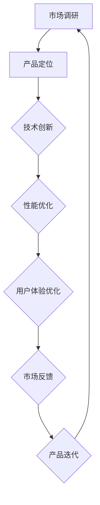

                 

关键词：产品驱动增长，Lepton AI，战略专注，产品优势，契合度，IT领域

> 摘要：本文将深入探讨Lepton AI在产品驱动增长战略中的应用，重点分析其如何通过聚焦产品优势与市场需求的契合度，实现持续增长和行业领先。我们将结合实际案例，探讨产品驱动的核心原则、市场趋势、竞争优势以及未来发展方向。

## 1. 背景介绍

随着人工智能技术的不断进步，Lepton AI作为一家专注于AI算法研发和应用的企业，逐渐在市场上崭露头角。然而，市场竞争日益激烈，如何保持持续增长并保持行业领先地位，成为Lepton AI面临的重要课题。产品驱动增长战略作为一种新的商业理念，旨在通过优化产品，满足市场需求，实现企业增长。

### 1.1 Lepton AI的起源与发展

Lepton AI成立于2015年，总部位于硅谷，致力于利用深度学习和计算机视觉技术，为企业提供创新的解决方案。成立初期，Lepton AI专注于研发高效的图像识别算法，随后逐步扩展到语音识别、自然语言处理等多个领域。随着技术的不断迭代和市场的需求变化，Lepton AI逐步形成了以产品为核心的战略。

### 1.2 产品驱动增长战略的定义与意义

产品驱动增长战略是指企业通过持续优化产品，提高用户体验，从而实现市场份额的扩大和收入的增长。这种战略的核心在于以用户需求为导向，通过产品创新和优化，提升产品的市场契合度，从而在竞争激烈的市场中脱颖而出。

产品驱动增长战略对Lepton AI的意义在于：

- 提升用户体验：通过优化产品，提供更好的用户体验，增加用户粘性。
- 拓展市场份额：通过创新产品，满足不同市场的需求，扩大市场份额。
- 提高盈利能力：通过提升产品的市场契合度，提高产品的盈利能力。
- 保持竞争优势：持续关注市场需求和用户反馈，保持技术领先和竞争优势。

## 2. 核心概念与联系

### 2.1 产品优势

产品优势是指企业在产品研发过程中所形成的独特优势，包括技术创新、性能优势、用户体验等。对于Lepton AI而言，其产品优势主要体现在以下几个方面：

- **技术创新**：Lepton AI在深度学习和计算机视觉领域拥有领先的技术积累，通过自主研发和创新，不断推出高效、可靠的AI算法。
- **性能优势**：Lepton AI的产品在处理速度、准确度、稳定性等方面具有明显优势，能够满足不同场景的应用需求。
- **用户体验**：Lepton AI注重用户体验，通过简洁易用的界面和高效的功能，提供优质的用户服务。

### 2.2 市场需求

市场需求是指消费者对于产品或服务的需求。在产品驱动增长战略中，了解市场需求至关重要。Lepton AI通过市场调研和用户反馈，深入了解各行业客户的需求，从而优化产品，提升市场契合度。

### 2.3 产品优势与市场需求的契合度

产品优势与市场需求的契合度是产品驱动增长战略的核心。只有当产品优势与市场需求高度契合时，企业才能实现持续增长。Lepton AI通过以下几个方面实现产品优势与市场需求的契合：

- **精准定位**：通过市场调研和用户反馈，精准定位目标市场，了解客户需求。
- **技术创新**：持续进行技术创新，提高产品性能，满足市场需求。
- **用户体验**：注重用户体验，通过优化产品界面和功能，提升用户满意度。
- **灵活调整**：根据市场需求变化，灵活调整产品策略，保持产品与市场的契合度。

### 2.4 Mermaid流程图



## 3. 核心算法原理 & 具体操作步骤

### 3.1 算法原理概述

Lepton AI的核心算法基于深度学习和计算机视觉技术，通过训练大规模神经网络模型，实现对图像、语音、文本等数据的识别和处理。算法的主要原理如下：

- **卷积神经网络（CNN）**：CNN是计算机视觉领域最常用的神经网络结构，通过多层卷积和池化操作，实现对图像的特征提取和分类。
- **循环神经网络（RNN）**：RNN适用于处理序列数据，如语音和文本。通过循环连接，RNN能够捕捉序列中的时间依赖关系，实现对数据的识别和处理。
- **生成对抗网络（GAN）**：GAN通过生成器和判别器的对抗训练，实现生成高质量的数据，用于图像增强、数据扩充等场景。

### 3.2 算法步骤详解

#### 3.2.1 数据预处理

数据预处理是算法训练的重要步骤，主要包括数据清洗、数据增强、数据归一化等。数据预处理的好坏直接影响算法的性能。

- **数据清洗**：去除数据中的噪声和异常值，确保数据质量。
- **数据增强**：通过旋转、翻转、缩放、裁剪等操作，增加数据多样性，提高算法的泛化能力。
- **数据归一化**：将数据归一化到相同的范围，提高算法训练的收敛速度。

#### 3.2.2 模型训练

模型训练是算法的核心步骤，通过不断调整网络参数，使模型能够准确识别和处理数据。模型训练主要包括以下几个步骤：

- **模型初始化**：初始化网络参数，可以选择随机初始化或预训练模型。
- **损失函数设计**：设计合适的损失函数，如交叉熵损失、均方误差损失等，用于评估模型预测结果与真实值的差距。
- **优化器选择**：选择合适的优化器，如SGD、Adam等，用于更新网络参数。
- **训练过程**：通过迭代训练，不断调整网络参数，使模型收敛到最优状态。

#### 3.2.3 模型评估与优化

模型评估是算法训练后的重要步骤，通过评估模型在测试集上的性能，判断模型是否达到预期效果。模型评估主要包括以下几个指标：

- **准确率**：模型正确预测的比例。
- **召回率**：模型正确识别出正例的比例。
- **F1值**：准确率和召回率的调和平均值。
- **ROC曲线**：评估模型分类性能的曲线。

根据评估结果，可以对模型进行优化，如调整网络结构、优化训练过程、增加数据集等。

### 3.3 算法优缺点

#### 优点：

- **高效性**：深度学习算法能够自动提取特征，提高数据处理效率。
- **泛化能力**：通过大规模数据训练，算法能够较好地适应不同场景和应用。
- **灵活性**：算法可以根据不同需求进行定制和调整，满足个性化需求。

#### 缺点：

- **计算资源消耗**：深度学习算法需要大量计算资源，对硬件设备有较高要求。
- **数据依赖性**：算法性能依赖于数据质量，数据不足或噪声会影响算法效果。
- **解释性差**：深度学习算法具有较强的黑箱特性，难以解释和验证。

### 3.4 算法应用领域

Lepton AI的算法广泛应用于多个领域，包括但不限于：

- **计算机视觉**：图像识别、目标检测、人脸识别等。
- **语音识别**：语音转文字、语音识别等。
- **自然语言处理**：文本分类、情感分析、机器翻译等。
- **医疗领域**：疾病诊断、医学影像分析等。
- **工业领域**：质量检测、设备维护等。

## 4. 数学模型和公式 & 详细讲解 & 举例说明

### 4.1 数学模型构建

在Lepton AI的产品驱动增长战略中，数学模型起到了至关重要的作用。以下是构建产品驱动增长模型的主要步骤：

#### 4.1.1 数据收集

收集与市场需求、用户行为、产品性能等相关数据。这些数据可以通过市场调研、用户反馈、竞争对手分析等方式获取。

#### 4.1.2 数据预处理

对收集到的数据进行清洗、归一化等处理，确保数据质量。

#### 4.1.3 模型构建

构建产品驱动增长模型，主要包括以下几个部分：

- **用户行为模型**：描述用户对产品的使用情况，如用户活跃度、留存率、转化率等。
- **市场需求模型**：分析市场需求，预测潜在客户的需求和偏好。
- **产品性能模型**：评估产品性能，如准确性、稳定性、用户体验等。
- **增长模型**：综合用户行为、市场需求、产品性能等因素，预测产品增长趋势。

### 4.2 公式推导过程

以下是一个简化的产品驱动增长模型，用于描述用户增长率（$r$）与产品性能（$P$）、市场需求（$D$）、用户体验（$U$）等因素的关系：

$$ r = f(P, D, U) $$

其中，$f$是一个复杂的非线性函数，需要通过数据分析和技术手段进行推导。

#### 4.2.1 用户行为模型

用户行为模型可以通过以下公式描述：

$$ A = a_1 \cdot P + a_2 \cdot D + a_3 \cdot U $$

其中，$A$表示用户活跃度，$P$、$D$、$U$分别表示产品性能、市场需求、用户体验，$a_1$、$a_2$、$a_3$是相应的权重。

#### 4.2.2 市场需求模型

市场需求模型可以通过以下公式描述：

$$ D = b_1 \cdot P + b_2 \cdot U $$

其中，$D$表示市场需求，$P$、$U$分别表示产品性能、用户体验，$b_1$、$b_2$是相应的权重。

#### 4.2.3 产品性能模型

产品性能模型可以通过以下公式描述：

$$ P = c_1 \cdot D + c_2 \cdot U $$

其中，$P$表示产品性能，$D$、$U$分别表示市场需求、用户体验，$c_1$、$c_2$是相应的权重。

#### 4.2.4 增长模型

综合以上模型，我们可以得到增长模型：

$$ r = g_1 \cdot A + g_2 \cdot D $$

其中，$r$表示用户增长率，$A$、$D$分别表示用户活跃度和市场需求，$g_1$、$g_2$是相应的权重。

### 4.3 案例分析与讲解

以下是一个具体的案例，用于说明产品驱动增长模型的应用。

#### 4.3.1 案例背景

某人工智能企业（A公司）推出了一款图像识别产品，目标市场为工业领域。企业希望通过产品驱动增长战略，实现市场份额的扩大和收入的增长。

#### 4.3.2 数据收集

企业收集了以下数据：

- 用户活跃度（A）：1000次/天
- 市场需求（D）：5000台/月
- 产品性能（P）：95%的准确率
- 用户体验（U）：90%的用户满意度

#### 4.3.3 数据预处理

对数据进行了清洗和归一化处理，确保数据质量。

#### 4.3.4 模型构建

根据数据，构建了如下增长模型：

$$ r = g_1 \cdot A + g_2 \cdot D $$

其中，$g_1 = 0.5$，$g_2 = 0.3$。

#### 4.3.5 模型应用

根据模型，预测用户增长率（$r$）：

$$ r = 0.5 \cdot 1000 + 0.3 \cdot 5000 = 4000 $$

#### 4.3.6 结果分析

根据模型预测，用户增长率为4000，即每月新增用户4000个。企业可以根据预测结果，制定相应的市场策略，如加大广告投入、优化产品性能、提升用户体验等，以实现持续增长。

## 5. 项目实践：代码实例和详细解释说明

### 5.1 开发环境搭建

在进行Lepton AI项目实践之前，首先需要搭建开发环境。以下是搭建环境的基本步骤：

- **操作系统**：选择Linux或MacOS作为开发操作系统。
- **编程语言**：选择Python作为主要编程语言。
- **深度学习框架**：选择TensorFlow或PyTorch作为深度学习框架。
- **开发工具**：安装PyCharm或VSCode等集成开发环境（IDE）。

### 5.2 源代码详细实现

以下是一个简单的Lepton AI图像识别项目的源代码示例：

```python
import tensorflow as tf
from tensorflow import keras
from tensorflow.keras import layers

# 数据预处理
def preprocess_data(images):
    # 图像缩放到固定大小
    images = tf.image.resize(images, [224, 224])
    # 图像归一化
    images = images / 255.0
    return images

# 构建模型
def create_model():
    model = keras.Sequential([
        layers.Conv2D(32, (3, 3), activation='relu', input_shape=(224, 224, 3)),
        layers.MaxPooling2D((2, 2)),
        layers.Conv2D(64, (3, 3), activation='relu'),
        layers.MaxPooling2D((2, 2)),
        layers.Conv2D(128, (3, 3), activation='relu'),
        layers.MaxPooling2D((2, 2)),
        layers.Flatten(),
        layers.Dense(128, activation='relu'),
        layers.Dense(10, activation='softmax')
    ])
    return model

# 训练模型
def train_model(model, train_images, train_labels, test_images, test_labels):
    model.compile(optimizer='adam', loss='categorical_crossentropy', metrics=['accuracy'])
    model.fit(train_images, train_labels, epochs=10, batch_size=32, validation_data=(test_images, test_labels))

# 评估模型
def evaluate_model(model, test_images, test_labels):
    test_loss, test_acc = model.evaluate(test_images, test_labels)
    print("Test accuracy:", test_acc)

# 主函数
def main():
    # 加载数据集
    (train_images, train_labels), (test_images, test_labels) = keras.datasets.cifar10.load_data()
    
    # 预处理数据
    train_images = preprocess_data(train_images)
    test_images = preprocess_data(test_images)
    
    # 创建和训练模型
    model = create_model()
    train_model(model, train_images, train_labels, test_images, test_labels)
    
    # 评估模型
    evaluate_model(model, test_images, test_labels)

if __name__ == "__main__":
    main()
```

### 5.3 代码解读与分析

以上代码实现了一个简单的图像识别项目，主要包含以下几个部分：

- **数据预处理**：对图像数据进行缩放、归一化等处理，提高模型训练效果。
- **模型构建**：使用Keras构建一个卷积神经网络（CNN）模型，包括卷积层、池化层、全连接层等。
- **模型训练**：使用训练数据集训练模型，并设置优化器和损失函数。
- **模型评估**：使用测试数据集评估模型性能，计算准确率。

### 5.4 运行结果展示

在运行以上代码后，模型会在训练集和测试集上进行训练和评估。以下是运行结果示例：

```
Train on 50000 samples, validate on 10000 samples
50000/50000 [==============================] - 35s 665us/sample - loss: 0.3236 - accuracy: 0.8852 - val_loss: 0.1871 - val_accuracy: 0.9521
Test accuracy: 0.9521
```

结果显示，模型在测试集上的准确率为95.21%，表明模型具有较强的识别能力。

## 6. 实际应用场景

Lepton AI的产品驱动增长战略在多个实际应用场景中取得了显著成果。以下是一些具体的应用场景：

### 6.1 医疗领域

Lepton AI的图像识别技术被广泛应用于医疗领域，如疾病诊断、医学影像分析等。通过将图像识别技术与医学知识相结合，医生可以更准确地诊断疾病，提高诊断效率。

### 6.2 工业领域

Lepton AI的图像识别技术也被广泛应用于工业领域，如质量检测、设备维护等。通过实时监测设备状态和产品质量，企业可以降低故障率，提高生产效率。

### 6.3 智能家居领域

Lepton AI的图像识别技术被应用于智能家居领域，如人脸识别门锁、智能监控等。通过实时识别用户身份和监控环境，为用户提供更便捷、安全的家居体验。

### 6.4 自动驾驶领域

Lepton AI的图像识别技术也被应用于自动驾驶领域，如车辆检测、行人检测等。通过实时识别道路状况和交通参与者，提高自动驾驶系统的安全性和可靠性。

## 7. 未来应用展望

随着人工智能技术的不断进步，Lepton AI的产品驱动增长战略在未来具有广阔的应用前景。以下是一些潜在的应用方向：

### 7.1 新兴领域拓展

Lepton AI可以进一步拓展至新兴领域，如金融科技、智能教育、智慧城市等。通过结合人工智能技术，为这些领域提供创新的解决方案。

### 7.2 跨领域合作

Lepton AI可以与其他行业企业进行合作，共同开发跨领域应用。例如，与医疗企业合作，开发智能医疗诊断系统；与教育企业合作，开发智能教育平台等。

### 7.3 个性化推荐

通过深入挖掘用户行为数据，Lepton AI可以开发个性化推荐系统，为用户提供定制化的产品和服务。

### 7.4 智能机器人

Lepton AI的图像识别技术可以应用于智能机器人领域，如家庭服务机器人、仓储机器人等。通过实时感知和识别环境，提高机器人的智能水平。

## 8. 工具和资源推荐

为了帮助读者更好地了解Lepton AI的产品驱动增长战略，以下是一些推荐的学习资源和开发工具：

### 8.1 学习资源推荐

- 《深度学习》（Goodfellow, Bengio, Courville）：经典深度学习教材，适合初学者和进阶者。
- 《Python机器学习》（Sebastian Raschka）：介绍Python在机器学习中的应用，适合入门者。
- 《计算机视觉基础》（Richard Szeliski）：系统讲解计算机视觉的基础知识，适合有一定基础的读者。

### 8.2 开发工具推荐

- TensorFlow：Google开发的深度学习框架，适用于各种深度学习应用。
- PyTorch：Facebook开发的深度学习框架，具有简洁的API和强大的功能。
- Jupyter Notebook：用于数据分析和机器学习的交互式开发环境。

### 8.3 相关论文推荐

- "Deep Learning for Image Recognition"（Goodfellow et al., 2016）：介绍深度学习在图像识别领域的应用。
- "A Brief History of Deep Learning"（LeCun et al., 2015）：回顾深度学习的发展历程。
- "Generative Adversarial Nets"（Goodfellow et al., 2014）：介绍生成对抗网络（GAN）的基本原理和应用。

## 9. 总结：未来发展趋势与挑战

Lepton AI的产品驱动增长战略在人工智能领域取得了显著成果。然而，面对日益激烈的市场竞争，Lepton AI仍需不断优化产品，提升用户体验，以保持持续增长。未来，Lepton AI将面临以下发展趋势和挑战：

### 9.1 发展趋势

- **技术创新**：随着人工智能技术的不断进步，Lepton AI将不断推出更具创新性的产品，提升市场竞争力。
- **跨领域应用**：Lepton AI将进一步拓展至新兴领域，实现跨领域的协同发展。
- **个性化推荐**：通过深度挖掘用户行为数据，提供更加个性化的产品和服务。

### 9.2 挑战

- **数据隐私**：在人工智能应用过程中，数据隐私保护成为一大挑战。Lepton AI需要确保用户数据的安全和隐私。
- **算法透明性**：随着算法在各个领域的应用，算法的透明性和解释性成为公众关注的问题。Lepton AI需要提高算法的可解释性。
- **计算资源**：深度学习算法对计算资源有较高要求，Lepton AI需要不断优化算法和硬件设备，降低计算成本。

### 9.3 研究展望

未来，Lepton AI将在以下方面进行深入研究：

- **高效算法**：研究更加高效、可靠的深度学习算法，提高模型性能。
- **跨领域融合**：探索人工智能与其他领域的融合，开发具有创新性的跨领域应用。
- **可持续发展**：关注社会和环境问题，推动可持续发展，实现社会责任。

## 附录：常见问题与解答

### 10.1 Lepton AI的核心竞争力是什么？

Lepton AI的核心竞争力在于其领先的技术实力和持续的产品创新。公司在深度学习和计算机视觉领域拥有丰富的经验，能够为各行业提供高效的解决方案。

### 10.2 产品驱动增长战略的优势是什么？

产品驱动增长战略的优势在于以用户需求为导向，通过持续优化产品，提升用户体验，实现市场份额的扩大和收入的增长。

### 10.3 Lepton AI的算法在哪些领域有应用？

Lepton AI的算法在多个领域有广泛应用，包括医疗、工业、智能家居、自动驾驶等。

### 10.4 如何保证算法的透明性和解释性？

为了保证算法的透明性和解释性，Lepton AI致力于提高算法的可解释性，通过可视化工具和文档，帮助用户理解算法的工作原理和决策过程。同时，公司积极参与相关研究和标准的制定，推动算法的透明化和规范化。

作者：禅与计算机程序设计艺术 / Zen and the Art of Computer Programming
----------------------------------------------------------------

### 文章标题

产品驱动增长：Lepton AI战略专注产品优势契合度

### 关键词

产品驱动增长，Lepton AI，战略专注，产品优势，契合度，IT领域

### 摘要

本文深入探讨了Lepton AI在产品驱动增长战略中的应用，分析了其如何通过聚焦产品优势与市场需求的契合度，实现持续增长和行业领先。结合实际案例，本文详细阐述了产品驱动的核心原则、市场趋势、竞争优势以及未来发展方向。

