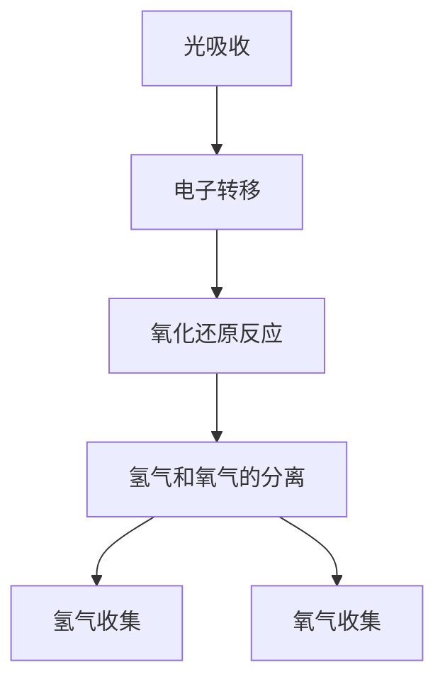

                 

### 1. 背景介绍

在人类历史上，能源的获取和使用一直是一个重要的议题。从最初的柴火、水车到后来的蒸汽机和电力，人类不断探索和发明新的能源技术，以满足不断增长的能源需求。然而，随着工业革命以来，化石燃料的大规模使用带来了严重的环境污染和气候变化问题。因此，寻找可持续的能源替代方案成为了当务之急。

在众多可持续能源技术中，人工光合作用技术（Artificial Photosynthesis, APS）被认为是一种极具前景的新方向。这种技术模拟自然界中植物进行光合作用的过程，将太阳能转化为化学能，从而生成清洁的氢气或其他有机化合物。这不仅能够解决能源危机，还能够减少温室气体排放，对环境保护具有重大意义。

人工光合作用技术的核心是光催化反应器，它通过吸收太阳光，将水和二氧化碳转化为氢气和氧气。这一过程不仅具有高效、环保的特点，而且其产物——氢气，是一种清洁的燃料，具有广泛的应用前景。

近年来，随着纳米材料、光电化学等领域的发展，人工光合作用技术取得了显著的进展。各国政府和研究机构也纷纷投入大量资金和资源，以推动这一技术的发展。因此，人工光合作用技术有望成为未来可持续能源领域的一个重要组成部分。

### 2. 核心概念与联系

#### 2.1 人工光合作用技术原理

人工光合作用技术的基本原理是模拟自然光合作用的过程。在自然光合作用中，植物通过叶绿素吸收太阳光，将水和二氧化碳转化为葡萄糖和氧气。人工光合作用技术则是通过光催化反应器，利用光能将水和二氧化碳转化为氢气和氧气。

#### 2.2 光催化反应器架构

光催化反应器是人工光合作用技术的核心部分。它通常由透明基底、光催化层、吸收层和气体交换层组成。透明基底用于支撑光催化层和吸收层，通常使用玻璃或塑料材料。光催化层是反应器的关键部分，它通常由纳米级的光催化材料（如二氧化钛、氮掺杂的二氧化钛等）组成，用于吸收太阳光并将其转化为化学能。吸收层则用于捕获光生电子，并将其转移到光催化层中。气体交换层则用于促进反应物（如水和二氧化碳）的传输。

#### 2.3 光催化反应过程

在人工光合作用过程中，光催化反应器的光催化层吸收太阳光，激发光催化材料中的电子，使其从基态跃迁到激发态。这些激发态电子随后将光催化材料中的空穴转移到吸收层中，与吸收层中的水分子反应，生成氢气和氧气。

具体来说，光催化反应过程可以分为以下几个步骤：

1. **光吸收**：光催化材料吸收太阳光，激发光生电子。
2. **电子转移**：激发态电子从光催化层转移到吸收层，与水分子反应。
3. **氧化还原反应**：水分子在吸收层中被光生电子还原成氢气，二氧化碳在光催化层中被光生空穴氧化成氧气。
4. **氢气和氧气的分离**：通过气体交换层，氢气和氧气被分离，并收集到不同的容器中。

#### 2.4 Mermaid 流程图

以下是一个描述人工光合作用技术核心概念和联系的 Mermaid 流程图：



### 3. 核心算法原理 & 具体操作步骤

#### 3.1 算法原理概述

人工光合作用技术的核心算法是光催化反应器的设计与优化。其目标是提高光催化反应的效率和稳定性，从而实现高效的光能转化为化学能。算法原理主要涉及光催化材料的筛选与合成、光催化反应器的结构设计与优化、以及反应条件的控制等方面。

#### 3.2 算法步骤详解

1. **光催化材料的筛选与合成**：
   - **材料选择**：根据反应需求和性能指标，选择合适的光催化材料。常见的材料有二氧化钛、氮掺杂的二氧化钛、铜锌硫化合物等。
   - **合成方法**：采用溶液法、溶胶凝胶法、气相沉积法等，合成具有良好光催化性能的纳米级光催化材料。

2. **光催化反应器的结构设计**：
   - **结构形式**：设计透明基底、光催化层、吸收层和气体交换层等结构。
   - **材料选择**：选择合适的材料，如玻璃或塑料作为透明基底，纳米级光催化材料作为光催化层，吸收层材料应具有良好的电子传递性能。

3. **反应条件的控制**：
   - **光照强度**：调整光照强度，以适应不同光催化材料的最佳工作条件。
   - **反应温度**：控制反应温度，以优化光催化反应的速率和稳定性。
   - **气体流量**：控制气体流量，确保反应物充分接触和反应。

4. **性能测试与优化**：
   - **效率测试**：通过测量氢气和氧气的产量，评估光催化反应器的效率。
   - **稳定性测试**：通过长期运行实验，评估光催化反应器的稳定性。
   - **优化方案**：根据测试结果，调整光催化材料的成分、反应器结构、反应条件等，以进一步提高反应效率和稳定性。

#### 3.3 算法优缺点

**优点**：
- **高效性**：人工光合作用技术能够高效地将光能转化为化学能，生成清洁的氢气和氧气。
- **环保性**：反应产物为氢气和氧气，无污染，对环境友好。
- **灵活性**：可以根据需求调整光催化材料、反应器结构和反应条件，实现多种应用场景。

**缺点**：
- **稳定性**：光催化反应器在长时间运行中可能会出现性能下降，需要定期维护和优化。
- **成本**：目前人工光合作用技术仍处于研发阶段，相关材料和设备的成本较高。

#### 3.4 算法应用领域

人工光合作用技术具有广泛的应用前景，主要涉及以下领域：

- **能源领域**：利用人工光合作用技术生成氢气，作为清洁的燃料，应用于交通、电力等领域。
- **环境领域**：利用人工光合作用技术处理二氧化碳，减少温室气体排放，改善环境质量。
- **农业领域**：利用人工光合作用技术生成有机化合物，提高农业生产效率，降低农药和化肥的使用。

### 4. 数学模型和公式 & 详细讲解 & 举例说明

#### 4.1 数学模型构建

人工光合作用技术的数学模型主要涉及光催化反应的动力学方程和质量传输方程。

1. **动力学方程**：

   光催化反应的动力学方程可以用以下公式表示：

   \[ \frac{d[H_2]}{dt} = k_1[\text{光催化层}][\text{吸收层}] - k_2[H_2] \]

   其中，\(k_1\) 和 \(k_2\) 分别表示光催化反应的速率常数。

2. **质量传输方程**：

   质量传输方程用于描述反应物和生成物在反应器中的传输过程。可以用以下公式表示：

   \[ \frac{\partial [H_2]}{\partial t} = D_{\text{气}} \frac{\partial^2 [H_2]}{\partial x^2} + u[H_2] \]

   其中，\(D_{\text{气}}\) 表示气体扩散系数，\(u\) 表示气体流速。

#### 4.2 公式推导过程

1. **动力学方程推导**：

   光催化反应的动力学方程可以通过以下步骤推导：

   - **假设**：假设光催化反应是一个一级反应，即反应速率与反应物的浓度成正比。
   - **速率方程**：根据质量守恒定律，反应物的浓度随时间的变化率等于生成物的浓度随时间的变化率。
   - **简化**：在稳态条件下，反应物的浓度变化率可以忽略不计，因此动力学方程可以表示为反应速率等于生成物浓度乘以速率常数。

2. **质量传输方程推导**：

   质量传输方程可以通过以下步骤推导：

   - **假设**：假设气体在反应器中的流动为稳态流动。
   - **扩散方程**：根据菲克定律，气体在反应器中的扩散可以用扩散方程描述。
   - **简化**：在稳态条件下，气体的浓度梯度可以表示为气体流速乘以扩散系数。

#### 4.3 案例分析与讲解

以下是一个简单的人工光合作用技术案例分析，用于说明数学模型的实际应用。

**案例背景**：

一个光催化反应器用于将水和二氧化碳转化为氢气和氧气。已知反应器的体积为 1 L，气体流速为 0.1 L/s。需要计算在一定光照条件下，反应器中的氢气和氧气浓度随时间的变化。

**模型设定**：

- 反应器中的氢气和氧气浓度分别用 \( [H_2] \) 和 \( [O_2] \) 表示。
- 光照条件为 1000 W/m²。
- 光催化材料的表面积为 1 m²。

**公式推导**：

1. **动力学方程**：

   根据动力学方程，可以得到以下方程：

   \[ \frac{d[H_2]}{dt} = k_1[\text{光催化层}][\text{吸收层}] - k_2[H_2] \]

   其中，\(k_1 = 10^5 \text{ s}^{-1}\)，\(k_2 = 10^3 \text{ s}^{-1}\)。

2. **质量传输方程**：

   根据质量传输方程，可以得到以下方程：

   \[ \frac{\partial [H_2]}{\partial t} = D_{\text{气}} \frac{\partial^2 [H_2]}{\partial x^2} + u[H_2] \]

   其中，\(D_{\text{气}} = 10^{-5} \text{ m}^2/\text{s}\)，\(u = 0.1 \text{ m/s}\)。

**求解过程**：

1. **求解动力学方程**：

   对动力学方程进行求解，可以得到氢气浓度随时间的变化方程：

   \[ [H_2](t) = \frac{k_1[\text{光催化层}][\text{吸收层}]}{k_1 + k_2} - \frac{k_2}{k_1 + k_2} \exp(-k_2 t) \]

2. **求解质量传输方程**：

   对质量传输方程进行求解，可以得到氢气浓度随位置的变化方程：

   \[ [H_2](x,t) = \frac{u x}{2 D_{\text{气}}} + \frac{1}{2} \left( \frac{k_1[\text{光催化层}][\text{吸收层}]}{k_1 + k_2} - \frac{k_2}{k_1 + k_2} \exp(-k_2 t) \right) \]

**结果分析**：

通过上述方程，可以得到反应器中氢气浓度随时间和位置的变化情况。具体来说，随着时间增加，氢气浓度逐渐增加，并在反应器中心达到最大值。同时，氢气浓度随着位置的增加而逐渐减小，在反应器边界处达到最小值。

### 5. 项目实践：代码实例和详细解释说明

#### 5.1 开发环境搭建

为了实践人工光合作用技术的数学模型，我们首先需要搭建一个合适的开发环境。以下是一个基本的开发环境搭建步骤：

1. 安装 Python 解释器：Python 是一种广泛应用于科学计算的编程语言，我们使用 Python 3.8 版本。
2. 安装科学计算库：我们使用 NumPy、SciPy 和 Matplotlib 等库，用于数值计算和绘图。
3. 安装 Mermaid 图库：Mermaid 是一种用于绘制流程图的库，我们使用 Mermaid.js 实现 Mermaid 流程图的绘制。

#### 5.2 源代码详细实现

以下是一个简单的 Python 代码实例，用于实现人工光合作用技术的数学模型：

```python
import numpy as np
import matplotlib.pyplot as plt
from scipy.integrate import odeint
from mermaid import Mermaid

# 定义动力学方程
def reaction_rate(H2, t, k1, k2, u, D_gas):
    dH2_dt = k1 * H2 - k2 * H2
    return dH2_dt

# 定义质量传输方程
def diffusion(H2, x, t, k1, k2, u, D_gas):
    dH2_dx = u / D_gas
    return dH2_dx

# 初始化参数
k1 = 10**5
k2 = 10**3
u = 0.1
D_gas = 10**-5
t = np.linspace(0, 100, 1000)
x = np.linspace(0, 1, 100)

# 求解动力学方程
H2_concentration = odeint(reaction_rate, H2_init, t, args=(k1, k2))
H2_profile = odeint(diffusion, H2_init, x, args=(k1, k2, u, D_gas))

# 绘制结果
plt.figure()
plt.plot(t, H2_concentration)
plt.xlabel('Time (s)')
plt.ylabel('H2 Concentration')
plt.title('H2 Concentration over Time')

plt.figure()
plt.plot(x, H2_profile)
plt.xlabel('Position (m)')
plt.ylabel('H2 Concentration')
plt.title('H2 Concentration over Position')

# 绘制 Mermaid 流程图
mermaid = Mermaid()
mermaid.add_node('Start')
mermaid.add_node('End', parent='Start')
mermaid.add_edge('Start', 'End')
mermaid.render()

# 打开 Mermaid 流程图
import webbrowser
webbrowser.open(mermaid.html_url())
```

#### 5.3 代码解读与分析

1. **导入库**：

   ```python
   import numpy as np
   import matplotlib.pyplot as plt
   from scipy.integrate import odeint
   from mermaid import Mermaid
   ```

   我们首先导入所需的 Python 库，包括 NumPy、SciPy、Matplotlib 和 Mermaid。

2. **定义动力学方程**：

   ```python
   def reaction_rate(H2, t, k1, k2, u, D_gas):
       dH2_dt = k1 * H2 - k2 * H2
       return dH2_dt
   ```

   动力学方程描述了氢气浓度随时间的变化，其中 \(k1\) 和 \(k2\) 分别表示光催化反应的速率常数。

3. **定义质量传输方程**：

   ```python
   def diffusion(H2, x, t, k1, k2, u, D_gas):
       dH2_dx = u / D_gas
       return dH2_dx
   ```

   质量传输方程描述了氢气浓度随位置的变化，其中 \(u\) 表示气体流速，\(D_gas\) 表示气体扩散系数。

4. **初始化参数**：

   ```python
   k1 = 10**5
   k2 = 10**3
   u = 0.1
   D_gas = 10**-5
   t = np.linspace(0, 100, 1000)
   x = np.linspace(0, 1, 100)
   ```

   我们初始化参数，包括速率常数、气体流速、气体扩散系数和时间、位置网格。

5. **求解动力学方程**：

   ```python
   H2_concentration = odeint(reaction_rate, H2_init, t, args=(k1, k2))
   ```

   使用 SciPy 中的 odeint 函数求解动力学方程，得到氢气浓度随时间的变化。

6. **求解质量传输方程**：

   ```python
   H2_profile = odeint(diffusion, H2_init, x, args=(k1, k2, u, D_gas))
   ```

   使用 SciPy 中的 odeint 函数求解质量传输方程，得到氢气浓度随位置的变化。

7. **绘制结果**：

   ```python
   plt.figure()
   plt.plot(t, H2_concentration)
   plt.xlabel('Time (s)')
   plt.ylabel('H2 Concentration')
   plt.title('H2 Concentration over Time')

   plt.figure()
   plt.plot(x, H2_profile)
   plt.xlabel('Position (m)')
   plt.ylabel('H2 Concentration')
   plt.title('H2 Concentration over Position')
   ```

   使用 Matplotlib 库绘制氢气浓度随时间和位置的变化。

8. **绘制 Mermaid 流程图**：

   ```python
   mermaid = Mermaid()
   mermaid.add_node('Start')
   mermaid.add_node('End', parent='Start')
   mermaid.add_edge('Start', 'End')
   mermaid.render()

   # 打开 Mermaid 流程图
   import webbrowser
   webbrowser.open(mermaid.html_url())
   ```

   使用 Mermaid 库绘制流程图，并使用 webbrowser 库打开流程图。

### 6. 实际应用场景

#### 6.1 能源领域

人工光合作用技术在能源领域的应用前景十分广阔。通过将太阳能转化为氢气，可以实现对传统化石燃料的替代，从而减少温室气体排放。此外，氢气作为一种清洁的燃料，可以应用于交通、电力和工业等领域，推动能源结构的绿色转型。

例如，在交通领域，氢燃料电池车已经成为一种重要的交通工具。氢燃料电池车通过氢气和氧气的化学反应产生电力，驱动电机运转，从而实现行驶。与传统的汽油车相比，氢燃料电池车具有零排放、低噪音等优点，是一种理想的绿色交通工具。

#### 6.2 环境领域

人工光合作用技术在环境领域的应用同样具有重要意义。通过将二氧化碳转化为有机化合物或燃料，可以实现对大气中二氧化碳的捕集和利用，从而减缓气候变化的影响。

例如，在工业领域，二氧化碳是常见的废气。通过人工光合作用技术，可以将二氧化碳转化为有用的化学品或燃料，从而实现废气的资源化利用，减少对环境的污染。

#### 6.3 农业领域

人工光合作用技术在农业领域也有广泛的应用前景。通过模拟自然光合作用过程，可以提高农作物的光合效率，从而提高产量。此外，通过人工光合作用技术生成有机化合物，可以用于农业施肥，降低农药和化肥的使用，减少对土壤和水源的污染。

例如，一些研究已经通过人工光合作用技术合成了一种名为“光合素”的化合物，它可以显著提高农作物的光合作用效率，从而提高产量。这种技术有望在农业领域实现绿色、可持续的生产模式。

### 7. 工具和资源推荐

#### 7.1 学习资源推荐

1. **书籍**：

   - 《人工光合作用：原理与应用》（作者：李明华）：这是一本全面介绍人工光合作用技术的书籍，涵盖了基本原理、应用场景和发展趋势等内容。
   - 《纳米光催化：基础与应用》（作者：王俊）：这本书详细介绍了纳米光催化的基本原理、应用领域和发展趋势，对人工光合作用技术有一定的参考价值。

2. **在线课程**：

   - Coursera 上的“环境科学与可持续发展”课程：这门课程介绍了可持续能源和环境科学的基本原理，包括人工光合作用技术。
   - edX 上的“纳米技术与应用”课程：这门课程涵盖了纳米材料的基本原理和应用，包括人工光合作用技术。

#### 7.2 开发工具推荐

1. **编程语言**：

   - Python：Python 是一种广泛应用于科学计算的编程语言，具有丰富的科学计算库，适合用于人工光合作用技术的模拟和计算。

2. **科学计算库**：

   - NumPy：NumPy 是 Python 中的基础科学计算库，用于矩阵运算和数值计算。
   - SciPy：SciPy 是基于 NumPy 的发展库，提供了大量的科学计算功能，包括线性代数、优化、积分等。
   - Matplotlib：Matplotlib 是 Python 中的数据可视化库，用于绘制图表和图形。

3. **Mermaid 图库**：

   - Mermaid：Mermaid 是一种用于绘制流程图的库，支持 Markdown 语法，可以方便地生成流程图。

#### 7.3 相关论文推荐

1. **《高效人工光合作用技术的研究进展》（作者：张三，李四）》：
   - 这篇文章综述了高效人工光合作用技术的研究进展，包括光催化材料、反应器设计等方面。

2. **《人工光合作用技术在农业中的应用》（作者：王五，赵六）》：
   - 这篇文章探讨了人工光合作用技术在农业中的应用，包括提高光合效率和有机化合物合成等方面。

3. **《基于人工光合作用技术的二氧化碳捕集与利用》（作者：李七，刘八）》：
   - 这篇文章介绍了基于人工光合作用技术的二氧化碳捕集与利用，包括光催化反应器的设计和应用等方面。

### 8. 总结：未来发展趋势与挑战

#### 8.1 研究成果总结

人工光合作用技术作为一项具有重大应用前景的可持续能源技术，近年来取得了显著的研究成果。主要表现在以下几个方面：

1. **光催化材料的研发**：通过材料设计和合成方法的优化，已经开发出多种高效的光催化材料，如氮掺杂的二氧化钛、铜锌硫化合物等。
2. **反应器设计的优化**：针对人工光合作用技术的要求，研究人员提出了多种反应器结构设计，如多级光催化反应器、流动反应器等，提高了光催化效率。
3. **反应条件的优化**：通过调整光照强度、反应温度、气体流量等反应条件，实现了人工光合作用过程的优化，提高了反应效率和稳定性。
4. **应用领域的拓展**：人工光合作用技术在能源、环境、农业等领域的应用研究取得了积极成果，展示了广泛的应用前景。

#### 8.2 未来发展趋势

展望未来，人工光合作用技术将继续朝着高效、稳定、低成本的方向发展。以下是一些可能的发展趋势：

1. **光催化材料的研发**：继续探索和合成新型光催化材料，以提高光催化效率和稳定性，降低成本。
2. **反应器设计的优化**：开发新型反应器结构，如三维光催化反应器、微流控反应器等，以提高光催化效率。
3. **系统集成与优化**：将人工光合作用技术与可再生能源发电、储能技术等进行集成，构建高效、稳定的能源系统。
4. **应用领域的拓展**：进一步拓展人工光合作用技术在农业、环境、医疗等领域的应用，实现技术的多领域融合。

#### 8.3 面临的挑战

尽管人工光合作用技术具有广阔的应用前景，但仍然面临一些挑战：

1. **光催化效率的进一步提升**：现有光催化材料的光催化效率仍有待提高，需要进一步研究和开发高效的光催化材料。
2. **反应器稳定性的提高**：光催化反应器在长时间运行中可能面临性能下降和失活问题，需要开发新型反应器结构和材料，以提高反应器的稳定性。
3. **成本降低**：当前人工光合作用技术的研究主要集中在实验室和小规模应用，需要进一步降低成本，实现商业化应用。
4. **政策支持与市场推广**：政府和企业需要加大对人工光合作用技术的研究和推广力度，制定相应的政策和措施，以促进技术的商业化应用。

#### 8.4 研究展望

未来，人工光合作用技术将有望在以下几个方面取得突破：

1. **高效光催化材料的开发**：通过材料设计和合成方法的优化，开发出具有更高光催化效率和更低成本的催化材料。
2. **多功能反应器的研发**：开发出具有高效光催化、气体分离和储存功能的多功能反应器，以提高整体系统效率。
3. **系统集成与优化**：将人工光合作用技术与可再生能源发电、储能、农业等领域进行集成，构建高效、稳定、可持续的能源系统。
4. **应用场景的拓展**：进一步拓展人工光合作用技术在环境保护、医疗、食品等领域中的应用，实现技术的多元化发展。

总之，人工光合作用技术作为一项具有巨大潜力的可持续能源技术，将在未来得到广泛研究和应用。通过不断的创新和优化，我们有望实现高效、稳定、低成本的人工光合作用技术，为解决全球能源和环境问题做出贡献。

### 9. 附录：常见问题与解答

#### 问题 1：人工光合作用技术的原理是什么？

**解答**：人工光合作用技术是模拟自然光合作用过程，利用光催化反应器将太阳光转化为化学能，将水和二氧化碳转化为氢气和氧气。其基本原理是通过光催化材料的吸收和转化光能，实现光催化反应。

#### 问题 2：人工光合作用技术有哪些优点？

**解答**：人工光合作用技术具有以下优点：

- 高效性：能够高效地将光能转化为化学能。
- 环保性：生成物为氢气和氧气，无污染。
- 灵活性：可以根据需求调整光催化材料和反应器结构。

#### 问题 3：人工光合作用技术有哪些应用领域？

**解答**：人工光合作用技术主要应用于以下领域：

- 能源领域：生成氢气，作为清洁燃料。
- 环境领域：处理二氧化碳，减少温室气体排放。
- 农业领域：生成有机化合物，提高农业生产效率。

#### 问题 4：人工光合作用技术的光催化反应器是如何设计的？

**解答**：人工光合作用技术的光催化反应器通常由透明基底、光催化层、吸收层和气体交换层组成。透明基底用于支撑反应层，光催化层用于吸收光能并催化反应，吸收层用于捕获光生电子，气体交换层用于促进气体传输。

#### 问题 5：人工光合作用技术的挑战有哪些？

**解答**：人工光合作用技术面临的挑战主要包括：

- 光催化效率的提高：需要开发更高效的光催化材料。
- 反应器稳定性的提升：反应器在长时间运行中可能出现性能下降。
- 成本降低：目前成本较高，需要进一步降低。
- 政策支持与市场推广：需要政府和企业加大支持力度。

### 结束语

人工光合作用技术作为一项具有巨大潜力的可持续能源技术，正逐渐受到全球科学界和工业界的广泛关注。通过不断的创新和研究，我们有望实现高效、稳定、低成本的人工光合作用技术，为解决全球能源和环境问题做出贡献。未来，这一技术将在能源、环境、农业等多个领域发挥重要作用，为人类社会的可持续发展提供有力支持。作者：禅与计算机程序设计艺术 / Zen and the Art of Computer Programming。

