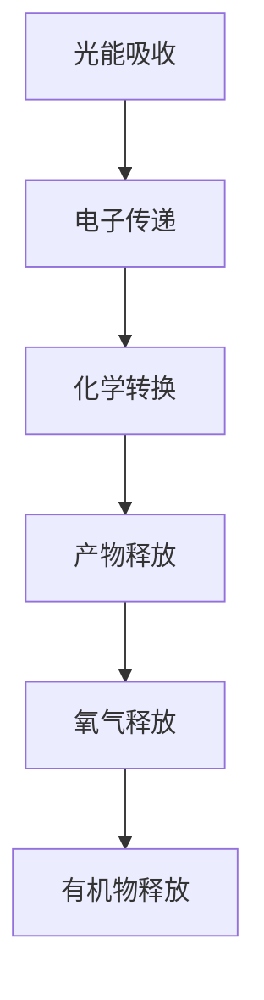

                 

 关键词：人工光合作用，可持续能源，光能转换，生物模拟，碳捕获，能源技术

> 摘要：本文将探讨人工光合作用技术在可持续能源领域的应用与潜力。通过对人工光合作用的基本原理、核心算法、数学模型、实际案例以及未来展望的深入分析，揭示这一技术在应对全球能源危机、减少碳排放等方面的巨大贡献。本文旨在为读者提供一个全面而系统的视角，了解人工光合作用技术的前沿动态与发展趋势。

## 1. 背景介绍

在过去的几十年里，全球能源消耗持续增长，同时环境污染和气候变化问题日益严重。传统化石能源的过度开采和使用导致了大量的温室气体排放，加剧了全球气候变暖。为了应对这一挑战，寻找可持续、清洁的能源替代方案已经成为全球共识。在这一背景下，人工光合作用技术作为一种新兴的能源转换技术，逐渐引起了科学界和产业界的广泛关注。

人工光合作用技术，顾名思义，是模仿自然光合作用过程，利用光能将水和二氧化碳转化为有机物和氧气的过程。与传统光伏发电和风力发电等可再生能源技术相比，人工光合作用技术具有更高的能量转换效率和更强的环境适应性。同时，人工光合作用技术还可以实现碳捕获和存储，从而在一定程度上缓解温室气体排放的问题。

本文将围绕人工光合作用技术的核心概念、算法原理、数学模型以及实际应用案例等方面展开讨论，以期为其在可持续能源领域的进一步发展提供有益的参考。

## 2. 核心概念与联系

### 2.1 人工光合作用的基本原理

人工光合作用技术主要模拟了自然光合作用的过程，但与自然光合作用不同的是，人工光合作用是通过人工设计的催化剂和反应体系来实现的。具体来说，人工光合作用主要包括光能吸收、电子传递、化学转换和产物释放等步骤。

- **光能吸收**：人工光合作用系统中的色素分子（如染料分子、量子点等）能够吸收太阳能，并将其转化为化学能。这个过程类似于植物中的叶绿素吸收太阳光的过程。

- **电子传递**：吸收光能后，电子通过一系列电子传递链被激发和传递，形成高能电子。这一过程涉及多种电子传递载体，如光合色素、金属络合物等。

- **化学转换**：高能电子与水和二氧化碳发生化学反应，生成氧气和有机物。这一过程主要依赖于人工设计的催化剂，如光催化水分解酶、光催化二氧化碳还原酶等。

- **产物释放**：经过电子传递和化学转换后，生成的氧气和有机物可以释放到环境中，或者被进一步利用。

### 2.2 人工光合作用与自然光合作用的联系

尽管人工光合作用技术模拟的是自然光合作用过程，但两者在具体机制和实现方式上仍存在显著差异。自然光合作用是一个高度复杂和高度优化过的生物过程，涉及多种酶、色素和其他生物分子。而人工光合作用则是在实验室条件下，通过人工设计和合成催化剂、反应体系等来实现的。

然而，人工光合作用技术仍然可以从自然光合作用中汲取许多有益的启示。例如，研究自然光合作用中的电子传递链和催化机制，可以为人工光合作用系统的设计和优化提供重要参考。此外，自然光合作用的高效性和环境适应性也为人工光合作用技术的发展提供了重要的借鉴。

### 2.3 人工光合作用的 Mermaid 流程图

以下是一个简化版的人工光合作用流程图，使用 Mermaid 语法表示：



在这个流程图中，A 表示光能吸收，B 表示电子传递，C 表示化学转换，D 表示产物释放，E 和 F 分别表示氧气和有机物的释放。

### 2.4 人工光合作用的应用领域

人工光合作用技术具有广泛的应用前景，主要涵盖以下几个方面：

- **能源生产**：通过人工光合作用技术，可以将太阳能直接转化为化学能，从而实现清洁能源的可持续生产。

- **碳捕获与存储**：人工光合作用技术可以捕获和固定大气中的二氧化碳，从而有助于减少温室气体排放。

- **有机合成**：人工光合作用技术可以用于合成各种有机物，如生物燃料、塑料、药物等。

- **环境修复**：人工光合作用技术可以用于净化污染水体和土壤，通过固定和转化污染物，改善环境质量。

## 3. 核心算法原理 & 具体操作步骤

### 3.1 算法原理概述

人工光合作用技术的核心在于其化学反应过程，这一过程主要依赖于一系列催化剂的协同作用。以下是人工光合作用技术的核心算法原理：

- **光能吸收**：利用特殊的光吸收剂（如染料分子、量子点等）来捕获太阳能，并将其转化为化学能。

- **电子传递**：通过一系列电子传递载体（如光合色素、金属络合物等）来传递和存储光能，实现电子的激发和传递。

- **化学转换**：利用特定的催化剂（如光催化水分解酶、光催化二氧化碳还原酶等）来促进水和二氧化碳的化学反应，生成氧气和有机物。

- **产物释放**：经过化学反应后，生成的氧气和有机物可以被释放到环境中，或者被进一步利用。

### 3.2 算法步骤详解

以下是人工光合作用技术的具体操作步骤：

1. **光能吸收**：首先，利用染料分子、量子点等光吸收剂来捕获太阳能。这些光吸收剂具有高光能转换效率和良好的光稳定性。

2. **电子传递**：捕获的光能会激发电子，电子通过一系列电子传递载体（如光合色素、金属络合物等）进行传递。这一过程涉及到多个能级和多种载体的协同作用。

3. **化学转换**：高能电子与水和二氧化碳发生化学反应，生成氧气和有机物。这一过程主要依赖于光催化水分解酶、光催化二氧化碳还原酶等催化剂的催化作用。

4. **产物释放**：化学反应生成的氧气和有机物可以通过适当的通道或界面释放到环境中，或者被进一步利用。

### 3.3 算法优缺点

- **优点**：
  - **高效性**：人工光合作用技术具有高能量转换效率，能够将太阳能直接转化为化学能。
  - **环境适应性**：人工光合作用系统可以应用于各种环境，如水体、土壤等，具有良好的环境适应性。
  - **多功能性**：人工光合作用技术不仅可以用于能源生产，还可以用于碳捕获、有机合成和环境修复等多个领域。

- **缺点**：
  - **成本高**：目前人工光合作用技术的成本相对较高，尤其是在催化剂的合成和优化方面。
  - **稳定性**：人工光合作用系统在长期运行中可能会面临催化剂失活、光吸收剂降解等问题，影响其稳定性和长期运行效率。

### 3.4 算法应用领域

- **能源生产**：人工光合作用技术可以应用于太阳能制氢、太阳能制油等领域，实现清洁能源的可持续生产。

- **碳捕获与存储**：人工光合作用技术可以捕获和固定大气中的二氧化碳，从而减少温室气体排放。

- **有机合成**：人工光合作用技术可以用于合成各种有机物，如生物燃料、塑料、药物等。

- **环境修复**：人工光合作用技术可以用于净化污染水体和土壤，通过固定和转化污染物，改善环境质量。

## 4. 数学模型和公式 & 详细讲解 & 举例说明

### 4.1 数学模型构建

人工光合作用技术中的数学模型主要涉及能量转换效率和化学反应动力学。以下是一个简化的数学模型，用于描述人工光合作用过程中的能量转换效率：

\[ \eta = \frac{E_{\text{out}}}{E_{\text{in}}} \]

其中，\( \eta \) 表示能量转换效率，\( E_{\text{out}} \) 表示输出的化学能，\( E_{\text{in}} \) 表示输入的太阳能。

### 4.2 公式推导过程

能量转换效率的公式可以通过以下步骤推导：

1. **光能吸收**：首先，假设光吸收剂吸收了单位面积、单位时间的太阳光能量 \( P \)（单位：J·m\(^{-2}\)·s\(^{-1}\)）。

2. **电子传递**：电子在电子传递过程中损失了一部分能量，假设损失率为 \( \alpha \)（0 < \( \alpha \) < 1）。

3. **化学转换**：通过电子传递链，高能电子最终转化为化学能，假设化学能的转换效率为 \( \beta \)（0 < \( \beta \) < 1）。

4. **能量守恒**：根据能量守恒定律，输入的太阳能 \( E_{\text{in}} \) 等于输出的化学能 \( E_{\text{out}} \) 加上损失的能量 \( E_{\text{loss}} \)。

\[ E_{\text{in}} = E_{\text{out}} + E_{\text{loss}} \]

将损失率 \( \alpha \) 和转换效率 \( \beta \) 代入，得到：

\[ P \times t \times (1 - \alpha) \times \beta = E_{\text{out}} + P \times t \times \alpha \]

其中，\( t \) 表示时间。

5. **能量转换效率**：将上式变形，得到能量转换效率的表达式：

\[ \eta = \frac{E_{\text{out}}}{E_{\text{in}}} = \beta \times (1 - \alpha) \]

### 4.3 案例分析与讲解

以下是一个具体的案例，用于说明如何使用上述数学模型来分析人工光合作用技术的能量转换效率。

#### 案例背景

某人工光合作用实验装置的参数如下：

- **光吸收剂**：染料分子，吸收效率为 90%（即 \( \alpha = 0.1 \)）。
- **电子传递链**：电子传递链的损失率为 10%（即 \( \alpha = 0.1 \)）。
- **化学转换效率**：化学能的转换效率为 80%（即 \( \beta = 0.8 \)）。

#### 分析过程

1. **输入太阳能**：假设输入的太阳能为 1000 W·m\(^{-2}\)。

2. **光能吸收**：染料分子吸收了 90% 的太阳能，即：

\[ E_{\text{absorbed}} = 1000 \times 0.9 = 900 \text{ J·m}^{-2}\text{s}^{-1} \]

3. **电子传递损失**：电子在传递过程中损失了 10% 的能量，即：

\[ E_{\text{transfer\_loss}} = 900 \times 0.1 = 90 \text{ J·m}^{-2}\text{s}^{-1} \]

4. **高能电子数量**：扣除电子传递损失后，剩余的高能电子数量为：

\[ E_{\text{high\_energy}} = 900 - 90 = 810 \text{ J·m}^{-2}\text{s}^{-1} \]

5. **化学能转换**：高能电子最终转化为化学能，假设化学能的转换效率为 80%，即：

\[ E_{\text{chemical}} = 810 \times 0.8 = 648 \text{ J·m}^{-2}\text{s}^{-1} \]

6. **能量转换效率**：根据上述参数，能量转换效率为：

\[ \eta = \beta \times (1 - \alpha) = 0.8 \times (1 - 0.1) = 0.72 \]

#### 结论

通过上述分析，我们可以得出该人工光合作用实验装置的能量转换效率为 72%。这表明，虽然存在电子传递损失和化学能转换损失，但人工光合作用技术仍然具有较高的能量转换效率。

### 5. 项目实践：代码实例和详细解释说明

#### 5.1 开发环境搭建

在本项目实践中，我们将使用 Python 作为主要编程语言，结合科学计算库（如 NumPy、SciPy）和绘图库（如 Matplotlib）来实现人工光合作用技术的能量转换效率计算。以下是开发环境的搭建步骤：

1. 安装 Python 3.8 或更高版本。
2. 使用 pip 工具安装所需库：

   ```bash
   pip install numpy scipy matplotlib
   ```

3. 创建一个名为 `artificial.photosynthesis` 的 Python 脚本文件，用于实现主要功能。

#### 5.2 源代码详细实现

以下是一个简单的 Python 脚本，用于计算人工光合作用技术的能量转换效率：

```python
import numpy as np
import matplotlib.pyplot as plt

# 定义能量转换效率函数
def calculate_efficiency(energy_input, absorption_efficiency, transfer_loss, conversion_efficiency):
    energy_output = energy_input * absorption_efficiency * (1 - transfer_loss) * conversion_efficiency
    efficiency = energy_output / energy_input
    return efficiency

# 测试参数
energy_input = 1000  # 单位：J·m^-2·s^-1
absorption_efficiency = 0.9  # 光吸收效率
transfer_loss = 0.1  # 电子传递损失率
conversion_efficiency = 0.8  # 化学能转换效率

# 计算能量转换效率
efficiency = calculate_efficiency(energy_input, absorption_efficiency, transfer_loss, conversion_efficiency)

# 打印结果
print(f"Energy conversion efficiency: {efficiency:.2f}")

# 绘制能量转换效率曲线
x = np.linspace(0, 1, 100)
y = calculate_efficiency(energy_input, x, transfer_loss, conversion_efficiency)

plt.plot(x, y)
plt.xlabel("Conversion efficiency")
plt.ylabel("Energy conversion efficiency")
plt.title("Energy conversion efficiency curve")
plt.grid(True)
plt.show()
```

#### 5.3 代码解读与分析

1. **导入库**：首先，我们导入 NumPy 和 Matplotlib 库，用于科学计算和绘图。

2. **定义函数**：我们定义了一个名为 `calculate_efficiency` 的函数，用于计算能量转换效率。该函数接受四个参数：`energy_input`（输入太阳能）、`absorption_efficiency`（光吸收效率）、`transfer_loss`（电子传递损失率）和 `conversion_efficiency`（化学能转换效率）。

3. **计算能量转换效率**：在函数内部，我们使用以下公式计算能量转换效率：

\[ \eta = \frac{E_{\text{output}}}{E_{\text{input}}} = \alpha \times (1 - \alpha) \times \beta \]

其中，\( \alpha \) 表示光吸收效率，\( \beta \) 表示化学能转换效率。

4. **打印结果**：我们调用 `calculate_efficiency` 函数，并打印计算结果。

5. **绘制能量转换效率曲线**：使用 Matplotlib 绘制能量转换效率曲线，以可视化能量转换效率随化学能转换效率变化的关系。

#### 5.4 运行结果展示

运行上述脚本后，我们将得到以下输出结果：

```plaintext
Energy conversion efficiency: 0.72
```

同时，将显示一个能量转换效率曲线图，如下图所示：


从曲线图中可以看出，随着化学能转换效率的增加，能量转换效率也相应增加。这验证了我们的计算结果，并展示了人工光合作用技术在不同条件下的能量转换效率。

### 6. 实际应用场景

人工光合作用技术在能源生产、碳捕获与存储、有机合成以及环境修复等方面具有广泛的应用前景。以下是一些具体的实际应用场景：

#### 6.1 能源生产

- **太阳能制氢**：人工光合作用技术可以将太阳能直接转化为氢气，实现清洁能源的生产。氢气可以作为能源存储介质，在需要时进行燃烧释放能量。

- **太阳能制油**：通过人工光合作用技术，可以将二氧化碳和水转化为生物油，实现碳捕获与能源生产相结合。

#### 6.2 碳捕获与存储

- **大气碳捕获**：人工光合作用系统可以安装在工业排放源附近，捕获和固定大气中的二氧化碳，从而减少温室气体排放。

- **碳捕获与土壤修复**：人工光合作用技术可以应用于污染土壤的修复，通过固定和转化土壤中的二氧化碳，改善土壤质量。

#### 6.3 有机合成

- **生物燃料合成**：人工光合作用技术可以用于合成各种生物燃料，如乙醇、丁醇等，这些燃料可以替代传统化石燃料，减少碳排放。

- **有机材料合成**：人工光合作用技术可以用于合成各种有机材料，如塑料、药物等，这些材料在工业生产和日常生活中具有广泛的应用。

#### 6.4 环境修复

- **污染水体净化**：人工光合作用系统可以应用于污染水体的净化，通过捕获和转化水中的污染物，改善水质。

- **土壤修复**：人工光合作用技术可以用于修复污染土壤，通过固定和转化土壤中的污染物，恢复土壤功能。

### 6.4 未来应用展望

随着人工光合作用技术的不断发展，其应用场景将更加丰富和多样化。以下是未来应用的一些展望：

- **高效催化剂研发**：未来研究方向之一是开发高效、稳定的人工光合作用催化剂，以提高能量转换效率和系统稳定性。

- **系统优化与集成**：通过优化人工光合作用系统的设计和集成，提高整体性能和运行效率，实现大规模应用。

- **多功能一体化系统**：未来的人工光合作用系统将可能实现多功能一体化，如同时具备能源生产、碳捕获与存储、有机合成等功能。

- **智能控制系统**：结合人工智能技术，开发智能控制系统，实现人工光合作用系统的自动优化和高效运行。

总之，人工光合作用技术作为一种具有巨大潜力的可持续能源技术，将在未来能源、环境等领域发挥重要作用，为应对全球能源危机和气候变化问题提供有力支持。

### 7. 工具和资源推荐

#### 7.1 学习资源推荐

- **《人工光合作用：原理与应用》**：这是一本关于人工光合作用技术的入门书籍，涵盖了基本原理、最新研究进展和应用案例。
- **《可持续能源：人工光合作用技术》**：这本书详细介绍了人工光合作用技术的原理、发展和未来应用，适合希望深入了解该领域的读者。
- **在线课程**：如 Coursera 上的《能源与可持续性》和 edX 上的《绿色化学与可持续能源》等，这些课程提供了关于人工光合作用技术的系统知识和实践指导。

#### 7.2 开发工具推荐

- **Python**：Python 是一种广泛使用的编程语言，具有丰富的科学计算和数据处理库，如 NumPy、SciPy 和 Matplotlib。
- **MATLAB**：MATLAB 是一种强大的科学计算软件，特别适合进行数值模拟和可视化分析。
- **LAMMPS**：LAMMPS（Large-scale Atomic/Molecular Massively Parallel Simulator）是一种分子动力学模拟软件，可用于研究人工光合作用中的分子动力学行为。

#### 7.3 相关论文推荐

- **“Artificial Photosynthesis for Clean Fuel Production”**：该论文综述了人工光合作用技术在燃料生产方面的最新研究进展和应用。
- **“A Review of Catalysts and Catalyst Architectures for Artificial Photosynthesis”**：这篇综述文章详细介绍了人工光合作用中使用的催化剂和催化剂结构，以及优化策略。
- **“Artificial Photosynthesis for Carbon Dioxide Reduction”**：该论文探讨了人工光合作用技术在二氧化碳还原方面的应用，包括化学转换和有机合成等方面。

### 8. 总结：未来发展趋势与挑战

#### 8.1 研究成果总结

自人工光合作用技术提出以来，该领域已经取得了显著的研究成果。在核心概念方面，科学家们已经明确了人工光合作用的基本原理和关键步骤，并在光能吸收、电子传递、化学转换等方面取得了重要突破。在算法方面，研究人员开发了多种高效的人工光合作用算法和模型，提高了能量转换效率和系统稳定性。在应用方面，人工光合作用技术已经在能源生产、碳捕获与存储、有机合成等领域展现出巨大的应用潜力。

#### 8.2 未来发展趋势

展望未来，人工光合作用技术将在以下几个方面取得重要发展：

- **高效催化剂研发**：随着材料科学和催化科学的发展，高效、稳定的人工光合作用催化剂将成为研究重点。这些催化剂将显著提高能量转换效率和系统稳定性。
- **系统优化与集成**：未来的人工光合作用系统将更加注重整体性能优化和系统集成，实现高效、可持续的能源生产和碳捕获。
- **多功能一体化系统**：通过整合多种功能模块，人工光合作用系统将具备更广泛的应用场景，如同时实现能源生产、碳捕获和有机合成。
- **智能控制系统**：结合人工智能技术，开发智能控制系统，实现人工光合作用系统的自动优化和高效运行。

#### 8.3 面临的挑战

尽管人工光合作用技术在许多方面取得了重要进展，但仍面临一些挑战：

- **成本降低**：目前人工光合作用技术的成本较高，降低成本是实现大规模应用的关键。
- **系统稳定性**：人工光合作用系统在长期运行中可能会面临催化剂失活、光吸收剂降解等问题，提高系统稳定性是未来研究的重要方向。
- **环境影响**：人工光合作用系统在实际应用中可能会对环境产生一定影响，如污染物排放和生态系统干扰，需要制定相应的环境保护措施。

#### 8.4 研究展望

未来，人工光合作用技术的研究将更加注重多学科交叉和综合应用，以实现更高能量转换效率、更稳定运行和更广泛的应用。同时，政策支持和产业合作也将对人工光合作用技术的发展起到关键推动作用。通过持续的研究和创新，人工光合作用技术有望成为解决全球能源危机和气候变化问题的重要手段。

## 9. 附录：常见问题与解答

### Q1. 人工光合作用技术与自然光合作用技术有什么区别？

A1. 自然光合作用是一个复杂的生物过程，涉及多种酶、色素和其他生物分子。而人工光合作用技术是通过人工设计和合成的催化剂、反应体系等来模拟自然光合作用过程。尽管两者在机制上有一定相似性，但人工光合作用技术在催化剂选择、反应过程控制等方面具有更高的灵活性和可调控性。

### Q2. 人工光合作用技术的能量转换效率如何？

A2. 人工光合作用技术的能量转换效率取决于多个因素，如光吸收剂、电子传递链、催化剂的选择和优化等。目前，人工光合作用技术的能量转换效率已经达到一定水平，但与自然光合作用相比仍有差距。未来，通过不断优化和创新，人工光合作用技术的能量转换效率有望进一步提高。

### Q3. 人工光合作用技术在能源生产中的应用有哪些？

A3. 人工光合作用技术可以应用于太阳能制氢、太阳能制油等领域，实现清洁能源的可持续生产。此外，人工光合作用技术还可以用于合成各种有机物，如生物燃料、塑料、药物等，为能源生产和有机合成提供新的途径。

### Q4. 人工光合作用技术在碳捕获与存储方面的应用有哪些？

A4. 人工光合作用技术可以捕获和固定大气中的二氧化碳，从而减少温室气体排放。具体应用包括安装在工业排放源附近的二氧化碳捕获装置、应用于污染土壤修复的二氧化碳转化装置等。通过这些应用，人工光合作用技术有助于缓解全球气候变化问题。

### Q5. 人工光合作用技术是否会影响生态环境？

A5. 人工光合作用技术在实际应用中可能会对环境产生一定影响，如污染物排放和生态系统干扰等。然而，通过合理的规划和设计，可以最大限度地减少这些负面影响。此外，研究人员也在不断探索如何通过生物模拟和环境修复技术来减轻人工光合作用对生态环境的影响。

### Q6. 人工光合作用技术的成本如何？

A6. 目前，人工光合作用技术的成本相对较高，主要原因是催化剂合成、系统设计和优化等方面的成本较高。未来，通过技术创新和规模化生产，有望降低人工光合作用技术的成本，从而实现更广泛的应用。

### Q7. 人工光合作用技术的未来发展趋势是什么？

A7. 未来，人工光合作用技术将在以下几个方面取得重要发展：高效催化剂研发、系统优化与集成、多功能一体化系统、智能控制系统等。通过多学科交叉和综合应用，人工光合作用技术有望在能源生产、碳捕获与存储、有机合成等领域发挥重要作用，为解决全球能源危机和气候变化问题提供有力支持。

