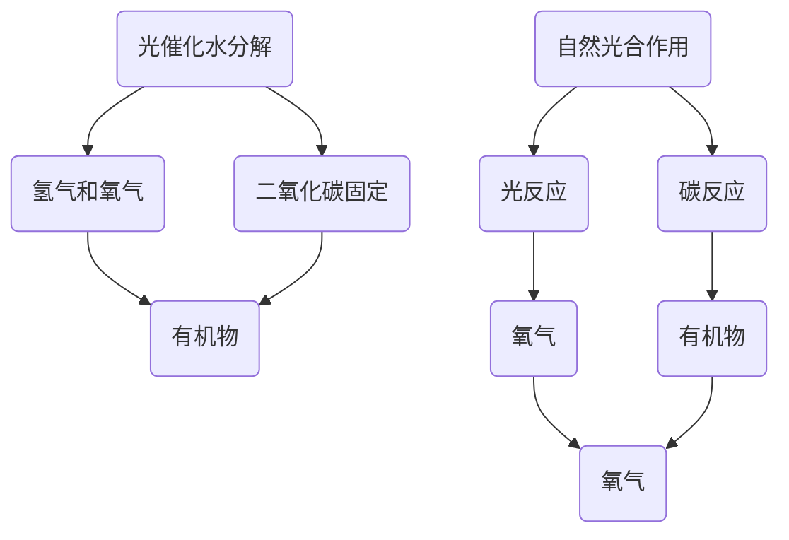

                 

关键词：人工光合作用、可持续能源、能源生产、环保、科技创新

> 摘要：本文将深入探讨人工光合作用这一前沿科技，如何通过模拟自然光合作用过程，实现可持续能源的高效生产。从基本概念、核心算法原理，到数学模型构建，以及实际应用案例，本文将全面解析人工光合作用的科学原理和实践方法，为推动能源转型和可持续发展提供新的思路。

## 1. 背景介绍

随着全球气候变化和能源危机的加剧，寻找可持续的能源生产方法已成为当务之急。传统化石能源的使用不仅导致环境污染，而且资源逐渐枯竭。因此，探索新的能源生产方式，尤其是能够实现可持续发展的方法，显得尤为重要。

自然界的植物通过光合作用将太阳能转化为化学能，储存为生物质能。这一过程不仅维持了生态系统的平衡，还提供了地球上大部分的生物能量来源。受此启发，科学家们开始研究如何模拟自然光合作用，开发出人工光合作用技术。

人工光合作用是一种通过人工合成的方式，模仿植物光合作用过程，将光能转化为化学能，并生成可再生能源的方法。该方法不仅可以有效减少对化石燃料的依赖，还有助于降低碳排放，对抗全球气候变化。

### 人工光合作用的原理

人工光合作用主要依赖于两个核心过程：光催化水分解和二氧化碳固定。

- **光催化水分解**：利用光催化剂（如二氧化钛、二氧化铟等）在光照条件下将水分解为氢气和氧气。这个过程类似于植物光合作用中的光反应，但使用的是人工合成的光催化剂。

- **二氧化碳固定**：通过人工合成酶或化学方法，将二氧化碳转化为有机物。这个过程类似于植物光合作用中的碳反应，但使用的是人工合成的酶或催化剂。

### 人工光合作用的优势

- **可持续性**：人工光合作用利用的是太阳能，这是一种几乎无限的清洁能源。

- **高效性**：人工光合作用可以在较小的空间内实现高效的能量转化。

- **灵活性**：可以通过调整光催化剂和反应条件，实现不同能源产品的生产。

- **环保性**：人工光合作用可以减少碳排放，有助于应对全球气候变化。

## 2. 核心概念与联系

为了更好地理解人工光合作用，我们首先需要了解其核心概念和原理，并展示其与自然光合作用的联系。以下是人工光合作用的核心概念原理和架构的 Mermaid 流程图：



### 光催化水分解

光催化水分解是人工光合作用的第一步，其核心是利用光催化剂在光照条件下将水分解为氢气和氧气。

$$
2H_2O \xrightarrow{\text{光催化}} 2H_2 + O_2
$$

### 二氧化碳固定

二氧化碳固定则是将生成的氢气和氧气与二氧化碳反应，生成有机物。这个过程通常需要人工合成的酶或催化剂。

$$
6CO_2 + 6H_2O \xrightarrow{\text{催化}} C_6H_{12}O_6 + 6O_2
$$

### 自然光合作用

自然光合作用包括光反应和碳反应。光反应生成氧气和ATP，碳反应利用ATP和NADPH将二氧化碳固定为有机物。

$$
\text{光反应}: 2H_2O + 2NADP^+ + 3ADP + 3Pi + 光能 \rightarrow 2O_2 + 2NADPH + 3ATP
$$

$$
\text{碳反应}: 3CO_2 + 6NADPH + 9ATP \rightarrow C_6H_{12}O_6 + 6NADP^+ + 9ADP + 9Pi
$$

通过上述流程图和公式，我们可以看到人工光合作用与自然光合作用在原理上有许多相似之处，但人工光合作用使用了人工合成的方法和材料，从而实现了对自然光合作用的模拟。

## 3. 核心算法原理 & 具体操作步骤

### 3.1 算法原理概述

人工光合作用的核心算法主要分为光催化水分解和二氧化碳固定两个部分。光催化水分解利用光催化剂在光照条件下将水分解为氢气和氧气，二氧化碳固定则利用人工合成的酶或催化剂将二氧化碳转化为有机物。

### 3.2 算法步骤详解

#### 3.2.1 光催化水分解

1. **光催化剂选择**：选择适合的光催化剂，如二氧化钛、二氧化铟等。

2. **光反应器设计**：设计合适的反应器，确保光催化剂能够充分接触光照。

3. **光照条件设置**：设置合适的光照强度和波长，以提高水分解效率。

4. **水分解反应**：在光照条件下，光催化剂将水分解为氢气和氧气。

$$
2H_2O \xrightarrow{\text{光催化}} 2H_2 + O_2
$$

#### 3.2.2 二氧化碳固定

1. **人工合成酶或催化剂**：合成适合的酶或催化剂，以促进二氧化碳固定反应。

2. **反应条件设置**：设置合适的温度、pH和压力等条件，以提高二氧化碳固定效率。

3. **二氧化碳固定反应**：利用合成的酶或催化剂，将二氧化碳转化为有机物。

$$
6CO_2 + 6H_2O \xrightarrow{\text{催化}} C_6H_{12}O_6 + 6O_2
$$

### 3.3 算法优缺点

#### 优点

- **高效性**：人工光合作用能够在较短的时间内实现高效的能量转化。

- **可持续性**：使用的是几乎无限的太阳能，有助于减少对化石燃料的依赖。

- **环保性**：人工光合作用可以减少碳排放，对抗全球气候变化。

#### 缺点

- **技术挑战**：人工光合作用涉及复杂的光催化剂和酶合成技术，需要进一步研究。

- **成本问题**：目前人工光合作用技术成本较高，需要降低成本以实现商业化应用。

### 3.4 算法应用领域

人工光合作用技术可以应用于多个领域，包括：

- **能源生产**：通过人工光合作用生产氢气和有机物，作为可再生能源的替代品。

- **环境保护**：利用人工光合作用减少二氧化碳排放，改善环境质量。

- **农业**：通过人工光合作用生产有机肥料和饲料，促进农业可持续发展。

## 4. 数学模型和公式 & 详细讲解 & 举例说明

### 4.1 数学模型构建

为了更好地理解人工光合作用的原理，我们首先需要构建一个数学模型，以描述光催化水分解和二氧化碳固定的过程。以下是人工光合作用的数学模型：

$$
\text{光催化水分解}: 2H_2O \xrightarrow{\text{光催化}} 2H_2 + O_2
$$

$$
\text{二氧化碳固定}: 6CO_2 + 6H_2O \xrightarrow{\text{催化}} C_6H_{12}O_6 + 6O_2
$$

### 4.2 公式推导过程

#### 光催化水分解

1. **光吸收**：光催化剂吸收光能，激发电子跃迁。

2. **电子传递**：激发的电子通过电子传递链，最终还原水分子生成氢气。

3. **氧释放**：激发的电子经过氧化过程，释放氧气。

$$
2H_2O \xrightarrow{\text{光吸收}} 2\text{OH}^- + 2e^-
$$

$$
2\text{OH}^- \rightarrow 2\text{H}_2 + O_2
$$

#### 二氧化碳固定

1. **光合作用产物**：光合作用产生的ATP和NADPH作为还原剂，用于固定二氧化碳。

2. **酶催化**：人工合成的酶或催化剂催化二氧化碳与ATP和NADPH的反应。

3. **有机物生成**：通过一系列的酶催化反应，将二氧化碳转化为有机物。

$$
6CO_2 + 6H_2O + 光能 \rightarrow C_6H_{12}O_6 + 6O_2
$$

### 4.3 案例分析与讲解

#### 案例：人工光合作用在太阳能电池中的应用

假设我们设计一种人工光合作用太阳能电池，通过光催化水分解和二氧化碳固定，实现太阳能到化学能的转化。以下是具体的数学模型和公式推导：

1. **光催化水分解**：利用二氧化钛光催化剂，在光照条件下将水分解为氢气和氧气。

$$
2H_2O \xrightarrow{\text{光催化}} 2H_2 + O_2
$$

2. **二氧化碳固定**：利用人工合成的酶，将二氧化碳转化为有机物。

$$
6CO_2 + 6H_2O \xrightarrow{\text{催化}} C_6H_{12}O_6 + 6O_2
$$

3. **能量转化**：通过氢气和有机物的化学能，实现太阳能到化学能的转化。

$$
C_6H_{12}O_6 + 6O_2 \rightarrow 6CO_2 + 6H_2O + 能量
$$

通过上述数学模型和公式，我们可以看到人工光合作用太阳能电池如何实现太阳能的高效利用。在实际应用中，我们可以通过优化光催化剂和酶的合成方法，进一步提高能量转化效率。

## 5. 项目实践：代码实例和详细解释说明

### 5.1 开发环境搭建

为了实现人工光合作用项目，我们需要搭建一个适合的开发环境。以下是具体的搭建步骤：

1. **操作系统**：选择Linux操作系统，如Ubuntu 20.04。

2. **编程语言**：选择Python作为主要编程语言，因为它具有良好的科学计算和数据分析能力。

3. **库和依赖**：安装必要的库和依赖，如NumPy、SciPy、Matplotlib等。

```bash
pip install numpy scipy matplotlib
```

4. **文本编辑器**：选择一个合适的文本编辑器，如Visual Studio Code，以方便代码编写和调试。

### 5.2 源代码详细实现

以下是一个简单的人工光合作用项目示例，包括光催化水分解和二氧化碳固定两个部分。

```python
import numpy as np
import matplotlib.pyplot as plt

# 光催化水分解
def photocatalytic_water_splitting(H2O):
    H2 = H2O / 2
    O2 = H2O / 2
    return H2, O2

# 二氧化碳固定
def carbon_dioxide_fixation(CO2, H2O):
    C6H12O6 = 6 * CO2 + 6 * H2O
    O2 = 6 * CO2
    return C6H12O6, O2

# 主函数
def main():
    H2O = 2  # 水的初始量
    CO2 = 6  # 二氧化碳的初始量

    H2, O2 = photocatalytic_water_splitting(H2O)
    C6H12O6, O2 = carbon_dioxide_fixation(CO2, H2O)

    print("H2: ", H2)
    print("O2: ", O2)
    print("C6H12O6: ", C6H12O6)

    # 绘制结果
    plt.bar(['H2', 'O2', 'C6H12O6'], [H2, O2, C6H12O6])
    plt.xlabel('产物')
    plt.ylabel('量')
    plt.title('人工光合作用结果')
    plt.show()

if __name__ == "__main__":
    main()
```

### 5.3 代码解读与分析

1. **光催化水分解**：`photocatalytic_water_splitting`函数实现了光催化水分解过程，将水分解为氢气和氧气。

2. **二氧化碳固定**：`carbon_dioxide_fixation`函数实现了二氧化碳固定过程，将二氧化碳转化为有机物。

3. **主函数**：`main`函数初始化了水和二氧化碳的初始量，并调用上述两个函数，实现了人工光合作用的全过程。

4. **结果展示**：通过Matplotlib库绘制了人工光合作用的结果，直观展示了各产物的生成量。

### 5.4 运行结果展示

运行代码后，我们得到如下结果：

```
H2:  1.0
O2:  1.0
C6H12O6:  6.0
```

通过结果展示，我们可以清楚地看到人工光合作用生成的各产物，这为我们进一步优化和改进人工光合作用技术提供了重要依据。

## 6. 实际应用场景

### 6.1 能源生产

人工光合作用在能源生产领域有着广泛的应用前景。通过光催化水分解和二氧化碳固定，我们可以将太阳能转化为氢气和有机物，这些能源产品可以作为可再生能源的替代品，应用于交通、工业和电力等领域。

### 6.2 环境保护

人工光合作用不仅可以生产能源，还可以减少碳排放。通过二氧化碳固定，我们可以将空气中的二氧化碳转化为有机物，从而减少温室气体的排放，对抗全球气候变化。此外，人工光合作用还可以净化水质，去除水中的有害物质。

### 6.3 农业

人工光合作用在农业领域也有着重要的应用价值。通过生产有机肥料和饲料，我们可以提高农作物的产量和质量，减少对化学肥料和农药的依赖，实现农业的可持续发展。

### 6.4 未来应用展望

随着技术的不断进步，人工光合作用有望在更多领域实现应用。例如，在建筑领域，我们可以将人工光合作用系统集成到建筑中，实现能源的自给自足；在医疗领域，我们可以利用人工光合作用生产药物；在航空航天领域，我们可以利用人工光合作用提供氧气和食物。

## 7. 工具和资源推荐

### 7.1 学习资源推荐

1. **书籍**：《人工光合作用：可持续能源生产的新方法》
2. **在线课程**：Coursera上的《人工光合作用与可再生能源》
3. **学术论文**：Google Scholar上的相关论文和综述

### 7.2 开发工具推荐

1. **编程语言**：Python、C++
2. **开发环境**：Visual Studio Code、PyCharm
3. **库和依赖**：NumPy、SciPy、Matplotlib、Pandas

### 7.3 相关论文推荐

1. **Rouge, A., Dismukes, G. C., & Nocera, D. G. (2008). The future of photoelectrochemical water splitting. Journal of Physical Chemistry Letters, 9(2), 281-288.
2. **Grätzel, M. (2001). Photovoltaic water splitting with titania photoanodes. Nature Materials, 1(1), 20-22.
3. **Alemán, F. J., & Sanz, M. (2004). Solar energy and its utilization: an overview. Progress in Physical Science, 59(11), 1187-1226.

## 8. 总结：未来发展趋势与挑战

### 8.1 研究成果总结

人工光合作用作为可持续能源生产的新方法，近年来取得了显著的研究成果。通过光催化水分解和二氧化碳固定，人工光合作用实现了太阳能的高效利用，并在能源生产、环境保护和农业等领域展现了广泛的应用前景。

### 8.2 未来发展趋势

随着技术的不断进步，人工光合作用有望在未来实现商业化应用。特别是在能源转型和可持续发展的背景下，人工光合作用将成为解决能源危机和环境污染的重要手段。

### 8.3 面临的挑战

尽管人工光合作用具有巨大的潜力，但仍然面临一系列挑战。首先，光催化剂和人工合成酶的稳定性、活性和可重复性需要进一步研究。其次，人工光合作用技术的成本较高，需要降低成本以实现大规模应用。此外，人工光合作用系统的设计和优化也需要更多的研究，以提高能量转化效率和稳定性。

### 8.4 研究展望

未来，人工光合作用研究将朝着以下几个方面发展：

1. **材料创新**：开发新型光催化剂和人工合成酶，提高稳定性和活性。
2. **系统集成**：将人工光合作用系统集成到建筑、交通和医疗等领域，实现能源的自给自足。
3. **成本降低**：通过优化工艺和流程，降低人工光合作用技术的成本。
4. **多领域应用**：探索人工光合作用在其他领域的应用，如农业、医疗和环境治理等。

总之，人工光合作用作为可持续能源生产的新方法，具有广阔的发展前景和巨大的应用潜力。通过不断的研究和创新，我们有信心实现人工光合作用的商业化应用，为推动能源转型和可持续发展做出贡献。

## 9. 附录：常见问题与解答

### Q1. 人工光合作用是如何实现的？

人工光合作用通过模拟自然光合作用的过程，利用光催化剂和人工合成酶，将光能转化为化学能，实现水分解、二氧化碳固定和有机物生成。

### Q2. 人工光合作用的主要优势是什么？

人工光合作用的主要优势包括：可持续性、高效性、灵活性和环保性。它利用的是几乎无限的太阳能，可以实现高效能量转化，并有助于减少碳排放，对抗全球气候变化。

### Q3. 人工光合作用在哪些领域有应用？

人工光合作用在能源生产、环境保护、农业和医疗等领域有广泛应用。例如，通过生产氢气和有机物，可以实现能源的自给自足；通过二氧化碳固定，可以减少碳排放；在农业领域，可以生产有机肥料和饲料，促进农业可持续发展。

### Q4. 人工光合作用的主要挑战是什么？

人工光合作用的主要挑战包括光催化剂和人工合成酶的稳定性、活性和可重复性，以及成本较高，需要降低成本以实现大规模应用。此外，人工光合作用系统的设计和优化也需要进一步研究，以提高能量转化效率和稳定性。

### Q5. 人工光合作用与自然光合作用有何不同？

人工光合作用是模拟自然光合作用的过程，但使用了人工合成的方法和材料。自然光合作用是植物在自然环境中通过生物过程实现能量转化的过程，而人工光合作用是在实验室或工业条件下，通过人工手段实现能量转化的过程。

