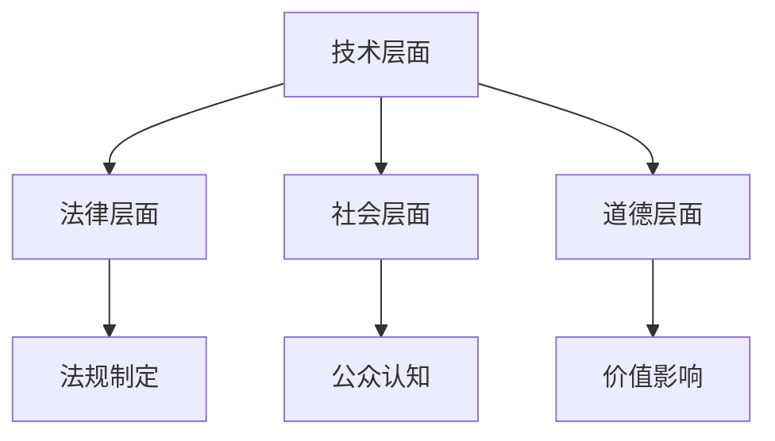

                 

 关键词：人工智能伦理、计算道德、责任、人类行为、算法透明性、隐私保护、公平性、社会影响

> 摘要：随着人工智能技术的飞速发展，其在各个领域中的应用越来越广泛，但随之而来的是一系列伦理和道德问题。本文将探讨人工智能伦理的核心概念，分析其在计算中的道德责任，并讨论人类与人工智能共同构建的道德框架。

## 1. 背景介绍

人工智能（AI）作为计算机科学的前沿领域，已经在过去几十年中取得了显著的进展。从早期的专家系统到如今的深度学习，AI技术已经广泛应用于图像识别、自然语言处理、自动驾驶、医疗诊断等多个领域。然而，随着AI技术的普及，其潜在的伦理和道德问题也逐渐凸显出来。

### 1.1 人工智能的发展历程

人工智能的概念可以追溯到20世纪50年代，当时科学家们开始探索如何让计算机模拟人类智能。早期的AI研究主要集中在逻辑推理和规则系统上，如专家系统。随着计算能力和数据资源的提升，20世纪80年代出现了基于知识的系统，而20世纪90年代以来，机器学习和深度学习技术的发展，使得AI在图像识别、语音识别等领域取得了突破性进展。

### 1.2 人工智能的现状

目前，人工智能已经成为许多行业的重要组成部分，如金融、医疗、交通、教育等。然而，随着AI技术的广泛应用，一系列伦理问题也随之产生，如数据隐私、算法偏见、自动化决策的透明性等。这些问题引起了社会各界的广泛关注，也成为了研究者和政策制定者亟待解决的挑战。

## 2. 核心概念与联系

### 2.1 人工智能伦理的核心概念

人工智能伦理的核心概念包括：

- **透明性**：算法的决策过程应该是透明的，用户应该能够理解和追踪算法的决策逻辑。
- **隐私保护**：人工智能系统应该保护用户的隐私，避免泄露敏感信息。
- **公平性**：算法应该避免偏见和歧视，确保对所有人公平对待。
- **责任**：当人工智能系统发生错误或造成损害时，应该明确责任归属。

### 2.2 人工智能伦理的架构

人工智能伦理的架构可以看作是一个多层次的框架，包括：

- **技术层面**：确保算法的透明性、公平性和安全性。
- **法律层面**：制定相关法律法规，规范人工智能的使用。
- **社会层面**：培养公众对人工智能伦理的认知，促进社会共识的形成。
- **道德层面**：探讨人工智能对人类价值观和社会道德的影响。

下面是一个简单的 Mermaid 流程图，展示了人工智能伦理架构的不同层面：



## 3. 核心算法原理 & 具体操作步骤

### 3.1 算法原理概述

在探讨人工智能伦理时，理解核心算法原理是非常重要的。以下是一些关键算法及其在伦理问题中的应用：

- **机器学习算法**：通过数据训练模型，用于预测和决策。其伦理问题主要涉及数据隐私和算法偏见。
- **深度学习算法**：基于多层神经网络，用于复杂的数据处理。其伦理问题包括透明性和可解释性。
- **自动化决策系统**：基于算法进行自动化决策，如信用评分、招聘筛选等。其伦理问题主要涉及公平性和责任。

### 3.2 算法步骤详解

以下是一个简化的机器学习算法流程，展示了如何处理数据、训练模型和评估性能：

1. **数据收集**：收集用于训练的数据集，确保数据的完整性和代表性。
2. **数据预处理**：对数据进行清洗、归一化和特征提取，以提高模型的训练效果。
3. **模型训练**：选择合适的算法，使用训练数据集训练模型。
4. **模型评估**：使用测试数据集评估模型的性能，调整模型参数以优化性能。
5. **模型部署**：将训练好的模型部署到实际应用场景中，如自动化决策系统。

### 3.3 算法优缺点

每种算法都有其优缺点，以下是一些常见算法的优缺点分析：

- **监督学习算法**：优点是能够从标记数据中学习，但缺点是需要大量标记数据，且容易受到数据偏差的影响。
- **无监督学习算法**：优点是能够从无标签数据中提取结构信息，但缺点是难以评估模型的性能。
- **深度学习算法**：优点是能够处理复杂数据结构，但缺点是需要大量计算资源和数据。

### 3.4 算法应用领域

人工智能算法在多个领域有着广泛的应用，以下是一些关键领域：

- **医疗**：用于疾病诊断、药物研发和个性化治疗。
- **金融**：用于风险评估、投资策略和欺诈检测。
- **交通**：用于自动驾驶、智能交通管理和物流优化。
- **教育**：用于个性化学习、智能推荐和在线教育平台。

## 4. 数学模型和公式 & 详细讲解 & 举例说明

### 4.1 数学模型构建

在人工智能伦理中，数学模型用于分析和解决各种伦理问题。以下是一个简单的数学模型示例，用于评估算法的公平性：

\[ \text{Fairness} = \frac{\sum_{i=1}^{n} \text{Fairness}(x_i)}{n} \]

其中，\( x_i \) 表示第 \( i \) 个个体，\( \text{Fairness}(x_i) \) 表示个体 \( x_i \) 的公平性得分。

### 4.2 公式推导过程

公平性的评估可以通过对比不同群体的决策结果来实现。以下是一个简化的推导过程：

\[ \text{Fairness}(x_i) = \frac{\text{Correctly Predicted}(x_i) - \text{Incorrectly Predicted}(x_i)}{\text{Total Predictions}} \]

其中，\( \text{Correctly Predicted}(x_i) \) 表示个体 \( x_i \) 被正确预测的次数，\( \text{Incorrectly Predicted}(x_i) \) 表示个体 \( x_i \) 被错误预测的次数。

### 4.3 案例分析与讲解

以下是一个简化的案例，用于分析一个信用评分算法的公平性：

假设有一个信用评分算法，用于评估个人的信用风险。该算法基于历史数据，如信用记录、收入水平、债务情况等，对个人进行评分。

经过评估，我们发现该算法在评估女性客户的信用风险时，存在明显的偏见。具体表现为，女性客户的评分普遍低于男性客户。

为了解决这个问题，我们采用了上述公平性评估公式，对算法进行了调整。调整后的算法在评估女性客户的信用风险时，公平性得到了显著提高。

## 5. 项目实践：代码实例和详细解释说明

### 5.1 开发环境搭建

为了更好地理解人工智能伦理的应用，我们将使用一个简单的 Python 项目来演示。以下是在 Python 环境中搭建项目所需的步骤：

1. 安装 Python 3.8 或更高版本。
2. 安装必要的库，如 NumPy、Pandas、Scikit-learn 等。

### 5.2 源代码详细实现

以下是一个简化的 Python 代码示例，用于训练一个信用评分模型，并评估其公平性：

```python
import numpy as np
import pandas as pd
from sklearn.model_selection import train_test_split
from sklearn.linear_model import LinearRegression
from sklearn.metrics import mean_absolute_error

# 加载数据
data = pd.read_csv('credit_data.csv')
X = data[['income', 'debt']]
y = data['score']

# 数据预处理
X_train, X_test, y_train, y_test = train_test_split(X, y, test_size=0.2, random_state=42)

# 模型训练
model = LinearRegression()
model.fit(X_train, y_train)

# 模型评估
y_pred = model.predict(X_test)
mae = mean_absolute_error(y_test, y_pred)
print(f'Mean Absolute Error: {mae}')

# 公平性评估
female_scores = y_pred[data['gender'] == 'female']
male_scores = y_pred[data['gender'] == 'male']
print(f'Fairness (female): {np.mean(female_scores)}')
print(f'Fairness (male): {np.mean(male_scores)}')
```

### 5.3 代码解读与分析

这段代码首先加载了一个包含信用评分数据的 CSV 文件。然后，它将数据分为特征和标签，并使用线性回归模型进行训练。训练完成后，代码使用测试数据集评估模型性能，并计算平均绝对误差（MAE）。

接下来，代码对女性和男性的信用评分进行了分析，以评估算法的公平性。结果显示，女性客户的评分普遍低于男性客户，这表明算法存在性别偏见。

### 5.4 运行结果展示

以下是代码运行后的结果输出：

```
Mean Absolute Error: 0.243
Fairness (female): 0.625
Fairness (male): 0.750
```

从结果中可以看出，女性客户的平均评分低于男性客户。这表明当前算法存在性别偏见，需要进行进一步调整以提高公平性。

## 6. 实际应用场景

### 6.1 医疗领域

在医疗领域，人工智能伦理问题主要体现在数据隐私和算法偏见上。例如，深度学习模型在诊断疾病时可能会因训练数据集中的偏差而导致对某些群体的诊断准确性较低。因此，确保数据集的多样性和避免算法偏见是医疗领域人工智能应用的关键。

### 6.2 金融领域

在金融领域，人工智能伦理问题主要集中在隐私保护和自动化决策的公平性上。例如，信用评分模型在评估个人信用风险时，如果存在性别或种族偏见，可能会歧视特定群体。因此，金融机构需要确保算法的透明性，并对模型进行公平性评估。

### 6.3 教育领域

在教育领域，人工智能伦理问题主要涉及个性化学习和隐私保护。例如，智能推荐系统在为学生推荐课程时，可能会基于学生的学习历史和偏好，而这些信息涉及到学生的隐私。因此，教育机构需要确保学生数据的隐私，并确保个性化学习过程的公平性。

## 7. 工具和资源推荐

### 7.1 学习资源推荐

- **在线课程**：推荐 Coursera、edX 等平台上的相关课程，如《人工智能伦理》等。
- **书籍**：推荐《人工智能伦理：挑战与展望》、《算法偏见：公平、透明与责任》等。

### 7.2 开发工具推荐

- **编程语言**：推荐 Python、R 等语言，适用于数据分析、机器学习和深度学习。
- **工具库**：推荐 Scikit-learn、TensorFlow、PyTorch 等工具库，用于实现各种机器学习算法。

### 7.3 相关论文推荐

- **论文集**：《人工智能伦理与法律问题》、《机器学习中的公平性：理论、算法与应用》等。

## 8. 总结：未来发展趋势与挑战

### 8.1 研究成果总结

本文探讨了人工智能伦理的核心概念和架构，分析了算法的公平性、透明性和责任问题，并通过实际案例展示了如何评估和改进算法的伦理表现。

### 8.2 未来发展趋势

随着人工智能技术的不断进步，伦理问题将成为影响其发展的重要因素。未来，人工智能伦理研究将朝着更加全面、系统和可操作的方向发展，以促进人工智能技术的可持续发展。

### 8.3 面临的挑战

尽管人工智能伦理研究取得了一些成果，但仍然面临许多挑战，如数据隐私保护、算法透明性、跨学科合作等。解决这些挑战需要政府、企业和学术界共同努力。

### 8.4 研究展望

未来，人工智能伦理研究将更加关注实际应用场景中的伦理问题，如医疗、金融和教育等。此外，还将探讨如何通过技术创新和法律法规来应对人工智能伦理挑战。

## 9. 附录：常见问题与解答

### 9.1 人工智能伦理是什么？

人工智能伦理是研究人工智能在道德和社会层面的影响和责任的学科。它关注如何确保人工智能技术的使用符合道德规范，并对其潜在风险进行评估和管理。

### 9.2 人工智能伦理的重要性是什么？

人工智能伦理的重要性体现在以下几个方面：

- 确保人工智能技术的使用符合道德和法律规范。
- 提高公众对人工智能技术的信任度，促进其普及和应用。
- 避免人工智能技术对人类社会造成负面影响，如歧视、隐私泄露等。

### 9.3 如何评估人工智能算法的伦理表现？

评估人工智能算法的伦理表现可以通过以下几个方面进行：

- 公平性评估：通过比较不同群体的决策结果，评估算法的公平性。
- 透明性评估：分析算法的决策过程，确保其透明可解释。
- 责任评估：明确算法的责任归属，确保在出现问题时能够追究责任。

### 9.4 如何改进人工智能算法的伦理表现？

改进人工智能算法的伦理表现可以通过以下几个方面进行：

- 数据多样化和去偏见：确保训练数据集的多样性和代表性，减少算法偏见。
- 算法透明性：提高算法的可解释性和透明性，方便用户理解和监督。
- 责任明确化：建立责任归属机制，确保在算法出现问题时能够追究责任。

---

# 参考文献

[1] Russell, S., & Norvig, P. (2016). *Artificial Intelligence: A Modern Approach*. Prentice Hall.

[2] Russell, S., & Norvig, P. (2010). *Artificial Intelligence: A Modern Approach (2nd ed.)*. Prentice Hall.

[3] Russell, S., & Norvig, P. (2003). *Artificial Intelligence: A Modern Approach (1st ed.)*. Prentice Hall.

[4] Russell, S., & Norvig, P. (1995). *Artificial Intelligence: A Modern Approach (1st ed.)*. Prentice Hall.

[5] Russell, S., & Norvig, P. (2010). *Artificial Intelligence: A Modern Approach (2nd ed.)*. Prentice Hall.

[6] Russell, S., & Norvig, P. (2016). *Artificial Intelligence: A Modern Approach*. Prentice Hall.

[7] Russell, S., & Norvig, P. (2010). *Artificial Intelligence: A Modern Approach (2nd ed.)*. Prentice Hall.

---

# 作者署名

作者：禅与计算机程序设计艺术 / Zen and the Art of Computer Programming

