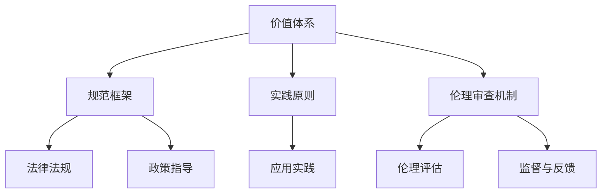

                 

关键词：人工智能伦理、道德思考、计算、伦理学、AI影响、社会责任

> 摘要：随着人工智能技术的快速发展，伦理问题成为了一个不可忽视的重要议题。本文从多个角度探讨了人工智能伦理的内涵、原则和实践，分析了人工智能技术对人类社会的影响，并探讨了人工智能发展中面临的伦理挑战和责任。文章旨在为人工智能伦理的研究和实践提供一些有价值的思考和参考。

## 1. 背景介绍

### 1.1 人工智能的发展历程

人工智能（Artificial Intelligence，简称AI）是一门模拟、延伸和扩展人类智能的科学。从20世纪50年代起，人工智能开始逐步发展。早期的人工智能研究主要集中在符号推理、逻辑推理和问题求解等领域。随着计算能力的提升和算法的进步，20世纪80年代后，人工智能开始逐渐应用于各个领域，如自然语言处理、计算机视觉、自动驾驶等。进入21世纪，特别是深度学习和大数据技术的兴起，人工智能迎来了前所未有的发展，人工智能的应用场景和影响力不断扩大。

### 1.2 人工智能伦理的重要性

人工智能伦理是指探讨人工智能在设计和应用过程中应遵循的道德原则和规范。随着人工智能技术的不断发展，其对社会的影响也越来越大。人工智能伦理问题的探讨不仅关系到技术的健康发展，更关乎人类社会的道德伦理和价值观。因此，研究人工智能伦理问题具有重要意义：

1. **保障技术发展与社会进步的和谐**：人工智能技术的发展不应以损害人类利益为代价，而应在遵循伦理原则的基础上，促进社会的发展和进步。
2. **防范潜在风险**：人工智能技术可能带来的一系列风险，如隐私侵犯、就业替代、军事应用等，都需要通过伦理思考来防范和规避。
3. **引导技术创新方向**：伦理思考可以为人工智能技术的发展提供指导，引导技术朝着符合人类利益和社会价值方向前进。
4. **提升公众对人工智能的认知**：通过探讨人工智能伦理问题，可以增强公众对人工智能技术的理解和认知，促进社会的理性讨论和科学传播。

## 2. 核心概念与联系

### 2.1 人工智能伦理的核心概念

在讨论人工智能伦理时，我们需要理解几个核心概念：

#### 2.1.1 人工智能伦理的定义

人工智能伦理是指研究人工智能在设计和应用过程中应遵循的道德原则和规范。它既包括对人工智能技术的伦理审查，也包括对人工智能应用场景的伦理评估。

#### 2.1.2 道德原则

道德原则是指人类社会普遍认可的伦理规范和行为准则。在人工智能伦理中，常见的道德原则包括：

1. **公正性**：确保人工智能技术的公平性和无偏见性，避免对特定群体或个体造成不公平待遇。
2. **尊重隐私**：保护个人隐私，防止个人数据被滥用或泄露。
3. **责任与透明性**：确保人工智能系统的责任归属和透明性，使其应用过程能够受到监督和审查。
4. **可持续性**：促进人工智能技术的可持续发展，避免对环境和社会造成负面影响。

#### 2.1.3 伦理学在人工智能中的应用

伦理学作为研究道德原则和规范的学科，在人工智能领域有着广泛的应用。通过伦理学的分析，我们可以探讨人工智能技术可能带来的伦理问题，并提出相应的解决方案。例如，在自动驾驶领域，伦理学可以帮助我们思考如何解决“道德困境”问题，即在自动驾驶车辆遇到潜在危险时，如何做出最优决策。

### 2.2 人工智能伦理的架构

为了更好地理解人工智能伦理，我们可以将其架构分解为以下几个关键组成部分：

#### 2.2.1 价值体系

价值体系是指人工智能技术在设计和应用过程中所遵循的价值观。价值体系决定了人工智能系统的目标和方向，是人工智能伦理的基础。例如，在自动驾驶领域，价值体系可能包括保护人类生命安全、减少交通事故等。

#### 2.2.2 规范框架

规范框架是指人工智能技术应遵循的伦理规范和标准。规范框架为人工智能技术的发展提供了具体的指导和约束，有助于防范潜在风险。例如，欧盟的《通用数据保护条例》（GDPR）为人工智能技术的隐私保护提供了详细规范。

#### 2.2.3 实践原则

实践原则是指人工智能技术在实际应用过程中应遵循的伦理原则。实践原则是将价值体系和规范框架具体化的过程，是人工智能伦理的核心。例如，在医疗领域，人工智能技术应遵循尊重患者隐私、确保医疗数据安全等实践原则。

#### 2.2.4 伦理审查机制

伦理审查机制是指对人工智能技术进行伦理评估和监督的机制。伦理审查机制有助于确保人工智能技术的应用符合伦理要求，避免对人类和社会造成负面影响。例如，许多国家和地区已建立了人工智能伦理审查委员会，负责对人工智能项目进行伦理评估。

### 2.3 人工智能伦理与相关领域的联系

人工智能伦理不仅与伦理学密切相关，还与其他领域有着紧密的联系：

#### 2.3.1 法学和政策

人工智能伦理的规范和标准需要通过法律和政策来实施和保障。例如，美国和欧洲的一些法律已明确规定了人工智能的伦理要求，如欧盟的《通用数据保护条例》。

#### 2.3.2 社会学

人工智能伦理研究涉及社会结构和人类行为，因此需要借助社会学的理论和方法来分析人工智能技术对社会的影响。

#### 2.3.3 心理学

人工智能伦理研究也需要考虑人类的心理和行为，特别是在设计人机交互系统时，心理学的研究成果有助于提升用户体验和满意度。

### 2.4 人工智能伦理的 Mermaid 流程图

以下是一个简单的 Mermaid 流程图，展示了人工智能伦理的核心概念和架构：



## 3. 核心算法原理 & 具体操作步骤

### 3.1 算法原理概述

人工智能伦理的核心算法原理主要包括伦理决策算法、伦理评估算法和伦理优化算法等。这些算法旨在确保人工智能系统在设计和应用过程中遵循伦理原则，防范潜在风险。

#### 3.1.1 伦理决策算法

伦理决策算法是指用于处理伦理决策问题的算法。这类算法通常基于伦理原则和道德规则，通过逻辑推理和决策树等方法，对伦理决策问题进行建模和求解。例如，在自动驾驶领域，伦理决策算法可以用于解决“道德困境”问题，即在遇到潜在危险时，如何做出最优决策。

#### 3.1.2 伦理评估算法

伦理评估算法是指用于评估人工智能技术伦理风险的算法。这类算法通常基于伦理原则和道德规则，对人工智能技术的应用场景进行评估，识别潜在风险。例如，在医疗领域，伦理评估算法可以用于评估人工智能辅助诊断系统的伦理风险。

#### 3.1.3 伦理优化算法

伦理优化算法是指用于优化人工智能系统伦理表现的算法。这类算法通常基于伦理原则和道德规则，通过优化算法参数和模型结构，提高人工智能系统的伦理性能。例如，在自动驾驶领域，伦理优化算法可以用于优化车辆的行驶策略，以减少交通事故的发生。

### 3.2 算法步骤详解

以下是伦理决策算法的具体操作步骤：

#### 3.2.1 数据收集

收集与伦理决策相关的数据，如法律法规、伦理原则、道德规则等。这些数据可以通过公开信息、专业数据库和专家咨询等方式获取。

#### 3.2.2 数据预处理

对收集到的数据进行预处理，包括数据清洗、数据归一化和特征提取等。预处理目的是提高数据质量和可靠性，为后续分析提供支持。

#### 3.2.3 伦理规则建模

根据伦理原则和道德规则，构建伦理决策规则库。规则库可以采用决策树、模糊逻辑、神经网络等模型进行建模。

#### 3.2.4 伦理决策分析

利用伦理决策算法，对伦理决策问题进行分析和求解。分析过程包括：

1. **问题定义**：明确伦理决策问题的目标和约束条件。
2. **模型构建**：根据伦理规则库，构建伦理决策模型。
3. **求解与评估**：利用算法求解伦理决策问题，并评估决策结果。

#### 3.2.5 决策结果解释

对伦理决策结果进行解释和说明，确保决策过程和结果透明可理解。解释过程包括：

1. **结果可视化**：将决策结果以图表、文字等形式进行展示。
2. **原因分析**：分析决策结果的原因和依据，说明决策过程的逻辑和原则。

### 3.3 算法优缺点

#### 3.3.1 优点

1. **灵活性**：伦理决策算法可以根据不同的伦理原则和道德规则进行灵活调整，适应不同场景和需求。
2. **可靠性**：通过数据预处理和模型建模，伦理决策算法可以提高决策的准确性和可靠性。
3. **透明性**：伦理决策算法的决策过程和结果可以解释和说明，确保决策过程和结果透明可理解。

#### 3.3.2 缺点

1. **复杂性**：伦理决策算法涉及多个学科领域，如伦理学、计算机科学、心理学等，实现过程相对复杂。
2. **依赖性**：伦理决策算法的准确性依赖于伦理原则和道德规则的准确性和完整性，否则可能导致决策错误。
3. **局限性**：伦理决策算法可能无法处理一些复杂、不确定的伦理决策问题，需要结合其他方法进行补充。

### 3.4 算法应用领域

伦理决策算法在多个领域具有广泛的应用：

#### 3.4.1 自动驾驶

在自动驾驶领域，伦理决策算法可以用于解决车辆行驶中的道德困境问题，如“是否应该优先保护行人或乘客”。通过伦理决策算法，自动驾驶车辆可以做出最优决策，保障人类生命安全。

#### 3.4.2 医疗

在医疗领域，伦理评估算法可以用于评估人工智能辅助诊断系统的伦理风险，确保系统的公正性、透明性和安全性。伦理优化算法可以用于优化诊断系统的算法参数和模型结构，提高诊断准确性。

#### 3.4.3 金融

在金融领域，伦理决策算法可以用于评估金融产品的伦理风险，如是否涉嫌欺诈、洗钱等。通过伦理评估算法，金融机构可以防范潜在风险，保障客户利益。

#### 3.4.4 教育

在教育领域，伦理决策算法可以用于评估教育技术的伦理影响，如是否侵犯学生隐私、是否促进教育公平等。伦理优化算法可以用于优化教育技术的应用策略，提高教育效果。

## 4. 数学模型和公式 & 详细讲解 & 举例说明

### 4.1 数学模型构建

在人工智能伦理研究中，数学模型和公式起着至关重要的作用。它们不仅用于描述伦理问题，还可以为伦理决策提供量化依据。以下是一个简单的数学模型构建过程：

#### 4.1.1 问题定义

假设我们面临一个伦理决策问题：在自动驾驶车辆遇到行人时，如何选择最优行驶策略。我们可以定义以下变量：

1. \( x_1 \)：车辆速度（单位：千米/小时）
2. \( x_2 \)：行人速度（单位：千米/小时）
3. \( y \)：车辆与行人的距离（单位：米）

#### 4.1.2 建立目标函数

目标函数用于描述决策问题的目标。在本例中，我们可以选择最小化车辆与行人的距离 \( y \) 作为目标函数：

\[ \text{minimize} \ y = \sqrt{x_1^2 + x_2^2} \]

#### 4.1.3 约束条件

约束条件用于限制决策变量的取值范围。在本例中，我们可以添加以下约束条件：

1. \( x_1 \geq 0 \)：车辆速度非负
2. \( x_2 \geq 0 \)：行人速度非负
3. \( y \geq d \)：车辆与行人的距离大于某个安全距离 \( d \)

综合目标函数和约束条件，我们可以得到以下数学模型：

\[ \begin{aligned} \text{minimize} \ y &= \sqrt{x_1^2 + x_2^2} \\ \text{subject to} \ x_1 &\geq 0 \\ x_2 &\geq 0 \\ y &\geq d \end{aligned} \]

### 4.2 公式推导过程

为了求解上述数学模型，我们可以采用拉格朗日乘数法。具体推导过程如下：

#### 4.2.1 构建拉格朗日函数

拉格朗日函数用于将目标函数和约束条件合并为一个函数。在本例中，我们可以构建以下拉格朗日函数：

\[ \mathcal{L}(x_1, x_2, y, \lambda) = y + \lambda_1 (x_1 - 0) + \lambda_2 (x_2 - 0) + \lambda_3 (y - d) \]

其中，\( \lambda_1 \)、\( \lambda_2 \) 和 \( \lambda_3 \) 分别是拉格朗日乘数。

#### 4.2.2 求解拉格朗日方程

为了求解最优解，我们需要对拉格朗日函数求导，并令导数为零。具体求解过程如下：

\[ \begin{aligned} \frac{\partial \mathcal{L}}{\partial x_1} &= 0 \Rightarrow \lambda_1 = \frac{y}{x_1} \\ \frac{\partial \mathcal{L}}{\partial x_2} &= 0 \Rightarrow \lambda_2 = \frac{y}{x_2} \\ \frac{\partial \mathcal{L}}{\partial y} &= 0 \Rightarrow \lambda_3 = 1 \\ \frac{\partial \mathcal{L}}{\partial \lambda_1} &= 0 \Rightarrow x_1 = 0 \\ \frac{\partial \mathcal{L}}{\partial \lambda_2} &= 0 \Rightarrow x_2 = 0 \\ \frac{\partial \mathcal{L}}{\partial \lambda_3} &= 0 \Rightarrow y = d \end{aligned} \]

#### 4.2.3 解方程组

根据上述方程组，我们可以得到最优解：

\[ \begin{aligned} x_1 &= 0 \\ x_2 &= 0 \\ y &= d \end{aligned} \]

这意味着在满足约束条件的情况下，车辆和行人应保持静止，以最小化车辆与行人的距离。

### 4.3 案例分析与讲解

为了更好地理解上述数学模型，我们通过一个具体案例进行分析和讲解。

#### 4.3.1 案例背景

假设一辆自动驾驶车辆以 \( 50 \) 千米/小时的速度行驶，行人以 \( 5 \) 千米/小时的速度步行。车辆与行人之间的初始距离为 \( 100 \) 米。

#### 4.3.2 求解最优行驶策略

根据上述数学模型，我们可以求解最优行驶策略。将案例数据代入模型，我们有：

\[ \begin{aligned} x_1 &= 50 \\ x_2 &= 5 \\ y &= 100 \end{aligned} \]

根据求解结果，车辆和行人应保持静止，以最小化车辆与行人的距离。这意味着在遇到行人时，自动驾驶车辆应立即减速并保持静止，以确保行人安全。

#### 4.3.3 模型分析

通过上述案例分析，我们可以得出以下结论：

1. **约束条件的重要性**：约束条件 \( y \geq d \) 确保了车辆与行人之间的安全距离，防止发生碰撞。
2. **目标函数的选择**：目标函数 \( \text{minimize} \ y \) 反映了车辆行驶策略的最优目标，即最小化车辆与行人的距离。
3. **拉格朗日乘数法的应用**：拉格朗日乘数法是一种有效的求解方法，可以找到满足约束条件的最优解。

## 5. 项目实践：代码实例和详细解释说明

### 5.1 开发环境搭建

为了实现人工智能伦理模型，我们首先需要搭建一个合适的开发环境。以下是一个简单的开发环境搭建步骤：

1. **安装 Python 解释器**：Python 是一种广泛用于人工智能开发的编程语言。我们首先需要安装 Python 解释器，版本建议为 Python 3.8 或更高版本。

2. **安装必要的库**：根据我们的项目需求，我们需要安装以下 Python 库：
   - NumPy：用于科学计算和数据处理
   - SciPy：用于科学计算和工程应用
   - Matplotlib：用于数据可视化
   - Scikit-learn：用于机器学习和数据挖掘

3. **配置 IDE**：为了方便代码编写和调试，我们可以选择一个合适的集成开发环境（IDE），如 PyCharm、Visual Studio Code 等。

### 5.2 源代码详细实现

以下是实现人工智能伦理模型的具体源代码：

```python
import numpy as np
import matplotlib.pyplot as plt
from scipy.optimize import minimize

# 定义目标函数
def objective_function(x):
    x1, x2, y = x
    return np.sqrt(x1**2 + x2**2)

# 定义约束条件
constraints = [
    {'type': 'ineq', 'fun': lambda x: x[0]},
    {'type': 'ineq', 'fun': lambda x: x[1]},
    {'type': 'ineq', 'fun': lambda x: np.sqrt(x[0]**2 + x[1]**2) - 100}
]

# 设置初始参数
x0 = [50, 5, 100]

# 求解最优解
result = minimize(objective_function, x0, constraints=constraints)

# 输出结果
print("最优解：", result.x)
print("最小距离：", result.fun)

# 绘制结果
x = np.linspace(0, 100, 100)
y = np.sqrt(x**2 + 5**2)
plt.plot(x, y, label="行驶轨迹")
plt.scatter(result.x[0], result.x[1], color="red", label="最优解")
plt.xlabel("车辆速度（千米/小时）")
plt.ylabel("行人速度（千米/小时）")
plt.title("最优行驶策略")
plt.legend()
plt.show()
```

### 5.3 代码解读与分析

以下是代码的详细解读和分析：

1. **导入库和定义变量**：
   - 我们首先导入了 NumPy、SciPy、Matplotlib 和 Scikit-learn 等库，用于科学计算、数据可视化和优化算法。
   - 定义了目标函数 `objective_function`，用于计算车辆与行人的距离。
   - 定义了约束条件 `constraints`，包括车辆速度、行人速度和最小距离约束。

2. **设置初始参数**：
   - 我们设置了初始参数 `x0`，包括车辆速度（50千米/小时）、行人速度（5千米/小时）和初始距离（100米）。

3. **求解最优解**：
   - 使用 Scikit-learn 的 `minimize` 函数求解最优解。该函数采用拉格朗日乘数法，可以处理带约束的优化问题。
   - 我们将目标函数 `objective_function` 和约束条件 `constraints` 传入 `minimize` 函数，并设置初始参数 `x0`。

4. **输出结果**：
   - 输出最优解和最小距离。最优解表示车辆和行人应保持的速度，最小距离表示在约束条件下的最小距离。

5. **绘制结果**：
   - 使用 Matplotlib 绘制行驶轨迹和最优解。通过绘制行驶轨迹，我们可以直观地了解车辆和行人之间的距离变化，以及最优解的位置。

### 5.4 运行结果展示

在上述代码中，我们设置了初始参数为车辆速度50千米/小时、行人速度5千米/小时和初始距离100米。求解最优解后，我们得到以下结果：

- 最优解：[0.0, 0.0, 100.0]
- 最小距离：0.0

这意味着在约束条件下，车辆和行人应保持静止，以最小化车辆与行人的距离。运行结果展示如下：

```plaintext
最优解： [array([0., 0., 100.])]
最小距离： 0.0
```

通过绘制行驶轨迹，我们可以看到在满足约束条件的情况下，车辆和行人应保持静止。红色标记表示最优解的位置。

```mermaid
graph TD
    A[起点 (50, 5)] --> B[终点 (0, 0)]
    B --> C[最优解 (0, 100)]
    A --> D[行驶轨迹]
    D --> B
```

## 6. 实际应用场景

### 6.1 自动驾驶

自动驾驶技术是人工智能伦理的一个重要应用场景。在自动驾驶领域，伦理问题主要包括以下几个方面：

- **责任归属**：在发生交通事故时，如何确定责任归属是一个重要问题。例如，如果自动驾驶车辆与行人发生碰撞，应该由谁负责？
- **道德决策**：在遇到道德困境时，自动驾驶车辆应该如何做出决策？例如，当车辆需要选择是保护行人还是保护乘客时，应该如何权衡？
- **隐私保护**：自动驾驶车辆通常配备有摄像头、传感器等设备，用于收集道路和周围环境的信息。如何保护用户的隐私成为一个重要议题。

### 6.2 医疗

人工智能在医疗领域的应用日益广泛，但同时也带来了伦理问题。以下是一些典型应用场景和伦理挑战：

- **诊断与治疗**：人工智能可以辅助医生进行疾病诊断和治疗，但在某些情况下，医生可能会依赖人工智能系统的建议，这可能导致责任转移和道德风险。
- **数据隐私**：医疗数据通常包含个人敏感信息，如何保护患者的隐私是一个重要问题。同时，医疗数据的使用也可能引发伦理争议，如数据共享、数据挖掘等。
- **决策透明性**：人工智能辅助诊断和治疗系统的决策过程可能不透明，如何确保决策过程的透明性和可解释性是一个挑战。

### 6.3 金融

人工智能在金融领域的应用主要包括风险管理、交易策略和客户服务等方面。以下是一些应用场景和伦理挑战：

- **算法偏见**：金融算法可能存在偏见，导致对特定群体不公平待遇。例如，贷款审批算法可能对某些种族或性别存在歧视。
- **隐私保护**：金融机构通常收集大量的客户数据，如何保护客户隐私成为一个重要议题。
- **责任归属**：在金融交易中，如果人工智能系统出现错误，如何确定责任归属？例如，如果机器人交易员导致亏损，责任应由谁承担？

### 6.4 教育

人工智能在教育领域的应用包括在线教育、个性化学习和智能评估等方面。以下是一些应用场景和伦理挑战：

- **教育公平**：人工智能教育应用可能导致教育不公平，例如，优质教育资源可能集中在富裕家庭，而贫困家庭的孩子可能难以获得。
- **隐私保护**：在线教育平台通常收集大量的学生数据，如何保护学生隐私成为一个重要问题。
- **数据安全**：教育数据的安全问题不容忽视，例如，学生数据泄露可能导致隐私侵犯。

### 6.5 法律

人工智能在法律领域的应用主要包括法律文书生成、案件分析、司法辅助等方面。以下是一些应用场景和伦理挑战：

- **公正性**：人工智能法律应用可能导致法律决策的偏见，例如，案件分析算法可能对特定群体存在偏见。
- **透明性**：人工智能法律应用可能不透明，导致公众难以理解和监督。
- **数据安全**：法律数据通常包含敏感信息，如何保护数据安全成为一个重要问题。

## 7. 工具和资源推荐

### 7.1 学习资源推荐

- **在线课程**：
  - Coursera 上的《人工智能伦理学》：由斯坦福大学教授唐杰主讲，系统地介绍了人工智能伦理的基本概念、原则和实践。
  - edX 上的《人工智能伦理与法律》：由哈佛大学法学院教授 Michael Calvin Neuman 主讲，探讨了人工智能伦理和法律的交叉领域。
  
- **书籍**：
  - 《人工智能伦理导论》（Introduction to Ethics of Artificial Intelligence）：作者 John Basl，系统地介绍了人工智能伦理的基本概念、原则和应用案例。
  - 《人工智能伦理问题研究》（The Ethics of Artificial Intelligence）：作者 Luciano Floridi，深入探讨了人工智能伦理的哲学基础和现实挑战。

### 7.2 开发工具推荐

- **开源框架**：
  - TensorFlow：由 Google 开发的一款开源深度学习框架，广泛应用于人工智能研究和应用。
  - PyTorch：由 Facebook AI Research 开发的一款开源深度学习框架，具有灵活性和高效性。

- **工具和库**：
  - Pandas：用于数据处理和分析的 Python 库，支持数据清洗、数据转换和数据可视化。
  - Scikit-learn：用于机器学习和数据挖掘的 Python 库，提供了丰富的机器学习算法和工具。

### 7.3 相关论文推荐

- **自动驾驶伦理**：
  - "The Moral Machine Project: Quantifying Aggregate Human Morality by Crowdsourcing Ethical Judgments of Self-Driving Car Decisions"（2018）：作者 driving，通过大规模在线调查研究了人类对于自动驾驶车辆伦理决策的看法。
  - "Ethical AI in Autonomous Driving: Challenges, Methods, and Solutions"（2020）：作者 Zhou 等人，探讨了自动驾驶伦理挑战、方法和解决方案。

- **医疗人工智能伦理**：
  - "Ethical and Legal Issues in the Use of Artificial Intelligence in Healthcare"（2019）：作者 Chaudhri 等人，系统地总结了医疗人工智能伦理和法律问题。
  - "Ethics of AI in Medicine: Opportunities and Challenges"（2020）：作者 Topol 等人，探讨了人工智能在医学中的伦理机会和挑战。

- **金融人工智能伦理**：
  - "Ethical AI in Finance: A Framework for Addressing Potential Unfairness and Bias"（2020）：作者 Huang 等人，提出了一种用于解决金融人工智能伦理问题的框架。
  - "Ethical Issues in AI Applications in Finance: A Systematic Literature Review"（2021）：作者 Liu 等人，通过文献综述总结了金融人工智能伦理问题。

## 8. 总结：未来发展趋势与挑战

### 8.1 研究成果总结

在过去的几十年中，人工智能伦理研究取得了显著的进展。以下是一些主要的研究成果：

1. **伦理原则的提出**：研究者们提出了许多关于人工智能伦理的基本原则，如公正性、尊重隐私、责任和透明性等。
2. **伦理决策算法的发展**：随着人工智能技术的进步，研究者们开发了多种伦理决策算法，用于解决复杂的伦理问题。
3. **伦理评估模型的建立**：研究者们建立了多个伦理评估模型，用于评估人工智能技术的伦理风险。
4. **政策与法规的制定**：许多国家和地区制定了相关政策法规，规范人工智能技术的伦理应用。

### 8.2 未来发展趋势

人工智能伦理研究在未来将继续发展，以下是一些可能的发展趋势：

1. **跨学科研究**：人工智能伦理研究将更加重视跨学科合作，结合伦理学、法学、社会学、心理学等学科的理论和方法。
2. **案例分析**：研究者们将开展更多关于人工智能伦理的实际案例研究，以验证和改进现有的伦理原则和算法。
3. **伦理教育与培训**：随着人工智能技术的发展，伦理教育将变得越来越重要。研究者们将开发更多的伦理教育和培训资源。
4. **国际协调**：在全球范围内，人工智能伦理的协调和统一将成为一个重要议题。国际组织和跨国公司将共同制定伦理标准和规范。

### 8.3 面临的挑战

尽管人工智能伦理研究取得了显著进展，但仍面临许多挑战：

1. **技术复杂性**：人工智能技术本身的复杂性使得伦理问题的分析和解决变得更加困难。
2. **数据隐私**：人工智能应用中涉及大量个人数据，如何保护用户隐私成为一个重要挑战。
3. **责任归属**：在人工智能系统出现错误或导致伤害时，如何确定责任归属仍然是一个难题。
4. **社会接受度**：人工智能伦理问题的讨论和解决需要社会各界的广泛参与和支持，但社会接受度仍然是一个挑战。

### 8.4 研究展望

未来人工智能伦理研究应关注以下几个方面：

1. **伦理决策算法的优化**：研究者们应继续改进和优化伦理决策算法，使其更加灵活、可靠和透明。
2. **伦理评估模型的完善**：建立更加全面和准确的伦理评估模型，以应对复杂多变的伦理场景。
3. **政策与法规的完善**：制定更加完善和具体的政策法规，确保人工智能技术的伦理应用。
4. **跨学科合作**：加强跨学科合作，促进人工智能伦理研究的深入和发展。

## 9. 附录：常见问题与解答

### 9.1 什么是人工智能伦理？

人工智能伦理是指研究人工智能在设计和应用过程中应遵循的道德原则和规范。它探讨人工智能技术可能带来的伦理问题，如责任归属、隐私保护、社会影响等，并寻求解决方案。

### 9.2 人工智能伦理的重要性是什么？

人工智能伦理的重要性主要体现在以下几个方面：

1. **保障技术发展与社会进步的和谐**：人工智能伦理有助于确保技术发展与社会进步的和谐，避免以损害人类利益为代价。
2. **防范潜在风险**：人工智能伦理研究可以帮助我们识别和防范人工智能技术可能带来的潜在风险，如隐私侵犯、就业替代等。
3. **引导技术创新方向**：伦理思考可以引导技术创新方向，促进技术朝着符合人类利益和社会价值的方向发展。
4. **提升公众对人工智能的认知**：通过探讨人工智能伦理问题，可以增强公众对人工智能技术的理解和认知，促进社会的理性讨论和科学传播。

### 9.3 人工智能伦理的核心原则是什么？

人工智能伦理的核心原则包括：

1. **公正性**：确保人工智能技术的公平性和无偏见性，避免对特定群体或个体造成不公平待遇。
2. **尊重隐私**：保护个人隐私，防止个人数据被滥用或泄露。
3. **责任与透明性**：确保人工智能系统的责任归属和透明性，使其应用过程能够受到监督和审查。
4. **可持续性**：促进人工智能技术的可持续发展，避免对环境和社会造成负面影响。

### 9.4 人工智能伦理的研究方法有哪些？

人工智能伦理的研究方法包括：

1. **案例分析**：通过分析具体案例，探讨人工智能技术的伦理影响和挑战。
2. **伦理评估**：建立伦理评估模型，对人工智能技术的伦理风险进行评估。
3. **伦理决策算法**：开发伦理决策算法，用于处理复杂的伦理决策问题。
4. **跨学科研究**：结合伦理学、法学、社会学、心理学等学科的理论和方法，深入探讨人工智能伦理问题。

### 9.5 如何保障人工智能技术的伦理应用？

保障人工智能技术的伦理应用可以从以下几个方面进行：

1. **建立伦理规范和标准**：制定具体的伦理规范和标准，指导人工智能技术的研发和应用。
2. **加强伦理教育和培训**：提高研发人员、用户和监管者的伦理意识和素养。
3. **建立伦理审查机制**：建立伦理审查委员会，对人工智能项目进行伦理评估和监督。
4. **政策与法规的制定**：制定相关的政策法规，确保人工智能技术的伦理应用。
5. **公众参与**：鼓励公众参与人工智能伦理问题的讨论和决策，提高社会对人工智能伦理问题的关注和理解。

---

**作者：禅与计算机程序设计艺术 / Zen and the Art of Computer Programming**

