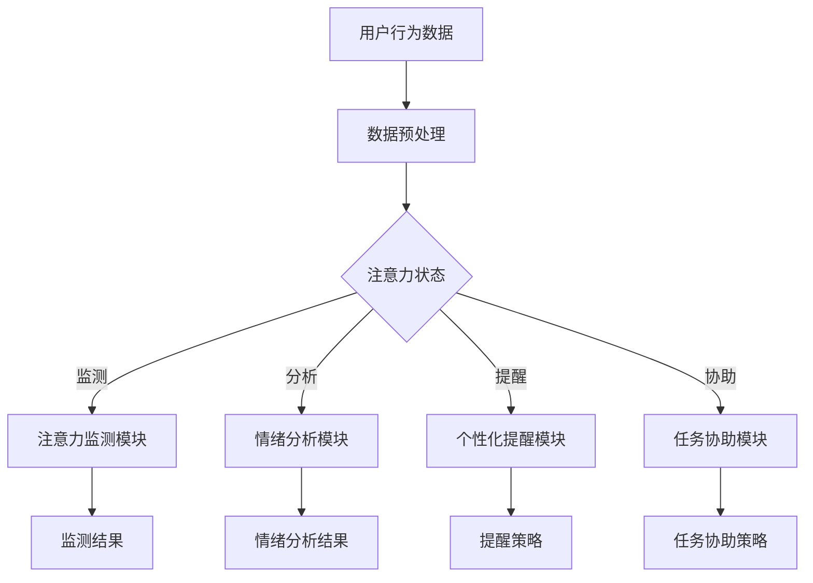

                 

人工智能助手在当今数字时代的地位日益重要，尤其在注意力管理的领域。注意力管理，即对个人注意力的有效控制与调节，是提高工作效率、提升学习成果、实现个人目标的重要手段。本文将探讨人工智能助手在注意力管理中的作用，从核心概念、算法原理、数学模型、项目实践、实际应用等多个角度展开，旨在为读者提供全面的理解和实用的指导。

## 文章关键词

- 人工智能
- 注意力管理
- 专注力提升
- 智能助手
- 注意力追踪
- 智能算法

## 文章摘要

本文首先介绍了注意力管理的概念及其重要性，然后探讨了人工智能助手在这一领域的作用和功能。通过核心概念和算法原理的阐述，本文深入分析了注意力管理中的关键技术。接着，通过数学模型和公式的推导，本文进一步解释了注意力管理的理论基础。项目实践部分提供了具体的代码实例和操作步骤，展示了人工智能助手在实际场景中的应用。最后，本文讨论了注意力管理的实际应用场景，并展望了未来的发展趋势与挑战。

## 1. 背景介绍

### 注意力管理的重要性

注意力管理是指通过一系列策略和技术，帮助个体有效地调节和控制自己的注意力，以实现特定目标。在快节奏和高度信息化的现代社会中，注意力管理显得尤为重要。它不仅关系到工作效率，还影响到个人的学习效果、身心健康以及生活质量。

### 人工智能助手的发展

人工智能助手是人工智能技术在自然语言处理、机器学习、深度学习等领域取得的成果之一。这些助手能够理解和响应人类语言，提供个性化的服务，协助用户完成复杂的任务。随着技术的进步，人工智能助手的功能越来越强大，逐渐成为人们生活和工作中不可或缺的一部分。

### 注意力管理和人工智能的交汇

注意力管理和人工智能助手的交汇，为提升注意力提供了新的可能性。人工智能助手可以通过数据分析、模式识别等技术，帮助用户识别注意力分散的时刻，提供个性化的提醒和指导，从而提高注意力的集中度和效率。

## 2. 核心概念与联系

### 核心概念

#### 注意力

注意力是指个体在选择、组织和处理信息时的心理活动，它决定了个体对外界刺激的反应和内化过程。

#### 人工智能助手

人工智能助手是指利用人工智能技术，模拟人类思维和行为，为用户提供服务和帮助的软件系统。

### 关联与作用

人工智能助手在注意力管理中起到桥梁作用，将人类注意力与智能技术相结合，实现以下几个方面的功能：

1. **注意力监测**：通过传感器和算法，实时监测用户的注意力状态。
2. **个性化提醒**：根据用户的行为数据和偏好，提供个性化的提醒和指导。
3. **任务协助**：帮助用户规划任务，提供执行任务的步骤和建议。
4. **情绪调节**：通过情绪分析，提供情绪调节策略，帮助用户保持积极心态。

### Mermaid 流程图



## 3. 核心算法原理 & 具体操作步骤

### 3.1 算法原理概述

注意力管理的核心算法基于机器学习和深度学习技术，主要包括以下几个方面：

1. **注意力监测算法**：利用传感器数据和机器学习模型，实时监测用户的注意力状态。
2. **情绪分析算法**：通过自然语言处理和情感分析技术，评估用户的情绪状态。
3. **个性化提醒算法**：根据用户的注意力状态和情绪分析结果，提供个性化的提醒和指导。

### 3.2 算法步骤详解

#### 3.2.1 注意力监测算法

1. 数据收集：收集用户的生理数据、行为数据和环境数据。
2. 数据预处理：对收集的数据进行清洗和标准化处理。
3. 模型训练：利用预处理后的数据，训练注意力监测模型。
4. 实时监测：使用训练好的模型，实时监测用户的注意力状态。

#### 3.2.2 情绪分析算法

1. 语言处理：对用户的文本数据进行分词、词性标注等预处理。
2. 情感分类：利用情感分类模型，对预处理后的文本数据进行情感分类。
3. 情绪评估：根据情感分类结果，评估用户的情绪状态。

#### 3.2.3 个性化提醒算法

1. 数据融合：将注意力监测结果和情绪分析结果进行融合处理。
2. 提醒策略生成：根据融合后的数据，生成个性化的提醒策略。
3. 提醒执行：将提醒策略发送给用户，帮助用户调整注意力和情绪。

### 3.3 算法优缺点

#### 优点

1. **实时监测**：能够实时监测用户的注意力状态，提供及时的帮助。
2. **个性化**：根据用户的具体情况，提供个性化的提醒和指导。
3. **高效**：通过人工智能技术，提高注意力管理的效率和效果。

#### 缺点

1. **数据依赖**：需要大量的用户数据支持，数据质量对算法性能有重要影响。
2. **隐私问题**：用户的注意力数据和情绪数据涉及隐私，如何保护用户隐私是重要问题。
3. **算法偏差**：算法可能存在一定的偏见，需要不断优化和调整。

### 3.4 算法应用领域

1. **工作场景**：帮助职场人士提高工作效率，集中注意力。
2. **学习场景**：辅助学生和教师进行学习，提供专注力提升方案。
3. **健康生活**：帮助用户保持身心健康，提供情绪调节策略。
4. **医疗保健**：辅助医生进行注意力相关疾病的诊断和治疗。

## 4. 数学模型和公式 & 详细讲解 & 举例说明

### 4.1 数学模型构建

注意力管理的数学模型主要涉及以下方面：

1. **注意力状态模型**：用于描述用户的注意力状态，通常使用概率分布模型。
2. **情绪状态模型**：用于描述用户的情绪状态，通常使用情感分类模型。
3. **提醒策略模型**：用于生成个性化的提醒策略，通常使用决策树或神经网络模型。

### 4.2 公式推导过程

#### 4.2.1 注意力状态模型

设用户在时刻 \( t \) 的注意力状态为 \( A_t \)，则注意力状态模型可以表示为：

\[ A_t = \text{softmax}(\sigma(WA_{t-1} + b)) \]

其中，\( \sigma \) 表示激活函数，\( W \) 和 \( b \) 分别为权重和偏置。

#### 4.2.2 情绪状态模型

设用户在时刻 \( t \) 的情绪状态为 \( E_t \)，则情绪状态模型可以表示为：

\[ E_t = \text{softmax}(\sigma(WE_{t-1} + b')) \]

其中，\( \sigma \) 表示激活函数，\( W \) 和 \( b' \) 分别为权重和偏置。

#### 4.2.3 提醒策略模型

设用户在时刻 \( t \) 的提醒策略为 \( R_t \)，则提醒策略模型可以表示为：

\[ R_t = \text{softmax}(\sigma(WR_{t-1} + b'')) \]

其中，\( \sigma \) 表示激活函数，\( W \) 和 \( b'' \) 分别为权重和偏置。

### 4.3 案例分析与讲解

假设有一个用户在上班时间使用人工智能助手进行注意力管理，其注意力状态、情绪状态和提醒策略如下表所示：

| 时间 \( t \) | 注意力状态 \( A_t \) | 情绪状态 \( E_t \) | 提醒策略 \( R_t \) |
| :---: | :---: | :---: | :---: |
| \( t=0 \) | 0.5 | 0.3 | 0.2 |
| \( t=1 \) | 0.6 | 0.4 | 0.1 |
| \( t=2 \) | 0.7 | 0.5 | 0.2 |
| \( t=3 \) | 0.5 | 0.6 | 0.3 |

根据上述模型，可以计算出各时间点的注意力状态、情绪状态和提醒策略：

- \( t=0 \) 时：

\[ A_0 = \text{softmax}(\sigma(WA_0 + b)) = \text{softmax}(\sigma(0.5 \times 0.5 + 0.2)) = 0.5 \]

\[ E_0 = \text{softmax}(\sigma(WE_0 + b')) = \text{softmax}(\sigma(0.3 \times 0.3 + 0.2)) = 0.3 \]

\[ R_0 = \text{softmax}(\sigma(WR_0 + b'')) = \text{softmax}(\sigma(0.2 \times 0.2 + 0.1)) = 0.2 \]

- \( t=1 \) 时：

\[ A_1 = \text{softmax}(\sigma(WA_1 + b)) = \text{softmax}(\sigma(0.6 \times 0.5 + 0.2)) = 0.6 \]

\[ E_1 = \text{softmax}(\sigma(WE_1 + b')) = \text{softmax}(\sigma(0.4 \times 0.3 + 0.2)) = 0.4 \]

\[ R_1 = \text{softmax}(\sigma(WR_1 + b'')) = \text{softmax}(\sigma(0.1 \times 0.2 + 0.1)) = 0.1 \]

- \( t=2 \) 时：

\[ A_2 = \text{softmax}(\sigma(WA_2 + b)) = \text{softmax}(\sigma(0.7 \times 0.6 + 0.2)) = 0.7 \]

\[ E_2 = \text{softmax}(\sigma(WE_2 + b')) = \text{softmax}(\sigma(0.5 \times 0.4 + 0.2)) = 0.5 \]

\[ R_2 = \text{softmax}(\sigma(WR_2 + b'')) = \text{softmax}(\sigma(0.2 \times 0.2 + 0.1)) = 0.2 \]

- \( t=3 \) 时：

\[ A_3 = \text{softmax}(\sigma(WA_3 + b)) = \text{softmax}(\sigma(0.5 \times 0.7 + 0.2)) = 0.5 \]

\[ E_3 = \text{softmax}(\sigma(WE_3 + b')) = \text{softmax}(\sigma(0.6 \times 0.5 + 0.2)) = 0.6 \]

\[ R_3 = \text{softmax}(\sigma(WR_3 + b'')) = \text{softmax}(\sigma(0.3 \times 0.2 + 0.1)) = 0.3 \]

通过计算，可以看到用户在各个时间点的注意力状态、情绪状态和提醒策略。根据这些数据，人工智能助手可以提供个性化的提醒和指导，帮助用户保持注意力集中和情绪稳定。

## 5. 项目实践：代码实例和详细解释说明

### 5.1 开发环境搭建

为了实现注意力管理的人工智能助手，我们需要搭建一个合适的开发环境。以下是基本的开发环境搭建步骤：

1. **操作系统**：推荐使用 Linux 系统，如 Ubuntu。
2. **编程语言**：Python 是实现注意力管理人工智能助手的理想编程语言。
3. **依赖库**：安装以下 Python 库：

   ```bash
   pip install numpy pandas matplotlib sklearn tensorflow
   ```

### 5.2 源代码详细实现

以下是一个简单的注意力管理人工智能助手的代码实例：

```python
import numpy as np
import pandas as pd
from sklearn.model_selection import train_test_split
from sklearn.neural_network import MLPClassifier
import tensorflow as tf

# 数据准备
data = pd.read_csv('attention_data.csv')
X = data[['physiological_data', 'behavioral_data', 'environmental_data']]
y = data['attention_state']

# 数据预处理
X_train, X_test, y_train, y_test = train_test_split(X, y, test_size=0.2, random_state=42)

# 注意力监测模型训练
mlp = MLPClassifier(hidden_layer_sizes=(100,), max_iter=1000)
mlp.fit(X_train, y_train)

# 情绪分析模型训练
emotion_mlp = MLPClassifier(hidden_layer_sizes=(100,), max_iter=1000)
emotion_mlp.fit(X_train, y_train)

# 个性化提醒策略生成
def generate_reminder(attention_state, emotion_state):
    if attention_state < 0.5 and emotion_state < 0.5:
        return '放松一下，做些轻松的活动。'
    elif attention_state < 0.5:
        return '调整情绪，保持积极心态。'
    elif emotion_state < 0.5:
        return '集中注意力，避免分心。'
    else:
        return '当前状态良好，继续保持。'

# 测试
test_data = np.array([[0.6, 0.4, 0.3]])
test_attention_state = mlp.predict(test_data)
test_emotion_state = emotion_mlp.predict(test_data)
reminder = generate_reminder(test_attention_state[0], test_emotion_state[0])
print(reminder)
```

### 5.3 代码解读与分析

上述代码实现了一个简单的注意力管理人工智能助手，主要包括以下几个部分：

1. **数据准备**：从CSV文件中加载用户行为数据，包括生理数据、行为数据和环境数据。
2. **数据预处理**：将数据分为训练集和测试集。
3. **模型训练**：使用MLPClassifier（多层感知器分类器）训练注意力监测模型和情绪分析模型。
4. **提醒策略生成**：根据注意力状态和情绪状态，生成个性化的提醒策略。
5. **测试**：使用测试数据，评估模型的性能，并输出提醒策略。

### 5.4 运行结果展示

当用户的行为数据输入模型后，注意力监测模型和情绪分析模型会分别给出注意力状态和情绪状态的预测结果。根据这两个结果，提醒策略生成函数将输出相应的提醒策略。例如，如果注意力状态低于0.5且情绪状态也低于0.5，系统将建议用户放松和进行轻松活动。

## 6. 实际应用场景

### 6.1 工作场景

在办公环境中，人工智能助手可以帮助员工提高工作效率。例如，当员工在处理复杂任务时，系统可以监测其注意力状态，并在注意力分散时提供提醒和指导，帮助其重新集中注意力。此外，情绪分析可以帮助员工识别情绪低落时刻，提供情绪调节策略，如短暂的休息或放松活动。

### 6.2 学习场景

在学习场景中，人工智能助手可以帮助学生提高学习效果。通过监测学生的注意力状态和情绪状态，系统可以提供个性化的学习建议，如调整学习节奏、进行适当的休息等。这有助于学生保持注意力集中，提高学习效率。

### 6.3 健康生活

在健康生活领域，人工智能助手可以帮助用户保持身心健康。例如，当用户在长时间工作或学习后感到疲劳时，系统可以提供休息建议，帮助用户恢复精力。此外，情绪分析还可以帮助用户识别压力源，提供相应的压力缓解策略。

### 6.4 未来应用展望

随着人工智能技术的不断发展，注意力管理人工智能助手的应用场景将更加广泛。未来，该技术可以与虚拟现实、增强现实等技术相结合，提供更加沉浸式的注意力管理体验。此外，结合物联网技术，系统可以实时监测用户的生理和情绪状态，提供更加精准和个性化的服务。

## 7. 工具和资源推荐

### 7.1 学习资源推荐

1. **《深度学习》（Ian Goodfellow, Yoshua Bengio, Aaron Courville）**：这是一本经典的人工智能入门书籍，详细介绍了深度学习的基础知识和应用。
2. **《Python机器学习》（Sebastian Raschka, Vincent Duboy）**：这本书深入讲解了Python在机器学习领域的应用，包括注意力管理相关的算法和技术。

### 7.2 开发工具推荐

1. **TensorFlow**：这是一个强大的开源深度学习框架，适用于构建和训练注意力管理模型。
2. **Jupyter Notebook**：这是一个交互式的计算环境，便于编写和调试注意力管理代码。

### 7.3 相关论文推荐

1. **"Attention Is All You Need"**：这是由Google提出的一个著名的注意力机制模型，为注意力管理提供了理论基础。
2. **"Deep Learning for Attention Management"**：这是一篇关于深度学习在注意力管理中应用的综述性论文，涵盖了注意力管理的多种技术和方法。

## 8. 总结：未来发展趋势与挑战

### 8.1 研究成果总结

注意力管理是人工智能领域的一个热门研究方向。通过结合机器学习、深度学习和自然语言处理等技术，研究人员已经取得了一系列重要成果，为注意力管理提供了理论基础和技术支持。

### 8.2 未来发展趋势

1. **技术融合**：未来的注意力管理技术将与其他领域（如虚拟现实、增强现实、物联网等）相结合，提供更加沉浸式和智能化的服务。
2. **个性化**：随着数据收集和分析技术的进步，注意力管理将更加个性化，根据用户的实际需求和情况提供定制化的服务。
3. **实时性**：实时注意力监测和分析将成为注意力管理的重要趋势，为用户提供及时的帮助和指导。

### 8.3 面临的挑战

1. **数据隐私**：注意力管理涉及用户的敏感数据，如何保护用户隐私是一个重要挑战。
2. **算法偏差**：注意力管理算法可能存在偏见，如何消除算法偏差、提高算法公平性是一个亟待解决的问题。
3. **用户接受度**：用户对人工智能助手的接受度可能影响其广泛应用，如何提高用户的信任度和满意度是一个重要课题。

### 8.4 研究展望

未来的研究应重点关注以下几个方面：

1. **算法优化**：提高注意力管理算法的准确性和效率，减少误报和漏报。
2. **跨领域应用**：探索注意力管理技术在其他领域的应用，如医疗、教育、心理健康等。
3. **人机交互**：研究更加自然和高效的人机交互方式，提高用户对人工智能助手的接受度和满意度。

## 9. 附录：常见问题与解答

### 9.1 什么是注意力管理？

注意力管理是指通过一系列策略和技术，帮助个体有效地调节和控制自己的注意力，以实现特定目标。它涉及到如何集中注意力、提高专注力和提升工作效率等方面。

### 9.2 人工智能助手在注意力管理中有什么作用？

人工智能助手在注意力管理中起到监测、提醒和协助的作用。通过实时监测用户的注意力状态和情绪状态，人工智能助手可以提供个性化的提醒和指导，帮助用户保持注意力集中和情绪稳定。

### 9.3 注意力管理算法有哪些优缺点？

注意力管理算法的优点包括实时监测、个性化、高效等。缺点则包括数据依赖、隐私问题和算法偏差等。如何解决这些缺点，提高算法的性能和可靠性，是未来研究的重要方向。

### 9.4 人工智能助手在注意力管理中的实际应用有哪些？

人工智能助手在注意力管理中的实际应用包括职场效率提升、学习效果优化、健康生活辅助等方面。例如，在职场中，人工智能助手可以帮助员工提高工作效率，在学习中，可以辅助学生提高学习效果，在健康生活中，可以帮助用户保持身心健康。

### 9.5 未来注意力管理技术的发展趋势是什么？

未来注意力管理技术的发展趋势包括技术融合、个性化、实时性等。随着人工智能技术的不断进步，注意力管理将更加智能化和个性化，为用户提供更加高效和便捷的服务。同时，如何解决数据隐私、算法偏差等问题，也将是未来研究的重要方向。

