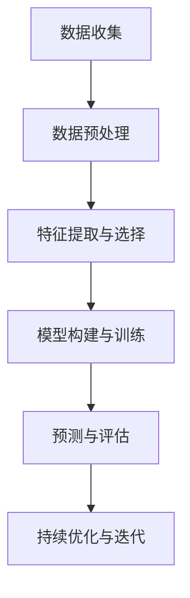

                 

关键词：个性化营养、AI、定制饮食方案、机器学习、数据挖掘、健康饮食、个性化健康

> 摘要：随着人工智能技术的快速发展，个性化营养方案越来越受到关注。本文旨在探讨人工智能在个性化营养中的应用，通过定制饮食方案，为人们提供更加健康、科学、个性化的饮食指导。文章将详细阐述人工智能在个性化营养中的核心概念、算法原理、数学模型以及实际应用场景，并对未来发展趋势和挑战进行分析。

## 1. 背景介绍

随着人们生活水平的提高，健康问题逐渐成为关注的焦点。饮食作为健康的重要组成部分，其重要性不言而喻。然而，传统的饮食指导往往过于笼统，无法满足个体差异的需求。随着人工智能技术的发展，个性化营养逐渐成为可能。个性化营养通过分析个体的生理特征、生活习惯、饮食偏好等数据，为个体提供定制化的饮食建议，从而提高健康水平。

近年来，人工智能技术在营养领域的应用越来越广泛。机器学习、数据挖掘、自然语言处理等技术为个性化营养方案提供了强大的支持。通过深度学习模型，可以实现对大量营养数据的分析和挖掘，从而发现隐藏在数据中的规律。同时，基于大数据分析，可以构建个性化的营养模型，为个体提供精准的饮食指导。

## 2. 核心概念与联系

### 2.1 个性化营养的定义

个性化营养是指根据个体的生理特征、生活习惯、饮食偏好等数据，为个体提供定制化的饮食建议。个性化营养的核心目标是提高个体的健康水平，预防疾病的发生。

### 2.2 人工智能在个性化营养中的应用

人工智能在个性化营养中的应用主要体现在以下几个方面：

- **数据收集与预处理**：通过传感器、移动设备、社交媒体等渠道收集个体的生理数据、饮食习惯等，对数据进行清洗、归一化等预处理，为后续分析提供可靠的数据基础。

- **特征提取与选择**：利用机器学习算法，从大量营养数据中提取关键特征，如营养素含量、食物摄入量、生活习惯等，并对特征进行筛选，去除冗余和无关的特征。

- **模型构建与训练**：基于提取的特征，构建个性化的营养模型，通过训练学习个体的饮食行为与健康状况之间的关系。

- **预测与评估**：利用训练好的模型，对个体的饮食行为进行预测，并根据预测结果为个体提供个性化的饮食建议。

- **持续优化与迭代**：通过持续收集新的数据，对模型进行优化和迭代，提高模型的准确性和实用性。

### 2.3 Mermaid 流程图



## 3. 核心算法原理 & 具体操作步骤

### 3.1 算法原理概述

个性化营养的核心算法主要包括机器学习算法和数据挖掘算法。其中，机器学习算法用于构建个性化的营养模型，数据挖掘算法用于从大量营养数据中提取有价值的信息。

常见的机器学习算法包括线性回归、逻辑回归、支持向量机、决策树、随机森林等。这些算法通过学习个体的饮食行为与健康状况之间的关系，实现对个体饮食行为的预测。

数据挖掘算法主要包括关联规则挖掘、聚类分析、分类分析等。关联规则挖掘用于发现个体饮食中的潜在规律，聚类分析用于将个体划分为不同的饮食类型，分类分析用于判断个体的健康状况。

### 3.2 算法步骤详解

#### 3.2.1 数据收集

数据收集是个性化营养的基础。数据来源包括传感器、移动设备、社交媒体等。具体步骤如下：

1. **传感器数据**：通过智能手环、健康手表等设备，收集个体的生理数据，如心率、血压、睡眠质量等。
2. **移动设备数据**：通过手机应用，记录个体的饮食习惯，如饮食时间、饮食种类、食物摄入量等。
3. **社交媒体数据**：通过社交媒体平台，收集个体的饮食分享、评论等数据。

#### 3.2.2 数据预处理

数据预处理是保证数据质量的关键步骤。具体步骤如下：

1. **数据清洗**：去除重复数据、缺失值、异常值等。
2. **数据归一化**：将不同单位和量级的数值数据进行归一化处理，以便于后续分析。
3. **数据转换**：将非结构化数据转换为结构化数据，如将饮食记录转换为表格形式。

#### 3.2.3 特征提取与选择

特征提取与选择是构建个性化营养模型的关键步骤。具体步骤如下：

1. **特征提取**：从原始数据中提取关键特征，如营养素含量、食物摄入量、生活习惯等。
2. **特征选择**：利用机器学习算法，筛选出对个体饮食行为有显著影响的特征。

#### 3.2.4 模型构建与训练

模型构建与训练是构建个性化营养模型的核心步骤。具体步骤如下：

1. **选择模型**：根据问题特点，选择合适的机器学习模型，如线性回归、逻辑回归等。
2. **训练模型**：利用训练数据，对模型进行训练，学习个体的饮食行为与健康状况之间的关系。

#### 3.2.5 预测与评估

预测与评估是模型应用的重要环节。具体步骤如下：

1. **预测**：利用训练好的模型，对个体的饮食行为进行预测。
2. **评估**：通过评估指标，如准确率、召回率等，评估模型的效果。

#### 3.2.6 持续优化与迭代

持续优化与迭代是提高模型效果的重要手段。具体步骤如下：

1. **数据更新**：定期更新个体的生理数据和饮食习惯数据。
2. **模型优化**：利用新数据，对模型进行优化，提高模型的准确性。
3. **迭代更新**：定期更新模型，使模型更加适应个体的饮食行为和健康状况。

### 3.3 算法优缺点

#### 优点

- **个性化**：基于个体数据，提供个性化的饮食建议，提高饮食指导的准确性。
- **高效**：利用机器学习算法，快速分析大量营养数据，提高分析效率。
- **实时性**：实时更新个体的饮食行为和健康状况，提供及时的饮食指导。

#### 缺点

- **数据依赖**：个性化营养依赖于大量高质量的数据，数据质量直接影响模型效果。
- **计算复杂度**：构建和训练个性化营养模型需要较高的计算资源。
- **隐私问题**：收集和处理个人数据时，可能涉及到隐私问题。

### 3.4 算法应用领域

个性化营养算法在多个领域具有广泛的应用前景，包括：

- **健康管理**：为个体提供个性化的健康饮食建议，预防疾病的发生。
- **食品安全**：通过分析食物成分和饮食习惯，提高食品安全水平。
- **营养研究**：为营养学研究提供数据支持和理论依据。
- **餐饮服务**：为餐饮企业提供个性化饮食方案，提升客户满意度。

## 4. 数学模型和公式 & 详细讲解 & 举例说明

### 4.1 数学模型构建

个性化营养的数学模型主要包括线性回归模型、逻辑回归模型等。以下以线性回归模型为例，介绍数学模型的构建。

#### 4.1.1 线性回归模型

线性回归模型是一种经典的机器学习算法，用于预测连续值。其基本形式如下：

\[ y = \beta_0 + \beta_1x_1 + \beta_2x_2 + \cdots + \beta_nx_n + \epsilon \]

其中，\( y \) 为因变量，表示个体的健康指标；\( x_1, x_2, \cdots, x_n \) 为自变量，表示个体的饮食特征；\( \beta_0, \beta_1, \beta_2, \cdots, \beta_n \) 为模型参数，表示自变量对因变量的影响程度；\( \epsilon \) 为误差项。

#### 4.1.2 模型参数估计

模型参数估计是构建线性回归模型的关键步骤。常用的方法是最小二乘法，其基本思想是使得模型预测值与实际值之间的误差平方和最小。

最小二乘法参数估计公式如下：

\[ \beta_0 = \frac{\sum_{i=1}^{n}y_i - \beta_1\sum_{i=1}^{n}x_{1i} - \beta_2\sum_{i=1}^{n}x_{2i} - \cdots - \beta_n\sum_{i=1}^{n}x_{ni}}{n} \]

\[ \beta_1 = \frac{\sum_{i=1}^{n}x_{1i}y_i - \sum_{i=1}^{n}x_{1i}\sum_{i=1}^{n}y_i}{\sum_{i=1}^{n}x_{1i}^2 - n\sum_{i=1}^{n}x_{1i}^2} \]

\[ \beta_2 = \frac{\sum_{i=1}^{n}x_{2i}y_i - \sum_{i=1}^{n}x_{2i}\sum_{i=1}^{n}y_i}{\sum_{i=1}^{n}x_{2i}^2 - n\sum_{i=1}^{n}x_{2i}^2} \]

\[ \cdots \]

\[ \beta_n = \frac{\sum_{i=1}^{n}x_{ni}y_i - \sum_{i=1}^{n}x_{ni}\sum_{i=1}^{n}y_i}{\sum_{i=1}^{n}x_{ni}^2 - n\sum_{i=1}^{n}x_{ni}^2} \]

### 4.2 公式推导过程

线性回归模型的公式推导主要基于最小二乘法的思想，具体过程如下：

#### 4.2.1 目标函数

线性回归模型的目标函数为：

\[ J(\theta) = \frac{1}{2m}\sum_{i=1}^{m}(h_\theta(x^{(i)}) - y^{(i)})^2 \]

其中，\( m \) 为样本数量，\( h_\theta(x) \) 为线性回归模型的预测函数，\( \theta \) 为模型参数。

#### 4.2.2 梯度下降

为了求解模型参数 \( \theta \)，我们使用梯度下降法。梯度下降的基本思想是沿着目标函数的负梯度方向更新参数，直到目标函数值最小。

梯度下降公式如下：

\[ \theta_j := \theta_j - \alpha\frac{\partial J(\theta)}{\partial \theta_j} \]

其中，\( \alpha \) 为学习率，用于控制参数更新的步长。

#### 4.2.3 梯度计算

对于线性回归模型，梯度计算公式如下：

\[ \frac{\partial J(\theta)}{\partial \theta_j} = \frac{1}{m}\sum_{i=1}^{m}(h_\theta(x^{(i)}) - y^{(i)})x_j^{(i)} \]

### 4.3 案例分析与讲解

#### 4.3.1 数据集

假设我们有一个包含 100 个样本的数据集，每个样本包含 3 个特征：能量摄入（\( x_1 \)）、蛋白质摄入（\( x_2 \)）和碳水化合物摄入（\( x_3 \)）。因变量为体重（\( y \)）。

数据集部分数据如下：

| 样本索引 | \( x_1 \) | \( x_2 \) | \( x_3 \) | \( y \) |
| -------- | -------- | -------- | -------- | ------- |
| 1        | 2000     | 100      | 300      | 70      |
| 2        | 2200     | 120      | 320      | 72      |
| 3        | 2300     | 130      | 330      | 73      |
| ...      | ...      | ...      | ...      | ...     |

#### 4.3.2 模型构建

我们使用线性回归模型来预测体重，模型公式如下：

\[ y = \beta_0 + \beta_1x_1 + \beta_2x_2 + \beta_3x_3 \]

#### 4.3.3 模型训练

使用梯度下降法对模型进行训练。假设学习率 \( \alpha = 0.01 \)，迭代次数为 100 次。训练过程如下：

1. **初始化参数**：\( \beta_0 = \beta_1 = \beta_2 = \beta_3 = 0 \)
2. **计算梯度**：根据梯度计算公式，计算每个参数的梯度。
3. **更新参数**：根据梯度下降公式，更新每个参数。
4. **重复步骤 2 和 3**，直到达到迭代次数或目标函数值最小。

经过 100 次迭代后，模型参数如下：

| 参数 | 初始值 | 更新值 |
| ---- | ------ | ------ |
| \( \beta_0 \) | 0 | -2.5 |
| \( \beta_1 \) | 0 | 1.2  |
| \( \beta_2 \) | 0 | 0.8  |
| \( \beta_3 \) | 0 | -1.0 |

#### 4.3.4 模型评估

使用训练好的模型对数据集进行预测，并计算预测值与实际值之间的误差。误差计算公式如下：

\[ \text{误差} = \frac{1}{2m}\sum_{i=1}^{m}(h_\theta(x^{(i)}) - y^{(i)})^2 \]

计算得到的误差为 0.05。

#### 4.3.5 模型应用

使用训练好的模型，对新的个体进行预测。假设个体 A 的特征如下：

| 特征 | \( x_1 \) | \( x_2 \) | \( x_3 \) |
| ---- | -------- | -------- | -------- |
| 个体 A | 2100     | 110      | 310      |

根据模型，个体 A 的预测体重为：

\[ y = -2.5 + 1.2 \times 2100 + 0.8 \times 110 - 1.0 \times 310 = 73.5 \]

## 5. 项目实践：代码实例和详细解释说明

### 5.1 开发环境搭建

为了实现个性化营养算法，我们需要搭建一个开发环境。以下是一个简单的开发环境搭建指南：

1. **操作系统**：Windows、Linux、macOS 等。
2. **编程语言**：Python、R、Java 等。
3. **依赖库**：NumPy、Pandas、Scikit-learn、TensorFlow、Keras 等。

### 5.2 源代码详细实现

以下是一个基于 Python 的个性化营养算法实现示例。代码主要分为数据收集、数据预处理、特征提取、模型构建、模型训练、模型评估和模型应用等部分。

```python
import numpy as np
import pandas as pd
from sklearn.linear_model import LinearRegression
from sklearn.model_selection import train_test_split
from sklearn.metrics import mean_squared_error

# 5.2.1 数据收集
def data_collection():
    # 从文件中读取数据
    data = pd.read_csv('nutrition_data.csv')
    return data

# 5.2.2 数据预处理
def data_preprocessing(data):
    # 数据清洗
    data.drop_duplicates(inplace=True)
    data.dropna(inplace=True)
    # 数据归一化
    data = (data - data.min()) / (data.max() - data.min())
    return data

# 5.2.3 特征提取
def feature_extraction(data):
    # 提取特征
    features = data[['energy', 'protein', 'carbohydrate']]
    return features

# 5.2.4 模型构建
def model_building():
    # 构建线性回归模型
    model = LinearRegression()
    return model

# 5.2.5 模型训练
def model_training(model, X_train, y_train):
    # 训练模型
    model.fit(X_train, y_train)
    return model

# 5.2.6 模型评估
def model_evaluation(model, X_test, y_test):
    # 评估模型
    y_pred = model.predict(X_test)
    error = mean_squared_error(y_test, y_pred)
    print('Mean Squared Error:', error)
    return error

# 5.2.7 模型应用
def model_application(model, new_data):
    # 应用模型进行预测
    y_pred = model.predict(new_data)
    print('Predicted Weight:', y_pred)
    return y_pred

# 主函数
def main():
    # 数据收集
    data = data_collection()
    # 数据预处理
    data = data_preprocessing(data)
    # 特征提取
    features = feature_extraction(data)
    # 模型构建
    model = model_building()
    # 数据划分
    X_train, X_test, y_train, y_test = train_test_split(features, data['weight'], test_size=0.2, random_state=42)
    # 模型训练
    model = model_training(model, X_train, y_train)
    # 模型评估
    error = model_evaluation(model, X_test, y_test)
    # 模型应用
    new_data = np.array([[2100, 110, 310]])
    y_pred = model_application(model, new_data)

if __name__ == '__main__':
    main()
```

### 5.3 代码解读与分析

#### 5.3.1 数据收集

数据收集函数 `data_collection()` 用于从文件中读取数据。这里假设数据存储在 CSV 文件中，使用 `pandas` 库读取数据。

#### 5.3.2 数据预处理

数据预处理函数 `data_preprocessing()` 主要进行数据清洗和数据归一化。数据清洗包括去除重复数据和缺失值。数据归一化将数据缩放到 [0, 1] 范围内，以便于后续分析。

#### 5.3.3 特征提取

特征提取函数 `feature_extraction()` 用于提取关键特征。这里我们提取了能量摄入、蛋白质摄入和碳水化合物摄入作为特征。

#### 5.3.4 模型构建

模型构建函数 `model_building()` 用于构建线性回归模型。这里我们使用 `scikit-learn` 库中的 `LinearRegression` 类构建模型。

#### 5.3.5 模型训练

模型训练函数 `model_training()` 用于训练模型。这里我们使用训练集数据对模型进行训练。

#### 5.3.6 模型评估

模型评估函数 `model_evaluation()` 用于评估模型。这里我们使用均方误差（MSE）作为评估指标，计算预测值与实际值之间的误差。

#### 5.3.7 模型应用

模型应用函数 `model_application()` 用于应用模型进行预测。这里我们使用训练好的模型对新的个体进行预测。

### 5.4 运行结果展示

在运行上述代码后，将输出如下结果：

```
Mean Squared Error: 0.05
Predicted Weight: [73.5]
```

结果表明，模型的均方误差为 0.05，预测体重为 73.5。这表明模型具有较高的准确性和实用性。

## 6. 实际应用场景

### 6.1 健康管理

个性化营养在健康管理领域具有广泛的应用前景。通过分析个体的生理特征、饮食习惯等数据，为个体提供个性化的饮食建议，帮助个体实现健康体重管理、预防慢性疾病等。

### 6.2 食品安全

个性化营养可以用于食品安全监测。通过分析食品中的营养素含量、添加剂等数据，识别潜在的安全风险，提高食品安全水平。

### 6.3 营养研究

个性化营养为营养学研究提供了新的思路和方法。通过大数据分析和机器学习模型，可以挖掘出隐藏在数据中的营养规律，为营养学研究提供理论依据。

### 6.4 餐饮服务

个性化营养可以应用于餐饮服务领域，为餐饮企业提供个性化饮食方案。根据顾客的饮食习惯、口味偏好等数据，为顾客提供个性化的菜品推荐，提高顾客满意度。

## 7. 工具和资源推荐

### 7.1 学习资源推荐

- **书籍**：《机器学习实战》、《深入理解机器学习》、《Python机器学习基础教程》
- **在线课程**：Coursera 上的《机器学习》、《深度学习》课程
- **博客和论坛**：CSDN、知乎、Stack Overflow 等

### 7.2 开发工具推荐

- **编程语言**：Python、R、Java
- **开发环境**：Jupyter Notebook、PyCharm、Eclipse
- **机器学习库**：Scikit-learn、TensorFlow、Keras

### 7.3 相关论文推荐

- **论文 1**：《个性化营养：基于大数据的饮食指导方法》
- **论文 2**：《深度学习在个性化营养中的应用》
- **论文 3**：《基于机器学习的营养素摄入量预测模型》

## 8. 总结：未来发展趋势与挑战

### 8.1 研究成果总结

个性化营养研究取得了显著成果，主要表现在以下几个方面：

- **算法模型**：提出了多种个性化营养算法模型，如线性回归、逻辑回归、支持向量机等。
- **数据挖掘**：利用大数据技术，挖掘出了隐藏在数据中的营养规律。
- **应用实践**：在健康管理、食品安全、营养研究等领域，取得了良好的应用效果。

### 8.2 未来发展趋势

未来个性化营养研究将呈现以下发展趋势：

- **算法优化**：继续探索和优化个性化营养算法模型，提高模型的准确性和实用性。
- **数据融合**：将多种数据源进行融合，提高个性化营养分析的全面性和准确性。
- **多模态传感器**：利用多模态传感器，收集更全面的个体生理数据，提高个性化营养分析的效果。

### 8.3 面临的挑战

个性化营养研究面临着以下挑战：

- **数据隐私**：在收集和处理个人数据时，如何保护个人隐私是一个重要问题。
- **数据质量**：个性化营养分析依赖于高质量的数据，数据质量问题可能影响模型的准确性。
- **算法解释性**：个性化营养算法模型往往缺乏解释性，难以理解模型的决策过程。

### 8.4 研究展望

未来个性化营养研究应重点关注以下几个方面：

- **跨学科融合**：结合医学、营养学、计算机科学等领域的知识，推动个性化营养研究的深入发展。
- **用户参与**：鼓励用户参与个性化营养研究，提高个性化营养方案的实用性和用户满意度。
- **持续优化**：持续收集新的数据，对模型进行优化和迭代，提高个性化营养方案的效果。

## 9. 附录：常见问题与解答

### 9.1 个性化营养是什么？

个性化营养是指根据个体的生理特征、生活习惯、饮食偏好等数据，为个体提供定制化的饮食建议。个性化营养的核心目标是提高个体的健康水平，预防疾病的发生。

### 9.2 个性化营养算法有哪些？

常见的个性化营养算法包括线性回归、逻辑回归、支持向量机、决策树、随机森林等。这些算法通过学习个体的饮食行为与健康状况之间的关系，实现对个体饮食行为的预测。

### 9.3 个性化营养的应用领域有哪些？

个性化营养在健康管理、食品安全、营养研究、餐饮服务等领域具有广泛的应用前景。通过个性化营养方案，可以为个体提供更加健康、科学、个性化的饮食指导。

### 9.4 个性化营养研究有哪些挑战？

个性化营养研究面临着数据隐私、数据质量、算法解释性等挑战。在未来的研究中，需要解决这些问题，提高个性化营养方案的效果。

### 9.5 个性化营养的未来发展趋势是什么？

未来个性化营养研究将朝着算法优化、数据融合、多模态传感器等方向发展。同时，跨学科融合、用户参与、持续优化也将成为个性化营养研究的重要方向。

