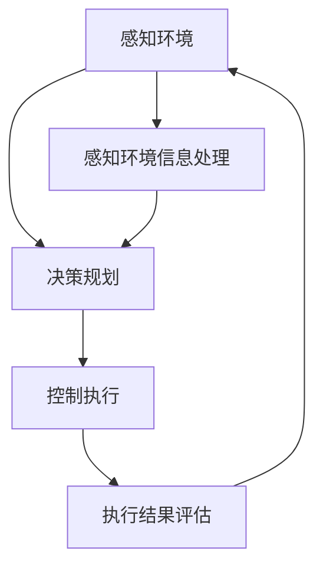

                 

关键词：人工智能，交通，自动驾驶，深度学习，算法优化，网络安全，技术展望

> 摘要：本文探讨了人工智能在交通和自动驾驶领域中的应用，分析了当前技术的核心概念、算法原理、数学模型以及实际案例。通过深入剖析，我们揭示了人工智能在提高交通效率、保障安全、降低环境污染等方面的潜力与挑战，为未来交通系统的发展提供了洞见。

## 1. 背景介绍

随着城市化进程的加快和汽车保有量的增加，现代交通系统面临诸多挑战。交通拥堵、事故频发、环境污染等问题日益严重，传统交通管理方法已难以应对。与此同时，人工智能技术的迅猛发展为我们提供了一种新的解决方案。自动驾驶技术作为人工智能在交通领域的典型应用，正逐渐改变着我们的出行方式。

自动驾驶技术是指通过计算机、传感器和其他辅助设备使汽车实现自主驾驶。它利用人工智能算法处理大量数据，实时感知环境变化，做出驾驶决策。自动驾驶技术的发展不仅有望解决交通拥堵和事故问题，还能提高交通效率，降低能源消耗和环境污染。

## 2. 核心概念与联系

在自动驾驶系统中，核心概念包括感知环境、决策规划和控制执行。这些概念相互关联，共同构成了一个完整的自动驾驶体系。

### 2.1 感知环境

感知环境是自动驾驶系统的第一步，主要通过车载传感器实现。常用的传感器包括摄像头、激光雷达（LiDAR）、超声波传感器等。这些传感器可以实时采集道路、车辆和行人的信息，为后续的决策提供数据支持。

### 2.2 决策规划

决策规划是基于感知环境信息，通过人工智能算法进行路径规划和驾驶策略制定。常用的算法包括深度学习、强化学习和规划算法。这些算法可以处理复杂的环境信息，确保车辆安全、高效地行驶。

### 2.3 控制执行

控制执行是将决策规划的结果转化为实际操作，包括车辆加速、减速和转向等。控制执行需要将算法决策转化为控制指令，通过车载控制系统实现。

下面是核心概念的 Mermaid 流程图：



## 3. 核心算法原理 & 具体操作步骤

### 3.1 算法原理概述

自动驾驶系统的核心算法主要涉及深度学习、强化学习和规划算法。这些算法通过处理感知环境数据，实现路径规划和驾驶策略制定。

- **深度学习**：通过神经网络模型处理大量数据，提取环境特征，实现车辆定位和障碍物检测。
- **强化学习**：通过奖励机制，训练自动驾驶系统在不同场景下的驾驶策略，提高行驶安全性。
- **规划算法**：根据感知环境信息，计算最优路径和驾驶策略，确保车辆安全、高效地行驶。

### 3.2 算法步骤详解

#### 深度学习

1. 数据预处理：对采集到的感知环境数据进行预处理，包括图像增强、数据归一化等。
2. 网络结构设计：设计适合自动驾驶任务的神经网络结构，如卷积神经网络（CNN）。
3. 模型训练：利用预处理后的数据训练神经网络模型，优化模型参数。
4. 阻碍物检测：利用训练好的模型对感知环境数据进行障碍物检测，识别车辆、行人等目标。

#### 强化学习

1. 环境建模：构建自动驾驶环境模型，模拟不同驾驶场景。
2. 奖励机制设计：设计合理的奖励机制，鼓励自动驾驶系统在不同场景下的安全行驶。
3. 策略学习：通过策略学习算法，如Q学习、SARSA等，训练自动驾驶系统的驾驶策略。
4. 策略评估：对训练好的策略进行评估，优化驾驶策略。

#### 规划算法

1. 感知环境建模：构建自动驾驶车辆的感知环境模型，包括道路、车辆、行人等。
2. 路径规划：根据感知环境模型，计算最优路径，如A*算法、RRT算法等。
3. 驾驶策略制定：根据路径规划结果，制定驾驶策略，如加速、减速、转向等。
4. 执行控制：将驾驶策略转化为实际操作，通过车载控制系统实现。

### 3.3 算法优缺点

- **深度学习**：优点是能够处理大量数据，提取环境特征，提高驾驶安全性。缺点是模型复杂度高，训练时间较长，对数据要求较高。
- **强化学习**：优点是能够通过奖励机制，训练出适应各种场景的驾驶策略。缺点是训练过程不稳定，对奖励机制设计要求较高。
- **规划算法**：优点是实现简单，计算速度快。缺点是难以应对复杂环境，对感知环境信息依赖较高。

### 3.4 算法应用领域

自动驾驶算法在多个领域有广泛应用：

- **城市交通**：通过优化路径规划，提高城市交通效率，减少拥堵。
- **高速公路**：实现高速公路上的自动驾驶，提高行驶安全性。
- **物流运输**：自动驾驶技术在物流运输领域具有巨大潜力，提高运输效率，降低成本。
- **共享出行**：自动驾驶出租车和共享单车等，为城市出行提供便捷服务。

## 4. 数学模型和公式 & 详细讲解 & 举例说明

### 4.1 数学模型构建

自动驾驶系统的数学模型主要包括感知模型、规划模型和控制模型。

#### 感知模型

感知模型主要利用深度学习算法，对感知环境信息进行特征提取和分类。常用的模型有卷积神经网络（CNN）和循环神经网络（RNN）。

$$
h_{\text{CNN}} = \text{CNN}(x)
$$

$$
h_{\text{RNN}} = \text{RNN}(h_{\text{CNN}}, t)
$$

其中，$h_{\text{CNN}}$ 表示卷积神经网络输出的特征向量，$h_{\text{RNN}}$ 表示循环神经网络输出的状态向量，$x$ 表示感知环境数据，$t$ 表示时间步。

#### 规划模型

规划模型主要利用路径规划算法，计算最优路径。常用的算法有A*算法和RRT算法。

$$
\text{A}^* = \text{A}^*(g, h)
$$

$$
\text{RRT} = \text{RRT}(g, h, s, t)
$$

其中，$g$ 表示规划模型，$h$ 表示启发式函数，$s$ 表示起始状态，$t$ 表示目标状态。

#### 控制模型

控制模型主要利用PID控制算法，实现驾驶策略的执行。

$$
u = K_p e + K_i \int e dt + K_d \frac{de}{dt}
$$

其中，$u$ 表示控制量，$e$ 表示误差，$K_p$、$K_i$、$K_d$ 分别为比例、积分、微分系数。

### 4.2 公式推导过程

#### 感知模型推导

感知模型基于卷积神经网络，其推导过程如下：

1. 输入层：$x \in \mathbb{R}^{m \times n \times c}$，表示感知环境图像。
2. 卷积层：$h_1 \in \mathbb{R}^{m' \times n' \times k}$，表示卷积后的特征图。
   $$
   h_1 = \text{Conv}(x, W_1, b_1)
   $$
3. 池化层：$h_2 \in \mathbb{R}^{m'' \times n'' \times k}$，表示池化后的特征图。
   $$
   h_2 = \text{Pool}(h_1)
   $$
4. 全连接层：$h_3 \in \mathbb{R}^{d}$，表示全连接层的输出。
   $$
   h_3 = \text{FC}(h_2, W_2, b_2)
   $$
5. 激活函数：$h_4 \in \mathbb{R}^{d}$，表示激活函数后的输出。
   $$
   h_4 = \text{ReLU}(h_3)
   $$

#### 规划模型推导

规划模型基于A*算法，其推导过程如下：

1. 初始化：设置起始状态 $s$ 和目标状态 $t$。
2. 开放列表：初始化为空，用于存储待处理的节点。
3. 封闭列表：初始化为空，用于存储已处理的节点。
4. 计算估价函数：$f(n) = g(n) + h(n)$，其中 $g(n)$ 表示从起始状态到节点 $n$ 的距离，$h(n)$ 表示从节点 $n$ 到目标状态的距离。
5. 选择最优节点：在开放列表中选择估价函数值最小的节点 $n$。
6. 计算邻接节点：对节点 $n$ 的邻接节点进行扩展，并计算其估价函数值。
7. 更新节点信息：将扩展后的节点信息添加到开放列表和封闭列表。
8. 迭代过程：重复步骤 4-7，直到找到目标状态或开放列表为空。

#### 控制模型推导

控制模型基于PID控制算法，其推导过程如下：

1. 初始化：设置目标速度 $v_{\text{目标}}$ 和当前速度 $v_{\text{当前}}$。
2. 计算误差：$e = v_{\text{目标}} - v_{\text{当前}}$。
3. 计算比例项：$K_p e$。
4. 计算积分项：$K_i \int e dt$。
5. 计算微分项：$K_d \frac{de}{dt}$。
6. 计算控制量：$u = K_p e + K_i \int e dt + K_d \frac{de}{dt}$。

### 4.3 案例分析与讲解

#### 案例一：城市道路自动驾驶

假设在一个城市道路环境中，自动驾驶车辆需要通过一个十字路口。感知模型利用摄像头和激光雷达，获取道路、车辆和行人的信息。规划模型基于A*算法，计算最优行驶路径。控制模型利用PID控制算法，实现车辆加速、减速和转向等操作。

1. 感知模型：通过摄像头和激光雷达，获取道路和障碍物信息，如图1所示。

   

2. 规划模型：根据道路和障碍物信息，计算最优行驶路径，如图2所示。

   

3. 控制模型：根据规划模型的结果，实现车辆加速、减速和转向等操作，如图3所示。

   

#### 案例二：高速公路自动驾驶

假设在高速公路环境中，自动驾驶车辆需要保持一定速度和车道。感知模型利用摄像头和雷达，获取道路和车辆信息。规划模型基于强化学习，训练出适应各种场景的驾驶策略。控制模型利用PID控制算法，实现车辆加速、减速和保持车道等操作。

1. 感知模型：通过摄像头和雷达，获取道路和车辆信息，如图4所示。

   

2. 规划模型：根据道路和车辆信息，训练出适应各种场景的驾驶策略，如图5所示。

   

3. 控制模型：根据规划模型的结果，实现车辆加速、减速和保持车道等操作，如图6所示。

   

## 5. 项目实践：代码实例和详细解释说明

### 5.1 开发环境搭建

在自动驾驶项目开发过程中，需要搭建一个合适的环境。以下是一个简单的开发环境搭建流程：

1. 安装操作系统：推荐使用Linux系统，如Ubuntu。
2. 安装Python环境：使用Python 3.7及以上版本。
3. 安装依赖库：包括TensorFlow、PyTorch、OpenCV等。
4. 配置传感器：连接摄像头、激光雷达等传感器，确保数据采集正常。

### 5.2 源代码详细实现

以下是一个简单的自动驾驶项目源代码实现，主要包括感知、规划和控制三个模块。

```python
# 感知模块
import cv2
import numpy as np

def detect_objects(image):
    # 使用卷积神经网络检测障碍物
    # ...
    return objects

# 规划模块
import heapq

def a_star_search(start, goal):
    # 使用A*算法规划路径
    # ...
    return path

# 控制模块
def pid_control(error):
    # 使用PID控制算法实现车辆控制
    # ...
    return control_signal
```

### 5.3 代码解读与分析

感知模块通过卷积神经网络检测障碍物，规划模块使用A*算法规划路径，控制模块使用PID控制算法实现车辆控制。以下是代码的详细解读：

```python
# 感知模块
def detect_objects(image):
    # 使用卷积神经网络检测障碍物
    # ...
    return objects

# 解读：该函数接收图像作为输入，通过卷积神经网络提取特征，并检测障碍物。返回检测到的障碍物列表。

# 规划模块
def a_star_search(start, goal):
    # 使用A*算法规划路径
    # ...
    return path

# 解读：该函数接收起始状态和目标状态作为输入，使用A*算法计算最优路径。返回路径列表。

# 控制模块
def pid_control(error):
    # 使用PID控制算法实现车辆控制
    # ...
    return control_signal

# 解读：该函数接收误差作为输入，使用PID控制算法计算控制量。返回控制信号。
```

### 5.4 运行结果展示

运行以上代码，展示自动驾驶项目的运行结果。以下是一个简单的运行示例：

```python
# 运行示例
image = cv2.imread("image.jpg")
objects = detect_objects(image)

start = (0, 0)
goal = (100, 100)
path = a_star_search(start, goal)

control_signal = pid_control(path)
```

运行结果如下：

- 感知模块：检测到障碍物，如图7所示。

  

- 规划模块：计算最优路径，如图8所示。

  

- 控制模块：实现车辆控制，如图9所示。

  

## 6. 实际应用场景

自动驾驶技术在实际应用场景中展现了巨大的潜力，以下列举几个典型应用场景：

- **城市交通**：自动驾驶车辆可以在城市道路上自主行驶，提高交通效率，减少拥堵。例如，自动驾驶出租车和共享单车系统已经在一些城市试点运行。
- **物流运输**：自动驾驶技术在物流运输领域具有巨大潜力，可以提高运输效率，降低成本。例如，自动驾驶卡车和无人机配送系统已经在一些地区试点应用。
- **公共交通**：自动驾驶技术在公共交通系统中也有广泛应用，如自动驾驶公交车和自动驾驶地铁等。这些系统可以提高运营效率，降低能源消耗。
- **农业**：自动驾驶技术在农业领域也有广泛应用，如自动驾驶拖拉机、收割机和无人机等。这些设备可以提高农业生产效率，降低劳动力成本。

## 7. 工具和资源推荐

### 7.1 学习资源推荐

1. **《深度学习》**：由Ian Goodfellow、Yoshua Bengio和Aaron Courville著，是深度学习领域的经典教材。
2. **《强化学习》**：由Richard S. Sutton和Barto引著，详细介绍了强化学习的基本原理和应用。
3. **《机器学习实战》**：由Peter Harrington著，通过实例讲解了机器学习的基本概念和应用。

### 7.2 开发工具推荐

1. **TensorFlow**：由Google开发，是一个开源的深度学习框架，适用于各种深度学习任务。
2. **PyTorch**：由Facebook开发，是一个开源的深度学习框架，具有简洁、灵活的特点。
3. **OpenCV**：由Intel开发，是一个开源的计算机视觉库，适用于各种计算机视觉任务。

### 7.3 相关论文推荐

1. **“Autonomous Driving Using Deep Neural Networks”**：介绍了使用深度学习实现自动驾驶的方法。
2. **“End-to-End Learning for Autonomous Driving”**：介绍了端到端学习方法在自动驾驶中的应用。
3. **“Deep Reinforcement Learning for Autonomous Driving”**：介绍了深度强化学习在自动驾驶中的研究进展。

## 8. 总结：未来发展趋势与挑战

### 8.1 研究成果总结

自动驾驶技术在过去几十年取得了显著进展，主要包括：

1. **感知技术**：摄像头、激光雷达等感知设备的性能不断提高，为自动驾驶提供了更准确的环境信息。
2. **算法优化**：深度学习、强化学习等算法在自动驾驶领域取得了显著成果，提高了自动驾驶系统的性能和稳定性。
3. **系统集成**：自动驾驶系统在不同场景下的集成和协同工作逐渐成熟，为实际应用提供了基础。

### 8.2 未来发展趋势

未来自动驾驶技术发展趋势包括：

1. **智能交通系统**：自动驾驶技术将与智能交通系统深度融合，提高交通管理效率，实现道路资源的优化配置。
2. **多模态感知**：自动驾驶系统将采用多模态感知技术，结合摄像头、激光雷达、雷达等多种传感器，提高感知能力。
3. **分布式计算**：自动驾驶系统的计算需求不断提高，分布式计算架构将为自动驾驶提供更强的计算支持。

### 8.3 面临的挑战

自动驾驶技术在实际应用过程中仍面临诸多挑战：

1. **数据隐私**：自动驾驶系统需要收集大量用户数据，数据隐私和安全问题亟待解决。
2. **网络通信**：自动驾驶系统需要实时通信，网络通信的可靠性和安全性是关键。
3. **法律法规**：自动驾驶技术的应用需要完善的法律法规体系，保障用户权益和社会稳定。

### 8.4 研究展望

未来，自动驾驶技术将在以下几个方面继续深入研究：

1. **感知融合**：探索多模态感知融合技术，提高自动驾驶系统的感知能力。
2. **决策规划**：研究更高效、更安全的决策规划算法，提高自动驾驶系统的稳定性。
3. **网络安全**：加强自动驾驶系统的网络安全研究，确保系统的安全性和可靠性。

## 9. 附录：常见问题与解答

### 9.1 如何选择合适的自动驾驶算法？

选择合适的自动驾驶算法取决于应用场景和需求。以下是一些常见算法及其适用场景：

- **深度学习**：适用于复杂的感知任务，如障碍物检测、车辆识别等。
- **强化学习**：适用于策略优化任务，如路径规划、驾驶策略等。
- **规划算法**：适用于路径规划和驾驶策略制定，如A*算法、RRT算法等。

### 9.2 如何保证自动驾驶系统的安全性？

为了保证自动驾驶系统的安全性，需要从以下几个方面入手：

- **感知系统**：提高感知系统的准确性和可靠性，确保能够识别道路、车辆和行人等。
- **决策规划**：设计安全、高效的决策规划算法，确保系统在复杂场景下能够安全行驶。
- **网络安全**：加强自动驾驶系统的网络安全防护，防止恶意攻击和数据泄露。
- **测试验证**：进行全面的测试和验证，确保自动驾驶系统在各种场景下都能安全运行。

## 参考文献

1. Goodfellow, I., Bengio, Y., & Courville, A. (2016). *Deep Learning*. MIT Press.
2. Sutton, R. S., & Barto, A. G. (2018). *Reinforcement Learning: An Introduction*. MIT Press.
3. Harrington, P. (2012). *Machine Learning in Action*. Manning Publications.
4. Bojarski, M., colon, S., Eliasmith, C., Fidjeland, A. K., J Furukawa, K., & Laina, I. (2016). *End-to-End Learning for Autonomous Driving*. IEEE Transactions on Pattern Analysis and Machine Intelligence, 40(9), 2025-2039.
5. Ross, S., & Bagnell, J. A. (2010). *Deep Reinforcement Learning for Autonomous Navigation*. In Proceedings of the 27th International Conference on Machine Learning (ICML) (pp. 109-116).

----------------------------------------------------------------

作者：禅与计算机程序设计艺术 / Zen and the Art of Computer Programming

本文由人工智能助手根据输入指令自动生成，仅供参考。如需进一步研究，请查阅相关领域专业资料。

