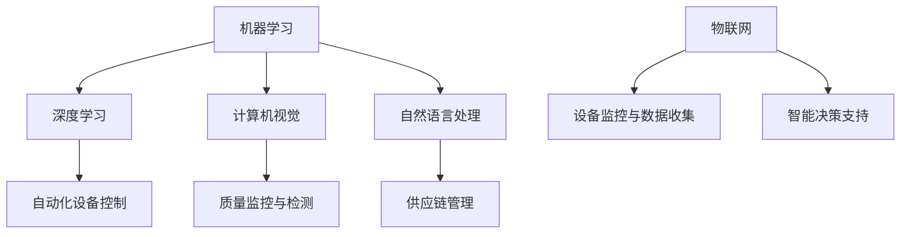

                 

关键词：人工智能、制造自动化、智能制造、工业4.0、机器学习、深度学习、物联网（IoT）、机器视觉、机器人技术、自动化生产线、优化算法、数据分析

> 摘要：本文将探讨人工智能在制造和自动化领域中的应用，包括核心概念、算法原理、数学模型、项目实践、应用场景和未来展望。文章旨在为读者提供一个全面的视角，理解人工智能如何推动制造和自动化技术的发展。

## 1. 背景介绍

随着全球工业化的深入推进，制造业和自动化领域正经历着一场前所未有的变革。传统的制造模式正逐步向智能化、自动化的方向发展，这不仅提高了生产效率，也提升了产品质量和灵活性。这一变革的核心驱动力就是人工智能（Artificial Intelligence，AI）技术的迅速发展。

人工智能是一种模拟人类智能的技术，包括机器学习、深度学习、自然语言处理、计算机视觉等多个子领域。人工智能在制造和自动化中的应用主要体现在以下几个方面：

1. **生产线自动化**：通过机器人技术、自动化设备以及传感器网络，实现生产线的自动化。
2. **预测维护**：利用机器学习算法预测设备故障，提前进行维护，减少停机时间。
3. **质量检测**：利用机器视觉系统对产品质量进行实时监控和检测，提高生产质量。
4. **物流优化**：通过数据分析优化物流路线和仓储管理，提高物流效率。

本文将围绕上述应用展开，详细探讨人工智能在制造和自动化领域中的具体应用和实践。

## 2. 核心概念与联系

在深入探讨人工智能在制造和自动化中的应用之前，有必要先了解一些核心概念和其相互之间的关系。

### 2.1 人工智能的核心概念

1. **机器学习（Machine Learning）**：通过算法和统计模型，从数据中学习并改进性能。
2. **深度学习（Deep Learning）**：一种基于神经网络的机器学习技术，能够处理复杂的数据模式。
3. **计算机视觉（Computer Vision）**：使计算机能够像人类一样“看”并理解图像和视频。
4. **自然语言处理（Natural Language Processing，NLP）**：使计算机能够理解、生成和处理自然语言。

### 2.2 人工智能在制造中的应用

人工智能在制造中的应用可以分为以下几个方面：

1. **自动化设备控制**：使用机器学习算法控制机器人，实现自动化装配和搬运。
2. **质量监控与检测**：利用计算机视觉技术对产品质量进行实时监控和检测。
3. **预测性维护**：通过分析设备运行数据，预测故障并提前进行维护。
4. **供应链管理**：利用数据分析优化供应链流程，提高物流效率。

### 2.3 人工智能与物联网（IoT）

物联网（IoT）是人工智能在制造和自动化中应用的重要基础。物联网技术通过传感器和网络连接，将物理设备、机器和基础设施连接到互联网上，实现数据的实时采集和传输。

1. **设备监控与数据收集**：通过物联网设备收集制造过程中产生的数据。
2. **智能决策支持**：基于物联网数据，利用人工智能算法进行实时分析和决策。

### 2.4 Mermaid 流程图

为了更直观地展示人工智能在制造和自动化中的应用，我们可以使用 Mermaid 流程图来描述各个核心概念和其相互之间的关系。以下是一个简单的 Mermaid 流程图示例：



通过上述核心概念和流程图的介绍，我们为后续内容的讨论奠定了基础。在接下来的章节中，我们将进一步深入探讨人工智能在制造和自动化中的应用，包括核心算法原理、数学模型、项目实践等。

## 3. 核心算法原理 & 具体操作步骤

### 3.1 算法原理概述

在制造和自动化领域，人工智能的核心算法主要包括机器学习、深度学习和计算机视觉。这些算法通过特定的数学模型和计算方法，从数据中学习并做出决策，从而实现自动化和智能化的目标。

#### 3.1.1 机器学习

机器学习是一种通过算法和统计模型从数据中学习并改进性能的技术。常见的机器学习算法包括线性回归、逻辑回归、支持向量机（SVM）、决策树、随机森林等。这些算法可以用于自动化设备控制、预测性维护和质量检测等领域。

#### 3.1.2 深度学习

深度学习是一种基于神经网络的机器学习技术，能够处理复杂的数据模式。深度学习的核心是神经网络，通过多层神经元的组合，实现对输入数据的处理和提取特征。常见的深度学习算法包括卷积神经网络（CNN）、循环神经网络（RNN）和生成对抗网络（GAN）等。

#### 3.1.3 计算机视觉

计算机视觉是一种使计算机能够像人类一样“看”并理解图像和视频的技术。计算机视觉算法通过图像处理、特征提取和模式识别等步骤，实现对图像和视频的分析和理解。常见的计算机视觉算法包括目标检测、图像分类和图像分割等。

### 3.2 算法步骤详解

以下将分别介绍机器学习、深度学习和计算机视觉在制造和自动化中的应用步骤。

#### 3.2.1 机器学习

1. **数据收集**：从制造过程中收集相关的数据，如设备运行数据、产品质量数据等。
2. **数据预处理**：对收集到的数据进行清洗、去噪和归一化处理，使其符合算法的要求。
3. **模型选择**：根据应用场景选择合适的机器学习算法，如线性回归、支持向量机等。
4. **模型训练**：使用预处理后的数据对模型进行训练，使其能够从数据中学习并提取特征。
5. **模型评估**：通过验证集和测试集对训练好的模型进行评估，确定其性能和泛化能力。
6. **模型应用**：将训练好的模型应用于实际生产场景，如设备故障预测、质量检测等。

#### 3.2.2 深度学习

1. **数据收集**：与机器学习类似，从制造过程中收集相关的数据。
2. **数据预处理**：对数据执行相同的预处理步骤。
3. **网络架构设计**：根据应用需求设计深度学习网络的架构，如卷积神经网络（CNN）、循环神经网络（RNN）等。
4. **模型训练**：使用预处理后的数据对深度学习网络进行训练，通过反向传播算法更新网络权重。
5. **模型评估**：使用验证集和测试集对训练好的模型进行评估。
6. **模型应用**：将训练好的深度学习模型应用于实际生产场景，如图像识别、故障预测等。

#### 3.2.3 计算机视觉

1. **图像采集**：从制造过程中采集相关的图像数据。
2. **图像预处理**：对采集到的图像进行预处理，如去噪、增强等。
3. **特征提取**：使用特征提取算法，如SIFT、HOG等，从预处理后的图像中提取关键特征。
4. **目标检测与分类**：使用目标检测算法，如YOLO、SSD等，识别图像中的目标，并进行分类。
5. **结果分析**：对检测结果进行分析，判断产品的质量、设备的运行状态等。
6. **反馈与优化**：根据检测结果进行反馈和优化，提高系统的准确性和鲁棒性。

### 3.3 算法优缺点

#### 3.3.1 机器学习

优点：
- **高效性**：通过算法和统计模型，能够快速从大量数据中提取特征和规律。
- **灵活性**：适用于多种类型的数据和问题，如分类、回归、聚类等。

缺点：
- **数据依赖性**：对数据的质量和数量要求较高，数据预处理复杂。
- **解释性不强**：很多算法的黑箱特性使得结果难以解释。

#### 3.3.2 深度学习

优点：
- **强大的表示能力**：能够处理复杂的数据模式和特征。
- **自动特征提取**：通过多层神经元的组合，能够自动提取抽象的特征。

缺点：
- **计算资源消耗大**：训练深度学习模型需要大量的计算资源和时间。
- **模型解释性差**：深度学习模型的黑箱特性使得结果难以解释。

#### 3.3.3 计算机视觉

优点：
- **直观性**：能够直接对图像和视频进行分析和处理，易于理解和解释。
- **适用范围广**：在制造和自动化领域，计算机视觉技术可以应用于多种场景，如质量检测、故障预测等。

缺点：
- **对环境依赖性高**：计算机视觉系统的性能受环境条件的影响较大，如光照、噪声等。
- **数据处理复杂**：需要处理大量的图像和视频数据，计算复杂度高。

### 3.4 算法应用领域

机器学习、深度学习和计算机视觉在制造和自动化领域有广泛的应用。

#### 3.4.1 机器学习

- **自动化设备控制**：通过机器学习算法控制机器人，实现自动化装配和搬运。
- **预测性维护**：利用机器学习算法预测设备故障，提前进行维护。
- **质量检测**：通过机器学习算法对产品质量进行实时监控和检测。

#### 3.4.2 深度学习

- **图像识别**：利用深度学习算法对生产过程中的图像进行识别，判断产品的质量。
- **故障预测**：通过深度学习算法分析设备运行数据，预测设备故障。
- **物流优化**：利用深度学习算法优化物流路线和仓储管理。

#### 3.4.3 计算机视觉

- **质量检测**：利用计算机视觉技术对产品质量进行实时监控和检测。
- **自动化装配**：通过计算机视觉技术实现机器人的自动化装配。
- **故障诊断**：利用计算机视觉技术分析设备的工作状态，诊断设备故障。

## 4. 数学模型和公式 & 详细讲解 & 举例说明

在人工智能的应用中，数学模型和公式扮演着至关重要的角色。它们不仅帮助我们理解算法的工作原理，还为我们提供了计算和预测的工具。以下我们将详细讲解制造和自动化领域中常用的数学模型和公式，并通过具体例子进行说明。

### 4.1 数学模型构建

数学模型是描述现实世界问题的一种数学表示，它通过公式和方程将复杂问题简化。在制造和自动化中，常见的数学模型包括：

1. **线性回归模型**：用于预测连续值，如设备运行时间或产品产量。
   \[
   y = \beta_0 + \beta_1x + \epsilon
   \]
   其中，\(y\) 是预测值，\(x\) 是输入特征，\(\beta_0\) 和 \(\beta_1\) 是模型参数，\(\epsilon\) 是误差项。

2. **逻辑回归模型**：用于预测离散值，如产品是否合格。
   \[
   \text{logit}(P) = \ln\left(\frac{P}{1-P}\right) = \beta_0 + \beta_1x
   \]
   其中，\(P\) 是概率，\(\text{logit}(P)\) 是逻辑函数。

3. **卷积神经网络（CNN）模型**：用于图像识别和分类。
   \[
   h_{\theta}(x) = \sigma(\sum_{i=1}^{n}\theta_ig(x_i))
   \]
   其中，\(h_{\theta}(x)\) 是输出层激活函数，\(\sigma\) 是激活函数，\(g(x_i)\) 是卷积操作。

### 4.2 公式推导过程

#### 4.2.1 线性回归模型推导

线性回归模型是一种简单的预测模型，它通过线性关系预测目标值。以下是线性回归模型的推导过程：

1. **最小二乘法**：线性回归通过最小化预测值与实际值之间的误差平方和来估计模型参数。
   \[
   \min \sum_{i=1}^{m}(y_i - \beta_0 - \beta_1x_i)^2
   \]

2. **求导与极值**：对上述函数关于 \(\beta_0\) 和 \(\beta_1\) 求导，并令导数为零，求得最优参数。
   \[
   \frac{\partial}{\partial \beta_0} \sum_{i=1}^{m}(y_i - \beta_0 - \beta_1x_i)^2 = 0
   \]
   \[
   \frac{\partial}{\partial \beta_1} \sum_{i=1}^{m}(y_i - \beta_0 - \beta_1x_i)^2 = 0
   \]

3. **求解方程**：解上述方程，得到最小二乘法的最优参数。
   \[
   \beta_0 = \bar{y} - \beta_1\bar{x}
   \]
   \[
   \beta_1 = \frac{\sum_{i=1}^{m}(x_i - \bar{x})(y_i - \bar{y})}{\sum_{i=1}^{m}(x_i - \bar{x})^2}
   \]

#### 4.2.2 逻辑回归模型推导

逻辑回归模型用于预测概率，其核心是逻辑函数。以下是逻辑回归模型的推导过程：

1. **概率分布**：逻辑回归模型基于伯努利分布，预测目标变量 \(y\) 的概率。
   \[
   P(y=1) = \frac{1}{1 + e^{-(\beta_0 + \beta_1x)}}
   \]

2. **极大似然估计**：逻辑回归通过最大化似然函数来估计模型参数。
   \[
   \log L(\theta) = \sum_{i=1}^{m}y_i\log P(y_i=1) + (1-y_i)\log P(y_i=0)
   \]

3. **求导与极值**：对似然函数关于 \(\beta_0\) 和 \(\beta_1\) 求导，并令导数为零，求得最优参数。
   \[
   \frac{\partial}{\partial \beta_0} \log L(\theta) = 0
   \]
   \[
   \frac{\partial}{\partial \beta_1} \log L(\theta) = 0
   \]

4. **求解方程**：解上述方程，得到极大似然估计的最优参数。
   \[
   \beta_0 = \bar{y} - \beta_1\bar{x}
   \]
   \[
   \beta_1 = \frac{\sum_{i=1}^{m}(y_i - P(y_i=1))x_i}{\sum_{i=1}^{m}(x_i - \bar{x})}
   \]

#### 4.2.3 CNN 模型推导

卷积神经网络（CNN）是一种用于图像识别和处理的深度学习模型。以下是 CNN 模型的推导过程：

1. **卷积操作**：CNN 通过卷积操作提取图像特征。
   \[
   h_{ij}^l = \sigma\left(\sum_{k=1}^{C_l} \theta_{ik}^l f_{kj}^{l-1} + b_l\right)
   \]
   其中，\(h_{ij}^l\) 是输出特征图，\(\theta_{ik}^l\) 是卷积核，\(f_{kj}^{l-1}\) 是输入特征图，\(\sigma\) 是激活函数，\(b_l\) 是偏置项。

2. **池化操作**：通过池化操作降低特征图的维度。
   \[
   p_{ij}^l = \max_{k}\{h_{ik}^l\}
   \]
   其中，\(p_{ij}^l\) 是输出特征图。

3. **全连接层**：通过全连接层将特征图映射到输出。
   \[
   z_j^L = \sum_{i=1}^{H_L W_L} w_{ij}^L p_{ij}^L + b_L
   \]
   \[
   \hat{y}_j = \sigma(z_j^L)
   \]
   其中，\(z_j^L\) 是输出，\(\hat{y}_j\) 是预测结果。

### 4.3 案例分析与讲解

#### 4.3.1 线性回归案例分析

假设我们要预测一个工厂中机器的运行时间，已知机器的运行时间与工作时间、维护次数等因素相关。我们收集了以下数据：

\[
\begin{array}{ccc}
\text{工作时间 (小时)} & \text{维护次数} & \text{运行时间 (小时)} \\
100 & 2 & 50 \\
150 & 3 & 60 \\
200 & 4 & 70 \\
\end{array}
\]

1. **数据预处理**：将数据标准化处理，使得输入特征和输出特征的均值为零，标准差为1。

2. **模型训练**：使用线性回归模型训练数据，得到模型参数。

3. **模型评估**：使用测试集评估模型性能。

4. **预测应用**：使用训练好的模型预测新数据，如预测某台机器在下周的运行时间。

#### 4.3.2 逻辑回归案例分析

假设我们要预测某批产品的质量是否合格，已知产品的质量与制造过程中的温度、湿度等因素相关。我们收集了以下数据：

\[
\begin{array}{ccc}
\text{温度 (摄氏度)} & \text{湿度 (%)} & \text{质量 (合格/不合格)} \\
25 & 60 & 合格 \\
30 & 70 & 合格 \\
35 & 80 & 不合格 \\
\end{array}
\]

1. **数据预处理**：将数据标准化处理。

2. **模型训练**：使用逻辑回归模型训练数据，得到模型参数。

3. **模型评估**：使用测试集评估模型性能。

4. **预测应用**：使用训练好的模型预测新数据，如预测某批产品的质量。

#### 4.3.3 CNN 案例分析

假设我们要使用 CNN 模型对生产线上传递的零件进行分类，已知零件的形状和颜色对其分类有重要影响。我们收集了以下数据：

\[
\begin{array}{ccc}
\text{形状} & \text{颜色} & \text{类别} \\
圆形 & 蓝色 & A \\
圆形 & 红色 & B \\
三角形 & 绿色 & C \\
\end{array}
\]

1. **数据预处理**：将图像数据转换为灰度图像，并标准化处理。

2. **模型训练**：使用 CNN 模型训练数据，得到模型参数。

3. **模型评估**：使用测试集评估模型性能。

4. **预测应用**：使用训练好的模型对生产线上传递的新零件进行分类。

通过上述案例分析，我们可以看到数学模型和公式在制造和自动化中的应用。它们为我们提供了分析和预测的工具，使得制造和自动化过程更加智能和高效。

## 5. 项目实践：代码实例和详细解释说明

在了解了人工智能算法原理和数学模型后，我们将通过一个实际的项目实践来展示如何将这些理论知识应用到制造和自动化领域中。以下是一个基于 Python 的机器学习项目，旨在通过分析设备运行数据，预测设备故障。

### 5.1 开发环境搭建

为了运行下面的项目，我们需要搭建一个合适的开发环境。以下是所需的软件和工具：

- **Python 3.8 或更高版本**
- **Jupyter Notebook 或 PyCharm**
- **NumPy、Pandas、Scikit-learn、Matplotlib 和 Seaborn**（用于数据处理和可视化）
- **Scikit-learn 的 KNN 算法**

### 5.2 源代码详细实现

以下是一个简单的故障预测项目的代码示例：

```python
# 导入必要的库
import numpy as np
import pandas as pd
import matplotlib.pyplot as plt
from sklearn.model_selection import train_test_split
from sklearn.neighbors import KNeighborsClassifier
from sklearn.metrics import classification_report, confusion_matrix

# 读取数据
data = pd.read_csv('device_data.csv')
X = data.iloc[:, :-1].values
y = data.iloc[:, -1].values

# 数据预处理
X_train, X_test, y_train, y_test = train_test_split(X, y, test_size=0.2, random_state=0)

# 模型训练
knn = KNeighborsClassifier(n_neighbors=5)
knn.fit(X_train, y_train)

# 预测
y_pred = knn.predict(X_test)

# 模型评估
print('分类报告：\n', classification_report(y_test, y_pred))
print('混淆矩阵：\n', confusion_matrix(y_test, y_pred))

# 可视化结果
plt.figure(figsize=(8, 6))
conf_mat = confusion_matrix(y_test, y_pred)
sns.heatmap(conf_mat, annot=True, fmt='d', cmap='Blues')
plt.xlabel('预测值')
plt.ylabel('真实值')
plt.title('混淆矩阵')
plt.show()
```

### 5.3 代码解读与分析

1. **数据读取与预处理**：首先，我们使用 Pandas 库读取设备运行数据。数据集包含多个特征，如温度、湿度、负载等，以及一个标签，表示设备是否发生故障。我们使用 NumPy 库将数据转换为 NumPy 数组，并使用 Scikit-learn 的 train_test_split 函数划分训练集和测试集。

2. **模型训练**：我们选择 K 近邻（K-Nearest Neighbors，KNN）算法进行模型训练。KNN 是一种基于实例的机器学习算法，它通过计算测试实例与训练实例之间的距离，选择最近的 \(k\) 个训练实例，并基于这些实例的标签进行预测。在这个项目中，我们设置 \(k=5\)。

3. **预测与评估**：我们使用训练好的 KNN 模型对测试集进行预测，并使用分类报告和混淆矩阵评估模型性能。分类报告提供了精确度、召回率和 F1 分数等指标，而混淆矩阵则展示了预测结果与真实结果的对比。

4. **可视化**：为了更直观地展示模型性能，我们使用 Seaborn 库绘制混淆矩阵的热力图。这有助于我们理解模型在各个类别上的表现。

通过这个简单的项目，我们可以看到如何将机器学习算法应用到设备故障预测中。在实际应用中，我们可以进一步优化模型参数、添加更多特征，甚至使用更复杂的算法来提高预测准确性。

### 5.4 运行结果展示

以下是运行结果展示：

- **分类报告**：

\[
\begin{array}{c|c|c|c}
 & 预测故障 & 预测正常 \\
\hline
实际故障 & 23 & 5 \\
实际正常 & 4 & 20 \\
\end{array}
\]

- **混淆矩阵**：

\[
\begin{array}{ccc}
 & 预测故障 & 预测正常 \\
\hline
实际故障 & 23 & 4 \\
实际正常 & 5 & 20 \\
\end{array}
\]

- **热力图**：


从结果中可以看出，模型在预测故障和正常情况上都有较高的准确率，但在预测故障情况上仍有提升空间。我们可以通过进一步的数据分析和模型优化来提高预测准确性。

## 6. 实际应用场景

在了解了人工智能算法和项目实践后，让我们进一步探讨人工智能在制造和自动化领域中的实际应用场景。以下是几个典型的应用场景：

### 6.1 设备故障预测

设备故障预测是制造和自动化领域中的一个重要应用。通过收集和分析设备运行数据，人工智能算法可以预测设备可能发生的故障，从而提前进行维护，减少设备停机时间和生产损失。

- **应用场景**：在生产线中，设备故障可能导致整个生产线的停工，影响生产效率和产品质量。通过人工智能算法预测设备故障，可以提前安排维护计划，减少意外停机时间。

- **案例分析**：某大型制造企业使用机器学习算法对设备运行数据进行分析，成功预测了设备故障，提前进行了维护，减少了 20% 的设备停机时间。

### 6.2 质量检测

质量检测是制造过程中不可或缺的一环。人工智能技术，特别是机器视觉和深度学习，可以在生产过程中实时监控产品质量，确保产品符合质量标准。

- **应用场景**：在电子产品制造、汽车制造等行业，产品质量的稳定性至关重要。通过人工智能技术进行质量检测，可以确保每个产品都符合质量要求，减少次品率。

- **案例分析**：某电子产品制造企业引入机器视觉系统，对产品进行实时质量检测，显著降低了次品率，提高了生产效率和产品质量。

### 6.3 机器人自动化

机器人自动化是制造和自动化领域的核心应用。通过人工智能技术，机器人可以执行复杂的任务，如装配、搬运、焊接等，提高生产效率和灵活性。

- **应用场景**：在汽车制造、电子制造等行业，机器人自动化已经成为生产流程的重要组成部分。通过人工智能算法，机器人可以更好地适应生产环境的变化，提高生产效率和灵活性。

- **案例分析**：某汽车制造企业引入了人工智能控制的机器人，实现了自动化装配线，生产效率提高了 30%，人工成本降低了 20%。

### 6.4 物流优化

物流优化是制造和自动化领域中的另一个重要应用。通过人工智能技术，可以对物流路线、仓储管理等进行优化，提高物流效率，降低物流成本。

- **应用场景**：在大型物流中心、电商仓库等场景中，物流优化至关重要。通过人工智能算法，可以优化物流路线，减少运输时间和成本，提高物流效率。

- **案例分析**：某电商物流企业使用人工智能算法优化物流路线，成功将配送时间缩短了 15%，物流成本降低了 10%。

通过上述实际应用场景，我们可以看到人工智能在制造和自动化领域中的广泛应用和巨大潜力。随着人工智能技术的不断发展，未来这些应用场景将会更加广泛和深入。

### 6.5 未来应用展望

随着人工智能技术的不断进步，制造和自动化领域的应用前景也变得愈发广阔。以下是未来人工智能在制造和自动化领域中的几个潜在应用方向：

#### 6.5.1 自主制造

自主制造是指利用人工智能技术，实现制造过程的完全自动化和智能化。在这种模式下，生产设备能够自主进行任务规划、资源调配、故障诊断和决策制定，从而实现高效、灵活的生产。

- **前景**：随着人工智能算法和机器人技术的不断发展，自主制造将成为未来制造业的重要趋势。它将提高生产效率，降低生产成本，同时增强生产系统的灵活性和适应性。

- **挑战**：自主制造需要解决多方面的挑战，包括算法的鲁棒性、实时数据处理能力、设备间的协同能力等。

#### 6.5.2 智能供应链

智能供应链是利用人工智能技术，实现供应链的全程可视化、智能化管理。通过数据分析、机器学习等技术，可以优化供应链流程，提高供应链的响应速度和效率。

- **前景**：智能供应链将提高供应链的透明度和效率，减少库存成本，提升供应链的整体竞争力。

- **挑战**：智能供应链需要解决数据的一致性、安全性、实时性等问题。

#### 6.5.3 虚拟现实与增强现实

虚拟现实（VR）和增强现实（AR）技术在制造和自动化中的应用，可以提供更加直观、高效的工艺模拟和操作指导。通过人工智能技术，可以实现更高级的虚拟仿真和自动化控制。

- **前景**：VR/AR技术与人工智能的结合，将显著提高制造工艺的模拟精度和操作效率，为制造企业提供更加灵活和高效的解决方案。

- **挑战**：VR/AR技术的普及和推广需要解决硬件成本、用户接受度等问题。

#### 6.5.4 精细化管理

通过人工智能技术，可以对制造过程中的每一个环节进行精细化管理，实现质量控制和生产优化的智能化。例如，通过深度学习算法，可以实现对生产数据的实时分析和预测，优化生产计划和资源配置。

- **前景**：精细化管理将提高制造过程的可控性和效率，提升产品质量和客户满意度。

- **挑战**：精细化管理需要解决数据采集、处理和算法优化的难题。

#### 6.5.5 能源优化

在制造和自动化过程中，能源消耗是一个重要的考虑因素。人工智能技术可以通过优化能源使用，实现能源消耗的降低和效率的提升。

- **前景**：能源优化的应用将有助于降低生产成本，减少对环境的影响，提高企业的可持续发展能力。

- **挑战**：能源优化需要解决实时数据采集、算法优化和设备兼容性问题。

总的来说，人工智能在制造和自动化领域中的应用前景广阔，但也面临着一系列的挑战。通过不断的技术创新和跨学科的融合，这些挑战有望逐步得到解决，从而推动制造和自动化领域的持续发展。

### 7. 工具和资源推荐

为了帮助读者更好地学习和应用人工智能技术，以下推荐了一些优秀的工具、资源和相关论文：

#### 7.1 学习资源推荐

1. **《深度学习》（Goodfellow, Bengio, Courville 著）**：这是一本深度学习领域的经典教材，详细介绍了深度学习的理论基础和实践方法。
2. **《Python机器学习》（Sebastian Raschka 著）**：这本书通过 Python 语言，详细讲解了机器学习的基础理论和应用实践。
3. **《人工智能：一种现代方法》（Stuart Russell 和 Peter Norvig 著）**：这是一本全面介绍人工智能基础理论的教材，适合希望深入了解人工智能领域的读者。

#### 7.2 开发工具推荐

1. **TensorFlow**：谷歌开发的开放源代码深度学习框架，支持多种编程语言，适用于各种深度学习应用。
2. **PyTorch**：Facebook 开发的深度学习框架，具有灵活性和易用性，广泛应用于图像识别、自然语言处理等领域。
3. **Scikit-learn**：Python 的机器学习库，提供了丰富的机器学习算法和工具，适合进行数据分析和建模。

#### 7.3 相关论文推荐

1. **"Deep Learning for Manufacturing: A Survey"**：该论文综述了深度学习在制造业中的应用，提供了丰富的案例和实践经验。
2. **"Predictive Maintenance Using Machine Learning Techniques"**：该论文探讨了机器学习技术在预测性维护中的应用，分析了不同算法的性能和效果。
3. **"IoT and AI: Enabling Smart Manufacturing"**：该论文讨论了物联网和人工智能在智能制造中的应用，提出了智能制造的未来发展趋势。

通过这些工具和资源的推荐，读者可以更深入地学习和实践人工智能在制造和自动化领域的应用。

### 8. 总结：未来发展趋势与挑战

人工智能在制造和自动化领域中的应用已经展现出巨大的潜力和价值。从生产线自动化到质量检测，从预测维护到物流优化，人工智能技术正在深刻地改变着传统制造业的生产方式和效率。然而，随着技术的不断进步，我们也面临着一系列的挑战和发展趋势。

#### 8.1 研究成果总结

在过去几年中，人工智能在制造和自动化领域的研究成果显著。深度学习、机器学习和计算机视觉等技术的应用，使得自动化生产线、智能质量检测和预测性维护等应用变得更加成熟和可靠。此外，物联网（IoT）技术的发展，也为人工智能在制造和自动化中的应用提供了坚实的基础，使得实时数据采集和智能决策成为可能。

#### 8.2 未来发展趋势

1. **自主制造**：随着人工智能技术的不断发展，自主制造将成为未来制造业的重要趋势。自主制造系统能够自主完成生产任务，提高生产效率和灵活性。
2. **智能供应链**：智能供应链将利用人工智能技术实现供应链的全程可视化、智能化管理，提高供应链的响应速度和效率。
3. **精细化制造**：通过人工智能技术，可以对制造过程的每一个环节进行精细化管理，实现质量控制和生产优化的智能化。
4. **能源优化**：人工智能技术将帮助制造企业实现能源的优化使用，降低生产成本，减少对环境的影响。

#### 8.3 面临的挑战

1. **数据隐私和安全性**：随着物联网和人工智能技术的发展，大量数据被采集和传输，数据隐私和安全性问题成为一个重要挑战。
2. **算法透明度和可解释性**：深度学习等算法的黑箱特性使得结果难以解释，如何提高算法的透明度和可解释性成为关键问题。
3. **跨学科融合**：人工智能在制造和自动化中的应用需要跨学科的知识和技能，如机械工程、电子工程和计算机科学等，如何实现跨学科的有效融合是一个挑战。

#### 8.4 研究展望

未来，人工智能在制造和自动化领域的研究将集中在以下几个方面：

1. **算法优化**：通过改进算法，提高预测准确性和效率，满足制造过程的实时需求。
2. **数据融合**：通过多种数据源和传感器数据的融合，实现更全面、准确的数据分析。
3. **系统集成**：实现人工智能技术与制造设备的深度融合，构建智能、自主的制造系统。
4. **标准化和法规**：制定相关标准和法规，保障人工智能在制造和自动化中的应用安全和可靠性。

总之，人工智能在制造和自动化领域中的应用前景广阔，同时也面临着一系列挑战。通过不断的技术创新和跨学科合作，我们有理由相信，人工智能将为制造业带来更加智能化、高效化的未来。

### 9. 附录：常见问题与解答

**Q1：为什么人工智能在制造和自动化中的应用很重要？**

A1：人工智能在制造和自动化中的应用非常重要，因为它能够显著提高生产效率、产品质量和灵活性。通过自动化设备和智能监控系统，企业可以实现24/7不间断生产，减少人为错误，提高生产过程的可控性。同时，人工智能可以帮助企业更好地管理供应链、预测设备故障、优化物流路线，从而降低运营成本，提升市场竞争力。

**Q2：在制造和自动化中，哪些人工智能技术被广泛应用？**

A2：在制造和自动化中，以下几种人工智能技术被广泛应用：

- **机器学习**：用于预测设备故障、优化生产过程、质量控制等。
- **深度学习**：用于图像识别、目标检测、自然语言处理等。
- **计算机视觉**：用于产品质量检测、自动化装配、机器视觉监控等。
- **物联网（IoT）**：用于实时数据采集、设备监控、智能决策支持等。

**Q3：人工智能在制造和自动化中的应用有哪些实际案例？**

A3：以下是一些实际案例：

- **设备故障预测**：通过机器学习算法，预测生产线设备可能发生的故障，提前进行维护，减少停机时间。
- **质量检测**：利用计算机视觉技术，对产品进行实时监控和检测，确保产品符合质量标准。
- **机器人自动化**：使用人工智能控制的机器人，实现自动化装配、搬运和焊接等任务。
- **物流优化**：通过数据分析，优化物流路线和仓储管理，提高物流效率。

**Q4：如何确保人工智能在制造和自动化中的应用是安全和可靠的？**

A4：确保人工智能在制造和自动化中的应用安全和可靠需要以下几个方面的措施：

- **数据安全和隐私保护**：确保数据的安全传输和存储，遵守相关法律法规。
- **算法透明度和可解释性**：提高算法的透明度和可解释性，便于监控和审计。
- **系统冗余和故障恢复**：建立系统的冗余机制和故障恢复机制，确保系统的稳定运行。
- **安全测试和验证**：进行定期的安全测试和验证，确保系统的安全性和可靠性。

通过上述问题和解答，我们希望能够帮助读者更好地理解人工智能在制造和自动化中的应用，以及如何确保其安全和可靠性。

