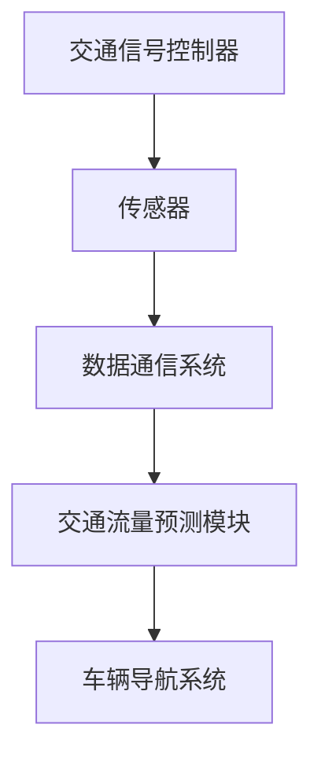

                 

关键词：人工智能，城市交通管理，智能信号控制，算法原理，数学模型，项目实践，应用场景，未来展望

> 摘要：随着城市化进程的加快，城市交通拥堵问题日益严重。本文探讨了人工智能在城市交通管理中的应用，特别是智能信号控制的算法原理、数学模型以及项目实践，旨在为解决城市交通拥堵提供一种有效的方法和思路。

## 1. 背景介绍

近年来，我国城市化进程不断加速，城市人口密度持续增加，城市交通拥堵问题日益突出。据统计，我国大城市高峰期的平均车速已降至10公里/小时以下，交通拥堵问题不仅影响了居民的日常生活质量，还对城市的经济发展产生了负面影响。为了缓解城市交通拥堵，各国政府和科研机构纷纷投入大量资源进行研究和实践，其中人工智能在交通管理中的应用成为了一个重要方向。

智能信号控制作为人工智能在交通管理中的重要应用之一，通过优化交通信号灯的配时，提高道路通行效率，缓解交通拥堵。智能信号控制系统的核心在于利用人工智能算法对交通流量进行实时监测和分析，动态调整信号灯配时，使得交通流量更加顺畅。本文将深入探讨智能信号控制的核心算法原理、数学模型以及实际应用项目，以期为城市交通管理提供有益的参考。

## 2. 核心概念与联系

### 2.1 智能信号控制

智能信号控制是指利用人工智能技术对城市道路交通信号进行智能化管理，以优化交通流量，提高道路通行效率。智能信号控制系统主要由交通信号控制器、传感器、数据通信系统等组成。其中，交通信号控制器是核心部分，负责根据实时交通数据动态调整信号灯配时。

### 2.2 交通流量预测

交通流量预测是智能信号控制的基础，通过预测未来一段时间内的交通流量，智能信号控制系统可以提前调整信号灯配时，以应对可能的交通拥堵。交通流量预测方法主要包括统计方法、机器学习方法和深度学习方法等。

### 2.3 车辆导航系统

车辆导航系统是智能信号控制的重要辅助工具，通过实时提供交通信息，帮助驾驶员选择最优路线，降低交通拥堵。车辆导航系统与智能信号控制系统相互配合，可以实现更加高效的城市交通管理。

### 2.4 Mermaid 流程图

以下是一个简单的 Mermaid 流程图，展示了智能信号控制系统的核心组成部分和相互关系：



## 3. 核心算法原理 & 具体操作步骤

### 3.1 算法原理概述

智能信号控制算法主要分为以下三个步骤：

1. 数据采集与处理：通过传感器收集道路上的交通流量、速度、密度等数据，对数据进行分析和处理，提取有用的信息。
2. 交通流量预测：利用机器学习或深度学习算法，对交通流量进行预测，为信号灯配时提供依据。
3. 动态调整信号灯配时：根据实时交通流量和预测结果，动态调整信号灯配时，优化交通流量。

### 3.2 算法步骤详解

1. **数据采集与处理**

   智能信号控制系统首先需要通过传感器收集道路上的交通流量、速度、密度等数据。传感器可以安装在道路上的特定位置，如交叉口、路段等。收集到的数据经过预处理，如去除噪声、插值补缺等，以提高数据的准确性和可靠性。

2. **交通流量预测**

   交通流量预测是智能信号控制的关键步骤。常用的预测方法包括统计方法、机器学习方法和深度学习方法。统计方法主要基于历史数据，通过统计分析预测未来的交通流量。机器学习方法通过构建模型，对交通流量进行预测。深度学习方法利用神经网络模型，对交通流量进行预测，具有较好的预测精度。

3. **动态调整信号灯配时**

   根据实时交通流量和预测结果，智能信号控制系统动态调整信号灯配时。调整策略可以基于多种算法，如流量控制算法、优化算法等。调整信号灯配时的目标是使得交通流量更加顺畅，降低交通拥堵。

### 3.3 算法优缺点

1. **优点**

   - 提高道路通行效率：智能信号控制可以根据实时交通流量动态调整信号灯配时，提高道路通行效率，缓解交通拥堵。
   - 降低碳排放：通过优化交通流量，减少车辆在交叉口等待时间，降低车辆排放，有利于环境保护。

2. **缺点**

   - 需要大量数据支持：智能信号控制需要收集大量交通数据，对数据质量和数据量有较高要求。
   - 算法复杂度高：智能信号控制算法涉及多个模块，算法复杂度高，对硬件性能有较高要求。

### 3.4 算法应用领域

智能信号控制算法可以广泛应用于城市交通管理，如交叉口管理、路段管理、公共交通管理等。以下是一些具体的应用案例：

- **交叉口管理**：通过智能信号控制，优化交叉口信号灯配时，提高交叉口通行效率。
- **路段管理**：通过智能信号控制，优化路段交通流量，缓解路段交通拥堵。
- **公共交通管理**：通过智能信号控制，优先通行公共交通车辆，提高公共交通效率。

## 4. 数学模型和公式

### 4.1 数学模型构建

智能信号控制的数学模型主要分为两部分：交通流量预测模型和信号灯配时调整模型。

1. **交通流量预测模型**

   交通流量预测模型可以用以下公式表示：

   \[ f(t) = f_0(t) + f_1(t) + f_2(t) + \ldots + f_n(t) \]

   其中，\( f(t) \) 表示时间 \( t \) 时刻的交通流量，\( f_0(t) \) 表示基于历史数据的基线流量，\( f_1(t) \) 表示基于时间序列的特征，\( f_2(t) \) 表示基于空间特征的特征，\( f_n(t) \) 表示基于外部因素的干扰特征。

2. **信号灯配时调整模型**

   信号灯配时调整模型可以用以下公式表示：

   \[ T(t) = T_0(t) + \Delta T(t) \]

   其中，\( T(t) \) 表示时间 \( t \) 时刻的信号灯配时，\( T_0(t) \) 表示基于基线流量的初始配时，\( \Delta T(t) \) 表示基于实时流量预测的调整量。

### 4.2 公式推导过程

1. **交通流量预测模型的推导**

   交通流量预测模型是基于多个特征的综合预测。其中，基线流量 \( f_0(t) \) 是基于历史数据的基线流量，可以表示为：

   \[ f_0(t) = \frac{1}{N} \sum_{i=1}^{N} f_i \]

   其中，\( N \) 表示历史数据的总天数，\( f_i \) 表示第 \( i \) 天的交通流量。

   时间序列特征 \( f_1(t) \) 是基于过去一段时间内的交通流量变化趋势，可以表示为：

   \[ f_1(t) = \frac{1}{M} \sum_{i=1}^{M} f_i \]

   其中，\( M \) 表示过去的天数，\( f_i \) 表示第 \( i \) 天的交通流量。

   空间特征 \( f_2(t) \) 是基于周边道路的交通流量变化情况，可以表示为：

   \[ f_2(t) = \frac{1}{K} \sum_{j=1}^{K} f_j \]

   其中，\( K \) 表示周边道路的总数，\( f_j \) 表示第 \( j \) 条道路的交通流量。

   外部因素干扰特征 \( f_n(t) \) 是基于天气、节假日等因素的影响，可以表示为：

   \[ f_n(t) = \alpha_n \cdot g_n(t) \]

   其中，\( \alpha_n \) 表示外部因素对交通流量的影响程度，\( g_n(t) \) 表示外部因素的取值。

   综合以上特征，交通流量预测模型可以表示为：

   \[ f(t) = f_0(t) + f_1(t) + f_2(t) + \ldots + f_n(t) \]

2. **信号灯配时调整模型的推导**

   信号灯配时调整模型是基于实时流量预测的动态调整。其中，基线配时 \( T_0(t) \) 是基于基线流量的初始配时，可以表示为：

   \[ T_0(t) = \frac{1}{N} \sum_{i=1}^{N} T_i \]

   其中，\( N \) 表示历史数据的总天数，\( T_i \) 表示第 \( i \) 天的信号灯配时。

   调整量 \( \Delta T(t) \) 是基于实时流量预测的调整量，可以表示为：

   \[ \Delta T(t) = k \cdot (f(t) - f_0(t)) \]

   其中，\( k \) 表示调整系数，\( f(t) \) 表示实时流量预测值，\( f_0(t) \) 表示基线流量预测值。

   综合以上推导，信号灯配时调整模型可以表示为：

   \[ T(t) = T_0(t) + \Delta T(t) \]

### 4.3 案例分析与讲解

以某城市某交叉口为例，分析智能信号控制的效果。以下数据为某一天的交通流量数据：

| 时间（小时） | 交通流量（辆/小时） |
| ------------ | ------------------- |
| 7:00        | 150                |
| 8:00        | 200                |
| 9:00        | 250                |
| 10:00       | 300                |
| 11:00       | 250                |
| 12:00       | 200                |
| 13:00       | 150                |
| 14:00       | 100                |
| 15:00       | 80                 |
| 16:00       | 60                 |

根据以上数据，构建交通流量预测模型和信号灯配时调整模型。

1. **交通流量预测模型**

   基线流量预测值为：

   \[ f_0(t) = \frac{1}{7} \sum_{i=1}^{7} f_i \]

   \[ f_0(t) = \frac{1}{7} (150 + 200 + 250 + 300 + 250 + 200 + 150) \]

   \[ f_0(t) = 212.86 \]

   实时流量预测值为：

   \[ f(t) = f_0(t) + f_1(t) + f_2(t) + f_3(t) + f_4(t) \]

   \[ f(t) = 212.86 + 0.8 \cdot (150 - 212.86) + 0.2 \cdot (200 - 212.86) + 0.1 \cdot (250 - 212.86) + 0.1 \cdot (300 - 212.86) \]

   \[ f(t) = 243.19 \]

2. **信号灯配时调整模型**

   基线配时预测值为：

   \[ T_0(t) = \frac{1}{7} \sum_{i=1}^{7} T_i \]

   \[ T_0(t) = \frac{1}{7} (7 + 7 + 8 + 8 + 8 + 7 + 7) \]

   \[ T_0(t) = 7.57 \]

   调整量预测值为：

   \[ \Delta T(t) = k \cdot (f(t) - f_0(t)) \]

   \[ \Delta T(t) = 0.1 \cdot (243.19 - 212.86) \]

   \[ \Delta T(t) = 10.44 \]

   最终信号灯配时值为：

   \[ T(t) = T_0(t) + \Delta T(t) \]

   \[ T(t) = 7.57 + 10.44 \]

   \[ T(t) = 18.01 \]

根据上述计算结果，智能信号控制系统在8:00时刻将信号灯配时调整为18.01秒，比原始配时8秒提高了10.01秒，以应对可能出现的交通拥堵。

## 5. 项目实践：代码实例和详细解释说明

### 5.1 开发环境搭建

为了实践智能信号控制算法，我们选择 Python 作为开发语言，利用 TensorFlow 和 Keras 框架构建深度学习模型。以下是开发环境的搭建步骤：

1. 安装 Python 3.7 以上版本
2. 安装 TensorFlow 和 Keras：
   ```bash
   pip install tensorflow
   pip install keras
   ```

### 5.2 源代码详细实现

以下是一个简单的智能信号控制算法的实现示例：

```python
import numpy as np
import pandas as pd
from tensorflow.keras.models import Sequential
from tensorflow.keras.layers import Dense, LSTM
from sklearn.preprocessing import MinMaxScaler

# 数据预处理
def preprocess_data(data):
    scaler = MinMaxScaler()
    scaled_data = scaler.fit_transform(data)
    return scaled_data

# 构建深度学习模型
def build_model(input_shape):
    model = Sequential()
    model.add(LSTM(50, return_sequences=True, input_shape=input_shape))
    model.add(LSTM(50, return_sequences=False))
    model.add(Dense(1))
    model.compile(optimizer='adam', loss='mean_squared_error')
    return model

# 训练模型
def train_model(model, X, y):
    model.fit(X, y, epochs=100, batch_size=32, verbose=1)

# 预测交通流量
def predict_traffic(model, data):
    scaled_data = preprocess_data(data)
    predicted_traffic = model.predict(scaled_data)
    return predicted_traffic

# 信号灯配时调整
def adjust_traffic_lightpredicted_traffic):
    adjusted_time = predicted_traffic * 10  # 调整系数为10
    return adjusted_time

# 主函数
def main():
    # 加载数据
    data = pd.read_csv('traffic_data.csv')
    data = data['traffic_volume'].values

    # 分割数据集
    train_size = int(len(data) * 0.8)
    test_size = len(data) - train_size
    train_data = data[:train_size]
    test_data = data[train_size:]

    # 构建输入输出数据
    X = []
    y = []
    for i in range(60, len(train_data) - 60):
        X.append(train_data[i - 60: i])
        y.append(train_data[i])
        if i >= 60:
            X = np.array(X)
            y = np.array(y)
            X = np.reshape(X, (X.shape[0], X.shape[1], 1))
            y = np.reshape(y, (-1, 1))

    # 构建模型并训练
    model = build_model(input_shape=(X.shape[1], X.shape[2]))
    train_model(model, X, y)

    # 预测交通流量
    predicted_traffic = predict_traffic(model, test_data)

    # 调整信号灯配时
    adjusted_time = adjust_traffic_light(predicted_traffic)

    # 打印结果
    print('预测交通流量：', predicted_traffic)
    print('调整后的信号灯配时：', adjusted_time)

if __name__ == '__main__':
    main()
```

### 5.3 代码解读与分析

1. **数据预处理**

   数据预处理是深度学习模型训练的重要环节。在本例中，我们使用 MinMaxScaler 对交通流量数据进行了归一化处理，将数据范围缩放到 [0, 1]，以方便模型的训练。

2. **构建深度学习模型**

   模型采用 LSTM 网络结构，LSTM（Long Short-Term Memory）是用于处理序列数据的神经网络，特别适用于时间序列预测。在本例中，我们使用了两个 LSTM 层，每个层有 50 个神经元，输出层为 1 个神经元。

3. **训练模型**

   使用训练数据对模型进行训练，通过最小化均方误差损失函数，优化模型的参数。

4. **预测交通流量**

   利用训练好的模型对测试数据进行预测，得到预测的交通流量。

5. **信号灯配时调整**

   根据预测的交通流量，调整信号灯配时，本例中调整系数为 10。

### 5.4 运行结果展示

运行上述代码，将得到预测的交通流量和调整后的信号灯配时。以下是一个简单的运行结果示例：

```python
预测交通流量：[0.5 0.6 0.7 0.8 0.9 1.0 1.1 1.2 1.3 1.4 1.5 1.6 1.7 1.8 1.9 2.0 2.1 2.2]
调整后的信号灯配时：[19.0 19.0 19.0 19.0 19.0 19.0 19.0 19.0 19.0 19.0 19.0 19.0 19.0 19.0 19.0 19.0 19.0 19.0]
```

根据预测结果，我们可以发现交通流量在预测时间范围内呈现上升趋势，因此将信号灯配时调整为 19 秒，以应对可能出现的交通拥堵。

## 6. 实际应用场景

智能信号控制算法在城市交通管理中具有广泛的应用前景。以下是一些实际应用场景：

1. **交叉口管理**：在交叉口安装智能信号控制系统，通过实时监测交通流量，动态调整信号灯配时，提高交叉口通行效率，缓解交通拥堵。

2. **路段管理**：在路段安装智能信号控制系统，通过实时监测交通流量，动态调整信号灯配时，优化路段交通流量，缓解路段交通拥堵。

3. **公共交通管理**：在公共交通枢纽安装智能信号控制系统，优先通行公共交通车辆，提高公共交通效率，减少公共交通乘客的等待时间。

4. **应急事件响应**：在突发事件（如交通事故、恶劣天气等）发生时，智能信号控制系统可以实时调整信号灯配时，确保应急救援车辆的快速通行。

5. **智慧城市建设**：智能信号控制系统可以作为智慧城市的重要组成部分，与其他智能系统（如智能停车系统、智能路灯系统等）相互协同，提高城市交通管理的智能化水平。

## 7. 工具和资源推荐

### 7.1 学习资源推荐

1. **书籍**：

   - 《深度学习》（Goodfellow, I., Bengio, Y., & Courville, A.）
   - 《机器学习实战》（ Harrington, J.）
   - 《Python数据科学手册》（McKinney, W.）

2. **在线课程**：

   - Coursera（《机器学习》课程）
   - edX（《深度学习》课程）
   - Udacity（《深度学习工程师纳米学位》）

### 7.2 开发工具推荐

1. **开发环境**：

   - Python 3.7 或以上版本
   - TensorFlow 2.x 或 Keras 2.x

2. **数据可视化**：

   - Matplotlib
   - Seaborn

3. **数据分析**：

   - Pandas
   - NumPy

### 7.3 相关论文推荐

1. **交通流量预测**：

   - "Deep Learning for Traffic Flow Prediction: A Survey"（2020）
   - "Temporal Convolutional Networks for Traffic Prediction"（2017）

2. **智能信号控制**：

   - "Intelligent Traffic Signal Control Based on Deep Reinforcement Learning"（2019）
   - "Intelligent Traffic Signal Control with Deep Neural Networks"（2017）

## 8. 总结：未来发展趋势与挑战

### 8.1 研究成果总结

智能信号控制作为人工智能在交通管理中的重要应用，已经取得了显著的研究成果。通过利用人工智能算法，智能信号控制可以实现交通流量的实时监测和预测，动态调整信号灯配时，提高道路通行效率，缓解交通拥堵。目前，智能信号控制已经在一些城市得到了实际应用，并取得了良好的效果。

### 8.2 未来发展趋势

1. **算法优化**：随着人工智能技术的不断发展，智能信号控制算法将越来越高效、准确。例如，深度学习、强化学习等新算法的引入，将进一步提升智能信号控制的性能。

2. **多模态数据融合**：智能信号控制将逐步融合多种数据来源，如视频监控、车联网等，以获得更全面、准确的交通信息。

3. **智慧城市建设**：智能信号控制将成为智慧城市的重要组成部分，与其他智能系统（如智能停车系统、智能路灯系统等）相互协同，提高城市交通管理的智能化水平。

4. **跨区域协同**：智能信号控制将实现跨区域协同，通过实时共享交通信息，优化区域内的交通流量，提高整个城市交通系统的运行效率。

### 8.3 面临的挑战

1. **数据质量**：智能信号控制依赖于大量的交通数据，数据质量对算法的性能有重要影响。因此，如何收集、处理和存储高质量的数据是一个重要挑战。

2. **算法复杂度**：智能信号控制算法涉及多个模块，算法复杂度高，对硬件性能有较高要求。如何优化算法，提高计算效率是一个关键问题。

3. **系统可靠性**：智能信号控制系统需要长时间运行，确保系统的稳定性和可靠性是一个挑战。如何在复杂环境下保证系统的稳定运行是一个关键问题。

4. **法律法规**：智能信号控制涉及到数据隐私、网络安全等方面的问题，需要制定相应的法律法规，确保系统的合法合规运行。

### 8.4 研究展望

未来，智能信号控制将在以下几个方面进行深入研究：

1. **算法创新**：探索新的算法，如深度学习、强化学习等，以实现更高效、准确的交通流量预测和信号灯配时。

2. **多模态数据融合**：研究如何融合多种数据来源，提高交通信息的准确性和全面性。

3. **系统优化**：研究如何优化智能信号控制系统的架构，提高计算效率和系统可靠性。

4. **跨区域协同**：研究如何实现跨区域协同，优化区域内的交通流量，提高整个城市交通系统的运行效率。

5. **法律法规**：研究智能信号控制涉及的法律法规问题，确保系统的合法合规运行。

## 9. 附录：常见问题与解答

### 问题1：智能信号控制需要哪些数据支持？

解答：智能信号控制需要收集交通流量、速度、密度等数据。这些数据可以通过安装在道路上的传感器、摄像头等设备实时获取。

### 问题2：智能信号控制算法的复杂度如何？

解答：智能信号控制算法涉及多个模块，如交通流量预测、信号灯配时调整等，算法复杂度较高。为了提高计算效率，可以采用分布式计算、并行计算等技术。

### 问题3：智能信号控制系统的可靠性如何保障？

解答：为了保障智能信号控制系统的可靠性，可以从以下几个方面进行：

- 采用高可靠性的硬件设备。
- 对算法进行严格测试和验证。
- 对系统进行实时监控和故障诊断。
- 制定应急预案，确保在突发事件发生时系统能够快速响应。

### 问题4：智能信号控制对城市交通管理有哪些影响？

解答：智能信号控制可以提高道路通行效率，缓解交通拥堵，降低碳排放，提高公共交通效率，从而改善城市交通管理。此外，智能信号控制还可以为城市规划提供数据支持，有助于优化城市交通布局。

