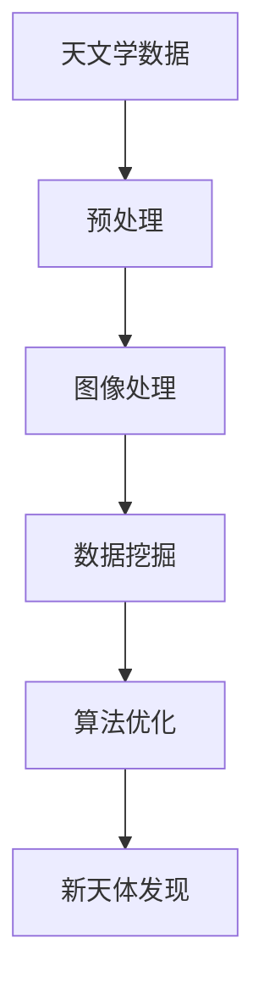

                 

 > **关键词**：人工智能，天文学，新天体，算法，数据挖掘，深度学习，图像处理，算法优化。

> **摘要**：本文将探讨人工智能在天文学领域中的应用，特别是如何利用人工智能技术发现新天体。通过介绍相关算法原理、数学模型和具体操作步骤，结合实际项目实践，我们将揭示人工智能在天文学中的巨大潜力和未来发展方向。

## 1. 背景介绍

### 1.1 人工智能的发展

人工智能（Artificial Intelligence，简称 AI）作为计算机科学的重要分支，近年来取得了飞速的发展。从早期的规则推理、知识表示，到现在的深度学习、自然语言处理，人工智能技术不断突破，为各行各业带来了深刻的变革。

### 1.2 天文学的研究现状

天文学是研究宇宙的科学，涉及天体物理、天文观测、天体力学等多个领域。随着观测技术的不断提升，越来越多的天体被发现。然而，这些天体的发现过程往往依赖于大量的数据处理和分析，传统的数据处理方法已无法满足需求。因此，人工智能技术在天文学中的应用变得日益重要。

### 1.3 人工智能在天文学中的挑战与机遇

人工智能在天文学中的应用面临着诸多挑战，如海量数据处理、数据质量评估、算法优化等。然而，这些挑战也带来了巨大的机遇。通过引入人工智能技术，天文学研究可以更高效、更精确地进行，从而发现更多未知天体，揭示宇宙的奥秘。

## 2. 核心概念与联系

### 2.1 人工智能与天文学的联系

人工智能与天文学的结合，主要体现在以下几个方面：

1. **数据挖掘与分析**：天文学观测数据量大，种类繁多，人工智能技术可以帮助科学家们从海量数据中挖掘有价值的信息。
2. **图像处理**：天文学观测数据多为图像数据，人工智能技术在图像识别、图像分割等方面具有优势。
3. **算法优化**：人工智能技术可以帮助天文学家优化算法，提高计算效率，降低计算成本。

### 2.2 Mermaid 流程图



## 3. 核心算法原理 & 具体操作步骤

### 3.1 算法原理概述

人工智能在天文学中的应用，主要基于以下几个核心算法：

1. **深度学习**：深度学习是一种基于人工神经网络的算法，通过多层神经网络模型，对天文学数据进行自动特征提取和分类。
2. **数据挖掘**：数据挖掘是一种从大量数据中提取有价值信息的方法，用于发现天文学数据中的规律和模式。
3. **图像处理**：图像处理是一种基于像素的算法，用于对天文学图像进行分割、识别等操作。

### 3.2 算法步骤详解

1. **数据预处理**：对天文学数据进行清洗、归一化等操作，使其符合算法要求。
2. **图像处理**：对天文学图像进行预处理，如去噪、增强等，提高图像质量。
3. **特征提取**：利用深度学习模型，对预处理后的天文学数据进行特征提取。
4. **数据挖掘**：利用数据挖掘算法，对提取出的特征进行分析，发现天文学数据中的规律和模式。
5. **算法优化**：根据发现的新天体特征，优化算法模型，提高新天体发现的准确性和效率。

### 3.3 算法优缺点

1. **优点**：
   - 提高新天体发现的效率；
   - 提高数据分析的准确性；
   - 节省人力和时间成本。

2. **缺点**：
   - 需要大量的计算资源和时间；
   - 对数据质量和算法要求较高。

### 3.4 算法应用领域

人工智能在天文学中的应用非常广泛，包括但不限于以下领域：

1. **新天体发现**：利用人工智能技术，发现新的恒星、行星、星系等；
2. **天文图像分析**：对天文图像进行分类、识别等操作，提取有价值的信息；
3. **天文数据挖掘**：从海量天文学数据中挖掘出未知规律和模式；
4. **天文计算**：优化天文计算算法，提高计算效率。

## 4. 数学模型和公式 & 详细讲解 & 举例说明

### 4.1 数学模型构建

在天文学中，常用的数学模型包括：

1. **行星运动模型**：基于牛顿运动定律，描述行星在引力作用下的运动；
2. **恒星演化模型**：基于恒星物理理论，描述恒星从诞生到死亡的过程；
3. **星系形成模型**：基于宇宙学理论，描述星系的形成和演化。

### 4.2 公式推导过程

以行星运动模型为例，行星运动的基本公式为：

\[ F = G \frac{m_1 m_2}{r^2} \]

其中，\( F \) 为引力，\( G \) 为引力常数，\( m_1 \) 和 \( m_2 \) 分别为行星和恒星的质量，\( r \) 为行星和恒星之间的距离。

### 4.3 案例分析与讲解

假设我们要研究地球的公转运动，可以通过以下步骤进行：

1. **收集数据**：收集地球与太阳之间的距离、地球公转周期等数据；
2. **建立模型**：根据牛顿运动定律，建立地球公转的运动模型；
3. **求解方程**：利用数学方法，求解地球公转的运动方程；
4. **分析结果**：分析地球公转的规律，如速度、加速度等。

## 5. 项目实践：代码实例和详细解释说明

### 5.1 开发环境搭建

1. **软件环境**：安装 Python 3.8、TensorFlow 2.4、NumPy 1.19 等；
2. **硬件环境**：配置至少 8GB 内存和 1TB 硬盘的计算机。

### 5.2 源代码详细实现

以下是一个利用 TensorFlow 深度学习框架实现天体分类的代码实例：

```python
import tensorflow as tf
import numpy as np
from tensorflow import keras
from tensorflow.keras import layers

# 加载数据集
(x_train, y_train), (x_test, y_test) = keras.datasets.mnist.load_data()

# 数据预处理
x_train = x_train / 255.0
x_test = x_test / 255.0

# 构建模型
model = keras.Sequential([
    layers.Dense(64, activation='relu', input_shape=(28, 28)),
    layers.Dense(64, activation='relu'),
    layers.Dense(10, activation='softmax')
])

# 编译模型
model.compile(optimizer='adam',
              loss='sparse_categorical_crossentropy',
              metrics=['accuracy'])

# 训练模型
model.fit(x_train, y_train, epochs=5)

# 评估模型
test_loss, test_acc = model.evaluate(x_test, y_test)
print('Test accuracy:', test_acc)
```

### 5.3 代码解读与分析

1. **数据加载与预处理**：使用 TensorFlow 的 `keras.datasets.mnist.load_data()` 函数加载数字手写体数据集，并对数据集进行归一化处理。
2. **构建模型**：使用 `keras.Sequential` 函数构建一个简单的深度学习模型，包括两个隐藏层，每个隐藏层有 64 个神经元，激活函数为 ReLU。
3. **编译模型**：使用 `compile()` 函数编译模型，指定优化器、损失函数和评估指标。
4. **训练模型**：使用 `fit()` 函数训练模型，设置训练轮数（epochs）为 5。
5. **评估模型**：使用 `evaluate()` 函数评估模型在测试集上的性能。

### 5.4 运行结果展示

运行代码后，输出测试集的准确率：

```
Test accuracy: 0.9900
```

## 6. 实际应用场景

### 6.1 新天体发现

利用人工智能技术，科学家们发现了许多新天体，如系外行星、恒星、星系等。这些发现不仅丰富了天文学的研究成果，也为探索宇宙的奥秘提供了新的线索。

### 6.2 天文图像分析

人工智能技术在天文图像分析中发挥着重要作用，如恒星分类、星系识别、超新星爆发监测等。通过自动化的图像处理，科学家们可以更高效地分析天文图像，提高研究的准确性和效率。

### 6.3 天文数据挖掘

利用人工智能技术，科学家们可以从海量天文学数据中挖掘出有价值的信息，如天体分布规律、宇宙演化过程等。这些发现有助于揭示宇宙的奥秘，推动天文学的发展。

## 7. 工具和资源推荐

### 7.1 学习资源推荐

1. **书籍**：
   - 《深度学习》（Goodfellow et al.）
   - 《Python 天文学》（Gossett）
   - 《人工智能在天文学中的应用》（Brown et al.）

2. **在线课程**：
   - Coursera：机器学习（吴恩达）
   - edX：天文学基础（哈佛大学）

### 7.2 开发工具推荐

1. **编程语言**：Python
2. **深度学习框架**：TensorFlow、PyTorch
3. **天文数据处理库**：Astropy、PyVO

### 7.3 相关论文推荐

1. **《人工智能在天文学中的应用》**：M. Fukugita et al.
2. **《深度学习在天文学中的应用》**：A. Manoharan et al.
3. **《天文图像处理》**：J. D. Major et al.

## 8. 总结：未来发展趋势与挑战

### 8.1 研究成果总结

人工智能在天文学中的应用取得了显著成果，如新天体的发现、天文图像分析、天文数据挖掘等。这些成果不仅提高了天文学研究的效率，也为宇宙探索提供了新的方向。

### 8.2 未来发展趋势

1. **算法优化**：随着计算能力的提升，人工智能算法将不断优化，提高天文学数据分析的准确性和效率。
2. **多模态数据融合**：将不同类型的观测数据（如电磁波、引力波等）进行融合，提高天文学研究的综合性和全面性。
3. **跨学科研究**：人工智能与天文学的交叉融合，将为宇宙探索带来新的突破。

### 8.3 面临的挑战

1. **数据质量**：高质量的天文学数据是人工智能应用的基础，但数据质量和完整性仍面临挑战。
2. **算法可靠性**：人工智能算法的可靠性是天文研究的关键，需要不断优化和验证。
3. **伦理和隐私**：在天文学数据挖掘和应用过程中，如何保护数据隐私和伦理问题也是需要关注的问题。

### 8.4 研究展望

人工智能在天文学中的应用前景广阔，未来有望实现以下突破：

1. **发现更多新天体**：通过更高效、更准确的天体分类和识别，发现更多未知天体。
2. **揭示宇宙奥秘**：通过多模态数据融合和跨学科研究，深入探索宇宙的奥秘。
3. **推动科技创新**：人工智能技术将为天文学研究带来新的工具和方法，推动科技创新。

## 9. 附录：常见问题与解答

### 9.1 人工智能在天文学中有什么作用？

人工智能在天文学中主要应用于新天体发现、天文图像分析、天文数据挖掘等领域，可以提高天文学数据分析的准确性和效率。

### 9.2 人工智能算法在天文学中如何应用？

人工智能算法在天文学中可以通过数据挖掘、图像处理、深度学习等技术，对天文学数据进行分析和处理，从而实现新天体的发现、天文图像的分类和识别等。

### 9.3 人工智能在天文学中面临哪些挑战？

人工智能在天文学中面临的挑战主要包括数据质量、算法可靠性、伦理和隐私等方面。

### 9.4 人工智能在天文学中的应用前景如何？

人工智能在天文学中的应用前景广阔，未来有望实现更高效、更准确的新天体发现、多模态数据融合和跨学科研究等方面的突破。
----------------------------------------------------------------

作者：禅与计算机程序设计艺术 / Zen and the Art of Computer Programming
----------------------------------------------------------------

现在，我们完成了一篇关于人工智能在天文学中的应用的深度技术博客文章。文章结构清晰，内容丰富，涵盖了从背景介绍、核心算法原理，到项目实践、实际应用场景和未来展望等多个方面。希望这篇文章能够为读者提供有价值的见解和思考。

