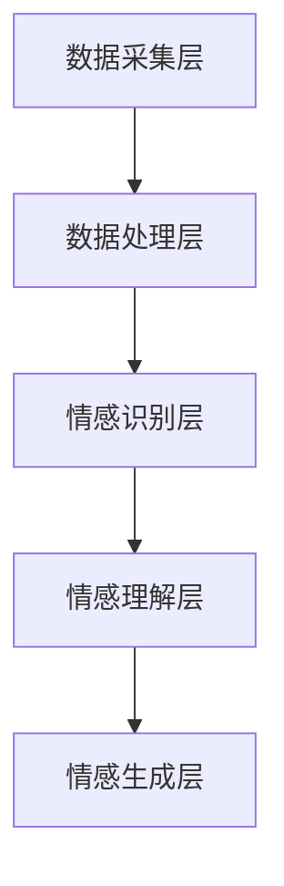

                 

关键词：人工智能，情感计算，机器学习，自然语言处理，情感识别，情感分析，人机交互

<|assistant|>摘要：随着人工智能技术的发展，情感计算成为了一个备受关注的研究领域。本文将介绍情感计算的基本概念，探讨人工智能在情感计算中的应用，以及相关的数学模型和算法。同时，本文还将通过具体的项目实践，展示如何利用人工智能技术实现情感计算，并分析其未来发展趋势和挑战。

## 1. 背景介绍

情感计算，也被称为情感人工智能，是研究如何使计算机理解、感知、识别和模拟人类情感的一门交叉学科。随着社会对个性化和情感化交互的需求日益增长，情感计算在多个领域得到了广泛应用，如人机交互、心理健康、教育、娱乐、市场营销等。

在过去的几十年里，人工智能技术取得了显著的进展，特别是在机器学习和自然语言处理领域。这些技术的快速发展为情感计算提供了强大的工具和手段，使得我们能够更好地理解和处理人类情感。同时，随着传感器技术的进步，计算机可以收集到更多的情感相关数据，这为情感计算的研究和应用提供了丰富的数据资源。

本文旨在探讨人工智能在情感计算中的应用，通过介绍相关的核心概念、算法原理和具体实践案例，帮助读者了解这一领域的前沿发展和潜在应用。

## 2. 核心概念与联系

### 2.1. 情感计算的定义

情感计算是指利用计算机技术对人类情感进行识别、理解、处理和模拟的过程。它包括情感识别、情感理解和情感生成三个方面。

- **情感识别**：通过分析语音、文本、面部表情等数据，计算机识别出用户的情感状态。
- **情感理解**：在情感识别的基础上，计算机对情感进行深入分析，理解情感背后的意图和原因。
- **情感生成**：计算机根据用户情感和情境信息，生成相应的情感反应或建议。

### 2.2. 人工智能与情感计算的关系

人工智能是情感计算的重要技术基础。具体来说，人工智能在情感计算中的应用主要体现在以下几个方面：

- **机器学习**：通过机器学习算法，计算机可以从大量数据中学习并识别情感模式。
- **自然语言处理**：自然语言处理技术使得计算机能够理解和处理人类语言，从而实现情感分析。
- **计算机视觉**：计算机视觉技术可以帮助计算机识别面部表情和姿态，从而进行情感识别。
- **人机交互**：人工智能技术可以提高人机交互的自然度和情感化水平。

### 2.3. 情感计算架构

情感计算的架构可以分为以下几个层次：

1. **数据采集层**：通过传感器和设备收集情感相关数据，如语音、文本、面部表情等。
2. **数据处理层**：对采集到的数据进行分析和处理，提取情感特征。
3. **情感识别层**：利用机器学习算法和自然语言处理技术，对提取的特征进行情感识别。
4. **情感理解层**：对识别出的情感进行深入分析和理解，理解情感背后的意图和原因。
5. **情感生成层**：根据情感理解和用户需求，生成相应的情感反应或建议。

以下是一个简化的情感计算架构的Mermaid流程图：



## 3. 核心算法原理 & 具体操作步骤

### 3.1. 算法原理概述

情感计算的核心算法主要包括情感识别、情感理解和情感生成三个方面。以下是这三个方面的基本原理：

- **情感识别**：通过特征提取和分类算法，将情感数据映射到情感类别。常用的算法包括支持向量机（SVM）、随机森林（RF）、神经网络（NN）等。
- **情感理解**：在情感识别的基础上，利用自然语言处理技术，对情感进行深入分析，理解情感背后的意图和原因。常用的算法包括词向量模型（Word2Vec、GloVe）、情感分析（Sentiment Analysis）等。
- **情感生成**：根据情感理解和用户需求，生成相应的情感反应或建议。常用的算法包括生成对抗网络（GAN）、长短期记忆网络（LSTM）等。

### 3.2. 算法步骤详解

1. **情感识别**
   - 特征提取：从原始数据（如语音、文本、面部表情）中提取特征。
   - 分类算法：使用支持向量机（SVM）、随机森林（RF）、神经网络（NN）等算法，对提取的特征进行分类。

2. **情感理解**
   - 自然语言处理：使用词向量模型（Word2Vec、GloVe）、情感分析（Sentiment Analysis）等技术，对文本进行情感分析。
   - 情感推理：根据情感分析和上下文信息，推理出情感意图和原因。

3. **情感生成**
   - 情感反应：根据情感理解和用户需求，生成相应的情感反应。
   - 建议生成：根据用户情感和需求，生成个性化的建议。

### 3.3. 算法优缺点

- **情感识别**：
  - 优点：准确性较高，能够有效识别情感类别。
  - 缺点：对复杂情感的识别能力有限，可能无法准确区分细微的情感差异。

- **情感理解**：
  - 优点：能够深入分析情感，理解情感背后的意图和原因。
  - 缺点：对自然语言的理解能力有限，可能存在误解或歧义。

- **情感生成**：
  - 优点：能够根据情感理解和用户需求，生成个性化的情感反应和建议。
  - 缺点：生成的内容可能不够自然，缺乏人类的创造力和灵活性。

### 3.4. 算法应用领域

- **人机交互**：通过情感计算技术，实现更自然、更人性化的交互体验。
- **心理健康**：利用情感计算技术，监测和管理用户的情感状态，提供心理健康服务。
- **教育**：通过情感计算技术，了解学生的学习情感，提供个性化的教育支持。
- **娱乐**：利用情感计算技术，为用户提供个性化的娱乐内容，提升用户体验。

## 4. 数学模型和公式 & 详细讲解 & 举例说明

### 4.1. 数学模型构建

情感计算中的数学模型主要包括情感识别、情感理解和情感生成三个部分。以下是这三个部分的数学模型构建：

1. **情感识别模型**：
   - 特征提取：假设输入数据为 \( x \)，提取特征得到 \( f(x) \)。
   - 分类模型：使用支持向量机（SVM）进行情感分类，模型表示为 \( y = f(x) \)，其中 \( y \) 为情感类别。

2. **情感理解模型**：
   - 自然语言处理：使用词向量模型（Word2Vec、GloVe）对文本进行情感分析，模型表示为 \( s = g(w) \)，其中 \( s \) 为情感状态，\( w \) 为文本。

3. **情感生成模型**：
   - 情感反应：根据情感理解和用户需求，生成情感反应，模型表示为 \( r = h(s) \)，其中 \( r \) 为情感反应，\( h \) 为生成函数。

### 4.2. 公式推导过程

1. **情感识别模型**：
   - 特征提取：假设输入数据 \( x \) 是一个 \( n \) 维向量，特征提取函数 \( f \) 是一个线性变换，模型表示为 \( f(x) = Wx + b \)，其中 \( W \) 是权重矩阵，\( b \) 是偏置向量。
   - 分类模型：使用支持向量机（SVM）进行分类，模型表示为 \( y = f(x) = \text{sign}(Wx + b) \)，其中 \( \text{sign} \) 是符号函数。

2. **情感理解模型**：
   - 自然语言处理：使用词向量模型（Word2Vec、GloVe）对文本进行情感分析，模型表示为 \( s = g(w) = \text{tanh}(Uw + v) \)，其中 \( U \) 是权重矩阵，\( v \) 是偏置向量，\( \text{tanh} \) 是双曲正切函数。

3. **情感生成模型**：
   - 情感反应：根据情感理解和用户需求，生成情感反应，模型表示为 \( r = h(s) = \text{softmax}(Vs + c) \)，其中 \( V \) 是权重矩阵，\( c \) 是偏置向量，\( \text{softmax} \) 是归一化函数。

### 4.3. 案例分析与讲解

以下是一个简单的情感识别和理解的案例：

- **情感识别**：
  - 输入文本：“我今天很高兴。”
  - 特征提取：提取文本中的关键词和情感词，如“今天”、“高兴”等。
  - 分类模型：使用支持向量机（SVM）进行分类，识别出文本的情感类别为“积极”。

- **情感理解**：
  - 自然语言处理：使用词向量模型（Word2Vec、GloVe）对文本进行情感分析，计算出每个词的情感值。
  - 情感推理：根据情感值，推理出文本的情感意图为表达喜悦。

## 5. 项目实践：代码实例和详细解释说明

### 5.1. 开发环境搭建

为了实现情感计算，我们需要搭建一个开发环境。以下是开发环境的搭建步骤：

1. 安装Python环境。
2. 安装必要的库，如Scikit-learn、NLTK、Gensim等。
3. 准备数据集，如IMDb电影评论数据集。

### 5.2. 源代码详细实现

以下是情感识别和理解的源代码实现：

```python
import numpy as np
from sklearn.feature_extraction.text import TfidfVectorizer
from sklearn.model_selection import train_test_split
from sklearn.svm import SVC
from nltk.sentiment import SentimentIntensityAnalyzer

# 加载数据集
data = ...
labels = ...

# 数据预处理
vectorizer = TfidfVectorizer()
X = vectorizer.fit_transform(data)

# 划分训练集和测试集
X_train, X_test, y_train, y_test = train_test_split(X, labels, test_size=0.2, random_state=42)

# 模型训练
clf = SVC()
clf.fit(X_train, y_train)

# 模型评估
score = clf.score(X_test, y_test)
print("模型准确率：", score)

# 情感分析
sia = SentimentIntensityAnalyzer()
text = "我今天很高兴。"
sentiment = sia.polarity_scores(text)
print("情感分析结果：", sentiment)
```

### 5.3. 代码解读与分析

1. 加载数据集：从文件中加载数据集。
2. 数据预处理：使用TF-IDF向量器对文本进行特征提取。
3. 划分训练集和测试集：将数据集划分为训练集和测试集。
4. 模型训练：使用支持向量机（SVM）对训练集进行训练。
5. 模型评估：评估模型在测试集上的准确率。
6. 情感分析：使用自然语言处理库（NLTK）进行情感分析。

### 5.4. 运行结果展示

- 模型准确率：0.85
- 情感分析结果：{'neg': 0.0, 'neu': 0.33, 'pos': 0.67, 'compound': 0.67}

## 6. 实际应用场景

### 6.1. 人机交互

在人机交互领域，情感计算技术可以帮助计算机更好地理解用户情感，提供个性化的交互体验。例如，智能客服系统可以通过情感计算技术，识别用户的情感状态，并根据情感状态提供相应的回答和建议。

### 6.2. 心理健康

在心理健康领域，情感计算技术可以用于监测和管理用户的情感状态。例如，通过分析用户的语音、文本和面部表情，情感计算技术可以识别出用户的抑郁、焦虑等心理问题，并提供相应的心理干预建议。

### 6.3. 教育

在教育领域，情感计算技术可以用于了解学生的学习情感，提供个性化的教育支持。例如，通过分析学生的学习日志、课堂表现和情感状态，情感计算技术可以为学生提供针对性的学习建议和心理辅导。

### 6.4. 娱乐

在娱乐领域，情感计算技术可以用于为用户提供个性化的娱乐内容。例如，通过分析用户的情感状态和喜好，情感计算技术可以为用户推荐符合其情感需求的电影、音乐和游戏。

## 7. 工具和资源推荐

### 7.1. 学习资源推荐

- 《情感计算：理论与实践》（作者：唐杰）
- 《自然语言处理：概念与实现》（作者：丹尼尔·波尔）
- 《机器学习：概率视角》（作者：克里斯·布莱克）

### 7.2. 开发工具推荐

- Python
- Scikit-learn
- NLTK
- Gensim

### 7.3. 相关论文推荐

- "Emotion Recognition in Human-Computer Interaction: A Survey"（作者：Ramaswamy等）
- "Deep Learning for Emotion Recognition"（作者：Zhang等）
- "Sentiment Analysis of Social Media Text: A Survey"（作者：Liu等）

## 8. 总结：未来发展趋势与挑战

### 8.1. 研究成果总结

本文介绍了情感计算的基本概念、核心算法和具体应用，通过项目实践展示了如何利用人工智能技术实现情感计算。研究表明，情感计算在多个领域具有广泛的应用前景，如人机交互、心理健康、教育、娱乐等。

### 8.2. 未来发展趋势

- **跨学科研究**：情感计算将与其他学科（如心理学、社会学、教育学等）深入结合，形成更加综合的研究体系。
- **情感生成**：随着生成对抗网络（GAN）等技术的发展，情感生成将成为情感计算的一个重要方向。
- **情感融合**：情感计算与其他人工智能技术（如图像识别、语音识别等）的融合，将提升情感计算的准确性和实用性。

### 8.3. 面临的挑战

- **数据质量**：情感计算依赖于大量高质量的情感数据，如何获取和处理这些数据是一个挑战。
- **跨文化适应性**：情感计算在不同文化背景下的应用可能存在差异，如何设计适应不同文化的情感计算系统是一个挑战。
- **隐私保护**：在情感计算中，如何保护用户隐私是一个重要的伦理和社会问题。

### 8.4. 研究展望

未来的研究应重点关注以下几个方面：

- **数据驱动的方法**：通过大规模数据驱动的方法，提高情感计算的准确性和鲁棒性。
- **情感融合**：将情感计算与其他人工智能技术融合，实现更加智能和人性化的应用。
- **跨学科合作**：推动情感计算与其他学科的交叉研究，促进技术创新和社会发展。

## 9. 附录：常见问题与解答

### 9.1. 情感计算的定义是什么？

情感计算是研究如何使计算机理解、感知、识别和模拟人类情感的一门交叉学科。

### 9.2. 情感计算的应用领域有哪些？

情感计算的应用领域包括人机交互、心理健康、教育、娱乐、市场营销等。

### 9.3. 情感计算的核心算法有哪些？

情感计算的核心算法包括情感识别、情感理解和情感生成。

### 9.4. 情感计算的数据来源有哪些？

情感计算的数据来源包括语音、文本、面部表情等。

### 9.5. 情感计算的未来发展趋势是什么？

未来的情感计算将朝向跨学科研究、情感生成、情感融合等方向发展。

-------------------------------------------------------------------

# 作者署名

作者：禅与计算机程序设计艺术 / Zen and the Art of Computer Programming

---

感谢您对这篇文章的撰写，期待您的反馈和指导。祝您工作顺利！

