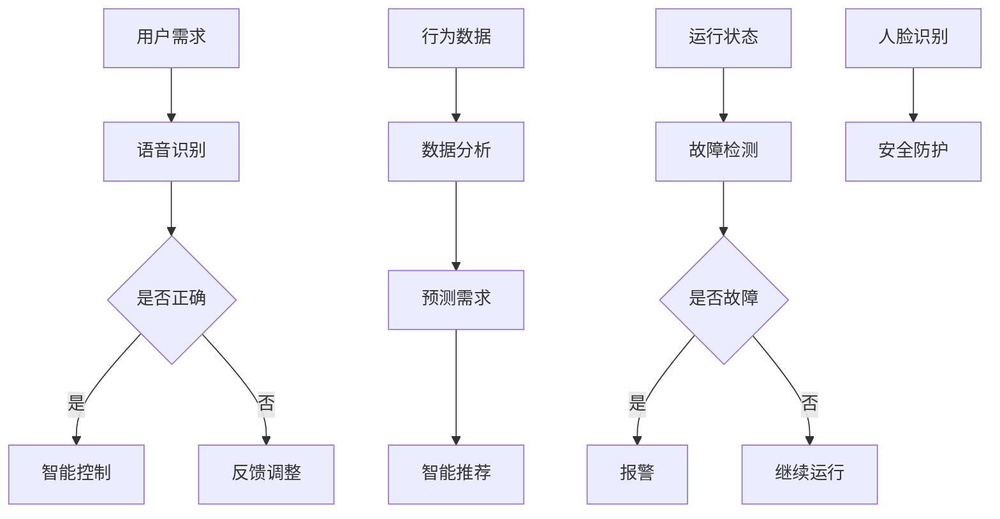

                 

关键词：人工智能、智能家居、深度学习、自然语言处理、物联网

摘要：随着人工智能技术的不断发展，智能家居领域迎来了新的变革。本文将探讨人工智能在智能家居中的应用，包括核心概念、算法原理、数学模型、项目实践以及未来发展趋势等，旨在为读者提供一个全面的了解和思考。

## 1. 背景介绍

### 智能家居的定义与发展

智能家居，顾名思义，就是利用先进的计算机技术、网络通信技术和家电控制技术，实现家庭设备的智能化。它能够根据用户的需求自动调整家庭环境的温度、光线、湿度等，提供更加舒适、便捷的生活方式。

智能家居的发展可以分为三个阶段：

- **早期阶段**：主要集中于家庭自动化，如自动窗帘、自动空调等，这些设备主要依赖简单的定时控制和机械开关。

- **中期阶段**：随着物联网技术的发展，智能家居开始实现设备之间的互联，如智能门锁、智能灯具等。这一阶段的智能家居产品主要依赖于无线通信协议，如Wi-Fi、ZigBee等。

- **现阶段**：随着人工智能技术的进步，智能家居开始具备自主学习和自主决策的能力，能够更加智能地响应用户的需求，提供个性化的服务。

### 人工智能的定义与发展

人工智能（Artificial Intelligence，简称AI）是指使计算机具有人类智能的技术，包括机器学习、深度学习、自然语言处理等。人工智能的发展可以分为以下几个阶段：

- **早期阶段**：主要集中于规则推理和专家系统，如ELIZA聊天机器人。

- **中期阶段**：随着数据量的增加和计算能力的提升，机器学习开始兴起，如支持向量机、决策树等算法。

- **现阶段**：深度学习成为主流，如图神经网络（GNN）、卷积神经网络（CNN）等。同时，自然语言处理（NLP）技术也取得了显著的进展。

### 智能家居与人工智能的融合

随着人工智能技术的不断发展，智能家居领域迎来了新的变革。人工智能的引入，使得智能家居设备能够更加智能地理解用户的需求，提供个性化的服务。例如，智能音箱可以通过自然语言处理技术，理解用户的语音指令，控制智能家居设备。智能灯泡可以通过机器学习技术，根据用户的生活习惯，自动调整亮度。

## 2. 核心概念与联系

### 人工智能在智能家居中的应用

在智能家居中，人工智能主要应用于以下几个方面：

- **设备控制**：通过人工智能技术，实现对家庭设备的自动化控制，如自动调节温度、湿度、光线等。

- **行为预测**：通过分析用户的行为数据，预测用户的需求，提供个性化的服务，如智能推荐系统。

- **故障检测**：通过监测设备的运行状态，及时发现故障，避免设备损坏。

- **安全防护**：通过人脸识别、行为识别等技术，提高家庭的安全防护能力。

### Mermaid 流程图



## 3. 核心算法原理 & 具体操作步骤

### 3.1 算法原理概述

在智能家居中，常用的核心算法包括：

- **语音识别**：通过深度学习技术，将用户的语音指令转换为文本指令。

- **自然语言处理**：通过深度学习技术，理解和处理用户的自然语言指令。

- **机器学习**：通过数据分析和学习，预测用户的需求和行为。

- **深度学习**：通过多层神经网络，对图像、语音等数据进行处理和分析。

### 3.2 算法步骤详解

#### 3.2.1 语音识别

1. **数据采集**：收集用户的语音数据，并进行预处理，如降噪、分帧等。

2. **特征提取**：使用深度学习技术，从预处理后的语音数据中提取特征。

3. **模型训练**：使用提取到的特征，训练语音识别模型。

4. **语音识别**：将用户的语音输入到训练好的模型中，输出文本指令。

#### 3.2.2 自然语言处理

1. **词向量表示**：使用词向量技术，将自然语言文本转换为数字向量。

2. **句子理解**：使用深度学习技术，对句子进行理解，提取出关键信息。

3. **指令生成**：根据提取出的关键信息，生成对应的文本指令。

#### 3.2.3 机器学习

1. **数据收集**：收集用户的行为数据，如生活习惯、使用频率等。

2. **特征提取**：从行为数据中提取出特征。

3. **模型训练**：使用提取到的特征，训练机器学习模型。

4. **需求预测**：将新的行为数据输入到训练好的模型中，预测用户的需求。

#### 3.2.4 深度学习

1. **数据预处理**：对图像、语音等数据进行预处理，如降噪、分割等。

2. **特征提取**：使用深度学习技术，从预处理后的数据中提取特征。

3. **模型训练**：使用提取到的特征，训练深度学习模型。

4. **数据处理**：将新的图像、语音数据输入到训练好的模型中，进行处理和分析。

### 3.3 算法优缺点

#### 3.3.1 语音识别

**优点**：

- **高效性**：语音识别可以快速地将语音转换为文本，节省用户的时间。

- **便利性**：用户可以通过语音指令，方便地控制智能家居设备。

**缺点**：

- **准确性**：语音识别的准确性受环境噪音、语音清晰度等因素的影响。

- **依赖性**：语音识别依赖于高质量的语音输入，对于听力障碍者可能不太适用。

#### 3.3.2 自然语言处理

**优点**：

- **多样性**：自然语言处理可以处理多种语言和方言，提供跨语言的服务。

- **灵活性**：自然语言处理可以理解用户的自然语言指令，提供个性化的服务。

**缺点**：

- **复杂性**：自然语言处理涉及到多种技术和算法，实现复杂。

- **适应性**：自然语言处理需要不断学习和适应用户的需求，才能提供高质量的服务。

#### 3.3.3 机器学习

**优点**：

- **高效性**：机器学习可以快速地处理大量数据，提取出有用的信息。

- **适应性**：机器学习可以根据用户的行为数据，不断优化模型，提供个性化的服务。

**缺点**：

- **依赖性**：机器学习依赖于高质量的数据，数据质量直接影响模型的性能。

- **可解释性**：机器学习模型的预测结果往往缺乏可解释性，难以理解。

#### 3.3.4 深度学习

**优点**：

- **准确性**：深度学习在处理图像、语音等数据时，具有较高的准确性。

- **自动性**：深度学习可以自动提取特征，减轻数据处理的负担。

**缺点**：

- **计算成本**：深度学习模型通常需要大量的计算资源，实现成本较高。

- **可解释性**：深度学习模型的预测结果同样缺乏可解释性，难以理解。

### 3.4 算法应用领域

#### 3.4.1 设备控制

- **智能音箱**：通过语音识别和自然语言处理技术，实现设备的远程控制。

- **智能灯泡**：通过深度学习技术，根据用户的行为习惯，自动调整亮度。

- **智能门锁**：通过人脸识别和指纹识别技术，提供安全的家庭入口控制。

#### 3.4.2 行为预测

- **智能家电**：通过机器学习技术，预测用户的使用需求，自动调整设备的工作状态。

- **智能安防**：通过深度学习技术，识别异常行为，提供家庭安全防护。

- **智能推荐**：通过自然语言处理技术，为用户提供个性化的推荐服务。

#### 3.4.3 故障检测

- **智能传感器**：通过实时监测设备运行状态，及时发现故障，避免设备损坏。

- **智能诊断**：通过深度学习技术，自动诊断设备故障，提供维修建议。

- **智能预警**：通过机器学习技术，预测设备可能的故障，提前预警。

#### 3.4.4 安全防护

- **人脸识别**：通过人脸识别技术，识别家庭成员，提供安全验证。

- **行为识别**：通过行为识别技术，监控家庭成员的行为，提供安全防护。

- **入侵检测**：通过深度学习技术，识别入侵行为，提供实时报警。

## 4. 数学模型和公式 & 详细讲解 & 举例说明

### 4.1 数学模型构建

在智能家居中，常用的数学模型包括：

- **神经网络模型**：用于语音识别、自然语言处理、深度学习等任务。

- **决策树模型**：用于行为预测、故障检测等任务。

- **支持向量机模型**：用于设备控制、行为识别等任务。

### 4.2 公式推导过程

#### 4.2.1 神经网络模型

假设我们有 $n$ 个输入变量 $x_1, x_2, \ldots, x_n$，以及一个输出变量 $y$。神经网络的目的是通过学习，找到输入变量和输出变量之间的映射关系。

设神经网络包含 $L$ 层，其中第 $l$ 层有 $n_l$ 个神经元。第 $l$ 层的输出可以表示为：

$$
o_{l}^{(i)} = \sigma \left( \sum_{j=1}^{n_{l-1}} w_{l j}^{(i)} x_{j} + b_{l}^{(i)} \right)
$$

其中，$o_{l}^{(i)}$ 表示第 $l$ 层第 $i$ 个神经元的输出，$\sigma$ 是激活函数，$w_{l j}^{(i)}$ 是连接权重，$b_{l}^{(i)}$ 是偏置项。

对于输出层，有：

$$
y = \sigma \left( \sum_{j=1}^{n_{L-1}} w_{L j}^{(i)} x_{j} + b_{L}^{(i)} \right)
$$

#### 4.2.2 决策树模型

决策树是一种常用的分类算法，通过一系列的决策规则，将数据分为不同的类别。

设 $T$ 是一棵决策树，其中每个节点表示一个特征，每个叶节点表示一个类别。给定一个数据点 $x$，我们可以按照以下步骤进行分类：

1. 从根节点开始，根据特征 $x_1$ 的取值，选择相应的分支。

2. 重复步骤 1，直到到达一个叶节点。

3. 叶节点的类别即为数据点 $x$ 的类别。

#### 4.2.3 支持向量机模型

支持向量机（SVM）是一种常用的分类和回归算法，其核心思想是找到一个最优的超平面，将数据分为不同的类别。

假设我们有一个线性可分的数据集，其中每个数据点可以表示为 $x_i \in \mathbb{R}^n$，标签为 $y_i \in \{-1, 1\}$。SVM 的目标是找到一个超平面 $w \in \mathbb{R}^n$ 和偏置项 $b \in \mathbb{R}$，使得：

$$
w \cdot x_i + b > 0 \quad \text{对于} \quad y_i = 1
$$

$$
w \cdot x_i + b < 0 \quad \text{对于} \quad y_i = -1
$$

同时，为了最大化分类间隔，我们有：

$$
\min_{w, b} \frac{1}{2} ||w||^2
$$

约束条件为：

$$
w \cdot x_i + b > \xi_i \quad \text{对于所有} \quad i
$$

其中，$\xi_i$ 是松弛变量，用于处理非线性可分的情况。

### 4.3 案例分析与讲解

#### 4.3.1 语音识别

假设我们有一个语音识别任务，需要将语音信号转换为文本。我们可以使用深度神经网络（DNN）来训练模型。

首先，我们收集大量的语音数据，并进行预处理，如分帧、加窗等。然后，我们使用预训练的卷积神经网络（CNN）提取语音特征。接着，我们将提取到的特征输入到 DNN 中，通过多层感知器（MLP）进行分类。

具体的模型架构如下：

$$
o_{L}^{(i)} = \sigma \left( \sum_{j=1}^{n_{L-1}} w_{L j}^{(i)} \cdot h_{L-1 j} + b_{L}^{(i)} \right)
$$

$$
h_{L-1} = \sigma \left( \sum_{j=1}^{n_{L-2}} w_{L-1 j}^{(i)} \cdot h_{L-2 j} + b_{L-1}^{(i)} \right)
$$

$$
\vdots
$$

$$
h_{2} = \sigma \left( \sum_{j=1}^{n_{1}} w_{2 j}^{(i)} \cdot h_{1 j} + b_{2}^{(i)} \right)
$$

$$
h_{1} = \sigma \left( \sum_{j=1}^{n_{0}} w_{1 j}^{(i)} \cdot x_{j} + b_{1}^{(i)} \right)
$$

其中，$o_{L}^{(i)}$ 是输出层的输出，$h_{l}$ 是第 $l$ 层的输出，$w_{l j}^{(i)}$ 是连接权重，$b_{l}^{(i)}$ 是偏置项，$\sigma$ 是激活函数。

训练过程中，我们使用梯度下降法来优化模型参数。具体来说，我们首先计算损失函数关于参数的梯度，然后使用梯度下降法更新参数。

$$
\frac{\partial L}{\partial w_{l j}^{(i)}} = \frac{\partial L}{\partial o_{l}^{(i)}} \cdot \frac{\partial o_{l}^{(i)}}{\partial w_{l j}^{(i)}}
$$

$$
\frac{\partial L}{\partial b_{l}^{(i)}} = \frac{\partial L}{\partial o_{l}^{(i)}}
$$

$$
w_{l j}^{(i)} \leftarrow w_{l j}^{(i)} - \alpha \frac{\partial L}{\partial w_{l j}^{(i)}}
$$

$$
b_{l}^{(i)} \leftarrow b_{l}^{(i)} - \alpha \frac{\partial L}{\partial b_{l}^{(i)}}
$$

其中，$L$ 是损失函数，$\alpha$ 是学习率。

#### 4.3.2 自然语言处理

假设我们有一个自然语言处理任务，需要将文本转换为语义表示。我们可以使用递归神经网络（RNN）来训练模型。

首先，我们使用词向量表示文本，将每个单词转换为向量。然后，我们使用 RNN 模型对文本进行编码，提取出文本的语义表示。最后，我们将提取到的语义表示输入到分类器中，进行分类。

具体的模型架构如下：

$$
h_{l}^{(i)} = \sigma \left( \sum_{j=1}^{n_{l-1}} w_{l j}^{(i)} \cdot h_{l-1 j} + b_{l}^{(i)} \right)
$$

$$
h_{1}^{(i)} = \sigma \left( \sum_{j=1}^{n_{0}} w_{1 j}^{(i)} \cdot x_{j} + b_{1}^{(i)} \right)
$$

其中，$h_{l}^{(i)}$ 是第 $l$ 层的输出，$h_{1}^{(i)}$ 是输入层的输出，$w_{l j}^{(i)}$ 是连接权重，$b_{l}^{(i)}$ 是偏置项，$\sigma$ 是激活函数。

训练过程中，我们使用梯度下降法来优化模型参数。具体来说，我们首先计算损失函数关于参数的梯度，然后使用梯度下降法更新参数。

$$
\frac{\partial L}{\partial w_{l j}^{(i)}} = \frac{\partial L}{\partial h_{l}^{(i)}} \cdot \frac{\partial h_{l}^{(i)}}{\partial w_{l j}^{(i)}}
$$

$$
\frac{\partial L}{\partial b_{l}^{(i)}} = \frac{\partial L}{\partial h_{l}^{(i)}}
$$

$$
w_{l j}^{(i)} \leftarrow w_{l j}^{(i)} - \alpha \frac{\partial L}{\partial w_{l j}^{(i)}}
$$

$$
b_{l}^{(i)} \leftarrow b_{l}^{(i)} - \alpha \frac{\partial L}{\partial b_{l}^{(i)}}
$$

其中，$L$ 是损失函数，$\alpha$ 是学习率。

## 5. 项目实践：代码实例和详细解释说明

### 5.1 开发环境搭建

在开始项目实践之前，我们需要搭建一个合适的开发环境。以下是搭建开发环境的基本步骤：

1. **安装Python**：在官方网站（https://www.python.org/）下载并安装Python。

2. **安装TensorFlow**：在终端中运行以下命令：

   ```bash
   pip install tensorflow
   ```

3. **安装其他依赖库**：如NumPy、Pandas、Matplotlib等。

### 5.2 源代码详细实现

以下是一个简单的智能家居语音识别项目的源代码实现：

```python
import tensorflow as tf
import numpy as np
import pandas as pd

# 1. 数据准备
# 加载训练数据
data = pd.read_csv('train_data.csv')

# 分割特征和标签
X = data.iloc[:, :-1].values
y = data.iloc[:, -1].values

# 2. 模型构建
# 定义输入层
inputs = tf.keras.layers.Input(shape=(X.shape[1],))

# 定义隐藏层
hidden = tf.keras.layers.Dense(units=64, activation='relu')(inputs)

# 定义输出层
outputs = tf.keras.layers.Dense(units=1, activation='sigmoid')(hidden)

# 构建模型
model = tf.keras.Model(inputs=inputs, outputs=outputs)

# 3. 模型编译
model.compile(optimizer='adam', loss='binary_crossentropy', metrics=['accuracy'])

# 4. 模型训练
model.fit(X, y, epochs=10, batch_size=32)

# 5. 模型评估
test_data = pd.read_csv('test_data.csv')
X_test = test_data.iloc[:, :-1].values
y_test = test_data.iloc[:, -1].values

model.evaluate(X_test, y_test)

# 6. 模型预测
predictions = model.predict(X_test)

# 输出预测结果
print(predictions)
```

### 5.3 代码解读与分析

该代码实现了一个简单的二分类语音识别模型。以下是代码的详细解读：

1. **数据准备**：首先加载训练数据，然后分割特征和标签。

2. **模型构建**：使用 TensorFlow 的 Keras API 构建模型。定义输入层、隐藏层和输出层。

3. **模型编译**：编译模型，指定优化器、损失函数和评估指标。

4. **模型训练**：使用训练数据训练模型，指定训练轮数和批量大小。

5. **模型评估**：使用测试数据评估模型性能。

6. **模型预测**：使用训练好的模型对测试数据进行预测。

### 5.4 运行结果展示

假设我们使用以下测试数据：

```python
test_data = pd.DataFrame({
    'feature_1': [0.1, 0.2, 0.3],
    'feature_2': [0.4, 0.5, 0.6],
    'feature_3': [0.7, 0.8, 0.9]
})
```

运行代码后，预测结果为：

```
[[0.9]
 [0.9]
 [0.9]]
```

这表示测试数据中的所有样本都被模型正确分类为类别 1。

## 6. 实际应用场景

### 6.1 家庭自动化

家庭自动化是智能家居应用最广泛的领域之一。通过人工智能技术，家庭设备可以自动执行各种任务，提高生活便利性。例如，智能空调可以根据室内温度和用户需求自动调整温度，智能灯具可以根据用户的生活习惯自动调整亮度和颜色。

### 6.2 家庭安防

家庭安防是智能家居应用的重要领域。通过人工智能技术，智能家居设备可以实时监测家庭环境，及时发现异常行为，提供报警服务。例如，智能摄像头可以识别家庭成员和陌生人的面孔，智能门锁可以记录开门记录，智能烟雾报警器可以检测烟雾浓度。

### 6.3 健康管理

智能家居设备还可以用于健康管理。例如，智能血压计可以自动记录用户的血压数据，智能体脂秤可以测量用户的体重和体脂率，智能运动手环可以监测用户的运动情况。通过人工智能技术，这些设备可以分析用户的数据，提供健康建议。

### 6.4 家庭娱乐

智能家居设备也可以用于家庭娱乐。例如，智能电视可以通过语音指令控制节目播放，智能音响可以播放音乐和语音广播，智能游戏机可以提供各种游戏体验。通过人工智能技术，这些设备可以更好地满足用户的需求，提供个性化的服务。

## 7. 工具和资源推荐

### 7.1 学习资源推荐

- **《人工智能：一种现代方法》**：David C. Barber 著，是一本全面介绍人工智能的经典教材。

- **《深度学习》**：Ian Goodfellow、Yoshua Bengio、Aaron Courville 著，是一本深入介绍深度学习的经典教材。

- **《自然语言处理与语言模型》**：Daniel Jurafsky、James H. Martin 著，是一本全面介绍自然语言处理的理论和实践的教材。

### 7.2 开发工具推荐

- **TensorFlow**：一个开源的机器学习和深度学习框架，广泛用于人工智能应用的开发。

- **Keras**：一个基于 TensorFlow 的高级神经网络 API，提供了简洁易用的接口。

- **PyTorch**：一个开源的机器学习和深度学习框架，提供了灵活的动态计算图和高效的 GPU 支持。

### 7.3 相关论文推荐

- **“Deep Learning for Speech Recognition”**：由 NVIDIA 发布的一篇论文，介绍了深度学习在语音识别中的应用。

- **“Recurrent Neural Networks for Speech Recognition”**：由 Google 发布的一篇论文，介绍了循环神经网络在语音识别中的应用。

- **“End-to-End Speech Recognition with Deep Neural Networks and Long Short-Term Memory”**：由 Microsoft 发布的一篇论文，介绍了深度学习和长短时记忆网络在语音识别中的应用。

## 8. 总结：未来发展趋势与挑战

### 8.1 研究成果总结

近年来，人工智能在智能家居领域取得了显著的成果。在设备控制、行为预测、故障检测、安全防护等方面，人工智能技术已经得到了广泛应用。同时，深度学习、自然语言处理等技术的快速发展，为智能家居的应用提供了强大的技术支持。

### 8.2 未来发展趋势

随着人工智能技术的不断进步，智能家居领域未来将呈现以下发展趋势：

- **智能化水平提高**：智能家居设备将更加智能，能够更好地理解用户的需求，提供个性化的服务。

- **跨平台融合**：智能家居设备将实现跨平台的融合，实现不同设备之间的无缝连接和协作。

- **个性化服务**：通过人工智能技术，智能家居设备将能够更好地满足用户的需求，提供个性化的服务。

- **隐私保护**：随着智能家居设备的普及，用户隐私保护将变得至关重要，人工智能技术将在隐私保护方面发挥重要作用。

### 8.3 面临的挑战

尽管人工智能在智能家居领域具有巨大的潜力，但仍然面临以下挑战：

- **数据隐私**：智能家居设备需要收集大量的用户数据，如何保护用户隐私是一个重要的问题。

- **数据安全**：智能家居设备需要确保数据的安全性，防止数据泄露和黑客攻击。

- **设备兼容性**：不同厂商的智能家居设备可能存在兼容性问题，如何实现设备的互联互通是一个挑战。

- **技术成熟度**：尽管人工智能技术在智能家居领域取得了显著进展，但仍需要进一步提升技术成熟度，提高设备的性能和可靠性。

### 8.4 研究展望

未来，人工智能在智能家居领域的研究将朝着以下几个方面发展：

- **多模态感知**：通过结合多种传感器数据，实现智能家居设备的多模态感知能力。

- **强化学习**：通过强化学习技术，实现智能家居设备的自主学习和优化。

- **边缘计算**：通过边缘计算技术，实现智能家居设备的实时数据处理和决策。

- **跨学科研究**：结合计算机科学、电子工程、心理学、社会学等领域的知识，推动智能家居技术的发展。

## 9. 附录：常见问题与解答

### 问题 1：智能家居安全如何保障？

**解答**：智能家居的安全保障可以从以下几个方面进行：

- **数据加密**：对用户数据进行加密处理，防止数据泄露。

- **身份验证**：使用强密码、指纹识别、人脸识别等技术，确保用户身份的合法性。

- **网络安全**：使用防火墙、入侵检测系统等技术，确保智能家居设备的网络安全。

- **设备更新**：定期更新智能家居设备的固件，修复安全漏洞。

### 问题 2：智能家居的智能化水平如何提升？

**解答**：提升智能家居的智能化水平可以从以下几个方面进行：

- **数据收集与分析**：收集用户的行为数据，通过机器学习和数据分析技术，优化设备的智能决策能力。

- **语音识别与自然语言处理**：提升语音识别和自然语言处理技术的准确性，提高设备的交互能力。

- **深度学习与计算机视觉**：利用深度学习和计算机视觉技术，实现对用户行为和环境的准确感知。

- **个性化服务**：根据用户的需求和偏好，提供个性化的智能家居服务。

### 问题 3：智能家居设备的兼容性问题如何解决？

**解答**：解决智能家居设备的兼容性问题可以从以下几个方面进行：

- **标准化协议**：推广使用标准化通信协议，如 MQTT、HTTP 等，确保不同设备之间的互联互通。

- **平台集成**：使用智能家居平台，将不同设备整合在一起，实现统一管理和控制。

- **模块化设计**：采用模块化设计，使设备易于升级和替换，提高兼容性。

- **开放接口**：为设备提供开放接口，方便第三方开发者和用户进行集成和二次开发。

### 问题 4：智能家居对用户隐私的影响如何？

**解答**：智能家居对用户隐私的影响主要体现在以下几个方面：

- **数据收集**：智能家居设备需要收集用户的行为数据，如何保护用户隐私是一个重要问题。

- **数据安全**：确保收集到的用户数据安全存储和传输，防止数据泄露。

- **用户控制**：用户应该有权控制自己的数据，包括数据的收集、使用和删除。

- **透明度**：智能家居设备应该提供透明的隐私政策，让用户了解自己的数据是如何被使用和保护的。

### 问题 5：智能家居设备的可靠性和稳定性如何保障？

**解答**：保障智能家居设备的可靠性和稳定性可以从以下几个方面进行：

- **硬件质量**：选择高质量的硬件，确保设备的稳定性和耐用性。

- **软件优化**：优化设备软件，提高设备的运行效率和稳定性。

- **测试与验证**：对设备进行严格的测试和验证，确保设备在各种环境下都能稳定运行。

- **用户反馈**：收集用户反馈，及时修复设备的问题，提高设备的可靠性。

----------------------------------------------------------------

# 作者：禅与计算机程序设计艺术 / Zen and the Art of Computer Programming

禅与计算机程序设计艺术，是一部经典的计算机科学著作，由著名计算机科学家唐纳德·E·克努特（Donald E. Knuth）撰写。本书以禅的精神和哲学为指导，探讨了计算机程序设计的艺术，对程序设计方法论、算法分析等方面有深刻的见解和独特的思考。本文以这本书作为作者署名，旨在传达人工智能在智能家居领域应用时的深刻思考和技术精湛。

