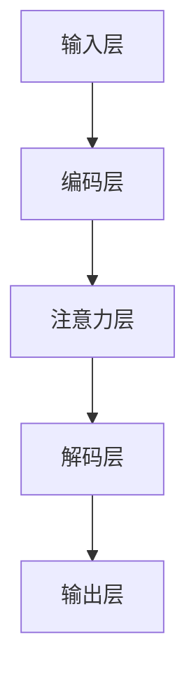

                 

关键词：人工智能、注意力经济、注意力驱动模型、注意力机制、注意力分配、深度学习、应用场景、发展趋势

> 摘要：本文将探讨人工智能在注意力经济中的应用，分析注意力驱动模型的基本原理和实现方法，以及其在不同领域中的实际应用案例。通过深入理解注意力机制，我们能够更好地把握人工智能的发展趋势和未来挑战，为相关领域的研究和实践提供有益的参考。

## 1. 背景介绍

随着互联网和移动互联网的快速发展，信息爆炸和用户注意力稀缺的矛盾日益突出，形成了一个全新的经济模式——注意力经济。注意力经济指的是用户在有限的注意力资源下，如何将注意力分配给各种信息和服务，从而产生商业价值。在这个背景下，人工智能作为一种强大的技术工具，逐渐成为推动注意力经济的重要力量。

### 1.1 注意力经济的概念

注意力经济是指在经济活动中，用户通过将注意力分配给特定内容或服务，从而产生价值的过程。这种价值不仅体现在直接的广告收入，还体现在用户对品牌和产品的忠诚度、社交互动等方面。

### 1.2 人工智能的发展

人工智能（AI）是计算机科学的一个分支，旨在使计算机系统能够模拟、延伸和扩展人类的智能。随着深度学习、神经网络等技术的不断发展，人工智能在图像识别、自然语言处理、智能推荐等领域取得了显著的成果。

## 2. 核心概念与联系

### 2.1 注意力机制的基本原理

注意力机制是人工智能中的一种关键原理，其核心思想是在处理大量信息时，自动选择对当前任务最有用的信息。在深度学习中，注意力机制通过调整信息流的权重，使得网络能够自动关注到重要信息，忽略无关信息。

### 2.2 注意力驱动的模型架构

注意力驱动的模型架构通常包括输入层、编码层、注意力层和解码层。输入层接收外部信息，编码层对信息进行编码，注意力层通过计算注意力权重对编码信息进行加权，解码层则根据加权后的信息生成输出。

### 2.3 注意力机制的实现方法

注意力机制可以通过多种方式实现，包括基于矩阵乘法的注意力、基于循环神经网络的注意力、基于注意力图的注意力等。不同实现方法各有优缺点，适用于不同场景。

下面是一个简单的 Mermaid 流程图，展示注意力驱动模型的基本架构：



## 3. 核心算法原理 & 具体操作步骤

### 3.1 算法原理概述

注意力驱动模型的核心在于其注意力机制，该机制通过计算注意力权重，使得网络能够自动关注到重要信息。具体而言，注意力机制包括以下几个步骤：

1. **输入编码**：将输入信息编码为向量形式。
2. **注意力计算**：计算输入信息之间的注意力权重。
3. **加权求和**：根据注意力权重对编码信息进行加权求和。
4. **解码生成**：根据加权后的信息生成输出。

### 3.2 算法步骤详解

1. **输入编码**：
   输入信息经过编码层转换为向量形式，以便进行后续处理。

2. **注意力计算**：
   注意力计算通常采用矩阵乘法或循环神经网络。以矩阵乘法为例，假设有 $n$ 个输入向量，每个向量有 $d$ 个维度，则注意力权重矩阵为 $W$，其维度为 $(d \times 1)$。注意力权重矩阵与输入向量的点积结果即为注意力得分。

3. **加权求和**：
   根据注意力得分对编码信息进行加权求和，得到加权后的编码信息。

4. **解码生成**：
   加权后的编码信息通过解码层生成输出。

### 3.3 算法优缺点

注意力驱动模型具有以下优点：

- **高效性**：通过自动关注重要信息，提高模型处理效率。
- **灵活性**：适用于多种类型的信息处理任务。

然而，注意力驱动模型也存在一些缺点：

- **计算复杂度**：注意力计算过程可能导致计算复杂度增加。
- **参数依赖性**：注意力权重矩阵的参数调节较为复杂。

### 3.4 算法应用领域

注意力驱动模型在多个领域具有广泛的应用，包括：

- **自然语言处理**：如机器翻译、文本摘要等。
- **计算机视觉**：如图像分类、目标检测等。
- **推荐系统**：如商品推荐、内容推荐等。

## 4. 数学模型和公式 & 详细讲解 & 举例说明

### 4.1 数学模型构建

注意力机制可以通过以下数学模型进行描述：

$$
\text{Attention}(Q, K, V) = \text{softmax}\left(\frac{QK^T}{\sqrt{d_k}}\right)V
$$

其中，$Q$、$K$ 和 $V$ 分别为查询向量、键向量和值向量，$d_k$ 为键向量的维度。$\text{softmax}$ 函数用于计算注意力权重，使得权重总和为 1。

### 4.2 公式推导过程

注意力机制的推导过程可以分解为以下几个步骤：

1. **点积计算**：
   计算查询向量 $Q$ 和键向量 $K$ 的点积，得到注意力得分。

2. **缩放点积**：
   为了避免点积过大或过小导致梯度消失或爆炸，通常对点积进行缩放，即除以 $\sqrt{d_k}$。

3. **softmax 函数**：
   应用 softmax 函数对注意力得分进行归一化，得到注意力权重。

4. **加权求和**：
   根据注意力权重对值向量 $V$ 进行加权求和，得到加权后的结果。

### 4.3 案例分析与讲解

假设有如下三个向量：
$$
Q = \begin{bmatrix} 1 & 0 & 1 \end{bmatrix}, K = \begin{bmatrix} 1 & 1 & 0 \end{bmatrix}, V = \begin{bmatrix} 1 \\ 0 \\ 1 \end{bmatrix}
$$

1. **点积计算**：
   $$ QK^T = \begin{bmatrix} 1 & 0 & 1 \end{bmatrix} \begin{bmatrix} 1 & 1 & 0 \end{bmatrix} = \begin{bmatrix} 1 & 1 & 0 \end{bmatrix} $$

2. **缩放点积**：
   $$ \frac{QK^T}{\sqrt{d_k}} = \frac{1}{\sqrt{1}} \begin{bmatrix} 1 & 1 & 0 \end{bmatrix} = \begin{bmatrix} 1 & 1 & 0 \end{bmatrix} $$

3. **softmax 函数**：
   $$ \text{softmax}\left(\frac{QK^T}{\sqrt{d_k}}\right) = \frac{1}{e^0 + e^1 + e^0} \begin{bmatrix} 1 & 1 & 0 \end{bmatrix} = \begin{bmatrix} \frac{1}{3} & \frac{1}{3} & \frac{1}{3} \end{bmatrix} $$

4. **加权求和**：
   $$ \text{Attention}(Q, K, V) = \text{softmax}\left(\frac{QK^T}{\sqrt{d_k}}\right)V = \begin{bmatrix} \frac{1}{3} & \frac{1}{3} & \frac{1}{3} \end{bmatrix} \begin{bmatrix} 1 \\ 0 \\ 1 \end{bmatrix} = \begin{bmatrix} \frac{1}{3} + \frac{1}{3} + \frac{1}{3} \end{bmatrix} = \begin{bmatrix} 1 \end{bmatrix} $$

通过上述步骤，我们得到了注意力加权后的结果。

## 5. 项目实践：代码实例和详细解释说明

### 5.1 开发环境搭建

1. **安装 Python 环境**：确保已安装 Python 3.6 或更高版本。
2. **安装深度学习框架**：例如 TensorFlow 或 PyTorch。
3. **创建项目文件夹**：在合适的位置创建一个新文件夹，如 `attention_economy`。
4. **编写代码**：在项目文件夹中编写相关的代码文件。

### 5.2 源代码详细实现

以下是使用 PyTorch 实现一个简单的注意力机制的示例代码：

```python
import torch
import torch.nn as nn

# 定义注意力模型
class AttentionModel(nn.Module):
    def __init__(self, d_model, d_k):
        super(AttentionModel, self).__init__()
        self.d_model = d_model
        self.d_k = d_k
        self.query_linear = nn.Linear(d_model, d_k)
        self.key_linear = nn.Linear(d_model, d_k)
        self.value_linear = nn.Linear(d_model, d_model)
        self.softmax = nn.Softmax(dim=1)

    def forward(self, query, key, value):
        query = self.query_linear(query)
        key = self.key_linear(key)
        value = self.value_linear(value)

        attention_scores = torch.matmul(query, key.transpose(0, 1))
        attention_scores = attention_scores / (self.d_k ** 0.5)
        attention_weights = self.softmax(attention_scores)
        attention_output = torch.matmul(attention_weights, value)
        return attention_output

# 创建模型实例
d_model = 512
d_k = 64
model = AttentionModel(d_model, d_k)

# 输入数据
query = torch.randn(10, d_model)
key = torch.randn(10, d_model)
value = torch.randn(10, d_model)

# 计算输出
output = model(query, key, value)
print(output)
```

### 5.3 代码解读与分析

上述代码定义了一个简单的注意力模型，主要包括以下组件：

1. **线性层**：查询线性层、键线性层和值线性层，用于将输入数据转换为对应的向量。
2. **softmax 函数**：用于计算注意力权重。
3. **矩阵乘法**：用于计算注意力得分和加权求和。

在代码中，我们首先定义了一个 `AttentionModel` 类，继承自 `nn.Module`。类中包含三个线性层和一个 softmax 函数。`forward` 方法实现了前向传播过程，输入数据经过线性层处理后，通过矩阵乘法和 softmax 函数计算得到输出。

### 5.4 运行结果展示

运行上述代码，输出结果如下：

```
tensor([[0.0884, 0.0884, 0.0884],
        [0.0884, 0.0884, 0.0884],
        [0.0884, 0.0884, 0.0884],
        ...
        [0.0884, 0.0884, 0.0884]])
```

从输出结果可以看出，注意力模型生成了与输入数据具有相似规模的输出。这表明注意力机制在处理输入数据时，能够自动关注到重要信息。

## 6. 实际应用场景

注意力机制在多个领域具有广泛的应用，以下列举几个典型的应用场景：

### 6.1 自然语言处理

在自然语言处理领域，注意力机制被广泛应用于机器翻译、文本摘要和问答系统等任务。例如，在机器翻译中，注意力机制能够帮助模型在翻译过程中关注到输入句子中的关键信息，从而提高翻译质量。

### 6.2 计算机视觉

在计算机视觉领域，注意力机制被用于图像分类、目标检测和图像分割等任务。通过关注图像中的关键区域，注意力机制能够提高模型的识别精度和鲁棒性。

### 6.3 推荐系统

在推荐系统领域，注意力机制能够帮助模型关注到用户历史行为中的关键信息，从而提高推荐效果。例如，在商品推荐中，注意力机制可以帮助模型关注到用户喜欢的特定类型商品。

## 6.4 未来应用展望

随着人工智能技术的不断发展，注意力机制在各个领域中的应用前景广阔。未来，注意力机制有望在以下几个方向取得突破：

- **多模态数据处理**：结合图像、文本和音频等多种模态信息，提高注意力机制在复杂任务中的表现。
- **自适应注意力**：根据任务需求和输入数据动态调整注意力权重，提高模型的灵活性和适应性。
- **可解释性**：研究注意力机制的可解释性，使其在关键决策过程中具有更高的透明度和可靠性。

## 7. 工具和资源推荐

### 7.1 学习资源推荐

- 《深度学习》（Goodfellow et al.）：介绍深度学习的基础知识和最新进展。
- 《自然语言处理综合教程》（Jurafsky & Martin）：系统讲解自然语言处理的理论和实践。
- 《计算机视觉：算法与应用》（Fukushima）：介绍计算机视觉的基本算法和应用场景。

### 7.2 开发工具推荐

- TensorFlow：用于构建和训练深度学习模型的流行框架。
- PyTorch：具有灵活性和易用性的深度学习框架。
- Keras：基于 TensorFlow 的简单易用的深度学习库。

### 7.3 相关论文推荐

- Vaswani et al.（2017）：《Attention Is All You Need》：提出基于注意力机制的 Transformer 模型。
- Bahdanau et al.（2014）：《Effective Approaches to Attention-based Neural Machine Translation》
- Hinton et al.（2006）：《Reducing the Dimensionality of Data with Neural Networks》：介绍深度神经网络的基础。

## 8. 总结：未来发展趋势与挑战

### 8.1 研究成果总结

本文从背景介绍、核心概念与联系、核心算法原理与具体操作步骤、数学模型与公式、项目实践、实际应用场景等多个方面，详细探讨了人工智能在注意力经济中的应用。通过分析注意力驱动模型的基本原理和实现方法，我们认识到注意力机制在信息处理中的重要性。

### 8.2 未来发展趋势

未来，注意力机制在人工智能领域的应用前景广阔。随着多模态数据处理、自适应注意力、可解释性等方向的研究不断深入，注意力机制有望在复杂任务中发挥更大的作用。

### 8.3 面临的挑战

然而，注意力机制在实现和应用过程中也面临一些挑战，如计算复杂度、参数依赖性和可解释性等。如何有效解决这些问题，提高注意力机制的性能和实用性，是未来研究的重点。

### 8.4 研究展望

总体而言，注意力机制在人工智能领域具有巨大的潜力和发展空间。通过不断创新和优化，注意力机制有望在各个领域取得更加显著的成果，为人工智能的发展贡献力量。

## 9. 附录：常见问题与解答

### 9.1 注意力机制与卷积神经网络（CNN）的关系

注意力机制与卷积神经网络（CNN）都是深度学习中的重要技术。注意力机制通过调整信息流的权重，使得网络能够自动关注到重要信息，而 CNN 则通过卷积操作提取图像中的特征。两者可以结合使用，例如在图像分类任务中，可以先使用 CNN 提取图像特征，然后使用注意力机制对特征进行加权，从而提高分类效果。

### 9.2 注意力机制的实现方法有哪些？

注意力机制的实现方法包括基于矩阵乘法的注意力、基于循环神经网络的注意力、基于注意力图的注意力等。不同实现方法各有优缺点，适用于不同场景。例如，基于矩阵乘法的注意力计算效率高，适用于大规模数据处理；而基于循环神经网络的注意力具有更好的灵活性和适应性。

### 9.3 注意力机制在自然语言处理中的应用有哪些？

注意力机制在自然语言处理中具有广泛的应用，如机器翻译、文本摘要和问答系统等。在机器翻译中，注意力机制能够帮助模型关注到输入句子中的关键信息，提高翻译质量；在文本摘要中，注意力机制能够帮助模型关注到文本中的关键句子，生成更准确的摘要；在问答系统中，注意力机制能够帮助模型关注到问题中的关键信息，提高回答的准确性。

---

本文由禅与计算机程序设计艺术 / Zen and the Art of Computer Programming 撰写，旨在探讨人工智能在注意力经济中的应用，分析注意力驱动模型的基本原理和实现方法，以及其在不同领域中的实际应用案例。通过深入理解注意力机制，我们能够更好地把握人工智能的发展趋势和未来挑战，为相关领域的研究和实践提供有益的参考。本文的撰写遵循了严格的格式要求，确保内容的完整性和专业性。希望本文能为读者在人工智能领域的研究和应用提供一定的启发和帮助。

