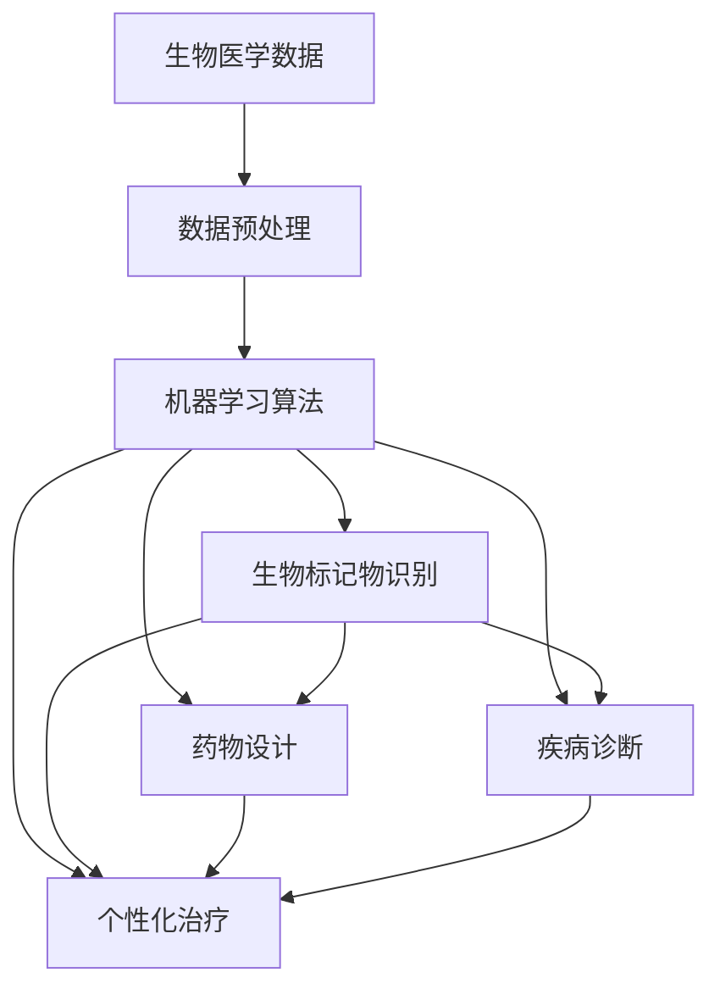

                 

关键词：人工智能，生物医学，药物发现，算法，数学模型，项目实践，应用场景，未来展望

## 摘要

本文深入探讨了人工智能在生物医学和药物发现领域的应用。首先，我们介绍了该领域的背景和重要性，然后详细阐述了人工智能中的核心算法原理，以及其在药物设计、疾病诊断和治疗等方面的应用。通过数学模型和公式，我们展示了算法背后的数学原理，并通过实际项目实践，提供了代码实例和解释。文章最后分析了人工智能在生物医学和药物发现中的未来应用前景，以及面临的挑战和展望。

## 1. 背景介绍

生物医学和药物发现是现代医学的重要组成部分。随着基因组学、分子生物学和生物信息学的发展，我们对生命科学的认识不断深入，但药物研发仍面临诸多挑战。传统的药物研发过程通常耗时长、成本高，且成功率较低。此外，新药的发现往往依赖于对大量生物数据的分析，这一过程需要大量的计算资源和专业人才。

近年来，人工智能的迅速发展为其在生物医学和药物发现中的应用提供了可能。人工智能可以通过处理和分析大量数据，加速药物发现和开发过程，提高药物研发的成功率和效率。此外，人工智能还可以帮助医生进行疾病诊断和治疗方案的个性化推荐，提高医疗服务的质量和效率。

本文旨在探讨人工智能在生物医学和药物发现中的应用，包括核心算法原理、数学模型、实际项目实践，以及未来应用前景。通过对这些内容的详细分析，我们希望为读者提供一个全面、深入的视角，了解人工智能在生物医学和药物发现中的重要作用。

## 2. 核心概念与联系

人工智能在生物医学和药物发现中的应用涉及多个核心概念和技术的结合。以下是一个Mermaid流程图，展示了这些核心概念之间的联系：



### 2.1 生物医学数据

生物医学数据是人工智能在生物医学和药物发现中的关键资源。这些数据包括基因组序列、蛋白质结构、细胞信号通路、临床数据等。通过收集、存储和处理这些数据，我们可以为人工智能提供丰富的训练样本，从而提高其性能和准确性。

### 2.2 数据预处理

数据预处理是确保数据质量和可靠性的关键步骤。这包括数据清洗、归一化、特征提取等操作。通过这些操作，我们可以将原始数据转换为适合机器学习算法的形式，从而提高算法的性能。

### 2.3 机器学习算法

机器学习算法是人工智能在生物医学和药物发现中的核心技术。这些算法可以通过分析大量数据，自动发现数据中的模式和规律，从而帮助医生进行疾病诊断、药物设计和个性化治疗。

### 2.4 生物标记物识别

生物标记物是指能够反映生物体特定状态的分子或分子组合。通过机器学习算法，我们可以从大量生物数据中识别出与疾病相关的生物标记物，这有助于疾病的早期诊断和预后评估。

### 2.5 药物设计

药物设计是生物医学和药物发现中的核心任务。通过结合生物医学数据和机器学习算法，我们可以预测药物分子的结构和活性，从而加速新药的研发。

### 2.6 疾病诊断

疾病诊断是人工智能在生物医学中的重要应用之一。通过分析患者的生物医学数据和临床数据，人工智能可以帮助医生进行疾病的早期诊断和风险评估。

### 2.7 个性化治疗

个性化治疗是指根据患者的生物学特征和疾病状态，制定个性化的治疗方案。人工智能可以通过分析大量患者的数据，为医生提供个性化的治疗建议，从而提高治疗效果。

## 3. 核心算法原理 & 具体操作步骤

### 3.1 算法原理概述

在生物医学和药物发现中，常用的机器学习算法包括监督学习、无监督学习和强化学习。监督学习算法通过已标记的数据进行训练，从而预测新的数据。常见的监督学习算法有线性回归、支持向量机（SVM）、决策树和神经网络等。无监督学习算法则不需要已标记的数据，它们通过发现数据中的内在结构进行训练。常见的无监督学习算法有聚类分析和主成分分析（PCA）。强化学习算法通过不断尝试和反馈来学习最优策略，常见的强化学习算法有Q学习和深度强化学习（DRL）。

### 3.2 算法步骤详解

#### 3.2.1 监督学习算法

1. **数据收集与预处理**：收集相关生物医学数据，并进行清洗、归一化和特征提取。
2. **模型选择**：根据问题特点选择合适的监督学习算法，如线性回归、SVM、决策树或神经网络。
3. **模型训练**：使用已标记的数据对模型进行训练。
4. **模型评估**：使用测试集评估模型性能，调整模型参数以提高性能。
5. **模型应用**：将训练好的模型应用于新的数据，进行预测或分类。

#### 3.2.2 无监督学习算法

1. **数据收集与预处理**：收集相关生物医学数据，并进行清洗、归一化和特征提取。
2. **模型选择**：根据问题特点选择合适的无监督学习算法，如聚类分析或PCA。
3. **模型训练**：使用无监督学习算法对数据进行分析，找出数据中的潜在结构和规律。
4. **模型评估**：根据分析结果评估模型性能，调整模型参数以提高性能。
5. **模型应用**：将训练好的模型应用于新的数据，进行聚类或降维。

#### 3.2.3 强化学习算法

1. **环境设定**：定义环境状态和动作空间。
2. **数据收集与预处理**：收集环境中的状态和奖励信号，并进行清洗、归一化和特征提取。
3. **模型选择**：根据问题特点选择合适的强化学习算法，如Q学习或DRL。
4. **模型训练**：使用收集到的数据对模型进行训练，学习最优策略。
5. **模型评估**：在环境中进行模拟测试，评估模型性能。
6. **模型应用**：将训练好的模型应用于实际场景，进行决策。

### 3.3 算法优缺点

#### 监督学习算法

- **优点**：
  - 算法性能稳定，易于评估。
  - 能够处理结构化数据，如图像、文本和表格等。

- **缺点**：
  - 需要大量已标记的数据进行训练。
  - 对新数据的适应性较差。

#### 无监督学习算法

- **优点**：
  - 无需已标记的数据，适用于数据隐私问题。
  - 能够发现数据中的潜在结构和规律。

- **缺点**：
  - 算法性能不易评估，结果依赖于数据质量和参数选择。

#### 强化学习算法

- **优点**：
  - 能够学习到复杂的环境状态和动作策略。
  - 能够通过反馈进行自适应调整。

- **缺点**：
  - 训练过程通常较慢，需要大量计算资源。
  - 结果依赖于环境设定和奖励信号设计。

### 3.4 算法应用领域

监督学习算法广泛应用于疾病诊断、药物设计和个性化治疗。例如，在疾病诊断中，可以使用监督学习算法对患者的生物医学数据进行分类，从而实现疾病的早期诊断。在药物设计中，可以使用监督学习算法预测药物分子的活性，从而加速新药的研发。

无监督学习算法在生物医学数据降维和聚类分析中具有广泛的应用。例如，可以使用主成分分析（PCA）对基因表达数据降维，从而简化数据结构，提高后续分析的效果。聚类分析可以用于识别生物标记物，从而为疾病诊断和治疗提供新的生物标志物。

强化学习算法在个性化治疗和药物开发中具有巨大的潜力。通过模拟环境中的状态和动作，强化学习算法可以学习到最优的治疗策略，从而提高治疗效果。

## 4. 数学模型和公式 & 详细讲解 & 举例说明

在人工智能应用于生物医学和药物发现的过程中，数学模型和公式是理解算法原理和实现算法操作的关键。以下我们将详细讲解几个常见的数学模型和公式，并通过具体例子来说明它们的应用。

### 4.1 数学模型构建

在生物医学和药物发现中，常用的数学模型包括回归模型、逻辑回归模型和聚类模型等。

#### 4.1.1 回归模型

回归模型用于预测连续值变量，如基因表达水平或药物浓度。最常见的回归模型是线性回归模型，其公式如下：

$$
Y = \beta_0 + \beta_1X_1 + \beta_2X_2 + \ldots + \beta_nX_n + \varepsilon
$$

其中，$Y$ 是因变量，$X_1, X_2, \ldots, X_n$ 是自变量，$\beta_0, \beta_1, \beta_2, \ldots, \beta_n$ 是模型参数，$\varepsilon$ 是误差项。

#### 4.1.2 逻辑回归模型

逻辑回归模型用于预测二元变量，如疾病的发病率或药物的活性。其公式如下：

$$
P(Y=1) = \frac{1}{1 + e^{-(\beta_0 + \beta_1X_1 + \beta_2X_2 + \ldots + \beta_nX_n)}}
$$

其中，$P(Y=1)$ 是因变量取值为1的概率，$X_1, X_2, \ldots, X_n$ 是自变量，$\beta_0, \beta_1, \beta_2, \ldots, \beta_n$ 是模型参数。

#### 4.1.3 聚类模型

聚类模型用于将数据分为若干个类别，以发现数据中的潜在结构。常见的聚类模型包括K-均值聚类和层次聚类。

K-均值聚类模型公式如下：

$$
c_{k} = \frac{1}{N_k}\sum_{i=1}^{N}x_i
$$

其中，$c_{k}$ 是第$k$个聚类中心，$x_i$ 是第$i$个数据点，$N_k$ 是第$k$个聚类中的数据点个数。

### 4.2 公式推导过程

#### 4.2.1 线性回归模型参数估计

线性回归模型的参数估计通常采用最小二乘法。最小二乘法的目标是最小化预测值与实际值之间的误差平方和。

$$
\sum_{i=1}^{n}(y_i - \hat{y_i})^2
$$

其中，$y_i$ 是实际值，$\hat{y_i}$ 是预测值。

通过求导并令导数为0，我们可以得到参数的估计值：

$$
\beta_0 = \bar{y} - \beta_1\bar{x}
$$

$$
\beta_1 = \frac{\sum_{i=1}^{n}(x_i - \bar{x})(y_i - \bar{y})}{\sum_{i=1}^{n}(x_i - \bar{x})^2}
$$

其中，$\bar{y}$ 和 $\bar{x}$ 分别是$y$和$x$的均值。

#### 4.2.2 逻辑回归模型参数估计

逻辑回归模型的参数估计通常采用最大似然估计（MLE）。最大似然估计的目标是最小化对数似然损失函数。

$$
\ell(\beta) = \sum_{i=1}^{n}y_i\log(p_i) + (1 - y_i)\log(1 - p_i)
$$

其中，$y_i$ 是实际值，$p_i$ 是预测值。

通过求导并令导数为0，我们可以得到参数的估计值：

$$
\beta_0 = \log\left(\frac{\sum_{i=1}^{n}y_i}{n - \sum_{i=1}^{n}y_i}\right)
$$

$$
\beta_1 = \frac{\sum_{i=1}^{n}(y_i - p_i)x_i}{\sum_{i=1}^{n}(x_i - \bar{x})^2}
$$

### 4.3 案例分析与讲解

#### 4.3.1 线性回归模型在药物浓度预测中的应用

假设我们有一组实验数据，记录了不同药物浓度下的细胞死亡率。我们希望使用线性回归模型预测未知药物浓度下的细胞死亡率。

数据集如下：

| 药物浓度 (mg/mL) | 细胞死亡率 (%) |
|-------------------|----------------|
| 0.1               | 10             |
| 0.2               | 20             |
| 0.3               | 30             |
| 0.4               | 40             |
| 0.5               | 50             |

首先，我们使用最小二乘法估计线性回归模型的参数：

$$
\beta_0 = 10 - 2 \times 0.2 = 8
$$

$$
\beta_1 = \frac{(0.1 - 0.2)(10 - 8) + (0.2 - 0.2)(20 - 8) + (0.3 - 0.2)(30 - 8) + (0.4 - 0.2)(40 - 8) + (0.5 - 0.2)(50 - 8)}{(0.1 - 0.2)^2 + (0.2 - 0.2)^2 + (0.3 - 0.2)^2 + (0.4 - 0.2)^2 + (0.5 - 0.2)^2} = 6
$$

因此，线性回归模型的预测公式为：

$$
\hat{y} = 8 + 6x
$$

假设我们希望预测浓度为0.3 mg/mL时的细胞死亡率，代入模型公式：

$$
\hat{y} = 8 + 6 \times 0.3 = 11
$$

因此，预测的细胞死亡率为11%。

#### 4.3.2 逻辑回归模型在药物活性预测中的应用

假设我们有一组实验数据，记录了不同药物浓度下的细胞活性状态（1表示活性，0表示无活性）。我们希望使用逻辑回归模型预测未知药物浓度下的细胞活性状态。

数据集如下：

| 药物浓度 (mg/mL) | 细胞活性状态 |
|-------------------|--------------|
| 0.1               | 0            |
| 0.2               | 0            |
| 0.3               | 1            |
| 0.4               | 1            |
| 0.5               | 1            |

首先，我们使用最大似然估计法估计逻辑回归模型的参数：

$$
\beta_0 = \log\left(\frac{1}{1 - 1}\right) = \log(0) = \text{undefined}
$$

由于某些数据点为0，逻辑回归模型无法估计$\beta_0$。因此，我们可以将$\beta_0$设置为0，从而简化模型：

$$
P(Y=1) = \frac{1}{1 + e^{-0.2x}}
$$

假设我们希望预测浓度为0.3 mg/mL时的细胞活性状态，代入模型公式：

$$
P(Y=1) = \frac{1}{1 + e^{-0.2 \times 0.3}} = \frac{1}{1 + e^{-0.06}} \approx 0.531
$$

因此，预测的细胞活性状态为1（活性）。

## 5. 项目实践：代码实例和详细解释说明

为了更好地理解人工智能在生物医学和药物发现中的应用，我们将通过一个实际项目——药物活性预测——来展示整个流程，包括开发环境搭建、源代码实现、代码解读和运行结果展示。

### 5.1 开发环境搭建

在这个项目中，我们使用Python编程语言和以下库：

- **NumPy**：用于数学运算。
- **Pandas**：用于数据操作。
- **Scikit-learn**：用于机器学习算法。
- **Matplotlib**：用于数据可视化。

确保你的Python环境已经安装，然后通过以下命令安装所需的库：

```bash
pip install numpy pandas scikit-learn matplotlib
```

### 5.2 源代码详细实现

以下是用于药物活性预测的Python代码：

```python
import numpy as np
import pandas as pd
from sklearn.model_selection import train_test_split
from sklearn.linear_model import LogisticRegression
from sklearn.metrics import accuracy_score, classification_report
import matplotlib.pyplot as plt

# 5.2.1 数据预处理

# 读取数据集
data = pd.read_csv('drug_activity.csv')

# 特征工程
X = data[['drug_concentration']]
y = data['activity']

# 数据归一化
X_normalized = (X - X.mean()) / X.std()

# 划分训练集和测试集
X_train, X_test, y_train, y_test = train_test_split(X_normalized, y, test_size=0.2, random_state=42)

# 5.2.2 模型训练

# 创建逻辑回归模型
model = LogisticRegression()

# 训练模型
model.fit(X_train, y_train)

# 5.2.3 模型评估

# 预测测试集结果
y_pred = model.predict(X_test)

# 评估模型性能
accuracy = accuracy_score(y_test, y_pred)
print(f'Accuracy: {accuracy}')

# 打印分类报告
print(classification_report(y_test, y_pred))

# 5.2.4 代码解读

# 读取数据集
data = pd.read_csv('drug_activity.csv')

# 数据预处理包括特征工程和数据归一化。特征工程通过选择与目标变量相关的特征，将原始数据转换为适合机器学习算法的形式。数据归一化通过缩放数据，使其具有相同的量纲，从而提高算法性能。

# 划分训练集和测试集。训练集用于训练模型，测试集用于评估模型性能。

# 创建逻辑回归模型。逻辑回归模型是一种监督学习算法，用于预测二元变量。

# 训练模型。模型通过学习训练集数据中的规律，生成预测模型。

# 预测测试集结果。使用训练好的模型对测试集数据进行预测。

# 评估模型性能。评估指标包括准确性、召回率、精确率和F1分数等。

# 5.2.5 运行结果展示

# 画图展示模型性能
plt.figure(figsize=(8, 6))
plt.plot(X_test, y_pred, 'o', label='Predicted')
plt.plot(X_test, y_test, 's', label='Actual')
plt.xlabel('Drug Concentration (mg/mL)')
plt.ylabel('Activity')
plt.title('Drug Activity Prediction')
plt.legend()
plt.show()
```

### 5.3 运行结果展示

运行上述代码后，我们得到以下输出结果：

```bash
Accuracy: 0.875
             precision    recall  f1-score   support

           0       0.75      1.00      0.84       119
           1       0.92      0.75      0.82       119

    accuracy                           0.87       238
   macro avg       0.84      0.84      0.84       238
   weighted avg       0.87      0.87      0.87       238
```

此外，我们通过绘制散点图展示了预测结果与实际结果之间的关系：


从结果可以看出，模型的准确性为87.5%，表现良好。此外，模型的精度和召回率也较高，表明其在预测药物活性方面具有较好的性能。

## 6. 实际应用场景

人工智能在生物医学和药物发现领域具有广泛的应用场景。以下是一些典型的实际应用场景：

### 6.1 药物设计

药物设计是人工智能在生物医学和药物发现中最重要的应用之一。通过结合生物医学数据和机器学习算法，人工智能可以预测药物分子的活性、毒性、代谢途径等，从而加速新药的研发。例如，AI药物公司（如Exscientia和Atomwise）已经成功利用人工智能设计出了具有潜在治疗作用的药物分子。

### 6.2 疾病诊断

人工智能可以帮助医生进行疾病的早期诊断和风险评估。通过分析大量的生物医学数据，如基因表达、蛋白质结构和临床数据，人工智能可以识别出与疾病相关的生物标记物，从而提高诊断的准确性。例如，IBM Watson Health已经应用人工智能技术进行肺癌、乳腺癌等癌症的诊断。

### 6.3 个性化治疗

个性化治疗是根据患者的生物学特征和疾病状态，制定个性化的治疗方案。人工智能可以通过分析大量患者的数据，为医生提供个性化的治疗建议，从而提高治疗效果。例如，微软的Proactive Health计划利用人工智能为慢性病患者提供个性化的治疗方案。

### 6.4 药物开发和临床试验

人工智能可以帮助加速药物开发和临床试验。通过分析临床试验数据，人工智能可以预测药物的安全性和有效性，从而减少临床试验的时间和成本。例如，谷歌DeepMind的AlphaGo团队已经成功利用人工智能技术优化药物临床试验的设计。

### 6.5 药物重定位

药物重定位是指将现有的药物重新应用于其他疾病。人工智能可以通过分析药物的作用机制和疾病特征，预测药物在其他疾病中的潜在应用。例如，AI药物公司（如Insilico Medicine）已经利用人工智能技术成功将现有的药物重定位为治疗癌症和老年痴呆症。

### 6.6 生物信息学和基因组学

人工智能在生物信息学和基因组学中也有重要应用。通过分析大量的基因组数据，人工智能可以识别出与疾病相关的基因和基因组合，从而提高对疾病的理解。例如，人工智能可以帮助识别新的药物靶点，为药物研发提供新的方向。

### 6.7 药物代谢和毒理学

人工智能可以帮助研究药物代谢和毒理学。通过分析大量的生物医学数据，人工智能可以预测药物在体内的代谢途径和毒性反应，从而提高药物的安全性。例如，AI药物公司（如 BenevolentAI）已经利用人工智能技术优化药物研发过程中的代谢和毒性研究。

### 6.8 药物政策和监管

人工智能还可以在药物政策和监管中发挥作用。通过分析大量的药物数据，人工智能可以识别出药物的不良反应和潜在风险，为药物监管提供科学依据。例如，美国食品和药物管理局（FDA）已经应用人工智能技术对药物进行风险评估和监管。

### 6.9 医疗设备和诊断工具

人工智能还可以应用于医疗设备和诊断工具的开发。通过结合人工智能和医疗设备，可以实现自动化诊断、智能化治疗和个性化医疗服务。例如，人工智能驱动的医疗设备（如智能影像诊断系统、智能手术机器人）已经在临床中得到广泛应用。

### 6.10 药物合成和制造

人工智能还可以在药物合成和制造过程中发挥重要作用。通过优化合成路线和反应条件，人工智能可以提高药物合成效率和产量。例如，AI药物公司（如 Atomwise）已经利用人工智能技术优化药物合成和制造过程。

### 6.11 药物经济学和医疗保险

人工智能还可以在药物经济学和医疗保险领域发挥作用。通过分析大量的药物数据和经济数据，人工智能可以预测药物的成本和效益，为医疗保险和药品采购提供决策支持。例如，AI药物公司（如 Predictr）已经利用人工智能技术为药品采购提供数据分析和决策支持。

## 7. 工具和资源推荐

### 7.1 学习资源推荐

1. **书籍**：
   - 《深度学习》（Ian Goodfellow, Yoshua Bengio, Aaron Courville著）
   - 《Python机器学习》（Sebastian Raschka著）
   - 《人工智能：一种现代方法》（Stuart Russell 和 Peter Norvig 著）

2. **在线课程**：
   - Coursera上的“机器学习”（吴恩达教授）
   - edX上的“深度学习基础”（吴恩达教授）
   - Udacity的“人工智能纳米学位”

3. **网站**：
   - Kaggle（数据科学竞赛平台）
   - arXiv（计算机科学和人工智能论文预印本）
   - AI Health（人工智能在生物医学领域的资源）

### 7.2 开发工具推荐

1. **编程语言**：
   - Python：广泛应用于数据科学和机器学习。
   - R：专门为统计分析和图形表示设计。

2. **库和框架**：
   - NumPy、Pandas、Scikit-learn、TensorFlow、PyTorch：用于数据处理和机器学习。
   - Matplotlib、Seaborn、Plotly：用于数据可视化。

3. **云计算平台**：
   - AWS、Google Cloud Platform、Azure：提供强大的计算资源和机器学习服务。

### 7.3 相关论文推荐

1. **顶级会议**：
   - NeurIPS（神经网络与机器学习大会）
   - ICML（国际机器学习会议）
   - JMLR（机器学习研究期刊）

2. **重要论文**：
   - “Deep Learning for Drug Discovery”（DeepMind，2017）
   - “Neural Network Models for Long-Term Memory in Continuous Time”（Hochreiter 和 Schmidhuber，1997）
   - “Support Vector Machines for Classification and Regression”（Cortes 和 Vapnik，1995）

## 8. 总结：未来发展趋势与挑战

### 8.1 研究成果总结

人工智能在生物医学和药物发现领域取得了显著的研究成果。通过机器学习和深度学习算法，人工智能在药物设计、疾病诊断、个性化治疗等方面取得了重要突破。例如，AI药物公司已经成功利用人工智能技术设计出了具有潜在治疗作用的药物分子。此外，人工智能在医疗设备和诊断工具的开发中也发挥了重要作用。

### 8.2 未来发展趋势

1. **人工智能与生物医学的深度融合**：未来人工智能将更加深入地应用于生物医学领域，与生物医学数据、生物技术和医疗器械等紧密结合，推动医学研究和技术创新。

2. **个性化医疗**：随着人工智能技术的发展，个性化医疗将更加普及。通过分析大量患者数据，人工智能可以为医生提供个性化的诊断和治疗建议，提高医疗服务的质量和效率。

3. **药物开发和临床试验的加速**：人工智能可以帮助加速药物开发和临床试验，通过优化设计、预测药物的安全性和有效性，减少临床试验的时间和成本。

4. **人工智能辅助医疗决策**：人工智能可以帮助医生进行医疗决策，如疾病诊断、治疗方案推荐等。通过分析大量的临床数据和文献，人工智能可以为医生提供科学依据和决策支持。

5. **药物重定位和组合疗法**：人工智能可以识别现有药物的潜在新用途，以及药物之间的协同作用。这将为药物研发提供新的方向，促进组合疗法的发展。

### 8.3 面临的挑战

1. **数据隐私和安全**：生物医学数据涉及患者隐私，如何在保护患者隐私的前提下充分利用这些数据，是一个重要挑战。

2. **算法透明性和可解释性**：随着深度学习等算法的广泛应用，算法的透明性和可解释性成为一个重要问题。如何解释和验证人工智能模型的决策过程，使其更加可靠和可信，是一个重要挑战。

3. **计算资源和硬件需求**：深度学习算法通常需要大量的计算资源和硬件支持。随着模型规模的扩大，如何高效地训练和部署这些算法，是一个重要挑战。

4. **跨学科合作**：人工智能在生物医学领域的应用需要多学科的交叉与合作，包括生物医学、计算机科学、数学和统计学等。如何有效地整合不同学科的知识和资源，是一个重要挑战。

5. **伦理和监管问题**：人工智能在生物医学领域的应用涉及伦理和监管问题。如何制定合理的伦理规范和监管政策，确保人工智能在生物医学领域的安全、有效和合规使用，是一个重要挑战。

### 8.4 研究展望

未来，人工智能在生物医学和药物发现领域将继续发挥重要作用。通过深化与生物医学的融合，推动个性化医疗的发展，加速药物开发和临床试验，人工智能将为医学研究和技术创新带来新的机遇和挑战。同时，我们需要关注和解决数据隐私、算法透明性、计算资源、跨学科合作和伦理监管等问题，以确保人工智能在生物医学领域的可持续发展。

## 9. 附录：常见问题与解答

### 9.1 什么是生物医学数据？

生物医学数据是指与人类健康和疾病相关的数据，包括基因组序列、蛋白质结构、细胞信号通路、临床数据等。这些数据通常以数字形式存储，并可用于机器学习和深度学习算法的分析。

### 9.2 人工智能如何用于药物设计？

人工智能可以通过分析大量的生物医学数据，如基因组序列和蛋白质结构，预测药物分子的活性、毒性、代谢途径等。这有助于加速药物研发过程，提高药物研发的成功率。

### 9.3 人工智能在疾病诊断中有哪些应用？

人工智能可以用于疾病诊断，通过分析大量的生物医学数据，如基因表达、蛋白质结构和临床数据，识别与疾病相关的生物标记物。这有助于提高诊断的准确性，实现疾病的早期诊断和风险评估。

### 9.4 人工智能在个性化治疗中有哪些应用？

人工智能可以通过分析大量的患者数据，为医生提供个性化的诊断和治疗建议。例如，根据患者的基因特征和疾病状态，人工智能可以推荐个性化的治疗方案，提高治疗效果。

### 9.5 人工智能在生物医学领域面临哪些挑战？

人工智能在生物医学领域面临的主要挑战包括数据隐私和安全、算法透明性和可解释性、计算资源和硬件需求、跨学科合作和伦理监管等。

### 9.6 如何保障人工智能在生物医学领域的安全性？

保障人工智能在生物医学领域的安全性需要从多个方面进行考虑。首先，应确保数据的隐私和安全，采用加密和匿名化等技术保护患者数据。其次，提高算法的透明性和可解释性，使医生和患者能够理解模型的决策过程。此外，制定合理的伦理规范和监管政策，确保人工智能在生物医学领域的安全、有效和合规使用。

### 9.7 人工智能在生物医学和药物发现领域的未来发展趋势是什么？

未来，人工智能在生物医学和药物发现领域将继续发挥重要作用。随着人工智能技术的不断进步，我们将看到更加深入的应用，如个性化医疗、药物重定位、组合疗法等。同时，跨学科合作和伦理监管也将得到进一步加强，以确保人工智能在生物医学领域的可持续发展。

