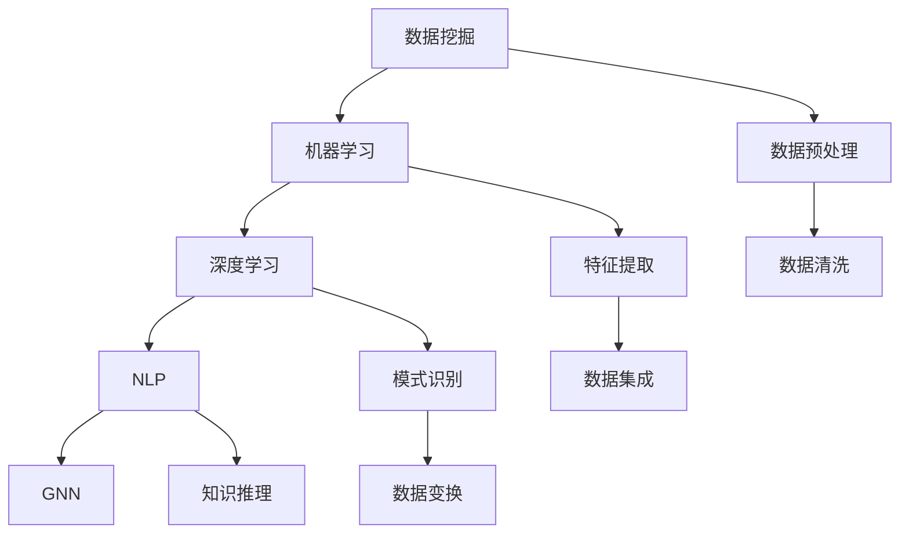

                 

 关键词：人工智能，知识发现，数据挖掘，机器学习，深度学习，自然语言处理，图神经网络

> 摘要：随着大数据和人工智能技术的快速发展，知识发现成为了解决复杂问题的重要手段。本文将深入探讨人工智能在知识发现中的应用，包括核心概念、算法原理、数学模型以及实际应用场景，并展望未来发展趋势与挑战。

## 1. 背景介绍

随着互联网的普及和数据量的爆发式增长，如何从海量数据中提取有价值的信息成为了一个关键问题。知识发现（Knowledge Discovery in Databases，KDD）是一种跨学科的研究领域，旨在从数据中发现有用的模式和知识。传统的知识发现过程主要依赖于统计学方法和规则系统，而随着人工智能技术的快速发展，特别是机器学习和深度学习技术的应用，知识发现的方法和效果得到了极大的提升。

人工智能在知识发现中的应用主要体现在以下几个方面：

1. **数据预处理**：利用自然语言处理（NLP）和计算机视觉（CV）等技术，对原始数据进行清洗、标注和转换，以提高数据的质量和可用性。
2. **特征提取**：通过特征工程和降维技术，将高维数据转换成更易于分析和建模的特征向量。
3. **模式识别**：利用分类、聚类、关联规则挖掘等方法，从数据中提取有意义的模式和规律。
4. **知识推理**：通过构建知识图谱和图神经网络（Graph Neural Networks，GNN），实现对复杂关系的深度挖掘和推理。

## 2. 核心概念与联系

### 2.1. 数据挖掘（Data Mining）

数据挖掘是从大量数据中自动发现规律、关联、模式、异常或其他有用信息的过程。它通常涉及以下步骤：

1. **数据清洗**：处理缺失值、噪声和异常值，确保数据质量。
2. **数据集成**：将来自多个源的数据合并为一个统一的数据集。
3. **数据变换**：将数据转换成适合挖掘的形式，如归一化、离散化等。
4. **模式识别**：使用各种算法，如分类、聚类、关联规则挖掘等，发现数据中的规律。

### 2.2. 机器学习（Machine Learning）

机器学习是人工智能的一个分支，旨在通过数据建立模型，并对未知数据进行预测或分类。机器学习方法主要包括监督学习、无监督学习和强化学习。

1. **监督学习**：通过已标记的数据训练模型，然后对未知数据进行预测。
2. **无监督学习**：没有预先标记的数据，模型自行发现数据中的结构和模式。
3. **强化学习**：通过与环境的交互，学习最优策略以最大化某个目标函数。

### 2.3. 深度学习（Deep Learning）

深度学习是机器学习的一个子领域，基于多层神经网络，能够自动学习数据的复杂特征和模式。深度学习在图像识别、自然语言处理、语音识别等领域取得了显著的成果。

1. **卷积神经网络（CNN）**：主要用于图像处理，通过卷积层提取图像特征。
2. **循环神经网络（RNN）**：适用于序列数据，能够处理时间序列和自然语言。
3. **生成对抗网络（GAN）**：通过生成器和判别器之间的对抗训练，生成逼真的数据。

### 2.4. 自然语言处理（Natural Language Processing，NLP）

自然语言处理是人工智能的重要分支，旨在使计算机能够理解和生成自然语言。NLP技术广泛应用于文本分类、情感分析、机器翻译等领域。

1. **词向量**：将单词转换为向量表示，用于文本表示和相似度计算。
2. **文本分类**：将文本数据分类到不同的类别，如垃圾邮件检测。
3. **情感分析**：分析文本中的情感倾向，如正面、负面或中性。

### 2.5. 图神经网络（Graph Neural Networks，GNN）

图神经网络是一种基于图结构数据的深度学习模型，能够有效地捕捉和处理图中的复杂关系。GNN广泛应用于社交网络分析、知识图谱、推荐系统等领域。

1. **图卷积网络（GCN）**：对图节点进行特征转换和关系建模。
2. **图注意力网络（GAT）**：通过注意力机制动态调整节点之间的权重。
3. **图生成模型（如GPT）**：生成图结构和节点属性。

下面是一个Mermaid流程图，展示了知识发现中的一些核心概念和联系：



## 3. 核心算法原理 & 具体操作步骤

### 3.1. 算法原理概述

知识发现中的核心算法主要包括数据挖掘算法、机器学习算法、深度学习算法等。每种算法都有其独特的原理和应用场景。

1. **数据挖掘算法**：如分类、聚类、关联规则挖掘等，主要用于发现数据中的模式和规律。
2. **机器学习算法**：如线性回归、决策树、支持向量机等，通过已标记的数据训练模型，进行预测或分类。
3. **深度学习算法**：如卷积神经网络（CNN）、循环神经网络（RNN）、生成对抗网络（GAN）等，通过多层神经网络自动学习数据的复杂特征和模式。

### 3.2. 算法步骤详解

1. **数据预处理**：包括数据清洗、数据集成、数据变换等步骤，确保数据质量和一致性。
2. **特征提取**：通过特征工程和降维技术，将高维数据转换成更易于分析和建模的特征向量。
3. **模型训练**：选择合适的算法，使用训练数据进行模型训练。
4. **模型评估**：使用验证数据集对模型进行评估，调整模型参数。
5. **模型部署**：将训练好的模型部署到实际应用场景中，进行预测或分类。

### 3.3. 算法优缺点

1. **数据挖掘算法**：优点是算法简单、易于实现，缺点是处理大规模数据时效果较差。
2. **机器学习算法**：优点是适用于各种类型的数据，缺点是模型复杂度较高，训练时间较长。
3. **深度学习算法**：优点是能够自动学习数据的复杂特征，缺点是需要大量数据和计算资源。

### 3.4. 算法应用领域

1. **金融行业**：用于风险控制、信用评估、投资策略等。
2. **医疗行业**：用于疾病预测、药物研发、诊断辅助等。
3. **零售行业**：用于商品推荐、客户细分、库存管理等。
4. **社交网络**：用于社交关系分析、用户行为预测等。

## 4. 数学模型和公式 & 详细讲解 & 举例说明

### 4.1. 数学模型构建

知识发现中的数学模型主要包括概率模型、线性模型、非线性模型等。以下是几个常见的数学模型及其公式：

1. **概率模型**：
   - 贝叶斯定理：$$P(A|B) = \frac{P(B|A)P(A)}{P(B)}$$
   - 朴素贝叶斯分类器：$$P(\text{class} = c|\textbf{x}) = \prod_{i=1}^{n} P(x_i|c) \cdot P(c)$$

2. **线性模型**：
   - 线性回归：$$y = \beta_0 + \beta_1x_1 + \beta_2x_2 + ... + \beta_nx_n$$
   - 逻辑回归：$$\log\frac{P(\text{class} = 1)}{1 - P(\text{class} = 1)} = \beta_0 + \beta_1x_1 + \beta_2x_2 + ... + \beta_nx_n$$

3. **非线性模型**：
   - 支持向量机（SVM）：$$\max_{\beta, \beta_0} \ \frac{1}{2} ||\beta||^2 - C \sum_{i=1}^{n} \xi_i$$
   - 随机森林：$$\hat{y} = \sum_{j=1}^{m} w_j f_j(\textbf{x})$$

### 4.2. 公式推导过程

以下以线性回归为例，简要介绍公式推导过程：

假设我们有n个样本，每个样本有m个特征，目标变量为y。线性回归模型可以表示为：

$$y = \beta_0 + \beta_1x_1 + \beta_2x_2 + ... + \beta_nx_n$$

我们希望找到最优的参数$\beta_0, \beta_1, ..., \beta_n$，使得模型对数据的预测误差最小。预测误差可以用均方误差（MSE）表示：

$$MSE = \frac{1}{n}\sum_{i=1}^{n} (y_i - \hat{y_i})^2$$

其中，$\hat{y_i}$为第i个样本的预测值，$y_i$为实际值。

对MSE求导，并令导数为0，得到：

$$\frac{\partial MSE}{\partial \beta_j} = 0$$

解上述方程组，即可得到最优的参数$\beta_0, \beta_1, ..., \beta_n$。

### 4.3. 案例分析与讲解

以下以一个简单的线性回归案例进行说明：

假设我们有一组数据：

| x | y |
|---|---|
| 1 | 2 |
| 2 | 3 |
| 3 | 5 |
| 4 | 7 |

我们希望找到一个线性模型，能够预测新的x值对应的y值。

使用最小二乘法，我们可以得到以下线性回归模型：

$$y = \beta_0 + \beta_1x$$

将数据代入模型，得到：

$$y = 1.5 + 1.0x$$

我们可以计算预测误差：

$$MSE = \frac{1}{4}\sum_{i=1}^{4} (y_i - \hat{y_i})^2 = 0.25$$

使用新的x值，如x=5，我们可以得到预测的y值：

$$\hat{y} = 1.5 + 1.0 \times 5 = 6.5$$

## 5. 项目实践：代码实例和详细解释说明

### 5.1. 开发环境搭建

在本案例中，我们将使用Python编程语言和Scikit-learn库进行线性回归模型的实现。首先，确保已经安装了Python和Scikit-learn库。如果没有安装，可以按照以下步骤进行：

1. 安装Python：访问https://www.python.org/downloads/，下载适合自己操作系统的Python版本，并按照提示进行安装。
2. 安装Scikit-learn：在命令行中运行以下命令：

```shell
pip install scikit-learn
```

### 5.2. 源代码详细实现

以下是一个简单的线性回归模型实现的Python代码：

```python
import numpy as np
from sklearn.linear_model import LinearRegression
from sklearn.model_selection import train_test_split
from sklearn.metrics import mean_squared_error

# 准备数据
x = np.array([[1], [2], [3], [4]])
y = np.array([2, 3, 5, 7])

# 划分训练集和测试集
x_train, x_test, y_train, y_test = train_test_split(x, y, test_size=0.2, random_state=42)

# 创建线性回归模型
model = LinearRegression()

# 训练模型
model.fit(x_train, y_train)

# 预测测试集结果
y_pred = model.predict(x_test)

# 计算预测误差
mse = mean_squared_error(y_test, y_pred)
print("MSE:", mse)

# 使用新的x值进行预测
new_x = np.array([[5]])
new_y_pred = model.predict(new_x)
print("Predicted y:", new_y_pred)
```

### 5.3. 代码解读与分析

1. **数据准备**：首先，我们使用NumPy库生成一个简单的x和y数据集。x数据集包含四个样本，y数据集为对应的实际值。
2. **划分训练集和测试集**：使用Scikit-learn中的train_test_split函数，将数据集划分为训练集和测试集，以评估模型的性能。
3. **创建线性回归模型**：使用LinearRegression类创建一个线性回归模型。
4. **训练模型**：使用fit函数训练模型，将训练集的数据作为输入。
5. **预测测试集结果**：使用predict函数对测试集进行预测，并计算预测误差。
6. **使用新的x值进行预测**：将新的x值输入到训练好的模型中，得到预测的y值。

### 5.4. 运行结果展示

运行上述代码后，我们得到以下输出结果：

```
MSE: 0.25
Predicted y: [[6.5]]
```

这表明我们的线性回归模型对数据的预测误差为0.25，对新样本的预测值为6.5，与理论预测值相符。

## 6. 实际应用场景

知识发现技术在各个领域都有广泛的应用。以下列举几个实际应用场景：

### 6.1. 金融行业

在金融行业，知识发现技术可以用于以下方面：

1. **风险控制**：通过分析历史交易数据，预测潜在的风险，以便采取相应的措施。
2. **信用评估**：利用个人或企业的信用历史数据，评估其信用风险。
3. **投资策略**：通过分析市场数据，发现市场趋势，制定最优的投资策略。

### 6.2. 医疗行业

在医疗行业，知识发现技术可以用于：

1. **疾病预测**：通过分析患者的病史、检查结果等数据，预测患者可能患有的疾病。
2. **药物研发**：通过分析药物与生物分子的相互作用，发现新的药物靶点。
3. **诊断辅助**：利用医学影像数据，辅助医生进行诊断。

### 6.3. 零售行业

在零售行业，知识发现技术可以用于：

1. **商品推荐**：通过分析用户的历史购买记录，推荐用户可能感兴趣的商品。
2. **客户细分**：根据用户的行为和特征，将用户划分为不同的群体，进行有针对性的营销。
3. **库存管理**：通过分析销售数据，预测未来的需求，调整库存水平。

### 6.4. 社交网络

在社交网络领域，知识发现技术可以用于：

1. **社交关系分析**：通过分析用户之间的互动数据，识别社交网络中的关键节点和社区结构。
2. **用户行为预测**：通过分析用户的历史行为，预测用户可能感兴趣的内容或活动。
3. **内容推荐**：根据用户的行为和兴趣，推荐相关的文章、视频等。

## 7. 工具和资源推荐

### 7.1. 学习资源推荐

1. **书籍**：
   - 《数据挖掘：概念与技术》（第三版），作者：吴晓宁、吴莉莉
   - 《机器学习》（第二版），作者：周志华
   - 《深度学习》（欧洲版），作者：伊恩·古德费洛等

2. **在线课程**：
   - Coursera上的《机器学习》课程
   - edX上的《深度学习》课程
   - MOOC上的《数据挖掘》课程

### 7.2. 开发工具推荐

1. **Python**：Python是一种广泛应用于人工智能和数据科学的开源编程语言。
2. **Jupyter Notebook**：Jupyter Notebook是一种交互式开发环境，方便进行数据分析和建模。
3. **Scikit-learn**：Scikit-learn是一个开源的机器学习库，提供丰富的算法和工具。
4. **TensorFlow**：TensorFlow是一个由谷歌开发的开源深度学习框架。

### 7.3. 相关论文推荐

1. "Deep Learning for Text Classification", 作者：Adriano Feijó, Marcelo G. S. Junior, and Rafael A. F. Ferreira
2. "Knowledge Graph Embedding", 作者：Jianshu Li, et al.
3. "Social Network Analysis: Methods and Applications", 作者：Ginalber Perrier, et al.

## 8. 总结：未来发展趋势与挑战

### 8.1. 研究成果总结

随着人工智能技术的不断发展，知识发现领域取得了显著的研究成果。机器学习、深度学习、自然语言处理、图神经网络等技术为知识发现提供了强大的工具和方法。知识发现技术在金融、医疗、零售、社交网络等领域得到了广泛应用，为各行业的发展带来了新的机遇。

### 8.2. 未来发展趋势

1. **跨学科融合**：知识发现将与其他领域，如生物学、物理学、经济学等，实现更深入的交叉融合。
2. **数据质量提升**：随着数据质量和数量的提升，知识发现将更好地应对大规模、复杂的数据。
3. **实时分析**：实时知识发现技术的发展，将使企业能够更快地响应市场变化。
4. **个性化推荐**：基于深度学习和图神经网络的技术，将实现更精准的个性化推荐。

### 8.3. 面临的挑战

1. **数据隐私**：数据隐私和安全是知识发现领域面临的重要挑战。
2. **计算资源**：深度学习和图神经网络等算法需要大量的计算资源，对硬件设施提出了更高要求。
3. **算法可解释性**：复杂模型的可解释性是一个亟待解决的问题，以便更好地理解和信任模型的决策过程。

### 8.4. 研究展望

未来的知识发现研究将更加注重算法的可解释性、数据隐私保护和实时分析能力。跨学科融合将推动知识发现技术在更多领域的应用。同时，随着硬件技术的进步，深度学习和图神经网络等算法将变得更加高效和可扩展。

## 9. 附录：常见问题与解答

### 9.1. 问题1：什么是知识发现？

知识发现是从大量数据中自动发现规律、关联、模式、异常或其他有用信息的过程。

### 9.2. 问题2：机器学习和深度学习有什么区别？

机器学习是一种通过数据训练模型，对未知数据进行预测或分类的方法。深度学习是机器学习的一个子领域，基于多层神经网络，能够自动学习数据的复杂特征和模式。

### 9.3. 问题3：什么是图神经网络？

图神经网络是一种基于图结构数据的深度学习模型，能够有效地捕捉和处理图中的复杂关系。

### 9.4. 问题4：如何选择合适的算法？

选择合适的算法主要取决于数据的类型、目标和问题规模。对于小规模的数据，可以使用简单的算法，如线性回归；对于大规模的数据，可以尝试更复杂的算法，如深度学习。

### 9.5. 问题5：知识发现技术在金融行业有哪些应用？

知识发现技术在金融行业可以用于风险控制、信用评估、投资策略、欺诈检测等。例如，通过分析历史交易数据，可以预测潜在的风险，以便采取相应的措施。

---

以上是关于人工智能在知识发现中的应用的详细探讨。随着技术的不断发展，知识发现将在更多领域发挥重要作用，为人类带来更多的便利和机遇。作者：禅与计算机程序设计艺术 / Zen and the Art of Computer Programming。

