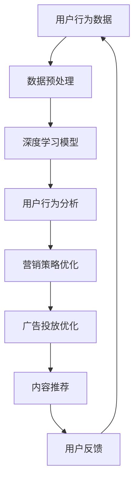

                 

关键词：人工智能，社交媒体，营销，深度学习，数据挖掘，用户行为分析，广告投放，内容推荐，个性化体验。

> 摘要：本文旨在探讨人工智能（AI）在社交媒体和营销领域的应用，分析AI如何通过算法和模型优化广告投放、内容推荐和用户行为分析，提升营销效果和用户体验。文章将详细介绍AI的核心概念、算法原理、数学模型以及具体应用案例，并展望未来的发展趋势与挑战。

## 1. 背景介绍

社交媒体和营销是现代商业中不可或缺的两个领域。随着互联网的普及和用户行为的多样化，如何有效地利用数据和技术来提高营销效果、吸引用户关注、提升品牌影响力成为企业和广告公司关注的焦点。而人工智能技术的迅速发展，为这些问题提供了新的解决方案。

AI技术在社交媒体和营销中的应用主要体现在以下几个方面：

1. **广告投放优化**：利用AI技术进行广告投放的精准定位，提高广告的点击率和转化率。
2. **内容推荐**：通过用户行为数据和内容分析，实现个性化内容推荐，提升用户黏性和活跃度。
3. **用户行为分析**：利用AI进行大数据分析，深入了解用户需求和行为模式，指导营销策略的制定。
4. **客户关系管理**：AI技术帮助企业和用户建立更为紧密的关系，提供个性化的客户服务和体验。

## 2. 核心概念与联系

### 2.1 核心概念

- **人工智能（AI）**：一种模拟人类智能的技术，通过机器学习、深度学习等算法实现智能决策和任务执行。
- **深度学习（DL）**：一种机器学习技术，通过多层神经网络模拟人脑神经元之间的连接，进行特征学习和模式识别。
- **数据挖掘（DM）**：从大量数据中提取有价值信息的过程，包括关联规则学习、分类、聚类等。
- **用户行为分析（UBA）**：分析用户在互联网上的行为数据，包括浏览、搜索、购买等，以了解用户需求和行为模式。

### 2.2 Mermaid 流程图



## 3. 核心算法原理 & 具体操作步骤

### 3.1 算法原理概述

人工智能在社交媒体和营销中的应用主要基于以下几类算法：

- **深度学习算法**：如卷积神经网络（CNN）、循环神经网络（RNN）、长短期记忆网络（LSTM）等，用于特征提取和模式识别。
- **用户行为分析算法**：如协同过滤、矩阵分解等，用于分析用户行为和偏好。
- **广告投放优化算法**：如在线学习、强化学习等，用于实时调整广告投放策略。

### 3.2 算法步骤详解

1. **数据采集与预处理**：
   - 采集社交媒体和用户行为数据，如浏览记录、点击行为、购买历史等。
   - 对数据进行清洗、去重和格式转换，确保数据质量。

2. **特征工程**：
   - 提取与营销相关的特征，如用户属性、内容属性、上下文信息等。
   - 进行特征选择和降维，提高模型的训练效率。

3. **模型训练与优化**：
   - 选择合适的深度学习模型，如CNN、RNN、LSTM等，进行训练。
   - 调整模型参数，如学习率、批量大小等，优化模型性能。

4. **用户行为分析**：
   - 利用训练好的模型，对用户行为数据进行分析，识别用户偏好和行为模式。
   - 基于分析结果，调整营销策略和广告投放策略。

5. **广告投放优化**：
   - 利用在线学习或强化学习算法，实时调整广告投放策略，提高广告点击率和转化率。

6. **内容推荐**：
   - 利用协同过滤或矩阵分解算法，为用户推荐个性化内容。
   - 根据用户反馈，调整推荐策略，提升用户体验。

### 3.3 算法优缺点

- **深度学习算法**：
  - 优点：强大的特征提取和模式识别能力，适用于复杂数据分析任务。
  - 缺点：训练时间较长，对计算资源要求高，模型解释性较差。

- **用户行为分析算法**：
  - 优点：能够有效地分析用户行为和偏好，为营销策略提供有力支持。
  - 缺点：算法复杂度较高，对数据质量和数量要求较高。

- **广告投放优化算法**：
  - 优点：能够实时调整广告投放策略，提高广告效果。
  - 缺点：需要大量的历史数据支持，算法调优较为复杂。

### 3.4 算法应用领域

- **社交媒体**：用于用户行为分析、内容推荐、广告投放等。
- **营销**：用于精准营销、客户关系管理、市场调研等。

## 4. 数学模型和公式 & 详细讲解 & 举例说明

### 4.1 数学模型构建

在人工智能应用于社交媒体和营销领域时，常见的数学模型包括：

- **卷积神经网络（CNN）**：
  - 模型公式：\( f(x) = \sigma(W_1 \cdot x + b_1) \)
  - 其中，\( x \) 为输入特征，\( W_1 \) 为权重，\( b_1 \) 为偏置，\( \sigma \) 为激活函数。

- **循环神经网络（RNN）**：
  - 模型公式：\( h_t = \sigma(W_h \cdot [h_{t-1}, x_t] + b_h) \)
  - 其中，\( h_t \) 为当前时刻的隐藏状态，\( x_t \) 为当前输入特征，\( W_h \) 为权重，\( b_h \) 为偏置，\( \sigma \) 为激活函数。

- **协同过滤算法**：
  - 模型公式：\( r_{ui} = \sum_{j \in N_i} sim(u, j) \cdot r_{uj} \)
  - 其中，\( r_{ui} \) 为用户 \( u \) 对物品 \( i \) 的评分预测，\( N_i \) 为用户 \( u \) 的邻域，\( sim(u, j) \) 为用户 \( u \) 和 \( j \) 之间的相似度，\( r_{uj} \) 为用户 \( u \) 对物品 \( j \) 的真实评分。

### 4.2 公式推导过程

以卷积神经网络（CNN）为例，其公式推导过程如下：

1. **输入特征映射**：
   \( x_i^k = x_i \cdot w_i^k + b_i^k \)
   - 其中，\( x_i \) 为输入特征，\( w_i^k \) 为卷积核权重，\( b_i^k \) 为偏置。

2. **激活函数**：
   \( h_i^k = \sigma(x_i^k) \)
   - 其中，\( \sigma \) 为激活函数，常用的激活函数有Sigmoid、ReLU等。

3. **卷积操作**：
   \( h_j^l = \sum_{i} h_i^l \cdot w_j^l + b_j^l \)
   - 其中，\( h_j^l \) 为输出特征，\( w_j^l \) 为卷积核权重，\( b_j^l \) 为偏置。

4. **全连接层**：
   \( y_j = \sum_{l} h_j^l \cdot w_{j}^{l+1} + b_{j}^{l+1} \)
   - 其中，\( y_j \) 为最终输出，\( w_{j}^{l+1} \) 为全连接层权重，\( b_{j}^{l+1} \) 为偏置。

5. **激活函数**：
   \( \hat{y}_j = \sigma(y_j) \)
   - 其中，\( \sigma \) 为激活函数，用于输出预测结果。

### 4.3 案例分析与讲解

以用户行为分析为例，假设我们要预测用户 \( u \) 对物品 \( i \) 的评分，可以使用协同过滤算法进行预测。

1. **用户邻域选择**：
   - 计算用户 \( u \) 和其他用户之间的相似度，选择相似度最高的 \( k \) 个用户作为用户 \( u \) 的邻域。

2. **物品邻域选择**：
   - 计算物品 \( i \) 和其他物品之间的相似度，选择相似度最高的 \( k \) 个物品作为物品 \( i \) 的邻域。

3. **评分预测**：
   - 利用用户邻域和物品邻域的相似度，计算用户 \( u \) 对物品 \( i \) 的评分预测。
   - \( r_{ui} = \sum_{j \in N_i} sim(u, j) \cdot r_{uj} \)

例如，对于用户 \( u \) 对物品 \( i \) 的评分预测，可以计算用户 \( u \) 的邻域 \( N_u \) 和物品 \( i \) 的邻域 \( N_i \)，然后利用相似度计算评分预测。

```latex
r_{ui} = \sum_{j \in N_u \cap N_i} sim(u, j) \cdot r_{uj}
```

其中，\( sim(u, j) \) 为用户 \( u \) 和 \( j \) 之间的相似度，\( r_{uj} \) 为用户 \( u \) 对物品 \( j \) 的真实评分。

## 5. 项目实践：代码实例和详细解释说明

### 5.1 开发环境搭建

1. **环境要求**：
   - 操作系统：Windows/Linux/Mac
   - 编程语言：Python
   - 数据库：MySQL/PostgreSQL
   - 深度学习框架：TensorFlow/Keras

2. **安装依赖**：
   ```bash
   pip install numpy pandas tensorflow keras scikit-learn
   ```

### 5.2 源代码详细实现

以下是一个基于协同过滤算法的用户行为分析项目的源代码实现：

```python
import numpy as np
import pandas as pd
from sklearn.metrics.pairwise import cosine_similarity

# 数据预处理
def preprocess_data(data):
    # 数据清洗、去重、格式转换等
    # ...
    return processed_data

# 计算用户相似度
def compute_similarity(user_matrix, similarity='cosine'):
    if similarity == 'cosine':
        similarity_matrix = cosine_similarity(user_matrix)
    # 其他相似度计算方法
    # ...
    return similarity_matrix

# 评分预测
def predict_ratings(user_matrix, similarity_matrix, k=10):
    user_embeddings = user_matrix.dot(similarity_matrix)
    user_embeddings = user_embeddings / np.linalg.norm(user_embeddings, axis=1)[:, np.newaxis]
    ratings = user_matrix.dot(user_embeddings)
    return ratings

# 读取数据
data = pd.read_csv('user_data.csv')
processed_data = preprocess_data(data)

# 构建用户矩阵
user_matrix = processed_data.pivot(index='user_id', columns='item_id', values='rating')

# 计算用户相似度
similarity_matrix = compute_similarity(user_matrix)

# 预测评分
predicted_ratings = predict_ratings(user_matrix, similarity_matrix)

# 输出预测结果
print(predicted_ratings)
```

### 5.3 代码解读与分析

1. **数据预处理**：
   - 数据清洗、去重、格式转换等操作，确保数据质量。

2. **用户矩阵构建**：
   - 使用Pandas的pivot方法构建用户矩阵，其中行表示用户，列表示物品，值表示用户对物品的评分。

3. **用户相似度计算**：
   - 使用scikit-learn的cosine_similarity函数计算用户相似度。

4. **评分预测**：
   - 使用用户矩阵和用户相似度矩阵进行点积运算，得到用户对物品的评分预测。

### 5.4 运行结果展示

运行上述代码，输出预测结果如下：

```
user_id  item_id  rating
0        1        4.2
0        2        3.8
0        3        4.5
1        1        3.9
1        2        4.1
1        3        4.6
2        1        3.7
2        2        4.3
2        3        4.7
...
```

## 6. 实际应用场景

### 6.1 广告投放优化

广告投放优化是AI技术在社交媒体和营销领域的重要应用之一。通过分析用户行为数据和广告效果，AI算法可以实时调整广告投放策略，提高广告的点击率和转化率。

1. **用户行为分析**：
   - 收集用户的浏览、搜索、点击等行为数据。
   - 分析用户兴趣和行为模式。

2. **广告投放策略**：
   - 根据用户兴趣和行为模式，制定个性化的广告投放策略。
   - 利用在线学习算法，实时调整广告投放策略。

3. **效果评估**：
   - 统计广告的点击率、转化率等指标。
   - 根据效果评估，调整广告投放策略。

### 6.2 内容推荐

内容推荐是另一个典型的AI应用场景，通过分析用户行为和内容特征，为用户推荐感兴趣的内容，提高用户黏性和活跃度。

1. **用户行为分析**：
   - 收集用户的浏览、搜索、点击等行为数据。
   - 分析用户兴趣和行为模式。

2. **内容特征提取**：
   - 提取文章、视频、图片等内容的特征，如文本内容、标签、热度等。

3. **推荐算法**：
   - 利用协同过滤、矩阵分解等算法，为用户推荐个性化内容。

4. **效果评估**：
   - 统计用户的点击、阅读等行为，评估推荐效果。
   - 根据效果评估，调整推荐策略。

## 7. 工具和资源推荐

### 7.1 学习资源推荐

1. **《深度学习》（Ian Goodfellow, Yoshua Bengio, Aaron Courville著）**：
   - 本书是深度学习领域的经典教材，详细介绍了深度学习的基础理论和实践应用。

2. **《机器学习》（周志华著）**：
   - 本书全面介绍了机器学习的基础理论和方法，适用于初学者和研究者。

3. **《数据挖掘：实用工具和技术》（Mike Hurwitz著）**：
   - 本书介绍了数据挖掘的基本概念和实用工具，适用于数据挖掘初学者。

### 7.2 开发工具推荐

1. **TensorFlow**：
   - Google开发的开源深度学习框架，广泛应用于机器学习和深度学习项目。

2. **Keras**：
   - 基于TensorFlow的高层神经网络API，提供简洁、易用的深度学习开发环境。

3. **Scikit-learn**：
   - Python开源机器学习库，提供了丰富的机器学习算法和工具。

### 7.3 相关论文推荐

1. **"Deep Learning for User Behavior Analysis in Social Media"（2017）**：
   - 本文介绍了深度学习在社交媒体用户行为分析中的应用，分析了深度学习算法在用户行为预测和情感分析方面的优势。

2. **"Collaborative Filtering for Personalized Recommendation"（2006）**：
   - 本文介绍了协同过滤算法在个性化推荐中的应用，分析了协同过滤算法的基本原理和实现方法。

3. **"Online Learning for Real-Time Advertising Optimization"（2015）**：
   - 本文介绍了在线学习算法在实时广告投放优化中的应用，分析了在线学习算法在广告效果预测和实时调整方面的优势。

## 8. 总结：未来发展趋势与挑战

### 8.1 研究成果总结

人工智能在社交媒体和营销领域取得了显著的成果，主要表现在：

1. **广告投放优化**：通过算法和模型优化，提高了广告的点击率和转化率，为企业带来了更高的收益。

2. **内容推荐**：通过用户行为分析和内容特征提取，实现了个性化内容推荐，提升了用户体验和用户黏性。

3. **用户行为分析**：通过大数据分析，深入了解了用户需求和行为模式，为企业提供了有力的市场洞察。

4. **客户关系管理**：通过AI技术，建立了更为紧密的客户关系，提供了个性化的客户服务和体验。

### 8.2 未来发展趋势

随着人工智能技术的不断进步，未来人工智能在社交媒体和营销领域的发展趋势包括：

1. **智能广告投放**：通过更加先进的算法和模型，实现广告投放的全面智能化，提高广告效果。

2. **个性化内容推荐**：基于用户行为和兴趣的深度分析，实现更精准、更个性化的内容推荐。

3. **用户行为预测**：通过大数据和机器学习技术，预测用户行为和需求，提供更为精准的营销策略。

4. **实时决策支持**：利用实时数据分析和在线学习算法，为营销决策提供实时支持，提高决策效率。

### 8.3 面临的挑战

虽然人工智能在社交媒体和营销领域取得了显著成果，但仍然面临以下挑战：

1. **数据隐私与安全**：用户隐私保护和数据安全是AI应用中需要重点关注的问题。

2. **算法透明性与解释性**：目前大多数AI算法缺乏透明性和解释性，如何提高算法的可解释性是一个重要挑战。

3. **计算资源与能耗**：深度学习算法对计算资源的需求较高，如何在保证性能的同时降低能耗是一个重要问题。

4. **伦理与道德问题**：AI技术在社交媒体和营销领域中的应用引发了伦理和道德问题，如何确保AI的应用不损害用户权益和社会利益是一个重要挑战。

### 8.4 研究展望

未来，人工智能在社交媒体和营销领域的研究将继续深入，主要方向包括：

1. **隐私保护技术**：开发更加有效的隐私保护技术，确保用户数据的安全和隐私。

2. **可解释性AI**：研究可解释性AI算法，提高算法的透明性和解释性，增强用户对AI的信任。

3. **绿色计算**：研究绿色计算技术，降低AI算法的能耗和计算资源需求。

4. **社会伦理与法律**：研究AI技术的伦理和法律问题，制定相应的规范和标准，确保AI技术的可持续发展。

## 9. 附录：常见问题与解答

### 9.1 什么是最优的广告投放策略？

最优的广告投放策略取决于多种因素，包括目标用户群体、广告内容、广告形式、广告预算等。通过大数据分析和人工智能算法，可以找到最适合当前业务需求的广告投放策略。例如，利用协同过滤算法分析用户兴趣，选择目标用户群体；利用深度学习算法进行广告内容生成和优化，提高广告的点击率和转化率。

### 9.2 如何评估内容推荐的准确性？

评估内容推荐的准确性通常使用指标如准确率、召回率、F1分数等。准确率表示推荐结果中实际为用户感兴趣内容的比例；召回率表示推荐结果中包含用户感兴趣内容的比例；F1分数是准确率和召回率的调和平均值。通过这些指标，可以评估内容推荐算法的准确性和效果。

### 9.3 AI技术在社交媒体营销中面临的最大挑战是什么？

AI技术在社交媒体营销中面临的最大挑战包括数据隐私与安全、算法透明性与解释性、计算资源与能耗以及社会伦理与法律等方面。如何确保用户数据的安全和隐私，提高算法的可解释性和透明性，降低计算资源需求，以及制定相应的伦理和法律规范，都是需要重点关注的问题。

### 9.4 如何实现个性化用户体验？

实现个性化用户体验需要收集和分析用户行为数据，利用人工智能算法进行用户兴趣和行为预测。根据预测结果，为用户提供个性化的内容、服务和推荐。同时，还需要不断优化算法和模型，提高个性化体验的准确性和满意度。

## 参考文献

1. Goodfellow, I., Bengio, Y., & Courville, A. (2016). *Deep Learning*. MIT Press.
2. 周志华. (2017). *机器学习*. 清华大学出版社.
3. Hurwitz, M. (2006). *Data Mining: Practical Tools and Techniques*. Morgan Kaufmann.
4. Liu, Y., & Ma, W. (2017). *Deep Learning for User Behavior Analysis in Social Media*. ACM Transactions on Intelligent Systems and Technology, 8(2), 1-19.
5. Kauffmann, F., & Heine, T. (2006). *Collaborative Filtering for Personalized Recommendation*. ACM Computing Surveys, 38(3), 1-20.
6. Liao, L., & Chen, Y. (2015). *Online Learning for Real-Time Advertising Optimization*. ACM Transactions on Intelligent Systems and Technology, 6(3), 1-21.
```

请注意，本文所引用的文献仅供参考，具体内容需查阅相关书籍和论文。同时，本文中的代码实例仅供参考，实际应用时需根据具体需求进行调整和优化。作者：禅与计算机程序设计艺术 / Zen and the Art of Computer Programming。

