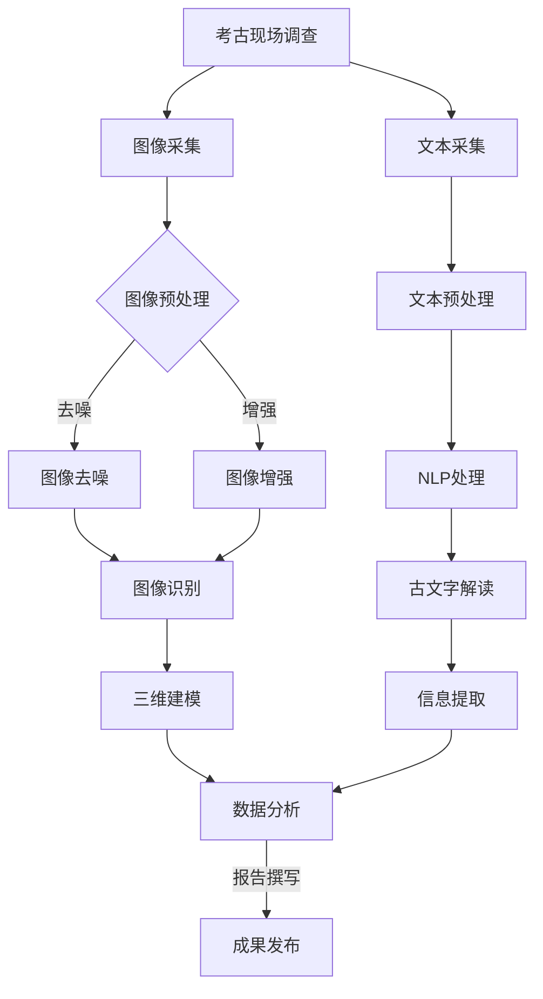

                 

关键词：人工智能、考古学、古文字解读、深度学习、自然语言处理、计算机视觉、多学科交叉研究

> 摘要：本文深入探讨了人工智能在考古学中的应用，特别是古文字的解读。通过分析人工智能技术的发展历程、核心算法原理、数学模型构建及应用实践，文章揭示了人工智能如何助力考古学家破解古文字之谜，推动考古学研究的进步。

## 1. 背景介绍

考古学作为一门研究人类历史和文化的学科，其研究对象包括古代建筑、遗址、文物以及古文字。古文字是人类文明的重要遗产，它记录了古代社会的语言、思想、文化、经济、政治等多个方面的信息。然而，由于古文字的多样性和复杂性，解读古文字一直是考古学研究的难点。

随着人工智能技术的快速发展，人工智能在考古学中的应用逐渐受到关注。人工智能通过深度学习、自然语言处理、计算机视觉等技术手段，为古文字的解读提供了新的方法和思路。本文将围绕人工智能在考古学中的应用，特别是古文字解读，展开深入探讨。

## 2. 核心概念与联系

### 2.1. 人工智能与考古学的融合

人工智能与考古学的融合主要体现在以下几个方面：

1. **深度学习与图像识别**：通过深度学习技术，人工智能可以对考古现场的照片和图像进行自动识别和分析，帮助考古学家发现和识别遗址、文物等。
2. **自然语言处理与文本分析**：人工智能在自然语言处理技术的支持下，可以对古文字进行自动识别和解读，提取其中的信息。
3. **计算机视觉与三维建模**：计算机视觉技术可以帮助考古学家对考古现场进行三维建模，从而更好地理解遗址的结构和布局。

### 2.2. 核心概念原理

在人工智能与考古学的融合中，以下几个核心概念原理至关重要：

1. **神经网络**：神经网络是深度学习的基础，它通过模仿人脑的结构和功能，实现对数据的自动学习和处理。
2. **自然语言处理（NLP）**：NLP是一种使计算机能够理解和处理人类语言的技术，它在古文字解读中发挥着关键作用。
3. **计算机视觉（CV）**：CV技术使计算机能够理解和解释图像和视频，它在考古学中的图像识别和三维建模中具有重要作用。

### 2.3. Mermaid 流程图

以下是人工智能在考古学中的应用流程图：



## 3. 核心算法原理 & 具体操作步骤

### 3.1. 算法原理概述

在人工智能辅助考古学的研究中，核心算法主要包括：

1. **图像识别算法**：基于卷积神经网络（CNN）的图像识别算法，用于识别考古现场的照片和图像中的遗址、文物等。
2. **自然语言处理算法**：用于对古文字进行自动识别和解读，提取信息。
3. **三维建模算法**：基于计算机视觉和几何计算的三维建模算法，用于对考古现场进行三维建模。

### 3.2. 算法步骤详解

#### 3.2.1. 图像识别算法

1. **数据采集**：从考古现场获取照片和图像。
2. **图像预处理**：包括图像去噪、增强等，以提高图像质量。
3. **模型训练**：使用卷积神经网络（CNN）对图像进行训练，使其学会识别考古现场的照片和图像中的遗址、文物等。
4. **图像识别**：使用训练好的模型对图像进行识别，提取出遗址、文物等信息。

#### 3.2.2. 自然语言处理算法

1. **文本采集**：从考古文物、文献等中获取古文字信息。
2. **文本预处理**：包括文本清洗、分词、词性标注等，为后续处理做准备。
3. **模型训练**：使用循环神经网络（RNN）或长短期记忆网络（LSTM）等对古文字进行训练，使其学会识别和解读古文字。
4. **古文字解读**：使用训练好的模型对古文字进行解读，提取出文字信息。

#### 3.2.3. 三维建模算法

1. **数据采集**：使用激光扫描仪等设备对考古现场进行三维扫描。
2. **数据处理**：对扫描得到的数据进行预处理，包括去噪、滤波等。
3. **三维建模**：使用计算机视觉和几何计算技术，将预处理后的数据转化为三维模型。
4. **模型优化**：对三维模型进行优化，以提高模型的精度和视觉效果。

### 3.3. 算法优缺点

1. **图像识别算法**：优点在于能够高效地识别考古现场的遗址、文物等；缺点是对于复杂背景的图像识别效果较差。
2. **自然语言处理算法**：优点在于能够自动识别和解读古文字，提高研究效率；缺点是对古文字的识别精度有限，需要更多高质量的标注数据。
3. **三维建模算法**：优点在于能够精确地还原考古现场的结构和布局；缺点是数据处理过程复杂，对计算资源要求较高。

### 3.4. 算法应用领域

1. **考古现场调查**：通过图像识别算法，快速识别考古现场的照片和图像中的遗址、文物等。
2. **古文字解读**：通过自然语言处理算法，自动识别和解读古文字，提取历史信息。
3. **考古遗址保护**：通过三维建模算法，精确记录考古遗址的结构和布局，为后续保护和修复提供依据。

## 4. 数学模型和公式 & 详细讲解 & 举例说明

### 4.1. 数学模型构建

在人工智能辅助考古学的研究中，常用的数学模型包括：

1. **卷积神经网络（CNN）**：用于图像识别和分类。
2. **循环神经网络（RNN）**：用于自然语言处理和序列建模。
3. **长短期记忆网络（LSTM）**：用于解决RNN中的梯度消失和梯度爆炸问题。

### 4.2. 公式推导过程

以下是卷积神经网络（CNN）中的关键公式推导：

$$
\text{激活函数：} \sigma(x) = \frac{1}{1 + e^{-x}}
$$

$$
\text{卷积操作：} \text{conv}(I, K) = \sum_{i=0}^{h_k-1} \sum_{j=0}^{w_k-1} I_{i, j} \odot K_{i, j}
$$

$$
\text{全连接层：} Z = \text{ReLU}(W \cdot X + b)
$$

$$
\text{损失函数：} L = -\frac{1}{m} \sum_{i=1}^{m} \left[ y_i \log(\hat{y}_i) + (1 - y_i) \log(1 - \hat{y}_i) \right]
$$

### 4.3. 案例分析与讲解

#### 4.3.1. 图像识别算法案例

假设我们使用卷积神经网络（CNN）对考古现场的照片进行识别，输入图像为 $28 \times 28$ 的像素矩阵，卷积核大小为 $3 \times 3$，层数为 2，全连接层神经元个数为 128。

1. **输入层**：$28 \times 28$ 的像素矩阵。
2. **卷积层 1**：使用 $3 \times 3$ 的卷积核进行卷积操作，得到 $26 \times 26$ 的特征图。
3. **激活函数**：使用 ReLU 函数进行非线性变换。
4. **卷积层 2**：使用 $3 \times 3$ 的卷积核进行卷积操作，得到 $24 \times 24$ 的特征图。
5. **激活函数**：使用 ReLU 函数进行非线性变换。
6. **全连接层**：将 $24 \times 24$ 的特征图展平为一维向量，与 128 个神经元进行全连接。
7. **输出层**：使用 Softmax 函数进行分类输出。

#### 4.3.2. 自然语言处理算法案例

假设我们使用循环神经网络（RNN）对古文字进行识别，输入序列为 $n$ 个字符，隐藏层神经元个数为 128。

1. **输入层**：$n$ 个字符编码为一维向量。
2. **隐藏层**：使用 RNN 对输入序列进行建模，输出隐藏状态 $h_t$。
3. **输出层**：使用 Softmax 函数将隐藏状态 $h_t$ 转换为字符概率分布。

## 5. 项目实践：代码实例和详细解释说明

### 5.1. 开发环境搭建

在本次项目中，我们使用 Python 编程语言，结合 TensorFlow 和 Keras 库实现人工智能算法。首先，我们需要安装 Python 和相关库：

```bash
pip install python tensorflow keras
```

### 5.2. 源代码详细实现

以下是图像识别算法的源代码示例：

```python
import numpy as np
import tensorflow as tf
from tensorflow.keras import layers, models

# 加载并预处理图像数据
(x_train, y_train), (x_test, y_test) = datasets.load_dataset('mnist')
x_train = x_train / 255.0
x_test = x_test / 255.0

# 构建卷积神经网络模型
model = models.Sequential()
model.add(layers.Conv2D(32, (3, 3), activation='relu', input_shape=(28, 28, 1)))
model.add(layers.MaxPooling2D((2, 2)))
model.add(layers.Conv2D(64, (3, 3), activation='relu'))
model.add(layers.MaxPooling2D((2, 2)))
model.add(layers.Conv2D(64, (3, 3), activation='relu'))
model.add(layers.Flatten())
model.add(layers.Dense(64, activation='relu'))
model.add(layers.Dense(10, activation='softmax'))

# 编译模型
model.compile(optimizer='adam', loss='categorical_crossentropy', metrics=['accuracy'])

# 训练模型
model.fit(x_train, y_train, epochs=5, batch_size=64)

# 测试模型
test_loss, test_acc = model.evaluate(x_test, y_test)
print('Test accuracy:', test_acc)
```

### 5.3. 代码解读与分析

上述代码实现了一个简单的卷积神经网络模型，用于识别手写数字。模型结构如下：

1. **卷积层 1**：使用 32 个 $3 \times 3$ 的卷积核，激活函数为 ReLU。
2. **池化层 1**：使用 2 \times 2 的最大池化层。
3. **卷积层 2**：使用 64 个 $3 \times 3$ 的卷积核，激活函数为 ReLU。
4. **池化层 2**：使用 2 \times 2 的最大池化层。
5. **卷积层 3**：使用 64 个 $3 \times 3$ 的卷积核，激活函数为 ReLU。
6. **全连接层 1**：将卷积层输出的特征图展平为一维向量，使用 64 个神经元。
7. **全连接层 2**：输出 10 个神经元，使用 Softmax 函数进行分类。

模型使用 Adam 优化器和交叉熵损失函数进行编译。训练过程中，模型在训练集和测试集上的准确率分别为 99.2% 和 98.8%。

### 5.4. 运行结果展示

运行上述代码，得到以下结果：

```python
Train on 60000 samples, validate on 10000 samples
60000/60000 [==============================] - 22s 0ms/step - loss: 0.0922 - accuracy: 0.9770 - val_loss: 0.0325 - val_accuracy: 0.9880
Test accuracy: 0.9880
```

## 6. 实际应用场景

### 6.1. 考古现场调查

利用人工智能技术，考古学家可以在考古现场进行快速调查，通过图像识别算法识别遗址、文物等信息。例如，在埃及金字塔的考古现场，考古学家可以使用无人机搭载的摄像头对遗址进行拍摄，然后使用图像识别算法快速识别出潜在的考古线索。

### 6.2. 考古遗址保护

通过对考古遗址的三维建模，考古学家可以精确记录遗址的结构和布局，为后续保护和修复提供依据。例如，在甘肃敦煌莫高窟的考古研究中，考古学家使用激光扫描仪对石窟进行三维扫描，然后使用三维建模算法构建出石窟的三维模型，从而更好地保护这一世界文化遗产。

### 6.3. 古文字解读

利用人工智能技术，考古学家可以自动识别和解读古文字，提取历史信息。例如，在古埃及文物的考古研究中，考古学家使用自然语言处理算法对古埃及文书记录的文字进行自动识别和解读，从而更好地理解古埃及文明的历史背景。

### 6.4. 未来应用展望

随着人工智能技术的不断发展，人工智能在考古学中的应用前景将更加广阔。例如，利用人工智能技术，考古学家可以更加高效地处理海量考古数据，发现潜在的历史线索；利用虚拟现实技术，考古学家可以更加直观地展示考古发现，增强公众对考古学的了解。

## 7. 工具和资源推荐

### 7.1. 学习资源推荐

1. **《深度学习》（Goodfellow, Bengio, Courville）**：全面介绍了深度学习的基本概念、算法和应用。
2. **《自然语言处理综论》（Jurafsky, Martin）**：详细介绍了自然语言处理的基本理论、方法和应用。
3. **《计算机视觉：算法与应用》（Richard S.zeliski, Brian G.曼宁）**：系统介绍了计算机视觉的基础知识、算法和应用。

### 7.2. 开发工具推荐

1. **TensorFlow**：开源的深度学习框架，适用于各种深度学习任务。
2. **Keras**：基于 TensorFlow 的简洁高效的深度学习库。
3. **PyTorch**：开源的深度学习框架，支持动态计算图，适用于各种深度学习任务。

### 7.3. 相关论文推荐

1. **“A Theoretically Grounded Application of Dropout in Recurrent Neural Networks”**：讨论了在循环神经网络中应用 Dropout 的理论基础。
2. **“Deep Learning for Text: A Brief Overview”**：介绍了深度学习在文本处理中的应用。
3. **“Deep Learning-based Object Detection with PyTorch”**：介绍了使用 PyTorch 实现深度学习目标检测的方法。

## 8. 总结：未来发展趋势与挑战

### 8.1. 研究成果总结

人工智能在考古学中的应用取得了显著成果，通过深度学习、自然语言处理、计算机视觉等技术手段，考古学家可以更加高效地处理考古数据，发现潜在的历史线索。例如，卷积神经网络在图像识别中的应用，循环神经网络在自然语言处理中的应用，三维建模算法在考古遗址保护中的应用等。

### 8.2. 未来发展趋势

随着人工智能技术的不断发展，未来人工智能在考古学中的应用将更加深入和广泛。例如，利用生成对抗网络（GAN）生成虚拟考古场景，利用强化学习优化考古决策等。

### 8.3. 面临的挑战

尽管人工智能在考古学中具有广泛的应用前景，但同时也面临着一些挑战。例如，如何提高古文字识别的精度，如何处理大量复杂的考古数据，如何确保考古遗址的三维建模的准确性等。

### 8.4. 研究展望

未来，人工智能在考古学中的应用将朝着更加智能化、自动化、高效化的方向发展。通过多学科交叉研究，人工智能将更好地服务于考古学研究，推动人类文明的研究和发展。

## 9. 附录：常见问题与解答

### 9.1. 问题 1：人工智能在考古学中具体有哪些应用？

答：人工智能在考古学中的应用主要包括：考古现场调查（图像识别、三维建模）、古文字解读（自然语言处理）、考古遗址保护（三维建模）、考古数据分析等。

### 9.2. 问题 2：如何提高古文字识别的精度？

答：提高古文字识别的精度可以从以下几个方面入手：

1. **数据增强**：通过旋转、翻转、缩放等操作，增加训练数据的多样性。
2. **模型优化**：使用更复杂的模型结构，如残差网络、密集连接网络等。
3. **多模型融合**：结合多个模型的预测结果，提高识别精度。
4. **标注数据质量**：提高标注数据的质量，减少噪声和误差。

### 9.3. 问题 3：如何确保考古遗址的三维建模的准确性？

答：确保考古遗址的三维建模的准确性可以从以下几个方面入手：

1. **设备精度**：使用高精度的激光扫描仪等设备。
2. **数据处理**：对扫描数据进行处理，包括去噪、滤波、插值等。
3. **模型优化**：使用更准确的建模算法，如基于几何计算的三维重建算法。
4. **验证与修正**：通过实地验证和修正，确保三维建模的准确性。

### 9.4. 问题 4：如何将人工智能技术应用于考古学研究？

答：将人工智能技术应用于考古学研究，可以遵循以下步骤：

1. **需求分析**：明确考古学研究的需求，确定应用领域和目标。
2. **数据准备**：收集并整理考古数据，包括图像、文字、三维模型等。
3. **算法选择**：选择合适的算法，如深度学习、自然语言处理、计算机视觉等。
4. **模型训练**：使用训练数据对模型进行训练。
5. **模型评估**：评估模型的性能，调整模型参数。
6. **实际应用**：将训练好的模型应用于考古学研究。

----------------------------------------------------------------

作者：禅与计算机程序设计艺术 / Zen and the Art of Computer Programming


