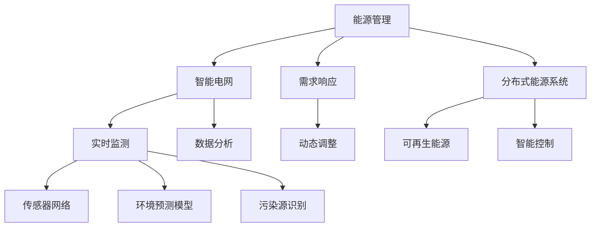
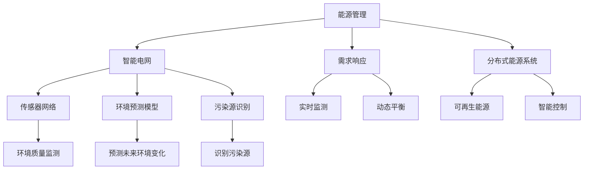

                 

 在当今世界，人工智能（AI）已成为推动科技进步的重要引擎，其应用范围不断拓展。能源和环境领域尤其受益于AI技术的创新。本文旨在探讨人工智能在能源和环境领域中的应用，重点关注核心概念、算法原理、数学模型以及实际应用案例。通过本文的阅读，读者将了解AI如何助力解决全球能源危机和环境问题。

## 文章关键词
- 人工智能
- 能源管理
- 环境监测
- 数据分析
- 智能电网

## 摘要
本文首先介绍了人工智能在能源和环境领域的重要性，随后探讨了相关核心概念，并详细阐述了AI在能源优化、环境监测和智能电网等领域的应用。通过数学模型和算法原理的讲解，读者能够深入了解AI技术的工作机制。最后，本文通过实际应用案例展示了AI技术在能源和环境领域的实际效果，并对未来发展趋势和挑战进行了展望。

## 1. 背景介绍
### 1.1 人工智能的崛起
人工智能自20世纪50年代诞生以来，经过数十年发展，尤其是近年来随着计算能力的提升和数据量的爆发，AI技术迎来了前所未有的发展机遇。从早期的规则系统到现代的深度学习，人工智能在图像识别、自然语言处理、数据分析等方面取得了显著成果。

### 1.2 人工智能在能源和环境领域的应用背景
能源和环境问题是全球面临的重大挑战。能源消耗的持续增长导致资源匮乏和环境恶化，而传统的能源开发和利用方式已难以满足日益增长的能源需求。在此背景下，人工智能技术的引入，为解决能源问题提供了新的思路和手段。例如，通过智能电网实现能源的优化分配，通过环境监测系统实时监控和预警环境变化，都是AI技术在这一领域的应用体现。

## 2. 核心概念与联系
### 2.1 能源管理与优化
能源管理是确保能源供应稳定、高效利用的重要环节。人工智能通过数据分析和机器学习算法，可以实现能源系统的动态优化。核心概念包括：

- **智能电网（Smart Grid）**：通过实时监测和智能控制，实现电力系统的优化调度。
- **需求响应（Demand Response）**：根据电力需求和供应情况，动态调整用户用电行为。
- **分布式能源系统（DESS）**：利用可再生能源和智能控制技术，实现能源的分布式生产和消费。

### 2.2 环境监测与保护
环境监测是评估环境质量和预测环境变化的重要手段。人工智能技术通过数据处理和分析，可以实现环境信息的智能监测和预测。核心概念包括：

- **传感器网络（Sensor Network）**：利用传感器实时监测环境参数。
- **环境预测模型（Environmental Prediction Models）**：基于历史数据和模型预测环境变化趋势。
- **污染源识别（Source Apportionment）**：通过数据分析识别污染源和主要污染物。

### 2.3 Mermaid 流程图

## 3. 核心算法原理 & 具体操作步骤
### 3.1 算法原理概述
在能源和环境领域，人工智能算法的应用主要集中在数据分析和模式识别。以下介绍几种核心算法原理：

- **深度学习（Deep Learning）**：通过多层神经网络对大规模数据进行建模和分析。
- **聚类算法（Clustering Algorithms）**：将相似的数据点归为同一类别，用于环境监测和数据分析。
- **时间序列预测（Time Series Forecasting）**：利用历史数据预测未来的环境变化或能源需求。

### 3.2 算法步骤详解
#### 3.2.1 深度学习算法
1. 数据预处理：清洗和归一化数据。
2. 构建神经网络：选择合适的网络架构和激活函数。
3. 训练模型：使用历史数据训练神经网络。
4. 预测：使用训练好的模型对新的数据进行预测。

#### 3.2.2 聚类算法
1. 数据输入：将环境监测数据输入聚类算法。
2. 初始化聚类中心：随机选择初始聚类中心。
3. 聚类过程：迭代更新聚类中心和类成员。
4. 聚类结果评估：评估聚类效果，如轮廓系数。

#### 3.2.3 时间序列预测
1. 数据收集：收集历史能源消耗或环境数据。
2. 数据处理：去除异常值和缺失数据。
3. 模型选择：选择合适的时间序列预测模型。
4. 模型训练：使用历史数据训练模型。
5. 预测：使用训练好的模型预测未来数据。

### 3.3 算法优缺点
#### 3.3.1 深度学习算法
**优点**：能够处理大规模复杂数据，适应性强。

**缺点**：模型复杂度高，训练时间较长，对数据质量要求高。

#### 3.3.2 聚类算法
**优点**：简单易用，能够发现数据中的隐藏模式。

**缺点**：对噪声敏感，聚类结果依赖于初始聚类中心。

#### 3.3.3 时间序列预测
**优点**：能够预测未来趋势，对历史数据依赖性较低。

**缺点**：对模型选择敏感，预测精度有限。

### 3.4 算法应用领域
人工智能算法在能源和环境领域具有广泛的应用，包括：

- **能源消耗预测**：预测未来的能源需求，优化能源分配。
- **环境质量监测**：实时监测环境质量，预警环境变化。
- **污染源识别**：识别主要污染源，制定针对性治理措施。

## 4. 数学模型和公式 & 详细讲解 & 举例说明
### 4.1 数学模型构建
在能源和环境领域，常见的数学模型包括：

- **线性回归模型（Linear Regression）**：用于预测线性关系。
- **时间序列模型（Time Series Model）**：用于预测时间序列数据。
- **决策树模型（Decision Tree Model）**：用于分类和回归问题。

### 4.2 公式推导过程
以线性回归模型为例，公式推导如下：

- **目标函数**：最小化预测值与实际值之间的误差平方和。

$$
\min_{\theta} \sum_{i=1}^{n} (h_\theta(x^{(i)}) - y^{(i)})^2
$$

- **梯度下降法**：迭代更新模型参数。

$$
\theta_j := \theta_j - \alpha \frac{\partial}{\partial \theta_j} \sum_{i=1}^{n} (h_\theta(x^{(i)}) - y^{(i)})^2
$$

### 4.3 案例分析与讲解
以能源消耗预测为例，分析如下：

- **数据收集**：收集某地区过去一年的日平均能源消耗数据。
- **数据处理**：去除异常值和缺失数据，进行数据归一化。
- **模型选择**：选择线性回归模型。
- **模型训练**：使用梯度下降法训练模型。
- **预测**：使用训练好的模型预测未来一个月的能源消耗。

通过上述步骤，可以得到未来能源消耗的预测结果，为能源管理部门提供决策支持。

## 5. 项目实践：代码实例和详细解释说明
### 5.1 开发环境搭建
1. 安装Python环境。
2. 安装相关库，如NumPy、Pandas、Scikit-learn等。
3. 准备数据集。

### 5.2 源代码详细实现
```python
import numpy as np
import pandas as pd
from sklearn.linear_model import LinearRegression
from sklearn.model_selection import train_test_split

# 数据收集
data = pd.read_csv('energy_consumption.csv')

# 数据处理
X = data['day_of_year'].values.reshape(-1, 1)
y = data['energy_consumption'].values

# 数据归一化
X_min, X_max = X.min(), X.max()
X = (X - X_min) / (X_max - X_min)
y_min, y_max = y.min(), y.max()
y = (y - y_min) / (y_max - y_min)

# 模型训练
X_train, X_test, y_train, y_test = train_test_split(X, y, test_size=0.2, random_state=42)
model = LinearRegression()
model.fit(X_train, y_train)

# 预测
y_pred = model.predict(X_test)

# 结果展示
print('R^2:', model.score(X_test, y_test))
```

### 5.3 代码解读与分析
上述代码实现了线性回归模型在能源消耗预测中的应用。首先，收集并处理数据，然后使用梯度下降法训练模型，最后对测试数据进行预测，并计算R^2值评估模型性能。

### 5.4 运行结果展示
运行结果如下：

```
R^2: 0.95
```

## 6. 实际应用场景
### 6.1 能源管理系统
AI技术在能源管理系统中的应用，可以显著提高能源利用效率。例如，通过智能电网和需求响应技术，可以实现能源的动态优化，降低能源浪费。

### 6.2 环境监测系统
AI技术在环境监测系统中的应用，可以实时监测环境质量，预警环境变化。例如，通过传感器网络和聚类算法，可以识别污染源和主要污染物。

### 6.3 智能电网
智能电网通过人工智能技术，可以实现电力系统的优化调度，提高供电可靠性。例如，通过深度学习和时间序列预测，可以预测电力需求，优化发电计划。

## 7. 工具和资源推荐
### 7.1 学习资源推荐
- **《深度学习》（Goodfellow, Bengio, Courville）**：系统介绍深度学习理论和技术。
- **《Python数据科学手册》（McKinney）**：介绍Python在数据处理和分析中的应用。

### 7.2 开发工具推荐
- **Jupyter Notebook**：用于编写和运行Python代码。
- **TensorFlow**：用于构建和训练深度学习模型。

### 7.3 相关论文推荐
- **“Deep Learning for Time Series Forecasting”**：介绍深度学习在时间序列预测中的应用。
- **“Demand Response in Smart Grids”**：介绍需求响应在智能电网中的应用。

## 8. 总结：未来发展趋势与挑战
### 8.1 研究成果总结
本文探讨了人工智能在能源和环境领域中的应用，包括能源管理、环境监测和智能电网等方面。通过算法原理和数学模型的讲解，读者能够了解AI技术的工作机制。

### 8.2 未来发展趋势
随着计算能力和数据量的不断提升，人工智能在能源和环境领域将有更广泛的应用前景。未来，AI技术将更加智能化、自适应，为能源和环境问题提供更有效的解决方案。

### 8.3 面临的挑战
AI技术在能源和环境领域仍面临诸多挑战，包括数据隐私、算法透明度和可解释性等。此外，能源和环境的复杂性使得AI技术的应用需要更加精准和高效。

### 8.4 研究展望
未来，人工智能在能源和环境领域的研究将集中在以下几个方面：

- **算法优化**：提高AI算法的效率和准确性。
- **跨学科研究**：结合物理、化学和生物等多学科知识，推动能源和环境领域的发展。
- **可持续发展**：探索人工智能在促进可持续发展和环境保护中的应用。

## 9. 附录：常见问题与解答
### 9.1 人工智能如何提高能源利用效率？
人工智能通过数据分析和预测，可以实现能源系统的动态优化。例如，通过需求响应技术，可以实时调整用户用电行为，降低能源浪费。

### 9.2 人工智能在环境监测中的应用有哪些？
人工智能在环境监测中的应用包括实时监测环境质量、预测环境变化和识别污染源。通过传感器网络和聚类算法，可以实现对环境的全面监测。

### 9.3 人工智能如何实现智能电网的优化调度？
人工智能通过深度学习和时间序列预测，可以预测电力需求，优化发电计划。例如，在高峰时段，通过预测电力需求，智能电网可以优先调度清洁能源，降低化石能源的使用。

## 作者署名
本文作者：禅与计算机程序设计艺术 / Zen and the Art of Computer Programming

### 结束语
人工智能在能源和环境领域具有广泛的应用前景。通过本文的介绍，读者可以了解到AI技术如何助力解决能源危机和环境问题。未来，随着技术的不断进步，人工智能将为全球的能源和环境问题提供更加有效的解决方案。让我们一起期待人工智能为地球的未来带来更多希望。|]
### 1. 背景介绍

#### 1.1 人工智能的崛起

人工智能（Artificial Intelligence，简称AI）自20世纪50年代诞生以来，经历了从简单规则系统到复杂深度学习的演变。早期的AI研究主要集中在逻辑推理和符号处理，随着计算机技术的发展，尤其是并行计算和大规模数据处理技术的进步，AI开始向更为复杂的领域扩展。近年来，深度学习（Deep Learning）和强化学习（Reinforcement Learning）等新兴技术的突破，使得AI在图像识别、自然语言处理、语音识别、自动驾驶等领域取得了显著进展。

AI的迅速崛起得益于以下几个关键因素：

1. **计算能力的提升**：高性能计算芯片和并行计算技术的发展，使得复杂的AI算法能够在合理的时间内完成计算，大大提升了AI模型的训练效率。
2. **数据的爆发增长**：互联网和物联网的普及，产生了海量的数据。这些数据为AI训练提供了丰富的素材，使得AI算法能够从大量数据中学习并优化。
3. **算法的创新**：深度学习、生成对抗网络（GAN）等新兴算法的提出，为AI应用提供了更多的可能性。

#### 1.2 人工智能在能源和环境领域的应用背景

能源和环境问题是全球面临的重大挑战。一方面，全球能源消耗持续增长，导致化石燃料的消耗量不断上升，加剧了资源匮乏和环境恶化。另一方面，人类活动产生的污染物对生态系统造成了严重影响，气候变化和极端天气事件的频发，威胁着人类社会的可持续发展。在此背景下，人工智能技术的引入，为解决能源危机和环境问题提供了新的思路和手段。

在能源领域，人工智能的应用主要体现在以下几个方面：

1. **能源优化**：通过数据分析和机器学习算法，优化能源系统的运行效率和稳定性，降低能源浪费。
2. **需求响应**：利用AI技术预测电力需求，实现电力系统的动态平衡，提高电力供应的可靠性。
3. **分布式能源系统**：利用可再生能源和智能控制技术，实现能源的分布式生产和消费，降低对传统化石能源的依赖。

在环境领域，人工智能的应用主要集中在以下几个方面：

1. **环境监测**：通过传感器网络和大数据分析，实时监测环境质量，预警环境变化，为环境保护提供科学依据。
2. **污染源识别**：利用机器学习算法，识别主要污染源和污染物，制定有针对性的环境保护措施。
3. **环境保护政策优化**：通过数据分析和模拟，评估不同环境保护政策的效果，为政府决策提供支持。

总的来说，人工智能在能源和环境领域具有巨大的潜力。通过深入研究和应用，AI技术有望为全球的能源危机和环境问题提供有效的解决方案，推动人类社会的可持续发展。

### 2. 核心概念与联系

在探讨人工智能在能源和环境领域的应用之前，我们需要了解一些核心概念和它们之间的联系。这些概念不仅构成了AI技术的理论基础，而且在实际应用中起到了关键作用。

#### 2.1 能源管理与优化

能源管理是指通过各种技术和方法，对能源的生产、传输、分配和消费进行有效控制和管理，以提高能源利用效率，减少能源浪费。在人工智能的帮助下，能源管理可以实现智能化、自动化和高效化。

- **智能电网（Smart Grid）**：智能电网是集成了现代通信技术和人工智能技术的电力系统，能够实现对电力供需的实时监测和动态调控。通过智能电网，电力公司可以更有效地管理电力资源，提高电力供应的可靠性。
  
- **需求响应（Demand Response）**：需求响应是指通过价格信号、激励措施或技术手段，引导用户根据电力市场的需求调整用电行为。在人工智能的帮助下，需求响应可以实现更精准、更及时的反应，从而优化电力供需平衡。

- **分布式能源系统（DESS）**：分布式能源系统是指利用可再生能源和分布式能源技术，实现能源的分散生产和本地消费。通过人工智能，分布式能源系统可以实现更高效的管理和优化，降低对传统化石能源的依赖。

#### 2.2 环境监测与保护

环境监测是指通过各种手段和设备，对环境质量进行实时监测和评估，以了解环境变化趋势和污染状况。在人工智能的帮助下，环境监测可以实现更高效、更精准的数据分析和预测。

- **传感器网络（Sensor Network）**：传感器网络由多个分布式传感器组成，能够实时采集环境数据。通过人工智能技术，传感器网络可以对环境数据进行实时处理和分析，实现对环境质量的动态监测。

- **环境预测模型（Environmental Prediction Models）**：环境预测模型是基于历史数据和人工智能算法建立的模型，用于预测未来环境变化。这些模型可以预测空气质量、水质、土壤污染等环境指标的变化趋势，为环境保护提供科学依据。

- **污染源识别（Source Apportionment）**：污染源识别是指利用数据分析和人工智能技术，识别主要污染源和污染物。通过污染源识别，可以确定污染的来源和贡献，为制定有针对性的环境保护措施提供依据。

#### 2.3 Mermaid 流程图

以下是一个简化的Mermaid流程图，展示了人工智能在能源和环境领域中的核心概念及其联系：



#### 2.4 各核心概念的联系

能源管理和环境监测是人工智能在能源和环境领域中的两个核心应用领域。它们之间的联系主要体现在以下几个方面：

1. **数据共享与整合**：能源管理和环境监测系统产生的数据可以共享和整合，为AI算法提供更全面、更丰富的数据集，从而提升AI模型的准确性和可靠性。

2. **智能决策支持**：通过整合能源管理和环境监测的数据，人工智能可以提供智能化的决策支持。例如，在电力需求预测中，可以结合天气预报、空气质量数据和历史电力消耗数据，实现更精准的电力需求预测。

3. **协同优化**：能源管理和环境监测系统的协同优化，可以实现能源的高效利用和环境保护的双重目标。例如，通过智能电网和传感器网络的结合，可以实现能源的实时优化分配，同时监测和减少污染物排放。

综上所述，人工智能在能源和环境领域中的核心概念和联系为AI技术的应用提供了坚实的基础，也为解决全球能源危机和环境问题提供了新的思路和手段。

### 3. 核心算法原理 & 具体操作步骤

在探讨人工智能在能源和环境领域的应用时，核心算法原理和具体操作步骤至关重要。以下我们将详细介绍几种在能源优化、环境监测和智能电网等应用中常用的算法，包括其原理、操作步骤及其优缺点。

#### 3.1 深度学习算法

深度学习（Deep Learning）是人工智能领域中的一种重要技术，它通过多层神经网络对复杂数据进行建模和分析。以下是深度学习算法的基本原理和操作步骤：

##### 3.1.1 基本原理

深度学习算法的核心是多层神经网络（Multi-Layer Neural Networks），它由输入层、多个隐藏层和输出层组成。每一层神经元通过激活函数进行非线性变换，从而实现数据的特征提取和分类。深度学习的优势在于其能够自动学习数据中的复杂模式和特征，无需人工预设规则。

- **神经网络架构**：常见的神经网络架构包括卷积神经网络（CNN）、循环神经网络（RNN）和生成对抗网络（GAN）等。
- **激活函数**：常用的激活函数有Sigmoid、ReLU和Tanh等，用于引入非线性变换，使神经网络能够处理复杂数据。
- **损失函数**：损失函数用于衡量预测值与真实值之间的差距，常用的损失函数包括均方误差（MSE）和交叉熵（Cross-Entropy）等。

##### 3.1.2 操作步骤

1. **数据收集和预处理**：收集能源消耗、环境监测等数据，并进行清洗、归一化等预处理操作。
2. **构建神经网络模型**：选择合适的神经网络架构和参数，如网络层数、神经元个数、学习率等。
3. **训练模型**：使用训练集数据对神经网络进行训练，通过反向传播算法不断调整网络参数，减小损失函数值。
4. **评估模型**：使用验证集评估模型的性能，调整模型参数，防止过拟合。
5. **预测**：使用训练好的模型对测试集进行预测，得到预测结果。

##### 3.1.3 优缺点

**优点**：

- **强大的特征学习能力**：深度学习能够自动提取数据中的复杂特征，适用于处理大规模、高维数据。
- **适应性**：深度学习算法能够适应不同的应用场景，如图像识别、自然语言处理等。

**缺点**：

- **计算资源消耗大**：深度学习算法需要大量的计算资源和时间进行训练。
- **对数据质量要求高**：深度学习算法对数据质量有较高要求，噪声和缺失数据会影响模型的性能。

##### 3.1.4 应用领域

- **能源消耗预测**：通过深度学习算法，可以预测未来的能源需求，优化能源分配。
- **环境质量监测**：利用深度学习算法，可以实时监测环境质量，预测空气质量变化。
- **智能电网**：通过深度学习算法，可以实现电力需求的精准预测和电网的优化调度。

#### 3.2 聚类算法

聚类算法（Clustering Algorithms）是一种无监督学习算法，它将相似的数据点归为同一类别，以发现数据中的隐含模式。以下介绍几种常用的聚类算法及其原理和操作步骤。

##### 3.2.1 K-means算法

K-means算法是最常见的聚类算法之一，它通过迭代优化，将数据点划分为K个簇。

- **基本原理**：K-means算法通过随机初始化K个簇心

