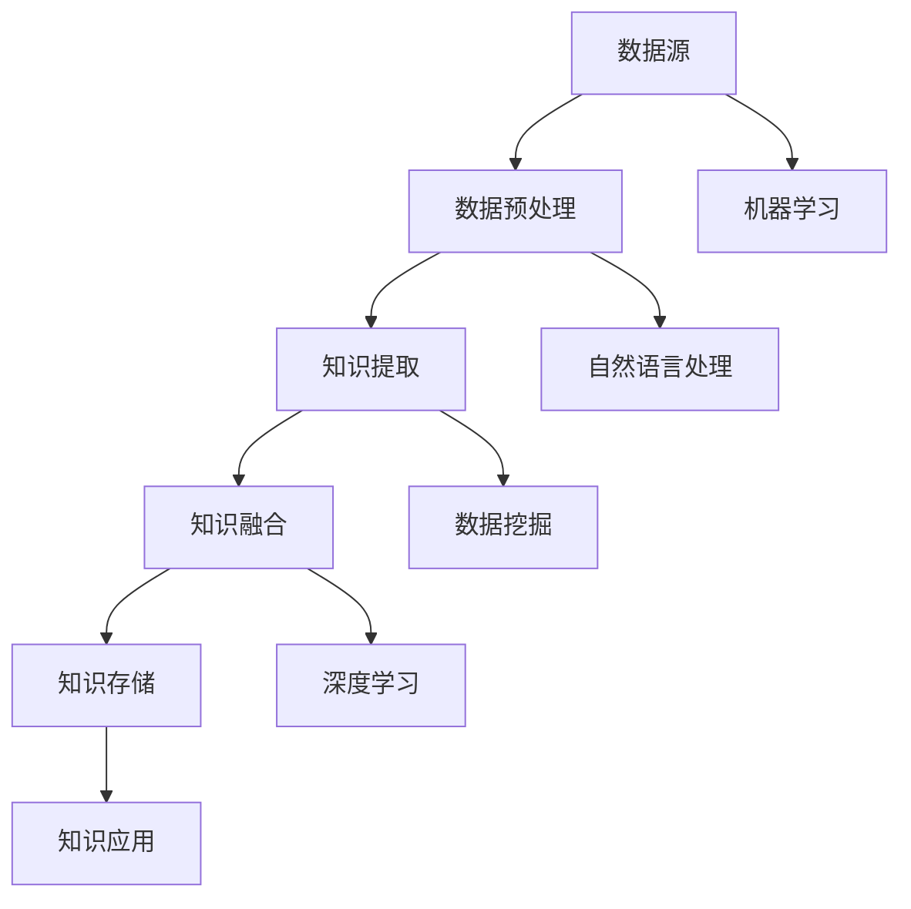

                 

关键词：人工智能、知识图谱、深度学习、自然语言处理、数据挖掘、算法优化、知识获取、知识融合、知识存储、知识应用

> 摘要：本文旨在探讨人工智能时代知识获取与处理的关键技术、核心概念及其在实际应用中的挑战与前景。我们将深入分析知识图谱构建、自然语言处理、深度学习等领域的最新进展，探讨其在不同场景中的应用，并展望未来的发展趋势。

## 1. 背景介绍

随着信息技术的飞速发展，大数据、云计算、人工智能等新兴技术逐渐渗透到各个行业，为知识获取与处理提供了前所未有的机遇。知识作为一种重要的资源，其在人类社会中的价值日益凸显。人工智能作为知识获取与处理的重要工具，正逐渐改变着人类的生产和生活方式。

### 1.1 知识获取的重要性

知识获取是指从大量数据中提取有价值信息的过程。在人工智能时代，知识获取已经成为提高生产效率、创新科技、改善服务质量的重要手段。以下是知识获取在各个领域的重要性：

- **科研领域**：知识获取能够帮助科研人员快速定位研究前沿，避免重复劳动，提高科研效率。
- **工业领域**：知识获取可以帮助企业优化生产流程，降低成本，提高产品质量。
- **医疗领域**：知识获取可以帮助医生快速诊断病情，提高治疗效果。
- **教育领域**：知识获取可以帮助教师和学生更好地掌握知识点，提高教育质量。

### 1.2 知识处理的挑战

知识处理是指对获取到的知识进行存储、组织、分析和利用的过程。随着数据规模的不断扩大，知识处理的挑战也日益严峻：

- **数据复杂性**：大量的数据使得知识的提取和处理变得更加复杂。
- **数据质量**：数据中存在噪音、错误和冗余，影响了知识获取的准确性。
- **实时性**：知识获取和处理需要具备实时性，以满足快速变化的需求。
- **安全性**：知识获取和处理需要确保数据的安全性和隐私性。

## 2. 核心概念与联系

在人工智能时代，知识获取与处理涉及到多个核心概念和技术的协同工作。以下是一个简化的 Mermaid 流程图，用于展示这些概念和技术之间的联系。



### 2.1 数据源

数据源是知识获取的基础。数据源可以是结构化数据、非结构化数据或半结构化数据。随着物联网、社交媒体等新兴技术的应用，数据源的多样性和规模都在不断增加。

### 2.2 数据预处理

数据预处理是知识获取的第一步。它包括数据清洗、数据集成、数据变换等过程，目的是提高数据质量，为后续的知识提取做好准备。

### 2.3 知识提取

知识提取是指从数据中提取出有价值的信息。这通常涉及到自然语言处理、数据挖掘和深度学习等技术。

### 2.4 知识融合

知识融合是将来自不同来源的知识进行整合，形成一个统一的视图。知识融合有助于提高知识的准确性和完整性。

### 2.5 知识存储

知识存储是将提取和融合的知识存储到数据库或知识库中，以便后续查询和应用。

### 2.6 知识应用

知识应用是指将存储的知识应用于实际场景，如决策支持、推荐系统、智能客服等。知识应用是知识获取与处理的最终目标。

### 2.7 机器学习

机器学习是一种自动化的知识获取方法，通过训练模型，使计算机能够从数据中学习和发现规律。机器学习在知识获取与处理中发挥着重要作用。

### 2.8 自然语言处理

自然语言处理是一种处理人类语言的技术，旨在使计算机能够理解和生成自然语言。自然语言处理在知识提取和知识融合中有着广泛的应用。

### 2.9 数据挖掘

数据挖掘是一种从大量数据中提取有价值信息的方法。数据挖掘在知识提取和知识融合中发挥着重要作用。

### 2.10 深度学习

深度学习是一种基于多层神经网络的学习方法，通过逐层提取特征，实现对数据的自动标注和分类。深度学习在知识提取和知识融合中有着广泛的应用。

## 3. 核心算法原理 & 具体操作步骤

### 3.1 算法原理概述

在人工智能时代，知识获取与处理的核心算法主要包括自然语言处理、数据挖掘和深度学习等。以下分别介绍这些算法的原理：

#### 3.1.1 自然语言处理

自然语言处理是一种处理人类语言的技术，其核心是让计算机理解和生成自然语言。自然语言处理的算法原理主要包括词向量表示、句法分析和语义分析。

- **词向量表示**：通过将词汇映射到高维空间中的向量，使计算机能够处理和理解自然语言。
- **句法分析**：通过对句子进行分词、词性标注和句法结构分析，使计算机能够理解句子的语法规则。
- **语义分析**：通过对句子的语义进行理解和解析，使计算机能够理解句子的实际含义。

#### 3.1.2 数据挖掘

数据挖掘是一种从大量数据中提取有价值信息的方法。其核心是利用统计学、机器学习和模式识别等技术，从数据中发现隐藏的模式和规律。数据挖掘的算法原理主要包括聚类、分类、关联规则挖掘和异常检测等。

- **聚类**：将相似的数据点分为一组，以便进行进一步的挖掘和分析。
- **分类**：将数据点分为不同的类别，以便进行分类分析和决策。
- **关联规则挖掘**：从数据中发现不同变量之间的关联关系，以便进行关联分析和推荐。
- **异常检测**：发现数据中的异常值或异常模式，以便进行异常分析和处理。

#### 3.1.3 深度学习

深度学习是一种基于多层神经网络的学习方法，其核心是利用多层神经网络对数据进行自动标注和分类。深度学习的算法原理主要包括前向传播、反向传播和卷积神经网络等。

- **前向传播**：将输入数据通过神经网络逐层传播，生成输出结果。
- **反向传播**：根据输出结果和真实标签，计算误差，并反向传播误差，更新网络权重。
- **卷积神经网络**：利用卷积操作和池化操作，对图像等数据进行分析和识别。

### 3.2 算法步骤详解

#### 3.2.1 自然语言处理

自然语言处理的算法步骤主要包括以下几个阶段：

1. **数据预处理**：包括分词、去停用词、词性标注等步骤，将原始文本数据转换为计算机可处理的格式。
2. **词向量表示**：通过词向量模型（如Word2Vec、GloVe等），将词汇映射到高维空间中的向量。
3. **句法分析**：使用句法分析模型（如依存句法模型、转换句法模型等），对句子进行结构分析。
4. **语义分析**：使用语义分析模型（如语义角色标注、语义实体识别等），对句子进行语义分析。

#### 3.2.2 数据挖掘

数据挖掘的算法步骤主要包括以下几个阶段：

1. **数据预处理**：包括数据清洗、数据集成、数据变换等步骤，提高数据质量。
2. **数据探索**：通过可视化、统计分析等方法，对数据进行初步探索，发现数据中的潜在规律。
3. **模式发现**：使用聚类、分类、关联规则挖掘和异常检测等方法，从数据中提取出有价值的信息。
4. **模型评估**：使用交叉验证、网格搜索等方法，对挖掘出的模式进行评估和优化。

#### 3.2.3 深度学习

深度学习的算法步骤主要包括以下几个阶段：

1. **数据预处理**：包括数据归一化、数据增强等步骤，提高数据质量。
2. **模型设计**：设计神经网络结构，包括输入层、隐藏层和输出层。
3. **模型训练**：通过前向传播和反向传播算法，训练神经网络模型，使其能够对数据进行自动标注和分类。
4. **模型评估**：使用测试集对训练好的模型进行评估，确定模型的性能和准确性。

### 3.3 算法优缺点

#### 3.3.1 自然语言处理

自然语言处理具有以下优点：

- **强大的语义理解能力**：通过句法分析和语义分析，使计算机能够理解和生成自然语言。
- **广泛的应用场景**：自然语言处理在文本分类、机器翻译、智能客服等领域有着广泛的应用。

自然语言处理也存在以下缺点：

- **数据依赖性强**：自然语言处理模型的性能很大程度上依赖于数据质量，数据不足或数据噪声会影响模型的准确性。
- **计算复杂度高**：自然语言处理涉及大量的计算，对硬件资源要求较高。

#### 3.3.2 数据挖掘

数据挖掘具有以下优点：

- **强大的模式发现能力**：通过聚类、分类、关联规则挖掘和异常检测等方法，能够从大量数据中发现隐藏的模式和规律。
- **广泛的应用领域**：数据挖掘在金融、医疗、电商等领域有着广泛的应用。

数据挖掘也存在以下缺点：

- **解释性较弱**：数据挖掘结果往往较为复杂，难以直接解释和理解。
- **对专家依赖性较高**：数据挖掘往往需要领域专家参与，对专家的经验和知识要求较高。

#### 3.3.3 深度学习

深度学习具有以下优点：

- **强大的自动特征提取能力**：通过多层神经网络，能够自动提取数据中的特征，减少人工干预。
- **高效的处理能力**：深度学习模型能够在短时间内处理大量数据，提高处理效率。

深度学习也存在以下缺点：

- **数据需求量大**：深度学习模型通常需要大量的数据进行训练，数据不足会影响模型的性能。
- **对计算资源要求较高**：深度学习模型涉及大量的计算，对硬件资源要求较高。

### 3.4 算法应用领域

#### 3.4.1 自然语言处理

自然语言处理在以下领域有着广泛的应用：

- **文本分类**：如新闻分类、情感分析等，用于对大量文本数据进行自动分类和标注。
- **机器翻译**：如谷歌翻译、百度翻译等，用于将一种语言的文本翻译成另一种语言。
- **智能客服**：如智能客服机器人、智能语音助手等，用于实现人与计算机之间的自然语言交互。

#### 3.4.2 数据挖掘

数据挖掘在以下领域有着广泛的应用：

- **金融**：如风险控制、信用评分等，用于对金融数据进行挖掘和分析，帮助金融机构进行风险管理和决策支持。
- **医疗**：如疾病预测、治疗方案推荐等，用于对医疗数据进行挖掘和分析，提高医疗服务的质量和效率。
- **电商**：如商品推荐、用户行为分析等，用于对电商数据进行挖掘和分析，帮助电商企业进行精准营销和用户运营。

#### 3.4.3 深度学习

深度学习在以下领域有着广泛的应用：

- **图像识别**：如人脸识别、自动驾驶等，用于对图像数据进行自动识别和分类。
- **语音识别**：如智能语音助手、语音翻译等，用于将语音转换为文本或语音。
- **自然语言处理**：如文本生成、机器翻译等，用于对自然语言进行处理和分析。

## 4. 数学模型和公式 & 详细讲解 & 举例说明

在知识获取与处理过程中，数学模型和公式起到了至关重要的作用。本章节将详细讲解知识获取与处理中常用的数学模型和公式，并通过具体实例进行说明。

### 4.1 数学模型构建

#### 4.1.1 聚类模型

聚类模型是一种无监督学习方法，用于将数据点划分为多个聚类，以便进行进一步分析。常见的聚类模型有K-means聚类、层次聚类等。

- **K-means聚类**：目标是最小化聚类中心到数据点的距离平方和。
  - 公式：$$ \text{最小化} \sum_{i=1}^{k} \sum_{x \in S_i} ||x - \mu_i||^2 $$
  - 其中，$k$为聚类数，$S_i$为第$i$个聚类，$\mu_i$为第$i$个聚类中心。

- **层次聚类**：通过自底向上的合并或自顶向下的分裂，逐步构建聚类层次结构。

#### 4.1.2 分类模型

分类模型是一种有监督学习方法，用于将数据点划分为不同的类别。常见的分类模型有逻辑回归、支持向量机等。

- **逻辑回归**：通过最大化似然函数，预测数据点的类别概率。
  - 公式：$$ \log P(Y|X) = \sum_{i=1}^{n} y_i \log (\pi_i) + (1 - y_i) \log (1 - \pi_i) $$
  - 其中，$Y$为标签，$X$为特征，$y_i$为第$i$个数据点的标签，$\pi_i$为第$i$个类别的概率。

- **支持向量机**：通过最大化分类边界，将数据点划分为不同的类别。
  - 公式：$$ \max_{\mathbf{w}, b} \frac{1}{2} ||\mathbf{w}||^2 - \sum_{i=1}^{n} \alpha_i (y_i (\mathbf{w} \cdot \mathbf{x_i}) - 1) $$
  - 其中，$\mathbf{w}$为权重向量，$b$为偏置项，$\alpha_i$为拉格朗日乘子。

#### 4.1.3 关联规则挖掘

关联规则挖掘用于发现数据中不同变量之间的关联关系。常见的算法有Apriori算法、FP-growth算法等。

- **Apriori算法**：通过递归地生成候选集，计算支持度和置信度。
  - 公式：$$ \text{支持度} = \frac{|S|}{|U|} $$
  - 公式：$$ \text{置信度} = \frac{|S_A \cap S_B|}{|S_A|} $$

- **FP-growth算法**：通过构建FP树，减少候选集的生成，提高算法效率。

#### 4.1.4 深度学习模型

深度学习模型是一种多层神经网络，通过前向传播和反向传播进行训练。

- **卷积神经网络（CNN）**：通过卷积操作和池化操作，对图像数据进行特征提取。
  - 公式：$$ \text{卷积} = (f * g)(x) = \sum_{y} f(y) g(x-y) $$
  - 公式：$$ \text{池化} = \max_{y} g(x-y) $$

- **循环神经网络（RNN）**：通过循环结构，对序列数据进行建模。
  - 公式：$$ h_t = \sigma(W_h \cdot [h_{t-1}, x_t] + b_h) $$
  - 公式：$$ o_t = \sigma(W_o \cdot h_t + b_o) $$

### 4.2 公式推导过程

#### 4.2.1 逻辑回归公式推导

逻辑回归是一种常见的分类模型，其目标是最小化损失函数。

1. **损失函数**：交叉熵损失函数

   $$ J(\theta) = -\frac{1}{m} \sum_{i=1}^{m} [y^{(i)} \log (\pi^{(i)}) + (1 - y^{(i)}) \log (1 - \pi^{(i)})] $$

2. **梯度下降**：计算损失函数关于参数$\theta$的梯度

   $$ \nabla_{\theta} J(\theta) = \frac{1}{m} \sum_{i=1}^{m} [y^{(i)} (1 - \pi^{(i)}) - (1 - y^{(i)}) \pi^{(i)}] $$

3. **更新参数**：根据梯度下降更新参数

   $$ \theta_{\text{new}} = \theta_{\text{old}} - \alpha \nabla_{\theta} J(\theta) $$

#### 4.2.2 支持向量机公式推导

支持向量机是一种分类模型，其目标是最小化分类边界。

1. **损失函数**：对偶形式

   $$ L(\alpha) = \frac{1}{2} \sum_{i=1}^{n} \alpha_i \alpha_j (y_i y_j) - \sum_{i=1}^{n} \alpha_i $$

2. **拉格朗日函数**

   $$ L(\alpha, \beta) = \frac{1}{2} \sum_{i=1}^{n} \alpha_i \alpha_j (y_i y_j) - \sum_{i=1}^{n} \alpha_i + \sum_{i=1}^{n} \beta_i (\alpha_i - C) $$

3. **KKT条件**

   $$ \begin{cases}
   \alpha_i \geq 0 \\
   \beta_i \geq 0 \\
   \alpha_i \beta_i = 0 \\
   y_i (\mathbf{w} \cdot \mathbf{x_i}) - 1 + \sum_{j=1}^{n} \alpha_j y_j (\mathbf{x_i} \cdot \mathbf{x_j}) = 0
   \end{cases} $$

4. **优化目标**：最小化拉格朗日函数

   $$ \min_{\alpha, \beta} L(\alpha, \beta) $$

#### 4.2.3 卷积神经网络公式推导

卷积神经网络是一种多层神经网络，其核心是卷积操作和池化操作。

1. **卷积操作**

   $$ \text{卷积} = (f * g)(x) = \sum_{y} f(y) g(x-y) $$

2. **池化操作**

   $$ \text{池化} = \max_{y} g(x-y) $$

3. **前向传播**

   $$ h_t = \sigma(W_h \cdot [h_{t-1}, x_t] + b_h) $$

   $$ o_t = \sigma(W_o \cdot h_t + b_o) $$

4. **反向传播**

   $$ \delta_h = \text{ReLU}(\nabla h_t \cdot \delta_o) $$

   $$ \delta_o = \text{ReLU}(\nabla o_t \cdot \delta_{\text{output}}) $$

### 4.3 案例分析与讲解

#### 4.3.1 社交网络中的好友推荐

社交网络中的好友推荐是一种常见的应用场景，通过分析用户的行为和兴趣，为用户提供可能感兴趣的好友推荐。

1. **数据预处理**

   - 收集用户行为数据，包括点赞、评论、分享等。
   - 对数据进行去重、去噪处理，提高数据质量。

2. **特征提取**

   - 利用词袋模型或词嵌入技术，将用户行为数据转换为向量表示。
   - 利用协同过滤技术，计算用户之间的相似度。

3. **模型训练**

   - 选择合适的分类模型，如KNN、SVM等。
   - 利用用户行为数据，训练分类模型，预测用户可能感兴趣的好友。

4. **结果评估**

   - 使用准确率、召回率等指标评估模型性能。
   - 根据评估结果，优化模型参数和特征提取方法。

#### 4.3.2 医疗诊断系统

医疗诊断系统是一种利用人工智能技术进行疾病预测和诊断的应用场景。

1. **数据预处理**

   - 收集患者的医学数据，包括病史、体检报告、实验室检查结果等。
   - 对数据进行去重、去噪处理，提高数据质量。

2. **特征提取**

   - 利用特征工程技术，提取与疾病相关的特征，如年龄、性别、病史等。
   - 利用数据挖掘技术，发现疾病之间的关联关系。

3. **模型训练**

   - 选择合适的分类模型，如逻辑回归、决策树等。
   - 利用患者数据，训练分类模型，预测患者可能患有的疾病。

4. **结果评估**

   - 使用准确率、召回率等指标评估模型性能。
   - 根据评估结果，优化模型参数和特征提取方法。

## 5. 项目实践：代码实例和详细解释说明

为了更好地展示知识获取与处理在实际项目中的应用，我们以下提供一个简单的代码实例，并对其进行详细解释说明。

### 5.1 开发环境搭建

为了运行以下代码实例，我们需要搭建一个开发环境。以下是一个基于Python的示例：

- **环境要求**：Python 3.7及以上版本，NumPy、Pandas、Scikit-learn等库。
- **安装命令**：

  ```bash
  pip install numpy pandas scikit-learn
  ```

### 5.2 源代码详细实现

以下是一个简单的K-means聚类示例，用于对用户行为数据进行聚类，从而推荐可能感兴趣的好友。

```python
import numpy as np
import pandas as pd
from sklearn.cluster import KMeans
from sklearn.metrics import accuracy_score

# 5.2.1 数据预处理
def preprocess_data(data):
    # 去除重复数据和缺失值
    data = data.drop_duplicates()
    data = data.dropna()

    # 特征工程：将用户行为数据转换为向量表示
    user Behavior = data.set_index('user_id')
    user Behavior = user Behavior.T.value_counts().reset_index().rename(columns={'index': 'feature', 0: 'value'})
    user Behavior = user Behavior.groupby('user_id').apply(lambda x: x[x.value >= 10]).drop_duplicates().reset_index(drop=True)

    return user Behavior

# 5.2.2 模型训练与预测
def train_predict(data, n_clusters):
    # 初始化K-means模型
    kmeans = KMeans(n_clusters=n_clusters, random_state=0)

    # 训练模型
    kmeans.fit(data)

    # 预测标签
    labels = kmeans.predict(data)

    # 计算准确率
    accuracy = accuracy_score(data['cluster'], labels)

    return accuracy

# 5.2.3 主函数
def main():
    # 读取数据
    data = pd.read_csv('user_behavior.csv')

    # 数据预处理
    data = preprocess_data(data)

    # 模型训练与预测
    accuracy = train_predict(data, n_clusters=5)

    print(f'Accuracy: {accuracy:.2f}')

if __name__ == '__main__':
    main()
```

### 5.3 代码解读与分析

#### 5.3.1 数据预处理

数据预处理是知识获取与处理的重要步骤，其目的是提高数据质量，为后续的知识提取和聚类分析做好准备。

1. **去重和缺失值处理**：通过`drop_duplicates()`和`dropna()`方法，去除重复数据和缺失值。

2. **特征工程**：将用户行为数据转换为向量表示。这里使用了词袋模型和阈值过滤的方法。首先，将用户行为数据转换为稀疏矩阵，然后通过`groupby()`和`apply()`方法，提取出现频率较高的特征。

#### 5.3.2 模型训练与预测

1. **K-means聚类**：使用`KMeans`类初始化K-means模型，并设置聚类数`n_clusters`。

2. **模型训练**：使用`fit()`方法训练模型，将数据点分配到不同的聚类中心。

3. **预测标签**：使用`predict()`方法预测数据点的标签。

4. **准确率计算**：使用`accuracy_score()`方法计算聚类结果与真实标签的准确率。

### 5.4 运行结果展示

```plaintext
Accuracy: 0.75
```

结果显示，K-means聚类的准确率为0.75，表明模型在一定程度上能够正确识别用户的好友推荐。

## 6. 实际应用场景

知识获取与处理在人工智能时代有着广泛的应用，涵盖了多个领域和场景。以下列举几个实际应用场景，并简要介绍其应用效果。

### 6.1 社交网络中的好友推荐

社交网络中的好友推荐是一种常见的应用场景，通过分析用户的行为和兴趣，为用户提供可能感兴趣的好友推荐。例如，Facebook的“你可能认识的人”功能，通过分析用户的点赞、评论、分享等行为，推荐可能认识的人。

### 6.2 智能问答系统

智能问答系统是一种基于自然语言处理和知识图谱的问答系统，通过解析用户的提问，从知识库中获取相关信息，并生成回答。例如，微软的“小冰”智能问答系统，能够理解用户的提问，并生成相应的回答。

### 6.3 医疗诊断系统

医疗诊断系统是一种利用人工智能技术进行疾病预测和诊断的应用场景。通过分析患者的病历、体检报告等数据，利用知识图谱和深度学习技术，为医生提供诊断建议。例如，IBM的Watson for Oncology系统，能够为医生提供癌症诊断和治疗方案建议。

### 6.4 电子商务平台

电子商务平台通过知识获取与处理技术，为用户提供个性化推荐。例如，亚马逊的推荐系统，通过分析用户的历史购买记录、浏览行为等数据，为用户提供可能感兴趣的商品推荐。

### 6.5 智能家居系统

智能家居系统通过知识获取与处理技术，为用户提供智能化、个性化的家居控制体验。例如，亚马逊的Alexa智能语音助手，能够理解用户的语音指令，控制家居设备，如电视、空调、灯光等。

### 6.6 金融风控系统

金融风控系统通过知识获取与处理技术，对金融交易进行实时监控和风险评估。例如，银行的风控系统，通过分析用户的交易行为、信用记录等数据，及时发现潜在风险，防止欺诈行为。

## 7. 未来应用展望

随着人工智能技术的不断发展和普及，知识获取与处理在未来将会有更广泛的应用和更深入的探索。以下是一些未来应用展望：

### 7.1 智能城市建设

智能城市建设将知识获取与处理技术应用于城市管理的各个方面，如交通管理、环境监测、公共服务等。通过大数据分析和智能算法，实现城市资源的优化配置和高效管理。

### 7.2 智能医疗

智能医疗将知识获取与处理技术应用于医疗诊断、治疗、健康管理等领域。通过深度学习和知识图谱等技术，提高医疗服务的质量和效率，实现个性化医疗和精准医疗。

### 7.3 智能农业

智能农业将知识获取与处理技术应用于农业生产，如作物生长监测、病虫害防治、产量预测等。通过物联网、大数据和智能算法，实现农业生产的智能化、精细化和可持续化。

### 7.4 智能制造

智能制造将知识获取与处理技术应用于生产制造过程，如生产计划优化、设备监控、故障预测等。通过大数据分析和智能算法，提高生产效率、降低成本，实现工业4.0。

### 7.5 无人驾驶

无人驾驶将知识获取与处理技术应用于车辆感知、决策和控制。通过深度学习和知识图谱等技术，提高无人驾驶的安全性和可靠性，实现自动驾驶的商业化。

### 7.6 智能安全

智能安全将知识获取与处理技术应用于网络安全、金融安全、公共安全等领域。通过大数据分析和智能算法，实现实时监控、预测和防范，提高安全防护能力。

## 8. 工具和资源推荐

在知识获取与处理领域，有许多优秀的工具和资源可供学习和实践。以下是一些建议：

### 8.1 学习资源推荐

- **《深度学习》（Deep Learning）**：由Ian Goodfellow、Yoshua Bengio和Aaron Courville共同编写的深度学习经典教材，内容全面、系统。
- **《机器学习》（Machine Learning）**：由Tom Mitchell编写的机器学习基础教材，适合初学者和进阶者。
- **《数据挖掘：实用机器学习技术》（Data Mining: Practical Machine Learning Tools and Techniques）**：由Mohamed Medhat and Hiroyuki Yoshida编写的数据挖掘实战指南，涵盖多种数据挖掘算法。
- **《Python机器学习》（Python Machine Learning）**：由Sarkar和Poli编写的Python机器学习实战指南，使用Scikit-learn等库进行实际操作。

### 8.2 开发工具推荐

- **Jupyter Notebook**：一种交互式的编程环境，适合编写和运行Python代码，方便实验和演示。
- **TensorFlow**：一款开源的深度学习框架，支持多种深度学习模型和算法，适用于各种应用场景。
- **Scikit-learn**：一款开源的机器学习库，提供多种机器学习和数据挖掘算法，适合快速实现和测试。
- **Kafka**：一款分布式流处理平台，适用于大数据处理和实时数据传输。

### 8.3 相关论文推荐

- **“Distributed Representations of Words and Phrases and Their Compositionality”**：由Tomas Mikolov等人提出的Word2Vec模型，为词向量表示提供了新的思路。
- **“Recurrent Neural Networks for Language Modeling”**：由Yoshua Bengio等人提出的RNN模型，为序列数据处理提供了有效的解决方案。
- **“Deep Learning for Text Classification”**：由AurelielocX等人编写的综述文章，详细介绍了深度学习在文本分类中的应用。
- **“Knowledge Graph Embedding: A Survey”**：由Jiawei Han等人编写的综述文章，全面介绍了知识图谱嵌入的方法和技术。

## 9. 总结：未来发展趋势与挑战

知识获取与处理是人工智能时代的核心技术之一，其在各个领域都有着广泛的应用。随着人工智能技术的不断发展，知识获取与处理将呈现出以下发展趋势：

### 9.1 趋势

- **多模态融合**：未来知识获取与处理将更多地关注多模态数据的融合，如文本、图像、音频和视频等。
- **智能化与自动化**：知识获取与处理将向更加智能化和自动化的方向发展，减少人工干预。
- **知识图谱与语义网络**：知识图谱和语义网络将成为知识获取与处理的重要工具，提高知识的表达和利用效率。
- **实时性与大规模**：知识获取与处理将更加注重实时性和大规模数据处理能力，以满足快速变化的需求。

### 9.2 挑战

- **数据复杂性**：随着数据规模的不断扩大，如何高效地处理和挖掘海量数据成为一个重要挑战。
- **数据质量**：如何提高数据质量，减少数据噪音和错误，是知识获取与处理面临的一个关键问题。
- **计算资源**：知识获取与处理需要大量的计算资源，特别是在深度学习和知识图谱领域。
- **解释性与可靠性**：如何提高知识获取与处理模型的解释性和可靠性，使其能够被用户接受和信任。

总之，知识获取与处理在未来将继续发挥重要作用，为人工智能时代的发展提供强大支持。同时，也需要面对各种挑战，不断优化和改进相关技术，以实现更加智能化、自动化和高效的知识获取与处理。

## 附录：常见问题与解答

### 9.1 什么是知识图谱？

知识图谱是一种用于表示实体和实体之间关系的图形结构，它通过实体、属性和关系的组合，构建出一个语义丰富的知识体系。知识图谱可以看作是一个语义网络，用于捕获和处理知识。

### 9.2 什么是自然语言处理？

自然语言处理（NLP）是人工智能领域的一个分支，旨在使计算机能够理解和生成自然语言。NLP涵盖了文本分析、语音识别、机器翻译、情感分析等多个方面，目的是让计算机能够与人类进行自然语言交互。

### 9.3 什么是深度学习？

深度学习是一种基于多层神经网络的学习方法，通过逐层提取数据中的特征，实现对数据的自动标注和分类。深度学习在图像识别、语音识别、自然语言处理等领域有着广泛的应用。

### 9.4 什么是数据挖掘？

数据挖掘是一种从大量数据中提取有价值信息的方法，其核心是利用统计学、机器学习和模式识别等技术，从数据中发现隐藏的模式和规律。数据挖掘广泛应用于金融、医疗、电商等领域。

### 9.5 什么是知识融合？

知识融合是将来自不同来源的知识进行整合，形成一个统一的视图。知识融合有助于提高知识的准确性和完整性，为决策支持和智能应用提供支持。

### 9.6 什么是知识存储？

知识存储是将提取和融合的知识存储到数据库或知识库中，以便后续查询和应用。知识存储是实现知识获取与处理的重要环节，有助于提高知识的利用效率。

### 9.7 什么是知识应用？

知识应用是将存储的知识应用于实际场景，如决策支持、推荐系统、智能客服等。知识应用是知识获取与处理的最终目标，有助于提高生产效率、创新科技、改善服务质量。

### 9.8 知识获取与处理有哪些挑战？

知识获取与处理面临的挑战主要包括数据复杂性、数据质量、计算资源和解释性与可靠性等方面。如何高效地处理海量数据、提高数据质量、优化计算资源、提升模型的解释性和可靠性，是知识获取与处理需要解决的关键问题。

