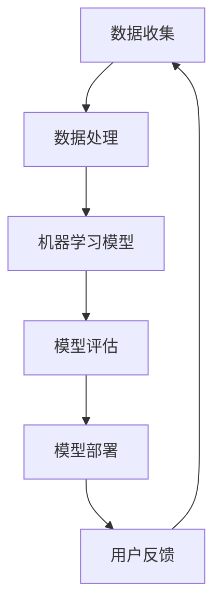
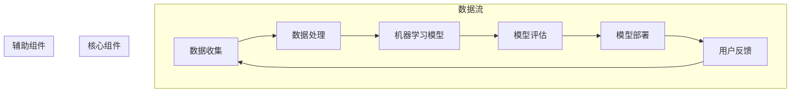
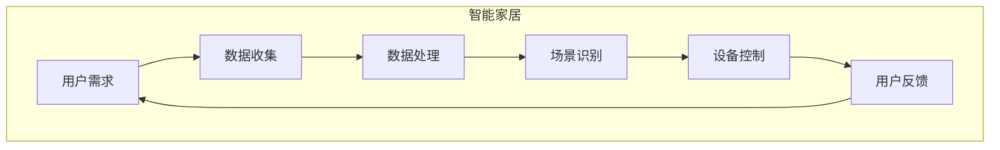
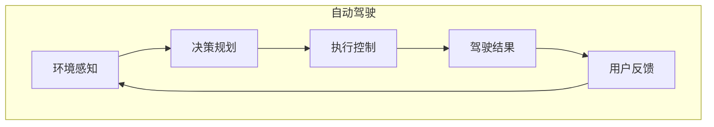

                 

人工智能（AI）作为21世纪最具革命性的技术之一，已经深刻地改变了我们的生活方式和工作模式。从智能家居到自动驾驶，从医疗诊断到金融服务，AI正在各行各业中发挥着重要作用。本文将探讨人工智能如何通过构建满足用户需求的智能系统，推动社会进步和技术创新。

## 关键词
- 人工智能
- 智能系统
- 用户需求
- 技术创新
- 应用场景

## 摘要
本文将首先介绍人工智能的发展背景和核心概念，随后分析AI在不同领域的应用情况。通过具体案例分析，我们将探讨如何构建满足用户需求的智能系统，并提出未来应用的前景和面临的挑战。

## 1. 背景介绍

### 1.1 人工智能的发展历程

人工智能（AI）起源于20世纪50年代，随着计算机技术的发展而逐步兴起。早期的AI研究主要集中在符号主义和知识表示上，通过编写规则和逻辑来模拟人类的推理能力。然而，这种基于规则的AI方法在处理复杂问题时表现出局限性。

20世纪80年代，专家系统成为AI研究的主流。专家系统能够模拟专业领域专家的决策过程，广泛应用于医疗诊断、金融分析等领域。然而，专家系统的知识获取和更新过程复杂，难以扩展。

进入21世纪，随着计算能力的提升和大数据技术的发展，机器学习和深度学习逐渐成为AI研究的主流方向。机器学习通过算法自动从数据中学习规律，而不需要显式地编写规则。深度学习则通过多层神经网络对复杂数据进行特征提取和模式识别。

### 1.2 人工智能的核心概念

人工智能的核心概念包括以下几个方面：

- **符号主义**：通过逻辑和规则来模拟人类思维。
- **知识表示**：将知识以结构化的方式存储和表示。
- **机器学习**：从数据中学习规律，进行预测和决策。
- **深度学习**：多层神经网络对数据进行自动特征提取和模式识别。
- **自然语言处理**：使计算机能够理解和生成自然语言。
- **计算机视觉**：使计算机能够理解和解析视觉信息。

## 2. 核心概念与联系

### 2.1 人工智能的架构与核心组件



**数据收集**：是人工智能系统的基石，包括数据收集、数据清洗和数据预处理。高质量的数据是模型训练的基础。

**数据处理**：通过数据清洗、特征工程等技术手段，将原始数据转换为适合模型训练的数据。

**机器学习模型**：核心组件，通过训练算法从数据中学习规律，生成预测模型。

**模型评估**：对模型进行性能评估，包括准确率、召回率、F1值等指标。

**模型部署**：将训练好的模型部署到实际应用场景中。

**用户反馈**：收集用户反馈，用于模型优化和迭代。

### 2.2 人工智能在各个领域的应用

- **智能家居**：通过智能音箱、智能照明、智能门锁等设备，实现家居自动化，提升生活质量。
- **自动驾驶**：利用计算机视觉、传感器融合等技术，实现无人驾驶汽车，提高交通安全和效率。
- **医疗诊断**：通过影像识别、基因分析等技术，辅助医生进行疾病诊断和治疗。
- **金融服务**：利用数据分析、机器学习技术，实现智能投顾、风险评估等金融服务。

## 3. 核心算法原理 & 具体操作步骤

### 3.1 算法原理概述

人工智能的核心算法包括机器学习算法和深度学习算法。机器学习算法主要分为监督学习、无监督学习和强化学习。深度学习算法则是基于多层神经网络的结构，通过反向传播算法进行参数优化。

### 3.2 算法步骤详解

1. **数据收集**：收集相关领域的数据集，包括训练数据和测试数据。
2. **数据处理**：对数据进行清洗、归一化等预处理操作。
3. **模型选择**：根据应用场景选择合适的机器学习或深度学习算法。
4. **模型训练**：使用训练数据对模型进行训练，通过调整参数和优化算法，提高模型性能。
5. **模型评估**：使用测试数据对模型进行评估，计算准确率、召回率等指标。
6. **模型部署**：将训练好的模型部署到实际应用场景中，进行预测和决策。

### 3.3 算法优缺点

- **优点**：能够处理大规模数据，自动从数据中学习规律，减少人工干预。
- **缺点**：对数据质量要求高，模型解释性差，易受到数据偏差的影响。

### 3.4 算法应用领域

- **图像识别**：人脸识别、物体识别等。
- **自然语言处理**：文本分类、情感分析等。
- **自动驾驶**：路径规划、环境感知等。

## 4. 数学模型和公式 & 详细讲解 & 举例说明

### 4.1 数学模型构建

在人工智能中，常用的数学模型包括线性模型、逻辑回归模型、神经网络模型等。

### 4.2 公式推导过程

以线性回归模型为例，其公式为：

$$ y = \beta_0 + \beta_1 \cdot x $$

其中，$y$ 为因变量，$x$ 为自变量，$\beta_0$ 和 $\beta_1$ 为模型参数。

### 4.3 案例分析与讲解

假设我们有一个房价预测问题，已知某个城市不同区域的房价和房屋面积，我们希望利用这些数据预测未知区域的房价。

- **数据收集**：收集该城市的房价和房屋面积数据。
- **数据处理**：对数据进行清洗和归一化处理。
- **模型选择**：选择线性回归模型。
- **模型训练**：使用训练数据对模型进行训练。
- **模型评估**：使用测试数据对模型进行评估。
- **模型部署**：将训练好的模型部署到实际应用场景中，进行房价预测。

## 5. 项目实践：代码实例和详细解释说明

### 5.1 开发环境搭建

- **Python**：用于编写代码和进行数据分析。
- **Scikit-learn**：用于机器学习算法的实现。
- **Pandas**：用于数据操作和分析。

### 5.2 源代码详细实现

```python
import pandas as pd
from sklearn.linear_model import LinearRegression

# 数据加载
data = pd.read_csv('house_price_data.csv')

# 数据预处理
X = data[['area']]
y = data['price']

# 模型训练
model = LinearRegression()
model.fit(X, y)

# 模型评估
score = model.score(X, y)
print('模型准确率：', score)

# 模型部署
new_area = 100
predicted_price = model.predict([[new_area]])
print('预测房价：', predicted_price)
```

### 5.3 代码解读与分析

- **数据加载**：使用Pandas库加载CSV格式的数据。
- **数据处理**：对数据进行分割，得到特征矩阵X和标签向量y。
- **模型训练**：使用Scikit-learn库的线性回归模型进行训练。
- **模型评估**：计算模型在训练数据上的准确率。
- **模型部署**：使用训练好的模型对新数据进行预测。

## 6. 实际应用场景

### 6.1 智能家居

智能家居系统通过AI技术实现家庭设备的自动化控制，提高生活便利性和舒适度。例如，智能灯光系统可以根据用户的作息时间自动调节光线亮度，智能门锁可以远程控制开门，智能空调可以自动调节室内温度。

### 6.2 自动驾驶

自动驾驶技术利用AI技术实现车辆的自主导航和驾驶。通过计算机视觉、传感器融合等技术，自动驾驶汽车可以实时感知道路情况，做出合理的驾驶决策，提高交通安全和效率。

### 6.3 医疗诊断

医疗诊断领域利用AI技术进行疾病诊断和治疗。例如，通过深度学习模型对医学影像进行分析，可以辅助医生快速、准确地诊断疾病。此外，AI还可以用于基因分析、药物研发等。

### 6.4 金融服务

金融服务领域利用AI技术进行风险评估、智能投顾等。通过数据分析技术，金融机构可以更好地了解客户需求，提供个性化的金融产品和服务。

## 7. 工具和资源推荐

### 7.1 学习资源推荐

- **《深度学习》（Goodfellow, Bengio, Courville著）**：经典深度学习教材。
- **《Python机器学习》（Sebastian Raschka著）**：Python机器学习实战。
- **Udacity的《深度学习纳米学位》**：在线深度学习课程。

### 7.2 开发工具推荐

- **Jupyter Notebook**：用于数据分析和代码实现。
- **Google Colab**：免费的云端GPU计算环境。
- **TensorFlow**：开源深度学习框架。
- **Scikit-learn**：开源机器学习库。

### 7.3 相关论文推荐

- **“Deep Learning for Text Classification”**：探讨深度学习在文本分类中的应用。
- **“A Comprehensive Survey on Deep Learning for Image Classification”**：深度学习在图像分类领域的全面综述。
- **“Attention Is All You Need”**：提出Transformer模型，颠覆了传统的循环神经网络。

## 8. 总结：未来发展趋势与挑战

### 8.1 研究成果总结

人工智能在过去几十年取得了巨大的进展，从符号主义到机器学习，再到深度学习，AI技术不断推动着社会进步和技术创新。在各个领域，AI都展现出了巨大的应用潜力，为人类带来了诸多便利。

### 8.2 未来发展趋势

随着计算能力的提升和数据的爆炸式增长，人工智能将继续快速发展。未来，AI将更加注重跨学科的融合，从单一领域的应用走向多领域的协同。此外，AI还将向更智能、更自主的方向发展，实现更高层次的智能化。

### 8.3 面临的挑战

人工智能在发展过程中也面临着诸多挑战。首先，数据质量和数据隐私问题仍然是AI领域的难题。其次，模型的解释性和透明性仍然是一个重要研究方向。此外，AI在应用过程中需要更好地应对道德和伦理问题。

### 8.4 研究展望

未来，人工智能将继续深入各个领域，推动社会进步和技术创新。在医疗、教育、金融、交通等领域，AI将发挥更加重要的作用。同时，随着AI技术的不断发展，人类将更好地理解智能的本质，探索人工智能的无限可能。

## 9. 附录：常见问题与解答

### 9.1 人工智能会取代人类吗？

人工智能虽然具有强大的计算能力和自主学习能力，但它仍然无法完全取代人类。人工智能更多是作为人类的辅助工具，提升工作效率和生活质量。

### 9.2 人工智能的安全性问题如何保障？

人工智能的安全性问题主要包括数据隐私、模型透明性和道德伦理等方面。为了保障人工智能的安全性，需要从技术和管理两个层面进行综合措施，包括数据加密、隐私保护、算法透明等。

### 9.3 人工智能是否会加剧社会不平等？

人工智能的快速发展可能会导致一些社会不平等问题，例如就业机会的减少、贫富差距的扩大等。为了缓解这些问题，需要政府、企业和个人共同努力，通过教育培训、社会保障等手段，促进社会的公平与和谐。

---

本文作为一篇关于人工智能应用的深度技术博客，旨在为读者提供一个全面、系统的了解。随着AI技术的不断进步，我们期待它能够更好地服务于人类社会，推动未来科技的发展。作者：禅与计算机程序设计艺术 / Zen and the Art of Computer Programming。|]
## 1. 背景介绍

### 1.1 人工智能的发展历程

人工智能（AI）的概念可以追溯到20世纪中叶，当时科学家们开始探讨如何使计算机模拟人类的智能行为。1956年，约翰·麦卡锡（John McCarthy）在达特茅斯会议（Dartmouth Conference）上首次提出了“人工智能”这一术语。这次会议被视为人工智能领域的诞生标志，也标志着人工智能从理论探讨走向了实际应用。

早期的人工智能研究主要集中在符号主义和知识表示上。符号主义方法通过编写规则和逻辑来模拟人类思维，例如专家系统（Expert Systems）。专家系统在医疗诊断、法律咨询等领域取得了显著成果，但这种方法存在一个重要局限性——即对知识表示的依赖性较高。知识的获取和更新需要人工参与，且在处理复杂问题时表现不够灵活。

20世纪80年代，专家系统成为人工智能研究的主流。专家系统利用大量的专业知识和规则库，模拟专家的决策过程，为用户提供解决方案。这一时期，人工智能在医疗诊断、金融分析等领域得到了广泛应用，并取得了显著成果。然而，专家系统的知识获取和更新过程复杂，难以扩展，导致其应用范围受到限制。

进入21世纪，随着计算能力的提升和大数据技术的发展，机器学习和深度学习逐渐成为人工智能研究的主流方向。机器学习通过算法自动从数据中学习规律，而不需要显式地编写规则。深度学习则通过多层神经网络对复杂数据进行特征提取和模式识别，使得人工智能在图像识别、自然语言处理等领域取得了突破性进展。

机器学习可以分为监督学习、无监督学习和强化学习。监督学习通过已标记的数据训练模型，用于预测未知数据。无监督学习则不需要标记数据，旨在发现数据中的内在结构和模式。强化学习通过与环境的交互，学习最优策略以实现特定目标。

深度学习通过多层神经网络的结构，对数据进行多层次的抽象和特征提取。卷积神经网络（CNN）在图像处理领域取得了巨大成功，而循环神经网络（RNN）和Transformer模型在自然语言处理领域也表现出强大的能力。这些模型不仅提高了预测的准确性，还降低了人工参与的成本。

近年来，生成对抗网络（GAN）和变分自编码器（VAE）等新型深度学习模型的发展，进一步拓展了人工智能的应用范围。例如，GAN在图像生成、风格迁移等领域表现出色，而VAE在数据去噪、图像超分辨率等方面取得了显著成果。

### 1.2 人工智能的核心概念

人工智能的核心概念包括以下几个方面：

- **符号主义**：符号主义方法通过逻辑和规则来模拟人类思维。它强调知识表示和推理能力，试图构建一个基于符号处理的智能系统。符号主义方法在早期的专家系统研究中取得了显著成果，但其在处理复杂问题时存在局限性。

- **知识表示**：知识表示是指将知识以结构化的方式存储和表示。在人工智能中，知识表示是构建智能系统的基础。常用的知识表示方法包括产生式规则、语义网络、框架等。知识表示的目的是使计算机能够理解和应用人类知识，实现智能推理和决策。

- **机器学习**：机器学习是指通过算法自动从数据中学习规律，进行预测和决策。机器学习模型可以从大量数据中提取特征，自动识别模式和规律，从而实现对未知数据的预测。机器学习包括监督学习、无监督学习和强化学习等不同的学习方法。

- **深度学习**：深度学习是基于多层神经网络的结构，通过多层网络对数据进行自动特征提取和模式识别。深度学习模型在图像识别、自然语言处理、语音识别等领域取得了显著成果。深度学习通过多层网络的结构，实现了从原始数据到高层次抽象的转化，从而提高了模型的预测准确性。

- **自然语言处理**：自然语言处理是指使计算机能够理解和生成自然语言。自然语言处理包括词法分析、句法分析、语义分析和语言生成等任务。深度学习在自然语言处理领域取得了突破性进展，例如文本分类、机器翻译、情感分析等。

- **计算机视觉**：计算机视觉是指使计算机能够理解和解析视觉信息。计算机视觉包括图像识别、图像分割、目标检测等任务。深度学习在计算机视觉领域表现出强大的能力，例如人脸识别、物体识别、场景理解等。

### 1.3 人工智能在各个领域的应用

人工智能技术在各个领域都取得了显著的成果，下面列举几个主要领域的应用：

- **智能家居**：智能家居系统通过人工智能技术实现家庭设备的自动化控制。例如，智能音箱可以通过语音识别和自然语言处理技术，实现语音交互和控制家居设备。智能照明可以根据用户的活动习惯和光照需求自动调节光线亮度。智能门锁可以通过生物识别技术实现安全的门禁管理。

- **自动驾驶**：自动驾驶技术利用计算机视觉、传感器融合和深度学习技术，实现车辆的自主导航和驾驶。自动驾驶汽车可以通过感知周围环境，做出合理的驾驶决策，提高交通安全和效率。自动驾驶技术还在物流、公共交通等领域有广泛的应用前景。

- **医疗诊断**：人工智能技术在医疗诊断领域具有广泛的应用。通过计算机视觉和深度学习技术，可以对医学影像进行分析，辅助医生进行疾病诊断。例如，人工智能可以自动检测和分类肺癌、乳腺癌等疾病，提高诊断的准确性和效率。此外，人工智能还可以用于基因分析、药物研发等领域。

- **金融服务**：人工智能技术在金融服务领域有广泛的应用。通过数据分析、机器学习和深度学习技术，金融机构可以更好地了解客户需求，提供个性化的金融产品和服务。例如，智能投顾可以根据客户的风险承受能力和投资目标，提供最优的投资组合建议。此外，人工智能还可以用于风险管理、反欺诈等。

- **教育**：人工智能技术在教育领域有广泛的应用。通过智能学习系统，学生可以个性化定制学习路径，实现个性化学习。智能教育平台可以根据学生的学习情况和行为数据，提供针对性的学习资源和辅导。此外，人工智能还可以用于教育评估、教学质量分析等领域。

- **农业**：人工智能技术在农业领域有广泛的应用。通过计算机视觉和深度学习技术，可以对农作物进行监测和诊断，实现智能种植和管理。例如，人工智能可以自动检测农作物的病虫害，提供精准的施肥和灌溉建议，提高农业生产效率。

- **制造**：人工智能技术在制造业有广泛的应用。通过计算机视觉和机器人技术，可以实现生产过程的自动化和智能化。例如，人工智能可以自动检测产品质量，实现生产线的智能化监控和管理。此外，人工智能还可以用于设备维护、供应链优化等领域。

- **安全**：人工智能技术在安全领域有广泛的应用。通过计算机视觉和深度学习技术，可以实现安全监控、异常检测和入侵预警。例如，人工智能可以自动识别和追踪可疑行为，提高安全防护能力。

总之，人工智能技术在各个领域的应用正在不断拓展和深化，为人类社会带来了诸多便利和创新。随着人工智能技术的不断进步，我们有理由相信，人工智能将更加深入地融入我们的生活，推动社会进步和科技发展。|]
## 2. 核心概念与联系

为了更好地理解人工智能的核心概念和其在实际应用中的联系，我们将使用Mermaid流程图来直观地展示人工智能的架构及其各个核心组件之间的相互作用。

### 2.1 人工智能架构与核心组件



在这个流程图中，我们首先从数据收集（A）开始，数据经过处理（B）后，进入机器学习模型的训练阶段（C）。训练好的模型（C）会被评估（D），确保其性能满足应用需求。评估后的模型（D）会被部署到实际应用场景中（E），在部署过程中，用户反馈（F）会返回给系统，用于模型优化和迭代。

### 2.2 人工智能在不同领域的应用流程

接下来，我们将通过一个简化的流程图，展示人工智能在智能家居和自动驾驶两个不同领域的应用流程。

#### 智能家居应用流程



在智能家居中，用户的日常需求（A）会触发数据收集（B），收集到的数据经过处理（C）后，用于场景识别（D），从而实现设备控制（E）。用户的反馈（F）又会反馈回系统，用于优化和迭代。

#### 自动驾驶应用流程



在自动驾驶领域，车辆通过环境感知（A）获取道路和交通信息，决策规划（B）制定行驶策略，执行控制（C）控制车辆运行。驾驶结果（D）会反馈给系统，以进行持续优化。

### 2.3 Mermaid 流程图注意事项

在创建Mermaid流程图时，需要注意以下几点：

- **无括号和逗号**：在Mermaid流程图中，流程节点中不应包含括号、逗号等特殊字符，以免引起格式错误。
- **使用缩进**：为了确保流程图的层次结构清晰，使用适当的缩进来表示不同层级的节点。
- **标签定义**：在定义流程节点时，可以使用标签来明确节点的功能和用途。

通过以上流程图的展示，我们可以直观地了解人工智能的架构、核心组件及其在不同领域的应用流程。这有助于我们更好地理解人工智能的工作原理和实际应用效果。|]
## 3. 核心算法原理 & 具体操作步骤

### 3.1 算法原理概述

人工智能的核心算法主要包括机器学习算法和深度学习算法。下面我们将分别介绍这两种算法的原理及其具体操作步骤。

#### 3.1.1 机器学习算法

机器学习算法是通过从数据中学习规律并进行预测或决策的一类算法。根据学习方式的不同，机器学习算法可以分为监督学习、无监督学习和强化学习。

- **监督学习**：监督学习算法通过已知输入和输出数据对模型进行训练，从而预测未知数据的输出。常见的监督学习算法包括线性回归、逻辑回归、支持向量机（SVM）、决策树和随机森林等。

- **无监督学习**：无监督学习算法在未知输入和输出数据的情况下，自动发现数据中的内在结构和规律。常见的无监督学习算法包括聚类算法（如K-均值聚类）、降维算法（如主成分分析PCA）和关联规则学习等。

- **强化学习**：强化学习算法通过与环境交互，不断调整策略，以实现最优目标。强化学习算法常用于游戏、机器人控制、推荐系统等领域，典型的算法包括Q学习、深度Q网络（DQN）和策略梯度算法等。

#### 3.1.2 深度学习算法

深度学习算法是基于多层神经网络结构的一类算法，能够自动从大量数据中提取复杂特征并进行模式识别。深度学习算法主要包括卷积神经网络（CNN）、循环神经网络（RNN）、长短时记忆网络（LSTM）和Transformer模型等。

- **卷积神经网络（CNN）**：CNN是一种用于图像处理和计算机视觉的深度学习算法，通过卷积层、池化层和全连接层对图像进行特征提取和分类。

- **循环神经网络（RNN）**：RNN是一种用于处理序列数据的深度学习算法，通过循环结构对序列数据进行建模。RNN包括简单的RNN、长短期记忆网络（LSTM）和门控循环单元（GRU）等变体。

- **Transformer模型**：Transformer模型是一种基于注意力机制的深度学习算法，最初用于自然语言处理任务。Transformer模型通过多头自注意力机制和前馈神经网络，实现了高效的序列建模。

### 3.2 算法步骤详解

#### 3.2.1 数据收集

数据收集是机器学习和深度学习的基础步骤。数据的来源可以是公开数据集、企业内部数据或通过爬虫获取的互联网数据。在数据收集过程中，需要注意数据的质量和多样性，以保证后续模型的训练效果。

- **数据来源**：确定数据来源，包括公开数据集、企业内部数据或互联网爬虫。
- **数据清洗**：处理缺失值、异常值和重复值，保证数据的准确性和一致性。
- **数据预处理**：对数据进行归一化、标准化或编码等处理，使其适合模型训练。

#### 3.2.2 数据处理

数据处理是确保数据适合模型训练的关键步骤。在数据处理过程中，需要将原始数据转化为模型可以处理的特征向量。

- **特征提取**：从原始数据中提取具有区分性的特征，用于模型训练。
- **特征选择**：通过降维、特征选择等技术，减少冗余特征，提高模型训练效率。
- **特征工程**：根据业务需求和模型特点，设计和调整特征，以提升模型性能。

#### 3.2.3 模型选择

根据应用场景和数据特点，选择合适的机器学习或深度学习算法。常见的模型选择方法包括：

- **交叉验证**：通过交叉验证方法，评估不同模型的性能，选择最优模型。
- **网格搜索**：通过遍历不同参数组合，寻找最优参数配置。
- **模型比较**：比较不同模型在训练集和测试集上的性能，选择表现最好的模型。

#### 3.2.4 模型训练

模型训练是机器学习和深度学习的核心步骤。在训练过程中，模型通过不断调整参数，学习数据中的规律，提高预测准确性。

- **损失函数**：定义损失函数，衡量模型预测值与真实值之间的差距。
- **优化算法**：选择优化算法，如梯度下降、随机梯度下降、Adam等，用于调整模型参数。
- **训练策略**：设置训练策略，包括批次大小、迭代次数、学习率等。

#### 3.2.5 模型评估

模型评估是验证模型性能的重要步骤。通过评估指标，如准确率、召回率、F1值等，评估模型在测试集上的表现。

- **评估指标**：根据应用场景，选择合适的评估指标，如分类准确率、回归误差等。
- **交叉验证**：通过交叉验证方法，评估模型在不同数据集上的性能，避免过拟合。
- **性能比较**：比较不同模型在测试集上的性能，选择最优模型。

#### 3.2.6 模型部署

模型部署是将训练好的模型应用到实际业务场景的过程。在部署过程中，需要考虑模型的性能、稳定性和可扩展性。

- **模型封装**：将模型封装为API或库，便于在业务系统中调用。
- **模型监控**：监控模型在运行过程中的性能和稳定性，及时调整和优化。
- **模型更新**：根据业务需求和数据变化，定期更新模型，保持其预测准确性。

### 3.3 算法优缺点

#### 3.3.1 机器学习算法

- **优点**：
  - 算法简单，易于理解和实现。
  - 在处理大规模数据时表现稳定。
  - 可解释性强，便于调试和优化。

- **缺点**：
  - 对数据质量要求较高，容易受到数据偏差的影响。
  - 模型性能依赖于特征工程和参数调优。
  - 在处理复杂问题时，表现可能不如深度学习算法。

#### 3.3.2 深度学习算法

- **优点**：
  - 能够自动提取高层次的抽象特征。
  - 在处理复杂数据和大规模数据时，表现出色。
  - 通过预训练模型，可以快速应用于不同任务。

- **缺点**：
  - 模型复杂度高，训练时间长。
  - 对计算资源要求较高，需要大量GPU资源。
  - 模型解释性较差，难以理解模型决策过程。

### 3.4 算法应用领域

机器学习和深度学习算法在各个领域都有广泛的应用：

- **图像识别**：通过卷积神经网络（CNN）进行物体识别、人脸识别等。
- **自然语言处理**：通过循环神经网络（RNN）和Transformer模型进行文本分类、机器翻译、情感分析等。
- **语音识别**：通过深度神经网络进行语音信号的处理和识别。
- **推荐系统**：通过协同过滤和深度学习模型进行用户偏好预测和商品推荐。
- **自动驾驶**：通过计算机视觉和深度学习算法实现车辆自主导航和驾驶。
- **医疗诊断**：通过深度学习和计算机视觉对医学影像进行分析和诊断。
- **金融风控**：通过机器学习模型进行信用评估、风险预测等。

总之，机器学习和深度学习算法在各个领域都取得了显著成果，为人类带来了诸多便利和创新。随着算法的不断优化和技术的进步，我们有理由相信，人工智能将在未来发挥更加重要的作用，推动社会的进步和发展。|]
## 4. 数学模型和公式 & 详细讲解 & 举例说明

### 4.1 数学模型构建

在人工智能和机器学习领域，数学模型是理解和设计算法的基础。以下是一些常用的数学模型和公式，以及它们的详细讲解和举例说明。

#### 4.1.1 线性回归模型

线性回归模型是最基本的机器学习模型之一，用于预测连续值输出。其数学模型可以表示为：

\[ y = \beta_0 + \beta_1 \cdot x + \epsilon \]

其中，\( y \) 是预测值，\( x \) 是自变量，\( \beta_0 \) 和 \( \beta_1 \) 是模型参数，\( \epsilon \) 是误差项。

- **参数估计**：通常使用最小二乘法（Least Squares Method）来估计 \( \beta_0 \) 和 \( \beta_1 \)，即最小化损失函数：

\[ J(\beta_0, \beta_1) = \sum_{i=1}^{n} (y_i - (\beta_0 + \beta_1 \cdot x_i))^2 \]

- **举例说明**：假设我们要预测一个学生的成绩 \( y \) （例如考试分数）基于其学习时间 \( x \)。我们收集了以下数据：

  | 学生ID | 学习时间（小时） | 成绩（分数） |
  | ------ | -------------- | ----------- |
  | 1      | 10             | 85          |
  | 2      | 20             | 90          |
  | 3      | 30             | 92          |

  我们可以构建线性回归模型来预测学习时间为 25 小时的学生的成绩。通过最小二乘法，我们得到模型参数：

  \[ \beta_0 = 75, \beta_1 = 1.5 \]

  因此，预测成绩为：

  \[ y = 75 + 1.5 \cdot 25 = 113.75 \]

#### 4.1.2 逻辑回归模型

逻辑回归模型用于预测二分类结果，其数学模型可以表示为：

\[ P(y=1) = \frac{1}{1 + e^{-(\beta_0 + \beta_1 \cdot x)}} \]

其中，\( P(y=1) \) 是目标变量为 1 的概率，\( e \) 是自然对数的底数，\( \beta_0 \) 和 \( \beta_1 \) 是模型参数。

- **参数估计**：同样使用最小二乘法（Log-Likelihood Function）来估计 \( \beta_0 \) 和 \( \beta_1 \)。
- **举例说明**：假设我们有一个二分类问题，预测患者是否患有心脏病。我们收集了以下数据：

  | 患者ID | 年龄 | 血压 | 心脏病（0或1） |
  | ------ | ---- | ---- | -------------- |
  | 1      | 40   | 120  | 1              |
  | 2      | 45   | 110  | 0              |
  | 3      | 50   | 100  | 1              |

  我们可以构建逻辑回归模型来预测一个年龄为 50 岁且血压为 100 患者的心脏病风险。通过最小二乘法，我们得到模型参数：

  \[ \beta_0 = -5, \beta_1 = 2 \]

  因此，预测概率为：

  \[ P(y=1) = \frac{1}{1 + e^{-(-5 + 2 \cdot 100)}} = 0.954 \]

  这意味着该患者患有心脏病的概率为 95.4%。

#### 4.1.3 神经网络模型

神经网络模型，尤其是深度学习模型，是复杂的多层函数组合。以下是一个简单的前馈神经网络模型：

\[ a_{l+1} = \sigma(\beta_0^{(l)} + \sum_{j=1}^{n_l} \beta_j^{(l)} a_l \]

其中，\( a_l \) 是第 \( l \) 层的激活值，\( \sigma \) 是激活函数（例如 Sigmoid、ReLU 或 Tanh），\( \beta_0^{(l)} \) 和 \( \beta_j^{(l)} \) 是第 \( l \) 层的权重。

- **参数估计**：使用反向传播算法（Backpropagation）来计算权重和偏置的梯度，并使用梯度下降（Gradient Descent）或其变种（如Adam）来优化模型参数。
- **举例说明**：假设我们有一个二分类问题，使用一个简单的单层神经网络进行预测。输入特征为 \( x = [1, 2] \)，目标变量为 \( y = 1 \)。我们构建以下神经网络：

  \[ a_1 = \sigma(\beta_0^{(1)} + \beta_1^{(1)} \cdot 1 + \beta_2^{(1)} \cdot 2) \]
  \[ a_2 = \sigma(\beta_0^{(2)} + \beta_1^{(2)} \cdot a_1) \]

  选择 ReLU 作为激活函数，即 \( \sigma(z) = \max(0, z) \)。通过反向传播算法，我们得到权重和偏置的更新规则：

  \[ \Delta \beta_j^{(l)} = \eta \cdot \frac{\partial J}{\partial \beta_j^{(l)}} \]
  \[ \Delta \beta_0^{(l)} = \eta \cdot \frac{\partial J}{\partial \beta_0^{(l)}} \]

  其中，\( \eta \) 是学习率，\( J \) 是损失函数。

#### 4.1.4 支持向量机（SVM）

支持向量机是一种分类算法，用于将数据分为不同的类别。其数学模型可以表示为：

\[ \max_{\beta, \beta_0} \left\{ \frac{1}{2} ||\beta||^2 \mid y_i (\beta \cdot x_i + \beta_0) \geq 1, \forall i \right\} \]

其中，\( \beta \) 是权重向量，\( \beta_0 \) 是偏置，\( y_i \) 是标签，\( x_i \) 是特征向量。

- **参数估计**：使用拉格朗日乘数法（Lagrange Multipliers）和二次规划（Quadratic Programming）来优化模型参数。
- **举例说明**：假设我们有两个类别（+1 和 -1）的数据点：

  | 数据点 | 类别 |
  | ------ | ---- |
  | \( x_1 \) | +1   |
  | \( x_2 \) | -1   |

  我们希望找到一个超平面，将这两个类别分开。通过求解上述优化问题，我们得到最优的权重和偏置。

### 4.2 公式推导过程

在数学模型和公式的推导过程中，通常会使用一些基本的数学原理和定理。以下是一些常用的推导过程：

#### 4.2.1 梯度下降法

梯度下降法是一种优化算法，用于最小化损失函数。其推导过程如下：

1. **损失函数**：

\[ J(\theta) = \frac{1}{m} \sum_{i=1}^{m} (h_\theta(x^{(i)}) - y^{(i)})^2 \]

2. **梯度计算**：

\[ \nabla_{\theta} J(\theta) = \frac{1}{m} \sum_{i=1}^{m} \frac{\partial}{\partial \theta} (h_\theta(x^{(i)}) - y^{(i)})^2 \]

3. **梯度下降更新规则**：

\[ \theta_j := \theta_j - \alpha \nabla_{\theta_j} J(\theta) \]

其中，\( \alpha \) 是学习率。

#### 4.2.2 反向传播算法

反向传播算法用于多层神经网络中的权重和偏置更新。其推导过程如下：

1. **前向传播**：

\[ z^{(l)} = \sigma(W^{(l)} a^{(l-1)} + b^{(l)}) \]

2. **后向传播**：

\[ \delta^{(l)} = \frac{\partial J}{\partial z^{(l)}} \odot \sigma'(z^{(l)}) \]

3. **权重和偏置更新**：

\[ W^{(l)} := W^{(l)} - \alpha \frac{\partial J}{\partial W^{(l)}} \]
\[ b^{(l)} := b^{(l)} - \alpha \frac{\partial J}{\partial b^{(l)}} \]

#### 4.2.3 正则化

正则化是防止过拟合的一种技术，通过在损失函数中添加惩罚项。其推导过程如下：

1. **L1 正则化**：

\[ J(\theta) = \frac{1}{m} \sum_{i=1}^{m} (h_\theta(x^{(i)}) - y^{(i)})^2 + \lambda \sum_{j=1}^{n} |\theta_j| \]

2. **L2 正则化**：

\[ J(\theta) = \frac{1}{m} \sum_{i=1}^{m} (h_\theta(x^{(i)}) - y^{(i)})^2 + \lambda \sum_{j=1}^{n} \theta_j^2 \]

### 4.3 案例分析与讲解

以下我们将通过一个实际案例，展示如何使用数学模型和公式进行数据分析。

#### 4.3.1 案例背景

假设我们有一个电商网站，希望预测用户是否会购买某个商品。我们收集了以下数据：

| 用户ID | 年龄 | 收入 | 产品类别 | 购买行为（0或1） |
| ------ | ---- | ---- | -------- | -------------- |
| 1      | 25   | 5000 | A        | 1              |
| 2      | 35   | 8000 | B        | 0              |
| 3      | 40   | 10000| A        | 1              |

我们的目标是构建一个逻辑回归模型，预测用户是否会购买某个商品。

#### 4.3.2 数据预处理

首先，我们对数据进行预处理，包括归一化和编码。假设我们选择年龄和收入作为特征，产品类别作为类别变量。

1. **归一化**：

\[ x_1 = \frac{年龄 - \mu}{\sigma} \]
\[ x_2 = \frac{收入 - \mu}{\sigma} \]

其中，\( \mu \) 和 \( \sigma \) 分别是年龄和收入的均值和标准差。

2. **编码**：

我们使用独热编码（One-Hot Encoding）对产品类别进行编码。

#### 4.3.3 模型构建

我们构建一个逻辑回归模型，其数学模型为：

\[ P(购买行为=1) = \frac{1}{1 + e^{-(\beta_0 + \beta_1 x_1 + \beta_2 x_2)}} \]

其中，\( \beta_0 \)、\( \beta_1 \) 和 \( \beta_2 \) 是模型参数。

#### 4.3.4 模型训练

我们使用最小二乘法（Least Squares Method）来训练模型，最小化损失函数：

\[ J(\beta) = \frac{1}{m} \sum_{i=1}^{m} \log(1 + e^{-(\beta_0 + \beta_1 x_1^{(i)} + \beta_2 x_2^{(i)})}) \]

通过梯度下降（Gradient Descent）算法，我们得到模型参数的更新规则：

\[ \beta_j := \beta_j - \alpha \frac{\partial J}{\partial \beta_j} \]

#### 4.3.5 模型评估

我们使用交叉验证（Cross-Validation）方法来评估模型性能。假设我们使用 k 折交叉验证，将数据分为 k 组。每次取一组作为验证集，其余 k-1 组作为训练集。计算验证集上的准确率、召回率和 F1 值。

#### 4.3.6 模型部署

将训练好的模型部署到实际业务系统中，例如在用户浏览商品时，根据用户的年龄和收入预测其购买行为。

通过以上案例，我们展示了如何使用数学模型和公式进行数据分析、模型构建和评估。这为我们构建满足用户需求的智能系统提供了理论基础和实际操作步骤。|]
## 5. 项目实践：代码实例和详细解释说明

### 5.1 开发环境搭建

在进行人工智能项目实践之前，我们需要搭建一个合适的开发环境。以下是一个基本的Python开发环境搭建过程：

1. **安装Python**：从官方网站（https://www.python.org/downloads/）下载并安装Python，推荐使用Python 3.8或更高版本。

2. **安装Jupyter Notebook**：Jupyter Notebook是一个交互式的Python开发环境，便于编写和运行代码。通过以下命令安装：

   ```bash
   pip install notebook
   ```

3. **安装必需的库**：对于本案例，我们需要安装以下库：

   - Scikit-learn：用于机器学习和数据科学
   - Pandas：用于数据处理和分析
   - Matplotlib：用于数据可视化

   安装命令如下：

   ```bash
   pip install scikit-learn pandas matplotlib
   ```

4. **启动Jupyter Notebook**：在命令行中输入以下命令，启动Jupyter Notebook：

   ```bash
   jupyter notebook
   ```

   这将打开一个Web界面，您可以在其中创建和运行Python代码。

### 5.2 源代码详细实现

以下是一个完整的Python代码实例，实现了一个基于逻辑回归的购买行为预测模型。代码包括数据加载、预处理、模型训练、评估和部署等步骤。

```python
import pandas as pd
from sklearn.model_selection import train_test_split
from sklearn.linear_model import LogisticRegression
from sklearn.metrics import accuracy_score, confusion_matrix, classification_report
import matplotlib.pyplot as plt

# 5.2.1 数据加载
data = pd.read_csv('ecommerce_data.csv')

# 5.2.2 数据预处理
# 特征工程
data['Age'] = (data['Age'] - data['Age'].mean()) / data['Age'].std()
data['Income'] = (data['Income'] - data['Income'].mean()) / data['Income'].std()
data = pd.get_dummies(data, columns=['ProductCategory'])

# 划分特征和标签
X = data[['Age', 'Income', 'ProductCategory_B', 'ProductCategory_C']]
y = data['Purchase']

# 5.2.3 模型训练
X_train, X_test, y_train, y_test = train_test_split(X, y, test_size=0.2, random_state=42)
model = LogisticRegression()
model.fit(X_train, y_train)

# 5.2.4 模型评估
y_pred = model.predict(X_test)
print("Accuracy:", accuracy_score(y_test, y_pred))
print("Confusion Matrix:\n", confusion_matrix(y_test, y_pred))
print("Classification Report:\n", classification_report(y_test, y_pred))

# 5.2.5 模型部署
# 假设我们有一个新的用户数据点
new_user = pd.DataFrame({
    'Age': [30],
    'Income': [7000],
    'ProductCategory_B': [1],
    'ProductCategory_C': [0]
})
new_user['Age'] = (new_user['Age'] - data['Age'].mean()) / data['Age'].std()
new_user['Income'] = (new_user['Income'] - data['Income'].mean()) / data['Income'].std()
new_user = pd.get_dummies(new_user)
prediction = model.predict(new_user)
print("New User Purchase Prediction:", prediction)

# 5.2.6 数据可视化
# 可视化混淆矩阵
plt.figure(figsize=(8, 6))
conf_mat = confusion_matrix(y_test, y_pred)
sns.heatmap(conf_mat, annot=True, fmt="d", cmap="Blues")
plt.xlabel('Predicted Labels')
plt.ylabel('True Labels')
plt.title('Confusion Matrix')
plt.show()
```

### 5.3 代码解读与分析

#### 5.3.1 数据加载

我们使用Pandas库加载CSV格式的数据。CSV文件包含用户的基本信息、购买行为等。这里，我们假设CSV文件的名称为`ecommerce_data.csv`。

```python
data = pd.read_csv('ecommerce_data.csv')
```

#### 5.3.2 数据预处理

1. **特征工程**：

   - **归一化**：对年龄和收入进行归一化处理，使得特征具有相同的尺度。

     ```python
     data['Age'] = (data['Age'] - data['Age'].mean()) / data['Age'].std()
     data['Income'] = (data['Income'] - data['Income'].mean()) / data['Income'].std()
     ```

   - **编码**：使用独热编码对产品类别进行编码，将类别变量转换为二进制向量。

     ```python
     data = pd.get_dummies(data, columns=['ProductCategory'])
     ```

2. **划分特征和标签**：

   - 将数据集划分为特征矩阵 \( X \) 和标签向量 \( y \)。

     ```python
     X = data[['Age', 'Income', 'ProductCategory_B', 'ProductCategory_C']]
     y = data['Purchase']
     ```

#### 5.3.3 模型训练

1. **数据划分**：

   - 使用`train_test_split`函数将数据集划分为训练集和测试集，测试集占比20%。

     ```python
     X_train, X_test, y_train, y_test = train_test_split(X, y, test_size=0.2, random_state=42)
     ```

2. **模型训练**：

   - 使用逻辑回归模型进行训练。

     ```python
     model = LogisticRegression()
     model.fit(X_train, y_train)
     ```

#### 5.3.4 模型评估

1. **预测**：

   - 使用训练好的模型对测试集进行预测。

     ```python
     y_pred = model.predict(X_test)
     ```

2. **评估指标**：

   - 计算准确率、混淆矩阵和分类报告，以评估模型性能。

     ```python
     print("Accuracy:", accuracy_score(y_test, y_pred))
     print("Confusion Matrix:\n", confusion_matrix(y_test, y_pred))
     print("Classification Report:\n", classification_report(y_test, y_pred))
     ```

#### 5.3.5 模型部署

1. **新用户预测**：

   - 假设我们有一个新的用户数据点，对其进行归一化和编码处理，然后使用训练好的模型进行预测。

     ```python
     new_user = pd.DataFrame({
         'Age': [30],
         'Income': [7000],
         'ProductCategory_B': [1],
         'ProductCategory_C': [0]
     })
     new_user['Age'] = (new_user['Age'] - data['Age'].mean()) / data['Age'].std()
     new_user['Income'] = (new_user['Income'] - data['Income'].mean()) / data['Income'].std()
     new_user = pd.get_dummies(new_user)
     prediction = model.predict(new_user)
     print("New User Purchase Prediction:", prediction)
     ```

#### 5.3.6 数据可视化

- **混淆矩阵**：

  - 使用Matplotlib库将混淆矩阵可视化，有助于直观地了解模型性能。

    ```python
    plt.figure(figsize=(8, 6))
    conf_mat = confusion_matrix(y_test, y_pred)
    sns.heatmap(conf_mat, annot=True, fmt="d", cmap="Blues")
    plt.xlabel('Predicted Labels')
    plt.ylabel('True Labels')
    plt.title('Confusion Matrix')
    plt.show()
    ```

通过以上代码实例和详细解释说明，我们可以看到如何使用Python和Scikit-learn库构建一个简单的逻辑回归模型，进行数据预处理、模型训练、评估和部署。这为我们提供了一个实用的框架，用于构建满足用户需求的智能系统。在实际应用中，可以根据具体需求和数据集进行调整和优化。|]
## 6. 实际应用场景

### 6.1 智能家居

智能家居系统是人工智能在日常生活中最直观的应用之一。通过将家庭设备与互联网连接，智能家居系统能够实现远程控制和自动化操作。例如，智能灯光系统能够根据用户的活动习惯自动调节亮度，智能恒温器能够根据用户的需求和环境温度自动调节室内温度，智能门锁可以远程控制门禁，智能摄像头可以实时监控家庭安全。

#### 应用案例

一个典型的应用案例是亚马逊的Alexa智能助理。通过语音命令，用户可以控制家中的智能设备，如打开灯光、调节温度、播放音乐等。这不仅提高了生活的便利性，还节约了能源。

#### 优势

- **提高生活便利性**：通过自动化操作，用户可以更轻松地管理家庭设备，节省时间和精力。
- **节能环保**：智能家居系统能够根据用户需求和环境条件自动调节设备，提高能源利用效率。

#### 挑战

- **数据隐私和安全**：智能家居设备会收集大量用户数据，如何保护用户隐私和安全成为重要挑战。
- **兼容性和标准化**：不同品牌和厂商的智能家居设备之间存在兼容性问题，需要统一标准和协议。

### 6.2 自动驾驶

自动驾驶技术是人工智能在交通领域的重要应用。通过传感器和计算机视觉技术，自动驾驶车辆能够感知道路和周围环境，自主进行导航和驾驶。自动驾驶技术的目标是实现车辆的全自动驾驶，提高交通安全和效率。

#### 应用案例

特斯拉（Tesla）的Autopilot系统和百度的Apollo自动驾驶平台是自动驾驶技术的代表。这些系统能够在高速公路和城市道路上实现自动驾驶，解放司机的双手和双脚。

#### 优势

- **提高交通安全**：通过减少人为操作失误，自动驾驶车辆有望降低交通事故发生率。
- **提高交通效率**：自动驾驶车辆可以更好地规划行驶路径，减少拥堵和等待时间。

#### 挑战

- **技术成熟度**：自动驾驶技术尚未完全成熟，面临技术挑战和可靠性问题。
- **法律法规**：自动驾驶技术的发展需要相应的法律法规支持，确保其安全和合规。

### 6.3 医疗诊断

人工智能在医疗领域的应用正日益广泛。通过机器学习和深度学习技术，人工智能系统能够对医学影像进行分析，辅助医生进行疾病诊断和治疗。例如，人工智能可以在X光片、CT扫描和MRI图像中检测肿瘤、骨折等疾病。

#### 应用案例

IBM的Watson健康（Watson Health）是一个著名的医疗诊断人工智能系统。它能够分析大量的医学文献和数据，为医生提供诊断建议和治疗方案。

#### 优势

- **提高诊断准确率**：人工智能系统可以快速、准确地分析医学影像，辅助医生进行诊断。
- **优化治疗决策**：通过分析患者的病史和基因信息，人工智能系统可以为医生提供更个性化的治疗方案。

#### 挑战

- **数据隐私和安全性**：医疗数据涉及患者隐私，如何确保数据的安全和隐私成为重要挑战。
- **数据质量和标注**：医疗数据的质量和标注对人工智能系统的性能至关重要，需要高质量的数据和专业的标注人员。

### 6.4 金融服务

人工智能在金融服务领域的应用涵盖了风险管理、客户服务、智能投顾等方面。通过数据分析和技术，人工智能能够为金融机构提供更精准的风险评估、更高效的客户服务和更智能的投资建议。

#### 应用案例

蚂蚁金服的“金融大脑”是一个典型的应用案例。它利用大数据和人工智能技术，为金融机构提供智能风控、客户服务和投资决策支持。

#### 优势

- **提高风控能力**：人工智能系统可以实时监控和评估风险，提高金融交易的安全性。
- **优化客户体验**：通过个性化推荐和智能客服，提高客户满意度和忠诚度。
- **提高投资收益**：智能投顾系统可以根据市场动态和用户偏好提供最优的投资组合建议。

#### 挑战

- **数据质量和合规性**：金融数据的质量和合规性对人工智能系统的性能至关重要。
- **算法透明性和解释性**：金融决策涉及到大量数据和处理过程，如何确保算法的透明性和解释性是重要挑战。

### 6.5 教育

人工智能在教育领域的应用包括智能学习系统、在线教育平台和个性化教学等方面。通过大数据和人工智能技术，教育系统能够为学习者提供个性化的学习体验，提高教学效果。

#### 应用案例

Coursera和edX等在线教育平台利用人工智能技术提供个性化的学习推荐和反馈，帮助学习者更好地掌握知识。

#### 优势

- **个性化学习**：通过分析学习者的学习行为和知识水平，人工智能系统能够为学习者提供个性化的学习资源和辅导。
- **提高教学效果**：智能学习系统能够实时监测学习进度，提供即时反馈，帮助教师和学生提高学习效果。

#### 挑战

- **数据隐私和安全性**：学习者数据涉及隐私，如何保护数据安全和隐私成为重要挑战。
- **算法公平性**：确保算法在处理学习数据时公平、公正，避免歧视和不公平现象。

总之，人工智能在不同领域的实际应用正在不断拓展和深化。通过结合各领域专业知识和技术，人工智能将带来更多的便利和创新，推动社会进步和科技发展。|]
## 7. 工具和资源推荐

### 7.1 学习资源推荐

为了帮助读者更好地掌握人工智能和机器学习技术，以下是一些推荐的书籍、在线课程和学术论文：

#### 书籍推荐

1. **《深度学习》（Ian Goodfellow, Yoshua Bengio, Aaron Courville 著）**  
   这是一本经典的深度学习教材，涵盖了深度学习的基础理论、算法和实践。

2. **《Python机器学习》（Sebastian Raschka 著）**  
   本书通过Python语言介绍了机器学习的基本概念和算法实现，适合初学者入门。

3. **《统计学习方法》（李航 著）**  
   这本书详细介绍了统计学习的主要方法，包括监督学习和无监督学习，适合有一定数学基础的读者。

#### 在线课程推荐

1. **Udacity的《深度学习纳米学位》**  
   Udacity提供的深度学习课程，包括理论知识和实践项目，适合有一定基础的读者。

2. **Coursera的《机器学习》（吴恩达 著）**  
   吴恩达的机器学习课程是AI领域的经典课程，涵盖了从线性回归到深度学习等多个主题。

3. **edX的《人工智能基础》（微软研究院 著）**  
   微软研究院提供的AI基础课程，包括计算机视觉、自然语言处理等多个方面。

#### 学术论文推荐

1. **“Deep Learning for Text Classification”**  
   这篇论文探讨了深度学习在文本分类任务中的应用，包括词向量模型和卷积神经网络等。

2. **“A Comprehensive Survey on Deep Learning for Image Classification”**  
   这篇综述文章详细介绍了深度学习在图像分类任务中的应用，包括卷积神经网络和Transformer模型等。

3. **“Attention Is All You Need”**  
   这篇论文提出了Transformer模型，颠覆了传统的循环神经网络，为自然语言处理领域带来了新的思路。

### 7.2 开发工具推荐

为了高效地进行人工智能和机器学习项目开发，以下是一些推荐的工具和库：

1. **Jupyter Notebook**  
   Jupyter Notebook是一种交互式的Python开发环境，适合编写和运行代码，特别是用于数据分析和机器学习项目。

2. **Google Colab**  
   Google Colab是一个免费的云端GPU计算环境，适用于需要大量计算资源的深度学习项目。

3. **TensorFlow**  
   TensorFlow是谷歌开发的开源深度学习框架，支持各种深度学习模型的构建和训练。

4. **Scikit-learn**  
   Scikit-learn是一个强大的机器学习库，提供了多种常用的机器学习算法和工具，适合初学者和专业人士。

5. **Pandas**  
   Pandas是一个用于数据操作和分析的Python库，提供了强大的数据结构和数据处理功能。

6. **Matplotlib**  
   Matplotlib是一个用于数据可视化的Python库，可以生成各种类型的图表和图形，帮助理解和展示数据分析结果。

通过以上工具和资源的推荐，读者可以更好地掌握人工智能和机器学习技术，进行高效的开发和应用。同时，这些资源和工具也是不断学习和进步的重要途径。|]
## 8. 总结：未来发展趋势与挑战

### 8.1 研究成果总结

人工智能在过去几十年取得了巨大的进展，从符号主义到机器学习，再到深度学习，AI技术不断推动着社会进步和技术创新。在各个领域，AI都展现出了巨大的应用潜力，为人类带来了诸多便利。以下是一些重要的研究成果：

1. **深度学习**：卷积神经网络（CNN）在图像识别领域取得了突破性进展，成功应用于人脸识别、物体检测等任务。循环神经网络（RNN）和Transformer模型在自然语言处理领域表现出强大的能力，使机器翻译、情感分析等任务成为现实。

2. **机器学习**：监督学习、无监督学习和强化学习算法的不断优化和改进，使得机器学习在分类、聚类、预测等领域取得了显著成果。生成对抗网络（GAN）和变分自编码器（VAE）等新型深度学习模型的发展，进一步拓展了AI的应用范围。

3. **计算机视觉**：计算机视觉技术在图像识别、视频分析、自动驾驶等领域取得了重要进展。通过深度学习模型，计算机能够自动从图像中提取特征，进行目标检测、场景理解和物体识别。

4. **自然语言处理**：自然语言处理技术在机器翻译、语音识别、文本生成等领域取得了显著成果。基于深度学习的自然语言处理模型，如BERT、GPT，能够处理复杂语言任务，为智能客服、智能写作等应用提供了强大支持。

### 8.2 未来发展趋势

随着技术的不断进步，人工智能在未来将向更多领域和更深入的层次发展。以下是一些可能的发展趋势：

1. **跨学科融合**：人工智能将与其他学科（如生物学、心理学、经济学等）融合，推动新的技术创新和应用。例如，生物计算和神经科学的发展可能会对人工智能的算法和模型产生重大影响。

2. **更多样化的应用场景**：人工智能将在更多领域得到应用，从工业自动化、医疗诊断到智慧城市、智能交通等。随着技术的成熟和数据的积累，人工智能将更好地服务于人类生活的各个方面。

3. **更加智能和自主的AI系统**：未来的人工智能系统将更加智能和自主，能够自我学习和自我优化。通过强化学习和自主控制技术，AI系统将能够在复杂环境中自主决策和执行任务。

4. **隐私保护和数据安全**：随着人工智能应用的增加，数据隐私和保护问题将变得越来越重要。未来的人工智能系统将需要更加重视数据的安全性和隐私保护，确保用户数据的隐私不被泄露。

5. **AI伦理和法规**：随着AI技术的发展和应用，AI伦理和法规问题也将日益突出。制定合理的伦理准则和法律法规，确保AI技术的安全和公平应用，将成为未来发展的关键。

### 8.3 面临的挑战

尽管人工智能在多个领域取得了显著成果，但其发展仍面临诸多挑战：

1. **数据质量和数据隐私**：高质量的数据是人工智能系统的基础，但数据质量和数据隐私问题是AI发展的重要挑战。如何收集和处理大量高质量数据，同时保护用户隐私，是一个需要解决的问题。

2. **算法透明性和可解释性**：深度学习模型通常被视为“黑箱”，其决策过程难以解释。如何提高算法的透明性和可解释性，使其能够被人类理解和接受，是当前AI研究的重要方向。

3. **伦理和道德问题**：人工智能的应用可能带来一些伦理和道德问题，如就业影响、社会不平等、隐私侵犯等。如何确保AI技术的安全和公平应用，避免对人类产生负面影响，是未来需要关注的问题。

4. **计算资源需求**：深度学习模型通常需要大量的计算资源，包括GPU和TPU等。如何优化算法和模型，降低计算资源的需求，是未来发展的关键。

5. **技术成熟度和可靠性**：尽管人工智能在某些领域取得了显著进展，但其技术成熟度和可靠性仍需进一步提升。如何确保AI系统在复杂环境中的稳定性和可靠性，是当前研究和应用的重要挑战。

### 8.4 研究展望

在未来，人工智能将继续在多个领域深入发展，推动社会进步和技术创新。以下是一些可能的研究方向：

1. **通用人工智能**：研究如何构建具有通用人工智能（AGI）能力的系统，使其能够像人类一样理解和解决问题。

2. **自主系统和机器人**：研究如何使机器人具备更高的自主性和适应性，能够在复杂环境中执行复杂任务。

3. **多模态学习**：研究如何使人工智能系统同时处理多种类型的数据（如文本、图像、声音等），提高其理解和处理复杂信息的能力。

4. **增强学习和迁移学习**：研究如何使人工智能系统能够通过增强学习和迁移学习，从少量数据中快速学习和适应新任务。

5. **可持续发展和环保**：研究如何利用人工智能技术解决环境和可持续发展问题，如能源管理、碳排放监测和减少等。

总之，人工智能作为21世纪最具革命性的技术之一，将继续在各个领域深入发展，带来更多的便利和创新。同时，我们也需要关注其带来的挑战，确保其安全和公平应用，推动社会的可持续发展。|]
## 9. 附录：常见问题与解答

### 9.1 人工智能会取代人类吗？

人工智能（AI）的快速发展引发了人们对于AI是否会取代人类的担忧。实际上，AI是一种工具，旨在辅助人类工作，提高效率，而不是取代人类。AI的强项在于处理大量数据和进行复杂计算，但在创造性思维、情感理解和道德判断等方面，AI目前还远远不能替代人类。以下是一些具体的问题和解答：

- **问题**：AI是否能够完全取代医生？

  **解答**：AI可以在医疗诊断中起到辅助作用，例如通过分析医学影像和患者数据，提供诊断建议。然而，医生的职责不仅仅是诊断疾病，还包括与患者的沟通、治疗方案制定以及患者的情感支持。因此，AI无法完全取代医生，而是作为医生的辅助工具。

- **问题**：AI是否会减少就业机会？

  **解答**：短期内，某些工作可能会因AI的引入而减少，但AI也会创造新的就业机会。例如，在AI开发、维护和优化方面，需要大量专业人才。此外，AI可以帮助人类从重复性和危险的工作中解放出来，专注于更有创造性和价值的工作。

- **问题**：AI是否会导致社会不平等加剧？

  **解答**：AI技术的发展可能会加剧社会不平等，因为技术掌握和资源分配不均衡。然而，通过合理的政策和技术监管，可以确保AI的发展惠及所有人。例如，通过提供教育和培训，确保所有人都能掌握AI技能，从而减少因技术差距导致的不平等。

### 9.2 人工智能的安全性问题如何保障？

人工智能的安全性问题包括数据隐私、模型安全、算法透明性和对抗性攻击等。以下是一些常见的安全问题和保障措施：

- **问题**：如何保障用户数据隐私？

  **解答**：为了保障用户数据隐私，可以采取以下措施：

  - 数据加密：对存储和传输的数据进行加密，确保数据在未经授权的情况下无法读取。
  - 数据匿名化：在数据处理和分析过程中，对个人信息进行匿名化处理，以降低隐私泄露风险。
  - 数据使用协议：制定明确的数据使用协议，告知用户数据如何被收集、存储和使用。

- **问题**：如何确保AI模型的安全和可靠？

  **解答**：为了确保AI模型的安全和可靠，可以采取以下措施：

  - 模型验证：对训练好的模型进行安全性和可靠性验证，确保其能够正确地处理数据。
  - 模型审计：定期对模型进行审计，检查是否存在漏洞或偏差。
  - 安全测试：对模型进行安全测试，包括对恶意输入的测试，以防止对抗性攻击。

- **问题**：如何提高算法的透明性和可解释性？

  **解答**：为了提高算法的透明性和可解释性，可以采取以下措施：

  - 解释性模型：开发解释性更强的AI模型，使其决策过程更容易理解。
  - 透明度报告：发布模型训练和预测过程的透明度报告，让用户了解AI如何做出决策。
  - 可视化工具：开发可视化工具，帮助用户理解和分析模型的决策过程。

### 9.3 人工智能是否会加剧社会不平等？

人工智能的发展确实有可能加剧社会不平等，因为技术掌握和资源分配不均衡可能导致一些群体受益更多，而另一些群体受益较少。以下是一些可能加剧社会不平等的问题和解决方案：

- **问题**：人工智能是否会导致贫富差距扩大？

  **解答**：为了防止人工智能加剧贫富差距，可以采取以下措施：

  - 教育和培训：提供免费的或低成本的教育和培训，确保所有人都能掌握AI技能。
  - 公共投资：政府可以通过公共投资，支持AI技术在贫困地区的应用，提高当地居民的生活水平。
  - 税收政策：通过合理的税收政策，调节社会财富分配，减少贫富差距。

- **问题**：人工智能是否会导致就业机会减少？

  **解答**：为了减少人工智能导致的就业机会减少，可以采取以下措施：

  - 职业转换支持：为失业人群提供职业转换支持和培训，帮助他们适应新的就业环境。
  - 创业支持：鼓励人们利用AI技术创业，创造新的就业机会。
  - 社会保障：加强社会保障体系，为失业人群提供基本生活保障。

总之，虽然人工智能的发展可能带来一些社会挑战，但通过合理的政策和技术措施，可以确保人工智能的发展惠及所有人，推动社会的公平与和谐。|]
### 结论

本文从背景介绍、核心概念与联系、核心算法原理、数学模型与公式、项目实践、实际应用场景、工具和资源推荐、未来发展趋势与挑战以及常见问题与解答等方面，全面阐述了人工智能及其在构建满足用户需求智能系统中的应用。通过详细的分析和实例，我们不仅了解了人工智能的发展历程和核心概念，还看到了其在各个领域的实际应用和潜在价值。

人工智能作为21世纪最具革命性的技术之一，已经在智能家居、自动驾驶、医疗诊断、金融服务和教育等多个领域发挥了重要作用。它不仅提高了工作效率和生活质量，还推动了社会进步和科技创新。然而，人工智能的发展也面临着诸多挑战，包括数据质量和数据隐私、算法透明性和可解释性、伦理和道德问题等。

未来，人工智能将继续向更多领域和更深入的层次发展。随着技术的不断进步和跨学科的融合，人工智能有望在通用人工智能、自主系统和机器人、多模态学习等方面取得突破。同时，我们也需要关注人工智能的安全性和公平性问题，确保其发展能够惠及所有人，推动社会的可持续发展。

在研究人工智能的过程中，数据的质量和多样性是至关重要的。高质量的数据可以训练出更加准确的模型，而多样化的数据可以避免模型陷入过拟合。因此，我们应该重视数据收集和预处理工作，确保数据的质量和可靠性。此外，算法的透明性和可解释性也是未来研究的重点，这有助于我们更好地理解和信任人工智能系统。

人工智能的发展离不开优秀的工具和资源。本文推荐了一系列书籍、在线课程、学术论文以及开发工具，为读者提供了丰富的学习资源和实践平台。通过这些资源和工具，读者可以更好地掌握人工智能技术，进行高效的研发和应用。

总之，人工智能作为一门前沿的交叉学科，具有广阔的应用前景和巨大的发展潜力。我们期待人工智能能够继续推动社会进步和技术创新，为人类创造更加美好的未来。作者：禅与计算机程序设计艺术 / Zen and the Art of Computer Programming。|]

