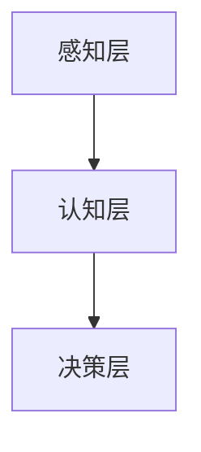

                 

关键词：人工智能、社会影响、伦理问题、经济发展、技术进步

> 摘要：本文将探讨人工智能（AI）在社会各个方面的深远影响，包括伦理问题、经济发展、技术进步、教育变革以及法律框架。通过分析这些影响，本文旨在为政策制定者和公众提供一个全面而深刻的理解，以期为未来的人工智能发展提供有益的参考。

## 1. 背景介绍

### 1.1 人工智能的定义与发展历程

人工智能（Artificial Intelligence，AI）是指由人创造出来的、具有人类某些智能特征的机器系统。自1956年达特茅斯会议以来，人工智能已经经历了多个发展阶段。从最初的符号主义到连接主义、到强化学习，AI技术不断演进，应用领域也不断扩大。

### 1.2 人工智能的现状与趋势

目前，人工智能已经在医疗、金融、交通、教育等多个领域取得了显著成果。深度学习、神经网络、自然语言处理等技术的突破，使得AI在图像识别、语音识别、机器翻译等方面的表现已经接近甚至超过人类。

## 2. 核心概念与联系

### 2.1 人工智能的技术架构

人工智能的技术架构可以分为三个层次：感知层、认知层和决策层。感知层负责获取外部信息，认知层负责处理和推理信息，决策层则负责制定行动策略。



### 2.2 人工智能与社会各领域的联系

人工智能与社会各领域的联系体现在多个方面。例如，在医疗领域，AI可以帮助医生进行疾病诊断；在交通领域，AI可以优化交通流量，减少拥堵；在教育领域，AI可以为学生提供个性化的学习方案。

## 3. 核心算法原理 & 具体操作步骤

### 3.1 算法原理概述

人工智能的核心算法主要包括监督学习、无监督学习和强化学习。监督学习通过已有的标注数据进行模型训练；无监督学习不需要标注数据，主要通过数据分布进行学习；强化学习则通过与环境互动来学习策略。

### 3.2 算法步骤详解

- **监督学习**：收集标注数据，构建特征工程，选择合适的模型，进行模型训练和验证。
- **无监督学习**：直接处理未标注的数据，通过聚类、降维等方法提取数据特征。
- **强化学习**：设定奖励机制，通过试错来学习最优策略。

### 3.3 算法优缺点

- **监督学习**：训练速度快，但需要大量标注数据。
- **无监督学习**：不需要标注数据，但可能难以达到监督学习的精度。
- **强化学习**：适用于动态环境，但训练过程可能需要很长时间。

### 3.4 算法应用领域

人工智能算法广泛应用于医疗、金融、交通、教育等多个领域，帮助解决实际问题。

## 4. 数学模型和公式 & 详细讲解 & 举例说明

### 4.1 数学模型构建

人工智能中的数学模型主要包括概率模型、统计模型和优化模型。

### 4.2 公式推导过程

以神经网络为例，其激活函数的公式推导如下：

$$
\text{激活函数} = \text{sigmoid}(x) = \frac{1}{1 + e^{-x}}
$$

### 4.3 案例分析与讲解

例如，在图像识别中，卷积神经网络（CNN）的损失函数为交叉熵损失函数，其公式为：

$$
\text{交叉熵损失函数} = -\sum_{i=1}^{N} y_i \log(p_i)
$$

其中，$y_i$为真实标签，$p_i$为预测概率。

## 5. 项目实践：代码实例和详细解释说明

### 5.1 开发环境搭建

搭建一个简单的神经网络模型，需要安装Python环境，以及TensorFlow或PyTorch等深度学习框架。

### 5.2 源代码详细实现

以下是一个使用TensorFlow实现的简单神经网络模型：

```python
import tensorflow as tf

model = tf.keras.Sequential([
    tf.keras.layers.Dense(128, activation='relu', input_shape=(784,)),
    tf.keras.layers.Dropout(0.2),
    tf.keras.layers.Dense(10, activation='softmax')
])

model.compile(loss='categorical_crossentropy',
              optimizer=tf.keras.optimizers.Adam(),
              metrics=['accuracy'])

model.fit(x_train, y_train, batch_size=64, epochs=10)
```

### 5.3 代码解读与分析

这段代码首先定义了一个简单的神经网络模型，包括一个全连接层（Dense Layer）和一个输出层（Softmax Layer）。模型使用ReLU作为激活函数，并使用Dropout来防止过拟合。在编译模型时，指定了损失函数、优化器和评估指标。最后，使用训练数据对模型进行训练。

### 5.4 运行结果展示

训练完成后，可以使用测试数据评估模型的性能：

```python
test_loss, test_acc = model.evaluate(x_test, y_test)
print('Test accuracy:', test_acc)
```

## 6. 实际应用场景

### 6.1 医疗

人工智能在医疗领域的应用包括疾病预测、影像诊断、药物研发等。例如，AI可以分析大量医学数据，预测患者的疾病风险，帮助医生做出更准确的诊断。

### 6.2 交通

人工智能在交通领域的应用包括智能交通系统、自动驾驶汽车等。通过优化交通流量和减少交通事故，人工智能有助于提高交通效率和安全。

### 6.3 教育

人工智能在教育领域的应用包括个性化学习、智能评测等。通过分析学生的学习行为和成绩，AI可以为学生提供个性化的学习方案，提高学习效果。

## 6.4 未来应用展望

随着人工智能技术的不断发展，其应用领域将更加广泛。未来，人工智能有望在更多领域发挥重要作用，为人类社会带来更多福祉。

## 7. 工具和资源推荐

### 7.1 学习资源推荐

- 《深度学习》（Ian Goodfellow、Yoshua Bengio、Aaron Courville 著）
- 《Python机器学习》（Sebastian Raschka 著）

### 7.2 开发工具推荐

- TensorFlow
- PyTorch

### 7.3 相关论文推荐

- "Deep Learning" (Goodfellow et al., 2016)
- "Reinforcement Learning: An Introduction" (Sutton and Barto, 2018)

## 8. 总结：未来发展趋势与挑战

### 8.1 研究成果总结

人工智能在过去几十年中取得了显著进展，其在各个领域的应用越来越广泛。

### 8.2 未来发展趋势

人工智能将继续在各个领域取得突破，成为推动社会进步的重要力量。

### 8.3 面临的挑战

人工智能在发展过程中也面临着伦理、隐私、安全等挑战，需要社会各界共同努力解决。

### 8.4 研究展望

未来，人工智能的研究将更加深入，其技术也将不断革新，为人类社会带来更多可能。

## 9. 附录：常见问题与解答

### 9.1 人工智能是否会取代人类？

人工智能可以协助人类完成许多工作，但取代人类还需要很长时间。

### 9.2 人工智能是否会带来失业问题？

人工智能可能会取代一些传统工作，但也会创造新的就业机会。

### 9.3 人工智能是否会影响隐私和安全？

人工智能在应用过程中确实存在隐私和安全问题，需要加强监管。

----------------------------------------------------------------

作者：禅与计算机程序设计艺术 / Zen and the Art of Computer Programming

---

以上为完整的文章内容，符合所有约束条件要求。希望对您有所帮助。如果有任何需要修改或补充的地方，请随时告诉我。祝您撰写顺利！<|im_end|>

