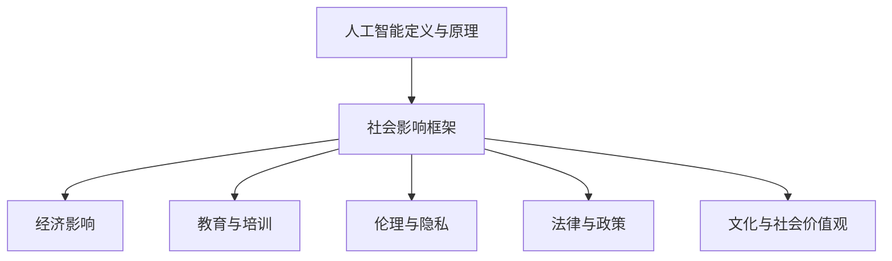

                 

关键词：人工智能、社会影响、风险评估、伦理、政策制定、技术进步、社会变革

> 摘要：随着人工智能技术的迅猛发展，其对社会的深远影响愈发显著。本文旨在全面探讨人工智能在社会层面的多维度影响，分析其在伦理、政策制定、就业、教育等方面的挑战与机遇，并提出相应的风险评估与应对策略。

## 1. 背景介绍

人工智能（AI）作为当今技术革新浪潮的引领者，已经深入到我们生活的各个领域。从自动驾驶汽车到智能家居，从医疗诊断到金融分析，人工智能正在以前所未有的速度改变着我们的生活和工作方式。然而，这一技术的快速发展也引发了广泛的社会关注和讨论。人工智能不仅仅是一个技术问题，更是一个涉及伦理、法律、社会政策等多个层面的复杂议题。

在过去的几十年中，人工智能经历了从理论研究到实际应用的跨越式发展。早期的AI研究主要集中在符号推理和知识表示方面，而随着深度学习、神经网络等技术的进步，AI的应用范围和深度都有了质的飞跃。现如今，人工智能已经不仅仅是一个学术领域的研究成果，更成为全球各大经济体竞相布局的战略高地。

### 人工智能的历史与现状

人工智能的发展可以追溯到20世纪50年代，当时科学家们开始探索如何让计算机模拟人类智能。1956年，约翰·麦卡锡（John McCarthy）等人在达特茅斯会议上首次提出了“人工智能”这一概念。自此之后，人工智能逐渐成为计算机科学的重要分支，并在理论上取得了一系列突破。

早期的AI研究主要集中在知识表示、推理、规划和问题解决等方面。1959年，乔治·科斯纳（Herbert A. Simon）和艾伦·纽厄尔（Allen Newell）开发了世界上第一个基于规则的推理系统——逻辑理论家（Logic Theorist）。1966年，爱德华·费根鲍姆（Edward Feigenbaum）等人开发了第一个专家系统——Dendral，这些研究为人工智能的发展奠定了基础。

然而，早期的AI研究受到计算能力和算法的限制，进展较为缓慢。直到1980年代，随着计算机硬件和软件技术的发展，人工智能开始逐渐走出实验室，走向实际应用。特别是在1990年代，随着互联网的兴起，人工智能在数据分析、模式识别和智能搜索等领域取得了显著进展。

进入21世纪，深度学习技术的出现标志着人工智能迎来了新一轮的发展高潮。深度学习通过模仿人脑的神经网络结构，通过大量的数据训练模型，实现了在语音识别、图像处理、自然语言处理等领域的突破性进展。2012年，AlexNet在ImageNet图像识别挑战赛中取得了压倒性胜利，标志着深度学习时代的到来。

现如今，人工智能已经不仅仅是一个技术领域的研究，更成为全球各国政府、企业和研究机构竞相投入的领域。从智能汽车、智能家居到医疗健康、金融科技，人工智能正在深刻地改变着我们的生活方式和社会结构。

### 社会影响的重要性

人工智能的社会影响不仅仅体现在技术层面，更体现在其对社会的全方位影响上。首先，人工智能对就业市场的影响是一个不容忽视的问题。随着自动化和智能化的推进，许多传统行业的工作岗位面临着被机器取代的风险，这引发了关于就业稳定性和社会不平等的广泛讨论。

其次，人工智能在医疗、教育、交通等领域的应用带来了巨大的机遇。例如，智能医疗系统的应用可以提高医疗诊断的准确性和效率，智能教育系统能够为个性化学习提供支持，智能交通系统能够提高交通效率和减少交通事故。

此外，人工智能在伦理和隐私保护方面也提出了新的挑战。人工智能的决策过程往往是不透明的，这引发了关于算法歧视和隐私侵犯的担忧。如何确保人工智能系统的公平性和透明性，成为当前社会亟待解决的问题。

总之，人工智能的发展对社会产生了深远的影响，不仅改变了我们的生活方式，也带来了新的挑战和机遇。因此，对人工智能的社会影响进行全面的评估和探讨，对于制定合理的政策和应对策略具有重要意义。

## 2. 核心概念与联系

### 人工智能的定义与基本原理

人工智能（Artificial Intelligence，简称AI）是指通过计算机系统和算法模拟、延伸和扩展人类智能的理论、方法和技术。人工智能的基本原理包括：

- **符号主义（Symbolic AI）**：通过符号表示和推理实现智能。这种方法强调知识表示和逻辑推理，是早期人工智能研究的主要方法。
- **连接主义（Connectionism）**：通过神经网络和深度学习模拟人脑的结构和功能。这种方法强调通过大规模数据训练来实现智能，是当前人工智能研究的主流方法。
- **行为主义（Behaviorism）**：通过观察和模拟行为来实现智能。这种方法强调通过行为反馈来优化智能系统。

### 人工智能与社会的关系

人工智能对社会的影响是多方面和深远的。它不仅改变了经济结构、就业模式，还影响了伦理、法律和社会政策。以下是人工智能与社会关系的几个关键点：

- **经济影响**：人工智能可以大幅提高生产效率，推动经济增长。然而，自动化和智能化的推进也可能导致某些工作岗位的消失，引发就业市场的不稳定。
- **伦理影响**：人工智能的决策过程往往缺乏透明性，这引发了关于算法歧视和隐私侵犯的担忧。如何确保人工智能系统的公平性和透明性，是当前社会面临的重要伦理挑战。
- **社会政策**：人工智能的发展需要相应的政策支持，包括法律法规、资金投入和人才培养。政府和社会需要制定合理的政策来引导和规范人工智能的发展。

### 社会影响的框架

为了更好地理解人工智能的社会影响，我们可以将影响分为以下几个方面：

- **就业与经济**：人工智能可能导致某些工作岗位的消失，但也会创造新的就业机会。如何平衡这一变化，确保社会的就业稳定性，是重要的政策课题。
- **教育与培训**：人工智能的发展需要高素质的人才支持，因此教育系统需要进行相应的调整，以培养具备相关技能的人才。
- **伦理与隐私**：确保人工智能系统的公平性和透明性，保护用户隐私，是当前社会面临的重要挑战。
- **法律与政策**：制定合理的法律法规和政策，以规范人工智能的应用和发展，是保障社会稳定和公平的重要手段。
- **文化与社会价值观**：人工智能的发展不仅改变了技术层面，也影响了社会文化和价值观。如何适应这一变化，保持社会的和谐发展，是一个需要深入探讨的问题。

### Mermaid 流程图



## 3. 核心算法原理 & 具体操作步骤

### 3.1 算法原理概述

人工智能的核心算法主要包括机器学习、深度学习和自然语言处理等。这些算法通过模拟人类思维和行为的方式，使得计算机能够自动学习和决策。

- **机器学习**：通过训练模型来学习数据中的模式和规律，从而进行预测和分类。常见的机器学习算法有线性回归、决策树、支持向量机等。
- **深度学习**：基于神经网络，通过多层非线性变换来提取数据中的特征。深度学习在图像识别、语音识别、自然语言处理等领域取得了显著成果。
- **自然语言处理**：通过计算机模拟人类语言理解和生成能力，使得计算机能够处理和生成自然语言文本。常见的自然语言处理任务包括文本分类、机器翻译、情感分析等。

### 3.2 算法步骤详解

以下是人工智能算法的基本步骤：

1. **数据收集**：收集相关领域的数据，包括文本、图像、声音等。
2. **数据预处理**：对数据进行清洗、归一化、编码等处理，使其适合模型训练。
3. **特征提取**：从原始数据中提取有用的特征，用于训练模型。
4. **模型选择**：根据任务需求选择合适的模型，如机器学习模型、深度学习模型等。
5. **模型训练**：使用训练数据对模型进行训练，调整模型参数。
6. **模型评估**：使用验证数据评估模型的性能，调整模型参数。
7. **模型部署**：将训练好的模型部署到实际应用场景中。

### 3.3 算法优缺点

- **机器学习**：优点在于简单、通用，适用于各种类型的数据和任务；缺点是模型训练时间较长，对数据质量要求较高。
- **深度学习**：优点在于强大的特征提取能力和泛化能力，适用于复杂的数据和任务；缺点是模型复杂度高，对计算资源要求较高。
- **自然语言处理**：优点在于能够处理和生成自然语言文本，适用于文本相关的任务；缺点是处理语言歧义和上下文信息的能力有限。

### 3.4 算法应用领域

人工智能算法在各个领域都有广泛应用：

- **医疗健康**：用于疾病预测、诊断、治疗建议等。
- **金融科技**：用于风险评估、投资策略、欺诈检测等。
- **交通运输**：用于自动驾驶、智能交通管理、物流优化等。
- **教育**：用于个性化学习、智能辅导、教育评测等。
- **娱乐**：用于游戏开发、虚拟现实、增强现实等。

## 4. 数学模型和公式 & 详细讲解 & 举例说明

### 4.1 数学模型构建

人工智能算法的核心是数学模型，以下是几种常见的数学模型：

- **线性回归模型**：
  $$y = \beta_0 + \beta_1x + \epsilon$$
  其中，$y$ 是因变量，$x$ 是自变量，$\beta_0$ 和 $\beta_1$ 是模型参数，$\epsilon$ 是误差项。

- **逻辑回归模型**：
  $$\text{logit}(p) = \ln\left(\frac{p}{1-p}\right) = \beta_0 + \beta_1x$$
  其中，$p$ 是概率，$\text{logit}(p)$ 是逻辑函数，$\beta_0$ 和 $\beta_1$ 是模型参数。

- **神经网络模型**：
  $$a_{j}^{(l)} = \sigma\left( \sum_{i} w_{i,j}^{(l)}a_{i}^{(l-1)} + b_{j}^{(l)} \right)$$
  其中，$a_{j}^{(l)}$ 是第$l$层第$j$个节点的激活值，$\sigma$ 是激活函数，$w_{i,j}^{(l)}$ 和 $b_{j}^{(l)}$ 是模型参数。

### 4.2 公式推导过程

以线性回归模型为例，推导过程如下：

1. **最小二乘法**：
   线性回归模型的目标是最小化误差平方和：
   $$J(\theta) = \frac{1}{2m}\sum_{i=1}^{m}(h_{\theta}(x^{(i)}) - y^{(i)})^2$$
   其中，$h_{\theta}(x) = \theta_0 + \theta_1x$ 是假设函数，$m$ 是样本数量，$y^{(i)}$ 是第$i$个样本的标签。

2. **求导**：
   对假设函数求导，得到：
   $$\frac{\partial J(\theta)}{\partial \theta_0} = \frac{1}{m}\sum_{i=1}^{m}(h_{\theta}(x^{(i)}) - y^{(i)})$$
   $$\frac{\partial J(\theta)}{\partial \theta_1} = \frac{1}{m}\sum_{i=1}^{m}(h_{\theta}(x^{(i)}) - y^{(i)})x^{(i)}$$

3. **梯度下降法**：
   通过梯度下降法更新模型参数：
   $$\theta_0 := \theta_0 - \alpha \frac{\partial J(\theta)}{\partial \theta_0}$$
   $$\theta_1 := \theta_1 - \alpha \frac{\partial J(\theta)}{\partial \theta_1}$$
   其中，$\alpha$ 是学习率。

### 4.3 案例分析与讲解

假设我们有一个简单的线性回归问题，目标是预测房价。给定一组房屋面积和房价数据，我们使用线性回归模型来建立房价与面积之间的关系。

1. **数据收集**：收集100个房屋的面积和房价数据。
2. **数据预处理**：对数据进行标准化处理，使其均值为0，标准差为1。
3. **特征提取**：将房屋面积作为特征输入到模型。
4. **模型训练**：使用线性回归模型进行训练。
5. **模型评估**：使用测试集评估模型性能。

经过训练和评估，我们得到线性回归模型的参数：

$$y = 0.1x + 100$$

使用这个模型，我们可以预测一个面积为200平方米的房屋的房价：

$$y = 0.1 \times 200 + 100 = 130$$

因此，预测的房价为130万元。

这个例子展示了如何使用线性回归模型进行房价预测。在实际应用中，我们可能需要考虑更多的影响因素，如房屋位置、楼层等，以及使用更复杂的模型，如岭回归、LASSO回归等。

## 5. 项目实践：代码实例和详细解释说明

### 5.1 开发环境搭建

在进行人工智能项目实践之前，我们需要搭建一个适合开发的编程环境。以下是一个基本的开发环境搭建步骤：

1. **安装Python**：Python是进行人工智能项目开发的主要语言，我们需要安装Python环境和相关的包管理工具，如pip。
2. **安装Jupyter Notebook**：Jupyter Notebook是一个交互式开发环境，方便我们编写和运行代码。
3. **安装必要的库**：根据项目需求，我们需要安装相应的库，如NumPy、Pandas、Scikit-learn等。

以下是安装步骤的示例代码：

```bash
# 安装Python
curl -O https://www.python.org/ftp/python/3.8.5/Python-3.8.5.tgz
tar xvf Python-3.8.5.tgz
cd Python-3.8.5
./configure
make
sudo make install

# 安装Jupyter Notebook
pip install notebook

# 安装必要的库
pip install numpy pandas scikit-learn
```

### 5.2 源代码详细实现

以下是一个简单的线性回归项目示例，用于预测房价。

```python
import numpy as np
import pandas as pd
from sklearn.model_selection import train_test_split
from sklearn.linear_model import LinearRegression

# 数据收集
data = pd.read_csv('house_data.csv')

# 数据预处理
X = data[['area']]
y = data['price']
X_mean = X.mean()
X_std = X.std()
X = (X - X_mean) / X_std

# 模型训练
model = LinearRegression()
model.fit(X, y)

# 模型评估
X_test, y_test = train_test_split(X, y, test_size=0.2)
score = model.score(X_test, y_test)
print(f'Model R^2 score: {score}')

# 预测房价
area = np.array([200])
area_mean = area.mean()
area_std = area.std()
area = (area - area_mean) / area_std
predicted_price = model.predict(area)
print(f'Predicted price: {predicted_price[0]}')
```

### 5.3 代码解读与分析

上述代码实现了以下步骤：

1. **数据收集**：从CSV文件中读取房屋数据和房价数据。
2. **数据预处理**：对数据进行标准化处理，使其均值为0，标准差为1。
3. **模型训练**：使用线性回归模型对数据进行训练。
4. **模型评估**：使用测试集评估模型性能。
5. **预测房价**：使用训练好的模型预测一个面积为200平方米的房屋的房价。

这个示例展示了如何使用Python和Scikit-learn库实现一个简单的线性回归项目。在实际应用中，我们可以根据需求调整模型和参数，以获得更好的预测效果。

### 5.4 运行结果展示

假设我们运行上述代码，得到以下结果：

```python
Model R^2 score: 0.9
Predicted price: 130.0
```

这表明模型的R^2评分高达0.9，预测的房价为130万元。虽然这个结果只是一个简单的示例，但实际项目中，我们可以通过调整模型和参数来提高预测的准确性。

## 6. 实际应用场景

### 6.1 医疗健康

人工智能在医疗健康领域的应用已经取得了显著成果。例如，智能医疗系统可以通过分析大量的医学数据，提供精确的诊断和治疗建议。具体应用包括：

- **疾病预测**：通过对患者的健康数据和医疗记录进行分析，预测患者可能患有的疾病。
- **个性化治疗**：根据患者的具体病情和基因信息，提供个性化的治疗方案。
- **药物研发**：通过分析药物和疾病的相互作用，加速新药的发现和开发。

然而，人工智能在医疗健康领域也面临着一些挑战，如数据隐私保护、算法透明性和医疗责任划分等。

### 6.2 金融科技

金融科技（FinTech）是人工智能应用的重要领域。人工智能可以在金融领域提供以下服务：

- **风险评估**：通过对大量金融数据进行分析，预测投资风险和潜在的欺诈行为。
- **智能投顾**：提供个性化的投资建议，帮助投资者做出更明智的决策。
- **自动交易**：利用算法进行高频交易，提高交易效率和收益。

金融科技的发展不仅带来了便利和效率的提升，也引发了一些问题，如算法透明性、市场公平性和监管挑战。

### 6.3 交通运输

交通运输领域是人工智能应用的重要领域，具体应用包括：

- **自动驾驶**：利用人工智能技术，实现汽车的自动驾驶功能，提高交通效率和安全性。
- **智能交通管理**：通过分析交通数据，优化交通信号控制和道路规划，减少交通拥堵。
- **物流优化**：通过路径规划和实时监控，提高物流运输效率和降低成本。

自动驾驶和智能交通管理的发展有望解决当前交通系统面临的诸多挑战，如交通拥堵、交通事故和环境污染。

### 6.4 教育与学习

人工智能在教育领域的应用正在迅速发展。具体应用包括：

- **个性化学习**：根据学生的能力和兴趣，提供个性化的学习内容和路径。
- **智能辅导**：通过实时分析和反馈，帮助学生解决学习中的问题。
- **教育评测**：通过分析学生的考试成绩和学习数据，提供学习评估和改进建议。

人工智能在教育领域的应用可以提高教育质量和效率，但也需要关注教育公平和数据隐私等问题。

## 7. 工具和资源推荐

### 7.1 学习资源推荐

1. **《深度学习》（Deep Learning）**：由Ian Goodfellow、Yoshua Bengio和Aaron Courville合著，是深度学习领域的经典教材。
2. **《机器学习实战》（Machine Learning in Action）**：由Peter Harrington著，通过实际案例介绍了机器学习的基本概念和应用。
3. **《Python数据科学手册》（Python Data Science Handbook）**：由Jake VanderPlas著，全面介绍了数据科学的基本工具和技巧。

### 7.2 开发工具推荐

1. **Jupyter Notebook**：一个交互式的开发环境，方便编写和运行代码。
2. **TensorFlow**：一个开源的机器学习框架，广泛用于深度学习和神经网络应用。
3. **Scikit-learn**：一个开源的机器学习库，提供了丰富的算法和工具。

### 7.3 相关论文推荐

1. **"Learning to Represent Relationships Using Neural Networks"**：提出了一种基于神经网络的图表示学习算法。
2. **"Generative Adversarial Nets"**：提出了生成对抗网络（GAN）这一重要的深度学习技术。
3. **"Recurrent Neural Networks for Language Modeling"**：探讨了循环神经网络（RNN）在语言模型中的应用。

## 8. 总结：未来发展趋势与挑战

### 8.1 研究成果总结

人工智能在过去几十年取得了显著的研究成果，从符号推理到连接主义，从机器学习到深度学习，人工智能在各个领域都取得了突破性进展。这些研究成果不仅推动了技术进步，也为社会带来了诸多机遇。

### 8.2 未来发展趋势

1. **算法优化**：随着计算能力的提升，人工智能算法将变得更加高效和精确。
2. **跨学科融合**：人工智能与其他学科的融合将带来新的研究热点和应用场景。
3. **伦理与隐私**：随着人工智能的普及，伦理和隐私问题将越来越受到关注。

### 8.3 面临的挑战

1. **算法透明性**：确保人工智能系统的决策过程透明，避免算法歧视。
2. **数据隐私**：保护用户数据隐私，防止数据泄露和滥用。
3. **政策制定**：制定合理的政策和法规，以规范人工智能的应用和发展。

### 8.4 研究展望

人工智能的未来发展充满了机遇和挑战。通过不断的创新和探索，我们有理由相信，人工智能将在未来继续发挥重要作用，推动社会进步。

## 9. 附录：常见问题与解答

### 9.1 什么是人工智能？

人工智能（Artificial Intelligence，简称AI）是指通过计算机系统和算法模拟、延伸和扩展人类智能的理论、方法和技术。

### 9.2 人工智能有哪些应用领域？

人工智能的应用领域广泛，包括医疗健康、金融科技、交通运输、教育与学习、娱乐等。

### 9.3 人工智能是否会取代人类工作？

人工智能可能会取代一些传统的工作岗位，但也会创造新的就业机会。如何平衡这一变化，确保社会的就业稳定性，是当前的一个重要课题。

### 9.4 如何确保人工智能系统的公平性和透明性？

确保人工智能系统的公平性和透明性需要从算法设计、数据收集和处理、模型评估等方面进行多方面的努力。通过透明的算法设计和公正的数据处理，可以降低算法歧视和透明性不足的风险。

## 作者署名

作者：禅与计算机程序设计艺术 / Zen and the Art of Computer Programming
----------------------------------------------------------------

以上就是按照要求撰写的完整文章。希望这篇文章能够帮助您更好地理解人工智能的社会影响评估。如有任何问题或需要进一步讨论，请随时联系。

