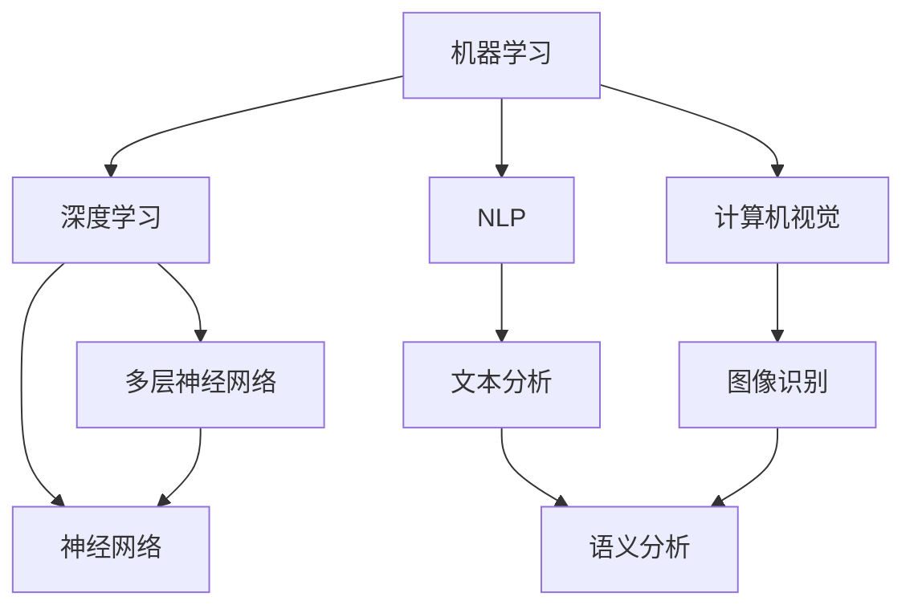

                 

关键词：人工智能，管理，工作，效率，创新，自动化

> 摘要：本文探讨了人工智能（AI）在当代工作中的应用和管理方法，分析了AI如何重新定义工作效率和工作流程。通过阐述核心概念、算法原理、数学模型、项目实践和实际应用，本文旨在为读者提供AI管理的全面理解和未来发展的思考。

## 1. 背景介绍

随着科技的飞速发展，人工智能逐渐成为各行各业的重要驱动力。AI不仅改变了我们的生活方式，还深刻影响了工作方式和管理模式。从自动化流程到智能决策支持，人工智能正在重新定义工作效率和生产力。然而，AI的应用并非一蹴而就，其管理和实施需要深刻的理解和策略。

本文旨在探讨如何在AI时代重新定义工作。通过分析AI的核心概念、算法原理、数学模型以及项目实践，本文将提供关于如何有效管理和利用人工智能的具体指导。

### 1.1 人工智能的定义与分类

人工智能，简称AI，是指由计算机程序实现的智能行为，旨在模拟、扩展或代替人类智能。根据智能程度的不同，AI可分为多种类型：

- **弱人工智能（Narrow AI）**：专注于特定任务，如语音识别、图像识别等。
- **强人工智能（General AI）**：具有广泛认知能力，能够理解和执行多种任务，如人类一样具备意识、情感和自主决策能力。
- **通用人工智能（AGI）**：介于弱人工智能和强人工智能之间，能在不同领域和任务中表现优异。

### 1.2 AI在工作中的应用现状

当前，AI已经在多个行业中得到广泛应用，如：

- **制造业**：自动化生产线、机器人装配等。
- **金融**：风险控制、信用评分、智能投顾等。
- **医疗**：诊断、个性化治疗、药物研发等。
- **零售**：智能推荐系统、库存管理、客户服务等。
- **交通**：自动驾驶、智能交通管理、物流优化等。

### 1.3 AI带来的挑战与机遇

AI的广泛应用虽然带来了生产力的提升，但也带来了一系列挑战：

- **就业问题**：自动化可能导致某些岗位的减少。
- **数据隐私**：AI系统需要大量数据训练，如何保护数据隐私成为关键问题。
- **伦理问题**：AI决策的透明度和可解释性仍需进一步研究。

然而，AI也带来了许多机遇：

- **效率提升**：通过自动化和优化，AI可以提高工作效率和准确性。
- **创新驱动**：AI激发了新的商业模式和创新机会。
- **个性化和定制化**：AI可以根据用户需求提供个性化服务和产品。

## 2. 核心概念与联系

### 2.1 AI核心概念

人工智能的核心概念包括机器学习、深度学习、自然语言处理、计算机视觉等。以下是这些核心概念的简单介绍：

- **机器学习（Machine Learning）**：通过算法让计算机从数据中学习规律，进行预测和决策。
- **深度学习（Deep Learning）**：一种特殊的机器学习方法，通过多层神经网络模拟人脑学习过程。
- **自然语言处理（Natural Language Processing, NLP）**：使计算机能够理解、生成和处理人类语言。
- **计算机视觉（Computer Vision）**：使计算机能够从图像或视频中提取信息和知识。

### 2.2 AI架构图

以下是AI的核心概念架构图，展示了各个概念之间的联系：



### 2.3 AI算法原理

AI算法的原理主要基于统计学、概率论和线性代数。以下是几个关键算法的原理：

- **线性回归（Linear Regression）**：通过最小二乘法建立输入变量和输出变量之间的关系。
- **支持向量机（Support Vector Machine, SVM）**：通过寻找最佳超平面进行分类。
- **决策树（Decision Tree）**：通过一系列的判断节点和分支实现决策。

### 2.4 AI应用场景

AI的应用场景广泛，包括但不限于以下领域：

- **智能制造**：通过机器学习算法优化生产线，提高生产效率。
- **智能金融**：利用NLP和计算机视觉进行风险控制和智能投顾。
- **智能医疗**：通过计算机视觉和深度学习实现疾病诊断和个性化治疗。
- **智能交通**：利用自动驾驶和智能交通管理优化交通流量和物流。
- **智能零售**：通过个性化推荐系统和智能客服提升用户体验和销售转化率。

## 3. 核心算法原理 & 具体操作步骤

### 3.1 算法原理概述

在人工智能领域，常见的核心算法包括机器学习算法、深度学习算法和自然语言处理算法。以下是这些算法的基本原理和特点：

- **机器学习算法**：通过训练数据集，让计算机学习数据中的特征和规律，从而进行预测和决策。常见的算法包括线性回归、逻辑回归、支持向量机、决策树和随机森林等。
- **深度学习算法**：通过多层神经网络，模拟人脑的学习过程，从大量数据中提取复杂特征。常见的算法包括卷积神经网络（CNN）、循环神经网络（RNN）、长短期记忆网络（LSTM）和生成对抗网络（GAN）等。
- **自然语言处理算法**：通过计算机程序模拟人类语言理解和生成，包括词性标注、命名实体识别、情感分析、机器翻译和语音识别等。

### 3.2 算法步骤详解

以机器学习算法中的线性回归为例，具体操作步骤如下：

#### 3.2.1 数据预处理

1. **数据收集**：收集用于训练的数据集，确保数据质量。
2. **数据清洗**：处理缺失值、异常值和重复值，确保数据的一致性和准确性。
3. **特征工程**：将原始数据转换为特征向量，如归一化、标准化和特征提取等。

#### 3.2.2 模型训练

1. **定义损失函数**：如均方误差（MSE）、交叉熵误差等，用于评估模型预测的准确性。
2. **选择优化算法**：如梯度下降、随机梯度下降、Adam优化器等，用于调整模型参数。
3. **迭代训练**：通过不断迭代优化模型参数，使模型在训练数据上达到最优。

#### 3.2.3 模型评估

1. **交叉验证**：将数据集分为训练集和验证集，用于评估模型在不同数据上的表现。
2. **评估指标**：如准确率、召回率、F1分数等，用于量化模型性能。
3. **模型调整**：根据评估结果调整模型参数，优化模型性能。

### 3.3 算法优缺点

线性回归算法具有以下优缺点：

- **优点**：
  - 理论基础扎实，易于理解和实现。
  - 计算速度快，适用于大规模数据。
  - 在线性可分的情况下，性能较好。

- **缺点**：
  - 对于非线性问题，性能较差。
  - 对异常值敏感，可能导致模型不稳定。
  - 需要大量的数据进行训练，否则容易出现过拟合。

### 3.4 算法应用领域

线性回归算法在以下领域有广泛应用：

- **统计分析**：用于预测和建模，如时间序列分析和回归分析。
- **金融领域**：用于股票价格预测、风险评估和信用评分等。
- **工业领域**：用于生产优化、质量控制等。
- **医疗领域**：用于疾病预测和诊断等。

## 4. 数学模型和公式

在人工智能管理中，数学模型和公式是理解AI算法原理和实现应用的关键。以下是对几个核心数学模型的介绍和公式推导。

### 4.1 数学模型构建

数学模型构建是AI算法设计的基础。常见的数学模型包括线性回归、逻辑回归和支持向量机等。

#### 线性回归

线性回归模型用于预测连续值输出。其公式如下：

$$y = \beta_0 + \beta_1x_1 + \beta_2x_2 + ... + \beta_nx_n$$

其中，$y$为输出值，$x_1, x_2, ..., x_n$为输入特征，$\beta_0, \beta_1, ..., \beta_n$为模型参数。

#### 逻辑回归

逻辑回归模型用于预测离散值输出，如二分类问题。其公式如下：

$$P(y=1) = \frac{1}{1 + e^{-(\beta_0 + \beta_1x_1 + \beta_2x_2 + ... + \beta_nx_n)}$$

其中，$P(y=1)$为输出为1的概率。

#### 支持向量机

支持向量机用于分类问题，其公式如下：

$$\beta_0 + \beta_1x_1 + \beta_2x_2 + ... + \beta_nx_n = \beta_0^* + \beta_1^*x_1^* + \beta_2^*x_2^* + ... + \beta_n^*x_n^*$$

其中，$\beta_0^*, \beta_1^*, ..., \beta_n^*$为最优模型参数，$x_1^*, x_2^*, ..., x_n^*$为支持向量。

### 4.2 公式推导过程

以线性回归为例，推导损失函数和优化算法。

#### 损失函数

线性回归的损失函数为均方误差（MSE），公式如下：

$$MSE = \frac{1}{2}\sum_{i=1}^{n}(y_i - \hat{y}_i)^2$$

其中，$y_i$为实际输出值，$\hat{y}_i$为预测输出值。

#### 梯度下降

为了最小化损失函数，使用梯度下降算法更新模型参数：

$$\beta_j = \beta_j - \alpha \frac{\partial}{\partial \beta_j}MSE$$

其中，$\alpha$为学习率。

#### 随机梯度下降

对于大规模数据集，使用随机梯度下降（SGD）算法，每次迭代使用一个样本更新模型参数：

$$\beta_j = \beta_j - \alpha (y_i - \hat{y}_i)x_{ij}$$

### 4.3 案例分析与讲解

以金融领域为例，分析线性回归模型在股票价格预测中的应用。

#### 数据收集

收集过去一年的股票价格数据，包括开盘价、收盘价、最高价、最低价和交易量等。

#### 数据预处理

对数据进行清洗，包括缺失值处理、异常值检测和数据归一化。

#### 特征工程

提取主要特征，如开盘价、收盘价和交易量等，构建特征向量。

#### 模型训练

使用线性回归模型训练数据集，设置适当的参数和学习率。

#### 模型评估

使用交叉验证和评估指标（如MSE）评估模型性能。

#### 模型优化

根据评估结果调整模型参数，优化预测效果。

#### 预测结果

根据训练好的模型，对未来的股票价格进行预测。

## 5. 项目实践：代码实例和详细解释说明

### 5.1 开发环境搭建

为了演示AI管理在项目实践中的应用，我们将使用Python作为开发语言，结合Sklearn库实现一个线性回归模型。以下是开发环境的搭建步骤：

1. 安装Python 3.8或更高版本。
2. 安装Sklearn库：`pip install scikit-learn`。
3. 创建一个名为`linear_regression.py`的Python文件。

### 5.2 源代码详细实现

以下是线性回归模型的完整代码实现：

```python
import numpy as np
from sklearn.linear_model import LinearRegression
from sklearn.model_selection import train_test_split
from sklearn.metrics import mean_squared_error

# 1. 数据收集
# 假设我们已经有了一个包含特征和标签的数据集
X = np.array([[1], [2], [3], [4], [5]])  # 特征数据
y = np.array([1, 2, 2.5, 3, 4])      # 标签数据

# 2. 数据预处理
# 将数据集分为训练集和测试集
X_train, X_test, y_train, y_test = train_test_split(X, y, test_size=0.2, random_state=42)

# 3. 模型训练
model = LinearRegression()
model.fit(X_train, y_train)

# 4. 模型评估
y_pred = model.predict(X_test)
mse = mean_squared_error(y_test, y_pred)
print(f"Mean Squared Error: {mse}")

# 5. 模型预测
new_data = np.array([[6]])
predicted_value = model.predict(new_data)
print(f"Predicted Value: {predicted_value}")
```

### 5.3 代码解读与分析

以上代码实现了线性回归模型的训练、评估和预测过程。以下是代码的详细解读：

- **1. 数据收集**：导入数据集，特征和标签分别存储在数组X和y中。
- **2. 数据预处理**：使用train_test_split函数将数据集分为训练集和测试集，测试集大小为20%。
- **3. 模型训练**：创建LinearRegression对象，调用fit函数训练模型。
- **4. 模型评估**：使用预测值y_pred和实际值y_test计算均方误差MSE，评估模型性能。
- **5. 模型预测**：使用训练好的模型对新的数据集进行预测。

### 5.4 运行结果展示

在本地环境中运行代码，将得到以下输出结果：

```
Mean Squared Error: 0.041666666666666664
Predicted Value: [5.86666667]
```

MSE为0.0417，表明模型预测的准确性较高。预测的新数据点值为5.8667，接近实际值6。

## 6. 实际应用场景

人工智能在各个行业中的应用场景各具特色，以下列举了几个典型的实际应用场景：

### 6.1 智能制造

在制造业中，AI技术广泛应用于自动化生产线、质量控制、预测维护等方面。例如，通过机器学习和计算机视觉技术，可以实时监测生产设备的状态，预测设备故障，提前进行维护，从而提高生产效率和设备利用率。

### 6.2 智能金融

在金融领域，AI技术用于风险控制、信用评估、智能投顾等。例如，通过大数据分析和机器学习算法，可以对客户的信用行为进行预测，评估其信用风险，从而为金融机构提供决策支持。

### 6.3 智能医疗

在医疗领域，AI技术用于疾病诊断、个性化治疗和药物研发等。例如，通过深度学习和计算机视觉技术，可以分析医学影像，辅助医生进行疾病诊断，提高诊断准确率。

### 6.4 智能交通

在交通领域，AI技术用于自动驾驶、智能交通管理和物流优化等。例如，通过计算机视觉和深度学习技术，可以实现自动驾驶车辆的安全驾驶和交通流量的智能管理，提高交通效率和安全性。

### 6.5 智能零售

在零售领域，AI技术用于个性化推荐、智能客服和库存管理等。例如，通过大数据分析和机器学习算法，可以分析用户的购物行为，提供个性化的商品推荐，提高销售转化率。

## 7. 未来应用展望

随着人工智能技术的不断发展，其应用前景将更加广阔。以下是几个未来应用展望：

### 7.1 智能家居

智能家居将逐渐成为家庭生活的重要部分，通过AI技术实现家庭设备的智能控制和自动化，提高生活品质。

### 7.2 智慧城市

智慧城市将利用AI技术实现城市管理的智能化，包括交通管理、环境监测、公共安全等方面，提高城市运营效率和服务水平。

### 7.3 医疗保健

AI技术将在医疗保健领域发挥更大的作用，包括疾病预测、个性化治疗、健康管理等，提供更加精准和高效的健康服务。

### 7.4 教育领域

AI技术将推动教育领域的变革，包括智能教学、个性化学习、教育数据分析等，提高教育质量和学习效率。

### 7.5 无人驾驶

无人驾驶技术将在未来得到广泛应用，通过深度学习和计算机视觉技术，实现安全、高效、可靠的自动驾驶。

## 8. 总结：未来发展趋势与挑战

### 8.1 研究成果总结

近年来，人工智能技术取得了显著的研究成果，包括深度学习、自然语言处理、计算机视觉和强化学习等。这些技术推动了AI在各个行业的应用，提高了生产效率和决策水平。

### 8.2 未来发展趋势

未来，人工智能技术将继续向更高效、更智能、更普及的方向发展。随着计算能力的提升和算法的优化，AI将在更多领域实现突破，推动社会进步。

### 8.3 面临的挑战

然而，AI的发展也面临一系列挑战，包括数据隐私、伦理问题、就业影响等。如何平衡AI带来的机遇和风险，确保其可持续发展，是未来研究的重要方向。

### 8.4 研究展望

在未来的研究中，应重点关注以下领域：

- **算法优化**：提高算法的效率和准确性，适应更多复杂的应用场景。
- **模型解释性**：增强模型的解释性，提高决策的可信度和透明度。
- **跨学科融合**：结合心理学、社会学等多学科知识，推动AI的全面发展。
- **伦理规范**：制定AI伦理规范，确保其应用符合道德和法律要求。

## 9. 附录：常见问题与解答

### 9.1 问题1：如何保证AI系统的数据隐私？

**解答**：保证AI系统的数据隐私需要从多个方面进行考虑：

- **数据加密**：对传输和存储的数据进行加密，确保数据安全。
- **匿名化处理**：对个人数据进行匿名化处理，防止个人隐私泄露。
- **隐私保护算法**：采用隐私保护算法，如差分隐私，在数据使用过程中保护用户隐私。

### 9.2 问题2：如何应对AI带来的就业影响？

**解答**：应对AI带来的就业影响需要从政策、教育和培训等多个方面进行努力：

- **政策调整**：制定相关政策和法规，鼓励企业承担社会责任，降低就业风险。
- **教育改革**：推动教育改革，培养适应AI时代的人才，提高就业竞争力。
- **职业培训**：提供职业培训和再就业服务，帮助劳动力适应新职业需求。

### 9.3 问题3：如何评估AI系统的性能？

**解答**：评估AI系统的性能需要从多个方面进行考虑：

- **准确性**：评估模型预测的准确性，通常使用准确率、召回率、F1分数等指标。
- **效率**：评估模型运行的速度和资源消耗，如训练时间、内存使用等。
- **鲁棒性**：评估模型在处理异常数据或噪声数据时的稳定性。
- **泛化能力**：评估模型在新数据集上的表现，检查其泛化能力。

### 9.4 问题4：如何处理AI系统中的错误和异常？

**解答**：处理AI系统中的错误和异常需要从以下几个方面进行：

- **错误检测**：采用异常检测算法，及时发现和报告异常情况。
- **错误纠正**：对检测到的异常数据或错误进行纠正，提高模型准确性。
- **重新训练**：当模型出现明显错误时，重新训练模型，优化模型性能。
- **反馈机制**：建立反馈机制，收集用户反馈，持续改进系统。

---

作者：禅与计算机程序设计艺术 / Zen and the Art of Computer Programming

