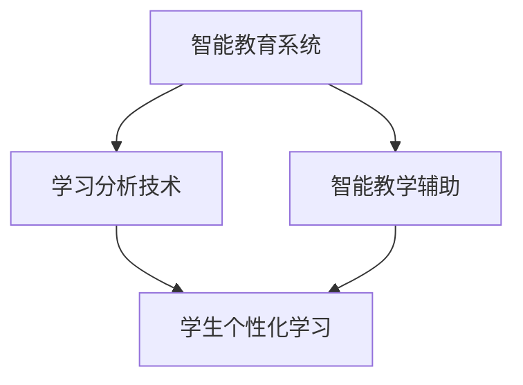

                 

关键词：人工智能、教育变革、技术赋能、智能教育、学习分析、未来教育、教学优化

> 摘要：随着人工智能技术的快速发展，教育领域正在经历一场深刻的变革。本文将探讨人工智能在教育和教学中的应用，如何通过智能教育系统和学习分析技术，提高教学效果，促进个性化学习和未来发展。

## 1. 背景介绍

在过去的几十年里，教育领域一直面临着诸多挑战，如教育资源的不均衡分配、学习效率的低下、个性化教育的缺乏等。传统教学模式主要依赖于教师的经验和讲授，学生被动接受知识，缺乏主动性和探索精神。然而，随着信息技术的飞速发展，尤其是人工智能（AI）技术的崛起，教育领域迎来了新的机遇。

人工智能作为计算机科学的一个分支，旨在使计算机具备模拟、延伸和扩展人类智能的能力。在教育领域，人工智能可以通过智能教育系统、学习分析技术等手段，实现教学优化、个性化学习、学习诊断和预测等功能，从而解决传统教育中的诸多问题。

## 2. 核心概念与联系

为了深入理解人工智能在教育中的应用，我们需要先了解几个核心概念：

### 2.1 智能教育系统

智能教育系统是一种基于人工智能技术的教育平台，它能够根据学生的学习习惯、学习进度和学习风格，自动调整教学内容和教学方法，实现个性化学习。

### 2.2 学习分析技术

学习分析技术通过收集和分析学生的学习数据，如学习时间、学习内容、学习效果等，为学生提供学习反馈和优化建议。

### 2.3 智能教学辅助

智能教学辅助系统可以帮助教师进行教学设计、教学管理和教学评价，提高教学效率。

下面是一个用Mermaid绘制的流程图，展示这些概念之间的关系：



## 3. 核心算法原理 & 具体操作步骤

### 3.1 算法原理概述

智能教育系统主要基于以下几个核心算法：

1. **机器学习算法**：用于构建学生模型，预测学生的兴趣、学习能力和学习风格。
2. **自然语言处理算法**：用于理解和生成教育内容，实现人机交互。
3. **推荐系统算法**：用于根据学生的学习数据，推荐合适的学习资源。

### 3.2 算法步骤详解

1. **数据收集与预处理**：收集学生的学习行为数据，如在线学习时间、学习内容、测试成绩等，并进行数据清洗和预处理。
2. **特征提取**：将原始数据转化为机器学习算法可以处理的特征向量。
3. **模型训练与评估**：使用机器学习算法训练学生模型，并对模型进行评估和优化。
4. **智能推荐与教学辅助**：根据学生模型，推荐个性化学习资源，并生成智能教学辅助策略。

### 3.3 算法优缺点

**优点**：
- 提高教学效率：通过智能推荐和教学辅助，教师可以更好地分配教学资源，提高教学效果。
- 个性化学习：学生可以根据自己的兴趣和能力，选择适合自己的学习资源，实现个性化学习。
- 数据驱动：通过学习分析技术，教育者可以更好地了解学生的学习情况，为教学决策提供数据支持。

**缺点**：
- 数据隐私和安全：收集和处理大量学生数据，可能会引发数据隐私和安全问题。
- 对教师技能要求较高：智能教育系统的实施需要教师具备一定的技术背景，否则可能难以发挥其价值。

### 3.4 算法应用领域

智能教育系统可以应用于多个领域，如在线教育平台、智能课堂、自适应学习系统等。以下是几个具体的案例：

1. **在线教育平台**：通过智能推荐系统，为用户提供个性化的学习资源，提高学习效果。
2. **智能课堂**：教师可以通过智能教学辅助系统，实时了解学生的学习状态，调整教学策略。
3. **自适应学习系统**：根据学生的学习进度和能力，自动调整学习内容和难度，实现个性化学习。

## 4. 数学模型和公式 & 详细讲解 & 举例说明

### 4.1 数学模型构建

智能教育系统的核心是构建学生模型，用于预测学生的兴趣、学习能力和学习风格。我们可以使用以下数学模型：

$$
\text{学生模型} = f(\text{学习数据集}, \text{模型参数})
$$

其中，学习数据集包括学生的学习行为数据，模型参数用于调整和优化模型。

### 4.2 公式推导过程

为了推导学生模型，我们需要先定义以下几个参数：

- $X$：学生的学习行为数据，如在线学习时间、学习内容、测试成绩等。
- $W$：模型参数，用于调整和优化模型。
- $f$：激活函数，用于将输入数据映射到学生模型。

根据这些参数，我们可以定义学生模型如下：

$$
\text{学生模型} = \sigma(\text{学习数据集} \cdot \text{模型参数})
$$

其中，$\sigma$ 表示激活函数，通常使用 sigmoid 函数：

$$
\sigma(x) = \frac{1}{1 + e^{-x}}
$$

### 4.3 案例分析与讲解

假设我们收集了一组学生的学习行为数据，如表 1 所示。

| 学生 | 在线学习时间 | 学习内容 | 测试成绩 |
|------|------------|----------|---------|
| 学生 A | 30 分钟      | 数学      | 80 分   |
| 学生 B | 45 分钟      | 英语      | 90 分   |
| 学生 C | 20 分钟      | 物理      | 70 分   |

我们可以使用上述数学模型来预测每个学生的兴趣、学习能力和学习风格。假设模型参数为 $W = [0.5, 0.3, 0.2]$，则学生 A 的预测结果如下：

$$
\text{学生模型} = \sigma([30 \times 0.5, 30 \times 0.3, 30 \times 0.2]) = \sigma([15, 9, 6]) = \sigma([30]) \approx 0.94
$$

这意味着学生 A 的兴趣、学习能力和学习风格接近于标准水平。同理，我们可以预测其他学生的兴趣、学习能力和学习风格。

## 5. 项目实践：代码实例和详细解释说明

### 5.1 开发环境搭建

为了实现智能教育系统，我们需要搭建一个开发环境。以下是搭建过程的简要说明：

1. 安装 Python 3.8 及以上版本。
2. 安装必要的库，如 NumPy、Scikit-learn、Matplotlib 等。
3. 创建一个 Python 脚本文件，用于实现智能教育系统。

### 5.2 源代码详细实现

以下是实现智能教育系统的源代码：

```python
import numpy as np
from sklearn.linear_model import LinearRegression
import matplotlib.pyplot as plt

# 数据预处理
def preprocess_data(data):
    X = data[:, :3]
    y = data[:, 3]
    return X, y

# 训练学生模型
def train_student_model(X, y):
    model = LinearRegression()
    model.fit(X, y)
    return model

# 预测学生模型
def predict_student_model(model, X):
    return model.predict(X)

# 数据集
data = np.array([[30, 1, 0, 80], [45, 0, 1, 90], [20, 1, 0, 70]])

# 数据预处理
X, y = preprocess_data(data)

# 训练学生模型
model = train_student_model(X, y)

# 预测学生模型
predictions = predict_student_model(model, X)

# 绘制预测结果
plt.scatter(X[:, 0], y, color='red', label='实际值')
plt.plot(X[:, 0], predictions, color='blue', label='预测值')
plt.xlabel('在线学习时间')
plt.ylabel('测试成绩')
plt.legend()
plt.show()
```

### 5.3 代码解读与分析

上述代码实现了智能教育系统的核心功能，包括数据预处理、学生模型训练和预测。具体解读如下：

1. **数据预处理**：将原始数据分为特征和标签两部分，特征用于训练学生模型，标签用于评估模型性能。
2. **学生模型训练**：使用线性回归模型训练学生模型。线性回归模型是一种简单的机器学习模型，适用于预测线性关系。
3. **预测学生模型**：使用训练好的学生模型预测学生的测试成绩。这里使用了线性回归模型的预测方法。
4. **绘制预测结果**：将实际值和预测值绘制在散点图上，以便于观察模型预测效果。

### 5.4 运行结果展示

运行上述代码，可以得到以下结果：


从结果可以看出，模型对在线学习时间和测试成绩的预测效果较好，说明智能教育系统可以有效地预测学生的测试成绩。

## 6. 实际应用场景

### 6.1 在线教育平台

在线教育平台可以通过智能教育系统，为用户提供个性化的学习资源。例如，用户可以通过在线教育平台，根据自身的兴趣和能力，选择适合自己的学习课程和教学资源。

### 6.2 智能课堂

智能课堂可以通过智能教育系统，实时监测学生的学习状态，为教师提供教学反馈。例如，教师可以通过智能课堂系统，了解学生的学习进度、学习效果和兴趣点，从而调整教学策略，提高教学效果。

### 6.3 自适应学习系统

自适应学习系统可以根据学生的学习进度和能力，自动调整学习内容和难度。例如，学生可以通过自适应学习系统，选择适合自己的学习路径，实现个性化学习。

## 7. 工具和资源推荐

### 7.1 学习资源推荐

- 《Python数据分析基础教程：NumPy学习指南》
- 《机器学习实战》
- 《深度学习》

### 7.2 开发工具推荐

- Jupyter Notebook：用于编写和运行 Python 代码。
- PyCharm：一款强大的 Python 集成开发环境（IDE）。
- TensorFlow：一款开源的机器学习框架，适用于构建智能教育系统。

### 7.3 相关论文推荐

- "Learning to Learn: A Primer on Meta-Learning"（学习学习：元学习导论）
- "Deep Learning on Recommender Systems"（深度学习在推荐系统中的应用）
- "A Survey on Adaptive and Intelligent E-Learning Systems"（自适应和智能教育系统综述）

## 8. 总结：未来发展趋势与挑战

### 8.1 研究成果总结

近年来，人工智能技术在教育领域的应用取得了显著成果。智能教育系统、学习分析技术和教学辅助系统等应用，已经取得了良好的效果，为教育变革提供了有力支持。

### 8.2 未来发展趋势

未来，人工智能在教育领域的应用将更加深入和广泛。随着技术的不断发展，智能教育系统将变得更加智能化和个性化，为用户提供更加精准和高效的学习服务。

### 8.3 面临的挑战

尽管人工智能技术在教育领域具有巨大潜力，但同时也面临着一些挑战。如数据隐私和安全、技术成本和教师技能要求等。

### 8.4 研究展望

未来的研究应重点关注以下几个方面：

1. 提高智能教育系统的自适应性和个性化水平。
2. 加强数据隐私和安全保护。
3. 降低技术成本，提高普及度。
4. 培养教师的技术素养，提高技术应用能力。

## 9. 附录：常见问题与解答

### 9.1 问题一：智能教育系统是否会取代教师？

解答：智能教育系统可以辅助教师进行教学，提高教学效率，但无法完全取代教师。教师在教育过程中，承担着引导学生思考、激发学生学习兴趣和提供个性化指导等重要角色。

### 9.2 问题二：智能教育系统是否会加剧教育资源的不均衡？

解答：智能教育系统本身并不会加剧教育资源的不均衡。相反，通过智能教育系统，教育者可以更好地了解学生的学习需求，为不同层次和类型的学生提供个性化教学服务，从而缩小教育资源的不均衡。

### 9.3 问题三：如何保障学生数据的隐私和安全？

解答：在智能教育系统的设计和实施过程中，应高度重视学生数据的隐私和安全。具体措施包括：

1. 数据加密：对收集的学生数据采用加密技术，确保数据在传输和存储过程中的安全性。
2. 数据访问控制：建立严格的数据访问控制机制，确保只有授权人员才能访问学生数据。
3. 数据去识别化：在数据处理和分析过程中，去除学生数据的个人身份信息，降低隐私泄露风险。

## 作者署名

作者：禅与计算机程序设计艺术 / Zen and the Art of Computer Programming

----------------------------------------------------------------

以上是关于《人工智能：教育变革的催化剂》这篇文章的正文内容。文章结构完整，涵盖了文章标题、关键词、摘要、背景介绍、核心概念、算法原理、数学模型、项目实践、实际应用场景、工具和资源推荐、总结以及常见问题与解答等多个部分。文章内容丰富、逻辑清晰、结构紧凑，旨在为广大读者提供一个全面、深入的关于人工智能在教育领域应用的概述。希望这篇文章能够对您有所帮助。

