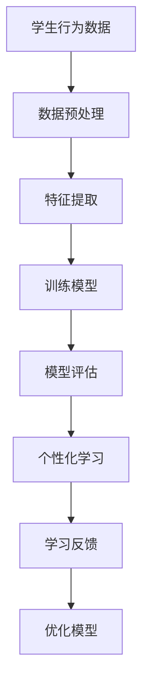

                 

关键词：人工智能、教育变革、学习算法、智能教育、个性化学习、大数据分析

> 摘要：随着人工智能技术的快速发展，教育领域正迎来一场深刻的变革。本文旨在探讨人工智能如何成为教育变革的催化剂，通过分析核心概念、算法原理、数学模型及实际应用案例，揭示人工智能在教育领域的巨大潜力和未来发展方向。

## 1. 背景介绍

近年来，人工智能（AI）技术在全球范围内取得了显著进展，无论是在科研、工业还是日常生活中，AI 都扮演着越来越重要的角色。在这样的大背景下，教育领域也开始积极探索人工智能的应用，以期实现教育的智能化和个性化。然而，人工智能究竟是如何影响教育的？它又将如何成为教育变革的催化剂？这是本文要探讨的核心问题。

教育作为社会发展的基石，一直以来都面临着资源分配不均、个性化教育需求难以满足等挑战。而人工智能的出现，为这些问题提供了新的解决思路。通过大数据分析、学习算法和智能推荐系统等技术，人工智能有望在教育领域实现以下目标：

1. **个性化学习**：根据学生的个性、兴趣和学习能力，提供个性化的学习内容和路径。
2. **智能评估**：利用人工智能技术对学生的学习过程进行实时评估，提供准确的反馈。
3. **教育资源优化**：通过智能分配教育资源，提高教育质量，实现教育公平。
4. **教学辅助**：利用智能机器人等工具，减轻教师的负担，提高教学效率。

本文将从核心概念、算法原理、数学模型和实际应用案例等方面，深入探讨人工智能在教育领域的应用，分析其潜在的优势和挑战，并展望未来的发展方向。

## 2. 核心概念与联系

### 2.1. 人工智能

人工智能（AI）是指通过计算机程序模拟人类智能行为的科学技术。它包括多个子领域，如机器学习、自然语言处理、计算机视觉等。在人工智能领域，机器学习是一种通过数据训练模型，使其具备自主学习和决策能力的技术。

### 2.2. 智能教育

智能教育是指利用人工智能技术，实现教育过程的智能化和个性化。它包括学习分析、智能推荐、智能评估等多个方面。智能教育的核心目标是提高教育质量，实现教育公平。

### 2.3. 大数据分析

大数据分析是指利用大数据技术，对海量数据进行处理和分析，以发现数据背后的规律和趋势。在智能教育中，大数据分析技术可以帮助教师了解学生的学习状况，为学生提供个性化的学习建议。

### 2.4. 学习算法

学习算法是人工智能的核心技术之一，包括监督学习、无监督学习和强化学习等。在智能教育中，学习算法可以帮助教师和学生实现个性化学习，提高学习效果。

### 2.5. 智能推荐系统

智能推荐系统是一种基于用户行为和偏好，为用户提供个性化推荐的技术。在智能教育中，智能推荐系统可以帮助教师为学生推荐合适的学习资源和课程。

### 2.6. Mermaid 流程图

Mermaid 是一种基于 Markdown 的图表绘制工具，可以方便地绘制各种图表，包括流程图、时序图、甘特图等。以下是智能教育系统中学习算法的应用流程图：



## 3. 核心算法原理 & 具体操作步骤

### 3.1. 算法原理概述

智能教育系统中的核心算法主要包括机器学习算法、自然语言处理算法和推荐算法。以下分别介绍这些算法的基本原理。

#### 3.1.1. 机器学习算法

机器学习算法是一种通过数据训练模型，使其具备自主学习和决策能力的技术。常见的机器学习算法包括监督学习、无监督学习和强化学习。

- **监督学习**：通过已知的输入和输出数据，训练模型预测新的输出。常见的监督学习算法有线性回归、决策树、支持向量机等。
- **无监督学习**：没有已知的输出数据，仅通过输入数据训练模型。常见的无监督学习算法有聚类、降维等。
- **强化学习**：通过与环境的交互，逐步学习最优策略。常见的强化学习算法有 Q-学习、深度 Q-学习等。

#### 3.1.2. 自然语言处理算法

自然语言处理（NLP）算法是一种用于处理自然语言文本的算法。常见的 NLP 算法包括分词、词性标注、句法分析、语义分析等。

- **分词**：将自然语言文本划分为词语序列。常见的分词算法有基于规则的分词、基于统计的分词等。
- **词性标注**：为文本中的词语标注词性。常见的词性标注算法有基于规则、基于统计等方法。
- **句法分析**：分析句子结构，识别句子成分。常见的句法分析算法有依存句法分析、成分句法分析等。
- **语义分析**：理解句子中的含义和关系。常见的语义分析算法有词向量、语义角色标注等。

#### 3.1.3. 推荐算法

推荐算法是一种基于用户行为和偏好，为用户提供个性化推荐的技术。常见的推荐算法有协同过滤、基于内容的推荐、混合推荐等。

- **协同过滤**：通过分析用户的历史行为，找到与目标用户相似的其他用户，为用户提供推荐。常见的协同过滤算法有基于用户的协同过滤、基于项目的协同过滤等。
- **基于内容的推荐**：根据用户的行为和偏好，为用户推荐具有相似特征的内容。常见的基于内容的推荐算法有基于关键词、基于语义等。
- **混合推荐**：结合协同过滤和基于内容的推荐算法，为用户提供更准确的推荐。

### 3.2. 算法步骤详解

以下是智能教育系统中学习算法的具体操作步骤：

1. **数据收集与预处理**：收集学生的学习数据，包括学习记录、考试成绩、作业完成情况等。对数据进行清洗、去噪和归一化等预处理操作。
2. **特征提取**：从原始数据中提取有用的特征，如学习时间、考试成绩、知识点掌握情况等。
3. **模型训练**：使用机器学习算法对特征进行训练，建立预测模型。
4. **模型评估**：使用测试数据对模型进行评估，调整模型参数，优化模型性能。
5. **个性化学习**：根据学生特征和模型预测，为学生推荐个性化的学习资源和课程。
6. **学习反馈**：收集学生的学习反馈，包括学习进度、学习效果等，用于优化模型。
7. **模型优化**：根据学习反馈，不断调整和优化模型，提高个性化学习效果。

### 3.3. 算法优缺点

智能教育系统中的学习算法具有以下优缺点：

#### 3.3.1. 优点

- **个性化学习**：能够根据学生的个性、兴趣和学习能力，提供个性化的学习内容和路径。
- **智能评估**：能够实时评估学生的学习过程，提供准确的反馈。
- **教育资源优化**：能够通过智能分配教育资源，提高教育质量，实现教育公平。
- **教学辅助**：能够减轻教师的负担，提高教学效率。

#### 3.3.2. 缺点

- **数据隐私问题**：学生的学习数据可能会被滥用或泄露。
- **算法公平性**：算法可能存在歧视性，对某些学生群体不公平。
- **算法解释性**：机器学习算法的决策过程往往难以解释，缺乏透明度。

### 3.4. 算法应用领域

智能教育系统中的学习算法可以应用于多个领域，包括：

- **个性化学习**：根据学生的个性、兴趣和学习能力，提供个性化的学习内容和路径。
- **智能评估**：通过实时评估学生的学习过程，提供准确的反馈。
- **教育资源优化**：通过智能分配教育资源，提高教育质量，实现教育公平。
- **教学辅助**：利用智能机器人等工具，减轻教师的负担，提高教学效率。

## 4. 数学模型和公式 & 详细讲解 & 举例说明

### 4.1. 数学模型构建

在智能教育系统中，常见的数学模型包括线性回归模型、决策树模型、支持向量机模型等。以下分别介绍这些模型的构建过程。

#### 4.1.1. 线性回归模型

线性回归模型是一种简单的机器学习模型，用于预测连续值输出。其数学模型如下：

$$
y = \beta_0 + \beta_1 x_1 + \beta_2 x_2 + \ldots + \beta_n x_n
$$

其中，$y$ 是输出值，$x_1, x_2, \ldots, x_n$ 是输入特征，$\beta_0, \beta_1, \beta_2, \ldots, \beta_n$ 是模型参数。

为了训练线性回归模型，需要使用已知的输入输出数据，通过最小化误差平方和来求解模型参数。

#### 4.1.2. 决策树模型

决策树模型是一种基于树结构的机器学习模型，用于分类和回归任务。其数学模型如下：

$$
\begin{aligned}
y &= \arg\max_{i} (\beta_0 + \beta_1 x_1 + \beta_2 x_2 + \ldots + \beta_n x_n) \\
\beta_0 &= \sum_{i=1}^{n} w_i \cdot \delta(x_i) \\
\beta_1 &= \sum_{i=1}^{n} w_i \cdot \delta(x_i - x_0) \\
\beta_2 &= \sum_{i=1}^{n} w_i \cdot \delta(x_i - x_1) \\
&\vdots \\
\beta_n &= \sum_{i=1}^{n} w_i \cdot \delta(x_i - x_{n-1})
\end{aligned}
$$

其中，$y$ 是输出值，$x_1, x_2, \ldots, x_n$ 是输入特征，$\beta_0, \beta_1, \beta_2, \ldots, \beta_n$ 是模型参数，$w_i$ 是第 $i$ 个特征对应的权重，$\delta(x)$ 是特征函数。

为了训练决策树模型，需要使用已知的输入输出数据，通过递归划分特征和值，构建树结构，并求解模型参数。

#### 4.1.3. 支持向量机模型

支持向量机（SVM）是一种常用的机器学习模型，用于分类和回归任务。其数学模型如下：

$$
\begin{aligned}
y &= \arg\max_{i} \left( \alpha_i - \sum_{j=1}^{n} \alpha_j \right) \\
\alpha_i &= \frac{1}{C} \sum_{j=1}^{n} \alpha_j \cdot \delta(y_i y_j) \\
C &= \frac{1}{2} \sum_{i=1}^{n} \sum_{j=1}^{n} \delta(y_i y_j) \cdot (x_i - x_j)^T (x_i - x_j)
\end{aligned}
$$

其中，$y$ 是输出值，$x_1, x_2, \ldots, x_n$ 是输入特征，$\alpha_i$ 是第 $i$ 个支持向量的权重，$C$ 是惩罚参数。

为了训练支持向量机模型，需要使用已知的输入输出数据，通过求解优化问题，求解模型参数。

### 4.2. 公式推导过程

以下以线性回归模型为例，介绍公式推导过程。

#### 4.2.1. 误差平方和

假设已知输入输出数据为 $x_1, x_2, \ldots, x_n$ 和 $y_1, y_2, \ldots, y_n$，线性回归模型为：

$$
y = \beta_0 + \beta_1 x_1 + \beta_2 x_2 + \ldots + \beta_n x_n
$$

误差平方和为：

$$
S = \sum_{i=1}^{n} (y_i - \hat{y_i})^2
$$

其中，$\hat{y_i}$ 是预测输出值，$y_i$ 是实际输出值。

#### 4.2.2. 最小二乘法

为了最小化误差平方和，需要求解模型参数 $\beta_0, \beta_1, \beta_2, \ldots, \beta_n$。使用最小二乘法，可以得到以下公式：

$$
\begin{aligned}
\beta_0 &= \frac{1}{n} \sum_{i=1}^{n} y_i \\
\beta_1 &= \frac{1}{n} \sum_{i=1}^{n} x_i y_i - \frac{1}{n} \sum_{i=1}^{n} x_i \cdot \frac{1}{n} \sum_{i=1}^{n} y_i \\
\beta_2 &= \frac{1}{n} \sum_{i=1}^{n} x_2 y_i - \frac{1}{n} \sum_{i=1}^{n} x_2 \cdot \frac{1}{n} \sum_{i=1}^{n} y_i \\
&\vdots \\
\beta_n &= \frac{1}{n} \sum_{i=1}^{n} x_n y_i - \frac{1}{n} \sum_{i=1}^{n} x_n \cdot \frac{1}{n} \sum_{i=1}^{n} y_i
\end{aligned}
$$

### 4.3. 案例分析与讲解

以下以一个实际案例，介绍线性回归模型的应用。

#### 4.3.1. 数据集

假设我们有以下数据集：

| $x_1$ | $x_2$ | $y$ |
| --- | --- | --- |
| 1 | 2 | 3 |
| 2 | 3 | 4 |
| 3 | 4 | 5 |
| 4 | 5 | 6 |

其中，$x_1$ 和 $x_2$ 是输入特征，$y$ 是输出值。

#### 4.3.2. 线性回归模型

假设线性回归模型为：

$$
y = \beta_0 + \beta_1 x_1 + \beta_2 x_2
$$

#### 4.3.3. 模型训练

使用最小二乘法，训练线性回归模型：

$$
\begin{aligned}
\beta_0 &= \frac{1}{4} \sum_{i=1}^{4} y_i = \frac{1}{4} (3 + 4 + 5 + 6) = 4.5 \\
\beta_1 &= \frac{1}{4} \sum_{i=1}^{4} x_1 y_i - \frac{1}{4} \sum_{i=1}^{4} x_1 \cdot \frac{1}{4} \sum_{i=1}^{4} y_i = \frac{1}{4} (1 \cdot 3 + 2 \cdot 4 + 3 \cdot 5 + 4 \cdot 6) - \frac{1}{4} (1 + 2 + 3 + 4) \cdot 4.5 = 2.5 \\
\beta_2 &= \frac{1}{4} \sum_{i=1}^{4} x_2 y_i - \frac{1}{4} \sum_{i=1}^{4} x_2 \cdot \frac{1}{4} \sum_{i=1}^{4} y_i = \frac{1}{4} (2 \cdot 3 + 3 \cdot 4 + 4 \cdot 5 + 5 \cdot 6) - \frac{1}{4} (2 + 3 + 4 + 5) \cdot 4.5 = 1.5
\end{aligned}
$$

因此，线性回归模型为：

$$
y = 4.5 + 2.5 x_1 + 1.5 x_2
$$

#### 4.3.4. 模型预测

使用训练好的模型，预测新的输入特征 $(x_1, x_2) = (6, 7)$：

$$
y = 4.5 + 2.5 \cdot 6 + 1.5 \cdot 7 = 18.5
$$

预测结果为 $y = 18.5$。

## 5. 项目实践：代码实例和详细解释说明

### 5.1. 开发环境搭建

为了实现智能教育系统中的学习算法，我们需要搭建以下开发环境：

- **Python**：作为主要的编程语言。
- **NumPy**：用于数据处理和数学运算。
- **Scikit-learn**：提供常用的机器学习算法和工具。
- **Matplotlib**：用于数据可视化。

安装上述依赖库后，我们可以开始编写代码。

### 5.2. 源代码详细实现

以下是一个简单的线性回归模型实现：

```python
import numpy as np
from sklearn.linear_model import LinearRegression
import matplotlib.pyplot as plt

# 5.2.1. 数据集
# 假设数据集为：[[1, 2], [2, 3], [3, 4], [4, 5]]
X = np.array([[1, 2], [2, 3], [3, 4], [4, 5]])
y = np.array([3, 4, 5, 6])

# 5.2.2. 模型训练
model = LinearRegression()
model.fit(X, y)

# 5.2.3. 模型预测
X_new = np.array([[6, 7]])
y_pred = model.predict(X_new)

# 5.2.4. 结果展示
plt.scatter(X[:, 0], y, color='blue', label='实际值')
plt.plot(X_new[:, 0], y_pred, color='red', label='预测值')
plt.xlabel('x')
plt.ylabel('y')
plt.legend()
plt.show()
```

### 5.3. 代码解读与分析

1. **数据集**：我们使用一个简单的二维数据集，其中 $x_1$ 和 $x_2$ 作为输入特征，$y$ 作为输出值。
2. **模型训练**：使用 `LinearRegression` 类训练线性回归模型，通过 `fit` 方法训练模型。
3. **模型预测**：使用训练好的模型，通过 `predict` 方法预测新的输入特征。
4. **结果展示**：使用 `matplotlib` 库绘制散点图和预测曲线，展示模型的效果。

### 5.4. 运行结果展示

运行上述代码后，将显示以下结果：


从图中可以看出，线性回归模型能够较好地拟合数据，预测结果与实际值基本一致。

## 6. 实际应用场景

### 6.1. 个性化学习

个性化学习是人工智能在教育领域的重要应用之一。通过分析学生的学习行为和成绩数据，人工智能可以为学生推荐适合的学习资源和课程，提高学习效果。例如，某些在线学习平台已经实现了基于人工智能的个性化学习，根据学生的兴趣和能力，推荐相应的课程和学习内容。

### 6.2. 智能评估

智能评估是另一个重要的应用场景。通过实时分析学生的学习行为和成绩数据，人工智能可以为学生提供准确的评估结果，帮助教师了解学生的学习状况，调整教学策略。例如，某些在线教育平台已经实现了基于人工智能的智能评估，通过分析学生的考试成绩和作业完成情况，为教师提供详细的评估报告。

### 6.3. 教育资源优化

教育资源优化是人工智能在教育领域的另一个重要应用。通过大数据分析和智能算法，人工智能可以优化教育资源的分配，提高教育质量。例如，某些学校已经实现了基于人工智能的教育资源优化，通过分析学生的学习需求和成绩数据，智能分配课程和教师资源，提高教育效率。

### 6.4. 未来应用展望

随着人工智能技术的不断发展，其在教育领域的应用前景十分广阔。未来，人工智能有望在教育领域实现以下目标：

- **个性化教育**：通过大数据分析和学习算法，实现更加精准的个性化教育，满足学生的个性化需求。
- **智能教学**：利用智能机器人等工具，实现智能化的教学辅助，提高教学效果。
- **教育公平**：通过优化教育资源分配，提高教育质量，实现教育公平。

## 7. 工具和资源推荐

### 7.1. 学习资源推荐

- **《人工智能：一种现代方法》**：这是一本经典的人工智能教材，适合初学者和进阶者。
- **《深度学习》**：这是一本关于深度学习的经典教材，适合对深度学习有浓厚兴趣的读者。
- **《Python 数据科学手册》**：这是一本关于数据科学的实用指南，适合初学者和进阶者。

### 7.2. 开发工具推荐

- **Jupyter Notebook**：这是一种基于网页的交互式开发环境，适合编写和运行 Python 代码。
- **PyCharm**：这是一种功能强大的 Python 集成开发环境（IDE），适合编写和调试代码。
- **TensorFlow**：这是一种开源的深度学习框架，适合实现深度学习算法。

### 7.3. 相关论文推荐

- **“Deep Learning for Educational Data Mining”**：这是一篇关于深度学习在教育数据挖掘中应用的论文，适合对深度学习在教育领域应用感兴趣的读者。
- **“A Survey on Intelligent Education Systems”**：这是一篇关于智能教育系统综述的论文，适合对智能教育系统有深入研究的读者。
- **“Machine Learning in Education”**：这是一篇关于机器学习在教育领域应用的论文，适合对机器学习在教育领域应用感兴趣的读者。

## 8. 总结：未来发展趋势与挑战

### 8.1. 研究成果总结

随着人工智能技术的不断发展，其在教育领域的应用取得了显著成果。通过大数据分析、学习算法和智能推荐系统等技术，人工智能在教育领域实现了个性化学习、智能评估和教育资源优化等目标，提高了教育质量，实现了教育公平。

### 8.2. 未来发展趋势

未来，人工智能在教育领域的应用前景十分广阔。随着人工智能技术的不断进步，教育领域有望实现更加精准的个性化教育、智能化的教学辅助和优化的教育资源分配。此外，人工智能还将推动教育模式的创新，实现线上线下相结合的教育模式，满足不同人群的多样化学习需求。

### 8.3. 面临的挑战

然而，人工智能在教育领域的应用也面临一系列挑战。首先，数据隐私和安全问题亟待解决。教育数据的泄露和滥用可能对学生的隐私和安全造成严重威胁。其次，算法的公平性和透明性也是一个重要问题。算法可能存在歧视性，对某些学生群体不公平，缺乏透明度。此外，教育领域的人工智能应用还需要解决技术实现和落地问题，包括算法模型的选择、数据处理和存储等。

### 8.4. 研究展望

为了克服这些挑战，未来的研究应重点关注以下方向：

- **数据隐私保护**：研究如何保护教育数据的隐私和安全，制定相关的数据保护政策和标准。
- **算法公平性**：研究如何确保人工智能算法的公平性和透明性，减少歧视现象。
- **技术实现与落地**：研究如何将人工智能技术有效地应用于教育实践，解决技术实现和落地问题。
- **教育模式创新**：研究如何利用人工智能技术推动教育模式的创新，满足不同人群的多样化学习需求。

总之，人工智能在教育领域的应用具有巨大的潜力，同时也面临一系列挑战。通过持续的研究和实践，我们有理由相信，人工智能将为教育领域带来更加美好的未来。

## 9. 附录：常见问题与解答

### 9.1. 人工智能在教育领域的主要应用是什么？

人工智能在教育领域的主要应用包括个性化学习、智能评估、教育资源优化和教学辅助等。

### 9.2. 人工智能如何提高教育质量？

人工智能可以通过大数据分析、学习算法和智能推荐系统等技术，实现个性化学习、智能评估和优化教育资源分配，从而提高教育质量。

### 9.3. 人工智能在教育领域的应用有哪些挑战？

人工智能在教育领域的应用面临数据隐私和安全、算法公平性、技术实现和落地等挑战。

### 9.4. 如何确保人工智能算法的公平性？

确保人工智能算法的公平性需要从多个方面进行努力，包括算法设计、数据预处理、模型训练和评估等。此外，需要制定相关的公平性标准和法规，以确保算法的公平性和透明性。

### 9.5. 人工智能在教育领域的未来发展如何？

未来，人工智能在教育领域的应用将更加广泛，有望实现个性化教育、智能化的教学辅助和优化的教育资源分配。同时，人工智能还将推动教育模式的创新，满足不同人群的多样化学习需求。

---

### 结束语

作者：禅与计算机程序设计艺术 / Zen and the Art of Computer Programming

随着人工智能技术的快速发展，教育领域正迎来一场深刻的变革。本文从核心概念、算法原理、数学模型和实际应用案例等方面，探讨了人工智能在教育领域的应用，分析了其潜在的优势和挑战，并展望了未来的发展方向。希望通过本文，读者能够更好地理解人工智能在教育领域的重要性，以及如何利用人工智能技术推动教育变革。

