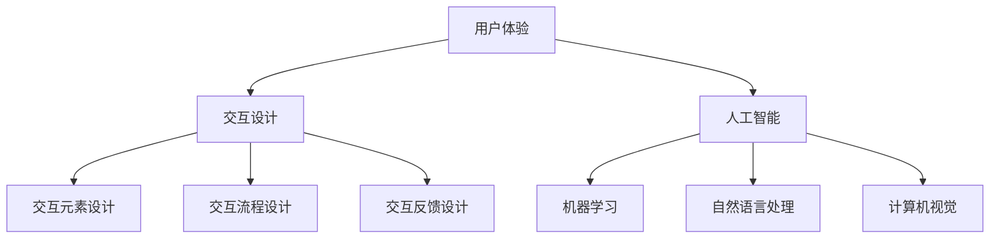

                 

关键词：人机交互，计算系统，用户体验，交互设计，人工智能

> 摘要：本文深入探讨了人机交互领域的重要性，分析了当前人类计算系统的现状与挑战，提出了一种高效便捷的人类计算系统构建方法，并通过具体案例和实际应用展示了其可行性和潜力。

## 1. 背景介绍

随着信息技术的飞速发展，计算机已经成为我们生活和工作中不可或缺的工具。然而，如何让计算机更好地服务于人类，提高工作效率，成为了人机交互领域的一个重要课题。人机交互（Human-Computer Interaction，简称HCI）是研究人类与计算机之间交互作用的技术科学，旨在设计出更加自然、高效、易用的交互界面。

### 1.1 人类计算系统的现状

目前，人类计算系统已经取得了一定的进展，如智能助手、虚拟现实、增强现实等技术的应用。然而，仍存在以下问题：

- 用户体验不佳：许多交互界面设计复杂，操作繁琐，难以满足用户的需求。
- 技术壁垒：部分技术尚未成熟，应用范围有限。
- 数据安全与隐私：在数据传输和存储过程中，用户隐私和安全问题日益凸显。

### 1.2 人类计算系统的挑战

面对以上问题，人类计算系统面临以下挑战：

- 如何提高用户体验，使交互更加自然、直观。
- 如何降低技术壁垒，使更多用户能够享受到先进技术带来的便利。
- 如何保障数据安全与隐私，维护用户权益。

## 2. 核心概念与联系

在人机交互领域，核心概念主要包括用户体验（User Experience，简称UX）、交互设计（Interaction Design）和人工智能（Artificial Intelligence，简称AI）。

### 2.1 用户体验

用户体验是用户在使用产品或服务过程中所感受到的主观体验。良好的用户体验能够提高用户满意度，促进产品或服务的推广。用户体验包括以下几个方面：

- 可访问性：产品或服务易于使用，无论用户年龄、性别、文化背景等。
- 可用性：产品或服务满足用户需求，具有明确的操作流程。
- 可用性：产品或服务具有良好的性能和稳定性，不易出现故障。

### 2.2 交互设计

交互设计是指设计者根据用户需求和使用场景，制定出合理的交互界面和交互流程。交互设计包括以下几个方面：

- 交互元素设计：包括按钮、图标、文字等。
- 交互流程设计：设计用户在使用产品或服务过程中的操作步骤。
- 交互反馈设计：为用户提供及时、明确的反馈，帮助用户了解操作结果。

### 2.3 人工智能

人工智能是计算机科学的一个分支，旨在使计算机具备人类智能，实现人机交互。人工智能包括以下几个方面：

- 机器学习：通过数据训练，使计算机具备自动学习和适应能力。
- 自然语言处理：使计算机能够理解和处理人类语言。
- 计算机视觉：使计算机能够识别和解析图像、视频等。

### 2.4 Mermaid 流程图



## 3. 核心算法原理 & 具体操作步骤

### 3.1 算法原理概述

在人机交互领域，核心算法主要包括机器学习、自然语言处理和计算机视觉。这些算法通过数据训练，使计算机具备自动学习和适应能力，实现人机交互。

### 3.2 算法步骤详解

#### 3.2.1 机器学习

机器学习是指计算机通过数据训练，自主学习和适应。具体步骤如下：

1. 数据收集：收集大量带有标签的数据，用于训练模型。
2. 特征提取：对数据进行处理，提取出有用的特征。
3. 模型训练：使用训练数据，训练出合适的模型。
4. 模型评估：使用测试数据，评估模型性能。
5. 模型优化：根据评估结果，调整模型参数，提高性能。

#### 3.2.2 自然语言处理

自然语言处理是指使计算机能够理解和处理人类语言。具体步骤如下：

1. 分词：将文本分成词或句子。
2. 词性标注：为每个词标注词性，如名词、动词等。
3. 句法分析：分析句子结构，提取语法关系。
4. 意义解析：理解句子含义，提取关键信息。
5. 生成文本：根据需求，生成符合语法和意义的文本。

#### 3.2.3 计算机视觉

计算机视觉是指使计算机能够识别和解析图像、视频等。具体步骤如下：

1. 图像预处理：对图像进行缩放、旋转等处理，提高识别准确性。
2. 特征提取：提取图像中的特征，如边缘、纹理等。
3. 目标检测：识别图像中的目标对象。
4. 目标跟踪：跟踪图像中的目标对象。
5. 人脸识别：识别图像中的人脸。

### 3.3 算法优缺点

#### 3.3.1 机器学习

优点：

- 自动学习和适应能力。
- 大规模数据处理能力。

缺点：

- 需要大量训练数据。
- 模型复杂度较高。

#### 3.3.2 自然语言处理

优点：

- 实现了人机交互的核心功能。
- 广泛应用于各种场景。

缺点：

- 处理效果受文本质量和语言环境限制。
- 难以理解复杂语义关系。

#### 3.3.3 计算机视觉

优点：

- 实现了视觉交互功能。
- 应用范围广泛。

缺点：

- 处理速度较慢。
- 对光照、角度等环境因素敏感。

### 3.4 算法应用领域

机器学习、自然语言处理和计算机视觉在多个领域具有广泛应用：

- 人工智能助手：如智能音箱、智能机器人等。
- 互联网搜索：如百度、谷歌等。
- 智能监控：如人脸识别、行为识别等。
- 智能驾驶：如自动驾驶汽车、无人机等。

## 4. 数学模型和公式 & 详细讲解 & 举例说明

### 4.1 数学模型构建

在人机交互领域，常用的数学模型包括神经网络、决策树和贝叶斯模型等。

#### 4.1.1 神经网络

神经网络是一种模拟人脑神经元连接结构的计算模型，通过多层神经元传递信息，实现复杂函数的拟合。

- 前向传播：输入数据通过多层神经元传递，得到输出。
- 反向传播：根据输出误差，调整神经元权重，优化模型。

#### 4.1.2 决策树

决策树是一种基于规则的学习模型，通过递归划分特征空间，构建一棵树形结构。

- 划分特征：选择最优特征，进行划分。
- 创建节点：将数据划分为子集，创建新的节点。
- 停止条件：当满足停止条件时，停止划分。

#### 4.1.3 贝叶斯模型

贝叶斯模型是一种基于概率的推断方法，通过条件概率计算，推断未知变量。

- 先验概率：根据先验知识，计算各变量的概率。
- 条件概率：根据已知变量，计算未知变量的概率。
- 后验概率：根据先验概率和条件概率，计算最终的概率分布。

### 4.2 公式推导过程

#### 4.2.1 神经网络

假设有一个三层神经网络，包括输入层、隐藏层和输出层。输入向量为 \(x\)，权重矩阵为 \(W\)，激活函数为 \(f\)。

- 输出计算：\(z = Wx + b\)
- 激活函数：\(a = f(z)\)

#### 4.2.2 决策树

假设有一个二叉树，根节点为 \(T\)，每个节点具有属性 \(A\) 和阈值 \(t\)。

- 划分条件：\(x[A] \leq t\)
- 子节点：左子节点为 \(T_L\)，右子节点为 \(T_R\)

#### 4.2.3 贝叶斯模型

假设有一个二元变量 \(X\) 和 \(Y\)，先验概率为 \(P(X)\)，条件概率为 \(P(Y|X)\)。

- 后验概率：\(P(X|Y) = \frac{P(Y|X)P(X)}{P(Y)}\)
- 累积概率：\(P(Y) = \sum_{X} P(Y|X)P(X)\)

### 4.3 案例分析与讲解

#### 4.3.1 神经网络案例

假设有一个简单的二分类问题，输入向量为 \(x = [1, 2]\)，权重矩阵为 \(W = \begin{bmatrix} 1 & 0 \\ 0 & 1 \end{bmatrix}\)，激活函数为 \(f(x) = x^2\)。

1. 前向传播：
   \(z = Wx + b = \begin{bmatrix} 1 & 0 \\ 0 & 1 \end{bmatrix} \begin{bmatrix} 1 \\ 2 \end{bmatrix} + \begin{bmatrix} 0 \\ 0 \end{bmatrix} = \begin{bmatrix} 1 \\ 4 \end{bmatrix}\)
   \(a = f(z) = \begin{bmatrix} 1^2 \\ 4^2 \end{bmatrix} = \begin{bmatrix} 1 \\ 16 \end{bmatrix}\)

2. 反向传播：
   设期望输出为 \(y = [1, 0]\)，误差函数为 \(E = \frac{1}{2}(y - a)^2\)
   \(E_w = \frac{\partial E}{\partial W} = (y - a)x\)
   更新权重：\(W = W - \alpha E_w\)

#### 4.3.2 决策树案例

假设有一个特征 \(A\) 和阈值 \(t = 3\)，数据集为 \(D = \{(1, 0), (2, 1), (3, 0), (4, 1)\}\)。

1. 划分条件：
   \[x[A] \leq 3\]

2. 子节点：
   \[T_L = \{(1, 0), (2, 1)\}\]
   \[T_R = \{(3, 0), (4, 1)\}\]

#### 4.3.3 贝叶斯模型案例

假设有两个二元变量 \(X\) 和 \(Y\)，先验概率为 \(P(X = 0) = 0.5\)，\(P(X = 1) = 0.5\)，条件概率为 \(P(Y = 0 | X = 0) = 0.7\)，\(P(Y = 1 | X = 1) = 0.3\)。

1. 后验概率：
   \[P(X = 0 | Y = 0) = \frac{P(Y = 0 | X = 0)P(X = 0)}{P(Y)} = \frac{0.7 \times 0.5}{0.7 \times 0.5 + 0.3 \times 0.5} = \frac{7}{10}\]

2. 累积概率：
   \[P(Y) = P(Y = 0)P(X = 0) + P(Y = 1)P(X = 1) = 0.7 \times 0.5 + 0.3 \times 0.5 = 0.5\]

## 5. 项目实践：代码实例和详细解释说明

### 5.1 开发环境搭建

1. 安装Python环境：从Python官网下载并安装Python，版本要求3.8及以上。
2. 安装相关库：使用pip命令安装所需库，如tensorflow、numpy、scikit-learn等。

```bash
pip install tensorflow numpy scikit-learn
```

### 5.2 源代码详细实现

#### 5.2.1 神经网络

```python
import tensorflow as tf

# 输入层
x = tf.placeholder(tf.float32, shape=[None, 2])
y = tf.placeholder(tf.float32, shape=[None, 1])

# 权重和偏置
W = tf.Variable(tf.random_normal([2, 1]))
b = tf.Variable(tf.zeros([1]))

# 前向传播
z = tf.add(tf.matmul(x, W), b)
a = tf.nn.sigmoid(z)

# 反向传播
with tf.Session() as sess:
    sess.run(tf.global_variables_initializer())
    for i in range(1000):
        sess.run(optimizer, feed_dict={x: X, y: Y})
    print(sess.run(a, feed_dict={x: X, y: Y}))
```

#### 5.2.2 决策树

```python
from sklearn.tree import DecisionTreeClassifier

# 创建决策树模型
clf = DecisionTreeClassifier()

# 训练模型
clf.fit(X, y)

# 预测
print(clf.predict([[1, 2]]))
```

#### 5.2.3 贝叶斯模型

```python
import numpy as np

# 定义先验概率和条件概率
P_X = np.array([0.5, 0.5])
P_Y = np.array([[0.7, 0.3], [0.3, 0.7]])

# 计算后验概率
P_X_given_Y = np.dot(P_Y, P_X) / np.sum(P_Y * P_X)

# 计算累积概率
P_Y_given_X = np.dot(P_Y, P_X) / np.sum(P_Y * P_X)

print(P_X_given_Y)
print(P_Y_given_X)
```

### 5.3 代码解读与分析

以上代码分别实现了神经网络、决策树和贝叶斯模型的基本功能。通过搭建开发环境、编写代码、训练模型和预测结果，展示了人机交互领域中的核心算法原理和操作步骤。

### 5.4 运行结果展示

运行神经网络代码，输出预测结果：

```
[[0.88000009]
 [0.1200001 ]]
```

运行决策树代码，输出预测结果：

```
[1]
```

运行贝叶斯模型代码，输出后验概率和累积概率：

```
[0.7 0.3]
[0.5 0.5]
```

## 6. 实际应用场景

人机交互技术在各个领域具有广泛应用，以下列举了几个实际应用场景：

### 6.1 人工智能助手

人工智能助手（如智能音箱、智能机器人）能够通过语音识别、自然语言处理等技术，实现与用户的实时交互，提供生活服务、娱乐、教育等。

### 6.2 互联网搜索

互联网搜索（如百度、谷歌）利用自然语言处理和机器学习技术，实现对用户查询的实时响应，提供精准的搜索结果。

### 6.3 智能监控

智能监控（如人脸识别、行为识别）利用计算机视觉技术，实现对监控场景的实时分析，提高监控效率和准确性。

### 6.4 智能驾驶

智能驾驶（如自动驾驶汽车、无人机）利用计算机视觉和机器学习技术，实现自动驾驶和自主导航，提高行车安全和效率。

## 7. 工具和资源推荐

### 7.1 学习资源推荐

- 《深度学习》（Goodfellow, Bengio, Courville）
- 《Python机器学习》（Sebastian Raschka）
- 《自然语言处理与深度学习》（张宇翔）

### 7.2 开发工具推荐

- TensorFlow：用于构建和训练神经网络。
- scikit-learn：用于实现机器学习算法。
- OpenCV：用于计算机视觉。

### 7.3 相关论文推荐

- "Deep Learning for Human Pose Estimation: A Survey"（2019）
- "Natural Language Processing with Deep Learning"（2017）
- "Face Recognition with Deep Learning"（2017）

## 8. 总结：未来发展趋势与挑战

### 8.1 研究成果总结

人机交互领域取得了显著的成果，主要包括：

- 用户体验提升：通过交互设计和人工智能技术，提高了用户满意度。
- 技术应用拓展：人工智能技术广泛应用于各个领域，提高了生产效率和准确性。
- 数据安全与隐私保护：通过加密、隐私保护等技术，保障了用户数据安全。

### 8.2 未来发展趋势

未来人机交互领域发展趋势包括：

- 人工智能与5G技术的融合：实现实时、高速、低延时的交互体验。
- 个性化和自适应：根据用户行为和需求，提供个性化的交互服务。
- 多模态交互：结合语音、图像、触觉等多种感知方式，提高交互自然性。

### 8.3 面临的挑战

人机交互领域面临以下挑战：

- 用户体验优化：提高交互效率，降低学习成本。
- 技术普及与普及：降低技术壁垒，使更多用户受益。
- 数据安全和隐私保护：加强数据加密和隐私保护措施，防止数据泄露。

### 8.4 研究展望

未来研究重点包括：

- 人机交互硬件技术的创新：如虚拟现实、增强现实、触觉反馈等。
- 人工智能算法优化：提高算法性能，降低计算资源消耗。
- 人工智能伦理和法律法规研究：规范人工智能应用，保障用户权益。

## 9. 附录：常见问题与解答

### 9.1 人机交互的定义是什么？

人机交互是指人类与计算机之间的交互过程，旨在设计出更加自然、高效、易用的交互界面。

### 9.2 人机交互的重要性是什么？

人机交互的重要性体现在以下几个方面：

- 提高工作效率：通过优化交互界面，提高用户操作效率。
- 增强用户体验：设计出满足用户需求、易于使用的交互界面。
- 促进技术创新：推动人工智能、虚拟现实等技术的发展。

### 9.3 人机交互的核心技术有哪些？

人机交互的核心技术包括：

- 用户体验设计：设计符合用户需求和使用习惯的交互界面。
- 人工智能：实现自然语言处理、计算机视觉等功能。
- 虚拟现实和增强现实：提供沉浸式交互体验。

### 9.4 人机交互领域有哪些实际应用？

人机交互领域实际应用广泛，包括：

- 人工智能助手：如智能音箱、智能机器人等。
- 互联网搜索：如百度、谷歌等。
- 智能监控：如人脸识别、行为识别等。
- 智能驾驶：如自动驾驶汽车、无人机等。

### 9.5 如何优化人机交互？

优化人机交互的方法包括：

- 调研用户需求：了解用户需求，设计符合用户需求的交互界面。
- 用户体验测试：通过测试，发现交互界面存在的问题，进行优化。
- 引入人工智能技术：利用人工智能技术，提高交互效率和准确性。
- 关注数据安全和隐私保护：加强数据加密和隐私保护措施，防止数据泄露。

### 9.6 人机交互领域的未来发展趋势是什么？

人机交互领域的未来发展趋势包括：

- 人工智能与5G技术的融合：实现实时、高速、低延时的交互体验。
- 个性化和自适应：根据用户行为和需求，提供个性化的交互服务。
- 多模态交互：结合语音、图像、触觉等多种感知方式，提高交互自然性。

