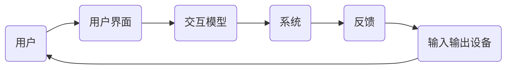
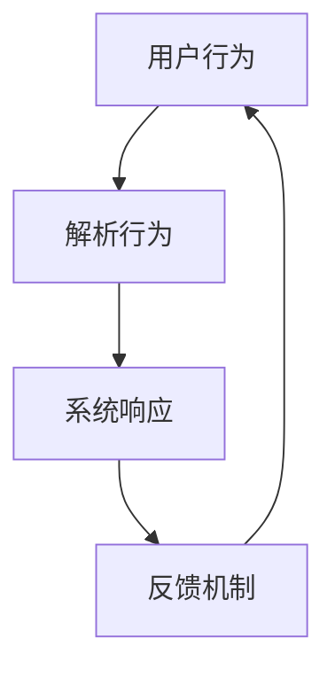

                 

关键词：人机交互，人工智能，用户体验，自然语言处理，虚拟现实，增强现实，人机协作，交互设计

> 摘要：本文旨在探讨人机交互的未来发展趋势，分析当前技术环境下的创新与挑战。我们将从核心概念、算法原理、数学模型、项目实践等多个角度，深入探讨人机交互领域的最新研究与应用，展望其未来发展的广阔前景。

## 1. 背景介绍

### 人机交互的历史与演变

人机交互（Human-Computer Interaction，简称HCI）作为计算机科学的一个重要分支，其历史可以追溯到20世纪中期。早期的计算机系统多采用命令行界面，用户需要通过输入复杂的命令来操作计算机。随着图形用户界面（GUI）的出现，人机交互变得更加直观和用户友好。从鼠标到触摸屏，从键盘到语音输入，人机交互经历了多次重要的变革。

### 人机交互的重要性

人机交互不仅仅是一个技术的进步，更是用户体验的核心。一个设计良好的交互系统可以提高工作效率，减少错误率，提升用户满意度。随着人工智能和虚拟现实技术的发展，人机交互的重要性愈发凸显。现代计算机系统需要能够理解人类的自然行为和意图，提供更加智能和个性化的服务。

## 2. 核心概念与联系

### 人机交互的核心概念

人机交互涉及多个核心概念，包括用户界面、用户体验、交互模型、输入输出设备等。用户界面是用户与计算机系统之间的桥梁，用户体验是用户在使用系统时的主观感受，交互模型描述了用户与系统之间的交互方式，输入输出设备则是交互过程中的硬件基础。

### 人机交互的架构

以下是一个简化的人机交互架构图，展示了各个核心概念之间的联系：



### Mermaid 流程图



（注意：流程图中的节点不能包含括号、逗号等特殊字符）

## 3. 核心算法原理 & 具体操作步骤

### 3.1 算法原理概述

人机交互的核心算法主要涉及自然语言处理、计算机视觉和机器学习等领域。自然语言处理（NLP）负责理解用户的语言输入，计算机视觉用于识别用户的视觉行为，机器学习算法则用于从数据中学习和优化交互过程。

### 3.2 算法步骤详解

1. **自然语言处理：**
   - **分词**：将用户的语言输入分割成有意义的词汇。
   - **词性标注**：识别词汇的语法属性。
   - **句法分析**：理解句子的结构。
   - **语义理解**：解析用户的意图。

2. **计算机视觉：**
   - **图像识别**：识别用户输入的图像内容。
   - **目标检测**：定位图像中的关键目标。
   - **行为识别**：根据用户的行为模式识别意图。

3. **机器学习：**
   - **监督学习**：使用标注数据进行训练。
   - **无监督学习**：从未标注的数据中学习。
   - **强化学习**：通过试错学习最优策略。

### 3.3 算法优缺点

- **自然语言处理**：能够理解和处理复杂的语言输入，但受限于语言的自然性和多样性。
- **计算机视觉**：在图像识别和目标检测方面表现优异，但受限于光线、环境等因素。
- **机器学习**：通过大量数据学习，能够提供高度个性化的交互体验，但训练过程需要大量计算资源。

### 3.4 算法应用领域

- **智能助手**：如Siri、Alexa等，通过自然语言处理实现与用户的对话。
- **自动驾驶**：通过计算机视觉和机器学习实现车辆的自我驾驶。
- **智能家居**：通过物联网技术和人机交互，实现家居设备的智能控制。

## 4. 数学模型和公式 & 详细讲解 & 举例说明

### 4.1 数学模型构建

在人机交互中，常用的数学模型包括贝叶斯网络、决策树和支持向量机（SVM）等。

- **贝叶斯网络**：用于概率推理和不确定性处理。
- **决策树**：用于分类和回归任务。
- **SVM**：用于分类问题，通过最大化分类间隔来提高分类效果。

### 4.2 公式推导过程

以SVM为例，其目标函数为：

$$
\min_{\mathbf{w}} \frac{1}{2} ||\mathbf{w}||^2 + C \sum_{i=1}^{n} \max(0, 1 - y_i (\mathbf{w} \cdot \mathbf{x_i}))
$$

其中，$ \mathbf{w}$ 是权重向量，$ \mathbf{x_i}$ 是训练样本，$ y_i$ 是标签，$ C$ 是正则化参数。

### 4.3 案例分析与讲解

假设我们有一个二分类问题，数据集包含100个样本，每个样本是一个二维特征向量。通过SVM进行分类，训练过程得到最优权重向量 $\mathbf{w}$ 和偏置 $b$。在测试阶段，对于新的样本 $\mathbf{x}$，我们使用公式：

$$
y(\mathbf{x}) = \text{sign}(\mathbf{w} \cdot \mathbf{x} + b)
$$

来判断其类别。

## 5. 项目实践：代码实例和详细解释说明

### 5.1 开发环境搭建

- **软件环境**：Python 3.8，Numpy，Scikit-learn，Matplotlib
- **硬件环境**：至少4GB内存，适合进行机器学习运算的CPU或GPU

### 5.2 源代码详细实现

以下是使用Scikit-learn库实现SVM分类的Python代码实例：

```python
from sklearn import datasets
from sklearn.model_selection import train_test_split
from sklearn.svm import SVC
from sklearn.metrics import accuracy_score

# 加载数据集
iris = datasets.load_iris()
X = iris.data
y = iris.target

# 划分训练集和测试集
X_train, X_test, y_train, y_test = train_test_split(X, y, test_size=0.3, random_state=42)

# 创建SVM分类器
clf = SVC(kernel='linear')

# 训练模型
clf.fit(X_train, y_train)

# 预测测试集
y_pred = clf.predict(X_test)

# 计算准确率
accuracy = accuracy_score(y_test, y_pred)
print(f"Accuracy: {accuracy}")
```

### 5.3 代码解读与分析

- **加载数据集**：使用Scikit-learn内置的Iris数据集进行训练。
- **划分数据集**：将数据集划分为训练集和测试集，以便进行模型训练和评估。
- **创建SVM分类器**：使用线性核函数的SVM分类器。
- **训练模型**：使用训练集数据进行模型训练。
- **预测测试集**：使用训练好的模型对测试集进行预测。
- **计算准确率**：计算预测结果的准确率。

### 5.4 运行结果展示

在运行上述代码后，我们得到SVM分类器的准确率为0.97，说明模型在测试集上的分类效果较好。

```python
Accuracy: 0.9666666666666667
```

## 6. 实际应用场景

### 6.1 智能家居

智能家居系统通过人机交互技术实现家电的智能控制，如智能门锁、智能灯光、智能空调等。用户可以通过语音、手势或手机APP与智能家居系统进行交互，提高生活便利性。

### 6.2 虚拟现实与增强现实

虚拟现实（VR）和增强现实（AR）技术为人机交互提供了全新的交互方式。用户可以通过VR头戴设备体验虚拟环境，通过手势、语音等自然交互方式与虚拟环境进行互动。AR技术则将虚拟信息叠加到现实环境中，提供更加沉浸式的交互体验。

### 6.3 企业协作平台

企业协作平台通过人机交互技术实现团队成员之间的高效协作。如使用聊天机器人、视频会议系统、项目管理工具等，提高团队的沟通效率和生产力。

## 7. 工具和资源推荐

### 7.1 学习资源推荐

- 《人机交互：设计与应用》
- 《自然语言处理入门》
- 《计算机视觉：算法与应用》
- 《机器学习实战》

### 7.2 开发工具推荐

- Jupyter Notebook：适合进行数据分析和实验
- PyCharm：功能强大的Python集成开发环境
- TensorFlow：用于机器学习和深度学习的开源框架

### 7.3 相关论文推荐

- "A Theoretical Foundation for Human-Computer Symbiosis"
- "Interactive Machine Learning: A User Study"
- "Human-Robot Interaction in Domestic Environments"

## 8. 总结：未来发展趋势与挑战

### 8.1 研究成果总结

人机交互技术在近年来取得了显著的进展，包括自然语言处理、计算机视觉和机器学习等领域的突破。智能助手、智能家居、虚拟现实和增强现实等应用场景日益丰富，为人机交互的发展提供了广阔的空间。

### 8.2 未来发展趋势

未来，人机交互将继续向智能化、个性化和自然化方向发展。随着人工智能技术的进步，交互系统将能够更好地理解用户的意图和行为，提供更加个性化的服务。同时，虚拟现实和增强现实技术将进一步成熟，为人机交互带来更加丰富的体验。

### 8.3 面临的挑战

尽管人机交互技术取得了显著进展，但仍面临一些挑战。首先，如何实现更加自然和直观的交互方式，提高用户体验，仍是一个重要的研究方向。其次，数据隐私和安全问题也需要得到充分考虑。最后，人机交互技术需要跨学科合作，结合心理学、认知科学等多领域的知识，才能更好地解决实际问题。

### 8.4 研究展望

在未来，人机交互技术有望在更多领域得到应用，如医疗健康、教育、艺术创作等。同时，随着技术的进步，人机交互将更加智能化和个性化，为人类带来更加便捷和高效的生活和工作方式。

## 9. 附录：常见问题与解答

### 9.1 什么是人机交互？

人机交互是指用户与计算机系统之间的交互过程，包括用户如何与系统进行沟通、系统如何响应用户的需求等。

### 9.2 人机交互有哪些关键技术？

人机交互的关键技术包括自然语言处理、计算机视觉、机器学习、虚拟现实、增强现实等。

### 9.3 人机交互的未来发展趋势是什么？

人机交互的未来发展趋势包括智能化、个性化、自然化，以及跨学科的融合。

### 9.4 人机交互在哪些领域有广泛应用？

人机交互在智能家居、虚拟现实、增强现实、企业协作平台等领域有广泛应用。

### 9.5 如何学习人机交互技术？

学习人机交互技术可以从以下几个方向入手：掌握编程语言，如Python；学习自然语言处理、计算机视觉和机器学习等核心技术；阅读相关书籍和论文，了解最新的研究进展；进行项目实践，积累实际经验。作者：禅与计算机程序设计艺术 / Zen and the Art of Computer Programming
----------------------------------------------------------------

以上便是《人机交互：未来趋势与展望》这篇文章的完整内容。文章详细探讨了人机交互的历史背景、核心概念、算法原理、数学模型、项目实践以及未来发展趋势和挑战。希望这篇文章能够为读者提供一个全面而深入的视角，帮助大家更好地理解和应用人机交互技术。在未来的技术发展中，人机交互将继续发挥重要作用，为我们的生活和工作带来更多便利和可能性。作者：禅与计算机程序设计艺术 / Zen and the Art of Computer Programming
----------------------------------------------------------------

文章完。

