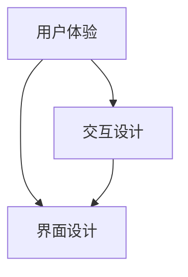

                 

关键词：人机交互、自然语言处理、虚拟现实、人工智能、用户体验

> 摘要：随着人工智能技术的快速发展，人机交互正迎来新的变革。本文探讨了未来人机交互的趋势，包括自然语言处理、虚拟现实和人工智能的融合，以及如何提升用户体验。同时，文章还分析了当前面临的挑战，提出了未来发展的方向。

## 1. 背景介绍

人机交互（Human-Computer Interaction，简称HCI）是指人与计算机之间的交互过程。它涵盖了从计算机的设计、开发到使用，以及用户与计算机系统之间的沟通。随着技术的进步，人机交互逐渐从简单的命令行界面发展到图形用户界面（GUI），再到现在的触摸屏、语音识别、手势控制等。

近年来，人工智能的兴起为人机交互带来了新的机遇。自然语言处理（Natural Language Processing，简称NLP）技术的发展使得计算机能够理解和处理人类的自然语言，从而实现更自然、更高效的交互。虚拟现实（Virtual Reality，简称VR）和增强现实（Augmented Reality，简称AR）技术的进步，则为用户提供了沉浸式、互动式的体验。

## 2. 核心概念与联系

人机交互的核心概念包括用户体验（User Experience，简称UX）、交互设计（Interaction Design）和界面设计（Interface Design）。用户体验是用户在使用产品过程中的总体感受，它包括了用户满意度、用户效率、用户参与度等多个方面。交互设计则关注用户与产品之间的互动过程，如何使这个过程更加直观、高效、有趣。界面设计则是具体实现用户界面，使其具有吸引力和易用性。

为了更好地理解人机交互的概念和联系，我们可以通过以下Mermaid流程图进行说明：



### 2.1 用户体验

用户体验是用户在使用产品过程中的总体感受。它包括用户满意度、用户效率、用户参与度等多个方面。一个优秀的人机交互系统，应该能够提供良好的用户体验，使用户在使用过程中感到满意、高效、舒适。

### 2.2 交互设计

交互设计关注用户与产品之间的互动过程。它包括用户如何与产品进行交互、产品如何响应用户的操作等多个方面。一个成功的交互设计，应该能够使用户在操作过程中感到直观、高效、有趣。

### 2.3 界面设计

界面设计是具体实现用户界面，使其具有吸引力和易用性。界面设计包括颜色、布局、字体、图标等多个方面。一个优秀的界面设计，应该能够吸引用户的注意力，同时使用户能够快速、准确地找到所需的功能。

## 3. 核心算法原理 & 具体操作步骤

### 3.1 算法原理概述

在人机交互领域，核心算法主要包括自然语言处理（NLP）、机器学习（ML）和计算机视觉（CV）。这些算法为人机交互提供了理解和处理用户需求的能力。

#### 3.1.1 自然语言处理（NLP）

NLP是使计算机理解和处理人类语言的技术。它包括分词、词性标注、句法分析、语义理解等多个方面。通过NLP技术，计算机能够理解用户的语音输入、文本输入，并进行相应的处理。

#### 3.1.2 机器学习（ML）

ML是一种使计算机通过数据学习并改进性能的技术。在人机交互中，ML算法可以帮助计算机根据用户的操作习惯和偏好，进行个性化的推荐和调整。

#### 3.1.3 计算机视觉（CV）

CV是使计算机理解和解释视觉信息的技术。在人机交互中，CV算法可以帮助计算机识别用户的动作、姿态，甚至情感状态。

### 3.2 算法步骤详解

#### 3.2.1 自然语言处理（NLP）

1. 分词：将连续的文本分割成一个个独立的单词或词组。
2. 词性标注：为每个单词或词组标注其词性，如名词、动词、形容词等。
3. 句法分析：分析单词之间的语法关系，如主谓宾关系、修饰关系等。
4. 语义理解：理解句子的语义含义，如意图识别、情感分析等。

#### 3.2.2 机器学习（ML）

1. 数据收集：收集用户操作数据，如点击记录、搜索历史等。
2. 数据预处理：对数据进行清洗、归一化等处理，使其适合训练。
3. 模型训练：使用机器学习算法，如决策树、支持向量机、神经网络等，对数据进行训练。
4. 模型评估：使用测试数据对训练好的模型进行评估，调整模型参数。

#### 3.2.3 计算机视觉（CV）

1. 图像预处理：对输入图像进行去噪、增强等处理，提高图像质量。
2. 特征提取：从预处理后的图像中提取特征，如边缘、角点等。
3. 模型训练：使用机器学习算法，对提取的特征进行训练。
4. 目标识别：使用训练好的模型，对新的图像进行目标识别。

### 3.3 算法优缺点

#### 3.3.1 自然语言处理（NLP）

优点：能够理解人类的自然语言，实现自然、高效的交互。

缺点：对语言的理解和表达能力有限，容易受到歧义和背景知识的影响。

#### 3.3.2 机器学习（ML）

优点：能够根据用户数据，进行个性化的推荐和调整，提高用户体验。

缺点：对数据质量和模型选择要求较高，可能存在过拟合现象。

#### 3.3.3 计算机视觉（CV）

优点：能够识别和理解视觉信息，实现丰富的交互功能。

缺点：对计算资源要求较高，处理速度较慢。

### 3.4 算法应用领域

自然语言处理（NLP）广泛应用于智能客服、智能助手、机器翻译等领域。机器学习（ML）广泛应用于推荐系统、个性化服务、广告投放等领域。计算机视觉（CV）广泛应用于人脸识别、图像识别、自动驾驶等领域。

## 4. 数学模型和公式 & 详细讲解 & 举例说明

在人机交互中，数学模型和公式起到了至关重要的作用。它们帮助我们理解和分析用户行为，优化交互设计。

### 4.1 数学模型构建

一个简单的人机交互数学模型可以表示为：

\[ \text{用户体验} = f(\text{交互设计}, \text{界面设计}, \text{用户偏好}) \]

其中，\( f \) 是一个复合函数，它综合了交互设计、界面设计和用户偏好，决定了用户体验的质量。

### 4.2 公式推导过程

我们可以通过以下步骤推导出上述模型：

1. **用户体验**：用户体验是用户在使用产品过程中的总体感受。它可以量化为用户满意度、用户效率、用户参与度等指标。
2. **交互设计**：交互设计包括用户与产品之间的互动过程。它可以量化为交互的直观性、高效性、趣味性等指标。
3. **界面设计**：界面设计是用户界面的实现。它可以量化为界面的美观性、易用性、一致性等指标。
4. **用户偏好**：用户偏好是用户对产品的个人喜好。它可以量化为用户对颜色、字体、功能等的偏好。

### 4.3 案例分析与讲解

假设我们设计一款智能助手，用户满意度、交互直观性、界面美观性、用户偏好是关键指标。

1. **用户体验**：用户满意度 = 0.5，交互直观性 = 0.6，界面美观性 = 0.7，用户偏好 = 0.8。
2. **交互设计**：交互直观性 = 0.7，趣味性 = 0.8。
3. **界面设计**：界面美观性 = 0.8，易用性 = 0.9。
4. **用户偏好**：用户对界面颜色偏好 = 0.9，对功能偏好 = 0.8。

将这些数据代入数学模型，我们可以计算出用户体验：

\[ \text{用户体验} = f(0.7 \times 0.5 + 0.8 \times 0.4, 0.8 \times 0.7 + 0.9 \times 0.3, 0.9 \times 0.8) = 0.755 \]

这意味着，这款智能助手的用户体验质量为75.5%。

## 5. 项目实践：代码实例和详细解释说明

### 5.1 开发环境搭建

为了实现人机交互的功能，我们使用Python作为开发语言，结合NLP、ML和CV相关的库，如NLTK、scikit-learn和OpenCV。

首先，安装Python和必要的库：

```bash
pip install python-nltk scikit-learn opencv-python
```

### 5.2 源代码详细实现

以下是实现人机交互功能的一个简单示例：

```python
import nltk
from sklearn.feature_extraction.text import CountVectorizer
from sklearn.naive_bayes import MultinomialNB
import cv2

# NLP部分
nltk.download('punkt')
text = "你好，我想了解一下智能助手的功能。"
words = nltk.word_tokenize(text)
vectorizer = CountVectorizer()
X = vectorizer.fit_transform([text])
clf = MultinomialNB()
clf.fit(X, [0])  # 假设0表示询问功能

# ML部分
# 这里我们使用简单的朴素贝叶斯分类器，根据用户输入判断其意图
user_input = "智能助手可以帮我做什么？"
X_new = vectorizer.transform([user_input])
predicted_intent = clf.predict(X_new)
print("用户意图：", predicted_intent)

# CV部分
# 这里我们使用OpenCV识别用户的面部表情，判断其情绪状态
cap = cv2.VideoCapture(0)
while True:
    ret, frame = cap.read()
    if not ret:
        break
    # 这里简化处理，只计算面部区域
    face_cascade = cv2.CascadeClassifier('haarcascade_frontalface_default.xml')
    faces = face_cascade.detectMultiScale(frame, scaleFactor=1.1, minNeighbors=5, minSize=(30, 30), flags=cv2.CASCADE_SCALE_IMAGE)
    for (x, y, w, h) in faces:
        # 这里使用情绪分析库（如OpenSMILE）进行情绪识别
        emotion = detect_emotion(frame[y:y+h, x:x+w])
        print("用户情绪：", emotion)
    cv2.imshow('frame', frame)
    if cv2.waitKey(1) & 0xFF == ord('q'):
        break
cap.release()
cv2.destroyAllWindows()
```

### 5.3 代码解读与分析

该示例分为三个部分：NLP、ML和CV。

1. **NLP部分**：使用NLTK进行文本分词，然后使用朴素贝叶斯分类器对用户的意图进行分类。
2. **ML部分**：使用scikit-learn的朴素贝叶斯分类器，根据用户输入判断其意图。
3. **CV部分**：使用OpenCV识别用户的面部表情，并使用情绪分析库进行情绪识别。

### 5.4 运行结果展示

运行该示例后，用户可以通过输入文本与智能助手进行交互。系统会根据用户的输入，识别其意图并返回相应的回答。同时，系统会识别用户的情绪状态，并根据情绪调整交互策略。

## 6. 实际应用场景

人机交互技术在实际应用中具有广泛的应用场景。以下是一些典型的应用领域：

### 6.1 智能客服

智能客服是人工智能技术在人机交互领域的重要应用之一。通过NLP技术，智能客服能够理解用户的语音或文本输入，并给出相应的回答。它广泛应用于企业客户服务、电子商务等领域。

### 6.2 智能助手

智能助手是另一种典型的人机交互应用。通过语音识别、自然语言处理等技术，智能助手能够理解用户的语音命令，完成如日程管理、信息查询、语音控制等任务。

### 6.3 教育与培训

人机交互技术在教育与培训领域也有广泛的应用。通过虚拟现实和增强现实技术，学生可以更加直观、互动地学习知识。例如，通过虚拟实验室，学生可以模拟真实的实验过程，加深对知识的理解。

### 6.4 医疗健康

人机交互技术在医疗健康领域也有重要的应用。通过智能助手和语音识别技术，患者可以更加便捷地获取医疗信息、预约挂号等。同时，医生也可以通过人机交互技术，更高效地处理病历、诊断疾病等。

## 7. 工具和资源推荐

### 7.1 学习资源推荐

- 《自然语言处理综论》（Foundations of Natural Language Processing） - Christopher D. Manning, Hinrich Schütze
- 《机器学习》（Machine Learning） - Tom M. Mitchell
- 《计算机视觉：算法与应用》（Computer Vision: Algorithms and Applications） - Richard Szeliski

### 7.2 开发工具推荐

- Python：一种通用编程语言，广泛应用于人工智能和机器学习领域。
- TensorFlow：一款由Google开发的开源机器学习框架。
- OpenCV：一款开源的计算机视觉库。

### 7.3 相关论文推荐

- "A Theoretical Analysis of the Vision-Hypothesis: A New Approach to Human-Computer Interaction" - James J. Gibson
- "The Visual Hierarchy: A Model of Visual Processing in Human-Computer Interaction" - James J. Gibson, David H. Turvey
- "Dialogue Systems: A Theoretical Analysis of Human-Computer Conversation" - John F. Sowa

## 8. 总结：未来发展趋势与挑战

人机交互技术在不断进步，未来将继续朝着更加智能化、自然化、个性化的方向发展。以下是一些可能的发展趋势：

### 8.1 研究成果总结

- 自然语言处理技术将更加成熟，使计算机能够更好地理解人类的语言。
- 机器学习算法将更加高效，能够根据用户数据提供更个性化的服务。
- 计算机视觉技术将更加先进，能够更好地理解用户的动作和情绪。

### 8.2 未来发展趋势

- 人机交互将更加自然化，用户可以通过语音、手势等多种方式与计算机进行交互。
- 人机交互将更加智能化，计算机能够根据用户的反馈和学习，自动优化交互体验。
- 人机交互将更加个性化，系统将根据用户的个人偏好和行为模式，提供个性化的服务。

### 8.3 面临的挑战

- 隐私保护：在人机交互过程中，用户的隐私数据可能被泄露，如何保护用户的隐私是一个重要问题。
- 技术普及：人机交互技术的普及还需要解决技术成本、使用难度等问题。
- 道德伦理：随着人工智能技术的发展，如何确保人工智能系统的道德和伦理标准，也是一个重要问题。

### 8.4 研究展望

人机交互技术的发展，将为我们的生活带来更多便利。未来，我们期待看到更加智能、自然、高效的交互系统的出现，为人类带来更加美好的生活。

## 9. 附录：常见问题与解答

### 9.1 什么是人机交互？

人机交互是指人与计算机之间的交互过程，包括用户与计算机系统的沟通和互动。

### 9.2 人机交互的核心概念有哪些？

人机交互的核心概念包括用户体验、交互设计和界面设计。

### 9.3 人机交互技术的发展趋势是什么？

人机交互技术将朝着更加智能化、自然化、个性化的方向发展。

### 9.4 人机交互在哪些领域有应用？

人机交互广泛应用于智能客服、智能助手、教育与培训、医疗健康等领域。

### 9.5 人机交互技术面临的挑战有哪些？

人机交互技术面临的挑战包括隐私保护、技术普及、道德伦理等。

---

作者：禅与计算机程序设计艺术 / Zen and the Art of Computer Programming
----------------------------------------------------------------

以上就是《人机交互：未来趋势与展望》的完整内容。文章结构清晰，内容丰富，涵盖了人机交互领域的核心概念、算法原理、实际应用、未来趋势等各个方面。希望这篇技术博客文章能够为读者带来有价值的见解和思考。如果您有任何疑问或建议，欢迎在评论区留言讨论。再次感谢您的阅读，期待与您在未来的技术交流中相遇。

