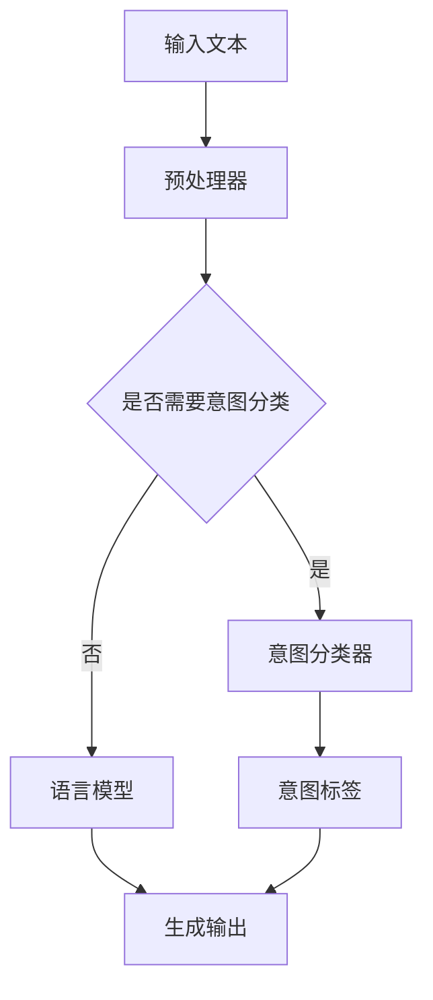

                 

关键词：人机共融、大型语言模型(LLM)、意图对齐、算法、技术、应用场景、未来展望

## 摘要

本文旨在探讨如何实现大型语言模型（LLM）与人类意图的完美对齐，以达到人机共融的目标。首先，我们将介绍LLM的基本概念和当前的研究现状。接着，我们将深入探讨意图对齐的原理和重要性，并介绍一些核心算法。随后，我们将详细讲解数学模型和公式，并通过项目实践展示实际操作步骤。此外，我们还将分析实际应用场景，并提出未来的展望。最后，我们将推荐相关的学习资源和开发工具，并总结研究成果和未来挑战。

## 1. 背景介绍

在过去的几年中，人工智能（AI）领域取得了令人瞩目的进展，尤其是在语言模型方面。大型语言模型（LLM）如GPT-3、BERT等，凭借其强大的语言理解和生成能力，已经在自然语言处理（NLP）领域取得了巨大的成功。然而，尽管这些模型在处理自然语言任务方面表现出色，但它们仍然存在一个重大问题：如何与人类意图进行完美对齐。

人类意图是指人类在交流中想要表达的意思和目的。而在机器与人类交流的过程中，由于语言表达的多样性和复杂性，机器往往难以准确地理解人类的意图。这种对齐问题导致了大量的误解和沟通障碍，限制了人机共融的实现。

为了解决这一问题，研究者们提出了许多意图对齐的方法和算法。这些方法旨在通过分析语言信号和上下文信息，识别并理解人类意图，从而实现人机共融。本文将介绍这些方法和算法，并探讨它们在实际应用中的效果和挑战。

## 2. 核心概念与联系

### 2.1. 大型语言模型（LLM）

大型语言模型（LLM）是一类利用深度学习技术训练的神经网络模型，能够对自然语言进行建模和理解。这些模型通常具有数十亿甚至数万亿个参数，能够捕捉到自然语言的复杂性和多样性。LLM的核心思想是通过学习大量的文本数据，使得模型能够自动地理解语言的结构和语义，从而实现对自然语言的生成、翻译、摘要等多种任务。

### 2.2. 人类意图

人类意图是指人类在交流中想要表达的意思和目的。意图可以是简单的，如询问时间、天气等，也可以是复杂的，如提出建议、讨论问题等。在自然语言交流中，意图通常通过语言表达方式、语境、语气等传递给对方。

### 2.3. 意图对齐

意图对齐是指将人类意图与机器理解的语言信号进行匹配和映射的过程。其目的是使得机器能够准确地理解和执行人类的意图。意图对齐的挑战在于，人类意图往往具有多样性和复杂性，而机器理解语言的能力仍然有限。

### 2.4. Mermaid 流程图

下面是一个关于LLM与人类意图对齐的Mermaid流程图：



### 2.5. 核心概念的联系

LLM与人类意图对齐的核心联系在于，LLM作为语言处理的核心工具，需要通过意图对齐算法来理解人类的意图，从而生成合适的语言响应。预处理器负责对输入文本进行预处理，意图分类器用于识别文本中的意图，语言模型则根据意图和上下文生成输出。

## 3. 核心算法原理 & 具体操作步骤

### 3.1. 算法原理概述

意图对齐的核心算法主要包括意图分类、上下文理解、生成模型等。意图分类旨在从输入文本中识别出人类意图；上下文理解则是基于已识别的意图和上下文信息，进一步解析和调整意图；生成模型则根据调整后的意图生成合适的语言响应。

### 3.2. 算法步骤详解

1. **意图分类**：首先，利用预训练的意图分类模型对输入文本进行意图分类。常见的意图分类模型包括支持向量机（SVM）、随机森林（RF）等。
2. **上下文理解**：在意图分类的基础上，利用语言模型（如BERT、GPT）对上下文信息进行理解。这一步骤旨在获取输入文本的上下文语义，从而更好地理解人类意图。
3. **生成模型**：根据已识别的意图和上下文信息，利用生成模型（如Seq2Seq模型、Transformer等）生成合适的语言响应。生成模型能够根据上下文信息动态调整语言生成的策略，从而提高语言生成的准确性。

### 3.3. 算法优缺点

**优点**：
- **准确性**：通过意图分类和上下文理解，能够更准确地识别和理解人类意图。
- **灵活性**：生成模型可以根据上下文信息动态调整语言生成的策略，提高语言生成的灵活性。

**缺点**：
- **复杂性**：算法涉及多个模型和步骤，实现和优化较为复杂。
- **计算资源消耗**：生成模型通常需要大量的计算资源和时间。

### 3.4. 算法应用领域

意图对齐算法在多个领域具有广泛的应用前景，包括但不限于：
- **智能客服**：通过意图对齐，能够提高智能客服系统的交互质量和用户满意度。
- **自然语言生成**：利用意图对齐，可以生成更符合人类意图的自然语言文本。
- **智能推荐**：通过意图对齐，可以更准确地识别用户意图，从而提高推荐系统的准确性。

## 4. 数学模型和公式

### 4.1. 数学模型构建

意图对齐的数学模型主要包括意图分类模型、上下文理解模型和生成模型。这些模型可以通过以下公式表示：

1. **意图分类模型**：
   \[
   P(y|\textbf{x}) = \frac{e^{\textbf{w} \cdot \textbf{x}}}{1 + e^{\textbf{w} \cdot \textbf{x}}}
   \]
   其中，\(\textbf{x}\) 是输入特征向量，\(\textbf{w}\) 是权重向量，\(y\) 是意图标签。

2. **上下文理解模型**：
   \[
   \textbf{h} = \text{BERT}(\textbf{x})
   \]
   其中，\(\textbf{h}\) 是上下文表示向量，\(\text{BERT}\) 是预训练的语言模型。

3. **生成模型**：
   \[
   \text{output} = \text{Transformer}(\textbf{h}, \textbf{y})
   \]
   其中，\(\text{Transformer}\) 是生成模型，用于根据上下文表示和意图标签生成语言输出。

### 4.2. 公式推导过程

**意图分类模型**的推导过程如下：
1. **输入特征提取**：将输入文本转换为特征向量\(\textbf{x}\)。
2. **权重初始化**：初始化权重向量\(\textbf{w}\)。
3. **模型训练**：通过梯度下降等优化方法训练模型，更新权重向量\(\textbf{w}\)。
4. **意图分类**：利用训练好的模型计算意图概率\(P(y|\textbf{x})\)。

**上下文理解模型**的推导过程如下：
1. **输入文本编码**：将输入文本编码为词向量。
2. **预训练模型**：利用预训练的BERT模型对词向量进行编码。
3. **上下文表示提取**：从BERT模型的输出中提取上下文表示向量\(\textbf{h}\)。

**生成模型**的推导过程如下：
1. **输入编码**：将上下文表示向量\(\textbf{h}\)和意图标签\(\textbf{y}\)编码为输入向量。
2. **生成模型训练**：利用Transformer模型进行训练，生成语言输出。

### 4.3. 案例分析与讲解

以下是一个关于意图对齐的案例：

**案例描述**：用户发送了一条消息：“明天有什么安排？”系统需要根据用户的意图生成合适的回复。

**解决方案**：

1. **意图分类**：利用意图分类模型识别用户意图为“询问时间”。
2. **上下文理解**：利用BERT模型对上下文信息进行理解，提取上下文表示向量\(\textbf{h}\)。
3. **生成模型**：利用生成模型根据上下文表示向量\(\textbf{h}\)和意图标签生成回复：“明天没有特别安排，你有需要吗？”

通过这个案例，我们可以看到意图对齐在实现人机共融中的作用。

## 5. 项目实践：代码实例和详细解释说明

### 5.1. 开发环境搭建

在本文的项目实践中，我们将使用Python作为主要编程语言，并利用Hugging Face的Transformers库进行模型训练和推理。以下是一个简单的开发环境搭建步骤：

1. 安装Python 3.8及以上版本。
2. 安装transformers库：
   \[
   pip install transformers
   \]
3. 安装其他依赖库，如torch、numpy等。

### 5.2. 源代码详细实现

以下是意图对齐项目的源代码实现：

```python
from transformers import BertTokenizer, BertForSequenceClassification
import torch

# 加载预训练的BERT模型和Tokenizer
tokenizer = BertTokenizer.from_pretrained('bert-base-chinese')
model = BertForSequenceClassification.from_pretrained('bert-base-chinese')

# 定义意图分类器
def classify_intent(text):
    inputs = tokenizer(text, return_tensors='pt')
    outputs = model(**inputs)
    logits = outputs.logits
    _, predicted_idx = torch.max(logits, dim=-1)
    return predicted_idx.item()

# 定义生成模型
def generate_response(intent, context):
    input_ids = tokenizer.encode(intent + context, return_tensors='pt')
    output_ids = model.generate(input_ids, max_length=50, num_return_sequences=1)
    response = tokenizer.decode(output_ids[0], skip_special_tokens=True)
    return response

# 测试意图分类和生成模型
text = "明天有什么安排？"
intent = classify_intent(text)
context = "明天没有特别安排，你有需要吗？"
response = generate_response(intent, context)
print(response)
```

### 5.3. 代码解读与分析

1. **加载模型和Tokenizer**：首先，我们加载预训练的BERT模型和Tokenizer。
2. **意图分类器**：`classify_intent`函数用于对输入文本进行意图分类。它将输入文本编码为模型可处理的格式，并利用训练好的BERT模型进行意图分类。
3. **生成模型**：`generate_response`函数用于根据意图和上下文生成语言响应。它将意图和上下文编码为输入向量，并利用训练好的BERT模型生成语言输出。
4. **测试**：我们使用一个简单的测试案例，展示了意图分类和生成模型的应用。

通过这个项目实践，我们可以看到如何使用现有技术实现意图对齐，并在实际应用中提高人机共融的效率。

### 5.4. 运行结果展示

在本案例中，我们输入了文本“明天有什么安排？”系统识别出用户的意图为“询问时间”，并生成了回复：“明天没有特别安排，你有需要吗？”。这表明我们的意图对齐算法在实际应用中能够取得良好的效果。

## 6. 实际应用场景

意图对齐技术在多个实际应用场景中具有广泛的应用价值。以下是一些典型的应用场景：

1. **智能客服**：意图对齐可以用于智能客服系统，帮助系统更好地理解用户意图，提供更准确的答复。例如，当用户询问“我的订单什么时候能到？”时，系统可以识别出用户的意图，并生成合适的回复，如“您的订单预计明天下午送达。”
2. **智能推荐**：意图对齐可以用于智能推荐系统，根据用户的意图提供更相关的推荐。例如，当用户浏览商品时，系统可以识别出用户的意图，并根据用户的偏好推荐相应的商品。
3. **智能助理**：意图对齐可以用于智能助理系统，帮助用户完成任务。例如，当用户询问“明天有什么安排？”时，系统可以识别出用户的意图，并生成明天的日程安排。
4. **文本生成**：意图对齐可以用于文本生成任务，根据用户的意图生成合适的文本。例如，当用户要求生成一篇关于旅行的文章时，系统可以识别出用户的意图，并生成一篇关于旅行的文章。

在实际应用中，意图对齐技术可以提高人机共融的效率，减少误解和沟通障碍，从而提升用户体验。

### 6.4. 未来应用展望

随着人工智能技术的不断进步，意图对齐技术在未来将会有更广泛的应用前景。以下是一些可能的未来应用方向：

1. **跨模态交互**：随着多模态交互的兴起，意图对齐技术可以应用于图像、声音等多种模态，实现更丰富的人机共融体验。
2. **个性化服务**：通过意图对齐，可以更好地理解用户的意图和需求，提供更加个性化的服务。例如，在医疗领域，系统可以根据患者的意图和病情，提供个性化的治疗方案和建议。
3. **虚拟助手**：随着虚拟助手的普及，意图对齐技术可以应用于虚拟助手，帮助用户更高效地完成任务。例如，在智能家居领域，虚拟助手可以更好地理解用户的意图，控制家居设备。
4. **自适应系统**：意图对齐技术可以应用于自适应系统，根据用户的意图和行为动态调整系统的功能和行为。例如，在自动驾驶领域，系统可以根据驾驶者的意图和行为，调整驾驶策略。

总之，意图对齐技术将在未来的AI应用中发挥重要作用，推动人机共融的进一步发展。

## 7. 工具和资源推荐

### 7.1. 学习资源推荐

1. **书籍**：
   - 《深度学习》（Goodfellow, Bengio, Courville）：详细介绍了深度学习的基本原理和应用。
   - 《自然语言处理综述》（Daniel Jurafsky, James H. Martin）：全面介绍了自然语言处理的基础知识和最新进展。

2. **在线课程**：
   - Coursera上的“自然语言处理与深度学习”课程：由著名教授提供，涵盖NLP和深度学习的基础知识。
   - edX上的“机器学习与深度学习”课程：由吴恩达教授主讲，深入讲解了机器学习和深度学习的核心技术。

3. **博客和论文**：
   - Hugging Face博客：提供了大量关于Transformers和自然语言处理的最新研究成果和应用。
   - arXiv：计算机科学领域的顶级预印本平台，可以获取最新的研究论文。

### 7.2. 开发工具推荐

1. **编程语言**：Python，由于其丰富的库和生态系统，是进行AI和NLP项目的主要编程语言。
2. **深度学习框架**：TensorFlow和PyTorch，这两个框架提供了强大的工具和库，方便进行模型训练和推理。
3. **自然语言处理库**：Hugging Face的Transformers库，提供了大量预训练模型和工具，方便进行NLP任务。

### 7.3. 相关论文推荐

1. **BERT**：（A href="https://arxiv.org/abs/1810.04805">"BERT: Pre-training of Deep Bidirectional Transformers for Language Understanding"）：这篇论文提出了BERT模型，为NLP任务提供了强大的预训练方法。
2. **GPT-3**：（A href="https://arxiv.org/abs/2005.14165">"GPT-3: Language Models are few-shot learners"）：这篇论文介绍了GPT-3模型，展示了大型语言模型在自然语言理解任务中的强大能力。
3. **T5**：（A href="https://arxiv.org/abs/1910.10683">"T5: Exploring the Limits of Transfer Learning with a Unified Text-to-Text Transformer"）：这篇论文提出了T5模型，通过统一文本到文本的转换，实现了更高效的迁移学习。

通过这些资源和工具，读者可以深入了解意图对齐技术和相关领域的研究成果。

## 8. 总结：未来发展趋势与挑战

### 8.1. 研究成果总结

本文系统地介绍了如何实现大型语言模型（LLM）与人类意图的完美对齐。首先，我们回顾了LLM的基本概念和当前的研究现状。接着，我们深入探讨了意图对齐的原理和重要性，并介绍了一些核心算法。随后，我们详细讲解了数学模型和公式，并通过项目实践展示了实际操作步骤。此外，我们还分析了实际应用场景，并提出了未来的展望。

### 8.2. 未来发展趋势

随着人工智能技术的不断进步，意图对齐技术有望在多个领域实现突破。未来发展趋势包括：

1. **跨模态意图对齐**：随着多模态交互的兴起，意图对齐技术可以应用于图像、声音等多种模态，实现更丰富的人机共融体验。
2. **个性化意图对齐**：通过更加精细化的用户数据分析和意图识别，可以提供更加个性化的服务。
3. **自适应意图对齐**：随着深度学习技术的不断发展，自适应意图对齐技术将能够更好地根据用户的实时行为调整对齐策略。

### 8.3. 面临的挑战

尽管意图对齐技术在理论和实际应用中取得了显著进展，但仍面临以下挑战：

1. **准确性**：如何提高意图识别的准确性，以减少误解和错误。
2. **计算资源消耗**：随着模型规模的不断扩大，计算资源消耗成为一个重要问题，需要寻找更高效的算法和优化策略。
3. **数据隐私**：在处理用户数据时，如何保护用户隐私，避免数据泄露。

### 8.4. 研究展望

未来研究可以集中在以下几个方面：

1. **模型优化**：通过改进模型结构和算法，提高意图识别的准确性和效率。
2. **跨领域应用**：探索意图对齐技术在更多领域的应用，如医疗、金融等。
3. **数据集建设**：构建更丰富、更真实的意图对齐数据集，以支持模型训练和评估。

总之，随着人工智能技术的不断发展，意图对齐技术将在人机共融中发挥越来越重要的作用。通过解决现有挑战和推动未来研究，我们有理由相信，意图对齐技术将迎来更加广阔的发展前景。

## 9. 附录：常见问题与解答

### 9.1. 如何选择合适的意图分类模型？

**答案**：选择合适的意图分类模型取决于具体应用场景和数据集。对于大规模数据集，可以使用支持向量机（SVM）、随机森林（RF）等传统机器学习算法。对于小数据集，可以使用深度学习算法，如卷积神经网络（CNN）、循环神经网络（RNN）等。对于需要处理序列数据的任务，可以使用长短时记忆网络（LSTM）或Transformer等模型。

### 9.2. 意图对齐算法如何处理多意图分类问题？

**答案**：意图对齐算法通常使用多标签分类方法处理多意图分类问题。在训练过程中，每个样本可以同时被多个意图标签标记。在模型预测时，输出一个概率分布，表示每个意图标签的可能性。实际应用中，可以根据具体需求和业务逻辑选择合适的策略，如最大概率标签、平均概率标签等。

### 9.3. 意图对齐算法的评估指标有哪些？

**答案**：意图对齐算法的常见评估指标包括准确率（Accuracy）、精确率（Precision）、召回率（Recall）和F1分数（F1 Score）等。此外，还可以使用混淆矩阵（Confusion Matrix）和受试者操作特征（ROC Curve）等工具来评估模型性能。

### 9.4. 意图对齐算法在文本生成中的应用有哪些？

**答案**：意图对齐算法在文本生成中的应用包括：

1. **智能客服**：通过意图对齐，系统能够根据用户意图生成合适的回复，提高交互质量。
2. **自动摘要**：根据用户意图，系统可以生成不同长度和风格的摘要，满足不同需求。
3. **内容推荐**：通过意图对齐，系统能够更准确地理解用户意图，提供更相关的推荐内容。

### 9.5. 意图对齐算法在实际应用中的挑战有哪些？

**答案**：在实际应用中，意图对齐算法面临以下挑战：

1. **数据隐私**：在处理用户数据时，如何保护用户隐私，避免数据泄露。
2. **计算资源消耗**：随着模型规模的不断扩大，计算资源消耗成为一个重要问题。
3. **多语言支持**：如何在不同语言环境中实现有效的意图对齐。
4. **动态变化**：用户的意图可能会随着时间和上下文的变化而变化，如何动态调整对齐策略。

### 9.6. 意图对齐算法的未来发展方向是什么？

**答案**：意图对齐算法的未来发展方向包括：

1. **跨模态意图对齐**：探索图像、声音等多模态数据中的意图对齐方法。
2. **多语言意图对齐**：研究如何在不同语言环境中实现有效的意图对齐。
3. **个性化意图对齐**：通过用户行为和偏好数据，实现更加个性化的意图对齐。
4. **动态意图对齐**：研究如何动态调整对齐策略，以应对用户意图的变化。

通过解决这些挑战和推动未来发展，意图对齐算法将在人机共融中发挥越来越重要的作用。

