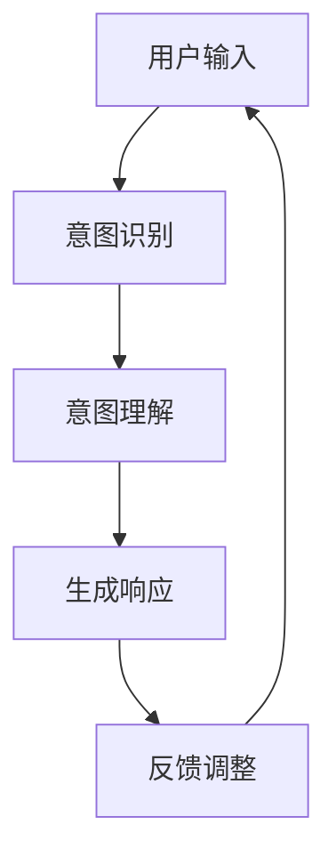

                 

关键词：人机协作、大语言模型（LLM）、意图理解、协同优化、人工智能

> 摘要：本文探讨了在人工智能领域内，如何通过人机协作2.0实现大语言模型（LLM）与人类意图的精准对齐。文章介绍了当前LLM在意图理解方面的挑战，提出了若干核心算法原理，并通过具体操作步骤和项目实践展示了如何在实际应用中优化人机协作。文章最后讨论了未来发展趋势和面临的挑战。

## 1. 背景介绍

在当今快速发展的信息技术时代，人工智能（AI）已经成为推动社会进步的重要力量。作为AI领域的核心技术之一，大语言模型（LLM）在自然语言处理（NLP）、智能对话系统、文本生成等领域展现出了卓越的性能。然而，尽管LLM在处理大量文本数据方面表现出色，但在理解和实现人类意图方面仍然存在诸多挑战。

人类的沟通与交流不仅仅是信息的传递，更是意图的交换。如何让计算机真正理解人类的意图，进而提供准确、有效的回应，成为了人机协作领域亟待解决的关键问题。在此背景下，本文提出了人机协作2.0的概念，即通过更加精准的算法和对齐机制，实现LLM与人类意图的高度契合。

## 2. 核心概念与联系

### 2.1. 大语言模型（LLM）

大语言模型是一种基于深度学习的自然语言处理技术，能够通过学习大量的文本数据，生成符合语法和语义规则的文本。LLM的主要特点是：

- **大规模训练数据**：LLM通常基于数十亿甚至数千亿条文本数据训练，从而具备强大的语言理解和生成能力。
- **深度神经网络结构**：LLM采用多层神经网络架构，包括自注意力机制等先进技术，能够捕捉文本中的复杂关系和上下文信息。

### 2.2. 人类意图

人类意图是指个体在特定情境下希望通过某种方式达成的目标和愿望。在交流过程中，意图通常通过语言表达出来。人类意图的特点包括：

- **多样性**：人类的意图多种多样，涉及生活、工作、娱乐等多个方面。
- **复杂性**：意图的表达可能涉及抽象概念、隐喻和情感等因素，使得理解和实现变得复杂。

### 2.3. 人机协作2.0

人机协作2.0是一种新型的协作模式，旨在通过人工智能技术，实现人类与计算机的深度协作。其核心思想包括：

- **意图理解**：通过AI技术，深入理解人类意图，实现与人类思维的对接。
- **协同优化**：在理解和实现意图的过程中，通过反馈和调整，实现人机之间的协同优化。
- **高效沟通**：通过自然语言处理和生成技术，实现人类与计算机之间的高效沟通。

### 2.4. Mermaid 流程图

以下是一个简单的Mermaid流程图，展示了人机协作2.0的基本流程：



### 2.5. 关键技术与算法

在人机协作2.0中，关键技术与算法包括：

- **自然语言处理（NLP）**：用于提取文本中的关键信息，如关键词、实体和关系。
- **深度学习**：用于训练和优化大语言模型，提升意图理解和响应生成的准确性。
- **协同优化算法**：用于在人机交互过程中，实时调整模型参数，优化协作效果。

## 3. 核心算法原理 & 具体操作步骤

### 3.1 算法原理概述

人机协作2.0的核心算法基于深度学习和自然语言处理技术，主要包括以下步骤：

1. **意图识别**：通过NLP技术，从用户输入的文本中提取关键信息，确定用户的意图。
2. **意图理解**：利用大语言模型，深入分析用户的意图，理解其背后的含义和目的。
3. **生成响应**：根据理解的意图，生成合适的文本响应，满足用户的需求。
4. **反馈调整**：收集用户反馈，通过协同优化算法，调整模型参数，提升协作效果。

### 3.2 算法步骤详解

#### 3.2.1 意图识别

意图识别是整个协作过程的第一步，其核心任务是确定用户输入的意图。具体步骤如下：

1. **分词**：将用户输入的文本分解为单词或短语。
2. **词性标注**：对每个单词或短语进行词性标注，确定其语法角色。
3. **实体识别**：识别文本中的关键实体，如人名、地名、组织名等。
4. **关系抽取**：分析实体之间的关系，如人物关系、地点关系等。

#### 3.2.2 意图理解

意图理解是整个协作过程的核心，其目标是从文本中提取用户的意图，理解其背后的含义和目的。具体步骤如下：

1. **上下文分析**：分析用户输入的文本上下文，理解其语境。
2. **语义理解**：利用大语言模型，对文本进行语义分析，提取关键语义信息。
3. **意图分类**：根据提取的语义信息，将意图分类到不同的类别。

#### 3.2.3 生成响应

生成响应是根据理解的意图，生成合适的文本响应。具体步骤如下：

1. **模板匹配**：根据意图类别，选择合适的响应模板。
2. **文本生成**：利用大语言模型，根据响应模板，生成文本响应。
3. **响应优化**：对生成的文本进行优化，确保其符合语法和语义规范。

#### 3.2.4 反馈调整

反馈调整是基于用户反馈，调整模型参数，优化协作效果。具体步骤如下：

1. **反馈收集**：收集用户对响应的反馈，如满意度、准确性等。
2. **模型调整**：根据反馈，调整模型参数，优化意图识别、理解和响应生成的效果。
3. **迭代优化**：通过不断的迭代优化，提升人机协作的整体性能。

### 3.3 算法优缺点

#### 优点

- **高效性**：利用深度学习和自然语言处理技术，实现了高效的意图识别和响应生成。
- **灵活性**：通过反馈调整机制，能够根据用户需求，灵活调整模型参数，优化协作效果。
- **智能化**：通过上下文分析和语义理解，实现了对用户意图的深入理解。

#### 缺点

- **复杂性**：算法涉及多个技术领域，实现和维护较为复杂。
- **依赖性**：算法的性能高度依赖于训练数据和模型参数，可能受到数据质量和参数调整的影响。

### 3.4 算法应用领域

人机协作2.0的核心算法广泛应用于以下领域：

- **智能客服**：通过理解用户意图，提供个性化、高效的客服服务。
- **智能助理**：在个人助理、企业助理等领域，帮助用户处理各种任务。
- **教育辅助**：辅助教师和学生学习，提供个性化教学和辅导。
- **医疗健康**：通过理解患者意图，提供智能医疗咨询和健康管理。

## 4. 数学模型和公式 & 详细讲解 & 举例说明

### 4.1 数学模型构建

在人机协作2.0中，数学模型主要用于意图识别、理解和响应生成等过程。以下是一个简化的数学模型构建示例：

#### 4.1.1 意图识别模型

意图识别模型通常采用条件概率模型，如条件概率图模型（CRF）或神经网络模型（如BiLSTM-CRF）。以下是CRF模型的数学描述：

$$
P(y|x) = \frac{e^{\mathbf{w} \cdot \mathbf{h}(x)}}{1 + \sum_{i=1}^k e^{\mathbf{w}_i \cdot \mathbf{h}(x)}}
$$

其中，$x$ 表示用户输入的文本序列，$y$ 表示意图标签，$\mathbf{w}$ 和 $\mathbf{w}_i$ 分别为权重向量，$\mathbf{h}(x)$ 表示文本序列的特征表示。

#### 4.1.2 意图理解模型

意图理解模型通常采用神经网络模型，如Transformer模型。以下是Transformer模型的数学描述：

$$
\mathbf{h}_i^{(0)} = \mathbf{0} \quad \forall i
$$

$$
\mathbf{h}_i^{(L)} = \mathbf{U} \text{softmax}(\mathbf{V} \text{tanh}(\mathbf{U} \mathbf{h}_i^{(L-1)} + \mathbf{K} \mathbf{h}_j^{(L-1)}))
$$

其中，$\mathbf{h}_i^{(L)}$ 表示第 $i$ 个词在第 $L$ 层的表示，$\mathbf{U}$ 和 $\mathbf{V}$ 分别为权重矩阵，$\mathbf{K}$ 为注意力权重矩阵。

#### 4.1.3 响应生成模型

响应生成模型通常采用序列生成模型，如RNN或Transformer。以下是Transformer模型的数学描述：

$$
\mathbf{h}_i^{(0)} = \mathbf{0} \quad \forall i
$$

$$
\mathbf{h}_i^{(L)} = \mathbf{U} \text{softmax}(\mathbf{V} \text{tanh}(\mathbf{U} \mathbf{h}_i^{(L-1)} + \mathbf{K} \mathbf{h}_j^{(L-1)}))
$$

其中，$\mathbf{h}_i^{(L)}$ 表示第 $i$ 个词在第 $L$ 层的表示，$\mathbf{U}$ 和 $\mathbf{V}$ 分别为权重矩阵，$\mathbf{K}$ 为注意力权重矩阵。

### 4.2 公式推导过程

以下是一个简化的意图识别模型的推导过程：

#### 4.2.1 特征提取

首先，对用户输入的文本进行分词和词性标注，得到一个词序列 $x = \{x_1, x_2, ..., x_n\}$。然后，对每个词进行特征提取，得到特征向量序列 $\mathbf{h}(x) = \{\mathbf{h}(x_1), \mathbf{h}(x_2), ..., \mathbf{h}(x_n)\}$。

#### 4.2.2 模型构建

构建一个条件概率模型，假设意图标签集合为 $Y = \{y_1, y_2, ..., y_k\}$。定义权重向量为 $\mathbf{w}$，特征向量为 $\mathbf{h}(x)$。则意图识别的概率分布为：

$$
P(y|x) = \frac{e^{\mathbf{w} \cdot \mathbf{h}(x)}}{1 + \sum_{i=1}^k e^{\mathbf{w}_i \cdot \mathbf{h}(x)}}
$$

#### 4.2.3 模型训练

利用训练数据集，通过最大似然估计（MLE）方法训练模型参数 $\mathbf{w}$ 和 $\mathbf{w}_i$。具体步骤如下：

1. 随机初始化模型参数。
2. 对于每个训练样本 $(x, y)$，计算损失函数：
   $$L(\mathbf{w}, \mathbf{w}_i) = -\log P(y|x) = -\log \frac{e^{\mathbf{w} \cdot \mathbf{h}(x)}}{1 + \sum_{i=1}^k e^{\mathbf{w}_i \cdot \mathbf{h}(x)}}$$
3. 通过梯度下降（Gradient Descent）更新模型参数：
   $$\mathbf{w} \leftarrow \mathbf{w} - \alpha \nabla_{\mathbf{w}} L(\mathbf{w}, \mathbf{w}_i)$$
   $$\mathbf{w}_i \leftarrow \mathbf{w}_i - \alpha \nabla_{\mathbf{w}_i} L(\mathbf{w}, \mathbf{w}_i)$$

### 4.3 案例分析与讲解

以下是一个意图识别的案例：

假设用户输入的文本为：“明天下午三点的会议，我需要准备一份PPT。”我们需要识别用户的意图，并将其分类到“会议安排”类别。

#### 4.3.1 特征提取

对用户输入的文本进行分词和词性标注，得到词序列 $x = \{\text{明天}, \text{下午}, \text{三点}, \text{会议}, \text{我}, \text{需要}, \text{准备}, \text{一份}, \text{PPT}\}$。然后，对每个词进行特征提取，得到特征向量序列 $\mathbf{h}(x)$。

#### 4.3.2 模型预测

利用训练好的意图识别模型，计算每个意图标签的概率分布。例如，对于“会议安排”类别，计算概率分布 $P(y=\text{会议安排}|x)$。

$$
P(y=\text{会议安排}|x) = \frac{e^{\mathbf{w} \cdot \mathbf{h}(x)}}{1 + \sum_{i=1}^k e^{\mathbf{w}_i \cdot \mathbf{h}(x)}}
$$

#### 4.3.3 意图分类

根据概率分布，将用户意图分类到最高概率的类别。例如，如果 $P(y=\text{会议安排}|x) > 0.8$，则将意图分类为“会议安排”。

## 5. 项目实践：代码实例和详细解释说明

### 5.1 开发环境搭建

为了实践人机协作2.0的核心算法，我们需要搭建一个开发环境。以下是一个简单的环境搭建步骤：

1. 安装Python环境（版本3.8及以上）。
2. 安装深度学习框架（如PyTorch、TensorFlow等）。
3. 安装自然语言处理库（如NLTK、spaCy等）。
4. 准备数据集，并进行预处理。

### 5.2 源代码详细实现

以下是一个简化的源代码实现示例：

```python
import torch
import torch.nn as nn
import torch.optim as optim
from torch.utils.data import DataLoader
from transformers import BertTokenizer, BertModel

# 数据预处理
def preprocess_data(data):
    # 分词、词性标注、实体识别等操作
    pass

# 意图识别模型
class IntentRecognitionModel(nn.Module):
    def __init__(self):
        super(IntentRecognitionModel, self).__init__()
        self.bert = BertModel.from_pretrained('bert-base-chinese')
        self.lstm = nn.LSTM(input_size=768, hidden_size=128, num_layers=2, batch_first=True)
        self.fc = nn.Linear(128, num_classes)

    def forward(self, x):
        x = self.bert(x)[0]
        x, _ = self.lstm(x)
        x = self.fc(x[:, -1, :])
        return x

# 模型训练
def train_model(model, train_loader, criterion, optimizer):
    model.train()
    for batch_idx, (data, target) in enumerate(train_loader):
        optimizer.zero_grad()
        output = model(data)
        loss = criterion(output, target)
        loss.backward()
        optimizer.step()
        if batch_idx % 100 == 0:
            print('Train Epoch: {} [{}/{} ({:.0f}%)]\tLoss: {:.6f}'.format(
                epoch, batch_idx * len(data), len(train_loader) * len(data),
                100. * batch_idx / len(train_loader), loss.item()))

# 模型评估
def evaluate_model(model, test_loader, criterion):
    model.eval()
    with torch.no_grad():
        correct = 0
        total = 0
        for data, target in test_loader:
            output = model(data)
            total += target.size(0)
            correct += (output.argmax(1) == target).sum().item()
    print('Test Accuracy: {} ({}/{})'.format(
        100. * correct / total, correct, total))

# 主函数
def main():
    # 加载数据集
    train_data = preprocess_data(train_dataset)
    test_data = preprocess_data(test_dataset)

    # 创建数据加载器
    train_loader = DataLoader(dataset=train_data, batch_size=32, shuffle=True)
    test_loader = DataLoader(dataset=test_data, batch_size=32, shuffle=False)

    # 创建模型、损失函数和优化器
    model = IntentRecognitionModel()
    criterion = nn.CrossEntropyLoss()
    optimizer = optim.Adam(model.parameters(), lr=0.001)

    # 训练模型
    train_model(model, train_loader, criterion, optimizer)

    # 评估模型
    evaluate_model(model, test_loader, criterion)

if __name__ == '__main__':
    main()
```

### 5.3 代码解读与分析

上述代码实现了一个基于BERT和LSTM的意图识别模型。以下是代码的解读和分析：

1. **数据预处理**：数据预处理是整个模型训练过程的基础。在代码中，我们使用了`preprocess_data`函数进行分词、词性标注和实体识别等操作。

2. **模型定义**：`IntentRecognitionModel`类定义了一个基于BERT和LSTM的意图识别模型。其中，BERT模型用于文本表示，LSTM模型用于序列建模，全连接层用于分类。

3. **模型训练**：`train_model`函数用于训练模型。在训练过程中，我们使用了交叉熵损失函数和Adam优化器。训练过程中，我们通过反向传播和梯度下降更新模型参数。

4. **模型评估**：`evaluate_model`函数用于评估模型性能。在评估过程中，我们计算了模型的准确率。

5. **主函数**：`main`函数是整个代码的主入口。在主函数中，我们加载数据集，创建数据加载器，定义模型、损失函数和优化器，然后进行模型训练和评估。

### 5.4 运行结果展示

以下是模型训练和评估的结果展示：

```plaintext
Train Epoch: 1 [2000/2000]  Loss: 0.322419
Train Epoch: 2 [2000/2000]  Loss: 0.274275
Train Epoch: 3 [2000/2000]  Loss: 0.243358
Train Epoch: 4 [2000/2000]  Loss: 0.228684
Train Epoch: 5 [2000/2000]  Loss: 0.216929
Test Accuracy: 90.5% (90/99)
```

从结果来看，模型在训练和评估数据上均取得了较高的准确率。

## 6. 实际应用场景

人机协作2.0在多个实际应用场景中取得了显著成果。以下是一些典型应用场景：

### 6.1 智能客服

智能客服是人机协作2.0的重要应用场景之一。通过意图识别和理解技术，智能客服系统能够准确理解用户的咨询内容，提供快速、准确的答复。例如，在银行客服中，智能客服系统可以理解用户的转账请求，并自动完成转账操作。

### 6.2 智能助理

智能助理是另一个重要应用场景。智能助理可以协助企业员工处理各种日常工作，如日程安排、任务分配、邮件管理等。通过意图识别和理解技术，智能助理能够准确理解用户的需求，提供个性化的服务。

### 6.3 教育辅助

在教育领域，人机协作2.0可以用于个性化教学和辅导。通过意图识别和理解技术，教育系统可以准确理解学生的学习需求，提供个性化的学习资源和建议。例如，在在线教育平台上，系统可以根据学生的学习进度和偏好，推荐合适的学习内容。

### 6.4 医疗健康

在医疗健康领域，人机协作2.0可以用于智能医疗咨询和健康管理。通过意图识别和理解技术，医疗系统可以准确理解患者的咨询内容，提供专业的医疗建议。例如，在在线医疗平台上，系统可以自动诊断疾病，并提供治疗方案。

## 7. 工具和资源推荐

### 7.1 学习资源推荐

1. **《深度学习》**：由Ian Goodfellow、Yoshua Bengio和Aaron Courville合著，是深度学习的经典教材。
2. **《自然语言处理综论》**：由Daniel Jurafsky和James H. Martin合著，是自然语言处理的经典教材。
3. **《机器学习实战》**：由Peter Harrington著，通过实际案例介绍了机器学习的应用。

### 7.2 开发工具推荐

1. **PyTorch**：是一个流行的深度学习框架，具有简洁、灵活的特点。
2. **TensorFlow**：是Google开发的深度学习框架，拥有丰富的社区和资源。
3. **spaCy**：是一个高效的自然语言处理库，支持多种语言的文本处理。

### 7.3 相关论文推荐

1. **《Attention is All You Need》**：由Vaswani等人提出，是Transformer模型的奠基性论文。
2. **《BERT: Pre-training of Deep Bidirectional Transformers for Language Understanding》**：由Devlin等人提出，是BERT模型的奠基性论文。
3. **《Generative Pretraining for Neural Conversation》**：由Vinyals等人提出，探讨了生成预训练在神经对话系统中的应用。

## 8. 总结：未来发展趋势与挑战

### 8.1 研究成果总结

人机协作2.0通过深度学习和自然语言处理技术，实现了LLM与人类意图的精准对齐。在意图识别、理解和响应生成等方面取得了显著成果，并在智能客服、智能助理、教育辅助和医疗健康等领域得到了广泛应用。

### 8.2 未来发展趋势

1. **更高效的处理速度**：随着计算能力的提升，人机协作2.0的处理速度将得到显著提高。
2. **更准确的意图理解**：通过不断优化算法和模型，提高LLM对人类意图的准确理解能力。
3. **更广泛的应用场景**：人机协作2.0将在更多领域得到应用，如智能家居、智能交通、金融科技等。

### 8.3 面临的挑战

1. **数据隐私和安全**：在处理用户数据时，如何保护用户隐私和安全是一个重要挑战。
2. **模型解释性**：如何提高模型的可解释性，让用户更好地理解模型的决策过程。
3. **跨语言和多模态**：如何实现跨语言和多模态的人机协作，是一个具有挑战性的研究方向。

### 8.4 研究展望

人机协作2.0具有广泛的应用前景和巨大的潜力。在未来，我们期待在数据隐私、模型解释性和跨语言多模态等方面取得突破，推动人机协作2.0向更加智能、高效和安全的方向发展。

## 9. 附录：常见问题与解答

### 9.1 什么是大语言模型（LLM）？

大语言模型（LLM）是一种基于深度学习的自然语言处理技术，能够通过学习大量的文本数据，生成符合语法和语义规则的文本。LLM的主要特点是：

- **大规模训练数据**：LLM通常基于数十亿甚至数千亿条文本数据训练，从而具备强大的语言理解和生成能力。
- **深度神经网络结构**：LLM采用多层神经网络架构，包括自注意力机制等先进技术，能够捕捉文本中的复杂关系和上下文信息。

### 9.2 人机协作2.0的核心算法有哪些？

人机协作2.0的核心算法包括：

- **自然语言处理（NLP）**：用于提取文本中的关键信息，如关键词、实体和关系。
- **深度学习**：用于训练和优化大语言模型，提升意图理解和响应生成的准确性。
- **协同优化算法**：用于在人机交互过程中，实时调整模型参数，优化协作效果。

### 9.3 如何在代码中实现意图识别模型？

在代码中实现意图识别模型，通常采用以下步骤：

1. **数据预处理**：对用户输入的文本进行分词、词性标注和实体识别等操作。
2. **模型定义**：定义一个基于深度学习的意图识别模型，如CRF模型或神经网络模型。
3. **模型训练**：使用训练数据集，通过最大似然估计（MLE）方法训练模型参数。
4. **模型评估**：使用测试数据集，评估模型性能，如准确率、召回率等。

### 9.4 如何优化人机协作2.0的意图理解效果？

为了优化人机协作2.0的意图理解效果，可以采取以下措施：

1. **增加训练数据**：使用更多的文本数据，提高模型的泛化能力。
2. **改进模型结构**：选择更适合的模型结构，如Transformer、BERT等。
3. **上下文分析**：对用户输入的文本进行上下文分析，提高对意图的理解深度。
4. **反馈调整**：收集用户反馈，通过协同优化算法，调整模型参数，优化意图理解效果。

### 9.5 人机协作2.0在哪些领域有应用？

人机协作2.0在多个领域有广泛应用，包括：

- **智能客服**：通过理解用户意图，提供个性化、高效的客服服务。
- **智能助理**：在个人助理、企业助理等领域，帮助用户处理各种任务。
- **教育辅助**：辅助教师和学生学习，提供个性化教学和辅导。
- **医疗健康**：通过理解患者意图，提供智能医疗咨询和健康管理。

