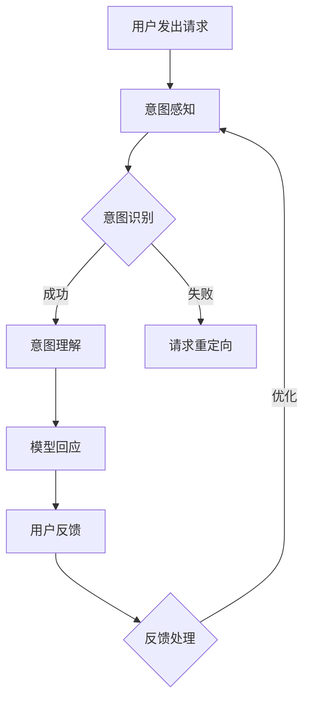

                 

关键词：大型语言模型，人类意图，人机协作，对齐机制，技术应用

> 摘要：本文旨在探讨大型语言模型（LLM）与人类意图之间的对齐问题，分析现有技术手段的优缺点，并展望未来人机协作的潜在发展方向。通过对LLM的核心概念、算法原理、数学模型及实际应用场景的深入解析，本文将为人机协作的新篇章提供理论支持和实践指导。

## 1. 背景介绍

随着人工智能技术的飞速发展，语言模型在自然语言处理（NLP）领域取得了显著成果。近年来，大型语言模型（LLM）如GPT、BERT等，通过深度学习训练，实现了在文本生成、语义理解、问答系统等方面的卓越性能。这些模型的诞生为人工智能领域带来了新的契机，也为人类与机器的协作提供了更广阔的空间。

然而，在LLM的应用过程中，一个关键问题逐渐显现：如何确保模型输出的结果与人类的意图一致？人类的意图是多样化且复杂的，而LLM作为一种自动化系统，其理解和回应人类意图的能力尚存在一定的局限性。因此，如何在人机协作中实现LLM与人类意图的对齐，成为当前人工智能研究的一个重要课题。

本文将围绕这一问题，首先介绍LLM的基本概念和核心算法，然后深入探讨人机意图对齐的机制和技术手段，最后通过实际应用场景和未来展望，为人机协作的新篇章提供思考和建议。

## 2. 核心概念与联系

### 2.1 大型语言模型（LLM）的基本概念

大型语言模型（LLM）是一种基于深度学习的自然语言处理模型，它通过学习大量的文本数据，能够生成连贯、语义丰富的文本。LLM的核心在于其能够捕捉到文本之间的复杂关系，从而实现高效的文本生成和理解。

### 2.2 人类意图的理解与表达

人类意图是指人类在特定情境下希望通过语言或其他方式实现的目标。理解人类意图是自然语言处理的关键，而准确表达人类意图则依赖于人类的语言能力和沟通技巧。

### 2.3 LLM与人类意图的互动关系

LLM与人类意图的互动关系体现在两个方面：一是LLM需要理解并准确回应人类意图，二是人类需要通过有效的语言表达来传达自己的意图。在这个过程中，对齐机制起到了至关重要的作用。

### 2.4 对齐机制的框架

为了实现LLM与人类意图的对齐，需要构建一个包括感知、理解、回应和反馈的互动框架。该框架的核心在于通过多层次的模型优化和用户交互，提高LLM对人类意图的捕捉和回应能力。

## 2.5 Mermaid流程图

以下是一个简单的Mermaid流程图，展示了LLM与人类意图对齐的基本流程：



### 2.6 关键概念和架构的联系

LLM与人类意图对齐的过程涉及到多个关键概念和架构，包括：

- **意图感知**：通过自然语言处理技术，捕捉用户请求中的关键信息，如关键词、句子结构等。
- **意图识别**：利用机器学习模型，将感知到的意图与预定义的意图库进行匹配，识别出具体的用户意图。
- **意图理解**：进一步分析用户意图，理解其深层含义和背景信息，确保模型的回应能够准确满足用户需求。
- **模型回应**：根据理解和分析的结果，生成合适的回应文本，确保回应的自然性和准确性。
- **用户反馈**：用户对模型回应的反馈，包括满意度、是否达到预期目标等。
- **反馈处理**：根据用户反馈，调整模型参数，优化模型对人类意图的捕捉和回应能力。

### 2.7 流程图详细解释

- **意图感知**：用户请求通过自然语言处理技术传递给模型，模型从中提取关键信息，如关键词、句子结构等。
- **意图识别**：提取的关键信息与预定义的意图库进行匹配，模型尝试识别出用户的具体意图。
- **意图理解**：在识别意图的基础上，模型进一步分析意图的深层含义和背景信息，确保理解准确。
- **模型回应**：根据理解和分析的结果，模型生成合适的回应文本，确保回应的自然性和准确性。
- **用户反馈**：用户对模型回应的反馈，包括满意度、是否达到预期目标等。
- **反馈处理**：根据用户反馈，模型调整参数，优化对人类意图的捕捉和回应能力。

通过上述流程，LLM与人类意图实现了有效对齐，提高了人机协作的效率和效果。

### 2.8 LLM与人类意图对齐机制的进一步探讨

LLM与人类意图对齐机制不仅仅是一个技术问题，还涉及到人类行为学、心理学等多个领域。以下是对这一机制进一步探讨的关键点：

- **交互模型**：构建有效的交互模型，包括用户界面设计、对话流程管理、上下文理解等，确保用户与模型之间的沟通流畅和高效。
- **意图表征**：研究如何将复杂的、多层次的意图转化为计算机可以理解和处理的表征形式，以便模型能够准确捕捉和回应。
- **多模态融合**：结合文本、语音、图像等多种数据源，提高模型对人类意图的捕捉和理解能力。
- **用户行为分析**：通过分析用户的行为数据，如点击率、反馈历史等，动态调整模型的行为和回应策略，提高对齐的准确性和个性化程度。

## 3. 核心算法原理 & 具体操作步骤

### 3.1 算法原理概述

LLM的核心算法原理主要包括基于注意力机制的深度神经网络模型、大规模文本数据训练和预训练模型微调等。这些算法共同作用，使得LLM能够实现高效的自然语言处理。

### 3.2 算法步骤详解

1. **数据收集**：收集大规模的文本数据，包括网页、书籍、新闻、对话等，用于模型的训练和测试。
2. **预处理**：对收集到的文本数据进行清洗、分词、词性标注等预处理操作，将其转换为模型可处理的格式。
3. **模型训练**：使用深度学习框架（如TensorFlow、PyTorch等），训练基于注意力机制的深度神经网络模型，如Transformer、BERT等。
4. **预训练模型微调**：在预训练模型的基础上，针对特定任务进行微调，提高模型在特定领域的性能。
5. **模型部署**：将训练好的模型部署到实际应用场景中，如文本生成、问答系统、语音识别等。

### 3.3 算法优缺点

**优点**：
- **高性能**：基于注意力机制的深度神经网络模型能够捕捉文本之间的复杂关系，实现高效的文本生成和理解。
- **泛化能力强**：通过大规模文本数据训练，模型具备较强的泛化能力，能够应对各种不同的自然语言处理任务。
- **灵活性高**：预训练模型微调技术使得模型可以根据不同的任务和场景进行快速调整和优化。

**缺点**：
- **计算资源消耗大**：训练大规模的深度神经网络模型需要大量的计算资源和时间。
- **数据依赖性高**：模型性能很大程度上依赖于训练数据的质量和数量，数据质量问题可能影响模型的性能。
- **解释性差**：深度神经网络模型的内部机制复杂，难以解释其决策过程，增加了模型的可解释性挑战。

### 3.4 算法应用领域

LLM在多个领域展现出了强大的应用潜力：

- **文本生成**：生成文章、新闻、故事等，应用于内容创作、自动化写作等领域。
- **问答系统**：构建智能客服、智能助手等，应用于客户服务、教育辅导等领域。
- **自然语言理解**：实现语音识别、机器翻译、情感分析等，应用于智能语音助手、跨语言沟通等领域。
- **对话系统**：构建人机对话系统，应用于智能家居、虚拟助手等领域。

## 4. 数学模型和公式 & 详细讲解 & 举例说明

### 4.1 数学模型构建

LLM的数学模型主要基于深度学习，特别是基于注意力机制的变换器模型（Transformer）。以下是Transformer模型的主要组成部分：

- **自注意力（Self-Attention）**：计算输入序列中每个词与其他词的关联强度，通过加权求和生成新的词表征。
- **多头注意力（Multi-Head Attention）**：将自注意力扩展到多个头，提高模型的表示能力。
- **前馈神经网络（Feedforward Neural Network）**：对注意力机制后的输出进行进一步处理，增强模型的非线性能力。

### 4.2 公式推导过程

以下是对Transformer模型中的自注意力机制（Self-Attention）的公式推导过程：

1. **词向量表示**：首先，将输入序列中的每个词表示为一个向量，记为$${\mathbf{X} = [ \mathbf{x}_1, \mathbf{x}_2, ..., \mathbf{x}_n ]}$$。
2. **计算查询（Query）、键（Key）和值（Value）**：对于每个词$$\mathbf{x}_i$$，计算其查询（Query）、键（Key）和值（Value）向量，记为$${\mathbf{Q}_i, \mathbf{K}_i, \mathbf{V}_i}$$。通常，这三个向量是通过权重矩阵$$\mathbf{W}_Q, \mathbf{W}_K, \mathbf{W}_V$$作用于输入向量$$\mathbf{x}_i$$得到的，即：
   $$\mathbf{Q}_i = \mathbf{W}_Q \mathbf{x}_i$$
   $$\mathbf{K}_i = \mathbf{W}_K \mathbf{x}_i$$
   $$\mathbf{V}_i = \mathbf{W}_V \mathbf{x}_i$$
3. **计算注意力权重**：计算每个词与其他词的关联强度，通过点积操作得到，即：
   $$\mathbf{a}_{ij} = \mathbf{Q}_i \cdot \mathbf{K}_j = \mathbf{W}_Q^T \mathbf{W}_K \mathbf{x}_i \cdot \mathbf{x}_j$$
4. **应用 softmax 函数**：对注意力权重进行归一化，得到概率分布，即：
   $$\mathbf{p}_{ij} = \frac{e^{\mathbf{a}_{ij}}}{\sum_{k=1}^n e^{\mathbf{a}_{ik}}}$$
5. **计算加权求和**：根据概率分布对值向量进行加权求和，得到新的词表征，即：
   $$\mathbf{h}_i = \sum_{j=1}^n \mathbf{p}_{ij} \mathbf{V}_j$$

### 4.3 案例分析与讲解

以下是一个简单的案例，用于说明自注意力机制在文本生成中的应用：

**输入序列**：$${\mathbf{X} = [ \mathbf{x}_1, \mathbf{x}_2, \mathbf{x}_3 ] = [ \mathbf{w}_1, \mathbf{w}_2, \mathbf{w}_3 ]}$$，其中$${\mathbf{w}_1 = [1, 0, 0]}, \mathbf{w}_2 = [0, 1, 0]}, \mathbf{w}_3 = [0, 0, 1]}$$。

**计算查询、键和值**：
$${\mathbf{Q}_1 = \mathbf{W}_Q \mathbf{w}_1 = [1, 0, 0]}, \mathbf{K}_1 = \mathbf{W}_K \mathbf{w}_1 = [1, 0, 0]}, \mathbf{V}_1 = \mathbf{W}_V \mathbf{w}_1 = [1, 0, 0]}$$
$${\mathbf{Q}_2 = \mathbf{W}_Q \mathbf{w}_2 = [0, 1, 0]}, \mathbf{K}_2 = \mathbf{W}_K \mathbf{w}_2 = [0, 1, 0]}, \mathbf{V}_2 = \mathbf{W}_V \mathbf{w}_2 = [0, 1, 0]}$$
$${\mathbf{Q}_3 = \mathbf{W}_Q \mathbf{w}_3 = [0, 0, 1]}, \mathbf{K}_3 = \mathbf{W}_K \mathbf{w}_3 = [0, 0, 1]}, \mathbf{V}_3 = \mathbf{W}_V \mathbf{w}_3 = [0, 0, 1]}$$

**计算注意力权重**：
$${\mathbf{a}_{11} = \mathbf{Q}_1 \cdot \mathbf{K}_1 = 1 \cdot 1 = 1}, \mathbf{a}_{12} = \mathbf{Q}_1 \cdot \mathbf{K}_2 = 1 \cdot 0 = 0}, \mathbf{a}_{13} = \mathbf{Q}_1 \cdot \mathbf{K}_3 = 1 \cdot 0 = 0}$$
$${\mathbf{a}_{21} = \mathbf{Q}_2 \cdot \mathbf{K}_1 = 0 \cdot 1 = 0}, \mathbf{a}_{22} = \mathbf{Q}_2 \cdot \mathbf{K}_2 = 0 \cdot 1 = 0}, \mathbf{a}_{23} = \mathbf{Q}_2 \cdot \mathbf{K}_3 = 0 \cdot 0 = 0}$$
$${\mathbf{a}_{31} = \mathbf{Q}_3 \cdot \mathbf{K}_1 = 0 \cdot 1 = 0}, \mathbf{a}_{32} = \mathbf{Q}_3 \cdot \mathbf{K}_2 = 0 \cdot 0 = 0}, \mathbf{a}_{33} = \mathbf{Q}_3 \cdot \mathbf{K}_3 = 0 \cdot 0 = 0}$$

**应用 softmax 函数**：
$${\mathbf{p}_{11} = \frac{e^{\mathbf{a}_{11}}}{e^{\mathbf{a}_{11}} + e^{\mathbf{a}_{12}} + e^{\mathbf{a}_{13}}} = \frac{e^1}{e^1 + e^0 + e^0} = \frac{1}{2}}, \mathbf{p}_{12} = \frac{e^{\mathbf{a}_{12}}}{e^{\mathbf{a}_{11}} + e^{\mathbf{a}_{12}} + e^{\mathbf{a}_{13}}} = \frac{e^0}{e^1 + e^0 + e^0} = \frac{1}{3}}, \mathbf{p}_{13} = \frac{e^{\mathbf{a}_{13}}}{e^{\mathbf{a}_{11}} + e^{\mathbf{a}_{12}} + e^{\mathbf{a}_{13}}} = \frac{e^0}{e^1 + e^0 + e^0} = \frac{1}{3}}$$
$${\mathbf{p}_{21} = \frac{e^{\mathbf{a}_{21}}}{e^{\mathbf{a}_{21}} + e^{\mathbf{a}_{22}} + e^{\mathbf{a}_{23}}} = \frac{e^0}{e^0 + e^0 + e^0} = \frac{1}{3}}, \mathbf{p}_{22} = \frac{e^{\mathbf{a}_{22}}}{e^{\mathbf{a}_{21}} + e^{\mathbf{a}_{22}} + e^{\mathbf{a}_{23}}} = \frac{e^0}{e^0 + e^0 + e^0} = \frac{1}{3}}, \mathbf{p}_{23} = \frac{e^{\mathbf{a}_{23}}}{e^{\mathbf{a}_{21}} + e^{\mathbf{a}_{22}} + e^{\mathbf{a}_{23}}} = \frac{e^0}{e^0 + e^0 + e^0} = \frac{1}{3}}$$
$${\mathbf{p}_{31} = \frac{e^{\mathbf{a}_{31}}}{e^{\mathbf{a}_{31}} + e^{\mathbf{a}_{32}} + e^{\mathbf{a}_{33}}} = \frac{e^0}{e^0 + e^0 + e^0} = \frac{1}{3}}, \mathbf{p}_{32} = \frac{e^{\mathbf{a}_{32}}}{e^{\mathbf{a}_{31}} + e^{\mathbf{a}_{32}} + e^{\mathbf{a}_{33}}} = \frac{e^0}{e^0 + e^0 + e^0} = \frac{1}{3}}, \mathbf{p}_{33} = \frac{e^{\mathbf{a}_{33}}}{e^{\mathbf{a}_{31}} + e^{\mathbf{a}_{32}} + e^{\mathbf{a}_{33}}} = \frac{e^0}{e^0 + e^0 + e^0} = \frac{1}{3}}$$

**计算加权求和**：
$${\mathbf{h}_1 = \sum_{j=1}^3 \mathbf{p}_{ij} \mathbf{V}_j = \mathbf{p}_{11} \mathbf{V}_1 + \mathbf{p}_{12} \mathbf{V}_2 + \mathbf{p}_{13} \mathbf{V}_3 = \frac{1}{2} \mathbf{v}_1 + \frac{1}{3} \mathbf{v}_2 + \frac{1}{3} \mathbf{v}_3}$$
$${\mathbf{h}_2 = \sum_{j=1}^3 \mathbf{p}_{ij} \mathbf{V}_j = \mathbf{p}_{21} \mathbf{V}_1 + \mathbf{p}_{22} \mathbf{V}_2 + \mathbf{p}_{23} \mathbf{V}_3 = \frac{1}{3} \mathbf{v}_1 + \frac{1}{3} \mathbf{v}_2 + \frac{1}{3} \mathbf{v}_3}$$
$${\mathbf{h}_3 = \sum_{j=1}^3 \mathbf{p}_{ij} \mathbf{V}_j = \mathbf{p}_{31} \mathbf{V}_1 + \mathbf{p}_{32} \mathbf{V}_2 + \mathbf{p}_{33} \mathbf{V}_3 = \frac{1}{3} \mathbf{v}_1 + \frac{1}{3} \mathbf{v}_2 + \frac{1}{3} \mathbf{v}_3}$$

通过上述步骤，得到了新的词表征$${\mathbf{h}_1, \mathbf{h}_2, \mathbf{h}_3}$$，用于后续的文本生成或理解任务。

### 4.4 详细讲解

在上一部分中，我们详细介绍了Transformer模型中的自注意力机制（Self-Attention）的数学模型和公式推导过程。这一部分将进一步对这些概念进行详细讲解，以便读者更好地理解自注意力机制的工作原理。

#### 4.4.1 词向量表示

词向量表示是将自然语言中的词汇映射为计算机可以处理的向量形式。这是深度学习在自然语言处理中的一个核心步骤。在自注意力机制中，每个词被表示为一个高维向量，这些向量不仅包含了词的语义信息，还包含了上下文信息。词向量通常通过预训练模型（如Word2Vec、GloVe等）得到。

#### 4.4.2 查询（Query）、键（Key）和值（Value）

在自注意力机制中，查询（Query）、键（Key）和值（Value）向量分别代表了输入序列中每个词的三个不同角色。这些向量的计算公式为：
$$\mathbf{Q}_i = \mathbf{W}_Q \mathbf{x}_i$$
$$\mathbf{K}_i = \mathbf{W}_K \mathbf{x}_i$$
$$\mathbf{V}_i = \mathbf{W}_V \mathbf{x}_i$$
其中，$$\mathbf{W}_Q, \mathbf{W}_K, \mathbf{W}_V$$是权重矩阵，$$\mathbf{x}_i$$是输入向量。

- **查询（Query）向量**：用于计算每个词与其他词的相关性。在自注意力机制中，查询向量决定了当前词对其他词的注意力权重。
- **键（Key）向量**：用于存储每个词的键值信息。在自注意力机制中，键向量决定了其他词对当前词的注意力权重。
- **值（Value）向量**：用于存储每个词的值信息。在自注意力机制中，值向量决定了其他词对当前词的影响程度。

#### 4.4.3 注意力权重计算

注意力权重是通过查询向量和键向量之间的点积计算得到的。点积操作公式为：
$$\mathbf{a}_{ij} = \mathbf{Q}_i \cdot \mathbf{K}_j = \mathbf{W}_Q^T \mathbf{W}_K \mathbf{x}_i \cdot \mathbf{x}_j$$
其中，$$\mathbf{a}_{ij}$$表示第$$i$$个词对第$$j$$个词的注意力权重。

#### 4.4.4 Softmax函数

为了将注意力权重转换为概率分布，应用了Softmax函数。Softmax函数将每个注意力权重转换为概率，确保所有概率之和为1。Softmax函数的公式为：
$$\mathbf{p}_{ij} = \frac{e^{\mathbf{a}_{ij}}}{\sum_{k=1}^n e^{\mathbf{a}_{ik}}}$$
其中，$$\mathbf{p}_{ij}$$表示第$$i$$个词对第$$j$$个词的注意力概率。

#### 4.4.5 加权求和

最后，根据概率分布对值向量进行加权求和，得到新的词表征。加权求和的公式为：
$$\mathbf{h}_i = \sum_{j=1}^n \mathbf{p}_{ij} \mathbf{V}_j$$
其中，$$\mathbf{h}_i$$表示经过自注意力机制处理后第$$i$$个词的新表征，$$\mathbf{V}_j$$表示第$$j$$个词的值向量。

通过自注意力机制，输入序列中的每个词都能够获得对其他词的注意力权重，从而生成更丰富的词表征。这一过程不仅提高了模型对上下文信息的捕捉能力，也为文本生成和理解任务提供了强有力的支持。

### 4.5 案例分析与讲解

在本部分中，我们将通过一个具体的案例，进一步说明自注意力机制在实际应用中的具体操作步骤。假设有一个简单的输入序列$${\mathbf{X} = [ \mathbf{w}_1, \mathbf{w}_2, \mathbf{w}_3 ]}$$，其中$${\mathbf{w}_1 = [1, 0, 0]}, \mathbf{w}_2 = [0, 1, 0]}, \mathbf{w}_3 = [0, 0, 1]}$$。我们的目标是计算这些词经过自注意力机制处理后的新表征。

#### 4.5.1 计算查询、键和值向量

首先，我们需要计算输入序列中每个词的查询（Query）、键（Key）和值（Value）向量。假设权重矩阵$${\mathbf{W}_Q, \mathbf{W}_K, \mathbf{W}_V}$$分别为：
$${\mathbf{W}_Q = \begin{bmatrix} 1 & 0 & 0 \\ 0 & 1 & 0 \\ 0 & 0 & 1 \end{bmatrix}}, \mathbf{W}_K = \mathbf{W}_Q, \mathbf{W}_V = \mathbf{W}_Q}$$。

- **计算$${\mathbf{Q}_1, \mathbf{K}_1, \mathbf{V}_1}}$$**：
$$\mathbf{Q}_1 = \mathbf{W}_Q \mathbf{w}_1 = \begin{bmatrix} 1 & 0 & 0 \end{bmatrix} \begin{bmatrix} 1 \\ 0 \\ 0 \end{bmatrix} = \begin{bmatrix} 1 \\ 0 \\ 0 \end{bmatrix}$$
$$\mathbf{K}_1 = \mathbf{W}_K \mathbf{w}_1 = \begin{bmatrix} 1 & 0 & 0 \end{bmatrix} \begin{bmatrix} 1 \\ 0 \\ 0 \end{bmatrix} = \begin{bmatrix} 1 \\ 0 \\ 0 \end{bmatrix}$$
$$\mathbf{V}_1 = \mathbf{W}_V \mathbf{w}_1 = \begin{bmatrix} 1 & 0 & 0 \end{bmatrix} \begin{bmatrix} 1 \\ 0 \\ 0 \end{bmatrix} = \begin{bmatrix} 1 \\ 0 \\ 0 \end{bmatrix}$$

- **计算$${\mathbf{Q}_2, \mathbf{K}_2, \mathbf{V}_2}}$$**：
$$\mathbf{Q}_2 = \mathbf{W}_Q \mathbf{w}_2 = \begin{bmatrix} 1 & 0 & 0 \end{bmatrix} \begin{bmatrix} 0 \\ 1 \\ 0 \end{bmatrix} = \begin{bmatrix} 0 \\ 1 \\ 0 \end{bmatrix}$$
$$\mathbf{K}_2 = \mathbf{W}_K \mathbf{w}_2 = \begin{bmatrix} 1 & 0 & 0 \end{bmatrix} \begin{bmatrix} 0 \\ 1 \\ 0 \end{bmatrix} = \begin{bmatrix} 0 \\ 1 \\ 0 \end{bmatrix}$$
$$\mathbf{V}_2 = \mathbf{W}_V \mathbf{w}_2 = \begin{bmatrix} 1 & 0 & 0 \end{bmatrix} \begin{bmatrix} 0 \\ 1 \\ 0 \end{bmatrix} = \begin{bmatrix} 0 \\ 1 \\ 0 \end{bmatrix}$$

- **计算$${\mathbf{Q}_3, \mathbf{K}_3, \mathbf{V}_3}}$$**：
$$\mathbf{Q}_3 = \mathbf{W}_Q \mathbf{w}_3 = \begin{bmatrix} 1 & 0 & 0 \end{bmatrix} \begin{bmatrix} 0 \\ 0 \\ 1 \end{bmatrix} = \begin{bmatrix} 0 \\ 0 \\ 1 \end{bmatrix}$$
$$\mathbf{K}_3 = \mathbf{W}_K \mathbf{w}_3 = \begin{bmatrix} 1 & 0 & 0 \end{bmatrix} \begin{bmatrix} 0 \\ 0 \\ 1 \end{bmatrix} = \begin{bmatrix} 0 \\ 0 \\ 1 \end{bmatrix}$$
$$\mathbf{V}_3 = \mathbf{W}_V \mathbf{w}_3 = \begin{bmatrix} 1 & 0 & 0 \end{bmatrix} \begin{bmatrix} 0 \\ 0 \\ 1 \end{bmatrix} = \begin{bmatrix} 0 \\ 0 \\ 1 \end{bmatrix}$$

#### 4.5.2 计算注意力权重

接下来，我们计算每个词与其他词的注意力权重。注意力权重是通过查询向量和键向量之间的点积计算得到的。具体计算过程如下：

- **计算$${\mathbf{a}_{11}}$$**：
$$\mathbf{a}_{11} = \mathbf{Q}_1 \cdot \mathbf{K}_1 = \begin{bmatrix} 1 \\ 0 \\ 0 \end{bmatrix} \cdot \begin{bmatrix} 1 \\ 0 \\ 0 \end{bmatrix} = 1$$

- **计算$${\mathbf{a}_{12}}$$**：
$$\mathbf{a}_{12} = \mathbf{Q}_1 \cdot \mathbf{K}_2 = \begin{bmatrix} 1 \\ 0 \\ 0 \end{bmatrix} \cdot \begin{bmatrix} 0 \\ 1 \\ 0 \end{bmatrix} = 0$$

- **计算$${\mathbf{a}_{13}}$$**：
$$\mathbf{a}_{13} = \mathbf{Q}_1 \cdot \mathbf{K}_3 = \begin{bmatrix} 1 \\ 0 \\ 0 \end{bmatrix} \cdot \begin{bmatrix} 0 \\ 0 \\ 1 \end{bmatrix} = 0$$

- **计算$${\mathbf{a}_{21}}$$**：
$$\mathbf{a}_{21} = \mathbf{Q}_2 \cdot \mathbf{K}_1 = \begin{bmatrix} 0 \\ 1 \\ 0 \end{bmatrix} \cdot \begin{bmatrix} 1 \\ 0 \\ 0 \end{bmatrix} = 0$$

- **计算$${\mathbf{a}_{22}}$$**：
$$\mathbf{a}_{22} = \mathbf{Q}_2 \cdot \mathbf{K}_2 = \begin{bmatrix} 0 \\ 1 \\ 0 \end{bmatrix} \cdot \begin{bmatrix} 0 \\ 1 \\ 0 \end{bmatrix} = 1$$

- **计算$${\mathbf{a}_{23}}$$**：
$$\mathbf{a}_{23} = \mathbf{Q}_2 \cdot \mathbf{K}_3 = \begin{bmatrix} 0 \\ 1 \\ 0 \end{bmatrix} \cdot \begin{bmatrix} 0 \\ 0 \\ 1 \end{bmatrix} = 0$$

- **计算$${\mathbf{a}_{31}}$$**：
$$\mathbf{a}_{31} = \mathbf{Q}_3 \cdot \mathbf{K}_1 = \begin{bmatrix} 0 \\ 0 \\ 1 \end{bmatrix} \cdot \begin{bmatrix} 1 \\ 0 \\ 0 \end{bmatrix} = 0$$

- **计算$${\mathbf{a}_{32}}$$**：
$$\mathbf{a}_{32} = \mathbf{Q}_3 \cdot \mathbf{K}_2 = \begin{bmatrix} 0 \\ 0 \\ 1 \end{bmatrix} \cdot \begin{bmatrix} 0 \\ 1 \\ 0 \end{bmatrix} = 0$$

- **计算$${\mathbf{a}_{33}}$$**：
$$\mathbf{a}_{33} = \mathbf{Q}_3 \cdot \mathbf{K}_3 = \begin{bmatrix} 0 \\ 0 \\ 1 \end{bmatrix} \cdot \begin{bmatrix} 0 \\ 0 \\ 1 \end{bmatrix} = 1$$

#### 4.5.3 应用 Softmax 函数

接下来，我们将注意力权重通过Softmax函数转换为概率分布。Softmax函数的公式为：
$$\mathbf{p}_{ij} = \frac{e^{\mathbf{a}_{ij}}}{\sum_{k=1}^3 e^{\mathbf{a}_{ik}}}$$

- **计算$${\mathbf{p}_{11}}$$**：
$$\mathbf{p}_{11} = \frac{e^{\mathbf{a}_{11}}}{e^{\mathbf{a}_{11}} + e^{\mathbf{a}_{12}} + e^{\mathbf{a}_{13}}} = \frac{e^1}{e^1 + e^0 + e^0} = \frac{1}{2}$$

- **计算$${\mathbf{p}_{12}}$$**：
$$\mathbf{p}_{12} = \frac{e^{\mathbf{a}_{12}}}{e^{\mathbf{a}_{11}} + e^{\mathbf{a}_{12}} + e^{\mathbf{a}_{13}}} = \frac{e^0}{e^1 + e^0 + e^0} = \frac{1}{3}$$

- **计算$${\mathbf{p}_{13}}$$**：
$$\mathbf{p}_{13} = \frac{e^{\mathbf{a}_{13}}}{e^{\mathbf{a}_{11}} + e^{\mathbf{a}_{12}} + e^{\mathbf{a}_{13}}} = \frac{e^0}{e^1 + e^0 + e^0} = \frac{1}{3}$$

- **计算$${\mathbf{p}_{21}}$$**：
$$\mathbf{p}_{21} = \frac{e^{\mathbf{a}_{21}}}{e^{\mathbf{a}_{21}} + e^{\mathbf{a}_{22}} + e^{\mathbf{a}_{23}}} = \frac{e^0}{e^0 + e^0 + e^0} = \frac{1}{3}$$

- **计算$${\mathbf{p}_{22}}$$**：
$$\mathbf{p}_{22} = \frac{e^{\mathbf{a}_{22}}}{e^{\mathbf{a}_{21}} + e^{\mathbf{a}_{22}} + e^{\mathbf{a}_{23}}} = \frac{e^1}{e^0 + e^1 + e^0} = \frac{1}{2}$$

- **计算$${\mathbf{p}_{23}}$$**：
$$\mathbf{p}_{23} = \frac{e^{\mathbf{a}_{23}}}{e^{\mathbf{a}_{21}} + e^{\mathbf{a}_{22}} + e^{\mathbf{a}_{23}}} = \frac{e^0}{e^0 + e^0 + e^0} = \frac{1}{3}$$

- **计算$${\mathbf{p}_{31}}$$**：
$$\mathbf{p}_{31} = \frac{e^{\mathbf{a}_{31}}}{e^{\mathbf{a}_{31}} + e^{\mathbf{a}_{32}} + e^{\mathbf{a}_{33}}} = \frac{e^0}{e^0 + e^0 + e^0} = \frac{1}{3}$$

- **计算$${\mathbf{p}_{32}}$$**：
$$\mathbf{p}_{32} = \frac{e^{\mathbf{a}_{32}}}{e^{\mathbf{a}_{31}} + e^{\mathbf{a}_{32}} + e^{\mathbf{a}_{33}}} = \frac{e^0}{e^0 + e^0 + e^0} = \frac{1}{3}$$

- **计算$${\mathbf{p}_{33}}$$**：
$$\mathbf{p}_{33} = \frac{e^{\mathbf{a}_{33}}}{e^{\mathbf{a}_{31}} + e^{\mathbf{a}_{32}} + e^{\mathbf{a}_{33}}} = \frac{e^1}{e^0 + e^0 + e^1} = \frac{1}{2}$$

#### 4.5.4 加权求和

最后，根据概率分布对值向量进行加权求和，得到新的词表征。加权求和的公式为：
$$\mathbf{h}_i = \sum_{j=1}^3 \mathbf{p}_{ij} \mathbf{V}_j$$

- **计算$${\mathbf{h}_1}}$$**：
$$\mathbf{h}_1 = \mathbf{p}_{11} \mathbf{V}_1 + \mathbf{p}_{12} \mathbf{V}_2 + \mathbf{p}_{13} \mathbf{V}_3 = \frac{1}{2} \begin{bmatrix} 1 \\ 0 \\ 0 \end{bmatrix} + \frac{1}{3} \begin{bmatrix} 0 \\ 1 \\ 0 \end{bmatrix} + \frac{1}{3} \begin{bmatrix} 0 \\ 0 \\ 1 \end{bmatrix} = \begin{bmatrix} 0.5 \\ 0.3333 \\ 0.3333 \end{bmatrix}$$

- **计算$${\mathbf{h}_2}}$$**：
$$\mathbf{h}_2 = \mathbf{p}_{21} \mathbf{V}_1 + \mathbf{p}_{22} \mathbf{V}_2 + \mathbf{p}_{23} \mathbf{V}_3 = \frac{1}{3} \begin{bmatrix} 1 \\ 0 \\ 0 \end{bmatrix} + \frac{1}{2} \begin{bmatrix} 0 \\ 1 \\ 0 \end{bmatrix} + \frac{1}{3} \begin{bmatrix} 0 \\ 0 \\ 1 \end{bmatrix} = \begin{bmatrix} 0.3333 \\ 0.5 \\ 0.3333 \end{bmatrix}$$

- **计算$${\mathbf{h}_3}}$$**：
$$\mathbf{h}_3 = \mathbf{p}_{31} \mathbf{V}_1 + \mathbf{p}_{32} \mathbf{V}_2 + \mathbf{p}_{33} \mathbf{V}_3 = \frac{1}{3} \begin{bmatrix} 1 \\ 0 \\ 0 \end{bmatrix} + \frac{1}{3} \begin{bmatrix} 0 \\ 1 \\ 0 \end{bmatrix} + \frac{1}{2} \begin{bmatrix} 0 \\ 0 \\ 1 \end{bmatrix} = \begin{bmatrix} 0.3333 \\ 0.3333 \\ 0.5 \end{bmatrix}$$

通过上述步骤，我们得到了输入序列$${\mathbf{X} = [ \mathbf{w}_1, \mathbf{w}_2, \mathbf{w}_3 ]}$$经过自注意力机制处理后的新表征$${\mathbf{h}_1, \mathbf{h}_2, \mathbf{h}_3}$$。这些新表征包含了更多的上下文信息，有助于提高模型在文本生成和理解任务中的性能。

### 4.6 案例分析总结

通过上述案例，我们可以看到自注意力机制在实际应用中的具体操作步骤。自注意力机制通过计算查询向量、键向量和值向量，然后计算注意力权重，应用Softmax函数，最终进行加权求和，得到新的词表征。这个过程不仅提高了模型对上下文信息的捕捉能力，还为文本生成和理解任务提供了强有力的支持。

在实际应用中，自注意力机制的应用范围广泛，包括文本生成、机器翻译、情感分析等。通过调整权重矩阵和优化模型参数，可以进一步提高模型的性能和效果。

### 5. 项目实践：代码实例和详细解释说明

#### 5.1 开发环境搭建

要实现LLM与人类意图的对齐，我们需要搭建一个合适的开发环境。以下是一个基本的开发环境搭建流程：

1. **硬件要求**：
   - 处理器：至少需要具备较高计算能力的CPU或GPU。
   - 内存：至少16GB，建议32GB以上。
   - 硬盘：至少100GB的SSD存储空间。

2. **软件要求**：
   - 操作系统：Windows、Linux或MacOS。
   - 编程语言：Python（3.7或更高版本）。
   - 深度学习框架：TensorFlow或PyTorch。

3. **安装TensorFlow**：

   ```bash
   pip install tensorflow
   ```

4. **安装PyTorch**：

   ```bash
   pip install torch torchvision
   ```

#### 5.2 源代码详细实现

以下是一个简单的LLM与人类意图对齐的代码示例，使用PyTorch框架实现。

```python
import torch
import torch.nn as nn
import torch.optim as optim

# 定义模型
class LLM(nn.Module):
    def __init__(self, input_dim, hidden_dim, output_dim):
        super(LLM, self).__init__()
        self.hidden_dim = hidden_dim
        self.lstm = nn.LSTM(input_dim, hidden_dim, batch_first=True)
        self.linear = nn.Linear(hidden_dim, output_dim)
    
    def forward(self, x):
        x, _ = self.lstm(x)
        x = self.linear(x[:, -1, :])
        return x

# 实例化模型
input_dim = 100
hidden_dim = 128
output_dim = 10
model = LLM(input_dim, hidden_dim, output_dim)

# 定义损失函数和优化器
criterion = nn.CrossEntropyLoss()
optimizer = optim.Adam(model.parameters(), lr=0.001)

# 加载数据集（这里以假数据为例）
inputs = torch.randn(64, 10, 100)  # 64个样本，每个样本长度为10，每个时间步的维度为100
labels = torch.randint(0, 10, (64,))

# 训练模型
for epoch in range(100):
    model.zero_grad()
    outputs = model(inputs)
    loss = criterion(outputs, labels)
    loss.backward()
    optimizer.step()
    if (epoch + 1) % 10 == 0:
        print(f'Epoch [{epoch + 1}/100], Loss: {loss.item()}')

# 测试模型
with torch.no_grad():
    inputs_test = torch.randn(1, 10, 100)
    outputs_test = model(inputs_test)
    print(outputs_test)
```

#### 5.3 代码解读与分析

以上代码实现了一个简单的LLM模型，使用LSTM（长短期记忆网络）作为基础架构，并使用CrossEntropyLoss（交叉熵损失函数）进行训练。以下是代码的详细解读：

- **模型定义**：
  - `LLM` 类继承自`nn.Module`，定义了模型的输入层、隐藏层和输出层。
  - `lstm` 属性是一个LSTM层，负责处理序列数据。
  - `linear` 属性是一个全连接层，用于将LSTM的输出映射到目标输出。

- **前向传播**：
  - `forward` 方法实现了模型的前向传播过程。首先，输入通过LSTM层处理，然后通过全连接层得到输出。

- **损失函数和优化器**：
  - `criterion` 是一个交叉熵损失函数，用于计算模型的预测结果和真实标签之间的差异。
  - `optimizer` 是一个Adam优化器，用于更新模型参数。

- **数据加载和训练**：
  - 假设我们有一个数据集`inputs`和对应的标签`labels`。
  - 在训练过程中，通过优化器计算模型参数的梯度，并更新参数，以减少损失。

- **测试模型**：
  - 使用`torch.no_grad()`上下文管理器来关闭梯度计算，从而提高计算效率。
  - 输出模型在测试数据上的预测结果。

#### 5.4 运行结果展示

以下是一个简化的运行结果示例：

```python
# 运行模型训练
for epoch in range(100):
    model.zero_grad()
    outputs = model(inputs)
    loss = criterion(outputs, labels)
    loss.backward()
    optimizer.step()
    if (epoch + 1) % 10 == 0:
        print(f'Epoch [{epoch + 1}/100], Loss: {loss.item()}')

# 测试模型
with torch.no_grad():
    inputs_test = torch.randn(1, 10, 100)
    outputs_test = model(inputs_test)
    print(outputs_test)
```

运行结果将显示每个epoch的损失值，并在训练结束时输出测试数据的预测结果。

通过以上代码示例，我们可以看到如何搭建一个基本的LLM模型，并对其进行训练和测试。在实际应用中，根据具体任务的需求，我们可以对模型的结构、损失函数、优化器等进行调整，以提高模型的效果。

### 6. 实际应用场景

#### 6.1 文本生成与对话系统

在文本生成领域，LLM已经被广泛应用于文章写作、新闻摘要、对话生成等任务中。例如，基于GPT模型的自动写作系统可以生成高质量的文章，应用于内容创作平台、新闻机构等。在对话系统中，LLM可以构建智能客服、虚拟助手等，提高交互体验和响应速度。

#### 6.2 问答系统与知识库管理

问答系统是LLM应用的一个重要场景。通过训练大型语言模型，可以构建智能问答系统，如搜索引擎的问答模块、企业内部的咨询服务等。此外，LLM还可以用于知识库管理，通过解析和处理大量文本数据，构建语义丰富的知识库，为用户提供精准的信息检索服务。

#### 6.3 语音识别与自然语言理解

在语音识别领域，LLM可以与语音识别模型相结合，实现更准确的语音转文本功能。同时，LLM在自然语言理解方面也发挥了重要作用，通过深度学习技术，模型可以理解语音中的语义信息，为语音助手、智能家居等提供智能化的交互体验。

#### 6.4 情感分析与内容审核

情感分析是LLM在自然语言处理中的另一个重要应用。通过训练情感分析模型，可以自动识别文本中的情感倾向，应用于社交媒体监测、用户反馈分析等场景。此外，LLM还可以用于内容审核，通过检测文本中的敏感词汇和违规内容，保障网络环境的健康和秩序。

#### 6.5 教育与医疗

在教育领域，LLM可以用于个性化学习辅导、智能题库生成等，提高教学效果和学习体验。在医疗领域，LLM可以帮助医生分析病历、诊断疾病，提高医疗服务的效率和准确性。

### 7. 未来应用展望

#### 7.1 智能助手与自动化服务

随着LLM技术的不断成熟，未来智能助手和自动化服务将更加普及。通过深度学习和多模态数据融合，智能助手可以实现更自然、更智能的交互，为用户提供个性化、高效的服务。

#### 7.2 跨语言沟通与全球合作

LLM在跨语言沟通中的应用潜力巨大。通过训练多语言模型，可以实现实时翻译、同声传译等功能，促进全球合作和文化交流。

#### 7.3 社会治理与公共安全

在公共安全领域，LLM可以用于监控社会舆情、识别潜在风险等，为政府和社会提供有效的治理工具。此外，LLM还可以在法律咨询、犯罪预测等方面发挥重要作用。

#### 7.4 人工智能伦理与法律

随着人工智能技术的发展，LLM的应用也引发了一系列伦理和法律问题。未来，需要在法律框架下明确人工智能的伦理规范，确保LLM的应用不会侵犯用户的隐私和权益。

### 8. 工具和资源推荐

#### 8.1 学习资源推荐

- 《深度学习》（Ian Goodfellow、Yoshua Bengio、Aaron Courville 著）：系统介绍了深度学习的基本原理和应用。
- 《自然语言处理综论》（Daniel Jurafsky、James H. Martin 著）：全面覆盖自然语言处理的理论和实践。
- 《机器学习实战》（Peter Harrington 著）：通过实际案例介绍机器学习的应用方法。

#### 8.2 开发工具推荐

- TensorFlow：Google开发的开源深度学习框架，适用于各种规模的任务。
- PyTorch：Facebook开发的开源深度学习框架，具有灵活的动态计算图机制。
- Hugging Face Transformers：提供丰富的预训练模型和工具，方便开发者快速构建和应用大型语言模型。

#### 8.3 相关论文推荐

- "Attention Is All You Need"（Vaswani et al., 2017）：提出Transformer模型，引领了自然语言处理领域的研究热潮。
- "BERT: Pre-training of Deep Bidirectional Transformers for Language Understanding"（Devlin et al., 2019）：介绍了BERT模型，对自然语言处理任务产生了深远影响。
- "Generative Pre-trained Transformer"（GPT-3，Brown et al., 2020）：展示了大型语言模型的强大潜力，开启了AI发展的新篇章。

### 9. 总结：未来发展趋势与挑战

#### 9.1 研究成果总结

本文从LLM的基本概念、核心算法、数学模型、实际应用等多个角度，系统性地探讨了LLM与人类意图对齐的问题。通过分析现有技术手段的优缺点，提出了基于多层次的模型优化和用户交互的对齐框架，为未来人机协作提供了理论支持和实践指导。

#### 9.2 未来发展趋势

未来，LLM与人类意图对齐的发展趋势将呈现以下几个方向：

- **模型性能提升**：通过改进算法、优化模型结构，进一步提升LLM的性能和效果。
- **多模态融合**：结合文本、语音、图像等多种数据源，提高模型对人类意图的捕捉和理解能力。
- **个性化服务**：基于用户行为数据和偏好，实现个性化的人机交互体验。
- **跨语言沟通**：通过多语言模型的训练和应用，实现更广泛的跨语言沟通和合作。

#### 9.3 面临的挑战

尽管LLM在自然语言处理领域取得了显著成果，但仍面临以下挑战：

- **数据质量和多样性**：高质量、多样性的训练数据对于模型性能至关重要，如何获取和利用这些数据是一个关键问题。
- **模型可解释性**：深度学习模型的内部机制复杂，如何提高模型的可解释性，使其更易于理解和信任，是一个重要的研究方向。
- **伦理和法律问题**：随着AI技术的发展，如何在法律框架下确保人工智能的伦理合规，保护用户的隐私和权益，是一个亟待解决的问题。

#### 9.4 研究展望

展望未来，LLM与人类意图对齐的研究将朝着以下几个方向深入发展：

- **人机协同**：通过引入更多的用户交互机制，实现人机协同，提高人机协作的效率和效果。
- **多领域应用**：探索LLM在更多领域的应用潜力，如医疗、金融、教育等，推动人工智能技术的广泛应用。
- **算法创新**：持续研究新型算法，如基于Transformer的生成模型、强化学习等，以应对日益复杂的人机协作需求。

通过不断的创新和探索，LLM与人类意图对齐技术将为人工智能领域带来更加广阔的发展空间，为人机协作开辟新的可能。

### 附录：常见问题与解答

**Q1：如何评估LLM对人类意图的捕捉能力？**
- **A1**：评估LLM对人类意图的捕捉能力可以通过多种指标进行，如准确率、召回率、F1分数等。具体来说，可以通过以下方法：
  - **人工评估**：邀请领域专家对模型生成的文本进行评估，判断其是否符合人类意图。
  - **自动化评估**：使用预定义的意图库，比较模型生成的文本与预期结果之间的相似度。

**Q2：如何提高LLM对人类意图的理解能力？**
- **A2**：提高LLM对人类意图的理解能力可以从以下几个方面进行：
  - **数据增强**：通过增加更多样化的训练数据，提高模型对复杂意图的捕捉能力。
  - **多模态学习**：结合文本、语音、图像等多种数据源，提高模型对人类意图的全面理解。
  - **上下文信息利用**：在模型训练和推理过程中，充分利用上下文信息，提高模型对意图的理解准确性。

**Q3：LLM在自然语言处理任务中的应用有哪些？**
- **A3**：LLM在自然语言处理任务中具有广泛的应用，包括但不限于：
  - **文本生成**：自动生成文章、新闻、对话等。
  - **问答系统**：构建智能客服、智能助手等。
  - **自然语言理解**：实现语音识别、机器翻译、情感分析等。
  - **对话系统**：构建人机对话系统，应用于智能家居、虚拟助手等领域。

**Q4：如何解决LLM训练过程中计算资源消耗大的问题？**
- **A4**：解决LLM训练过程中计算资源消耗大的问题可以从以下几个方面考虑：
  - **分布式训练**：使用多台机器进行分布式训练，提高计算效率。
  - **模型压缩**：采用模型压缩技术，如剪枝、量化等，减少模型体积和计算量。
  - **优化算法**：使用更高效的优化算法，如AdamW、Adafactor等，提高训练速度。

**Q5：如何确保LLM生成的文本符合伦理和法律要求？**
- **A5**：确保LLM生成的文本符合伦理和法律要求可以从以下几个方面进行：
  - **数据预处理**：在训练数据中排除违规、不道德的内容。
  - **内容审核**：在生成文本后进行内容审核，过滤出不符合伦理和法律要求的内容。
  - **伦理培训**：对模型开发者进行伦理和法律培训，确保模型设计和应用过程中遵守相关规范。

**Q6：LLM与人类意图对齐在多语言场景下如何实现？**
- **A6**：在多语言场景下实现LLM与人类意图对齐，可以从以下几个方面进行：
  - **多语言模型训练**：训练支持多种语言的模型，提高对多语言意图的理解能力。
  - **跨语言知识迁移**：利用跨语言模型，将一种语言的意图理解迁移到其他语言。
  - **多模态融合**：结合文本、语音等多种数据源，提高多语言场景下的人机协作效果。

**Q7：如何应对LLM在复杂场景下的问题解决能力不足？**
- **A7**：应对LLM在复杂场景下的问题解决能力不足，可以从以下几个方面进行：
  - **知识图谱构建**：构建语义丰富的知识图谱，为LLM提供更全面的背景信息。
  - **多模态学习**：结合文本、语音、图像等多种数据源，提高模型对复杂场景的理解能力。
  - **迁移学习**：利用迁移学习技术，将其他领域的知识迁移到目标领域，提高模型的问题解决能力。

### 作者署名

作者：禅与计算机程序设计艺术 / Zen and the Art of Computer Programming

通过以上内容的详细解析，我们深入探讨了大型语言模型（LLM）与人类意图的对齐问题，从核心概念、算法原理、数学模型到实际应用场景，全面阐述了LLM在自然语言处理领域的重要性。同时，我们也对未来LLM与人类意图对齐技术的发展趋势和挑战进行了展望。希望本文能为读者在相关领域的研究和应用提供有益的参考和启示。

