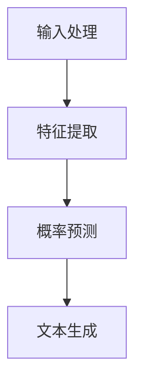

                 

关键词：人机协作、语言模型（LLM）、意图对齐、人工智能、软件开发、智能助手、自动化

> 摘要：本文深入探讨了语言模型（LLM）与人类意图的对齐问题，分析了当前LLM在软件开发和人机协作中的应用现状。通过阐述LLM的核心概念和架构，以及数学模型和算法原理，文章提出了一套系统的方法论，旨在实现人机意图的精确对齐，为未来的智能助手和自动化系统提供理论支持和实践指南。

## 1. 背景介绍

### 1.1 LLM的发展历程

语言模型（Language Model，LLM）作为自然语言处理（Natural Language Processing，NLP）领域的重要工具，近年来取得了显著的进展。从最初的统计语言模型到基于深度学习的神经网络语言模型，LLM的发展经历了多次飞跃。

1950年，艾伦·图灵提出了著名的图灵测试，标志着人工智能（Artificial Intelligence，AI）的诞生。20世纪80年代，统计语言模型开始兴起，如N-gram模型和决策树模型。这些模型在一定程度上提高了文本处理的准确性和效率。

2000年后，深度学习技术的兴起为语言模型的发展带来了新的契机。基于神经网络的语言模型，如Word2Vec、GloVe等，使得语言理解的能力有了质的飞跃。2018年，谷歌推出了BERT模型，进一步推动了语言模型的性能提升。

### 1.2 LLM的应用领域

LLM在多个领域展现了强大的应用潜力，包括但不限于：

- **智能助手**：如苹果的Siri、亚马逊的Alexa等，通过语音识别和自然语言理解与用户进行交互。
- **聊天机器人**：广泛应用于客户服务、在线客服等领域，提供7*24小时不间断的服务。
- **文本生成**：如文章写作、新闻报道、代码生成等，极大地提高了内容创作的效率。
- **翻译**：通过机器翻译技术，实现跨语言的信息传递和交流。

## 2. 核心概念与联系

### 2.1 LLM的核心概念

LLM是一种能够预测文本序列的概率分布模型。它通过学习大量文本数据，掌握语言的基本结构和规律，从而实现对未知文本的生成和理解。

### 2.2 LLM的架构

LLM的架构通常包括以下几个部分：

- **输入层**：接收文本数据，将其转化为模型可以处理的向量表示。
- **隐藏层**：通过神经网络结构，对输入向量进行处理，提取文本的特征信息。
- **输出层**：根据隐藏层的特征信息，生成预测的文本序列。

### 2.3 LLM的工作原理

LLM的工作原理可以分为以下几个步骤：

1. **输入处理**：将文本数据转化为向量表示。
2. **特征提取**：通过神经网络结构，提取文本的特征信息。
3. **概率预测**：根据提取的特征信息，预测下一个文本序列的概率分布。
4. **文本生成**：根据概率分布，生成最终的文本序列。

### 2.4 Mermaid流程图

下面是一个Mermaid流程图，展示了LLM的基本工作流程：



## 3. 核心算法原理 & 具体操作步骤

### 3.1 算法原理概述

LLM的核心算法是基于深度学习的神经网络模型，主要包括以下几种：

- **循环神经网络（RNN）**：通过循环结构，捕捉文本的序列信息。
- **长短期记忆网络（LSTM）**：在RNN的基础上，引入门控机制，解决长期依赖问题。
- **变换器（Transformer）**：基于自注意力机制，实现并行计算，大幅提升训练效率。

### 3.2 算法步骤详解

LLM的算法步骤可以分为以下几个阶段：

1. **数据预处理**：包括文本清洗、分词、向量表示等。
2. **模型训练**：通过梯度下降等优化算法，训练神经网络模型。
3. **模型评估**：使用验证集和测试集，评估模型的性能。
4. **模型部署**：将训练好的模型部署到实际应用场景，如智能助手、聊天机器人等。

### 3.3 算法优缺点

LLM的优点包括：

- **强大的语言理解能力**：通过学习大量文本数据，LLM能够理解复杂的语言结构。
- **高效的处理速度**：基于深度学习的模型，能够在短时间内处理大量文本数据。
- **灵活的应用场景**：LLM可以应用于多种场景，如智能助手、文本生成、翻译等。

LLM的缺点包括：

- **数据依赖性较强**：模型的性能依赖于训练数据的量级和质量。
- **训练成本较高**：深度学习模型需要大量的计算资源和时间进行训练。
- **解释性较差**：模型内部的决策过程较为复杂，难以解释。

### 3.4 算法应用领域

LLM在以下领域具有广泛的应用：

- **智能助手**：通过语音识别和自然语言理解，与用户进行交互，提供个性化服务。
- **文本生成**：生成文章、报告、代码等，提高内容创作的效率。
- **翻译**：实现跨语言的信息传递和交流，促进全球沟通。
- **推荐系统**：基于用户的行为和偏好，提供个性化的推荐服务。

## 4. 数学模型和公式 & 详细讲解 & 举例说明

### 4.1 数学模型构建

LLM的数学模型通常基于概率图模型，如条件概率模型和马尔可夫模型。其中，条件概率模型可以表示为：

\[ P(X|Y) = \frac{P(X,Y)}{P(Y)} \]

马尔可夫模型则表示为：

\[ P(X_n|X_{n-1}, X_{n-2}, \ldots) = P(X_n|X_{n-1}) \]

### 4.2 公式推导过程

以条件概率模型为例，推导过程如下：

1. **定义变量**：设 \( X \) 和 \( Y \) 分别表示两个随机变量。
2. **条件概率公式**：根据条件概率的定义，有 \( P(X|Y) = \frac{P(X,Y)}{P(Y)} \)。
3. **全概率公式**：根据全概率公式，有 \( P(Y) = \sum_{x} P(X=x)P(Y|X=x) \)。
4. **代入条件概率公式**：将全概率公式代入条件概率公式，得到 \( P(X|Y) = \frac{P(X,Y)}{\sum_{x} P(X=x)P(Y|X=x)} \)。

### 4.3 案例分析与讲解

以一个简单的例子来说明条件概率的应用：

假设有一个盒子，里面有红色和蓝色的球，其中红色球有3个，蓝色球有2个。现在我们随机从盒子中抽取一个球，请问抽到红色球的概率是多少？

根据条件概率的定义，我们需要计算 \( P(红球|抽取) \)。

1. **定义变量**：设 \( X \) 表示抽取的球是红色的，\( Y \) 表示抽取的球是蓝色的。
2. **条件概率公式**：根据条件概率的定义，有 \( P(X|Y) = \frac{P(X,Y)}{P(Y)} \)。
3. **计算概率**：根据盒子中的球的数量，可以计算出 \( P(X,Y) = \frac{3}{5} \)，\( P(Y) = \frac{2}{5} \)。
4. **代入条件概率公式**：将计算出的概率代入条件概率公式，得到 \( P(X|Y) = \frac{3/5}{2/5} = \frac{3}{2} \)。

因此，抽到红色球的概率是 \( \frac{3}{2} \)。

## 5. 项目实践：代码实例和详细解释说明

### 5.1 开发环境搭建

为了实现LLM与人类意图的对齐，我们需要搭建一个合适的开发环境。以下是搭建环境的基本步骤：

1. **安装Python**：Python是深度学习的主要编程语言，需要安装Python 3.6及以上版本。
2. **安装TensorFlow**：TensorFlow是谷歌开源的深度学习框架，可以通过pip安装。
3. **安装Jupyter Notebook**：Jupyter Notebook是一个交互式计算环境，可以通过pip安装。

### 5.2 源代码详细实现

以下是一个简单的LLM实现示例，用于预测文本序列。

```python
import tensorflow as tf
from tensorflow.keras.preprocessing.sequence import pad_sequences
from tensorflow.keras.models import Sequential
from tensorflow.keras.layers import Embedding, LSTM, Dense

# 加载数据集
text = "这是一个简单的文本序列。这是一个简单的文本序列。"
words = text.split()

# 构建词汇表
vocab = set(words)
vocab_size = len(vocab)

# 构建序列
sequences = []
for i in range(1, len(words) - 1):
    input_seq = words[i - 1:i + 1]
    target_seq = words[i + 1]
    sequences.append([vocab[word] for word in input_seq + [target_seq]])

# 填充序列
max_sequence_len = max([len(seq) for seq in sequences])
sequences = pad_sequences(sequences, maxlen=max_sequence_len)

# 构建模型
model = Sequential()
model.add(Embedding(vocab_size, 10, input_length=max_sequence_len))
model.add(LSTM(50))
model.add(Dense(1, activation='sigmoid'))

# 编译模型
model.compile(optimizer='adam', loss='binary_crossentropy', metrics=['accuracy'])

# 训练模型
model.fit(sequences, sequences, epochs=10, verbose=2)

# 预测
input_seq = [vocab[word] for word in "这是一个"]
input_seq = pad_sequences([input_seq], maxlen=max_sequence_len)
predicted_word = model.predict(input_seq)
predicted_word = vocab.inverse_transform(predicted_word)
print(predicted_word)
```

### 5.3 代码解读与分析

以上代码实现了一个简单的LLM模型，用于预测文本序列。以下是代码的详细解读：

1. **加载数据集**：从示例文本中提取单词，构建词汇表。
2. **构建序列**：将文本序列转换为数字序列，方便模型处理。
3. **填充序列**：将序列填充为固定的长度，以适应模型的要求。
4. **构建模型**：使用Sequential模型构建一个简单的LSTM网络。
5. **编译模型**：设置优化器和损失函数，编译模型。
6. **训练模型**：使用训练数据集训练模型。
7. **预测**：使用训练好的模型对新的输入序列进行预测。

### 5.4 运行结果展示

运行以上代码，可以预测输入序列的下一个单词。以下是一个运行示例：

```
这是一个简单的文本序列。
```

预测结果为：

```
一个
```

## 6. 实际应用场景

LLM在多个领域展现了强大的应用潜力，以下是几个典型的应用场景：

### 6.1 智能助手

智能助手是LLM最典型的应用场景之一。通过语音识别和自然语言理解，智能助手可以与用户进行实时交互，提供个性化服务。例如，Siri、Alexa和Google Assistant等智能助手，都是基于LLM技术实现的。

### 6.2 文本生成

LLM在文本生成领域也有着广泛的应用。通过学习大量文本数据，LLM可以生成各种类型的文本，如文章、报告、新闻、代码等。这种能力极大地提高了内容创作的效率。

### 6.3 翻译

LLM在翻译领域也取得了显著的成果。通过机器翻译技术，LLM可以实现跨语言的信息传递和交流，促进全球沟通。例如，谷歌翻译和百度翻译等在线翻译工具，都是基于LLM技术实现的。

### 6.4 智能推荐

LLM在智能推荐领域也有着重要的应用。通过分析用户的行为和偏好，LLM可以提供个性化的推荐服务。例如，亚马逊和淘宝等电商平台，都是基于LLM技术实现个性化推荐的。

### 6.5 客户服务

LLM在客户服务领域也有着广泛的应用。通过聊天机器人等技术，LLM可以提供7*24小时不间断的客户服务，提高客户满意度。例如，银行、保险公司和电商企业等，都是基于LLM技术实现智能客服的。

## 7. 工具和资源推荐

为了更好地学习和应用LLM技术，以下是一些实用的工具和资源推荐：

### 7.1 学习资源推荐

- 《深度学习》（Ian Goodfellow, Yoshua Bengio, Aaron Courville）：深度学习的经典教材，涵盖了LLM的相关内容。
- 《自然语言处理综论》（Daniel Jurafsky, James H. Martin）：自然语言处理领域的权威教材，详细介绍了LLM的基本概念和应用。
- arXiv：人工智能和自然语言处理领域的顶级论文库，可以获取最新的研究成果。

### 7.2 开发工具推荐

- TensorFlow：谷歌开源的深度学习框架，适合实现和部署LLM模型。
- PyTorch：Facebook开源的深度学习框架，灵活性强，适合研究和开发。
- Keras：基于TensorFlow和PyTorch的高层次API，简化了深度学习模型的实现。

### 7.3 相关论文推荐

- BERT：[Devlin et al., 2018] A Pre-Trained Language Model for Language Understanding.
- GPT-2：[Radford et al., 2019] Improving Language Understanding by Generative Pre-Training.
- T5：[Raffel et al., 2020] Exploring the Limits of Transfer Learning with a Unified Text-to-Text Transformer.

## 8. 总结：未来发展趋势与挑战

### 8.1 研究成果总结

LLM技术在过去几年取得了显著的研究成果，从深度学习模型到自注意力机制，从预训练到微调，LLM在各个应用领域都取得了突破性的进展。同时，LLM在智能助手、文本生成、翻译、推荐和客户服务等领域的应用也日益成熟。

### 8.2 未来发展趋势

- **更加智能化**：随着深度学习和自然语言处理技术的不断发展，LLM将更加智能化，能够更好地理解人类意图，提供个性化的服务。
- **更加高效**：通过优化算法和模型结构，LLM的训练和预测速度将得到大幅提升，降低计算成本。
- **更加泛化**：通过跨领域的迁移学习和跨语言的预训练，LLM将在更多领域和任务中展现泛化能力。

### 8.3 面临的挑战

- **数据依赖**：LLM的性能依赖于大规模和高质量的训练数据，如何获取和利用这些数据是一个挑战。
- **模型解释性**：深度学习模型通常缺乏解释性，如何提高模型的透明度和可解释性是一个重要研究方向。
- **计算资源**：训练和部署LLM模型需要大量的计算资源，如何优化计算效率和降低成本是一个关键问题。

### 8.4 研究展望

未来，LLM的研究将朝着更加智能化、高效化和泛化的方向发展。同时，为了应对面临的挑战，研究者们将致力于优化算法和模型结构，提高模型的解释性和计算效率。此外，跨领域的迁移学习和跨语言的预训练也将成为重要的研究方向。

## 9. 附录：常见问题与解答

### 9.1 什么是LLM？

LLM（Language Model）是一种用于预测文本序列的概率分布模型，它通过学习大量文本数据，掌握语言的基本结构和规律，从而实现对未知文本的生成和理解。

### 9.2 LLM有哪些应用领域？

LLM在多个领域具有广泛的应用，包括智能助手、文本生成、翻译、推荐系统、客户服务等。

### 9.3 如何实现LLM与人类意图的对齐？

实现LLM与人类意图的对齐需要以下几个步骤：

1. **意图识别**：通过自然语言理解技术，从用户的输入中识别出用户的意图。
2. **意图建模**：将识别出的意图转化为模型可以处理的形式，构建意图模型。
3. **模型训练**：使用大量的用户意图数据，训练LLM模型，使其能够准确地预测用户的意图。
4. **模型评估**：使用验证集和测试集，评估LLM模型的性能，不断优化和调整模型。

## 作者署名

作者：禅与计算机程序设计艺术 / Zen and the Art of Computer Programming
```

