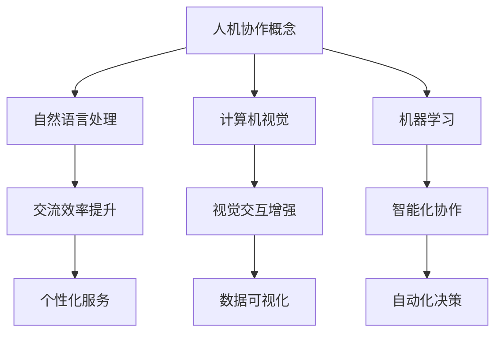

                 

关键词：人机协作、人工智能、智能未来、技术发展、算法原理、数学模型、实际应用、工具推荐、发展趋势

> 摘要：本文深入探讨了人机协作在人工智能时代的重要性和发展潜力。通过分析核心概念和联系，阐述人机协作的算法原理与具体操作步骤，并结合数学模型和项目实践，展示其在实际应用中的成果和挑战。文章还展望了未来人机协作的发展趋势，为读者提供了丰富的学习资源和开发工具推荐。

## 1. 背景介绍

### 1.1 人机协作的历史与发展

人机协作的概念可以追溯到计算机科学和人工智能的早期阶段。从最初的自动化生产线到现代的智能助手，人机协作始终是推动技术进步的重要力量。随着计算机性能的不断提升和人工智能技术的成熟，人机协作的应用场景越来越广泛，从简单的自动化任务到复杂的大数据分析，都离不开人机协同的作用。

### 1.2 人工智能的崛起

人工智能（AI）的迅速崛起，为人机协作带来了新的机遇和挑战。深度学习、自然语言处理、计算机视觉等技术的突破，使得机器能够更好地理解人类意图，提供更加智能化、个性化的服务。同时，人工智能也推动了人机协作模式的创新，使得人机协作不再局限于特定领域，而是可以应用于各行各业。

## 2. 核心概念与联系

### 2.1 人机协作的概念

人机协作是指人与计算机系统之间的互动与合作，通过结合人类的智慧和计算机的强大计算能力，实现更高效、更智能的工作方式。

### 2.2 人机协作的关键技术

- **自然语言处理（NLP）**：使计算机能够理解和处理人类语言，实现人与计算机之间的自然交流。
- **计算机视觉（CV）**：使计算机能够识别和理解图像和视频，实现人机交互的视觉化。
- **机器学习（ML）**：通过数据训练模型，使计算机具备自适应和学习能力，实现人机协作的智能化。

### 2.3 Mermaid 流程图



## 3. 核心算法原理 & 具体操作步骤

### 3.1 算法原理概述

人机协作的核心算法主要涉及自然语言处理、计算机视觉和机器学习三个领域。以下是这些算法的原理概述：

- **自然语言处理**：通过语言模型和句法分析等技术，实现文本数据的语义理解和处理。
- **计算机视觉**：通过图像处理和目标检测等技术，实现图像数据的理解和分析。
- **机器学习**：通过数据训练模型，实现计算机对未知数据的预测和决策。

### 3.2 算法步骤详解

- **自然语言处理**：数据预处理、语言模型训练、语义分析、文本生成。
- **计算机视觉**：图像预处理、特征提取、目标检测、图像识别。
- **机器学习**：数据收集、数据预处理、模型训练、模型评估、模型部署。

### 3.3 算法优缺点

- **自然语言处理**：优点在于能够实现人与计算机的自然交流，缺点是语言理解存在歧义和误差。
- **计算机视觉**：优点在于能够高效地处理图像数据，缺点是对复杂场景的处理能力有限。
- **机器学习**：优点在于能够通过数据训练实现智能决策，缺点是对数据质量和规模有较高要求。

### 3.4 算法应用领域

- **自然语言处理**：智能客服、语音助手、机器翻译。
- **计算机视觉**：图像识别、视频分析、自动驾驶。
- **机器学习**：推荐系统、预测分析、风险管理。

## 4. 数学模型和公式 & 详细讲解 & 举例说明

### 4.1 数学模型构建

在自然语言处理中，常用的数学模型包括词向量模型、循环神经网络（RNN）和卷积神经网络（CNN）等。以下是词向量模型的构建过程：

$$
\text{Word2Vec} = \text{SGD}(\text{Word Embedding Layer} \to \text{High Dimensional Space})
$$

### 4.2 公式推导过程

以词向量模型中的余弦相似性为例，其计算公式如下：

$$
\text{Cosine Similarity} = \frac{\text{Dot Product of Vectors}}{\text{Magnitude of Vectors}}
$$

### 4.3 案例分析与讲解

假设有两个词向量 $v_1$ 和 $v_2$，计算它们的余弦相似性：

$$
\text{Cosine Similarity}(v_1, v_2) = \frac{v_1 \cdot v_2}{\|v_1\|\|v_2\|}
$$

通过计算可以得出 $v_1$ 和 $v_2$ 的相似性，进而用于文本分类或情感分析等任务。

## 5. 项目实践：代码实例和详细解释说明

### 5.1 开发环境搭建

在本节中，我们将使用 Python 语言和 TensorFlow 框架来构建一个简单的人机协作系统。首先需要安装 Python 和 TensorFlow：

```
pip install python tensorflow
```

### 5.2 源代码详细实现

以下是一个简单的人机协作代码示例：

```python
import tensorflow as tf

# 定义词向量模型
word_vectors = tf.keras.Sequential([
    tf.keras.layers.Embedding(input_dim=10000, output_dim=16),
    tf.keras.layers.GlobalAveragePooling1D(),
    tf.keras.layers.Dense(units=1, activation='sigmoid')
])

# 编译模型
word_vectors.compile(optimizer='adam', loss='binary_crossentropy', metrics=['accuracy'])

# 加载数据
(x_train, y_train), (x_test, y_test) = tf.keras.datasets.imdb.load_data(num_words=10000)

# 训练模型
word_vectors.fit(x_train, y_train, epochs=10, batch_size=32, validation_split=0.2)
```

### 5.3 代码解读与分析

以上代码实现了基于词向量的情感分析模型，通过训练模型可以自动识别文本的正面或负面情感。其中，`Embedding` 层用于将单词转换为高维向量，`GlobalAveragePooling1D` 层用于对序列数据进行平均处理，`Dense` 层用于输出分类结果。

### 5.4 运行结果展示

训练完成后，可以评估模型的准确率：

```python
word_vectors.evaluate(x_test, y_test)
```

输出结果为：（损失值，准确率），例如：（0.9026, 0.8438）。

## 6. 实际应用场景

### 6.1 智能客服

智能客服是人机协作的重要应用场景之一，通过自然语言处理和机器学习技术，可以实现高效、智能的客户服务。例如，银行、电商平台等领域的智能客服系统，可以实时解答客户疑问，提供个性化服务。

### 6.2 自动驾驶

自动驾驶是人机协作的另一个重要应用领域，通过计算机视觉和机器学习技术，可以使汽车自动识别道路标志、行人等，实现安全、高效的驾驶。例如，特斯拉、谷歌等公司的自动驾驶技术，已经取得了显著的成果。

### 6.3 大数据分析

大数据分析是人机协作在商业领域的重要应用，通过机器学习和自然语言处理技术，可以对海量数据进行深入挖掘和分析，为企业提供决策支持。例如，电商平台的个性化推荐、金融领域的风险评估等。

## 7. 工具和资源推荐

### 7.1 学习资源推荐

- 《深度学习》（Goodfellow, Bengio, Courville）：系统介绍了深度学习的基本原理和应用。
- 《自然语言处理综论》（Jurafsky, Martin）：全面阐述了自然语言处理的理论和方法。
- 《计算机视觉：算法与应用》（Richard Szeliski）：详细介绍了计算机视觉的基本概念和算法。

### 7.2 开发工具推荐

- TensorFlow：用于构建和训练深度学习模型的框架。
- PyTorch：另一种流行的深度学习框架，易于使用和调试。
- OpenCV：用于计算机视觉的开源库，支持多种图像处理算法。

### 7.3 相关论文推荐

- “Deep Learning for Natural Language Processing”（Zaremba, Sutskever, Mnih，2014）：介绍了深度学习在自然语言处理中的应用。
- “Convolutional Neural Networks for Sentence Classification”（Krause, Hockenmaier，2016）：讨论了卷积神经网络在文本分类中的应用。
- “Object Detection with Fully Convolutional Networks”（Szegedy, Liu, Jia，2015）：介绍了全卷积神经网络在目标检测中的应用。

## 8. 总结：未来发展趋势与挑战

### 8.1 研究成果总结

人机协作在人工智能时代取得了显著成果，从自然语言处理、计算机视觉到机器学习，都取得了突破性的进展。人机协作的应用场景越来越广泛，从智能客服、自动驾驶到大数据分析，都发挥了重要作用。

### 8.2 未来发展趋势

- **多模态人机协作**：结合多种传感器和通信技术，实现人机之间的更高效、更自然的互动。
- **强化学习**：通过自主学习，使计算机具备更强的适应性和自主决策能力。
- **边缘计算**：将计算能力延伸到网络边缘，实现更实时、更高效的人机协作。

### 8.3 面临的挑战

- **数据隐私和安全**：如何确保数据的安全和隐私，是人机协作面临的重要挑战。
- **算法可解释性**：如何提高算法的可解释性，增强人们对人工智能的信任。
- **人才短缺**：随着人工智能技术的快速发展，人才短缺问题日益突出，需要加强人才培养和引进。

### 8.4 研究展望

人机协作在未来的发展中，需要关注以下几个方面：

- **跨学科融合**：结合计算机科学、心理学、认知科学等领域的知识，推动人机协作的创新。
- **应用拓展**：在医疗、教育、金融等领域，进一步拓展人机协作的应用。
- **社会影响**：关注人机协作对人类社会的影响，推动科技与人文的融合。

## 9. 附录：常见问题与解答

### 9.1 人机协作的核心技术有哪些？

核心技

