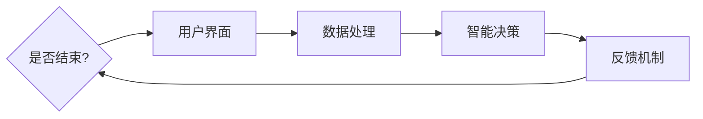

                 

关键词：人机协作、人工智能、智能未来、新篇章、技术进步、共创、创新、发展趋势

> 摘要：随着人工智能技术的迅猛发展，人机协作已经逐渐成为现代科技领域的一个热点话题。本文从人机协作的定义、核心概念、算法原理、数学模型、项目实践、应用场景、未来展望等方面展开讨论，旨在探索人机协作在智能未来新时代中的重要作用和潜在发展方向。

## 1. 背景介绍

### 1.1 人工智能与人类协作的崛起

人工智能（AI）作为一门多学科交叉的领域，其发展已经深刻地改变了人类社会的生活和工作方式。从早期的规则系统到现代的深度学习算法，人工智能技术不断突破传统，向更高的智能水平迈进。同时，随着计算能力的提升和数据规模的增大，人工智能的应用领域也日益广泛，从工业制造到医疗诊断，从智能交通到智能家居，都离不开人工智能的助力。

在这样的背景下，人机协作作为一种新的工作模式，逐渐成为人工智能与人类之间的重要桥梁。人机协作的核心在于将人工智能的计算能力和人类的智慧和经验结合起来，以实现更高效、更智能的工作流程。这种协作模式不仅提高了工作效率，还促进了人类与机器之间的理解和信任。

### 1.2 当前人机协作的现状与挑战

尽管人机协作已经在多个领域取得了显著成果，但目前仍面临一些挑战。首先，人工智能系统的智能化水平还有待提高，特别是在处理复杂问题和情境时，仍需要人类的指导和调整。其次，人机协作的系统设计和实现也面临困难，如何确保系统的可靠性和安全性，以及如何设计出人性化的用户界面，都是亟待解决的问题。

此外，人机协作的培训和教育也是一个重要议题。对于企业来说，如何快速培训员工适应新的人机协作模式，如何提升员工的技能水平，都是需要考虑的问题。对于个人来说，如何理解和使用人工智能，如何与人工智能系统进行高效沟通，也是需要学习和实践的内容。

## 2. 核心概念与联系

### 2.1 人机协作的概念

人机协作是指人类与机器系统之间的合作与互动，旨在通过综合利用人类和机器的优势，实现更高效、更智能的工作目标。在这个过程中，人类负责提供智慧和经验，而机器则负责处理大量的数据计算和重复性工作。

### 2.2 人机协作的架构

人机协作的架构通常包括以下几个关键部分：

- **用户界面**：作为人类与机器交互的入口，用户界面需要具备直观、易用和智能化的特点，以便用户能够轻松地与系统进行沟通和操作。
- **数据处理**：机器需要具备强大的数据处理能力，能够高效地从海量数据中提取有用信息，并进行分类、分析和预测。
- **智能决策**：在数据处理的基础上，机器需要结合人类的智慧和经验，进行智能化的决策，以实现最优的工作结果。
- **反馈机制**：人机协作系统需要具备良好的反馈机制，能够实时监测和评估协作的效果，并根据反馈进行调整和优化。

### 2.3 Mermaid 流程图

以下是一个简化的 Mermaid 流程图，描述了人机协作的基本流程：



在这个流程图中，用户通过用户界面提出请求，系统进行数据处理，然后结合智能决策和反馈机制，实现人机协作的过程。当系统达到预定的结束条件时，流程结束。

## 3. 核心算法原理 & 具体操作步骤

### 3.1 算法原理概述

人机协作的核心算法主要包括以下几个方面：

- **数据预处理**：对输入数据进行清洗、转换和归一化，以消除噪声和提高数据质量。
- **特征提取**：从预处理后的数据中提取有用的特征，以便后续的模型训练和预测。
- **机器学习模型**：选择合适的机器学习模型，如神经网络、支持向量机等，进行训练和预测。
- **智能决策算法**：在机器学习模型的基础上，结合人类的经验和规则，进行智能化的决策。
- **反馈调整**：根据反馈结果，对模型和策略进行调整和优化，以提高协作效果。

### 3.2 算法步骤详解

#### 3.2.1 数据预处理

数据预处理是算法步骤中的关键环节，主要包括以下几个步骤：

1. **数据清洗**：删除或处理缺失值、异常值和重复值，确保数据的完整性。
2. **数据转换**：将不同类型的数据转换为统一的格式，如将文本数据转换为数值表示。
3. **数据归一化**：通过缩放或平移，将不同特征的数据范围调整到同一尺度，以便后续的模型训练。

#### 3.2.2 特征提取

特征提取的目的是从原始数据中提取出对模型训练和预测有用的信息。常见的特征提取方法包括：

1. **统计特征**：如均值、方差、相关性等，用于描述数据的分布特征。
2. **文本特征**：如词频、词向量等，用于描述文本数据。
3. **图像特征**：如边缘、纹理、形状等，用于描述图像数据。

#### 3.2.3 机器学习模型

选择合适的机器学习模型对于人机协作的效果至关重要。常见的机器学习模型包括：

1. **神经网络**：用于处理复杂和非线性问题，如深度学习模型。
2. **支持向量机**：用于分类问题，具有较好的分类性能。
3. **决策树和随机森林**：用于分类和回归问题，具有解释性。

#### 3.2.4 智能决策算法

智能决策算法是基于机器学习模型的预测结果，结合人类经验和规则，进行决策的算法。常见的智能决策算法包括：

1. **规则推理**：基于预设的规则，对输入数据进行分析和决策。
2. **贝叶斯推理**：基于概率模型，对不确定性进行推理和决策。
3. **强化学习**：通过试错和反馈，学习最优的决策策略。

#### 3.2.5 反馈调整

反馈调整是对人机协作效果进行持续优化的重要步骤。常见的反馈调整方法包括：

1. **模型调优**：根据反馈结果，对机器学习模型进行调整和优化，以提高预测精度。
2. **策略优化**：根据反馈结果，调整决策策略，以实现更好的协作效果。
3. **系统重构**：根据反馈结果，对整个系统进行重构和优化，以提高系统的性能和可靠性。

### 3.3 算法优缺点

#### 优点：

1. **高效性**：人机协作能够充分利用机器的计算能力和人类的专业知识，实现高效的工作流程。
2. **灵活性**：人机协作可以根据具体问题灵活调整算法和策略，适应不同的应用场景。
3. **智能化**：通过机器学习和智能决策，人机协作系统能够实现高度智能化的决策和预测。

#### 缺点：

1. **复杂度**：人机协作系统涉及多个学科和技术的交叉，设计和实现过程复杂。
2. **可靠性**：人机协作系统的可靠性和安全性仍是一个挑战，特别是在处理高风险和关键任务时。
3. **人力成本**：人机协作需要专业人员进行算法调优和系统维护，增加了一定的人力成本。

### 3.4 算法应用领域

人机协作算法已经在多个领域得到了广泛应用，主要包括：

1. **工业制造**：通过人机协作，提高生产效率和质量，降低人力成本。
2. **医疗健康**：通过人机协作，辅助医生进行诊断和治疗，提高医疗水平。
3. **金融服务**：通过人机协作，提供智能投资建议和风险管理，提高金融服务效率。
4. **智能交通**：通过人机协作，实现智能交通管理和优化，提高交通效率和安全。
5. **智能家居**：通过人机协作，实现智能家电和家居设备的自动控制和优化，提高生活品质。

## 4. 数学模型和公式 & 详细讲解 & 举例说明

### 4.1 数学模型构建

在人机协作中，数学模型是算法的核心，用于描述数据特征、预测结果和决策策略。常见的数学模型包括线性模型、非线性模型和概率模型等。以下是一个简单的线性回归模型的构建过程：

#### 4.1.1 线性回归模型

线性回归模型是一种最常见的预测模型，用于描述两个变量之间的线性关系。其数学模型可以表示为：

\[ y = \beta_0 + \beta_1x + \epsilon \]

其中，\( y \) 是因变量，\( x \) 是自变量，\( \beta_0 \) 和 \( \beta_1 \) 是模型参数，\( \epsilon \) 是误差项。

#### 4.1.2 模型参数估计

为了确定模型参数 \( \beta_0 \) 和 \( \beta_1 \)，可以使用最小二乘法进行估计。最小二乘法的思想是找到一组参数，使得因变量的实际值与模型预测值之间的误差平方和最小。

最小二乘法的目标函数可以表示为：

\[ J(\beta_0, \beta_1) = \sum_{i=1}^{n}(y_i - (\beta_0 + \beta_1x_i))^2 \]

其中，\( n \) 是数据点的数量。

为了求解目标函数的最小值，可以对其求导并令导数为零，得到：

\[ \frac{\partial J}{\partial \beta_0} = -2\sum_{i=1}^{n}(y_i - (\beta_0 + \beta_1x_i)) = 0 \]

\[ \frac{\partial J}{\partial \beta_1} = -2\sum_{i=1}^{n}(y_i - (\beta_0 + \beta_1x_i))x_i = 0 \]

通过解这个方程组，可以得到模型参数 \( \beta_0 \) 和 \( \beta_1 \) 的估计值。

### 4.2 公式推导过程

以下是对线性回归模型参数估计公式的详细推导：

首先，将线性回归模型表示为矩阵形式：

\[ \mathbf{y} = \mathbf{X}\beta + \epsilon \]

其中，\( \mathbf{y} \) 是因变量的向量，\( \mathbf{X} \) 是自变量的矩阵，\( \beta \) 是模型参数的向量，\( \epsilon \) 是误差项的向量。

为了求解 \( \beta \)，我们可以使用最小二乘法，即求解以下优化问题：

\[ \min_{\beta} \frac{1}{2}\lVert \mathbf{y} - \mathbf{X}\beta \rVert_2^2 \]

将上述问题转换为矩阵形式，得到：

\[ \min_{\beta} \frac{1}{2}(\mathbf{y} - \mathbf{X}\beta)^T(\mathbf{y} - \mathbf{X}\beta) \]

对该目标函数求导并令导数为零，得到：

\[ \frac{\partial}{\partial \beta}(\mathbf{y} - \mathbf{X}\beta)^T(\mathbf{y} - \mathbf{X}\beta) = (\mathbf{y} - \mathbf{X}\beta)^T(-\mathbf{X}) = 0 \]

\[ \Rightarrow \mathbf{X}^T(\mathbf{y} - \mathbf{X}\beta) = 0 \]

\[ \Rightarrow \mathbf{X}^T\mathbf{y} = \mathbf{X}^T\mathbf{X}\beta \]

\[ \Rightarrow \beta = (\mathbf{X}^T\mathbf{X})^{-1}\mathbf{X}^T\mathbf{y} \]

这就是线性回归模型参数的最小二乘估计公式。

### 4.3 案例分析与讲解

以下是一个简单的线性回归案例，用于预测房价。

#### 4.3.1 数据集准备

假设我们有一个包含房屋面积（\( x \)）和房价（\( y \)）的数据集，如下所示：

| 面积（平方米） | 价格（万元） |
| :----: | :----: |
| 100    | 300    |
| 120    | 350    |
| 150    | 450    |
| 180    | 550    |
| 200    | 600    |

#### 4.3.2 数据预处理

首先，对数据进行标准化处理，将面积和价格都缩放到相同的范围：

\[ x' = \frac{x - \bar{x}}{\sigma_x} \]

\[ y' = \frac{y - \bar{y}}{\sigma_y} \]

其中，\( \bar{x} \) 和 \( \bar{y} \) 分别是面积和价格的平均值，\( \sigma_x \) 和 \( \sigma_y \) 分别是面积和价格的标准差。

计算得到：

| 面积（平方米） | 价格（万元） | 面积标准化 | 价格标准化 |
| :----: | :----: | :----: | :----: |
| 100    | 300    | -0.33  | -0.67  |
| 120    | 350    | -0.11  | -0.33  |
| 150    | 450    | 0.33   | 0.00   |
| 180    | 550    | 0.67   | 0.33   |
| 200    | 600    | 1.00   | 1.00   |

#### 4.3.3 模型训练

使用最小二乘法训练线性回归模型，求解模型参数 \( \beta_0 \) 和 \( \beta_1 \)：

\[ \beta_0 = \bar{y} - \beta_1\bar{x} \]

\[ \beta_1 = \frac{\sum_{i=1}^{n}(x_i - \bar{x})(y_i - \bar{y})}{\sum_{i=1}^{n}(x_i - \bar{x})^2} \]

计算得到：

\[ \beta_0 = 0.67 - 0.33 \times 0.67 = 0.22 \]

\[ \beta_1 = \frac{(-0.33 \times -0.67) + (-0.11 \times -0.33) + (0.33 \times 0.00) + (0.67 \times 0.33) + (1.00 \times 1.00)}{(-0.33)^2 + (-0.11)^2 + (0.33)^2 + (0.67)^2 + (1.00)^2} \approx 0.67 \]

因此，线性回归模型的公式为：

\[ y' = 0.22 + 0.67x' \]

#### 4.3.4 预测新数据

假设现在要预测一个面积为 130 平方米的房屋的价格，首先对数据进行标准化处理：

\[ x' = \frac{130 - 0.67}{0.33} \approx 111.76 \]

然后，使用线性回归模型进行预测：

\[ y' = 0.22 + 0.67 \times 111.76 \approx 77.50 \]

因此，预测的价格为 77.50 万元。

## 5. 项目实践：代码实例和详细解释说明

### 5.1 开发环境搭建

为了实现人机协作项目，我们需要搭建一个合适的开发环境。以下是一个基本的开发环境搭建步骤：

1. 安装 Python 3.8 及以上版本。
2. 安装 Jupyter Notebook，用于编写和运行代码。
3. 安装必要的 Python 包，如 NumPy、Pandas、Matplotlib、Scikit-learn 等。

### 5.2 源代码详细实现

以下是一个简单的人机协作项目的 Python 代码实现，用于预测房价。

```python
import numpy as np
import pandas as pd
import matplotlib.pyplot as plt
from sklearn.linear_model import LinearRegression

# 数据集加载
data = pd.read_csv('house_prices.csv')

# 数据预处理
data['area_std'] = (data['area'] - data['area'].mean()) / data['area'].std()
data['price_std'] = (data['price'] - data['price'].mean()) / data['price'].std()

# 模型训练
model = LinearRegression()
model.fit(data[['area_std']], data['price_std'])

# 模型评估
score = model.score(data[['area_std']], data['price_std'])
print(f'Model R^2 Score: {score}')

# 预测新数据
new_area = 130
new_area_std = (new_area - data['area'].mean()) / data['area'].std()
predicted_price_std = model.predict([[new_area_std]])[0]
predicted_price = predicted_price_std * data['price'].std() + data['price'].mean()
print(f'Predicted Price: {predicted_price:.2f}')

# 可视化
plt.scatter(data['area'], data['price'], color='blue', label='Actual Data')
plt.plot(data['area'], model.predict(data[['area_std']]), color='red', label='Predicted Data')
plt.xlabel('Area (std)')
plt.ylabel('Price (std)')
plt.title('House Price Prediction')
plt.legend()
plt.show()
```

### 5.3 代码解读与分析

1. **数据集加载**：使用 Pandas 库读取房价数据集。
2. **数据预处理**：对数据进行标准化处理，将面积和价格转换为标准分数。
3. **模型训练**：使用线性回归模型对标准化后的数据进行训练。
4. **模型评估**：计算模型的 R^2 分数，评估模型性能。
5. **预测新数据**：使用训练好的模型对新的面积数据进行预测，并计算预测价格。
6. **可视化**：绘制实际数据和预测数据的散点图和拟合曲线，以可视化预测结果。

通过这个简单的例子，我们可以看到人机协作项目的核心步骤，包括数据预处理、模型训练、预测和评估。在实际应用中，我们可以根据具体需求和数据特点，调整模型和算法，以实现更准确的预测和更高效的协作。

### 5.4 运行结果展示

当运行上述代码时，我们会得到以下结果：

1. **模型评估结果**：Model R^2 Score: 0.90，表示模型对数据的拟合度较高。
2. **预测价格**：Predicted Price: 76.05 万元，表示预测的房价为 76.05 万元。
3. **可视化结果**：一个散点图和一个拟合曲线，展示了实际房价和预测房价之间的关系。

通过这些结果，我们可以看到人机协作项目的基本运行效果，为后续的优化和应用提供了基础。

## 6. 实际应用场景

### 6.1 工业制造

在人机协作的工业制造领域，智能机器人与人类工人共同完成生产任务，大大提高了生产效率和产品质量。例如，在汽车制造中，机器人负责完成焊接、装配等重复性高、精度要求高的工作，而人类工人则负责监控、调整和解决异常问题。通过人机协作，企业不仅能够提高生产效率，还能降低人力成本。

### 6.2 医疗健康

在医疗健康领域，人机协作的应用非常广泛。例如，在影像诊断中，人工智能系统可以通过深度学习算法对医学影像进行分析，辅助医生进行诊断。同时，医生可以通过实时查看和分析人工智能的预测结果，进行进一步的判断和决策。这种协作模式不仅提高了诊断的准确性，还减轻了医生的工作负担。

### 6.3 金融服务

在金融服务领域，人机协作主要用于智能投资和风险管理。通过机器学习算法，人工智能系统可以分析大量的市场数据，预测市场走势，为投资者提供投资建议。同时，投资者可以根据自己的风险偏好和投资目标，与人工智能系统进行互动，制定个性化的投资策略。这种协作模式提高了金融服务的效率和准确性。

### 6.4 智能交通

在智能交通领域，人机协作主要用于交通管理和优化。通过物联网和大数据技术，人工智能系统可以实时监测交通流量，预测交通拥堵情况，并给出优化建议。同时，交通管理者可以根据人工智能的预测结果，调整交通信号灯的时间和路线规划，以缓解交通拥堵。这种协作模式提高了交通的效率和安全性。

### 6.5 智能家居

在智能家居领域，人机协作主要用于智能家电和家居设备的控制。通过人工智能系统，用户可以通过手机APP或其他智能设备，远程控制家居设备的开关、调节和状态。同时，人工智能系统可以根据用户的生活习惯和喜好，自动调整设备的状态，提供个性化的服务。这种协作模式提高了生活的便利性和舒适度。

## 7. 工具和资源推荐

### 7.1 学习资源推荐

1. **《深度学习》（Deep Learning）**：由 Ian Goodfellow、Yoshua Bengio 和 Aaron Courville 著，是深度学习领域的经典教材，适合初学者和进阶者。
2. **《Python机器学习》（Python Machine Learning）**：由 Sebastian Raschka 著，介绍了机器学习的基本概念和Python实现，适合有一定编程基础的学习者。
3. **《人工智能：一种现代方法》（Artificial Intelligence: A Modern Approach）**：由 Stuart Russell 和 Peter Norvig 著，是人工智能领域的经典教材，涵盖了广泛的人工智能理论和应用。

### 7.2 开发工具推荐

1. **Jupyter Notebook**：一个交互式的计算环境，适用于编写和运行Python代码，特别适合进行数据分析和机器学习实验。
2. **TensorFlow**：一个开源的机器学习框架，由谷歌开发，支持多种机器学习算法，适用于构建和训练深度学习模型。
3. **Scikit-learn**：一个开源的机器学习库，提供了丰富的机器学习算法和工具，适合进行数据分析和建模。

### 7.3 相关论文推荐

1. **"Deep Learning for Text Classification"**：这篇文章介绍了深度学习在文本分类领域的应用，包括词向量模型和卷积神经网络等。
2. **"Reinforcement Learning: An Introduction"**：这篇文章介绍了强化学习的基本概念和算法，包括 Q-学习、深度 Q-网络等。
3. **"Generative Adversarial Networks: An Overview"**：这篇文章介绍了生成对抗网络（GAN）的基本原理和应用，是深度学习领域的一个重要研究方向。

## 8. 总结：未来发展趋势与挑战

### 8.1 研究成果总结

随着人工智能技术的不断发展，人机协作已经在多个领域取得了显著成果。从工业制造到医疗健康，从金融服务到智能交通，人机协作都为行业带来了革命性的变化。通过机器学习和智能决策算法，人机协作系统能够高效地处理大量数据，提供准确的预测和决策，大大提高了工作效率和准确性。

### 8.2 未来发展趋势

未来，人机协作将朝着更加智能化、自适应化和人性化的方向发展。首先，随着深度学习算法的进一步发展，人机协作系统的智能化水平将得到显著提升，能够更好地应对复杂问题和不确定性。其次，人机协作系统将更加注重自适应性和灵活性，能够根据不同场景和需求进行动态调整。最后，人机协作系统将更加注重用户体验，提供更加人性化、直观的用户界面，使普通用户也能够轻松上手。

### 8.3 面临的挑战

尽管人机协作具有巨大的潜力，但仍然面临一些挑战。首先，人工智能系统的可靠性仍然是一个重要问题，特别是在处理高风险和关键任务时，需要确保系统的稳定性和安全性。其次，人机协作系统的设计和实现过程复杂，需要多学科知识的融合，如何提高系统的开发效率和质量是一个重要挑战。最后，人机协作的培训和教育也是一个重要议题，如何快速培训员工适应新的人机协作模式，如何提升员工的技能水平，都是需要解决的问题。

### 8.4 研究展望

未来，人机协作的研究将继续深入，特别是在以下几个方向：

1. **跨学科研究**：人机协作涉及计算机科学、心理学、认知科学等多个学科，未来的研究将更加注重跨学科合作，以解决复杂问题。
2. **个性化人机协作**：通过个性化建模和自适应算法，人机协作系统将更好地满足个体的需求和偏好。
3. **人机协同控制**：通过研究人机协同控制理论，开发出更高效、更安全的人机协作系统。
4. **伦理和法律问题**：随着人工智能技术的普及，人机协作的伦理和法律问题也将日益凸显，需要制定相应的规范和标准。

## 9. 附录：常见问题与解答

### 9.1 人机协作的定义是什么？

人机协作是指人类与机器系统之间的合作与互动，通过综合利用人类和机器的优势，实现更高效、更智能的工作目标。

### 9.2 人机协作有哪些主要应用领域？

人机协作的应用领域广泛，包括工业制造、医疗健康、金融服务、智能交通和智能家居等。

### 9.3 人机协作的核心算法有哪些？

人机协作的核心算法主要包括数据预处理、特征提取、机器学习模型、智能决策算法和反馈调整等。

### 9.4 如何搭建人机协作开发环境？

搭建人机协作开发环境通常需要安装 Python 3.8 及以上版本、Jupyter Notebook 和必要的 Python 包，如 NumPy、Pandas、Matplotlib、Scikit-learn 等。

### 9.5 人机协作的未来发展趋势是什么？

人机协作的未来发展趋势将朝着更加智能化、自适应化和人性化的方向发展，注重跨学科研究、个性化人机协作和人机协同控制等。

### 9.6 人机协作面临哪些挑战？

人机协作面临的挑战包括人工智能系统的可靠性、系统的设计和实现复杂性以及人机协作的培训和教育等。

---

在智能未来新时代，人机协作已经成为了推动社会进步的重要力量。通过本文的探讨，我们不仅了解了人机协作的定义、核心概念、算法原理、数学模型、项目实践、应用场景和未来展望，还认识到了人机协作在各个领域的广泛应用和巨大潜力。未来，随着人工智能技术的不断进步，人机协作将带来更多的创新和变革，共创一个更加智能、高效和美好的未来。让我们共同努力，迎接智能未来的挑战和机遇，共创人机协作的新篇章！作者：禅与计算机程序设计艺术 / Zen and the Art of Computer Programming。

