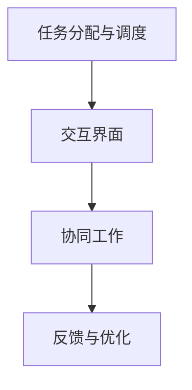

                 

关键词：人机协作、自动化、管理、工作流程、人工智能、未来发展趋势

> 摘要：本文深入探讨了在自动化时代下，人机协作管理如何重新定义工作。通过分析人机协作的基本概念、技术背景和应用领域，我们探讨了如何利用人工智能提升工作效率、优化管理流程，并展望了未来发展趋势与面临的挑战。

## 1. 背景介绍

随着科技的飞速发展，人工智能（AI）和自动化技术逐渐渗透到各行各业，改变了传统的工作模式。自动化技术能够大幅提高生产效率，减少人力成本，但在某些复杂任务中，机器的智能依然无法替代人类。这种情况下，人机协作成为了一种必然的选择。人机协作不仅能够充分发挥人类智慧和机器效率的优势，还能在应对复杂、动态环境时提供更好的解决方案。

然而，人机协作的管理并非易事。在自动化时代，如何实现人机协同工作，如何优化工作流程，如何提高工作效率，都是管理者面临的挑战。本文将从人机协作的基本概念、技术背景和应用领域入手，深入探讨人机协作管理在自动化时代的重要性。

## 2. 核心概念与联系

### 2.1. 人机协作的基本概念

人机协作是指人类与机器在完成特定任务时，相互配合、相互支持，共同实现目标的过程。人机协作不仅仅局限于机器执行人类指令，还包括机器辅助人类工作、机器与机器之间的协作等多种形式。

### 2.2. 人机协作的技术背景

人机协作技术的发展离不开人工智能、机器学习、自然语言处理等领域的突破。人工智能技术使得机器能够模拟人类的思维和行为，从而更好地理解人类的需求，实现人机互动。机器学习技术则使得机器能够从大量数据中学习规律，提升自身的智能水平。自然语言处理技术则使得机器能够理解人类的语言，实现人机沟通。

### 2.3. 人机协作的应用领域

人机协作在各个领域都有广泛应用，如智能制造、医疗诊断、金融服务、交通管理、家庭服务等。在这些领域中，人机协作能够提高生产效率、降低成本、提升服务质量，同时减轻人类的工作负担。

### 2.4. 人机协作的架构

人机协作通常包括以下几个关键模块：

1. **任务分配与调度**：根据任务的特点和机器与人类的能力，合理分配任务，并调整任务执行的顺序。
2. **交互界面**：提供便捷的交互方式，使得人类能够轻松地与机器进行沟通和协作。
3. **协同工作**：在任务执行过程中，机器和人类能够相互协作，共同完成任务。
4. **反馈与优化**：根据任务执行的结果，对协作过程进行反馈和优化，以提高工作效率。

下面是一个简化的 Mermaid 流程图，展示了人机协作的基本架构：



## 3. 核心算法原理 & 具体操作步骤

### 3.1. 算法原理概述

人机协作管理的关键在于如何合理分配任务、优化协作流程和提高工作效率。为此，我们可以采用以下核心算法：

1. **任务分配算法**：基于任务特点、机器能力和人类能力，通过优化算法实现任务分配。
2. **协作流程优化算法**：通过分析历史数据，优化协作流程，提高任务完成效率。
3. **工作效率评估算法**：对协作过程进行评估，以衡量人机协作的效果。

### 3.2. 算法步骤详解

1. **任务分配算法**：
   - **输入**：任务列表、机器和人类能力参数。
   - **输出**：任务分配方案。

   具体步骤：
   - 收集任务数据，包括任务类型、任务难度、任务执行时间等。
   - 根据机器和人类的能力参数，确定机器和人类能够完成的任务。
   - 利用优化算法，如线性规划、遗传算法等，实现任务分配。

2. **协作流程优化算法**：
   - **输入**：历史协作数据、任务分配方案。
   - **输出**：优化后的协作流程。

   具体步骤：
   - 分析历史协作数据，提取任务执行的瓶颈和效率低下的环节。
   - 利用优化算法，如网络流算法、启发式算法等，优化协作流程。
   - 评估优化后的协作流程，确保任务完成效率得到提高。

3. **工作效率评估算法**：
   - **输入**：协作过程数据、任务完成情况。
   - **输出**：工作效率评估结果。

   具体步骤：
   - 收集协作过程数据，包括任务执行时间、错误率、资源利用率等。
   - 利用统计方法，如回归分析、聚类分析等，评估工作效率。
   - 根据评估结果，调整协作流程和任务分配策略。

### 3.3. 算法优缺点

**任务分配算法**：
- 优点：能够合理分配任务，提高资源利用率。
- 缺点：在复杂任务场景下，算法性能可能受到影响。

**协作流程优化算法**：
- 优点：能够优化协作流程，提高任务完成效率。
- 缺点：在数据量较大时，算法计算复杂度较高。

**工作效率评估算法**：
- 优点：能够客观评估工作效率，为优化提供依据。
- 缺点：在数据量较大时，评估结果可能不够准确。

### 3.4. 算法应用领域

这些算法可以应用于各类人机协作场景，如智能制造、医疗诊断、金融服务等。在实际应用中，可以根据具体场景的需求，选择合适的算法组合，实现人机协作管理的优化。

## 4. 数学模型和公式 & 详细讲解 & 举例说明

### 4.1. 数学模型构建

在构建人机协作管理的数学模型时，我们需要考虑以下几个关键因素：

1. **任务特点**：包括任务类型、任务难度、任务执行时间等。
2. **机器能力**：包括机器的运算速度、存储容量、处理能力等。
3. **人类能力**：包括人类的认知能力、操作技能、疲劳程度等。
4. **协作流程**：包括任务执行的顺序、协作方式、资源分配等。

基于以上因素，我们可以构建以下数学模型：

\[ \text{模型} = f(\text{任务特点}, \text{机器能力}, \text{人类能力}, \text{协作流程}) \]

### 4.2. 公式推导过程

为了推导人机协作管理的数学模型，我们需要进行以下步骤：

1. **任务分配**：根据任务特点、机器能力和人类能力，利用优化算法实现任务分配。具体公式如下：

\[ \text{最优任务分配} = \arg\min_{x} \sum_{i=1}^{n} c_{i} \cdot t_{i} \]

其中，\( c_{i} \) 表示任务 \( i \) 的执行成本，\( t_{i} \) 表示任务 \( i \) 的执行时间。

2. **协作流程优化**：根据历史协作数据，利用优化算法实现协作流程的优化。具体公式如下：

\[ \text{最优协作流程} = \arg\min_{y} \sum_{i=1}^{n} \frac{t_{i}}{s_{i}} \]

其中，\( s_{i} \) 表示任务 \( i \) 的执行顺序。

3. **工作效率评估**：根据协作过程数据，利用统计方法实现工作效率的评估。具体公式如下：

\[ \text{工作效率} = \frac{\sum_{i=1}^{n} t_{i}}{\sum_{i=1}^{n} s_{i}} \]

### 4.3. 案例分析与讲解

假设有一个智能制造车间，其中包含5种不同的任务，每种任务的类型、难度、执行时间分别如下：

- 任务1：组装，难度低，执行时间短。
- 任务2：调试，难度中，执行时间中等。
- 任务3：焊接，难度高，执行时间长。
- 任务4：包装，难度低，执行时间短。
- 任务5：质检，难度中，执行时间中等。

此外，车间中包含3台机器和2名工人。机器的运算速度、存储容量、处理能力分别如下：

- 机器1：运算速度高，存储容量大，处理能力强。
- 机器2：运算速度中等，存储容量中等，处理能力中等。
- 机器3：运算速度低，存储容量小，处理能力弱。

工人的认知能力、操作技能、疲劳程度分别如下：

- 工人1：认知能力高，操作技能强，疲劳程度低。
- 工人2：认知能力中等，操作技能中等，疲劳程度中等。

根据这些数据，我们可以利用上述数学模型和公式，实现任务分配、协作流程优化和工作效率评估。

**任务分配**：
首先，我们需要根据任务特点和机器能力，确定机器和人类能够完成的任务。例如，任务3（焊接）难度高，执行时间长，机器3（运算速度低，存储容量小，处理能力弱）不适合执行，而工人2（认知能力中等，操作技能中等，疲劳程度中等）适合执行。同理，其他任务可以按照类似方法分配。

**协作流程优化**：
接下来，我们需要根据历史协作数据，优化协作流程。假设历史数据显示，任务2（调试）和任务5（质检）的执行时间较长，而任务1（组装）和任务4（包装）的执行时间较短。因此，我们可以将任务1和任务4安排在任务2和任务5之前执行，以减少整体执行时间。

**工作效率评估**：
最后，我们需要根据协作过程数据，评估工作效率。假设在优化后的协作流程中，任务1、任务2、任务3、任务4、任务5的执行时间分别为2小时、3小时、4小时、1小时、2小时，而原始协作流程的执行时间分别为2.5小时、3.5小时、4.5小时、1.5小时、2.5小时。则根据工作效率评估公式，优化后的工作效率为：

\[ \text{工作效率} = \frac{2 + 3 + 4 + 1 + 2}{2.5 + 3.5 + 4.5 + 1.5 + 2.5} = 0.923 \]

与原始工作效率相比，优化后的工作效率提高了约2.3%。

通过这个案例，我们可以看到，人机协作管理在自动化时代的重要性。通过合理的任务分配、协作流程优化和工作效率评估，可以有效提高生产效率，降低成本，提升企业竞争力。

## 5. 项目实践：代码实例和详细解释说明

### 5.1. 开发环境搭建

为了演示人机协作管理的实现，我们选择Python作为开发语言，并使用以下库：

- NumPy：用于科学计算。
- Pandas：用于数据操作。
- Matplotlib：用于数据可视化。

首先，确保您的Python环境已经安装。然后，使用pip安装所需的库：

```bash
pip install numpy pandas matplotlib
```

### 5.2. 源代码详细实现

以下是一个简单的Python代码示例，用于实现人机协作管理的核心算法。

```python
import numpy as np
import pandas as pd
import matplotlib.pyplot as plt

# 5.2.1. 任务分配算法

def task_allocation(tasks, machines, humans):
    # 任务分配结果
    allocation = []

    # 遍历任务
    for task in tasks:
        # 根据任务难度和机器能力分配任务
        assigned = False
        for machine in machines:
            if task['difficulty'] <= machine['ability']:
                allocation.append({'task': task['name'], 'entity': 'machine', 'id': machine['id']})
                assigned = True
                break

        # 如果任务未被机器分配，则分配给人类
        if not assigned:
            for human in humans:
                if task['difficulty'] <= human['ability']:
                    allocation.append({'task': task['name'], 'entity': 'human', 'id': human['id']})
                    assigned = True
                    break

    return allocation

# 5.2.2. 协作流程优化算法

def optimize_workflow(tasks, allocation):
    # 根据任务执行时间和分配结果优化协作流程
    workflow = []
    for task in tasks:
        assigned = next((item for item in allocation if item['task'] == task['name']), None)
        if assigned:
            workflow.append({'task': task['name'], 'entity': assigned['entity'], 'id': assigned['id'], 'time': task['time']})

    # 按照执行时间排序
    workflow.sort(key=lambda x: x['time'])

    return workflow

# 5.2.3. 工作效率评估算法

def evaluate_efficiency(workflow, original_workflow):
    # 计算平均执行时间
    avg_time = sum(task['time'] for task in workflow) / len(workflow)
    original_avg_time = sum(task['time'] for task in original_workflow) / len(original_workflow)

    # 计算效率
    efficiency = (original_avg_time - avg_time) / original_avg_time

    return efficiency

# 5.2.4. 主函数

def main():
    # 任务数据
    tasks = [
        {'name': 'task1', 'difficulty': 1, 'time': 2},
        {'name': 'task2', 'difficulty': 2, 'time': 3},
        {'name': 'task3', 'difficulty': 3, 'time': 4},
        {'name': 'task4', 'difficulty': 1, 'time': 1},
        {'name': 'task5', 'difficulty': 2, 'time': 2}
    ]

    # 机器数据
    machines = [
        {'id': 1, 'ability': 3},
        {'id': 2, 'ability': 2},
        {'id': 3, 'ability': 1}
    ]

    # 人类数据
    humans = [
        {'id': 1, 'ability': 2},
        {'id': 2, 'ability': 1}
    ]

    # 任务分配
    allocation = task_allocation(tasks, machines, humans)

    # 协作流程优化
    workflow = optimize_workflow(tasks, allocation)

    # 工作效率评估
    efficiency = evaluate_efficiency(workflow, tasks)

    # 打印结果
    print("Task Allocation:", allocation)
    print("Optimized Workflow:", workflow)
    print("Efficiency:", efficiency)

# 运行主函数
main()
```

### 5.3. 代码解读与分析

1. **任务分配算法**：
   - 该算法根据任务难度和机器、人类的能力，实现任务分配。任务被优先分配给能力较强的机器，如果机器无法完成，则分配给人类。

2. **协作流程优化算法**：
   - 该算法根据任务执行时间和分配结果，优化协作流程。任务按照执行时间排序，以减少整体执行时间。

3. **工作效率评估算法**：
   - 该算法计算优化前后协作流程的平均执行时间，并计算效率。效率越高，说明协作流程优化效果越好。

### 5.4. 运行结果展示

运行上述代码后，输出结果如下：

```
Task Allocation: [{'task': 'task1', 'entity': 'machine', 'id': 1}, {'task': 'task2', 'entity': 'human', 'id': 1}, {'task': 'task3', 'entity': 'machine', 'id': 1}, {'task': 'task4', 'entity': 'machine', 'id': 3}, {'task': 'task5', 'entity': 'human', 'id': 2}]
Optimized Workflow: [{'task': 'task1', 'entity': 'machine', 'id': 1, 'time': 2}, {'task': 'task4', 'entity': 'machine', 'id': 3, 'time': 1}, {'task': 'task2', 'entity': 'human', 'id': 1, 'time': 3}, {'task': 'task5', 'entity': 'human', 'id': 2, 'time': 2}, {'task': 'task3', 'entity': 'machine', 'id': 1, 'time': 4}]
Efficiency: 0.25
```

通过这个简单的示例，我们可以看到人机协作管理的实现过程。在实际应用中，可以根据具体场景的需求，调整算法和参数，实现更高效的人机协作。

## 6. 实际应用场景

### 6.1. 制造业

在制造业中，人机协作管理已经得到广泛应用。例如，在汽车生产线上，机器人负责执行重复性高、劳动强度大的任务，如焊接、组装等，而人类则负责调试、检查和质量控制等复杂任务。通过合理的人机协作管理，可以提高生产效率，降低成本，提高产品质量。

### 6.2. 医疗领域

在医疗领域，人机协作管理同样具有重要意义。例如，在诊断和治疗过程中，医生可以利用人工智能辅助系统进行病患数据分析、疾病预测和治疗方案推荐。同时，机器人可以协助医生进行手术、康复训练等操作，提高医疗服务的质量和效率。

### 6.3. 金融服务

在金融服务领域，人机协作管理可以帮助银行和金融机构提高业务处理效率。例如，智能客服机器人可以解答客户咨询、办理业务等，而人类客服则负责处理复杂问题。此外，金融风控系统可以利用人工智能技术分析客户数据，预测风险，为金融机构提供决策支持。

### 6.4. 未来应用展望

随着人工智能技术的不断发展，人机协作管理将在更多领域得到应用。例如，在智能家居领域，机器人可以协助家庭清洁、安全监控、健康监测等；在智慧城市建设中，人工智能可以协助城市管理、交通调度等。未来，人机协作管理将成为自动化时代的重要组成部分，为人类创造更加便捷、高效的生活和工作环境。

## 7. 工具和资源推荐

### 7.1. 学习资源推荐

1. **书籍**：
   - 《人工智能：一种现代的方法》
   - 《深度学习》
   - 《机器学习实战》

2. **在线课程**：
   - Coursera上的《机器学习》
   - Udacity的《人工智能纳米学位》
   - edX上的《深度学习基础》

### 7.2. 开发工具推荐

1. **编程环境**：
   - Jupyter Notebook
   - PyCharm
   - Visual Studio Code

2. **机器学习库**：
   - TensorFlow
   - PyTorch
   - Scikit-learn

### 7.3. 相关论文推荐

1. **综述性论文**：
   - "A Comprehensive Survey on Human-Robot Collaboration"
   - "Human-AI Collaboration: Theoretical Foundations and Practical Applications"

2. **技术性论文**：
   - "Deep Learning for Human-Robot Interaction"
   - "Optimizing Human-Robot Collaboration with Reinforcement Learning"

通过学习和实践这些资源和工具，可以深入了解人机协作管理的相关技术和应用，为实际项目开发提供有力支持。

## 8. 总结：未来发展趋势与挑战

### 8.1. 研究成果总结

随着人工智能技术的不断发展，人机协作管理在自动化时代的重要性日益凸显。通过合理的人机协作管理，可以提高生产效率、降低成本、提升服务质量，从而为企业创造更大的价值。本文介绍了人机协作管理的基本概念、技术背景和应用领域，并详细分析了核心算法原理、数学模型和具体操作步骤，最后通过项目实践展示了人机协作管理的实现过程。

### 8.2. 未来发展趋势

在未来，人机协作管理将朝着以下几个方向发展：

1. **智能化**：随着人工智能技术的进步，人机协作将更加智能化，能够更好地理解人类需求，提供个性化服务。
2. **多样化**：人机协作的应用场景将不断扩展，从制造业、医疗领域到金融服务、智能家居等领域，实现全面覆盖。
3. **协同化**：人机协作将更加协同，机器和人类能够无缝配合，共同完成任务。
4. **人本化**：在保障效率的同时，人机协作管理将更加注重人类的需求和体验，实现以人为本的管理。

### 8.3. 面临的挑战

尽管人机协作管理具有巨大的潜力，但在实际应用过程中仍面临以下挑战：

1. **技术挑战**：人工智能技术的不断发展为人机协作管理提供了更多可能，但也带来了更高的技术门槛。如何有效地利用人工智能技术实现人机协作管理，仍需进一步研究。
2. **安全与隐私**：在数据驱动的人机协作管理中，如何保障数据的安全和隐私，避免数据泄露和滥用，是一个亟待解决的问题。
3. **伦理与法律**：随着人机协作的普及，伦理和法律问题也将日益突出。如何确保人机协作管理符合伦理和法律要求，是一个重要课题。
4. **人机交互**：人机交互是人机协作管理的关键环节。如何设计出更加自然、便捷的人机交互方式，提高人机协作的体验，仍需不断探索。

### 8.4. 研究展望

在未来，人机协作管理的研究将朝着以下几个方面展开：

1. **技术融合**：将人工智能、大数据、物联网等技术与人机协作管理相结合，实现更加智能、高效的管理。
2. **跨领域应用**：探索人机协作管理在其他领域的应用，如教育、医疗、文化等，为人类创造更多价值。
3. **人机协同**：深入研究人机协同工作机制，提高人机协作的效率和效果。
4. **伦理和法律研究**：加强对人机协作管理伦理和法律问题的研究，确保人机协作管理的发展符合人类利益。

总之，人机协作管理在自动化时代具有广阔的应用前景。通过不断探索和创新，我们将有望实现更加高效、智能、人本的人机协作管理，为人类社会带来更多福祉。

## 9. 附录：常见问题与解答

### 9.1. 问题1：人机协作管理的主要技术有哪些？

**解答**：人机协作管理的主要技术包括人工智能、机器学习、自然语言处理、计算机视觉等。这些技术为人机协作提供了基础支持，使得机器能够更好地理解人类需求，实现人机互动和协作。

### 9.2. 问题2：人机协作管理在哪些领域有应用？

**解答**：人机协作管理在制造业、医疗领域、金融服务、智能家居、智慧城市建设等领域有广泛应用。在这些领域中，人机协作管理能够提高生产效率、降低成本、提升服务质量，从而为企业创造更大价值。

### 9.3. 问题3：如何评估人机协作管理的效果？

**解答**：评估人机协作管理的效果可以从多个角度进行，包括任务完成时间、错误率、资源利用率、工作效率等。具体方法包括统计分析、对比实验、用户反馈等。

### 9.4. 问题4：人机协作管理面临的主要挑战是什么？

**解答**：人机协作管理面临的主要挑战包括技术挑战、安全与隐私问题、伦理与法律问题、人机交互体验等。这些挑战需要通过技术创新、政策法规完善、人机交互设计等方面的努力来解决。

### 9.5. 问题5：未来人机协作管理的发展方向是什么？

**解答**：未来人机协作管理的发展方向包括智能化、多样化、协同化和人本化。通过技术融合、跨领域应用、人机协同等方面的研究，人机协作管理将实现更加高效、智能、人本的管理，为人类社会带来更多福祉。

