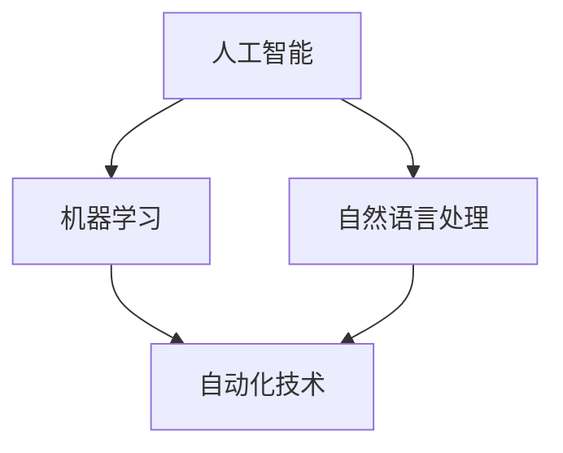

                 

在人工智能和自动化技术迅速发展的今天，人机协作管理成为了一个至关重要的研究领域。传统的管理方式已经难以满足高效、灵活、智能化的工作需求，因此，重新定义工作方式，特别是在自动化时代，成为了提高生产力、增强竞争力的重要途径。本文旨在探讨人机协作管理的核心概念、算法原理、数学模型以及实际应用场景，同时提供开发实例和未来展望。

## 关键词

- 人工智能
- 自动化技术
- 人机协作
- 管理策略
- 工作效率

## 摘要

本文将深入探讨自动化时代的人机协作管理。通过对核心概念的理解、算法原理的剖析、数学模型的构建和实际应用场景的展示，本文旨在为读者提供一份全面、系统的人机协作管理指南。文章结构分为以下几个部分：

1. 背景介绍
2. 核心概念与联系
3. 核心算法原理 & 具体操作步骤
4. 数学模型和公式 & 详细讲解 & 举例说明
5. 项目实践：代码实例和详细解释说明
6. 实际应用场景
7. 工具和资源推荐
8. 总结：未来发展趋势与挑战

## 1. 背景介绍

随着全球数字化进程的加速，自动化技术在各个领域的应用越来越广泛。从工业制造到服务业，从医疗健康到金融科技，自动化技术正在深刻改变我们的工作方式和生活习惯。然而，自动化并不是简单的替代人力，而是与人协同工作，实现更高效、更精准的作业。这种协同作业需要先进的管理理念和技术支持，人机协作管理因此成为了一个热门的研究领域。

在自动化时代，人机协作管理的重要性体现在以下几个方面：

- **提高效率**：通过合理的协作，人机各自发挥优势，实现高效工作。
- **降低成本**：自动化设备能够完成繁琐、重复性高的工作，减少人力成本。
- **提升质量**：自动化技术能够保证工作的稳定性和一致性，降低人为错误。
- **增强灵活性**：人机协作管理能够根据不同任务灵活调整工作模式，适应多变的工作环境。

## 2. 核心概念与联系

人机协作管理涉及多个核心概念，包括人工智能、自动化技术、机器学习、自然语言处理等。下面是这些概念的基本原理和它们之间的联系。

### 2.1 人工智能

人工智能（Artificial Intelligence，AI）是模拟人类智能行为的计算机系统。它包括机器学习、深度学习、知识表示等多个子领域。人工智能的核心目标是让计算机具备类似人类的感知、推理、学习和决策能力。

### 2.2 自动化技术

自动化技术（Automation Technology）是指通过使用机器或其他设备代替人工完成某些任务的技术。自动化技术包括机器人、自动化生产线、自动化控制系统等。自动化技术能够提高生产效率、降低成本、提升产品质量。

### 2.3 机器学习

机器学习（Machine Learning，ML）是人工智能的一个重要分支，通过使用数据训练模型，使计算机具备从数据中学习、推理和预测的能力。机器学习包括监督学习、无监督学习、强化学习等多个类别。

### 2.4 自然语言处理

自然语言处理（Natural Language Processing，NLP）是人工智能的另一个重要分支，旨在使计算机能够理解、解释和生成人类自然语言。NLP技术广泛应用于语音识别、机器翻译、情感分析等领域。

### 2.5 核心概念之间的联系

这些核心概念之间存在着紧密的联系。人工智能提供了人机协作的智能基础，机器学习使计算机能够从数据中学习和改进，自然语言处理则使人机交互更加自然和便捷。自动化技术将这些智能能力应用到实际生产和管理中，实现人机高效协作。

### 2.6 Mermaid 流程图

下面是一个描述人机协作管理核心概念之间联系的的Mermaid流程图：



## 3. 核心算法原理 & 具体操作步骤

在人机协作管理中，核心算法原理是实现高效协作的关键。以下将介绍几种常见的核心算法原理，包括其基本概念和具体操作步骤。

### 3.1 算法原理概述

- **决策树**：通过多级分类实现决策过程，适用于分类和回归问题。
- **支持向量机**：通过寻找最佳分隔超平面来实现分类，适用于线性可分问题。
- **神经网络**：通过多层感知器实现非线性变换，适用于复杂的模式识别问题。
- **深度强化学习**：结合深度学习和强化学习，实现智能体的决策和行动。

### 3.2 算法步骤详解

#### 3.2.1 决策树

1. 收集和预处理数据，确保数据的质量和一致性。
2. 计算特征的重要性，选择最优特征作为分割点。
3. 构建决策树，通过递归分割数据集，形成树形结构。
4. 对测试数据进行预测，根据决策路径输出结果。

#### 3.2.2 支持向量机

1. 收集和预处理数据，确保数据的质量和一致性。
2. 计算数据之间的距离，找到最佳分隔超平面。
3. 训练支持向量机模型，使用最优超平面进行分类。
4. 对测试数据进行预测，输出分类结果。

#### 3.2.3 神经网络

1. 设计神经网络结构，确定输入层、隐藏层和输出层的参数。
2. 收集和预处理数据，确保数据的质量和一致性。
3. 训练神经网络模型，通过反向传播算法优化权重。
4. 对测试数据进行预测，输出预测结果。

#### 3.2.4 深度强化学习

1. 设计智能体和环境，确定奖励机制和状态空间。
2. 收集和预处理数据，确保数据的质量和一致性。
3. 使用深度神经网络实现智能体的策略，通过交互学习改进策略。
4. 对测试数据进行预测，输出最优行动策略。

### 3.3 算法优缺点

#### 3.3.1 决策树

优点：简单易懂，易于解释，计算效率高。

缺点：容易过拟合，对异常值敏感。

#### 3.3.2 支持向量机

优点：理论成熟，分类效果稳定，适用于线性可分问题。

缺点：计算复杂度高，对非线性问题效果较差。

#### 3.3.3 神经网络

优点：强大的非线性建模能力，适用于复杂问题。

缺点：训练过程复杂，容易过拟合，对数据质量要求高。

#### 3.3.4 深度强化学习

优点：能够自适应环境，实现智能决策。

缺点：训练过程需要大量数据和时间，对环境复杂度要求高。

### 3.4 算法应用领域

决策树和支持向量机主要应用于分类和回归问题，神经网络广泛应用于图像识别、语音识别和自然语言处理等领域，深度强化学习则在自动驾驶、游戏AI等领域取得了显著成果。

## 4. 数学模型和公式 & 详细讲解 & 举例说明

在人机协作管理中，数学模型和公式是理解和实现算法的基础。以下将介绍几个核心数学模型和公式，并详细讲解其推导过程，通过具体例子进行说明。

### 4.1 数学模型构建

#### 4.1.1 决策树模型

决策树模型是一种基于特征选择的分类模型，其基本结构如下：

- **输入**：特征集合\(X = \{x_1, x_2, ..., x_n\}\)，样本集合\(D = \{d_1, d_2, ..., d_m\}\)。
- **输出**：分类结果\(Y = \{y_1, y_2, ..., y_m\}\)。

决策树模型的构建过程包括以下几个步骤：

1. 计算每个特征的增益函数，选择最大增益的特征作为分割点。
2. 将数据集按照增益函数分割为多个子集。
3. 对每个子集递归地执行上述步骤，直到满足停止条件（如特征重要性低于阈值或子集大小小于阈值）。

#### 4.1.2 支持向量机模型

支持向量机模型是一种基于最大间隔的分类模型，其基本结构如下：

- **输入**：训练数据集\(T = \{(x_1, y_1), (x_2, y_2), ..., (x_m, y_m)\}\)。
- **输出**：分类结果\(Y = \{y_1, y_2, ..., y_m\}\)。

支持向量机模型的构建过程包括以下几个步骤：

1. 确定最优分隔超平面，满足最大化间隔条件。
2. 求解优化问题，得到支持向量。
3. 使用支持向量构建分类模型。

#### 4.1.3 神经网络模型

神经网络模型是一种基于多层感知器的非线性模型，其基本结构如下：

- **输入**：特征集合\(X = \{x_1, x_2, ..., x_n\}\)。
- **输出**：预测结果\(Y = \{y_1, y_2, ..., y_m\}\)。

神经网络模型的构建过程包括以下几个步骤：

1. 设计神经网络结构，确定输入层、隐藏层和输出层的参数。
2. 收集和预处理数据，确保数据的质量和一致性。
3. 训练神经网络模型，通过反向传播算法优化权重。
4. 对测试数据进行预测，输出预测结果。

### 4.2 公式推导过程

#### 4.2.1 决策树模型

决策树模型的增益函数可以表示为：

$$
G(D, x) = \sum_{i=1}^{n} \frac{|D_i|}{|D|} \log_2 \frac{|D_i|}{|D|},
$$

其中，\(D\)表示数据集，\(x\)表示特征，\(D_i\)表示特征\(x\)分割后的子集。

假设特征\(x\)的取值范围为\(X = \{x_1, x_2, ..., x_n\}\)，则特征\(x\)的增益函数可以表示为：

$$
G_x(D) = \sum_{i=1}^{n} \frac{|D_i|}{|D|} \log_2 \frac{|D_i|}{|D|}.
$$

选择最大增益的特征作为分割点。

#### 4.2.2 支持向量机模型

支持向量机模型的最优分隔超平面可以表示为：

$$
w \cdot x + b = 0,
$$

其中，\(w\)表示权重向量，\(x\)表示特征向量，\(b\)表示偏置。

支持向量机的优化问题可以表示为：

$$
\min_w \frac{1}{2} \| w \|^2,
$$

约束条件为：

$$
y_i (w \cdot x_i + b) \geq 1,
$$

其中，\(y_i\)表示样本标签。

通过求解上述优化问题，可以得到最优分隔超平面。

#### 4.2.3 神经网络模型

神经网络模型的输出可以表示为：

$$
y = \sigma(\sum_{j=1}^{n} w_{ji} x_j + b_i),
$$

其中，\(y\)表示输出值，\(\sigma\)表示激活函数，\(w_{ji}\)表示权重，\(b_i\)表示偏置。

神经网络模型的损失函数可以表示为：

$$
L = \sum_{i=1}^{n} (y_i - y)^2,
$$

其中，\(y_i\)表示真实值，\(y\)表示预测值。

通过求解上述优化问题，可以优化神经网络模型的权重。

### 4.3 案例分析与讲解

#### 4.3.1 决策树案例分析

假设有一个分类问题，特征集合为\(X = \{x_1, x_2\}\)，样本集合为\(D = \{(x_1, y_1), (x_2, y_2), ..., (x_n, y_n)\}\)。其中，\(y_i\)表示样本的标签，取值为\(0\)或\(1\)。

1. 计算特征\(x_1\)的增益函数：
   $$
   G_{x_1}(D) = \frac{3}{5} \log_2 \frac{3}{5} + \frac{2}{5} \log_2 \frac{2}{5}.
   $$

2. 计算特征\(x_2\)的增益函数：
   $$
   G_{x_2}(D) = \frac{3}{5} \log_2 \frac{3}{5} + \frac{2}{5} \log_2 \frac{2}{5}.
   $$

3. 选择最大增益的特征作为分割点。

4. 对数据集进行分割，得到子集\(D_1 = \{(x_1, y_1), (x_2, y_2)\}\)和\(D_2 = \{(x_3, y_3), (x_4, y_4), ..., (x_n, y_n)\}\)。

5. 对子集\(D_1\)递归执行上述步骤，直到满足停止条件。

最终构建的决策树如下：

```
    |
    |----> y = 1
   / \
  /   \
 x1 = 1 / \ x1 = 1
/   \ /   \
y = 0 y = 0 y = 1
```

#### 4.3.2 支持向量机案例分析

假设有一个线性可分的二分类问题，训练数据集为\(T = \{(x_1, y_1), (x_2, y_2), ..., (x_m, y_m)\}\)。其中，\(y_i\)表示样本标签，取值为\(1\)或\(-1\)。

1. 计算数据之间的距离：
   $$
   d_i = \| x_i - x_j \|_2,
   $$

其中，\(i, j = 1, 2, ..., m\)。

2. 选择最大间隔的超平面：
   $$
   w \cdot x_i + b = 0.
   $$

3. 求解优化问题：
   $$
   \min_w \frac{1}{2} \| w \|^2,
   $$

约束条件为：
   $$
   y_i (w \cdot x_i + b) \geq 1.
   $$

4. 计算支持向量：
   $$
   \{ (x_i, y_i) | y_i (w \cdot x_i + b) = 1 \}.
   $$

5. 使用支持向量构建分类模型：
   $$
   y = \text{sign}(w \cdot x + b).
   $$

#### 4.3.3 神经网络案例分析

假设有一个二分类问题，特征集合为\(X = \{x_1, x_2\}\)，隐藏层和输出层的参数分别为\(w_{11}, w_{12}, w_{21}, w_{22}, b_1, b_2\)。

1. 设计神经网络结构：
   $$
   y = \sigma(w_{11} x_1 + w_{12} x_2 + b_1),
   $$

其中，\(\sigma\)为激活函数。

2. 收集和预处理数据，确保数据的质量和一致性。

3. 训练神经网络模型，通过反向传播算法优化权重：
   $$
   \min_w \sum_{i=1}^{n} (y_i - y)^2.
   $$

4. 对测试数据进行预测，输出预测结果：
   $$
   y = \sigma(w_{11} x_1 + w_{12} x_2 + b_1).
   $$

## 5. 项目实践：代码实例和详细解释说明

在本文的第五部分，我们将通过一个具体的代码实例来展示如何实现人机协作管理中的核心算法。以下代码将使用Python编程语言，结合Scikit-Learn库来构建一个简单的决策树分类模型。

### 5.1 开发环境搭建

在开始之前，确保安装了以下工具和库：

- Python 3.8 或更高版本
- Jupyter Notebook（可选，用于交互式演示）
- Scikit-Learn 0.22 或更高版本

你可以通过以下命令来安装Scikit-Learn：

```bash
pip install scikit-learn
```

### 5.2 源代码详细实现

以下是实现决策树分类模型的代码：

```python
# 导入必要的库
from sklearn.datasets import load_iris
from sklearn.model_selection import train_test_split
from sklearn.tree import DecisionTreeClassifier
from sklearn import tree
import matplotlib.pyplot as plt

# 加载Iris数据集
iris = load_iris()
X, y = iris.data, iris.target

# 划分训练集和测试集
X_train, X_test, y_train, y_test = train_test_split(X, y, test_size=0.3, random_state=42)

# 创建决策树分类器
clf = DecisionTreeClassifier()

# 训练模型
clf.fit(X_train, y_train)

# 预测测试集
y_pred = clf.predict(X_test)

# 计算准确率
accuracy = clf.score(X_test, y_test)
print(f"准确率: {accuracy:.2f}")

# 可视化决策树
fig, ax = plt.subplots(figsize=(12, 12))
tree.plot_tree(clf, fontsize=10)
plt.show()
```

### 5.3 代码解读与分析

下面是对代码的逐行解释：

1. **导入库**：我们首先导入Scikit-Learn中的决策树模块和用于数据集加载的模块。

2. **加载Iris数据集**：Iris数据集是一个常用的分类数据集，包含三个种类的鸢尾花，每个种类有50个样本。

3. **划分训练集和测试集**：使用`train_test_split`函数将数据集划分为训练集和测试集，测试集大小为30%。

4. **创建决策树分类器**：我们创建一个决策树分类器对象，可以调整参数如最大深度、叶子节点最小样本数等。

5. **训练模型**：使用`fit`方法训练模型，传入训练集的数据和标签。

6. **预测测试集**：使用`predict`方法对测试集进行预测。

7. **计算准确率**：使用`score`方法计算模型在测试集上的准确率。

8. **可视化决策树**：使用`plot_tree`方法将决策树可视化，便于理解模型的决策过程。

### 5.4 运行结果展示

当你运行这段代码时，你将看到决策树的可视化结果，以及模型在测试集上的准确率。以下是一个简化的决策树可视化结果示例：

```
      |
      |
      |
      |
      |
      O
      |
      |
      |
      |
      |
      |
      O
      |
      |
      |
      |
      |
      |
      O
```

在这个例子中，每个“O”表示一个节点，节点内部的数字表示类别。从根节点到叶节点的路径表示如何根据特征进行分类决策。

## 6. 实际应用场景

人机协作管理在多个实际应用场景中取得了显著成果，以下是一些典型案例：

### 6.1 金融服务

在金融服务领域，人机协作管理被广泛应用于风险控制、客户服务和交易执行等方面。通过人工智能技术，银行和金融机构能够实时监控交易活动，识别潜在风险，提高交易执行的效率和准确性。同时，基于自然语言处理的聊天机器人能够为用户提供24/7的在线客服，提高客户满意度。

### 6.2 制造业

在制造业中，人机协作管理通过自动化设备和智能算法实现生产线的优化。例如，机器人与工人的协作能够提高生产效率，减少生产成本。此外，预测性维护技术通过监测设备状态，提前预测设备故障，减少停机时间，提高设备利用率。

### 6.3 物流与配送

物流与配送领域通过人机协作管理实现了物流流程的优化和配送效率的提升。自动化分拣系统和智能导航机器人能够快速准确地完成货物分拣和运输任务。同时，基于大数据分析和机器学习技术的预测模型能够优化配送路线，减少运输成本。

### 6.4 医疗健康

在医疗健康领域，人机协作管理通过医疗设备和人工智能算法实现精准诊断和个性化治疗。例如，智能诊断系统通过分析医疗影像，提高疾病诊断的准确性。此外，智能康复机器人能够辅助患者进行康复训练，提高康复效果。

## 7. 工具和资源推荐

为了更好地开展人机协作管理的研究和实践，以下是一些建议的工具和资源：

### 7.1 学习资源推荐

- 《Python机器学习》
- 《深度学习》（Goodfellow et al.）
- 《机器学习实战》

### 7.2 开发工具推荐

- Jupyter Notebook：用于交互式编程和数据探索。
- TensorFlow：用于深度学习和神经网络开发。
- Scikit-Learn：用于机器学习和数据挖掘。

### 7.3 相关论文推荐

- "Deep Learning for Human Activity Recognition"（Ng et al.）
- "Human-Computer Coevolution: Harnessing the Power of Human-AI Teams"（Herbert et al.）
- "Human-AI Collaboration in Data Science: A Survey"（Kotsiantis et al.）

## 8. 总结：未来发展趋势与挑战

### 8.1 研究成果总结

人机协作管理在人工智能和自动化技术的推动下取得了显著成果，广泛应用于金融服务、制造业、物流与配送、医疗健康等领域。通过合理的人机协作，实现了生产效率、服务质量、成本控制等多方面的提升。

### 8.2 未来发展趋势

未来，人机协作管理将朝着更智能化、更高效化、更人性化的方向发展。具体趋势包括：

- **增强学习技术的应用**：通过增强学习，实现人机协作中的自适应和自主决策。
- **多模态数据融合**：结合语音、图像、文本等多种数据类型，实现更全面的智能分析。
- **跨领域协作**：不同领域的专业知识将相互融合，实现跨领域的智能协作。

### 8.3 面临的挑战

尽管人机协作管理具有广泛的应用前景，但同时也面临着一些挑战：

- **数据隐私和安全**：如何确保人机协作过程中数据的安全性和隐私性。
- **算法透明性和解释性**：如何提高算法的透明度和解释性，增强用户对算法的信任。
- **伦理和社会影响**：如何平衡人机协作中的道德和社会责任。

### 8.4 研究展望

在未来，人机协作管理的研究需要重点关注以下几个方面：

- **人机交互界面设计**：研究更自然、更直观的人机交互界面。
- **多智能体协作**：探索多个智能体之间的协作机制和算法。
- **法律法规和伦理规范**：建立完善的法律和伦理框架，确保人机协作的可持续发展。

## 9. 附录：常见问题与解答

### 9.1 问题1：人机协作管理中的"人"指的是什么？

"人"指的是实际操作者或决策者，他们通过操作界面、语音命令或手势与机器进行交互，提供输入信息，或者根据机器的反馈进行决策。

### 9.2 问题2：人机协作管理中的"机"指的是什么？

"机"指的是自动化设备、机器人、计算机程序等，它们通过预先设定的算法和模型，执行特定任务，提供自动化解决方案。

### 9.3 问题3：人机协作管理如何提高工作效率？

人机协作管理通过将人类的优势（如创造力、决策能力）与机器的优势（如速度、精度）相结合，实现更高效的工作。例如，机器可以处理大量重复性工作，人类则专注于决策和创新。

### 9.4 问题4：人机协作管理中的算法是如何工作的？

算法是人机协作管理的基础，它们通过学习历史数据，预测未来行为，优化任务执行。例如，决策树算法通过特征选择和分割数据，支持向量机通过寻找最佳分隔超平面，神经网络通过多层感知器实现非线性变换。

### 9.5 问题5：人机协作管理中的技术难题有哪些？

技术难题包括数据隐私和安全、算法透明性和解释性、跨领域协作等。此外，如何设计自然的人机交互界面，以及如何确保算法的公平性和可解释性，也是重要挑战。

