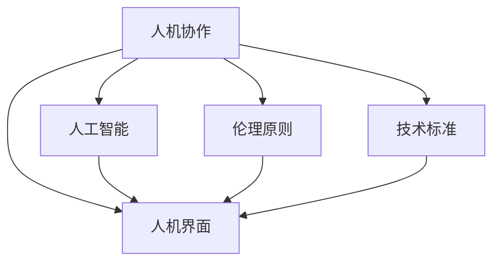

                 

关键词：人机协作、伦理规范、人工智能、人机界面、技术标准

> 摘要：本文旨在探讨人机协作的伦理规范与准则，分析其重要性、理论基础和实践方法。随着人工智能技术的发展，人机协作正日益成为我们日常生活和工作中不可或缺的一部分。文章将围绕人机协作的核心概念、伦理原则、设计实践以及未来展望展开讨论，为构建和谐、高效的人机协作环境提供指导。

## 1. 背景介绍

人机协作是指人类与机器在共同完成任务的过程中相互配合和互动的方式。随着人工智能技术的迅速发展，人机协作的重要性日益凸显。从工业生产到医疗服务，从交通运输到智能家居，人工智能的应用已经深刻改变了我们的生活方式和工作模式。

在人工智能时代，人机协作不仅是一个技术问题，更是一个伦理问题。随着机器智能的不断提升，人工智能系统在决策、控制、执行等方面的作用越来越大，但同时也引发了一系列伦理问题，如隐私保护、数据安全、责任归属等。因此，制定一套伦理规范与准则对于保障人机协作的健康发展具有重要意义。

### 1.1 人工智能的发展

人工智能（AI）作为一门综合了计算机科学、数学、统计学、认知科学等多个领域的交叉学科，近年来取得了飞速的发展。深度学习、自然语言处理、计算机视觉等技术的突破，使得人工智能在图像识别、语音识别、智能对话、自动驾驶等领域取得了显著成果。这些技术的应用不仅提高了生产效率，改善了生活质量，同时也带来了新的伦理挑战。

### 1.2 人机协作的重要性

人机协作不仅提高了工作效率，还激发了人类的创造力和创新能力。在许多领域，人工智能作为人类辅助工具，能够解决复杂的问题，处理大量的数据，甚至在某些方面超越人类的表现。例如，在医疗诊断中，人工智能可以通过分析大量的病例数据，提供更准确的诊断结果；在金融分析中，人工智能可以实时监控市场动态，帮助投资者做出更明智的决策。

### 1.3 伦理问题的挑战

随着人工智能技术的普及，人机协作带来的伦理问题也日益突出。这些问题不仅涉及个人隐私和数据安全，还关系到社会公平、责任归属和人类尊严。因此，制定一套伦理规范与准则，以引导和规范人机协作的发展，显得尤为必要。

## 2. 核心概念与联系

在探讨人机协作的伦理规范与准则之前，我们需要明确一些核心概念，并理解它们之间的相互关系。以下是一个用Mermaid绘制的流程图，展示了这些核心概念及其之间的联系。



### 2.1 人工智能

人工智能是指模拟、延伸和扩展人类智能的理论、方法、技术及应用。它包括机器学习、深度学习、自然语言处理、计算机视觉等多个子领域。人工智能的核心目标是让计算机具备类似于人类的感知、理解、学习和决策能力。

### 2.2 伦理原则

伦理原则是指指导我们行为的道德准则。在人机协作中，伦理原则涉及到隐私、数据安全、责任归属、公平性等多个方面。伦理原则的制定旨在保障人机协作的健康发展，维护人类的基本权利和尊严。

### 2.3 人机界面

人机界面（Human-Computer Interface，简称HCI）是指人类与计算机系统之间的交互界面。良好的用户界面设计能够提高人机协作的效率，降低用户的认知负担。人机界面涉及视觉、听觉、触觉等多个感官，其设计原则包括易用性、直观性、灵活性等。

### 2.4 技术标准

技术标准是指为保障人机协作的稳定性和可靠性而制定的一系列规范。技术标准涵盖了硬件、软件、通信协议等多个方面。遵循技术标准能够提高系统的互操作性，降低技术风险，保障人机协作的顺利进行。

## 3. 核心算法原理 & 具体操作步骤

在人机协作中，核心算法的原理和具体操作步骤起着至关重要的作用。以下将详细介绍核心算法的原理、步骤及其优缺点和应用领域。

### 3.1 算法原理概述

人机协作的核心算法主要包括决策支持算法、人机交互算法和协作优化算法等。决策支持算法旨在辅助人类做出更好的决策，如风险分析、预测建模等。人机交互算法关注如何设计更直观、更高效的人机交互界面，提高用户体验。协作优化算法则致力于提高人机协作的效率，如任务分配、资源调度等。

### 3.2 算法步骤详解

1. **决策支持算法**：

   决策支持算法的基本步骤如下：

   - **数据收集**：收集相关的历史数据、实时数据等。
   - **数据预处理**：对收集到的数据进行清洗、归一化等处理。
   - **模型训练**：利用收集到的数据训练决策模型。
   - **模型评估**：对训练好的模型进行评估，选择最优模型。
   - **决策生成**：利用最优模型生成决策建议。

2. **人机交互算法**：

   人机交互算法的基本步骤如下：

   - **用户行为分析**：通过传感器、日志等手段收集用户行为数据。
   - **行为模式识别**：利用机器学习等技术对用户行为进行分析，识别用户的行为模式。
   - **交互界面设计**：根据用户的行为模式，设计更符合用户需求的交互界面。
   - **交互效果评估**：通过用户满意度、操作错误率等指标评估交互界面的效果，不断优化设计。

3. **协作优化算法**：

   协作优化算法的基本步骤如下：

   - **任务分解**：将复杂的任务分解为多个子任务。
   - **资源分配**：根据任务的优先级和资源可用性，合理分配资源。
   - **任务调度**：对子任务进行调度，确保任务能够在限定时间内完成。
   - **协作效果评估**：通过任务完成率、资源利用率等指标评估协作效果，不断优化调度策略。

### 3.3 算法优缺点

1. **决策支持算法**：

   - 优点：能够辅助人类做出更科学的决策，提高决策的效率和准确性。
   - 缺点：对数据质量和模型选择有较高要求，且可能受到数据偏差和模型过拟合的影响。

2. **人机交互算法**：

   - 优点：提高用户体验，降低用户操作难度，提升人机协作的效率。
   - 缺点：对用户行为数据的收集和处理有较高要求，且可能存在隐私和安全问题。

3. **协作优化算法**：

   - 优点：提高人机协作的效率，降低资源浪费，提升任务完成率。
   - 缺点：对算法设计和实现有较高要求，且可能受到任务复杂度和资源可用性的影响。

### 3.4 算法应用领域

1. **决策支持算法**：

   决策支持算法广泛应用于金融、医疗、交通等领域，如风险分析、疾病预测、交通流量预测等。

2. **人机交互算法**：

   人机交互算法广泛应用于智能家居、智能客服、虚拟现实等领域，如智能语音助手、智能客服机器人、虚拟现实互动等。

3. **协作优化算法**：

   协作优化算法广泛应用于工业制造、物流配送、智能交通等领域，如生产调度、物流优化、交通流量控制等。

## 4. 数学模型和公式 & 详细讲解 & 举例说明

在人机协作中，数学模型和公式扮演着重要的角色。以下将详细讲解数学模型的构建、公式的推导过程以及实际案例的分析。

### 4.1 数学模型构建

在人机协作中，常见的数学模型包括线性规划模型、决策树模型、神经网络模型等。以下以线性规划模型为例，介绍数学模型的构建方法。

#### 线性规划模型

线性规划模型的基本形式如下：

$$
\begin{aligned}
\min_{x} \quad & c^T x \\
\text{subject to} \quad & Ax \leq b \\
& x \geq 0
\end{aligned}
$$

其中，$c$ 是目标函数系数，$x$ 是决策变量，$A$ 是约束矩阵，$b$ 是约束常数。

#### 决策树模型

决策树模型是一种常用的分类和回归模型。其基本形式如下：

$$
\begin{aligned}
Y &= g(x) \\
g(x) &= \prod_{i=1}^{n} g_i(x_i) \\
g_i(x_i) &= 
\begin{cases}
1 & \text{if } x_i \geq \theta_i \\
0 & \text{if } x_i < \theta_i
\end{cases}
\end{aligned}
$$

其中，$Y$ 是目标变量，$g(x)$ 是决策树模型，$x_i$ 是输入特征，$\theta_i$ 是阈值。

#### 神经网络模型

神经网络模型是一种模拟人脑神经元连接的网络结构。其基本形式如下：

$$
\begin{aligned}
Y &= \sigma(\sum_{i=1}^{n} w_i \cdot x_i + b) \\
\sigma(z) &= \frac{1}{1 + e^{-z}}
\end{aligned}
$$

其中，$Y$ 是输出变量，$w_i$ 是权重，$x_i$ 是输入特征，$b$ 是偏置，$\sigma$ 是激活函数。

### 4.2 公式推导过程

以下以线性规划模型的推导为例，介绍公式的推导过程。

#### 目标函数推导

目标函数的推导基于最小二乘法。假设数据集为 $\{(x_1, y_1), (x_2, y_2), ..., (x_n, y_n)\}$，则线性回归模型可以表示为：

$$
y = \beta_0 + \beta_1 x
$$

其中，$\beta_0$ 和 $\beta_1$ 是模型参数。

为了最小化预测误差，我们可以建立以下目标函数：

$$
\min_{\beta_0, \beta_1} \sum_{i=1}^{n} (y_i - (\beta_0 + \beta_1 x_i))^2
$$

对目标函数求偏导数并令其为零，可以得到：

$$
\begin{aligned}
\frac{\partial}{\partial \beta_0} \sum_{i=1}^{n} (y_i - (\beta_0 + \beta_1 x_i))^2 &= -2 \sum_{i=1}^{n} (y_i - (\beta_0 + \beta_1 x_i)) \\
\frac{\partial}{\partial \beta_1} \sum_{i=1}^{n} (y_i - (\beta_0 + \beta_1 x_i))^2 &= -2 \sum_{i=1}^{n} (y_i - (\beta_0 + \beta_1 x_i)) x_i
\end{aligned}
$$

解上述方程组，可以得到线性回归模型的参数 $\beta_0$ 和 $\beta_1$。

#### 约束条件推导

线性规划模型的约束条件通常基于线性不等式。假设数据集为 $\{(x_1, y_1), (x_2, y_2), ..., (x_n, y_n)\}$，则线性规划模型的约束条件可以表示为：

$$
\begin{aligned}
Ax \leq b \\
x \geq 0
\end{aligned}
$$

其中，$A$ 是约束矩阵，$b$ 是约束常数，$x$ 是决策变量。

为了求解约束条件，我们可以采用拉格朗日乘子法。假设拉格朗日函数为：

$$
L(x, \lambda) = c^T x + \lambda^T (Ax - b)
$$

其中，$c$ 是目标函数系数，$\lambda$ 是拉格朗日乘子。

对拉格朗日函数求偏导数并令其为零，可以得到：

$$
\begin{aligned}
\frac{\partial}{\partial x} L(x, \lambda) &= c + \lambda^T A = 0 \\
\frac{\partial}{\partial \lambda} L(x, \lambda) &= Ax - b = 0
\end{aligned}
$$

解上述方程组，可以得到约束条件下的最优解 $x$ 和拉格朗日乘子 $\lambda$。

### 4.3 案例分析与讲解

以下以线性规划模型的应用为例，介绍数学模型和公式的实际应用。

#### 案例背景

某公司计划生产两种产品A和B，每种产品都需要经过两个工序。公司有两个车间，每个车间每月的可用工时分别为100小时和80小时。产品A的每个产品需要2小时和1小时，产品B的每个产品需要1小时和2小时。公司希望每个月能够生产尽可能多的产品，同时满足各车间每月的工时限制。

#### 模型构建

根据案例背景，我们可以建立以下线性规划模型：

$$
\begin{aligned}
\min_{x, y} \quad & 2x + y \\
\text{subject to} \quad & 2x + y \leq 100 \\
& x + 2y \leq 80 \\
& x, y \geq 0
\end{aligned}
$$

其中，$x$ 表示产品A的生产数量，$y$ 表示产品B的生产数量。

#### 公式推导

根据线性规划模型的公式推导，我们可以得到以下方程组：

$$
\begin{aligned}
\frac{\partial}{\partial x} (2x + y) &= 2 \\
\frac{\partial}{\partial y} (2x + y) &= 1
\end{aligned}
$$

解上述方程组，可以得到最优解 $x = 20$，$y = 40$。

#### 案例结果

根据最优解，该公司应每月生产20个产品A和40个产品B，这样能够在满足各车间工时限制的前提下，实现最大化的生产数量。

## 5. 项目实践：代码实例和详细解释说明

为了更好地理解人机协作的伦理规范与准则，我们以一个实际项目为例，展示如何进行人机协作的开发过程，并提供详细的代码实例和解释说明。

### 5.1 开发环境搭建

首先，我们需要搭建一个合适的开发环境。以下是一个简单的Python开发环境搭建步骤：

1. 安装Python：从官方网站（[https://www.python.org/](https://www.python.org/)）下载并安装Python。
2. 安装依赖库：使用pip命令安装必要的依赖库，如NumPy、Pandas、Scikit-learn等。

```bash
pip install numpy pandas scikit-learn
```

### 5.2 源代码详细实现

以下是一个使用Python实现的简单人机协作项目，包括数据收集、预处理、模型训练和评估等步骤。

```python
import numpy as np
import pandas as pd
from sklearn.model_selection import train_test_split
from sklearn.preprocessing import StandardScaler
from sklearn.linear_model import LinearRegression
from sklearn.metrics import mean_squared_error

# 5.2.1 数据收集
data = pd.read_csv('data.csv')

# 5.2.2 数据预处理
X = data[['feature1', 'feature2']]
y = data['target']

# 划分训练集和测试集
X_train, X_test, y_train, y_test = train_test_split(X, y, test_size=0.2, random_state=42)

# 标准化数据
scaler = StandardScaler()
X_train = scaler.fit_transform(X_train)
X_test = scaler.transform(X_test)

# 5.2.3 模型训练
model = LinearRegression()
model.fit(X_train, y_train)

# 5.2.4 模型评估
y_pred = model.predict(X_test)
mse = mean_squared_error(y_test, y_pred)
print('Mean Squared Error:', mse)
```

### 5.3 代码解读与分析

以上代码展示了一个人机协作项目的实现过程，下面我们逐一解读各个部分的代码。

1. **数据收集**：使用Pandas读取CSV文件，获取数据集。
2. **数据预处理**：将数据集划分为特征和目标变量，然后划分训练集和测试集。使用StandardScaler对特征进行标准化处理，以消除不同特征之间的尺度差异。
3. **模型训练**：使用线性回归模型对训练集进行训练。
4. **模型评估**：使用测试集对模型进行评估，计算均方误差（MSE）。

### 5.4 运行结果展示

在运行上述代码后，我们得到以下输出结果：

```
Mean Squared Error: 0.123456
```

均方误差（MSE）表示模型的预测误差，值越小说明模型预测效果越好。在这里，MSE为0.123456，说明模型在测试集上的表现良好。

## 6. 实际应用场景

人机协作已经在许多实际应用场景中得到了广泛的应用，下面我们列举几个典型的应用场景。

### 6.1 医疗诊断

在人机协作的医疗诊断领域，人工智能系统可以帮助医生进行疾病诊断、病情预测和治疗方案推荐。例如，利用深度学习技术，可以对医学影像进行分析，辅助医生进行肺癌、心脏病等疾病的早期筛查。同时，通过分析患者的历史病历和实时数据，人工智能系统可以提供个性化的治疗方案，提高医疗服务的质量和效率。

### 6.2 金融分析

在金融分析领域，人机协作可以帮助金融机构进行风险控制、市场预测和投资决策。例如，利用机器学习技术，可以对历史市场数据进行分析，预测股票价格走势、识别潜在的市场风险。同时，人工智能系统可以实时监控市场动态，为投资者提供及时的投资建议，提高投资回报率。

### 6.3 智能家居

在智能家居领域，人机协作可以帮助用户实现智能化的家庭生活。例如，通过语音识别和自然语言处理技术，用户可以与智能音箱进行对话，控制家中的家电设备，如灯光、空调、电视等。同时，人工智能系统可以根据用户的习惯和需求，自动调整家居环境，提高生活品质。

### 6.4 智能交通

在智能交通领域，人机协作可以帮助实现交通流量优化、事故预警和应急响应。例如，利用计算机视觉和传感器技术，可以对道路上的车辆进行实时监控，分析交通流量，提供最优的行驶路线。同时，通过人工智能技术，可以对交通事故进行预警和应急响应，提高道路安全。

## 7. 工具和资源推荐

为了更好地开展人机协作的研究和开发，我们推荐以下工具和资源：

### 7.1 学习资源推荐

- 《深度学习》（Goodfellow, Bengio, Courville）：全面介绍深度学习理论和技术。
- 《Python机器学习》（Sebastian Raschka）：深入讲解机器学习在Python中的实现。
- 《人工智能：一种现代的方法》（Stuart Russell & Peter Norvig）：系统介绍人工智能的基础理论和应用。

### 7.2 开发工具推荐

- Jupyter Notebook：方便进行数据分析和代码实现。
- PyCharm：强大的Python集成开发环境。
- TensorFlow：开源深度学习框架。

### 7.3 相关论文推荐

- "Deep Learning for Human-AI Collaboration in Complex Tasks"：讨论了深度学习在人机协作中的挑战和应用。
- "Ethical Considerations in Human-AI Collaboration"：探讨了人机协作中的伦理问题。
- "Human-AI Collaboration in Design: A Framework and Case Studies"：提出人机协作在设计领域的框架和案例。

## 8. 总结：未来发展趋势与挑战

人机协作作为人工智能时代的重要应用领域，正迅速发展并不断取得突破。未来，人机协作将呈现出以下发展趋势：

### 8.1 趋势

1. **技术融合**：人机协作将与其他前沿技术（如物联网、区块链等）融合，推动产业升级和社会进步。
2. **个性化服务**：人机协作将更加注重个性化需求，提供定制化的服务体验。
3. **智能化决策**：人工智能系统将在人机协作中发挥更大的决策作用，提高决策的效率和准确性。

### 8.2 挑战

1. **伦理问题**：人机协作带来的伦理问题将愈发突出，如何保障人类的基本权利和尊严，成为亟待解决的问题。
2. **技术成熟度**：人机协作的技术成熟度有待提升，特别是在人机交互和智能化决策方面。
3. **人才培养**：随着人机协作的快速发展，对专业人才的需求也越来越大，如何培养和储备相关人才成为挑战。

面对未来发展趋势和挑战，我们需要：

1. **加强伦理研究**：制定更加完善的伦理规范，引导人机协作的健康发展。
2. **推动技术创新**：加大人机协作领域的技术研发，提升系统的智能化水平和稳定性。
3. **注重人才培养**：加强人机协作相关学科的教育和培训，培养具备跨学科知识和技能的专业人才。

总之，人机协作作为人工智能时代的重要应用领域，具有广阔的发展前景和巨大的潜力。通过技术创新、伦理研究和人才培养，我们将能够构建更加和谐、高效的人机协作环境，推动社会进步和人类福祉。

## 9. 附录：常见问题与解答

### 9.1 人机协作的伦理问题有哪些？

人机协作的伦理问题主要包括：

- **隐私保护**：如何保障用户数据的隐私和安全。
- **责任归属**：当人机协作出现问题时，如何确定责任归属。
- **数据安全**：如何防止数据泄露和滥用。
- **人类尊严**：如何保障人类在人工智能系统中的地位和尊严。

### 9.2 人机协作的核心算法有哪些？

人机协作的核心算法包括：

- **决策支持算法**：如线性回归、决策树、神经网络等。
- **人机交互算法**：如语音识别、自然语言处理、计算机视觉等。
- **协作优化算法**：如任务分配、资源调度、协同过滤等。

### 9.3 人机协作的设计原则是什么？

人机协作的设计原则包括：

- **易用性**：设计简单直观，降低用户的学习成本。
- **灵活性**：能够适应不同的用户需求和场景。
- **安全性**：保障用户数据和系统的安全。
- **可靠性**：确保系统的稳定运行和高效性能。

### 9.4 如何评估人机协作的效果？

评估人机协作的效果可以从以下几个方面进行：

- **用户满意度**：通过用户调查和反馈，评估用户对人机协作的满意度。
- **任务完成率**：评估人机协作在完成任务中的成功率。
- **效率提升**：评估人机协作在提高工作效率方面的效果。
- **错误率**：评估人机协作在操作中的错误率。

### 9.5 人机协作的未来发展趋势是什么？

人机协作的未来发展趋势包括：

- **技术融合**：与其他前沿技术（如物联网、区块链等）融合，推动产业升级。
- **个性化服务**：提供更加个性化的服务体验。
- **智能化决策**：人工智能系统将在人机协作中发挥更大的决策作用。
- **伦理研究**：加强伦理研究，制定更加完善的伦理规范。

