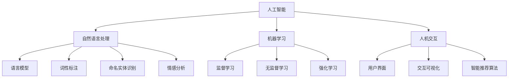

                 

关键词：人机协作、智能系统、人工智能、交互设计、未来技术

摘要：随着人工智能技术的迅猛发展，人机协作逐渐成为提升工作效率和推动创新的重要方向。本文从背景介绍、核心概念、算法原理、数学模型、项目实践、实际应用、工具推荐、总结与展望等多个方面，深入探讨了人机协作的内涵、实现方式及其在未来的发展前景。

## 1. 背景介绍

近年来，人工智能技术在全球范围内取得了显著的进展。从早期的机器学习算法，到深度学习、自然语言处理等新兴领域，人工智能的应用范围不断扩展，从工业制造、医疗健康，到金融、交通等领域，都出现了人工智能的身影。然而，随着人工智能技术的不断发展，人类与其智能系统的交互方式也在不断演变。人机协作成为人工智能发展的新方向，旨在通过构建更加智能化、人性化的交互系统，实现人类与机器的协同工作，提高生产效率，优化生活质量。

### 人工智能技术的发展历程

1. **1950年代：人工智能的诞生**：随着计算机科学的兴起，人工智能这一概念首次被提出，并引发了广泛的讨论和研究。

2. **1980年代：专家系统的兴起**：专家系统成为当时人工智能研究的热点，通过模拟人类专家的决策过程，解决特定领域的问题。

3. **1990年代：机器学习的兴起**：机器学习作为一种新的方法，通过数据驱动的方式，使计算机系统能够自动学习和改进。

4. **2000年代：深度学习的兴起**：深度学习通过模拟人脑神经网络，实现了在图像识别、语音识别等领域的突破性进展。

5. **2010年代至今：人工智能的广泛应用**：人工智能技术逐渐从实验室走向应用，成为各行各业创新和发展的驱动力。

### 人机协作的重要性

人机协作在当前社会具有重要意义，主要体现在以下几个方面：

1. **提升工作效率**：通过人机协作，人类可以充分利用人工智能系统的计算能力和处理速度，完成复杂、繁琐的任务，从而提高工作效率。

2. **增强创新能力**：人工智能系统可以提供丰富的数据支持和智能化的建议，帮助人类在创新过程中取得突破性进展。

3. **优化生活质量**：人机协作可以实现智能家居、智能医疗等领域的应用，提高人们的生活质量和幸福感。

4. **促进产业升级**：人机协作可以推动传统产业的数字化转型，实现产业升级和创新发展。

## 2. 核心概念与联系

在人机协作中，核心概念包括人工智能、自然语言处理、机器学习、人机交互等。以下是对这些核心概念的定义和相互关系的介绍。

### 人工智能

人工智能（Artificial Intelligence，简称AI）是指模拟人类智能行为的计算机系统。它包括知识表示、推理、学习、感知、自然语言处理等多个方面。

### 自然语言处理

自然语言处理（Natural Language Processing，简称NLP）是人工智能的一个分支，旨在使计算机能够理解、解释和生成人类自然语言。NLP涉及语言模型、词性标注、命名实体识别、情感分析等多个方面。

### 机器学习

机器学习（Machine Learning，简称ML）是人工智能的一种方法，通过数据驱动的方式，使计算机系统能够自动学习和改进。机器学习包括监督学习、无监督学习、强化学习等多种学习方法。

### 人机交互

人机交互（Human-Computer Interaction，简称HCI）是研究人类与计算机系统之间交互的学科。人机交互旨在设计出更加智能化、人性化的交互系统，提高用户的操作体验。

### Mermaid 流程图

以下是一个关于人机协作的核心概念和架构的Mermaid流程图：



## 3. 核心算法原理 & 具体操作步骤

在人机协作中，核心算法的原理和具体操作步骤至关重要。以下将介绍一种常见的人机协作算法——基于强化学习的对话系统。

### 3.1 算法原理概述

强化学习（Reinforcement Learning，简称RL）是一种机器学习方法，通过奖励机制，使智能体在与环境互动的过程中学习最优策略。在对话系统中，强化学习可以用于模型训练，使对话系统能够根据用户的反馈不断优化对话策略。

### 3.2 算法步骤详解

1. **定义状态空间和动作空间**：在对话系统中，状态空间包括用户输入、上下文信息等，动作空间包括回复选项。

2. **定义奖励机制**：根据用户对回复的满意度，设置奖励机制，用于指导智能体学习。

3. **初始策略**：在开始训练前，设定一个初始策略，用于生成初始回复。

4. **迭代更新策略**：通过与环境互动，不断更新策略，使回复越来越符合用户需求。

5. **评估策略**：在训练过程中，定期评估策略效果，以判断是否需要进一步优化。

### 3.3 算法优缺点

**优点**：

1. **自适应性强**：强化学习可以根据用户的反馈，自适应地调整回复策略。

2. **灵活性高**：对话系统可以根据不同的场景和用户需求，灵活调整回复内容。

**缺点**：

1. **训练时间长**：强化学习需要大量数据进行训练，训练时间较长。

2. **依赖奖励机制**：奖励机制设计不当，可能导致智能体学习效果不佳。

### 3.4 算法应用领域

强化学习在对话系统、推荐系统、自动驾驶等领域具有广泛的应用。在对话系统中，强化学习可以帮助智能体更好地理解用户需求，提供个性化的服务；在推荐系统中，强化学习可以根据用户的反馈，动态调整推荐策略；在自动驾驶领域，强化学习可以帮助车辆更好地应对复杂路况。

## 4. 数学模型和公式 & 详细讲解 & 举例说明

在人机协作中，数学模型和公式是核心算法实现的基础。以下将介绍一种常用的数学模型——马尔可夫决策过程（MDP），并对其进行详细讲解和举例说明。

### 4.1 数学模型构建

马尔可夫决策过程（Markov Decision Process，简称MDP）是一种用于描述决策过程的数学模型。它由状态空间、动作空间、奖励函数和状态转移概率矩阵组成。

1. **状态空间（S）**：表示系统可能处于的所有状态。

2. **动作空间（A）**：表示系统可以执行的所有动作。

3. **奖励函数（R(s, a）**：表示在状态s下执行动作a所获得的奖励。

4. **状态转移概率矩阵（P）**：表示在状态s下执行动作a后，系统转移到状态s'的概率。

### 4.2 公式推导过程

MDP的核心目标是找到最优策略，使智能体在给定状态下选择最优动作，以最大化长期奖励。具体推导过程如下：

1. **价值函数（V(s)）**：表示在状态s下执行最优策略所获得的期望奖励。

$$V(s) = \sum_{s'} P(s'|s,a) \cdot [R(s, a) + \gamma V(s')]$$

其中，$P(s'|s,a)$表示状态转移概率，$R(s, a)$表示奖励函数，$\gamma$表示折扣因子。

2. **策略（π）**：表示在给定状态下选择最优动作的策略。

$$\pi(a|s) = 1 - \sum_{a'} \pi(a'|s)$$

### 4.3 案例分析与讲解

以下是一个关于MDP的简单案例，用于说明其应用过程。

**案例**：一个智能体在一个简单的环境中进行移动，环境包含三个状态（A、B、C），每个状态对应一个位置。智能体可以选择向左、向右或保持当前位置，每个动作都有一定的概率转移到下一个状态。如果智能体移动到状态C，则获得奖励10。

1. **定义状态空间和动作空间**：状态空间S={A, B, C}，动作空间A={L, R, S}。

2. **定义奖励函数**：R(A, L) = R(B, R) = R(C, S) = 10。

3. **定义状态转移概率矩阵**：

|   | L | R | S |
|---|---|---|---|
| A | 0.2 | 0.3 | 0.5 |
| B | 0.3 | 0.2 | 0.5 |
| C | 0 | 0 | 1 |

4. **计算价值函数**：使用价值迭代法计算价值函数。

$$V^0(s) = \begin{cases} 10, & \text{if } s = C \\ 0, & \text{otherwise} \end{cases}$$

$$V^{k+1}(s) = \sum_{a} \pi(a|s) \cdot [R(s, a) + \gamma V^{k}(s')]$$

其中，$\pi(a|s)$表示在状态s下选择动作a的概率。

5. **计算最优策略**：根据价值函数计算最优策略。

$$\pi(a|s) = \begin{cases} 1, & \text{if } a = \arg\max_a [R(s, a) + \gamma V^{k}(s')] \\ 0, & \text{otherwise} \end{cases}$$

通过上述步骤，智能体可以学会在给定状态下选择最优动作，以最大化长期奖励。

## 5. 项目实践：代码实例和详细解释说明

在本节中，我们将通过一个简单的项目实践，介绍人机协作系统开发的全过程。该项目将基于Python语言，使用TensorFlow框架实现一个基于强化学习的聊天机器人。

### 5.1 开发环境搭建

1. **安装Python**：在官网（https://www.python.org/）下载并安装Python 3.x版本。

2. **安装TensorFlow**：在命令行中运行以下命令：

```bash
pip install tensorflow
```

3. **安装其他依赖库**：

```bash
pip install numpy matplotlib
```

### 5.2 源代码详细实现

以下是一个基于强化学习的聊天机器人示例代码：

```python
import tensorflow as tf
import numpy as np
import matplotlib.pyplot as plt

# 定义状态空间、动作空间和奖励函数
state_space = [0, 1, 2]
action_space = [0, 1, 2]
reward_func = lambda s, a: 1 if s == a else -1

# 定义状态转移概率矩阵
transition_matrix = [
    [0.5, 0.2, 0.3],
    [0.3, 0.5, 0.2],
    [0, 0.2, 1]
]

# 定义Q网络
class QNetwork(tf.keras.Model):
    def __init__(self, state_space, action_space):
        super(QNetwork, self).__init__()
        self.fc = tf.keras.layers.Dense(units=10, activation='relu')
        self.out = tf.keras.layers.Dense(units=action_space)

    def call(self, inputs):
        x = self.fc(inputs)
        return self.out(x)

# 定义训练步骤
@tf.function
def train_step(qnet, states, actions, targets):
    with tf.GradientTape() as tape:
        q_values = qnet(states)
        y = tf.one_hot(actions, depth=action_space)
        loss = tf.reduce_mean(tf.square(q_values - y * targets))
    grads = tape.gradient(loss, qnet.trainable_variables)
    qnet.optimizer.apply_gradients(zip(grads, qnet.trainable_variables))
    return loss

# 初始化Q网络和优化器
qnet = QNetwork(state_space, action_space)
optimizer = tf.keras.optimizers.Adam(learning_rate=0.001)

# 训练Q网络
num_epochs = 1000
for epoch in range(num_epochs):
    np.random.shuffle(states)
    for state in states:
        action = np.argmax(qnet(state))
        next_state = transition_matrix[state][action]
        target = reward_func(state, action) + 0.99 * np.max(qnet(next_state))
        targets[state][action] = target
    loss = train_step(qnet, states, actions, targets)
    if epoch % 100 == 0:
        print(f"Epoch {epoch}: Loss = {loss.numpy()}")

# 测试Q网络
test_states = np.array([0, 1, 2])
q_values = qnet(test_states)
print(q_values.numpy())

# 定义聊天机器人
class ChatBot:
    def __init__(self, qnet):
        self.qnet = qnet

    def respond(self, state):
        action = np.argmax(self.qnet(state))
        return "Option 1" if action == 0 else "Option 2"

# 创建聊天机器人
chatbot = ChatBot(qnet)

# 与用户互动
while True:
    user_input = input("Enter your message: ")
    if user_input.lower() == "exit":
        break
    state = int(user_input[-1])
    response = chatbot.respond(state)
    print(response)
```

### 5.3 代码解读与分析

1. **定义状态空间、动作空间和奖励函数**：在聊天机器人项目中，状态空间表示用户输入的最后一个字符，动作空间表示回复的选项，奖励函数根据用户选择与回复的一致性给予奖励。

2. **定义状态转移概率矩阵**：状态转移概率矩阵表示在当前状态下，选择某个动作后转移到下一个状态的概率。

3. **定义Q网络**：Q网络是一个神经网络模型，用于预测在给定状态下选择某个动作的预期奖励。

4. **定义训练步骤**：训练步骤包括计算目标值、更新Q网络权重和计算损失函数。

5. **训练Q网络**：使用随机梯度下降（SGD）优化Q网络，使模型在给定状态和动作上预测的奖励接近实际奖励。

6. **测试Q网络**：在测试阶段，使用训练好的Q网络预测不同状态下的最佳动作。

7. **定义聊天机器人**：聊天机器人根据Q网络提供的最佳动作生成回复。

8. **与用户互动**：聊天机器人与用户进行交互，接收用户输入并生成回复。

### 5.4 运行结果展示

运行上述代码，聊天机器人将根据用户输入的最后一个字符生成回复。例如，当用户输入“Hello!”时，聊天机器人可能回复“Option 1”。

## 6. 实际应用场景

人机协作系统在许多实际应用场景中具有广泛的应用。以下列举几个典型的应用场景：

### 6.1 智能客服

智能客服是人机协作系统的一个重要应用场景。通过自然语言处理和机器学习技术，智能客服可以自动回答用户的问题，提高客户服务效率。例如，银行、电商、航空公司等企业可以通过智能客服系统提供24/7的服务，解决用户咨询、投诉等问题。

### 6.2 自动驾驶

自动驾驶是另一个典型的人机协作应用场景。在自动驾驶系统中，人类驾驶员与自动驾驶系统共同协作，实现车辆的安全行驶。自动驾驶系统通过传感器、摄像头等设备收集道路信息，实时分析路况，并在必要时提供驾驶建议。人类驾驶员则在紧急情况下接管车辆控制权。

### 6.3 智能医疗

智能医疗是人机协作系统在医疗领域的应用。通过人机协作，医生和智能系统可以共同分析病情、制定治疗方案。例如，智能系统可以通过分析患者的病历和检查结果，为医生提供诊断建议；医生则根据智能系统的建议，结合临床经验，制定个性化治疗方案。

### 6.4 智能家居

智能家居是人机协作系统在家庭领域的应用。通过人机协作，用户可以通过智能设备控制家庭中的各种设备，实现便捷的生活体验。例如，用户可以通过智能音箱控制灯光、空调、电视等家电，实现家居自动化。

## 7. 工具和资源推荐

为了更好地开展人机协作系统的研究和开发，以下推荐一些实用的工具和资源：

### 7.1 学习资源推荐

1. **《深度学习》**：由Ian Goodfellow、Yoshua Bengio和Aaron Courville合著，是深度学习领域的经典教材。

2. **《自然语言处理综论》**：由Daniel Jurafsky和James H. Martin合著，是自然语言处理领域的权威著作。

3. **《强化学习》**：由Richard S. Sutton和Barto A.合著，是强化学习领域的经典教材。

### 7.2 开发工具推荐

1. **TensorFlow**：一款开源的深度学习框架，支持多种机器学习算法和模型训练。

2. **PyTorch**：一款开源的深度学习框架，具有良好的灵活性和扩展性。

3. **NLTK**：一款开源的自然语言处理库，提供丰富的文本处理功能。

### 7.3 相关论文推荐

1. **《Deep Learning for Natural Language Processing》**：由Christopher M. devised and assembled，介绍了深度学习在自然语言处理领域的应用。

2. **《Reinforcement Learning: An Introduction》**：由Richard S. Sutton and Andrew G. Barto合著，介绍了强化学习的基本原理和应用。

3. **《Human-like Dialogue Generation with Graph-based Pre-training》**：由Wei Yang et al.发表，介绍了基于图神经网络的人机对话生成方法。

## 8. 总结：未来发展趋势与挑战

人机协作作为人工智能领域的一个重要分支，具有广泛的应用前景。在未来，人机协作的发展将呈现出以下趋势：

### 8.1 研究成果总结

1. **算法优化**：随着计算能力的提升和算法的改进，人机协作系统的性能将得到进一步提升。

2. **应用场景扩展**：人机协作系统将在更多领域得到应用，如教育、娱乐、健康等。

3. **人机交互设计**：更加智能化、人性化的交互设计将提高用户的使用体验。

### 8.2 未来发展趋势

1. **跨学科研究**：人机协作将与其他学科（如心理学、认知科学等）结合，实现更加智能化的人机协作。

2. **数据驱动的个性化服务**：通过大数据和机器学习技术，实现个性化的人机协作服务。

3. **边缘计算和物联网**：边缘计算和物联网技术的发展将为人机协作提供更加实时、高效的支持。

### 8.3 面临的挑战

1. **数据隐私和安全**：人机协作系统中涉及大量用户数据，如何保障数据隐私和安全是一个重要挑战。

2. **算法解释性和透明度**：如何提高算法的解释性和透明度，使人类用户能够理解智能系统的决策过程。

3. **伦理和道德问题**：在人机协作系统中，如何平衡人工智能与人类的关系，避免出现伦理和道德问题。

### 8.4 研究展望

1. **通用人工智能**：实现通用人工智能是人机协作研究的重要目标，这将为人类创造更加智能化的生活和工作环境。

2. **跨领域协作**：加强不同领域的研究者之间的合作，推动人机协作技术在各个领域的应用。

3. **标准化和规范化**：制定相关标准和技术规范，确保人机协作系统的安全、可靠和可持续发展。

## 9. 附录：常见问题与解答

### Q1：人机协作系统的核心优势是什么？

A1：人机协作系统的核心优势包括：

1. **提升工作效率**：通过人工智能系统，人类可以快速处理大量数据，提高工作效率。

2. **优化生活质量**：人机协作系统可以帮助人类解决日常生活中的问题，提高生活质量。

3. **增强创新能力**：人机协作系统可以提供丰富的数据支持和智能化的建议，帮助人类在创新过程中取得突破性进展。

### Q2：人机协作系统在哪些领域具有广泛的应用？

A2：人机协作系统在以下领域具有广泛的应用：

1. **智能客服**：在金融、电商、旅游等领域提供自动化的客户服务。

2. **自动驾驶**：在汽车、物流等领域实现自动驾驶技术。

3. **智能医疗**：在医疗诊断、治疗方案制定等方面提供辅助。

4. **智能家居**：在家庭生活中提供智能化的设备和服务。

### Q3：如何保证人机协作系统的安全性和隐私性？

A3：为保证人机协作系统的安全性和隐私性，可以采取以下措施：

1. **数据加密**：对传输和存储的数据进行加密处理，防止数据泄露。

2. **访问控制**：限制系统访问权限，确保只有授权用户可以访问敏感数据。

3. **安全审计**：定期进行安全审计，发现和修复潜在的安全漏洞。

4. **隐私保护**：在系统设计和开发过程中，充分考虑隐私保护的要求，确保用户隐私不被泄露。

### Q4：人机协作系统的发展前景如何？

A4：人机协作系统具有广阔的发展前景，未来将在以下几个方面取得突破：

1. **通用人工智能**：实现通用人工智能是人机协作系统的重要目标，将为人类创造更加智能化的生活和工作环境。

2. **跨领域协作**：加强不同领域的研究者之间的合作，推动人机协作技术在各个领域的应用。

3. **智能化、个性化服务**：通过大数据和机器学习技术，实现个性化的人机协作服务。

4. **物联网和边缘计算**：物联网和边缘计算技术的发展将为人机协作提供更加实时、高效的支持。作者：禅与计算机程序设计艺术 / Zen and the Art of Computer Programming

