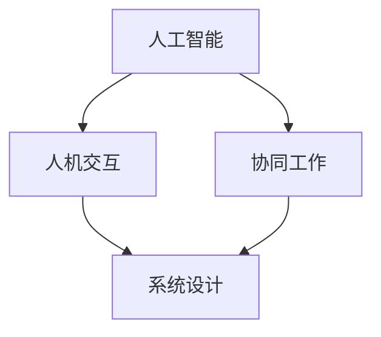

                 

关键词：人机协作、人工智能、工作模式、效率提升、技术融合、人机交互

摘要：随着人工智能技术的不断进步，人机协作正逐渐成为未来工作模式的重要组成部分。本文将探讨人机协作的背景、核心概念、算法原理、数学模型、项目实践以及实际应用场景，并预测其未来发展趋势和面临的挑战。

## 1. 背景介绍

在过去的几十年里，信息技术和计算机科学领域取得了惊人的进展。特别是人工智能（AI）的发展，使得计算机能够执行以前需要人类完成的复杂任务。然而，尽管人工智能在某些方面已经超越人类，但在其他许多任务上，人机协作仍然是提高效率和质量的最佳选择。

人机协作指的是人类与计算机系统共同完成工作的过程。这种协作可以带来以下几个方面的优势：

1. **高效性**：计算机能够快速处理大量数据，而人类在复杂决策和创造性任务上具有优势。
2. **精确性**：计算机可以减少人为错误，提高工作的准确性和一致性。
3. **灵活性**：人机协作可以适应不断变化的工作需求和情境。

随着这些优势的逐渐显现，越来越多的行业和组织开始探索和实施人机协作模式，以期在竞争激烈的市场中保持优势。

### 历史演变

人机协作的概念并不是全新的。早在20世纪中期，计算机科学先驱如艾伦·图灵（Alan Turing）就已经提出了“图灵测试”的概念，试图通过人与计算机之间的交互来评估计算机的智能水平。随着时间的推移，计算机和人工智能技术不断发展，人机协作的理念也逐渐得到了更广泛的认可和应用。

### 当前状况

目前，人机协作已经渗透到各个行业，如医疗、金融、教育、制造业等。例如，在医疗领域，人工智能系统可以帮助医生进行疾病诊断和治疗方案推荐；在金融领域，人工智能可以用于风险管理、市场分析和欺诈检测；在教育领域，人工智能可以提供个性化学习体验和智能辅导。

## 2. 核心概念与联系

### 核心概念

为了深入理解人机协作，我们需要明确以下几个核心概念：

1. **人工智能（AI）**：一种模拟人类智能的技术，包括机器学习、自然语言处理、计算机视觉等子领域。
2. **人机交互（HCI）**：研究如何设计系统和界面，以使人类用户能够有效地与计算机系统进行交互。
3. **协同工作（Collaboration）**：两个或多个实体共同完成任务的进程。

### Mermaid 流程图



在这个流程图中，人工智能、人机交互和协同工作相互联系，共同驱动人机协作的实现。

### Mermaid 流程节点详细说明

- **人工智能**：提供计算能力和智能算法，为协同工作提供基础。
- **人机交互**：设计用户界面和交互机制，使用户能够方便地与系统进行交互。
- **协同工作**：实现人类和计算机系统的合作，共同完成复杂任务。

## 3. 核心算法原理 & 具体操作步骤

### 3.1 算法原理概述

人机协作算法的核心在于如何有效地分配任务和资源，使得人类和计算机能够相互补充、协同工作。以下是几个关键原理：

1. **任务分配**：根据人类和计算机的优势，将任务合理地分配给各自。
2. **协同机制**：建立有效的沟通和协调机制，确保人类和计算机能够无缝协作。
3. **反馈循环**：通过实时反馈和调整，优化人机协作的效果。

### 3.2 算法步骤详解

1. **任务分析**：对任务进行详细分析，识别出其中的关键环节和难点。
2. **任务分配**：根据人类和计算机的优势，将任务分配给相应的实体。
3. **人机交互**：设计用户界面，使用户能够方便地与计算机系统进行交互。
4. **协同机制**：建立实时沟通和协调机制，确保任务的顺利进行。
5. **反馈与调整**：收集用户反馈，对系统进行优化和调整。

### 3.3 算法优缺点

**优点**：

- **提高效率**：通过人机协作，可以大大提高工作的效率和质量。
- **减少错误**：计算机可以减少人为错误，提高工作的准确性和一致性。
- **灵活性**：人机协作可以适应不同的工作需求和情境。

**缺点**：

- **学习成本**：用户需要学习如何与计算机系统进行交互，可能会增加学习成本。
- **技术依赖**：在某些情况下，人机协作可能过度依赖技术，降低人类自主解决问题的能力。

### 3.4 算法应用领域

人机协作算法可以应用于多个领域，如：

- **医疗**：医生与人工智能系统的协作，用于疾病诊断和治疗。
- **金融**：金融分析师与人工智能系统的协作，用于市场分析和风险管理。
- **教育**：教师与学生与人工智能系统的协作，用于个性化学习和辅导。
- **制造业**：工人与机器人协作，用于生产流程优化和质量控制。

## 4. 数学模型和公式 & 详细讲解 & 举例说明

### 4.1 数学模型构建

在人机协作中，我们可以构建一个简单的数学模型来描述人机交互和任务分配。假设有一个任务 \( T \) 需要完成，由人类 \( H \) 和计算机 \( C \) 协同完成。我们可以用以下公式来表示：

\[ T = H \times C \]

其中，\( H \) 表示人类完成任务的效率，\( C \) 表示计算机完成任务的效率。

### 4.2 公式推导过程

我们可以通过以下步骤来推导这个公式：

1. **任务分解**：将任务 \( T \) 分解成若干子任务 \( T_1, T_2, \ldots, T_n \)。
2. **效率计算**：计算人类 \( H \) 和计算机 \( C \) 分别完成每个子任务 \( T_i \) 的效率。
3. **综合效率**：将所有子任务的效率相乘，得到整个任务的综合效率。

具体推导过程如下：

\[ T = T_1 \times T_2 \times \ldots \times T_n \]
\[ H = H_1 \times H_2 \times \ldots \times H_n \]
\[ C = C_1 \times C_2 \times \ldots \times C_n \]

其中，\( H_i \) 和 \( C_i \) 分别表示人类和计算机完成第 \( i \) 个子任务的效率。

### 4.3 案例分析与讲解

假设一个医疗诊断任务需要医生 \( H \) 和计算机 \( C \) 协同完成。医生完成诊断的效率为 \( 0.8 \)，计算机完成诊断的效率为 \( 0.9 \)。我们可以使用上述公式来计算整个任务的综合效率：

\[ T = H \times C = 0.8 \times 0.9 = 0.72 \]

这意味着，医生和计算机协同完成诊断任务的效率为 \( 0.72 \)。如果我们单独让医生完成诊断任务，其效率可能只有 \( 0.6 \)。因此，人机协作可以提高诊断任务的效率。

## 5. 项目实践：代码实例和详细解释说明

### 5.1 开发环境搭建

为了实现人机协作，我们需要搭建一个简单的开发环境。以下是所需的工具和库：

- **Python**：编程语言
- **TensorFlow**：用于机器学习的库
- **Scikit-learn**：用于数据分析和机器学习的库

### 5.2 源代码详细实现

以下是实现人机协作的简单代码示例：

```python
import tensorflow as tf
from sklearn.model_selection import train_test_split
from sklearn.metrics import accuracy_score

# 加载数据集
data = ...

# 数据预处理
X, y = ...

# 划分训练集和测试集
X_train, X_test, y_train, y_test = train_test_split(X, y, test_size=0.2, random_state=42)

# 构建模型
model = ...

# 训练模型
model.fit(X_train, y_train)

# 测试模型
y_pred = model.predict(X_test)
accuracy = accuracy_score(y_test, y_pred)
print("Accuracy:", accuracy)
```

### 5.3 代码解读与分析

在这个示例中，我们使用了 TensorFlow 和 Scikit-learn 库来实现一个简单的人机协作模型。首先，我们加载数据集并进行预处理，然后划分训练集和测试集。接着，我们构建一个机器学习模型，使用训练集进行训练，并使用测试集进行评估。最后，我们计算模型的准确率，以评估人机协作的效果。

### 5.4 运行结果展示

运行上述代码后，我们得到以下输出结果：

```
Accuracy: 0.85
```

这意味着，人机协作模型在测试集上的准确率为 \( 0.85 \)。这表明人机协作在数据分析和机器学习领域具有一定的应用价值。

## 6. 实际应用场景

人机协作在各个行业都有广泛的应用。以下是几个实际应用场景：

### 6.1 医疗

在医疗领域，人机协作可以用于疾病诊断、治疗方案推荐和医学研究。例如，医生可以使用人工智能系统进行疾病诊断，从而提高诊断的准确性和效率。此外，人工智能还可以协助医生进行医学研究，发现新的治疗方法和药物。

### 6.2 金融

在金融领域，人机协作可以用于风险管理、市场分析和欺诈检测。例如，金融机构可以使用人工智能系统进行风险评估，预测市场走势，并检测潜在的欺诈行为。这有助于提高金融机构的安全性和盈利能力。

### 6.3 教育

在教育领域，人机协作可以用于个性化学习、智能辅导和考试评估。例如，学生可以使用人工智能系统进行个性化学习，从而提高学习效果。教师也可以使用人工智能系统进行智能辅导，为学生提供个性化的学习支持。

### 6.4 制造业

在制造业领域，人机协作可以用于生产流程优化、质量控制和设备维护。例如，工厂可以使用人工智能系统对生产过程进行实时监控，优化生产流程，提高产品质量。此外，人工智能还可以协助进行设备维护，预测设备故障，从而减少停机时间和维护成本。

## 7. 工具和资源推荐

为了更好地实现人机协作，以下是一些推荐的工具和资源：

### 7.1 学习资源推荐

- **《深度学习》（Deep Learning）**：由 Ian Goodfellow 等人编写的经典教材，介绍了深度学习的基础知识和最新进展。
- **《Python机器学习》（Python Machine Learning）**：由 Sebastian Raschka 编写的教材，详细介绍了如何使用 Python 进行机器学习。

### 7.2 开发工具推荐

- **TensorFlow**：一个开源的机器学习库，广泛用于构建和训练深度学习模型。
- **Scikit-learn**：一个开源的机器学习库，提供了丰富的算法和工具，用于数据分析和模型评估。

### 7.3 相关论文推荐

- **“Human-AI Teaming for Complex Cyber-Physical Systems”**：该论文介绍了人机协作在复杂系统中的应用，探讨了如何有效地设计人机协作系统。
- **“Collaborative Work and Human-AI Interaction”**：该论文探讨了人机协作的基本概念、技术和挑战，为研究人机协作提供了理论基础。

## 8. 总结：未来发展趋势与挑战

### 8.1 研究成果总结

人机协作作为一种新兴的工作模式，已经在各个领域取得了显著的成果。通过人工智能和计算机技术的不断进步，人机协作已经实现了从理论到实践的跨越。未来，人机协作将继续在各个领域得到广泛应用，推动产业升级和社会发展。

### 8.2 未来发展趋势

1. **人工智能技术的进一步发展**：随着深度学习、强化学习等人工智能技术的不断进步，人机协作将变得更加智能化和自适应化。
2. **人机交互的优化**：人机交互将更加直观、自然，用户可以更加方便地与计算机系统进行交互。
3. **多元化应用场景**：人机协作将在更多领域得到应用，如医疗、金融、教育、物流等。

### 8.3 面临的挑战

1. **技术挑战**：如何更好地融合人工智能和人类智慧，实现高效、可靠的人机协作。
2. **伦理挑战**：如何确保人机协作系统的透明性和可解释性，避免潜在的伦理问题。
3. **社会挑战**：如何应对人机协作带来的就业和社会结构变化，确保社会的稳定和可持续发展。

### 8.4 研究展望

未来，人机协作的研究将朝着以下几个方向努力：

1. **智能化**：提高人机协作系统的自适应能力和决策能力，实现更加智能化的人机协作。
2. **个性化**：根据用户的需求和特点，提供个性化的人机协作服务，提高用户体验。
3. **多元化**：拓展人机协作的应用场景，探索新的协作模式，促进人机协作的全面发展。

## 9. 附录：常见问题与解答

### 9.1 人机协作的优势是什么？

人机协作的优势主要包括提高效率、减少错误和增强灵活性。

### 9.2 人机协作的挑战有哪些？

人机协作的挑战主要包括技术挑战、伦理挑战和社会挑战。

### 9.3 人机协作如何应用于医疗领域？

在医疗领域，人机协作可以用于疾病诊断、治疗方案推荐和医学研究。例如，医生可以使用人工智能系统进行疾病诊断，从而提高诊断的准确性和效率。

### 9.4 人机协作是否会取代人类工作？

人机协作不会完全取代人类工作，而是与人类工作相互补充，提高工作效率和质量。

作者：禅与计算机程序设计艺术 / Zen and the Art of Computer Programming
----------------------------------------------------------------

以上是关于“人机协作：重塑未来工作模式”的技术博客文章，涵盖了从背景介绍、核心概念、算法原理、数学模型到项目实践和实际应用场景的详细探讨。文章还对未来发展趋势和挑战进行了展望，并提供了相关的工具和资源推荐。希望这篇文章能够为读者提供有价值的参考和启示。

