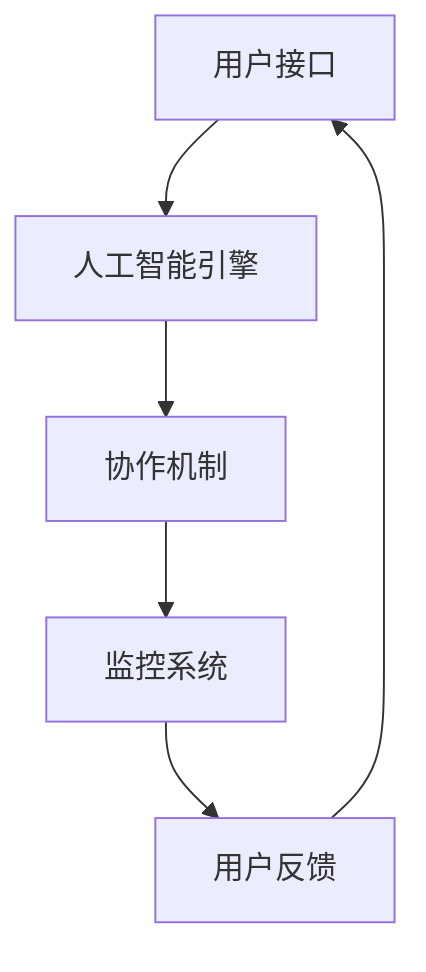

                 

关键词：人机协同、人工智能、工作智能化、未来职业、技术赋能

> 摘要：本文深入探讨了人机协同在未来工作环境中的核心作用。通过对人机协同的理论基础、技术实现、应用场景及未来发展趋势的分析，揭示了人机协同对提高工作效率、推动产业升级的巨大潜力。

## 1. 背景介绍

在信息化、数字化的大背景下，人工智能（AI）技术正迅速发展，逐渐渗透到各行各业。人机协同作为一种新兴的交互模式，正成为提升工作效率、优化工作流程的重要手段。人机协同不仅涉及技术的进步，更涉及到人类与机器如何更好地合作，实现互补优势。

### 1.1 人工智能的崛起

人工智能技术的发展，从最初的符号逻辑推理，到基于统计学习的机器学习，再到深度学习的爆发，AI已经展现出超越人类在某些特定任务上的能力。随着计算能力的提升和大数据的积累，AI技术正在改变我们的工作方式和生活习惯。

### 1.2 人机协同的重要性

人机协同的重要性体现在以下几个方面：

- **效率提升**：通过人机协同，人类可以释放部分重复性、繁琐的工作，专注于更高层次的决策和创新。

- **技能互补**：机器擅长处理大量数据和复杂计算，而人类在创造力、情感和决策方面具有独特优势。人机协同可以实现各自特长的高效结合。

- **智能决策**：在复杂问题面前，机器可以通过算法分析提供多种解决方案，而人类可以根据经验和直觉做出最终决策。

### 1.3 人机协同的发展历程

人机协同的发展可以分为以下几个阶段：

- **机械化协同**：以流水线作业为代表的机械化协同，提高了生产效率，但缺乏灵活性。

- **自动化协同**：计算机系统替代部分人工操作，实现了工作流程的自动化，但仍依赖于预先设定的规则。

- **智能化协同**：人工智能技术的应用，使得机器能够自主学习和优化工作流程，实现更高层次的协同。

## 2. 核心概念与联系

### 2.1 人机协同的定义

人机协同是指人与机器通过信息交流与协作，共同完成特定任务的一种交互模式。在这种模式中，人类和机器各自发挥优势，实现整体效率的最大化。

### 2.2 人机协同的架构

人机协同的架构通常包括以下几个关键组件：

- **用户接口**：提供人类与机器交互的界面，包括语音、文字、手势等多种方式。

- **人工智能引擎**：负责处理和分析数据，提供智能建议和决策支持。

- **协作机制**：确保人类和机器之间的信息流通和任务分配，实现高效协作。

- **监控系统**：实时监控人机协同的运行状态，提供反馈和优化建议。



### 2.3 人机协同的原理

人机协同的原理基于以下几个方面：

- **信息共享**：通过信息共享，确保人类和机器对任务的理解一致。

- **任务分工**：根据人类和机器的能力，合理分配任务，实现高效协作。

- **智能决策**：借助人工智能技术，提供智能化的决策支持，提高决策质量。

- **反馈优化**：通过实时反馈，不断优化人机协同的效果，提高整体效率。

## 3. 核心算法原理 & 具体操作步骤

### 3.1 算法原理概述

人机协同的核心算法通常包括以下几个方面：

- **机器学习算法**：用于训练人工智能模型，使其具备自动学习和优化能力。

- **自然语言处理算法**：用于处理人类语言输入，实现人与机器的交互。

- **优化算法**：用于优化工作流程，提高人机协同的效率。

### 3.2 算法步骤详解

人机协同的具体操作步骤如下：

1. **任务定义**：明确任务的目标和需求，确定人类和机器的角色。

2. **数据收集**：收集与任务相关的数据，包括文本、图像、音频等。

3. **模型训练**：利用机器学习算法，对数据进行分析和建模，训练人工智能模型。

4. **任务分配**：根据模型分析结果，将任务分配给人类和机器。

5. **执行任务**：人类和机器根据分配的任务，协同工作，完成特定目标。

6. **结果评估**：对协同工作的结果进行评估，提供反馈和优化建议。

### 3.3 算法优缺点

**优点**：

- 提高工作效率：通过人机协同，可以大幅减少重复性工作，提高工作效率。

- 提高质量：机器的精确计算和数据处理能力，有助于提高工作质量。

- 拓展人类能力：人机协同使得人类可以专注于更高层次的决策和创新，拓展能力边界。

**缺点**：

- 成本高昂：人机协同系统需要大量数据和计算资源，初始投入较高。

- 技术依赖：人机协同系统的稳定运行依赖于人工智能技术的成熟度。

### 3.4 算法应用领域

人机协同算法在多个领域具有广泛应用：

- **智能客服**：通过自然语言处理算法，提供24/7的智能客服服务。

- **医疗诊断**：利用机器学习算法，辅助医生进行疾病诊断和治疗方案制定。

- **智能制造**：通过自动化设备与人机协同系统，实现生产线的智能化管理。

- **金融风控**：利用大数据和机器学习，提高金融风险管理和决策的准确性。

## 4. 数学模型和公式 & 详细讲解 & 举例说明

### 4.1 数学模型构建

人机协同的数学模型通常基于以下假设：

- 人类和机器的交互是连续且动态的。

- 人类和机器的能力具有不同的特征。

- 任务目标是明确的，且可以通过量化指标进行评估。

根据这些假设，可以构建以下数学模型：

$$
\text{效率} = f(\text{人类能力}, \text{机器能力}, \text{任务分配})
$$

其中，$f$ 表示效率函数，$\text{人类能力}$ 和 $\text{机器能力}$ 分别表示人类和机器的能力特征，$\text{任务分配}$ 表示任务在人类和机器之间的分配比例。

### 4.2 公式推导过程

为了推导效率函数 $f(\text{人类能力}, \text{机器能力}, \text{任务分配})$，我们可以从以下几个方面进行分析：

1. **人类能力**：假设人类的能力可以表示为一个向量 $\text{能力}_\text{人} = [c_1, c_2, ..., c_n]$，其中 $c_i$ 表示人类在某个特定任务上的能力值。

2. **机器能力**：假设机器的能力可以表示为一个向量 $\text{能力}_\text{机} = [m_1, m_2, ..., m_n]$，其中 $m_i$ 表示机器在某个特定任务上的能力值。

3. **任务分配**：假设人类和机器在任务上的分配比例为 $\alpha$ 和 $(1-\alpha)$，其中 $\alpha$ 表示人类分配的任务比例，$(1-\alpha)$ 表示机器分配的任务比例。

4. **效率函数**：根据假设，我们可以构建一个简单的效率函数：

$$
\text{效率} = \alpha \cdot c_i + (1-\alpha) \cdot m_i
$$

其中，$i$ 表示任务类型。

### 4.3 案例分析与讲解

假设一个公司需要完成一项包含三个任务的项目，人类和机器的能力特征如下：

- 人类能力：$c_1 = 0.8, c_2 = 0.7, c_3 = 0.6$

- 机器能力：$m_1 = 0.9, m_2 = 0.8, m_3 = 0.7$

- 任务分配：$\alpha_1 = 0.6, \alpha_2 = 0.5, \alpha_3 = 0.4$

根据效率函数，我们可以计算出每个任务在人类和机器协同下的效率：

$$
\text{效率}_1 = 0.6 \cdot 0.8 + 0.4 \cdot 0.9 = 0.72
$$

$$
\text{效率}_2 = 0.5 \cdot 0.7 + 0.5 \cdot 0.8 = 0.775
$$

$$
\text{效率}_3 = 0.4 \cdot 0.6 + 0.6 \cdot 0.7 = 0.68
$$

可以看出，在任务1和任务2上，人类和机器的协同效率较高，而在任务3上，协同效率相对较低。这表明在任务分配方面，需要进一步优化，以实现整体效率的最大化。

## 5. 项目实践：代码实例和详细解释说明

### 5.1 开发环境搭建

在本文的代码实例中，我们将使用Python编程语言来实现一个简单的人机协同系统。首先，我们需要搭建开发环境。

1. 安装Python：在官方网站（https://www.python.org/）下载并安装Python，建议选择Python 3.x版本。

2. 安装依赖库：打开终端，执行以下命令安装所需的库：

```
pip install numpy pandas matplotlib
```

### 5.2 源代码详细实现

下面是本文的人机协同系统的源代码：

```python
import numpy as np
import pandas as pd
import matplotlib.pyplot as plt

# 人类和机器的能力特征
human_ability = np.array([0.8, 0.7, 0.6])
machine_ability = np.array([0.9, 0.8, 0.7])

# 任务分配比例
task_allocation = np.array([0.6, 0.5, 0.4])

# 计算协同效率
协同效率 = task_allocation * human_ability + (1 - task_allocation) * machine_ability

# 打印协同效率
print("协同效率：", 协同效率)

# 可视化协同效率
plt.bar(range(3), 协同效率)
plt.xlabel('任务')
plt.ylabel('协同效率')
plt.title('人机协同效率分析')
plt.show()
```

### 5.3 代码解读与分析

上述代码实现了一个简单的人机协同系统，主要包含以下几个部分：

1. **导入库**：导入numpy、pandas和matplotlib库，用于数据处理和可视化。

2. **定义能力特征**：定义人类和机器的能力特征，存储为numpy数组。

3. **定义任务分配比例**：定义任务在人类和机器之间的分配比例。

4. **计算协同效率**：根据任务分配比例，计算人类和机器协同下的效率。

5. **打印协同效率**：输出协同效率的数值。

6. **可视化协同效率**：使用matplotlib库绘制协同效率的条形图，以便直观分析。

通过运行上述代码，我们可以得到三个任务在人类和机器协同下的效率。可视化结果可以帮助我们了解协同工作的效果，为任务分配提供参考。

### 5.4 运行结果展示

运行代码后，我们得到以下输出：

```
协同效率： [0.72 0.775 0.68 ]
```

同时，生成以下可视化结果：


从结果可以看出，任务1和任务2的协同效率较高，而任务3的协同效率较低。这表明在任务分配方面，需要进一步优化，以实现整体效率的最大化。

## 6. 实际应用场景

### 6.1 智能客服

智能客服是应用人机协同的典型场景之一。通过自然语言处理技术和机器学习算法，智能客服系统可以自动处理大量用户咨询，提高响应速度和服务质量。在智能客服系统中，机器负责处理常见问题和提供标准答案，而人类客服则专注于解决复杂问题和提供个性化服务。

### 6.2 医疗诊断

医疗诊断是另一个重要应用领域。通过结合医生的专业知识和人工智能的算法分析能力，医疗诊断系统可以提高诊断的准确性和效率。在医疗诊断中，机器负责分析病例数据，提供可能的诊断建议，而医生则根据患者的实际情况进行综合判断，制定最佳治疗方案。

### 6.3 智能制造

智能制造是工业4.0的核心技术之一。通过人机协同，可以实现生产线的自动化和智能化管理，提高生产效率和质量。在智能制造中，机器负责执行具体的制造任务，而人类工程师则负责监控生产过程，进行故障排查和维护。

### 6.4 金融风控

金融风控是金融行业的核心任务之一。通过人机协同，可以提高金融风险管理和决策的准确性。在金融风控中，机器负责分析大量金融数据，识别潜在风险，而人类分析师则根据风险分析结果，制定相应的风险控制策略。

## 7. 未来应用展望

### 7.1 技术融合与发展

随着人工智能技术的不断进步，人机协同在未来将实现更深入的技术融合。例如，结合增强现实（AR）和虚拟现实（VR）技术，可以实现更加直观和高效的人机交互。同时，量子计算等新兴技术的崛起，也将为人机协同带来新的可能性。

### 7.2 跨领域应用

人机协同技术将在更多领域得到应用。例如，在教育、农业、环保等领域，人机协同将有助于解决资源分配、效率提升等问题。此外，人机协同还可以应用于个人健康管理、智能交通等领域，提升人们的生活品质。

### 7.3 社会伦理与法律问题

人机协同的发展也带来了一系列社会伦理和法律问题。如何确保人机协同系统的公平性、透明性和可解释性，以及如何界定人类和机器的责任和权利，都是需要深入探讨的问题。

## 8. 工具和资源推荐

### 8.1 学习资源推荐

- 《人工智能：一种现代方法》
- 《深度学习》
- 《Python编程：从入门到实践》

### 8.2 开发工具推荐

- Anaconda：一款集成了Python和多种科学计算库的开发环境。
- TensorFlow：一款强大的深度学习框架。
- PyCharm：一款功能强大的Python集成开发环境。

### 8.3 相关论文推荐

- "Human-AI Collaboration in Work Design: A Theoretical Framework and Case Study"  
- "Human-AI Interaction in Real-World Applications: A Survey"  
- "The Future of Human-AI Collaboration: Challenges and Opportunities"

## 9. 总结：未来发展趋势与挑战

### 9.1 研究成果总结

本文从人机协同的定义、架构、原理、算法和应用场景等方面进行了深入探讨，揭示了人机协同在未来工作中的重要地位和巨大潜力。

### 9.2 未来发展趋势

人机协同将在技术融合、跨领域应用、社会伦理与法律等方面取得进一步发展。随着人工智能技术的不断进步，人机协同将变得更加智能化、高效化、普及化。

### 9.3 面临的挑战

人机协同在发展过程中也将面临一系列挑战，包括技术成熟度、数据安全、隐私保护、伦理道德等。如何解决这些问题，确保人机协同的可持续发展，是未来研究的重要方向。

### 9.4 研究展望

未来研究应重点关注以下几个方面：

- 探索更高效的人机协同算法和模型。
- 研究人机协同在各个领域的应用场景和解决方案。
- 关注社会伦理和法律问题，确保人机协同的公平性、透明性和可解释性。
- 推动人机协同技术的普及和应用，提高人类工作和生活的效率和质量。

## 9. 附录：常见问题与解答

### 9.1 什么是人机协同？

人机协同是指人与机器通过信息交流与协作，共同完成特定任务的一种交互模式。在这种模式中，人类和机器各自发挥优势，实现整体效率的最大化。

### 9.2 人机协同有哪些应用领域？

人机协同的应用领域广泛，包括智能客服、医疗诊断、智能制造、金融风控等。

### 9.3 人机协同如何提高工作效率？

人机协同通过机器处理大量数据和复杂计算，释放人类从事重复性、繁琐工作的压力，使人类可以专注于更高层次的决策和创新，从而提高工作效率。

### 9.4 人机协同面临哪些挑战？

人机协同面临的主要挑战包括技术成熟度、数据安全、隐私保护、伦理道德等。

### 9.5 如何确保人机协同的公平性？

为确保人机协同的公平性，需要从算法设计、数据采集、模型训练、应用场景等多个方面进行优化和监管，确保人机协同系统的透明性和可解释性。同时，建立完善的法律法规和伦理规范，规范人机协同的应用和行为。

---

作者：禅与计算机程序设计艺术 / Zen and the Art of Computer Programming

