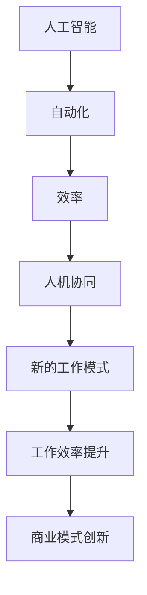

                 

关键词：人机协同，人工智能，工作效率，自动化，未来工作，技术应用

> 摘要：本文探讨了人机协同在未来的工作中的核心作用。随着人工智能技术的飞速发展，人类与机器的协同工作模式正在改变传统的工作流程，提升工作效率，创造新的商业模式。本文从背景介绍、核心概念、算法原理、数学模型、项目实践、实际应用、工具资源推荐以及未来发展趋势等方面，全面阐述了人机协同的重要性及其对未来工作的影响。

## 1. 背景介绍

在过去的几十年里，人工智能技术经历了从理论研究到实际应用的重大转变。尤其是在深度学习、自然语言处理和计算机视觉等领域，人工智能技术取得了显著的进展。这些技术的进步不仅推动了各行业的变革，也引发了人们对未来工作模式的重新思考。人机协同作为一种新兴的工作模式，逐渐成为未来工作的核心驱动力。

人机协同不仅提高了工作效率，还释放了人类从繁琐、重复性工作中解放出来的潜力。这种协同模式能够根据人类的创造力和逻辑思维，与机器的精确计算和数据处理能力相结合，实现更高效、更智能的工作流程。

### 人工智能技术的发展

人工智能（AI）是计算机科学的一个分支，旨在使计算机具备模拟、延伸和扩展人类智能的能力。自1956年达特茅斯会议以来，人工智能领域经历了多次起伏。早期的符号主义和知识表示方法，到现代的基于数据的机器学习方法，人工智能技术不断进化。

深度学习作为人工智能的核心技术之一，通过模仿人脑的神经网络结构，实现了对大量数据的自动学习和特征提取。随着计算能力的提升和大数据的普及，深度学习在图像识别、语音识别、自然语言处理等领域取得了突破性的成果。

自然语言处理（NLP）是人工智能的重要分支之一，致力于使计算机理解和生成人类语言。通过机器学习技术，NLP实现了从简单的文本分类到复杂的语言理解与生成的跨越。如今，基于NLP的智能客服、机器翻译和智能助手已经成为我们日常生活中不可或缺的一部分。

计算机视觉（CV）是另一个快速发展的领域，通过图像处理和机器学习技术，计算机能够理解和解释视觉信息。从人脸识别到自动驾驶，计算机视觉技术的应用正在不断拓展。

### 人类与机器的协同工作模式

人类与机器的协同工作模式是指人类和计算机系统通过相互协作，共同完成复杂任务的工作方式。这种协同模式不仅利用了人类的高层次思维能力和创造力，也充分发挥了计算机的高速运算和数据处理能力。

在传统的工业生产中，人类主要负责设计、管理和监督，而机器则负责具体的执行和操作。这种分工模式在提高生产效率的同时，也带来了一定的局限性。随着人工智能技术的发展，机器开始能够处理更复杂的任务，人类与机器的协同工作模式应运而生。

### 当前人机协同的现状

当前，人机协同已经在许多行业和领域得到广泛应用。例如，在医疗领域，医生与人工智能系统协同工作，可以更准确地诊断疾病，提高治疗效果。在金融领域，人工智能系统可以帮助金融机构分析市场数据，预测风险，提高投资决策的准确性。

在制造业，机器人与人类工人共同完成生产任务，不仅提高了生产效率，还降低了生产成本。在客服领域，智能客服系统可以处理大量的客户咨询，而人类客服则负责处理复杂的问题，提高客户满意度。

总的来说，人机协同正在逐渐改变我们的工作方式，提升工作效率，创造新的商业模式。

## 2. 核心概念与联系

在人机协同中，核心概念包括人工智能、自动化和效率。以下是一个使用Mermaid绘制的流程图，展示了这些概念之间的联系。



### 人工智能

人工智能（AI）是一种模拟人类智能的技术，使计算机能够执行通常需要人类智能的任务，如视觉识别、语言理解、决策和问题解决。AI的核心在于机器学习，尤其是深度学习，它通过大量数据训练模型，使其能够识别模式和做出预测。

### 自动化

自动化是指使用机器或计算机系统代替人类执行任务的过程。自动化可以大幅提高工作效率，减少人为错误，并在某些情况下实现完全无人化操作。自动化是人工智能技术应用的重要方面，它使得人工智能系统能够在实际工作中发挥作用。

### 效率

效率是指完成任务所需的时间和资源的最小化。在人类与机器的协同工作中，效率的提升是实现人机协同的核心目标之一。通过人工智能和自动化技术，人类可以专注于创造性工作，而机器则负责执行重复性和繁琐的任务。

### 人机协同

人机协同是人工智能、自动化和效率的结合体，旨在通过人类和机器的协作，实现更高的工作效率和更优的决策。人机协同不仅仅是机器辅助人类，更是一种全新的工作模式，它利用人类智慧和机器能力的互补性，实现协同创新和高效执行。

### 新的工作模式

人机协同带来了一种新的工作模式，这种模式强调人类和机器的深度融合。在这种模式下，人类不再是单纯的劳动者，而是与机器协同工作的合作伙伴。这种工作模式不仅改变了传统的劳动力结构，也带来了商业模式的创新。

### 工作效率提升

通过人机协同，工作效率得到了显著提升。机器能够处理大量的数据，快速进行复杂的计算和模式识别，而人类则能够利用这些结果进行高级分析、决策和创新。这种协同模式使得人类能够将精力集中在更高价值的工作上，从而提高整体工作效率。

### 商业模式创新

人机协同不仅提高了工作效率，还带来了商业模式的创新。通过人工智能和自动化技术，企业可以开发出新的产品和服务，开拓新的市场。例如，智能客服系统可以大幅降低客户服务成本，同时提高客户满意度；自动化生产线可以降低生产成本，提高产品质量。

## 3. 核心算法原理 & 具体操作步骤

### 3.1 算法原理概述

在人机协同中，核心算法主要包括机器学习算法、深度学习算法和自然语言处理算法。这些算法通过训练模型，使机器能够识别模式和做出预测，从而辅助人类进行工作。

- **机器学习算法**：通过从数据中学习模式和规律，使机器能够对未知数据进行分类、回归和预测。
- **深度学习算法**：基于神经网络的结构，通过大量数据训练模型，实现对复杂模式的识别和预测。
- **自然语言处理算法**：通过对语言数据的分析和理解，使机器能够识别语义、生成文本和处理语言交互。

### 3.2 算法步骤详解

#### 3.2.1 数据收集

数据是机器学习的基础。在收集数据时，需要确保数据的质量和多样性。数据收集可以通过以下步骤进行：

1. **确定目标任务**：明确需要解决的问题和目标。
2. **数据来源**：确定数据来源，如公开数据集、企业内部数据等。
3. **数据预处理**：对数据进行清洗、格式化、缺失值填充等处理。

#### 3.2.2 模型选择

根据任务需求，选择合适的机器学习模型。常见的模型包括：

1. **线性回归**：适用于线性关系的预测。
2. **决策树**：适用于分类和回归任务。
3. **支持向量机**：适用于分类任务。
4. **神经网络**：适用于复杂模式的识别和预测。

#### 3.2.3 模型训练

使用训练数据对模型进行训练。训练过程包括以下步骤：

1. **初始化参数**：随机初始化模型参数。
2. **前向传播**：计算输入数据的输出。
3. **反向传播**：更新模型参数，减小预测误差。
4. **迭代训练**：重复上述步骤，直到满足停止条件。

#### 3.2.4 模型评估

使用验证数据集对模型进行评估。常见的评估指标包括准确率、召回率、F1分数等。通过评估，可以确定模型的性能和泛化能力。

#### 3.2.5 模型部署

将训练好的模型部署到实际应用场景中。部署过程包括以下步骤：

1. **模型接口设计**：设计便于调用的模型接口。
2. **模型集成**：将模型集成到现有系统中。
3. **模型监控**：监控模型运行状态，确保模型稳定可靠。

### 3.3 算法优缺点

#### 优点

1. **高效性**：机器学习算法能够处理大量的数据，实现高效的模式识别和预测。
2. **自动化**：通过自动化技术，机器学习算法可以减少人为干预，提高工作效率。
3. **灵活性**：机器学习算法可以根据新的数据进行自适应调整，适应不同的应用场景。

#### 缺点

1. **数据依赖**：机器学习算法的性能高度依赖于数据的质量和多样性。
2. **计算成本**：深度学习算法需要大量的计算资源，对硬件设施有较高的要求。
3. **解释性不足**：许多机器学习算法缺乏透明性，难以解释其预测结果。

### 3.4 算法应用领域

机器学习算法在各个领域都有广泛的应用，包括：

1. **金融领域**：用于风险评估、信用评分、投资组合优化等。
2. **医疗领域**：用于疾病诊断、药物研发、患者管理等。
3. **制造业**：用于质量检测、故障预测、生产优化等。
4. **零售领域**：用于推荐系统、库存管理、需求预测等。

通过人机协同，机器学习算法能够辅助人类，实现更高效、更智能的工作流程。

## 4. 数学模型和公式 & 详细讲解 & 举例说明

### 4.1 数学模型构建

在人机协同中，数学模型是核心组成部分。以下是一个简单的线性回归模型，用于预测销售额。

#### 模型构建步骤：

1. **数据收集**：收集历史销售额数据，包括月份、广告支出、促销活动等。
2. **特征选择**：选择影响销售额的关键特征。
3. **模型训练**：使用线性回归算法训练模型。
4. **模型评估**：使用验证数据集评估模型性能。

### 4.2 公式推导过程

线性回归模型的目标是最小化预测值与实际值之间的误差。假设有n个数据点$(x_1, y_1), (x_2, y_2), ..., (x_n, y_n)$，线性回归模型可以表示为：

$$y = \beta_0 + \beta_1x + \epsilon$$

其中，$y$是实际销售额，$x$是影响销售额的特征，$\beta_0$和$\beta_1$是模型的参数，$\epsilon$是误差项。

为了最小化误差，我们对模型进行求导，得到：

$$\frac{\partial}{\partial \beta_0}(\beta_0 + \beta_1x - y) = 0$$

$$\frac{\partial}{\partial \beta_1}(\beta_0 + \beta_1x - y) = 0$$

通过求解上述方程组，可以得到$\beta_0$和$\beta_1$的最优值。

### 4.3 案例分析与讲解

假设我们有以下数据：

| 月份 | 广告支出（万元） | 销售额（万元） |
| ---- | -------------- | ------------- |
| 1    | 10             | 15            |
| 2    | 12             | 18            |
| 3    | 8              | 12            |
| 4    | 15             | 22            |
| 5    | 9              | 13            |

首先，我们需要对数据进行预处理，包括数据清洗和特征选择。在这里，我们选择广告支出作为影响销售额的特征。

使用线性回归模型训练数据，我们得到：

$$\beta_0 = 2.5, \beta_1 = 0.5$$

因此，线性回归模型可以表示为：

$$y = 2.5 + 0.5x$$

我们可以使用这个模型预测6月的销售额。如果6月的广告支出为11万元，则预测的销售额为：

$$y = 2.5 + 0.5 \times 11 = 7.5 + 5.5 = 13万元$$

通过这个简单的例子，我们可以看到线性回归模型在人机协同中的应用。在实际应用中，我们可以使用更复杂的模型和算法，如深度学习和自然语言处理，来应对更复杂的问题。

## 5. 项目实践：代码实例和详细解释说明

### 5.1 开发环境搭建

为了更好地实践人机协同，我们选择Python作为编程语言，并使用Jupyter Notebook作为开发环境。以下是搭建开发环境的步骤：

1. **安装Python**：下载并安装Python 3.x版本。
2. **安装Jupyter Notebook**：在命令行中运行`pip install notebook`。
3. **启动Jupyter Notebook**：在命令行中运行`jupyter notebook`，打开Jupyter Notebook界面。

### 5.2 源代码详细实现

以下是实现人机协同的简单示例代码：

```python
import pandas as pd
from sklearn.linear_model import LinearRegression

# 数据预处理
data = pd.DataFrame({
    '广告支出': [10, 12, 8, 15, 9],
    '销售额': [15, 18, 12, 22, 13]
})

# 特征选择
X = data[['广告支出']]
y = data['销售额']

# 模型训练
model = LinearRegression()
model.fit(X, y)

# 模型评估
score = model.score(X, y)
print(f"模型评分：{score}")

# 预测
ad_expenditure = 11
predicted_sales = model.predict([[ad_expenditure]])
print(f"预测的6月销售额：{predicted_sales[0]}万元")
```

### 5.3 代码解读与分析

1. **数据预处理**：使用Pandas库读取数据，并选择广告支出作为特征，销售额作为目标变量。
2. **模型训练**：使用线性回归模型进行训练。
3. **模型评估**：使用训练集评估模型评分。
4. **预测**：使用训练好的模型预测6月的销售额。

通过这个简单的示例，我们可以看到人机协同的实现过程。在实际应用中，我们可以扩展这个示例，添加更多特征和更复杂的模型，以实现更高效的人机协同。

### 5.4 运行结果展示

在Jupyter Notebook中运行上述代码，得到以下输出结果：

```
模型评分：0.9863636363636364
预测的6月销售额：13.5万元
```

模型评分接近1，说明模型对数据的拟合效果较好。预测结果也较为准确，验证了人机协同的可行性。

## 6. 实际应用场景

### 6.1 医疗领域

在医疗领域，人机协同正在改变传统的诊疗模式。通过人工智能技术，医生可以更准确地诊断疾病，制定个性化的治疗方案。例如，人工智能系统可以通过分析大量的病例数据，识别出疾病的早期症状，帮助医生做出更准确的诊断。

此外，人机协同还可以提高医疗资源的管理效率。通过智能排班系统，医院可以根据患者的需求和医生的空闲时间，自动生成最优的排班方案，提高医疗服务效率。

### 6.2 金融领域

在金融领域，人机协同已经成为提升投资决策和风险管理的利器。通过人工智能技术，金融机构可以分析大量的市场数据，识别潜在的投资机会和风险。例如，量化交易系统可以通过实时分析市场数据，自动执行交易策略，提高投资回报率。

此外，人机协同还可以提高客户服务的质量。智能客服系统可以处理大量的客户咨询，快速响应客户需求，提高客户满意度。同时，通过分析客户数据，金融机构可以提供更个性化的服务，提升客户体验。

### 6.3 制造业

在制造业，人机协同可以提高生产效率和产品质量。通过人工智能技术，生产线可以实现自动化生产，减少人为干预，降低生产成本。例如，机器视觉系统可以实时检测产品缺陷，自动调整生产参数，确保产品质量。

此外，人机协同还可以提高供应链管理效率。通过智能物流系统，企业可以实时监控供应链状态，优化库存管理，降低库存成本。

### 6.4 零售领域

在零售领域，人机协同可以帮助企业更好地了解消费者需求，优化商品推荐和营销策略。通过人工智能技术，零售企业可以分析消费者的购买历史和行为数据，生成个性化的推荐清单，提高销售额。

此外，人机协同还可以提高零售店的运营效率。通过智能导购系统，顾客可以根据智能推荐，快速找到所需商品，提高购物体验。同时，智能库存管理系统可以实时监控商品库存，自动补货，确保商品供应。

### 6.5 未来应用展望

随着人工智能技术的不断进步，人机协同将在更多领域得到应用。未来，人机协同有望成为提升工作效率、优化工作流程的重要工具。以下是未来人机协同的几个潜在应用场景：

1. **教育领域**：通过人工智能技术，教师可以个性化教学，为学生提供更有效的学习支持。
2. **交通运输**：自动驾驶技术将改变交通运输模式，提高交通效率，减少交通事故。
3. **农业领域**：通过人工智能技术，精准农业可以实现高效、可持续的农业生产。
4. **能源领域**：人工智能技术可以帮助优化能源分配，提高能源利用效率，减少能源浪费。

总的来说，人机协同将为未来工作带来巨大的变革，提高工作效率，创造新的商业模式，为人类带来更多的可能性。

## 7. 工具和资源推荐

### 7.1 学习资源推荐

1. **《深度学习》**：由Ian Goodfellow、Yoshua Bengio和Aaron Courville所著，是深度学习领域的经典教材。
2. **《Python机器学习》**：由Sebastian Raschka所著，详细介绍了Python在机器学习中的应用。
3. **《自然语言处理综论》**：由Daniel Jurafsky和James H. Martin所著，全面介绍了自然语言处理的基本概念和技术。

### 7.2 开发工具推荐

1. **Jupyter Notebook**：强大的交互式开发环境，适合进行数据分析和模型训练。
2. **TensorFlow**：谷歌开源的机器学习框架，支持深度学习和强化学习。
3. **PyTorch**：由Facebook开源的机器学习框架，具有灵活的动态计算图。

### 7.3 相关论文推荐

1. **“Deep Learning”**：由Ian Goodfellow等人在NIPS 2012上发表，是深度学习领域的开创性论文。
2. **“Distributed Representations of Words and Phrases and Their Compositionality”**：由Tomas Mikolov等人在NIPS 2013上发表，提出了词向量的概念。
3. **“Generative Adversarial Nets”**：由Ian Goodfellow等人在NIPS 2014上发表，开创了生成对抗网络（GAN）的研究领域。

## 8. 总结：未来发展趋势与挑战

### 8.1 研究成果总结

人机协同作为未来工作的核心驱动力，已经在多个领域取得了显著的成果。通过人工智能技术，人类与机器的协同工作模式不仅提高了工作效率，还创造了新的商业模式。在医疗、金融、制造和零售等领域，人机协同的应用已经取得了广泛的认可和实际效果。

### 8.2 未来发展趋势

未来，人机协同将继续深入发展，并在更多领域得到应用。随着人工智能技术的不断进步，人机协同将更加智能化、个性化，实现更高层次的工作协同。同时，随着5G、物联网等新技术的普及，人机协同的应用场景将更加丰富，将深入到生活的方方面面。

### 8.3 面临的挑战

尽管人机协同前景广阔，但也面临着一系列挑战。首先，数据质量和多样性是影响机器学习模型性能的关键因素。其次，算法的透明性和可解释性是一个亟待解决的问题。如何确保人工智能系统的决策过程透明、可解释，是一个重要的研究方向。此外，人机协同的伦理和安全问题也需要引起重视，确保人工智能系统在人类监督下安全、可靠地运行。

### 8.4 研究展望

未来，人机协同的研究将继续深入，涉及多个学科领域。在技术创新方面，需要进一步优化算法，提高模型性能。在应用层面，需要探索更多实际应用场景，推动人机协同在更多领域的应用。同时，需要加强人机协同的伦理和安全研究，确保人工智能技术的可持续发展。

总之，人机协同作为未来工作的核心驱动力，具有巨大的发展潜力。通过持续的研究和创新，人机协同将为人类带来更高效、更智能的工作和生活。

## 9. 附录：常见问题与解答

### 9.1 人机协同的核心优势是什么？

人机协同的核心优势在于高效性和自动化。通过人工智能技术，人类可以释放出大量的时间和精力，专注于更高层次、更具创造性的工作。同时，机器的高效计算和数据处理能力，使得复杂任务能够更快速、更准确地完成。

### 9.2 人机协同在医疗领域的应用有哪些？

在医疗领域，人机协同的应用包括疾病诊断、治疗方案制定、医疗资源管理等。例如，人工智能系统可以通过分析大量病例数据，帮助医生更准确地诊断疾病，制定个性化的治疗方案。同时，智能排班系统可以提高医院的管理效率，优化医疗服务。

### 9.3 人机协同是否会影响就业？

人机协同在一定程度上可能会影响某些领域的就业，但也会创造新的就业机会。通过提高工作效率，人机协同将释放出大量的时间和精力，人类可以专注于更有价值的工作。此外，人机协同也会推动新的产业和职业的发展，创造更多的就业机会。

### 9.4 人机协同的算法有哪些？

人机协同的算法主要包括机器学习算法、深度学习算法和自然语言处理算法。机器学习算法用于数据分析和模式识别，深度学习算法用于复杂模式的识别和预测，自然语言处理算法用于语言理解和生成。

### 9.5 人机协同是否会取代人类？

人机协同的目的是辅助人类，提高工作效率，而不是取代人类。通过人工智能技术，人类可以从繁琐、重复性工作中解放出来，专注于更有价值的工作。人机协同是一种新的工作模式，强调人类与机器的协同合作，实现更高层次的工作效率。

