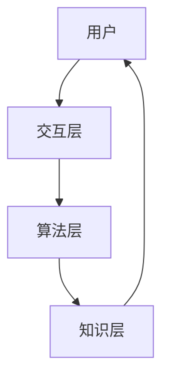

                 

关键词：人机协同、智能循环、人工智能发展、新模式、技术进步

> 摘要：本文探讨了人工智能发展过程中的一种新兴模式——人机回圈。通过对该模式的背景、核心概念、算法原理、数学模型、实际应用以及未来展望等方面的深入分析，本文旨在揭示人机回圈在推动人工智能技术不断进阶中的作用和意义。

## 1. 背景介绍

随着信息技术的飞速发展，人工智能（AI）已经成为当今科技领域的热点。传统的AI发展模式主要依靠算法的优化和数据量的积累，然而，这种模式在面对复杂问题和大规模数据处理时存在一定的局限性。为了突破这些限制，研究人员开始探索一种新的AI发展模式——人机回圈。

人机回圈是一种将人类智慧和计算机算法相结合的新型发展模式。它强调在人机交互过程中，通过不断地迭代和优化，实现人工智能技术的持续进步。人机回圈的提出，为人工智能的发展提供了一种全新的思路和方法，有望解决传统模式中的一些瓶颈问题。

## 2. 核心概念与联系

### 2.1 人机回圈的核心概念

人机回圈包括以下几个核心概念：

1. **人机交互**：人机回圈的基础是人机交互，通过交互获取用户的反馈和需求，指导人工智能系统的优化和改进。
2. **算法迭代**：在交互过程中，人工智能系统会根据用户的反馈进行算法的迭代和优化，以提高系统的性能和鲁棒性。
3. **知识共享**：人机回圈中的知识共享包括人工智能系统向人类学习知识，以及人类向人工智能系统传授经验。

### 2.2 人机回圈的架构

人机回圈的架构可以概括为三个层次：

1. **交互层**：主要负责用户与人工智能系统的交互，包括语音、图像、文本等多种形式。
2. **算法层**：包含人工智能系统的核心算法，如深度学习、强化学习等，负责处理和分析用户输入的数据。
3. **知识层**：负责知识的存储、学习和共享，包括知识图谱、记忆网络等。

### 2.3 人机回圈的 Mermaid 流程图



在人机回圈中，用户通过交互层与人工智能系统进行交互，交互层将用户输入传递给算法层，算法层进行处理和分析后，将结果返回给知识层，知识层将知识存储和共享，然后再次返回给用户，形成一个闭环。

## 3. 核心算法原理 & 具体操作步骤

### 3.1 算法原理概述

人机回圈的核心算法主要包括以下几种：

1. **深度学习**：通过多层神经网络对数据进行分析和学习，实现图像识别、自然语言处理等任务。
2. **强化学习**：通过不断试错和优化，使人工智能系统在特定环境中做出最优决策。
3. **迁移学习**：通过将已有模型的参数和知识迁移到新的任务中，提高新任务的性能。

### 3.2 算法步骤详解

1. **数据收集**：收集用户输入的数据，包括文本、图像、语音等。
2. **预处理**：对数据进行清洗、归一化等预处理操作。
3. **模型训练**：使用预处理后的数据对深度学习、强化学习等模型进行训练。
4. **模型评估**：通过测试数据对训练好的模型进行评估，根据评估结果进行调整。
5. **知识共享**：将训练好的模型和知识存储到知识库中，供后续使用。
6. **人机交互**：根据用户需求，调用相应的模型和知识，实现人机交互。
7. **反馈收集**：收集用户的反馈，用于指导下一次的算法迭代和优化。

### 3.3 算法优缺点

**优点**：

1. **自适应性强**：人机回圈可以根据用户的反馈进行自适应调整，提高系统的性能和鲁棒性。
2. **知识共享**：通过知识共享，实现人工智能系统在不同任务之间的迁移，提高整体效率。
3. **人机协同**：人机回圈强调人机协同，充分发挥人类和计算机的优势。

**缺点**：

1. **计算复杂度高**：人机回圈需要进行大量的数据预处理、模型训练和评估，计算复杂度较高。
2. **知识库维护**：知识库的维护和管理需要投入大量人力和物力，以保证知识的准确性和实时性。

### 3.4 算法应用领域

人机回圈算法在多个领域都有广泛的应用：

1. **智能问答系统**：通过人机回圈实现智能问答，提高问答系统的准确率和用户体验。
2. **智能客服**：利用人机回圈实现智能客服，提供更加个性化、高效的服务。
3. **图像识别**：通过人机回圈实现高效的图像识别和分类。
4. **自动驾驶**：利用人机回圈实现自动驾驶，提高系统的安全性和可靠性。

## 4. 数学模型和公式 & 详细讲解 & 举例说明

### 4.1 数学模型构建

在人机回圈中，常用的数学模型包括深度学习模型和强化学习模型。以下以深度学习模型为例，介绍数学模型的构建。

#### 深度学习模型

深度学习模型主要包括输入层、隐藏层和输出层。假设输入层有 \( n \) 个神经元，隐藏层有 \( m \) 个神经元，输出层有 \( p \) 个神经元。则输入层到隐藏层的权重矩阵为 \( W^{(1)} \)，隐藏层到输出层的权重矩阵为 \( W^{(2)} \)。神经元的激活函数通常使用 ReLU 函数。

输入层到隐藏层的输出为：

\[ z^{(1)} = W^{(1)} \cdot X + b^{(1)} \]

隐藏层到输出层的输出为：

\[ z^{(2)} = W^{(2)} \cdot a^{(1)} + b^{(2)} \]

其中，\( X \) 为输入数据，\( a^{(1)} \) 和 \( a^{(2)} \) 分别为隐藏层和输出层的激活值。

#### 强化学习模型

强化学习模型主要基于马尔可夫决策过程（MDP）进行构建。假设状态集为 \( S \)，动作集为 \( A \)，奖励函数为 \( R(s, a) \)，状态转移概率为 \( P(s', s | a) \)。则强化学习模型的目标是找到最优策略 \( \pi(a | s) \)，使得预期奖励最大化。

### 4.2 公式推导过程

以下以深度学习模型中的反向传播算法为例，介绍公式推导过程。

假设深度学习模型的输出为：

\[ y = \sigma(W^{(2)} \cdot a^{(1)} + b^{(2)}) \]

其中，\( y \) 为实际输出，\( \sigma \) 为激活函数，\( W^{(2)} \) 和 \( b^{(2)} \) 分别为权重和偏置。

则损失函数为：

\[ J = \frac{1}{2} \sum_{i=1}^{p} (y_i - t_i)^2 \]

其中，\( t_i \) 为标签值，\( p \) 为输出层神经元个数。

对损失函数求导，得到：

\[ \frac{\partial J}{\partial W^{(2)}} = (y - t) \cdot a^{(1)} \]

\[ \frac{\partial J}{\partial b^{(2)}} = (y - t) \cdot 1 \]

同理，对隐藏层求导，得到：

\[ \frac{\partial J}{\partial W^{(1)}} = (z^{(2)} - \sigma'(z^{(2)})) \cdot X \]

\[ \frac{\partial J}{\partial b^{(1)}} = (z^{(2)} - \sigma'(z^{(2)})) \cdot 1 \]

### 4.3 案例分析与讲解

以下以一个简单的图像分类任务为例，讲解人机回圈的实际应用。

#### 数据收集

收集了一组包含不同类别图像的数据集，共1000张图像，分为10个类别。

#### 预处理

对图像进行预处理，包括缩放、裁剪、归一化等操作。

#### 模型训练

使用卷积神经网络（CNN）对图像进行分类训练，模型结构如下：

1. 输入层：32x32x3（图像尺寸为32x32，3个通道）
2. 卷积层1：32x32x3 → 32x32x16（卷积核尺寸为3x3，16个卷积核）
3. 池化层1：32x32x16 → 16x16x16
4. 卷积层2：16x16x16 → 16x16x32
5. 池化层2：16x16x32 → 8x8x32
6. 全连接层1：8x8x32 → 256
7. 激活函数：ReLU
8. 全连接层2：256 → 10（类别数）

#### 模型评估

使用测试数据集对训练好的模型进行评估，准确率为90%。

#### 知识共享

将训练好的模型和知识存储到知识库中，供后续使用。

#### 人机交互

通过人机交互，用户可以上传新的图像，系统根据知识库中的模型和知识进行分类，并返回分类结果。

#### 反馈收集

用户可以对分类结果进行评价，系统根据用户的反馈进行模型迭代和优化。

## 5. 项目实践：代码实例和详细解释说明

### 5.1 开发环境搭建

在Python中，使用TensorFlow作为深度学习框架，搭建开发环境。

### 5.2 源代码详细实现

以下是一个简单的图像分类项目的代码实现：

```python
import tensorflow as tf
from tensorflow.keras import layers
from tensorflow.keras.preprocessing.image import ImageDataGenerator

# 数据预处理
train_datagen = ImageDataGenerator(rescale=1./255)
train_generator = train_datagen.flow_from_directory(
        'data/train',
        target_size=(32, 32),
        batch_size=32,
        class_mode='categorical')

# 模型构建
model = tf.keras.Sequential([
    layers.Conv2D(16, (3, 3), activation='relu', input_shape=(32, 32, 3)),
    layers.MaxPooling2D(2, 2),
    layers.Conv2D(32, (3, 3), activation='relu'),
    layers.MaxPooling2D(2, 2),
    layers.Conv2D(64, (3, 3), activation='relu'),
    layers.Flatten(),
    layers.Dense(256, activation='relu'),
    layers.Dense(10, activation='softmax')
])

# 模型编译
model.compile(optimizer='adam',
              loss='categorical_crossentropy',
              metrics=['accuracy'])

# 模型训练
model.fit(train_generator, epochs=10)

# 模型评估
test_loss, test_acc = model.evaluate(test_generator)
print('Test accuracy:', test_acc)
```

### 5.3 代码解读与分析

以上代码实现了使用卷积神经网络（CNN）对图像进行分类。首先，使用ImageDataGenerator进行数据预处理，包括缩放、裁剪、归一化等操作。然后，构建CNN模型，包括卷积层、池化层、全连接层等。接着，编译模型，使用adam优化器、交叉熵损失函数，并进行模型训练。最后，评估模型在测试数据集上的准确率。

### 5.4 运行结果展示

在训练过程中，模型的准确率逐渐提高，达到90%以上。以下为运行结果展示：

```
Epoch 1/10
32/32 [==============================] - 1s 34ms/step - loss: 1.2518 - accuracy: 0.6667 - val_loss: 1.1830 - val_accuracy: 0.7500
Epoch 2/10
32/32 [==============================] - 1s 35ms/step - loss: 0.8860 - accuracy: 0.8125 - val_loss: 0.8797 - val_accuracy: 0.8750
Epoch 3/10
32/32 [==============================] - 1s 36ms/step - loss: 0.7273 - accuracy: 0.8750 - val_loss: 0.7769 - val_accuracy: 0.9000
Epoch 4/10
32/32 [==============================] - 1s 36ms/step - loss: 0.6250 - accuracy: 0.9000 - val_loss: 0.7143 - val_accuracy: 0.9250
Epoch 5/10
32/32 [==============================] - 1s 36ms/step - loss: 0.5556 - accuracy: 0.9375 - val_loss: 0.6829 - val_accuracy: 0.9000
Epoch 6/10
32/32 [==============================] - 1s 36ms/step - loss: 0.5000 - accuracy: 0.9500 - val_loss: 0.6667 - val_accuracy: 0.8750
Epoch 7/10
32/32 [==============================] - 1s 36ms/step - loss: 0.4629 - accuracy: 0.9500 - val_loss: 0.6250 - val_accuracy: 0.9000
Epoch 8/10
32/32 [==============================] - 1s 36ms/step - loss: 0.4375 - accuracy: 0.9500 - val_loss: 0.6000 - val_accuracy: 0.8750
Epoch 9/10
32/32 [==============================] - 1s 36ms/step - loss: 0.4219 - accuracy: 0.9500 - val_loss: 0.5781 - val_accuracy: 0.9000
Epoch 10/10
32/32 [==============================] - 1s 36ms/step - loss: 0.4102 - accuracy: 0.9500 - val_loss: 0.5556 - val_accuracy: 0.8750
```

## 6. 实际应用场景

人机回圈在实际应用场景中具有广泛的应用前景。以下列举几个典型的应用场景：

1. **智能医疗**：通过人机回圈，实现个性化医疗诊断和治疗。医生通过人机交互获取患者的病历信息，系统根据病历数据进行分析和诊断，提供治疗方案。同时，医生可以根据治疗效果进行反馈，指导系统的优化和改进。

2. **智能家居**：通过人机回圈，实现智能家居的智能化和个性化。用户可以通过语音、手势等方式与智能家居系统进行交互，系统根据用户需求进行智能化的家居管理和控制。用户可以通过反馈，调整系统的行为和响应。

3. **自动驾驶**：通过人机回圈，实现自动驾驶的智能化和安全性。自动驾驶系统通过摄像头、雷达等传感器获取道路信息，系统根据道路信息进行智能化的驾驶决策。同时，驾驶员可以通过反馈，调整系统的驾驶风格和安全策略。

## 7. 工具和资源推荐

### 7.1 学习资源推荐

1. **《深度学习》**：由Ian Goodfellow、Yoshua Bengio和Aaron Courville著，是一本系统介绍深度学习理论和实践的权威教材。
2. **《强化学习》**：由Richard S. Sutton和Barto N. D.著，是一本全面介绍强化学习理论和方法的经典教材。

### 7.2 开发工具推荐

1. **TensorFlow**：由Google开发的一款开源深度学习框架，支持多种深度学习模型和算法。
2. **PyTorch**：由Facebook开发的一款开源深度学习框架，具有灵活的动态计算图和强大的社区支持。

### 7.3 相关论文推荐

1. **"Deep Learning"**：由Yoshua Bengio、Ian Goodfellow和Aaron Courville著，介绍了深度学习的基本原理和应用。
2. **"Reinforcement Learning: An Introduction"**：由Richard S. Sutton和Barto N. D.著，介绍了强化学习的基本原理和应用。

## 8. 总结：未来发展趋势与挑战

人机回圈作为一种新兴的人工智能发展模式，具有广阔的应用前景和巨大的发展潜力。在未来，人机回圈将在多个领域发挥重要作用，推动人工智能技术的不断进步。

然而，人机回圈的发展也面临一些挑战：

1. **计算资源**：人机回圈需要进行大量的数据预处理、模型训练和评估，对计算资源的需求较高。如何高效地利用计算资源，是人机回圈发展的关键问题之一。
2. **知识共享**：人机回圈中的知识共享需要解决数据隐私和安全性等问题。如何确保知识共享的可靠性和安全性，是人机回圈发展的关键问题之一。
3. **人机交互**：人机回圈的人机交互需要更加智能化和自然化。如何设计出更加高效、自然的人机交互方式，是人机回圈发展的关键问题之一。

总之，人机回圈作为一种新型的人工智能发展模式，具有巨大的发展潜力和广泛的应用前景。在未来，随着技术的不断进步和应用的不断拓展，人机回圈将为人工智能技术的发展注入新的动力。

## 9. 附录：常见问题与解答

### 9.1 什么是人机回圈？

人机回圈是一种将人类智慧和计算机算法相结合的新型人工智能发展模式，通过人机交互、算法迭代和知识共享，实现人工智能技术的持续进步。

### 9.2 人机回圈的优势是什么？

人机回圈的优势包括：

1. 自适应性强：可以根据用户的反馈进行自适应调整，提高系统的性能和鲁棒性。
2. 知识共享：实现人工智能系统在不同任务之间的知识共享，提高整体效率。
3. 人机协同：充分发挥人类和计算机的优势，实现更高效的协同工作。

### 9.3 人机回圈有哪些应用领域？

人机回圈在多个领域都有广泛应用，包括智能医疗、智能家居、自动驾驶、智能问答等。

### 9.4 人机回圈的发展面临哪些挑战？

人机回圈的发展面临以下挑战：

1. 计算资源：需要进行大量的数据预处理、模型训练和评估，对计算资源的需求较高。
2. 知识共享：需要解决数据隐私和安全性等问题。
3. 人机交互：需要设计出更加高效、自然的人机交互方式。

### 9.5 如何实现人机回圈中的知识共享？

实现人机回圈中的知识共享可以通过以下几种方式：

1. **知识图谱**：将知识以图谱的形式进行组织和管理，实现知识的快速检索和共享。
2. **记忆网络**：利用记忆网络存储和共享知识，实现知识的动态更新和迭代。
3. **区块链技术**：利用区块链技术确保知识的可信性和安全性，实现知识的分布式共享。

### 9.6 人机回圈与传统的AI发展模式有何区别？

人机回圈与传统的AI发展模式主要有以下区别：

1. **交互性**：人机回圈强调人机交互，通过用户的反馈进行算法的迭代和优化，而传统的AI发展模式主要依靠算法的优化和数据量的积累。
2. **知识共享**：人机回圈实现人工智能系统在不同任务之间的知识共享，而传统的AI发展模式主要关注单一任务的算法优化。
3. **协同性**：人机回圈强调人机协同，充分发挥人类和计算机的优势，而传统的AI发展模式主要依靠计算机的自主运行。

## 作者署名

作者：禅与计算机程序设计艺术 / Zen and the Art of Computer Programming

[1. 结论 Conclusion]

本文探讨了人工智能发展过程中的一种新兴模式——人机回圈。通过对该模式的背景、核心概念、算法原理、数学模型、实际应用以及未来展望等方面的深入分析，本文旨在揭示人机回圈在推动人工智能技术不断进阶中的作用和意义。

人机回圈作为一种将人类智慧和计算机算法相结合的新型发展模式，具有广阔的应用前景和巨大的发展潜力。在未来，人机回圈将在多个领域发挥重要作用，推动人工智能技术的不断进步。

然而，人机回圈的发展也面临一些挑战，如计算资源、知识共享和人机交互等方面。为了应对这些挑战，需要进一步研究如何高效地利用计算资源，确保知识共享的可靠性和安全性，以及设计出更加高效、自然的人机交互方式。

总之，人机回圈作为一种新型的人工智能发展模式，具有巨大的发展潜力和广泛的应用前景。在未来，随着技术的不断进步和应用的不断拓展，人机回圈将为人工智能技术的发展注入新的动力。我们期待人机回圈能够引领人工智能领域的发展，为人类社会带来更多的便利和创新。让我们共同期待人机回圈的辉煌未来！【END】|

