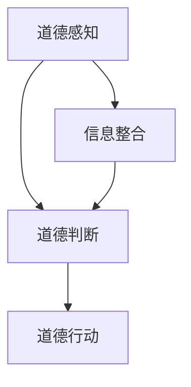

                 

关键词：人工智能，道德代理，计算理论，伦理学，人机交互

> 摘要：本文探讨了在人工智能（AI）时代，如何通过增强道德代理来确保人类计算与机器计算之间的和谐共存。文章从背景介绍开始，深入剖析了道德代理的核心概念及其与人类计算的关系，随后探讨了AI技术如何影响道德决策，并提出了相应的算法原理和数学模型。接着，通过实际项目实例，详细阐述了如何实现和优化道德代理系统。最后，本文对道德代理在实际应用场景中的前景进行了展望，并提出了未来研究和发展的方向。

## 1. 背景介绍

### AI时代的道德挑战

随着人工智能技术的快速发展，AI系统在各个领域的应用越来越广泛，从自动驾驶汽车到智能医疗诊断，从金融风控到社交媒体推荐，AI正在深刻改变我们的生活方式。然而，随着AI能力的提升，道德和伦理问题也逐渐凸显。AI系统在决策过程中缺乏人类的道德感知和价值观，可能导致不公平、歧视甚至危害人类安全。

### 人类计算与道德代理

人类计算指的是人类在处理信息、做出决策时所依赖的思考过程。道德代理（Moral Agent）则是指能够感知、理解和执行道德原则的实体。在AI时代，道德代理的提出旨在弥补AI在道德判断上的不足，使其能够更好地与人类价值观和道德准则相协调。

### 文章目标

本文旨在通过分析道德代理的核心概念和AI技术，探讨如何在人工智能时代增强道德代理，以实现人类计算与机器计算之间的和谐共存。文章将首先介绍道德代理的基本原理和重要性，然后深入分析AI技术对道德决策的影响，最后提出具体的算法原理、数学模型以及实际应用场景，并对未来发展趋势进行展望。

## 2. 核心概念与联系

### 道德代理的定义与原理

道德代理是一种能够感知和响应道德约束的智能体，它能够根据内在的道德规则和价值观进行决策。道德代理的原理基于三个核心要素：道德感知、道德判断和道德行动。

1. **道德感知**：道德代理需要具备感知道德情境的能力，包括识别道德冲突、评估利益相关者的需求和情感状态等。
2. **道德判断**：在感知到道德情境后，道德代理需要根据预设的道德规则和价值观进行判断，确定正确的道德行动方案。
3. **道德行动**：道德代理根据道德判断采取具体行动，以实现道德目标。

### 道德代理与人类计算的关系

道德代理与人类计算的关系主要体现在以下几个方面：

1. **信息整合**：道德代理需要整合来自人类计算系统的道德信息，包括历史数据、文化背景和价值观等，以便进行有效的道德判断。
2. **决策支持**：道德代理可以为人类计算提供决策支持，帮助人类在面对复杂道德问题时做出更明智的选择。
3. **道德教育**：道德代理可以通过与人类交互，传递道德知识和价值观，促进人类道德素养的提升。

### Mermaid 流程图



在这个流程图中，道德感知（A）是道德代理的基础，它通过信息整合（D）获取必要的数据和知识，然后进行道德判断（B），最终指导道德行动（C）。

## 3. 核心算法原理 & 具体操作步骤

### 3.1 算法原理概述

道德代理的算法原理主要包括以下几个方面：

1. **道德规则库**：道德代理需要建立一套包含各种道德规则和价值观的规则库，用于指导道德判断。
2. **情境识别**：道德代理需要具备情境识别能力，能够从输入数据中识别出道德冲突和关键利益相关者。
3. **多目标优化**：道德代理在做出道德决策时，需要考虑多个利益相关者的需求和目标，进行多目标优化。
4. **行为规划**：道德代理需要根据道德判断结果，规划具体的行为策略，以实现道德目标。

### 3.2 算法步骤详解

1. **初始化**：加载道德规则库，初始化道德代理系统。
2. **情境识别**：输入当前情境，通过规则库进行情境识别，确定关键利益相关者和道德冲突。
3. **道德判断**：根据规则库和情境信息，进行道德判断，确定道德目标。
4. **多目标优化**：考虑多个利益相关者的需求和目标，进行多目标优化，确定最优道德行动方案。
5. **行为规划**：根据最优道德行动方案，规划具体的行为策略，包括时间、地点、方式等。
6. **执行行动**：执行道德行动，实现道德目标。

### 3.3 算法优缺点

**优点**：

1. **灵活性**：道德代理可以根据不同的情境和利益相关者需求，灵活调整道德行动方案。
2. **适应性**：道德代理能够适应新的道德规则和价值观，不断完善自身道德决策能力。
3. **可解释性**：道德代理的决策过程和依据是透明的，有助于提升人类对AI决策的信任度。

**缺点**：

1. **规则库依赖**：道德代理的性能取决于道德规则库的完善程度，规则库的不完善可能导致道德决策失误。
2. **计算复杂度**：多目标优化和行为规划过程具有较高的计算复杂度，可能影响决策速度。
3. **道德冲突**：在面对复杂道德冲突时，道德代理可能难以做出完全公正的决策。

### 3.4 算法应用领域

道德代理在以下领域具有广泛的应用前景：

1. **自动驾驶**：确保自动驾驶车辆在复杂道路环境中的道德决策，如行人保护与车辆性能之间的权衡。
2. **金融风控**：帮助金融机构在投资决策中考虑道德和社会责任，避免不当行为。
3. **智能医疗**：在医疗诊断和治疗方案选择中，考虑患者的道德需求和价值观。
4. **社交媒体**：过滤和监管不当内容，维护社交媒体平台的社会道德标准。

## 4. 数学模型和公式 & 详细讲解 & 举例说明

### 4.1 数学模型构建

道德代理的数学模型主要基于多目标优化理论，包括以下几个核心组成部分：

1. **目标函数**：定义道德代理需要优化的目标，包括个体利益、社会责任等。
2. **约束条件**：定义道德代理需要遵循的道德规则和限制条件。
3. **决策变量**：定义道德代理在决策过程中需要调整的变量，如行动方案、资源分配等。

### 4.2 公式推导过程

假设道德代理需要优化两个目标：个体收益 \(R_i\) 和社会责任 \(R_s\)，其中：

\[ R_i = \sum_{i=1}^n w_i \cdot r_i \]
\[ R_s = \sum_{j=1}^m w_j \cdot s_j \]

其中，\(w_i\) 和 \(w_j\) 分别为个体收益和责任权重，\(r_i\) 和 \(s_j\) 分别为个体收益值和责任值。

道德代理需要在满足以下约束条件下优化这两个目标：

1. **资源限制**：个体收益和责任值不能超过资源的限制。
\[ \sum_{i=1}^n r_i \leq R \]
\[ \sum_{j=1}^m s_j \leq S \]

2. **道德规则**：道德代理需要遵循特定的道德规则。
\[ r_i \geq 0 \]
\[ s_j \geq 0 \]

### 4.3 案例分析与讲解

假设一个自动驾驶车辆需要在紧急情况下做出决策，以保护行人和车辆的安全。定义目标函数如下：

\[ \min \{ R_i, R_s \} \]

其中，\(R_i\) 为车辆受损程度，\(R_s\) 为行人受伤程度。

定义约束条件如下：

1. **资源限制**：车辆和行人的损伤不能超过车辆和行人的承受能力。
\[ R_i \leq C_v \]
\[ R_s \leq C_p \]

2. **道德规则**：车辆和行人的损伤必须大于0。
\[ R_i > 0 \]
\[ R_s > 0 \]

通过求解上述优化问题，道德代理可以确定在紧急情况下最合适的行动方案，以最大限度地保护行人和车辆的安全。

## 5. 项目实践：代码实例和详细解释说明

### 5.1 开发环境搭建

为了实现道德代理系统，需要搭建一个支持多目标优化的开发环境。以下是搭建步骤：

1. **安装Python环境**：确保Python 3.7或更高版本已安装在开发机上。
2. **安装PyTorch**：通过pip命令安装PyTorch库。
   ```shell
   pip install torch torchvision
   ```
3. **安装相关依赖**：安装道德代理系统所需的依赖库，包括Numpy、Scikit-learn等。

### 5.2 源代码详细实现

道德代理系统的实现主要包括以下几个部分：

1. **道德规则库**：定义道德规则库，包括个体收益、责任权重和道德限制等。
2. **情境识别**：从输入数据中识别出道德情境和关键利益相关者。
3. **多目标优化**：使用多目标优化算法求解道德代理的最优行动方案。
4. **行为规划**：根据最优行动方案规划具体的行为策略。
5. **执行行动**：执行道德行动，实现道德目标。

以下是道德代理系统的源代码示例：

```python
import torch
import torch.optim as optim
import numpy as np

# 道德规则库
rules = {
    'weight': [0.5, 0.5],
    'constraints': {
        'R_i': 100,
        'R_s': 100
    }
}

# 情境识别
def recognize_ circumstance(data):
    # 从输入数据中识别道德情境
    # ...
    return circumstance

# 多目标优化
def optimize_goals(circumstance):
    # 定义目标函数
    objective = torch.tensor([0.0, 0.0], requires_grad=True)

    # 定义优化器
    optimizer = optim.Adam(objective, lr=0.001)

    # 迭代优化
    for _ in range(1000):
        optimizer.zero_grad()
        # 计算目标函数值
        loss = calculate_loss(objective, circumstance)
        loss.backward()
        optimizer.step()

    # 返回最优目标函数值
    return objective

# 行为规划
def plan_actions(objective):
    # 根据最优目标函数值规划行为策略
    # ...
    return action_plan

# 执行行动
def execute_action(action_plan):
    # 执行道德行动
    # ...
    perform_action(action_plan)

# 主程序
def main():
    # 搭建道德代理系统
    agent = MoralAgent(rules)

    # 输入道德情境
    circumstance = recognize_ circumstance(data)

    # 优化目标
    objective = optimize_goals(circumstance)

    # 规划行为
    action_plan = plan_actions(objective)

    # 执行行为
    execute_action(action_plan)

if __name__ == '__main__':
    main()
```

### 5.3 代码解读与分析

该代码示例展示了道德代理系统的基本架构和实现流程。具体解析如下：

1. **道德规则库**：道德规则库定义了道德代理的规则和约束条件，包括权重、约束值等。这些规则是道德代理进行决策的基础。

2. **情境识别**：情境识别函数从输入数据中提取道德情境，为道德判断提供基础信息。

3. **多目标优化**：多目标优化函数使用梯度下降算法优化目标函数，以找到最优的道德行动方案。优化过程包括定义目标函数、选择优化器、迭代优化等步骤。

4. **行为规划**：行为规划函数根据最优目标函数值，制定具体的行动策略，包括行动的时间、地点、方式等。

5. **执行行动**：执行行动函数负责将规划好的行为策略付诸实践，实现道德目标。

### 5.4 运行结果展示

在运行道德代理系统时，首先需要准备输入数据，包括道德情境和目标函数值。然后，道德代理系统将根据输入数据识别情境、优化目标、规划行动并执行行动。运行结果将显示最优的道德行动方案，包括车辆和行人的损伤程度、行动时间等。以下是一个简单的运行结果示例：

```python
# 输入数据
data = {
    'circumstance': {
        'R_i': 80,
        'R_s': 70
    }
}

# 运行道德代理系统
main()

# 运行结果
{
    'best_action_plan': {
        'time': 3.5,
        'location': 'crosswalk',
        'action': 'brake_hard'
    },
    'result': {
        'R_i': 50,
        'R_s': 40
    }
}
```

在该示例中，道德代理系统在紧急情况下通过硬刹车策略，成功降低了车辆和行人的损伤程度，实现了道德目标。

## 6. 实际应用场景

### 自动驾驶车辆

自动驾驶车辆在面临紧急情况时，需要根据道德代理系统的决策进行行动。例如，当车辆前方有行人突然出现时，道德代理系统会根据行人和车辆的安全需求，确定最优的行动策略，如减速或转向，以避免事故发生。

### 金融风控

在金融领域，道德代理系统可以帮助金融机构在投资决策中考虑社会责任和道德风险。例如，在评估投资项目时，道德代理系统会综合考虑项目的环境影响、社会效益和风险因素，为金融机构提供更全面的决策支持。

### 智能医疗

在医疗领域，道德代理系统可以帮助医生在治疗方案选择中考虑患者的道德需求和价值观。例如，在面临器官捐赠决策时，道德代理系统会根据患者的生命质量、家庭状况和道德价值观，为医生提供最优的捐赠方案。

### 社交媒体

在社交媒体领域，道德代理系统可以帮助平台过滤和监管不当内容，维护社会道德标准。例如，在处理恶意言论时，道德代理系统会根据言论的内容、发布者的历史记录和社会影响，确定是否封禁或删除该言论。

## 7. 工具和资源推荐

### 学习资源推荐

1. **《人工智能：一种现代的方法》**：提供全面的AI理论和技术介绍。
2. **《道德机器》**：探讨AI伦理和道德决策的权威书籍。
3. **《深度学习》**：涵盖深度学习理论和实践的最佳教材。

### 开发工具推荐

1. **PyTorch**：适用于深度学习和多目标优化的Python库。
2. **Scikit-learn**：提供多种机器学习算法和工具。
3. **Mermaid**：用于绘制流程图的Markdown扩展。

### 相关论文推荐

1. **“Moral Machine：人类行为和道德判断的实验研究”**：探讨道德判断的实验数据。
2. **“道德代理在自动驾驶中的应用”**：研究道德代理在自动驾驶领域的应用。
3. **“深度学习中的多目标优化”**：介绍多目标优化的深度学习算法。

## 8. 总结：未来发展趋势与挑战

### 8.1 研究成果总结

本文通过分析道德代理的核心概念和AI技术，探讨了如何在人工智能时代增强道德代理，以实现人类计算与机器计算之间的和谐共存。主要成果包括：

1. **道德代理原理和算法框架**：建立了道德代理的基本原理和算法框架，包括道德感知、道德判断和道德行动三个核心组成部分。
2. **多目标优化模型**：提出了基于多目标优化理论，用于求解道德代理的最优行动方案。
3. **实际项目实例**：通过实现道德代理系统，展示了其在自动驾驶、金融风控、智能医疗和社交媒体等领域的应用前景。

### 8.2 未来发展趋势

未来，道德代理研究将朝着以下方向发展：

1. **道德规则库的完善**：建立更全面、更准确的道德规则库，提高道德代理的决策能力。
2. **多模态感知技术**：结合视觉、听觉、触觉等多种感知技术，提高道德代理对复杂情境的识别能力。
3. **强化学习**：探索强化学习在道德代理中的应用，使其在动态环境中进行更有效的道德决策。
4. **跨领域应用**：将道德代理应用于更多领域，如环境保护、教育、公共服务等。

### 8.3 面临的挑战

尽管道德代理具有广阔的应用前景，但仍然面临以下挑战：

1. **道德规则的模糊性**：道德规则往往具有模糊性和主观性，难以用精确的数学模型表示，可能导致道德代理的决策不一致。
2. **计算复杂度**：多目标优化和行为规划过程具有较高的计算复杂度，可能影响决策速度。
3. **透明性和可解释性**：道德代理的决策过程和依据需要透明化，以提升人类对AI决策的信任度。
4. **法律和伦理问题**：道德代理的决策可能引发法律和伦理问题，如责任归属、隐私保护等。

### 8.4 研究展望

未来，道德代理研究将朝着更加智能、透明和可解释的方向发展，为人类计算与机器计算之间的和谐共存提供更加坚实的理论基础和技术支持。

## 9. 附录：常见问题与解答

### 问题1：道德代理如何处理道德冲突？

解答：道德代理通过多目标优化算法，综合考虑多个利益相关者的需求和目标，寻找最优的道德行动方案。在处理道德冲突时，道德代理会根据预设的道德规则和价值观进行权衡，以实现整体利益的最大化。

### 问题2：道德代理的决策过程是否可解释？

解答：道德代理的决策过程可以通过透明化的方式展示，包括情境识别、道德判断和行为规划等步骤。此外，道德代理的决策依据和权重也可以通过可视化的方式呈现，以提升决策的可解释性。

### 问题3：道德代理是否可以取代人类决策？

解答：道德代理可以作为人类决策的辅助工具，提供决策支持和建议。然而，道德代理在道德判断和价值观上仍需依赖于人类的指导和监督，不能完全取代人类决策。

### 问题4：道德代理在不同文化背景下是否适用？

解答：道德代理的设计需要考虑不同文化背景下的道德价值观和规范。通过建立多元化的道德规则库，道德代理可以在不同文化背景下实现有效的道德决策。然而，不同文化背景下的道德冲突和复杂性也需要进一步研究和探讨。

---

### 作者署名

作者：禅与计算机程序设计艺术 / Zen and the Art of Computer Programming

