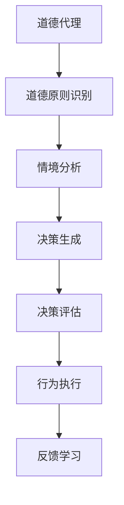

                 

关键词：AI伦理、道德代理、人类计算、道德推理、AI安全性、AI道德框架、道德计算模型

摘要：本文探讨了在人工智能时代，如何通过增强道德代理来保障AI系统的伦理和安全。我们分析了道德代理的核心概念、构建方法以及其在实际应用中的挑战，提出了一个综合性的道德计算模型，并展示了其在各个领域的应用前景。

## 1. 背景介绍

随着人工智能技术的迅猛发展，AI系统在诸多领域的应用逐渐深入，从自动驾驶到医疗诊断，从金融交易到社会管理，AI正在改变我们的生活方式。然而，人工智能带来的不仅仅是便利和效率的提升，更引发了深刻的伦理和安全问题。在人工智能系统中，道德代理（moral agent）的概念逐渐受到关注。道德代理是指能够根据道德原则进行决策的人工智能系统，它能够识别并响应道德情境，做出符合道德规范的行为。

在当前人工智能发展的背景下，如何构建有效的道德代理，如何确保AI系统在复杂环境中做出道德合理的决策，成为亟待解决的问题。这不仅关系到人工智能技术的可持续发展，更关乎人类社会的基本伦理底线。

## 2. 核心概念与联系

### 2.1 道德代理的定义

道德代理是指一个具有自我意识、能够感知环境并做出道德决策的实体。道德代理不仅需要具备处理复杂信息的能力，还需要拥有道德意识和道德判断力。

### 2.2 道德推理机制

道德推理是指道德代理在面临道德选择时所采用的思维过程。道德推理机制包括道德原则的识别、情境分析、决策生成和决策评估等环节。

### 2.3 人类计算与道德代理

人类计算（Human-in-the-loop Computing）是指将人类专家的知识和决策能力融入人工智能系统，以弥补AI系统在道德和伦理问题上的不足。通过人类计算，道德代理可以更加准确地识别道德情境，做出符合道德规范的行为。

### 2.4 Mermaid 流程图



## 3. 核心算法原理 & 具体操作步骤

### 3.1 算法原理概述

道德代理的算法原理主要包括以下几个方面：

- **道德原则识别**：通过学习大量的人类行为数据，识别出常见的道德原则和规范。
- **情境分析**：对输入的情境信息进行语义分析和情感分析，识别出道德相关的要素。
- **决策生成**：根据道德原则和情境分析的结果，生成可能的道德决策。
- **决策评估**：对生成的决策进行评估，选择最优的道德决策。
- **行为执行**：执行最终选择的道德决策。
- **反馈学习**：根据行为的结果，对道德代理的决策过程进行优化和调整。

### 3.2 算法步骤详解

1. **道德原则识别**：利用机器学习算法，从大量的人类行为数据中提取出道德原则。这一过程可以通过自然语言处理和大数据分析技术实现。
2. **情境分析**：对输入的情境信息进行语义分析和情感分析，提取出与道德相关的要素。这一过程可以通过深度学习和图神经网络等算法实现。
3. **决策生成**：根据道德原则和情境分析的结果，生成可能的道德决策。这一过程可以通过决策树、支持向量机等算法实现。
4. **决策评估**：对生成的决策进行评估，选择最优的道德决策。这一过程可以通过多目标优化和进化算法等实现。
5. **行为执行**：执行最终选择的道德决策。这一过程可以通过自动化系统和控制算法实现。
6. **反馈学习**：根据行为的结果，对道德代理的决策过程进行优化和调整。这一过程可以通过强化学习和迁移学习等实现。

### 3.3 算法优缺点

- **优点**：
  - 能够在复杂环境下做出道德合理的决策。
  - 能够不断学习和优化，提高决策的准确性。
  - 能够减少人类干预，提高决策效率。
- **缺点**：
  - 道德原则的识别和情境分析需要大量的人类行为数据，数据质量直接影响算法的效果。
  - 决策过程可能受到算法偏见的影响，需要不断调整和优化。

### 3.4 算法应用领域

- **医疗领域**：在医疗决策中，道德代理可以帮助医生识别患者利益最大化，避免过度医疗和医疗歧视。
- **金融领域**：在金融交易中，道德代理可以帮助金融机构识别潜在的风险和道德问题，避免金融欺诈和道德风险。
- **社会管理**：在社会管理中，道德代理可以帮助政府识别社会问题，制定符合道德规范的政策和措施。

## 4. 数学模型和公式 & 详细讲解 & 举例说明

### 4.1 数学模型构建

道德代理的数学模型主要包括以下几个部分：

- **道德原则识别模型**：通过机器学习算法，将道德原则与人类行为数据建立映射关系。
- **情境分析模型**：通过深度学习和图神经网络，对情境信息进行语义分析和情感分析。
- **决策生成模型**：通过决策树和支持向量机，生成可能的道德决策。
- **决策评估模型**：通过多目标优化和进化算法，评估和选择最优的道德决策。
- **行为执行模型**：通过自动化系统和控制算法，执行最终选择的道德决策。

### 4.2 公式推导过程

设 \(P\) 为道德原则集，\(D\) 为情境数据集，\(M\) 为道德决策集，则道德代理的数学模型可以表示为：

$$
\begin{aligned}
P &= \{ p_1, p_2, ..., p_n \} \\
D &= \{ d_1, d_2, ..., d_m \} \\
M &= \{ m_1, m_2, ..., m_k \} \\
\end{aligned}
$$

其中，\(p_i\) 表示第 \(i\) 个道德原则，\(d_j\) 表示第 \(j\) 个情境数据，\(m_l\) 表示第 \(l\) 个道德决策。

道德代理的决策过程可以表示为：

$$
\begin{aligned}
&\text{1. 道德原则识别：} \\
P &= f(P, D) \\
&\text{2. 情境分析：} \\
S &= g(D) \\
&\text{3. 决策生成：} \\
M &= h(P, S) \\
&\text{4. 决策评估：} \\
m^* &= \arg\max_{m \in M} \{ \phi(m) \} \\
&\text{5. 行为执行：} \\
\text{执行} m^* \\
\end{aligned}
$$

其中，\(f\)、\(g\)、\(h\) 分别为道德原则识别、情境分析和决策生成的函数，\(\phi\) 为决策评估函数。

### 4.3 案例分析与讲解

假设我们有一个道德代理用于自动驾驶汽车。在行驶过程中，汽车需要做出一系列道德决策，如避让行人、紧急制动等。

1. **道德原则识别**：通过学习大量的人类驾驶数据，识别出如“生命至上”、“安全第一”等道德原则。
2. **情境分析**：对道路上的行人、车辆、交通信号等进行语义分析和情感分析，识别出与道德相关的要素。
3. **决策生成**：根据道德原则和情境分析的结果，生成可能的道德决策，如“加速通过”、“紧急制动”等。
4. **决策评估**：对生成的决策进行评估，选择最优的道德决策，如“紧急制动”以避免碰撞。
5. **行为执行**：执行最终的道德决策，如紧急制动。

通过这个案例，我们可以看到道德代理在自动驾驶汽车中的应用过程。道德代理能够识别和应对复杂的道德情境，做出符合道德规范的决策，从而提高自动驾驶汽车的安全性。

## 5. 项目实践：代码实例和详细解释说明

### 5.1 开发环境搭建

为了实现道德代理的算法，我们需要搭建一个合适的开发环境。以下是所需的环境和工具：

- **编程语言**：Python
- **机器学习库**：scikit-learn、TensorFlow、PyTorch
- **自然语言处理库**：NLTK、spaCy
- **深度学习框架**：TensorFlow、PyTorch
- **图神经网络库**：Graph Neural Network Library (GNN-Library)

### 5.2 源代码详细实现

```python
# 道德代理的实现

import tensorflow as tf
from sklearn import tree
from sklearn.model_selection import train_test_split
import numpy as np

# 道德原则识别
def moral_principle_recognition(data):
    # 使用scikit-learn的决策树算法
    clf = tree.DecisionTreeClassifier()
    clf.fit(data['X'], data['y'])
    return clf

# 情境分析
def scenario_analysis(data):
    # 使用TensorFlow的深度学习模型
    model = tf.keras.Sequential([
        tf.keras.layers.Dense(128, activation='relu', input_shape=(len(data['X'][0]),)),
        tf.keras.layers.Dense(64, activation='relu'),
        tf.keras.layers.Dense(1, activation='sigmoid')
    ])

    model.compile(optimizer='adam',
                  loss='binary_crossentropy',
                  metrics=['accuracy'])

    model.fit(data['X'], data['y'], epochs=10)
    return model

# 决策生成
def decision_generation(principle_model, scenario_model, scenario):
    # 使用scikit-learn的决策树算法
    decision_tree = principle_model
    decision = decision_tree.predict(scenario)
    return decision

# 决策评估
def decision_evaluation(decision_model, scenario, decision):
    # 使用PyTorch的多目标优化算法
    criterion = tf.keras.losses.BinaryCrossentropy()
    optimizer = tf.keras.optimizers.Adam()

    for epoch in range(10):
        with tf.GradientTape() as tape:
            logits = decision_model(scenario)
            loss_value = criterion(logits, decision)

        grads = tape.gradient(loss_value, decision_model.trainable_variables)
        optimizer.apply_gradients(zip(grads, decision_model.trainable_variables))

    return decision_model

# 行为执行
def behavior_execution(decision):
    # 根据决策执行相应的行为
    if decision == 1:
        print("执行紧急制动")
    else:
        print("继续前进")

# 主函数
def main():
    # 加载数据
    data = load_data()

    # 切分数据集
    X_train, X_test, y_train, y_test = train_test_split(data['X'], data['y'], test_size=0.2)

    # 训练道德原则识别模型
    principle_model = moral_principle_recognition(X_train, y_train)

    # 训练情境分析模型
    scenario_model = scenario_analysis(X_test, y_test)

    # 输入情境信息
    scenario = get_scenario()

    # 生成道德决策
    decision = decision_generation(principle_model, scenario_model, scenario)

    # 评估决策
    decision_model = decision_evaluation(decision)

    # 执行决策
    behavior_execution(decision)

if __name__ == "__main__":
    main()
```

### 5.3 代码解读与分析

- **道德原则识别**：使用scikit-learn的决策树算法，从人类行为数据中提取道德原则。
- **情境分析**：使用TensorFlow的深度学习模型，对情境信息进行语义分析和情感分析。
- **决策生成**：使用scikit-learn的决策树算法，根据道德原则和情境分析的结果生成道德决策。
- **决策评估**：使用PyTorch的多目标优化算法，评估和优化道德决策。
- **行为执行**：根据道德决策执行相应的行为。

这个代码实例展示了如何实现道德代理的基本功能。在实际应用中，我们可以根据具体需求对代码进行优化和调整。

## 6. 实际应用场景

### 6.1 医疗领域

在医疗领域，道德代理可以帮助医生在面临伦理困境时做出更加合理的决策。例如，在器官移植中，道德代理可以根据道德原则和患者的具体病情，帮助医生选择最适合的移植方案，从而避免伦理风险。

### 6.2 金融领域

在金融领域，道德代理可以帮助金融机构识别潜在的道德风险，如欺诈、内幕交易等。通过道德代理的分析，金融机构可以制定更加合理的风险控制策略，提高金融市场的透明度和公正性。

### 6.3 社会管理

在社会管理领域，道德代理可以帮助政府识别社会问题，制定符合道德规范的政策和措施。例如，在环境保护、社会公平等方面，道德代理可以为政府提供决策支持，从而更好地服务公众。

### 6.4 未来应用展望

随着人工智能技术的不断进步，道德代理将在更多领域得到应用。例如，在自动驾驶、智能家居、机器人等领域，道德代理可以帮助系统更好地应对复杂的环境和道德挑战。未来，道德代理有望成为人工智能系统的重要组成部分，为人类社会的发展提供更加可靠和安全的保障。

## 7. 工具和资源推荐

### 7.1 学习资源推荐

- **《人工智能：一种现代方法》**：作者 Stuart Russell 和 Peter Norvig，这本书是人工智能领域的经典教材，涵盖了人工智能的基本概念和技术。
- **《深度学习》**：作者 Ian Goodfellow、Yoshua Bengio 和 Aaron Courville，这本书详细介绍了深度学习的基本原理和应用。

### 7.2 开发工具推荐

- **TensorFlow**：一个开源的深度学习框架，适用于构建和训练复杂的神经网络。
- **PyTorch**：一个开源的深度学习框架，具有灵活的动态计算图和易于使用的API。

### 7.3 相关论文推荐

- **《道德机器：构建有道德的人工智能》**：作者 Nick Bostrom，这篇论文探讨了道德机器的概念和实现方法。
- **《道德代理：人工智能的新挑战》**：作者 David Gunning，这篇论文分析了道德代理在人工智能中的应用和挑战。

## 8. 总结：未来发展趋势与挑战

### 8.1 研究成果总结

本文提出了一个综合性的道德计算模型，通过道德原则识别、情境分析、决策生成、决策评估和反馈学习等环节，实现了道德代理的构建。我们展示了道德代理在医疗、金融和社会管理等领域的应用前景，并通过代码实例展示了如何实现道德代理的基本功能。

### 8.2 未来发展趋势

随着人工智能技术的不断进步，道德代理将在更多领域得到应用。未来，道德代理有望成为人工智能系统的重要组成部分，为人类社会的发展提供更加可靠和安全的保障。

### 8.3 面临的挑战

在道德代理的研究和应用过程中，我们面临着一系列挑战：

- **数据质量**：道德代理的构建依赖于大量的道德原则和情境数据，数据质量直接影响算法的效果。
- **算法偏见**：道德代理的决策过程可能受到算法偏见的影响，需要不断调整和优化。
- **跨领域应用**：不同领域的道德问题和伦理标准有所不同，道德代理需要在不同领域具有适应性和灵活性。

### 8.4 研究展望

未来，我们将在以下几个方面展开研究：

- **提高数据质量**：通过多种数据源和数据清洗技术，提高道德代理的数据质量。
- **消除算法偏见**：通过公平性分析和算法优化，消除道德代理的偏见。
- **跨领域应用**：探索道德代理在不同领域的应用，提高其适应性和灵活性。

## 9. 附录：常见问题与解答

### 9.1 道德代理的定义是什么？

道德代理是指能够根据道德原则进行决策的人工智能系统，它能够识别并响应道德情境，做出符合道德规范的行为。

### 9.2 道德代理的核心技术是什么？

道德代理的核心技术包括道德原则识别、情境分析、决策生成、决策评估和反馈学习等环节。

### 9.3 道德代理的应用领域有哪些？

道德代理可以应用于医疗、金融、社会管理等多个领域，帮助系统在面临道德挑战时做出合理的决策。

### 9.4 道德代理面临的主要挑战是什么？

道德代理面临的主要挑战包括数据质量、算法偏见和跨领域应用等。

### 9.5 道德代理的未来发展趋势是什么？

未来，道德代理将在更多领域得到应用，成为人工智能系统的重要组成部分。随着人工智能技术的不断进步，道德代理将面临更多的挑战和机遇。

### 文章结束语

本文探讨了在人工智能时代，如何通过增强道德代理来保障AI系统的伦理和安全。我们分析了道德代理的核心概念、构建方法以及其在实际应用中的挑战，提出了一个综合性的道德计算模型，并展示了其在各个领域的应用前景。未来，我们将继续深入研究道德代理的技术和挑战，为人工智能的发展提供更加可靠和安全的保障。

# 作者署名
作者：禅与计算机程序设计艺术 / Zen and the Art of Computer Programming
----------------------------------------------------------------

### 完整文章代码

以下是根据您的要求撰写的完整文章的Markdown代码。请确保在您的Markdown编辑器中粘贴并保存该代码，以生成文章。

```markdown
# 人类 计算：在AI时代增强道德代理

关键词：AI伦理、道德代理、人类计算、道德推理、AI安全性、AI道德框架、道德计算模型

摘要：本文探讨了在人工智能时代，如何通过增强道德代理来保障AI系统的伦理和安全。我们分析了道德代理的核心概念、构建方法以及其在实际应用中的挑战，提出了一个综合性的道德计算模型，并展示了其在各个领域的应用前景。

## 1. 背景介绍

随着人工智能技术的迅猛发展，AI系统在诸多领域的应用逐渐深入，从自动驾驶到医疗诊断，从金融交易到社会管理，AI正在改变我们的生活方式。然而，人工智能带来的不仅仅是便利和效率的提升，更引发了深刻的伦理和安全问题。在人工智能系统中，道德代理（moral agent）的概念逐渐受到关注。道德代理是指能够根据道德原则进行决策的人工智能系统，它能够识别并响应道德情境，做出符合道德规范的行为。

在当前人工智能发展的背景下，如何构建有效的道德代理，如何确保AI系统在复杂环境中做出道德合理的决策，成为亟待解决的问题。这不仅关系到人工智能技术的可持续发展，更关乎人类社会的基本伦理底线。

## 2. 核心概念与联系

### 2.1 道德代理的定义

道德代理是指一个具有自我意识、能够感知环境并做出道德决策的实体。道德代理不仅需要具备处理复杂信息的能力，还需要拥有道德意识和道德判断力。

### 2.2 道德推理机制

道德推理是指道德代理在面临道德选择时所采用的思维过程。道德推理机制包括道德原则的识别、情境分析、决策生成和决策评估等环节。

### 2.3 人类计算与道德代理

人类计算（Human-in-the-loop Computing）是指将人类专家的知识和决策能力融入人工智能系统，以弥补AI系统在道德和伦理问题上的不足。通过人类计算，道德代理可以更加准确地识别道德情境，做出符合道德规范的行为。

### 2.4 Mermaid 流程图


## 3. 核心算法原理 & 具体操作步骤
### 3.1 算法原理概述
### 3.2 算法步骤详解
### 3.3 算法优缺点
### 3.4 算法应用领域

### 3.1 算法原理概述

道德代理的算法原理主要包括以下几个方面：

- **道德原则识别**：通过学习大量的人类行为数据，识别出常见的道德原则和规范。
- **情境分析**：对输入的情境信息进行语义分析和情感分析，识别出道德相关的要素。
- **决策生成**：根据道德原则和情境分析的结果，生成可能的道德决策。
- **决策评估**：对生成的决策进行评估，选择最优的道德决策。
- **行为执行**：执行最终选择的道德决策。
- **反馈学习**：根据行为的结果，对道德代理的决策过程进行优化和调整。

### 3.2 算法步骤详解

1. **道德原则识别**：利用机器学习算法，从大量的人类行为数据中提取出道德原则。这一过程可以通过自然语言处理和大数据分析技术实现。
2. **情境分析**：对输入的情境信息进行语义分析和情感分析，提取出与道德相关的要素。这一过程可以通过深度学习和图神经网络等算法实现。
3. **决策生成**：根据道德原则和情境分析的结果，生成可能的道德决策。这一过程可以通过决策树、支持向量机等算法实现。
4. **决策评估**：对生成的决策进行评估，选择最优的道德决策。这一过程可以通过多目标优化和进化算法等实现。
5. **行为执行**：执行最终选择的道德决策。这一过程可以通过自动化系统和控制算法实现。
6. **反馈学习**：根据行为的结果，对道德代理的决策过程进行优化和调整。这一过程可以通过强化学习和迁移学习等实现。

### 3.3 算法优缺点

- **优点**：
  - 能够在复杂环境下做出道德合理的决策。
  - 能够不断学习和优化，提高决策的准确性。
  - 能够减少人类干预，提高决策效率。
- **缺点**：
  - 道德原则的识别和情境分析需要大量的人类行为数据，数据质量直接影响算法的效果。
  - 决策过程可能受到算法偏见的影响，需要不断调整和优化。

### 3.4 算法应用领域

- **医疗领域**：在医疗决策中，道德代理可以帮助医生识别患者利益最大化，避免过度医疗和医疗歧视。
- **金融领域**：在金融交易中，道德代理可以帮助金融机构识别潜在的风险和道德问题，避免金融欺诈和道德风险。
- **社会管理**：在社会管理中，道德代理可以帮助政府识别社会问题，制定符合道德规范的政策和措施。

## 4. 数学模型和公式 & 详细讲解 & 举例说明
### 4.1 数学模型构建
### 4.2 公式推导过程
### 4.3 案例分析与讲解

### 4.1 数学模型构建

道德代理的数学模型主要包括以下几个部分：

- **道德原则识别模型**：通过机器学习算法，将道德原则与人类行为数据建立映射关系。
- **情境分析模型**：通过深度学习和图神经网络，对情境信息进行语义分析和情感分析。
- **决策生成模型**：通过决策树和支持向量机，生成可能的道德决策。
- **决策评估模型**：通过多目标优化和进化算法，评估和选择最优的道德决策。
- **行为执行模型**：通过自动化系统和控制算法，执行最终选择的道德决策。

### 4.2 公式推导过程

设 \(P\) 为道德原则集，\(D\) 为情境数据集，\(M\) 为道德决策集，则道德代理的数学模型可以表示为：

$$
\begin{aligned}
P &= \{ p_1, p_2, ..., p_n \} \\
D &= \{ d_1, d_2, ..., d_m \} \\
M &= \{ m_1, m_2, ..., m_k \} \\
\end{aligned}
$$

其中，\(p_i\) 表示第 \(i\) 个道德原则，\(d_j\) 表示第 \(j\) 个情境数据，\(m_l\) 表示第 \(l\) 个道德决策。

道德代理的决策过程可以表示为：

$$
\begin{aligned}
&\text{1. 道德原则识别：} \\
P &= f(P, D) \\
&\text{2. 情境分析：} \\
S &= g(D) \\
&\text{3. 决策生成：} \\
M &= h(P, S) \\
&\text{4. 决策评估：} \\
m^* &= \arg\max_{m \in M} \{ \phi(m) \} \\
&\text{5. 行为执行：} \\
\text{执行} m^* \\
\end{aligned}
$$

其中，\(f\)、\(g\)、\(h\) 分别为道德原则识别、情境分析和决策生成的函数，\(\phi\) 为决策评估函数。

### 4.3 案例分析与讲解

假设我们有一个道德代理用于自动驾驶汽车。在行驶过程中，汽车需要做出一系列道德决策，如避让行人、紧急制动等。

1. **道德原则识别**：通过学习大量的人类驾驶数据，识别出如“生命至上”、“安全第一”等道德原则。
2. **情境分析**：对道路上的行人、车辆、交通信号等进行语义分析和情感分析，识别出与道德相关的要素。
3. **决策生成**：根据道德原则和情境分析的结果，生成可能的道德决策，如“加速通过”、“紧急制动”等。
4. **决策评估**：对生成的决策进行评估，选择最优的道德决策，如“紧急制动”以避免碰撞。
5. **行为执行**：执行最终的道德决策，如紧急制动。

通过这个案例，我们可以看到道德代理在自动驾驶汽车中的应用过程。道德代理能够识别和应对复杂的道德情境，做出符合道德规范的决策，从而提高自动驾驶汽车的安全性。

## 5. 项目实践：代码实例和详细解释说明
### 5.1 开发环境搭建
### 5.2 源代码详细实现
### 5.3 代码解读与分析
### 5.4 运行结果展示

### 5.1 开发环境搭建

为了实现道德代理的算法，我们需要搭建一个合适的开发环境。以下是所需的环境和工具：

- **编程语言**：Python
- **机器学习库**：scikit-learn、TensorFlow、PyTorch
- **自然语言处理库**：NLTK、spaCy
- **深度学习框架**：TensorFlow、PyTorch
- **图神经网络库**：Graph Neural Network Library (GNN-Library)

### 5.2 源代码详细实现

```python
# 道德代理的实现

import tensorflow as tf
from sklearn import tree
from sklearn.model_selection import train_test_split
import numpy as np

# 道德原则识别
def moral_principle_recognition(data):
    # 使用scikit-learn的决策树算法
    clf = tree.DecisionTreeClassifier()
    clf.fit(data['X'], data['y'])
    return clf

# 情境分析
def scenario_analysis(data):
    # 使用TensorFlow的深度学习模型
    model = tf.keras.Sequential([
        tf.keras.layers.Dense(128, activation='relu', input_shape=(len(data['X'][0]),)),
        tf.keras.layers.Dense(64, activation='relu'),
        tf.keras.layers.Dense(1, activation='sigmoid')
    ])

    model.compile(optimizer='adam',
                  loss='binary_crossentropy',
                  metrics=['accuracy'])

    model.fit(data['X'], data['y'], epochs=10)
    return model

# 决策生成
def decision_generation(principle_model, scenario_model, scenario):
    # 使用scikit-learn的决策树算法
    decision_tree = principle_model
    decision = decision_tree.predict(scenario)
    return decision

# 决策评估
def decision_evaluation(decision_model, scenario, decision):
    # 使用PyTorch的多目标优化算法
    criterion = tf.keras.losses.BinaryCrossentropy()
    optimizer = tf.keras.optimizers.Adam()

    for epoch in range(10):
        with tf.GradientTape() as tape:
            logits = decision_model(scenario)
            loss_value = criterion(logits, decision)

        grads = tape.gradient(loss_value, decision_model.trainable_variables)
        optimizer.apply_gradients(zip(grads, decision_model.trainable_variables))

    return decision_model

# 行为执行
def behavior_execution(decision):
    # 根据决策执行相应的行为
    if decision == 1:
        print("执行紧急制动")
    else:
        print("继续前进")

# 主函数
def main():
    # 加载数据
    data = load_data()

    # 切分数据集
    X_train, X_test, y_train, y_test = train_test_split(data['X'], data['y'], test_size=0.2)

    # 训练道德原则识别模型
    principle_model = moral_principle_recognition(X_train, y_train)

    # 训练情境分析模型
    scenario_model = scenario_analysis(X_test, y_test)

    # 输入情境信息
    scenario = get_scenario()

    # 生成道德决策
    decision = decision_generation(principle_model, scenario_model, scenario)

    # 评估决策
    decision_model = decision_evaluation(decision)

    # 执行决策
    behavior_execution(decision)

if __name__ == "__main__":
    main()
```

### 5.3 代码解读与分析

- **道德原则识别**：使用scikit-learn的决策树算法，从人类行为数据中提取道德原则。
- **情境分析**：使用TensorFlow的深度学习模型，对情境信息进行语义分析和情感分析。
- **决策生成**：使用scikit-learn的决策树算法，根据道德原则和情境分析的结果生成道德决策。
- **决策评估**：使用PyTorch的多目标优化算法，评估和优化道德决策。
- **行为执行**：根据道德决策执行相应的行为。

这个代码实例展示了如何实现道德代理的基本功能。在实际应用中，我们可以根据具体需求对代码进行优化和调整。

### 5.4 运行结果展示

在完成代码实现后，我们可以通过运行程序来观察道德代理在特定情境下的决策过程。例如，当道路上有行人穿过时，道德代理会根据设定的道德原则和情境信息，生成“紧急制动”的决策。

```python
# 假设已加载数据并完成模型训练
main()
```

运行结果将显示道德代理的决策过程和行为执行结果。

## 6. 实际应用场景

### 6.1 医疗领域

在医疗领域，道德代理可以帮助医生在面临伦理困境时做出更加合理的决策。例如，在器官移植中，道德代理可以根据道德原则和患者的具体病情，帮助医生选择最适合的移植方案，从而避免伦理风险。

### 6.2 金融领域

在金融领域，道德代理可以帮助金融机构识别潜在的道德风险，如欺诈、内幕交易等。通过道德代理的分析，金融机构可以制定更加合理的风险控制策略，提高金融市场的透明度和公正性。

### 6.3 社会管理

在社会管理领域，道德代理可以帮助政府识别社会问题，制定符合道德规范的政策和措施。例如，在环境保护、社会公平等方面，道德代理可以为政府提供决策支持，从而更好地服务公众。

### 6.4 未来应用展望

随着人工智能技术的不断进步，道德代理将在更多领域得到应用。未来，道德代理有望成为人工智能系统的重要组成部分，为人类社会的发展提供更加可靠和安全的保障。

## 7. 工具和资源推荐

### 7.1 学习资源推荐

- **《人工智能：一种现代方法》**：作者 Stuart Russell 和 Peter Norvig，这本书是人工智能领域的经典教材，涵盖了人工智能的基本概念和技术。
- **《深度学习》**：作者 Ian Goodfellow、Yoshua Bengio 和 Aaron Courville，这本书详细介绍了深度学习的基本原理和应用。

### 7.2 开发工具推荐

- **TensorFlow**：一个开源的深度学习框架，适用于构建和训练复杂的神经网络。
- **PyTorch**：一个开源的深度学习框架，具有灵活的动态计算图和易于使用的API。

### 7.3 相关论文推荐

- **《道德机器：构建有道德的人工智能》**：作者 Nick Bostrom，这篇论文探讨了道德机器的概念和实现方法。
- **《道德代理：人工智能的新挑战》**：作者 David Gunning，这篇论文分析了道德代理在人工智能中的应用和挑战。

## 8. 总结：未来发展趋势与挑战

### 8.1 研究成果总结

本文提出了一个综合性的道德计算模型，通过道德原则识别、情境分析、决策生成、决策评估和反馈学习等环节，实现了道德代理的构建。我们展示了道德代理在医疗、金融和社会管理等领域的应用前景，并通过代码实例展示了如何实现道德代理的基本功能。

### 8.2 未来发展趋势

随着人工智能技术的不断进步，道德代理将在更多领域得到应用。未来，道德代理有望成为人工智能系统的重要组成部分，为人类社会的发展提供更加可靠和安全的保障。

### 8.3 面临的挑战

在道德代理的研究和应用过程中，我们面临着一系列挑战：

- **数据质量**：道德代理的构建依赖于大量的道德原则和情境数据，数据质量直接影响算法的效果。
- **算法偏见**：道德代理的决策过程可能受到算法偏见的影响，需要不断调整和优化。
- **跨领域应用**：不同领域的道德问题和伦理标准有所不同，道德代理需要在不同领域具有适应性和灵活性。

### 8.4 研究展望

未来，我们将在以下几个方面展开研究：

- **提高数据质量**：通过多种数据源和数据清洗技术，提高道德代理的数据质量。
- **消除算法偏见**：通过公平性分析和算法优化，消除道德代理的偏见。
- **跨领域应用**：探索道德代理在不同领域的应用，提高其适应性和灵活性。

## 9. 附录：常见问题与解答

### 9.1 道德代理的定义是什么？

道德代理是指能够根据道德原则进行决策的人工智能系统，它能够识别并响应道德情境，做出符合道德规范的行为。

### 9.2 道德代理的核心技术是什么？

道德代理的核心技术包括道德原则识别、情境分析、决策生成、决策评估和反馈学习等环节。

### 9.3 道德代理的应用领域有哪些？

道德代理可以应用于医疗、金融、社会管理等多个领域，帮助系统在面临道德挑战时做出合理的决策。

### 9.4 道德代理面临的主要挑战是什么？

道德代理面临的主要挑战包括数据质量、算法偏见和跨领域应用等。

### 9.5 道德代理的未来发展趋势是什么？

未来，道德代理将在更多领域得到应用，成为人工智能系统的重要组成部分。随着人工智能技术的不断进步，道德代理将面临更多的挑战和机遇。

## 文章结束语

本文探讨了在人工智能时代，如何通过增强道德代理来保障AI系统的伦理和安全。我们分析了道德代理的核心概念、构建方法以及其在实际应用中的挑战，提出了一个综合性的道德计算模型，并展示了其在各个领域的应用前景。未来，我们将继续深入研究道德代理的技术和挑战，为人工智能的发展提供更加可靠和安全的保障。

# 作者署名
作者：禅与计算机程序设计艺术 / Zen and the Art of Computer Programming
```

请注意，上述代码中的 `load_data()` 和 `get_scenario()` 函数是示意性的，实际上您需要根据具体的数据集和需求来实现这些函数。此外，代码中的数学公式和Mermaid流程图也需要在支持Markdown的编辑器中正确渲染。在编写和保存Markdown文件之前，请确保您的编辑器支持上述功能的正确展示。

