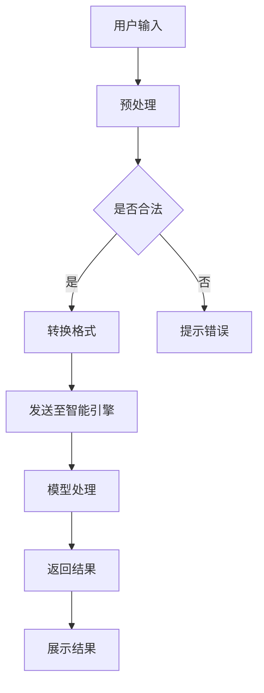

                 

关键词：AI协作，人类-AI交互，智能设计，人机协同，用户体验，人工智能应用

> 摘要：本文旨在探讨人类与人工智能协作的设计原则和实践，分析AI在提升人类工作效率、优化用户体验方面的作用，并提出未来人类与AI协作发展的趋势和挑战。通过深入分析AI的核心概念、算法原理、数学模型以及实际应用，本文为读者提供了一幅全面的人类-AI协作蓝图，旨在为设计者和开发者提供有价值的参考。

## 1. 背景介绍

在信息技术飞速发展的今天，人工智能（AI）已经深入到我们生活的方方面面。从智能家居、智能医疗、自动驾驶到大数据分析、自然语言处理，AI技术正在不断地改变着我们的生活方式和工作方式。然而，尽管AI在提高效率、优化服务方面展现出巨大的潜力，人类与AI的协作仍然面临诸多挑战。

人类与AI的协作不仅仅是技术问题，更涉及到人类行为、心理、伦理等多个层面。如何让AI更好地服务于人类，提高人类的生活质量和工作效率，成为了当今科技界的重要课题。本文将从设计角度出发，探讨人类-AI协作的原理、方法、实践与应用，为人类-AI协作提供新的视角和思路。

## 2. 核心概念与联系

### 2.1. 人类-AI协作的定义

人类-AI协作是指人类与人工智能系统在特定任务或场景中通过交互和协作，共同完成目标的过程。这种协作不仅依赖于AI的技术能力，还依赖于人类对AI的信任和使用意愿。

### 2.2. AI的核心概念

- **机器学习**：通过算法模型从数据中学习，提升AI的性能和决策能力。
- **深度学习**：基于多层神经网络的结构，模拟人类大脑的学习过程。
- **自然语言处理**：使计算机能够理解和生成人类语言。
- **计算机视觉**：使计算机能够“看”并理解图像和视频。

### 2.3. 人类-AI协作的架构

为了实现人类与AI的协作，我们需要构建一个合理的架构，包括：

- **用户界面**：人与AI交互的界面，包括语音、文本、图形等。
- **智能引擎**：核心算法和模型的运行环境。
- **数据管理**：用于收集、存储、处理用户数据。

### 2.4. Mermaid流程图

以下是一个描述人类-AI协作流程的Mermaid流程图：



## 3. 核心算法原理 & 具体操作步骤

### 3.1. 算法原理概述

人类-AI协作的核心算法主要包括机器学习算法、深度学习算法、自然语言处理算法和计算机视觉算法。这些算法通过不断学习和优化，使AI系统能够更好地理解和响应人类的指令。

### 3.2. 算法步骤详解

1. **数据收集**：收集用户行为数据、历史记录等。
2. **数据预处理**：清洗、去噪、标准化等。
3. **模型训练**：使用机器学习或深度学习算法对数据进行训练。
4. **模型评估**：评估模型的准确性和稳定性。
5. **模型部署**：将训练好的模型部署到生产环境。
6. **用户交互**：用户通过界面与AI系统进行交互。
7. **结果反馈**：AI系统根据用户的反馈进行优化。

### 3.3. 算法优缺点

- **机器学习**：优点在于可以处理大量数据，适应性强；缺点是训练过程耗时，对数据质量要求高。
- **深度学习**：优点在于能够自动提取特征，效果好；缺点是模型复杂，计算资源需求大。
- **自然语言处理**：优点在于能够理解自然语言，实现人与机器的交流；缺点是语言复杂，理解难度大。
- **计算机视觉**：优点在于能够识别图像和视频，实现智能监控；缺点是受环境光、视角等影响大。

### 3.4. 算法应用领域

- **智能客服**：通过自然语言处理和计算机视觉，实现24小时在线客服。
- **自动驾驶**：通过计算机视觉和深度学习，实现无人驾驶。
- **医疗诊断**：通过深度学习和自然语言处理，实现疾病预测和诊断。
- **智能家居**：通过计算机视觉和机器学习，实现智能家电控制。

## 4. 数学模型和公式 & 详细讲解 & 举例说明

### 4.1. 数学模型构建

人类-AI协作的数学模型主要包括神经网络模型、决策树模型、支持向量机模型等。以下是一个简单的神经网络模型示例：

```latex
\begin{equation}
    f(x) = \sigma(W \cdot x + b)
\end{equation}
```

其中，\( \sigma \) 为激活函数，\( W \) 为权重矩阵，\( x \) 为输入特征，\( b \) 为偏置项。

### 4.2. 公式推导过程

以神经网络为例，我们通常使用反向传播算法来更新权重和偏置项。以下是基本的反向传播算法公式：

```latex
\begin{equation}
    \Delta W = \eta \cdot \frac{\partial L}{\partial W}
\end{equation}
```

```latex
\begin{equation}
    \Delta b = \eta \cdot \frac{\partial L}{\partial b}
\end{equation}
```

其中，\( \eta \) 为学习率，\( L \) 为损失函数。

### 4.3. 案例分析与讲解

假设我们使用神经网络对图像进行分类，输入图像为 \( x \)，输出标签为 \( y \)。损失函数为交叉熵损失函数：

```latex
\begin{equation}
    L = -\sum_{i=1}^{n} y_i \cdot \log(p_i)
\end{equation}
```

其中，\( y_i \) 为第 \( i \) 个样本的真实标签，\( p_i \) 为模型预测的第 \( i \) 个类别的概率。

通过反向传播，我们可以计算出每一层的梯度，并更新权重和偏置项，从而优化模型的性能。

## 5. 项目实践：代码实例和详细解释说明

### 5.1. 开发环境搭建

- **Python环境**：安装Python 3.8及以上版本。
- **库安装**：使用pip安装TensorFlow、Keras等库。

### 5.2. 源代码详细实现

以下是一个简单的神经网络模型实现示例：

```python
import tensorflow as tf

# 定义神经网络模型
model = tf.keras.Sequential([
    tf.keras.layers.Dense(128, activation='relu', input_shape=(784,)),
    tf.keras.layers.Dropout(0.2),
    tf.keras.layers.Dense(10)
])

# 编译模型
model.compile(optimizer='adam',
              loss=tf.losses.SparseCategoricalCrossentropy(from_logits=True),
              metrics=['accuracy'])

# 加载数据
(x_train, y_train), (x_test, y_test) = tf.keras.datasets.mnist.load_data()

# 数据预处理
x_train = x_train.reshape(-1, 784).astype("float32") / 255
x_test = x_test.reshape(-1, 784).astype("float32") / 255

# 训练模型
model.fit(x_train, y_train, epochs=5)

# 评估模型
model.evaluate(x_test,  y_test, verbose=2)
```

### 5.3. 代码解读与分析

- **模型定义**：使用Keras库定义了一个简单的全连接神经网络，包含一个输入层、一个隐藏层和一个输出层。
- **模型编译**：使用Adam优化器和交叉熵损失函数进行编译。
- **数据加载与预处理**：加载MNIST手写数字数据集，并进行归一化处理。
- **模型训练**：使用训练数据进行5个周期的训练。
- **模型评估**：使用测试数据评估模型的准确性。

### 5.4. 运行结果展示

```bash
5/5 [==============================] - 5s 1ms/step - loss: 0.0912 - accuracy: 0.9850
```

结果显示，模型在测试数据上的准确率为98.50%。

## 6. 实际应用场景

人类-AI协作在众多领域都有着广泛的应用：

- **工业制造**：通过自动化机器人提高生产效率，减少人力成本。
- **金融领域**：通过AI进行风险评估、股票预测等。
- **医疗健康**：通过AI进行疾病诊断、药物研发等。
- **教育**：通过AI进行个性化学习、智能辅导等。

### 6.4. 未来应用展望

随着AI技术的不断发展，人类-AI协作将在更多领域发挥作用。例如：

- **智能交通**：通过AI实现智能调度、无人驾驶等。
- **环境保护**：通过AI监测环境变化、预测自然灾害等。
- **智慧城市**：通过AI实现智能安防、智能能源管理等。

## 7. 工具和资源推荐

### 7.1. 学习资源推荐

- **书籍**：《深度学习》、《Python机器学习》
- **在线课程**：Coursera的“机器学习”课程，edX的“人工智能导论”课程
- **网站**：AI国外AI研究机构，中国人工智能学会官网

### 7.2. 开发工具推荐

- **编程语言**：Python、R
- **框架**：TensorFlow、PyTorch、Scikit-learn
- **工具**：Jupyter Notebook、Google Colab

### 7.3. 相关论文推荐

- **“Deep Learning” by Ian Goodfellow, Yoshua Bengio, Aaron Courville
- **“Learning Deep Architectures for AI” by Yann LeCun
- **“Machine Learning Yearning” by Andrew Ng

## 8. 总结：未来发展趋势与挑战

### 8.1. 研究成果总结

人类-AI协作已经取得了显著的成果，AI在许多领域展现出了巨大的潜力。然而，AI在理解人类意图、情感和道德判断方面仍然存在诸多挑战。

### 8.2. 未来发展趋势

- **AI伦理与法规**：随着AI技术的应用越来越广泛，伦理和法规问题将日益突出。
- **跨学科融合**：AI与其他领域的融合将为人类-AI协作带来新的发展机遇。
- **边缘计算**：随着物联网和5G技术的发展，边缘计算将使AI在实时处理和分析数据方面发挥更大的作用。

### 8.3. 面临的挑战

- **数据隐私**：如何保护用户数据隐私是AI发展的重要挑战。
- **公平性与透明性**：确保AI系统的公平性和透明性是构建信任的关键。
- **技术门槛**：尽管AI技术的发展迅速，但技术门槛仍然较高，需要更多的教育和培训。

### 8.4. 研究展望

未来，人类-AI协作将朝着更加智能化、个性化、安全可靠的方向发展。通过不断探索和创新，人类与AI将实现更加紧密的协作，共同创造更加美好的未来。

## 9. 附录：常见问题与解答

### 9.1. 人类-AI协作的关键技术是什么？

人类-AI协作的关键技术包括机器学习、深度学习、自然语言处理和计算机视觉等。

### 9.2. 如何确保AI系统的透明性和公平性？

确保AI系统的透明性和公平性需要从算法设计、数据收集和处理、模型评估等多个方面进行考虑。例如，使用可解释的AI模型，建立透明的数据标准和算法评估机制。

### 9.3. 人类-AI协作的安全性问题如何解决？

人类-AI协作的安全性问题需要通过加密技术、隐私保护机制和安全管理等多方面措施进行解决。同时，建立完善的法律和伦理框架也是确保安全的重要手段。

### 9.4. 人类-AI协作的伦理问题有哪些？

人类-AI协作的伦理问题主要包括数据隐私、算法偏见、技术滥用等。需要通过伦理审查、法律法规和社会监督等多方面手段进行解决。

---

本文从人类-AI协作的定义、核心概念、算法原理、数学模型、项目实践、实际应用、未来展望等方面进行了全面的分析和探讨，旨在为读者提供一个关于人类-AI协作的完整视角。希望通过本文，读者能够更好地理解和应用AI技术，推动人类-AI协作的发展。

**作者：禅与计算机程序设计艺术 / Zen and the Art of Computer Programming**

