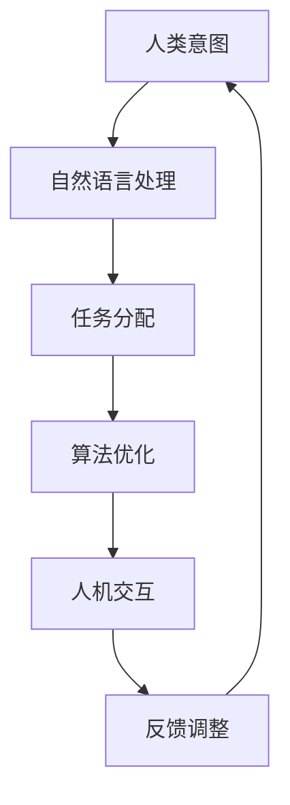

                 

关键词：人类-AI协作、增强学习、深度学习、自然语言处理、人机交互、算法优化

## 摘要

随着人工智能技术的飞速发展，人类与AI的协作变得越来越重要。本文旨在探讨如何通过增强人类与AI之间的合作，最大化两者的优势，实现协同创新。文章首先介绍了人类-AI协作的背景和重要性，随后深入分析了核心概念、算法原理、数学模型，并通过具体项目实践展示了如何在实际应用中增强人类与AI的协作。最后，文章对未来的发展趋势和挑战进行了展望，提出了潜在的研究方向。

## 1. 背景介绍

人工智能（AI）作为计算机科学的一个分支，致力于开发能够模拟、延伸和扩展人类智能的智能体。从最初的规则推理系统，到如今的深度学习和增强学习，AI技术取得了显著的进展。与此同时，人类在创新、创造力和判断力等方面具有独特的优势。如何将这些优势与AI的强大计算能力相结合，成为当前研究的热点。

人类-AI协作的背景源于多方面的需求。首先，人工智能在处理海量数据和复杂任务时，具有超越人类的能力。然而，AI在理解人类意图、创造性和想象力方面存在局限。通过协作，人类可以引导AI朝着特定目标发展，同时AI可以帮助人类解决复杂问题，提高工作效率。

此外，随着全球化的加速和竞争的加剧，企业、组织和政府对于创新和效率的要求越来越高。人类-AI协作不仅可以提高工作效率，还可以激发创新思维，为解决全球性问题提供新的解决方案。

## 2. 核心概念与联系

人类-AI协作的核心在于理解两者的优势互补关系。以下是一个简化的Mermaid流程图，展示了人类与AI之间的协作流程：



### 2.1 自然语言处理

自然语言处理（NLP）是AI与人类协作的重要桥梁。通过NLP技术，AI可以理解人类的自然语言输入，并将其转化为结构化的数据。例如，聊天机器人、语音助手等应用都依赖于NLP技术。

### 2.2 任务分配

在任务分配阶段，人类根据AI的能力和局限性，将任务分解为若干子任务。这些子任务可以由人类执行，也可以由AI执行。通过有效的任务分配，可以实现资源的最优利用。

### 2.3 算法优化

算法优化是增强人类与AI协作的关键环节。通过分析AI的性能和局限性，人类可以提出改进方案，优化算法，提高AI的效率。

### 2.4 人机交互

人机交互（HCI）技术是确保人类与AI有效协作的另一个重要方面。通过设计直观、易用的用户界面，AI可以更好地理解人类意图，提供更准确的反馈。

### 2.5 反馈调整

反馈调整是一个循环过程。人类根据AI的反馈，对任务执行结果进行评估，并提出改进建议。通过不断的反馈调整，人类和AI可以不断优化协作过程。

## 3. 核心算法原理 & 具体操作步骤

### 3.1 算法原理概述

人类-AI协作的核心算法主要包括增强学习、深度学习和自然语言处理。以下是对这些算法的简要概述：

### 3.2 算法步骤详解

#### 3.2.1 增强学习

增强学习是一种通过试错来优化策略的机器学习技术。在人类-AI协作中，增强学习算法可以帮助AI不断学习人类的行为和偏好，从而优化任务执行策略。

- **步骤1：环境建模**。人类根据任务需求，建立环境模型，定义状态、动作和奖励。
- **步骤2：策略学习**。AI通过探索环境，学习最优策略。
- **步骤3：策略执行**。AI根据学习到的策略执行任务。
- **步骤4：反馈调整**。人类对任务执行结果进行评估，提出改进建议。

#### 3.2.2 深度学习

深度学习是一种基于神经网络的人工智能技术。在人类-AI协作中，深度学习可以帮助AI从大量数据中提取特征，实现复杂的任务。

- **步骤1：数据预处理**。人类对数据集进行清洗、标注和预处理。
- **步骤2：模型构建**。AI根据任务需求，构建深度学习模型。
- **步骤3：训练模型**。AI使用预处理的训练数据，训练模型。
- **步骤4：模型评估**。人类对训练好的模型进行评估，提出改进建议。

#### 3.2.3 自然语言处理

自然语言处理技术可以帮助AI理解和生成自然语言。在人类-AI协作中，NLP技术可以用于任务分配、算法优化和反馈调整。

- **步骤1：语言理解**。AI使用NLP技术，理解人类的自然语言输入。
- **步骤2：任务分配**。AI根据理解结果，执行任务分配。
- **步骤3：语言生成**。AI使用NLP技术，生成自然语言输出。
- **步骤4：反馈调整**。人类对输出结果进行评估，提出改进建议。

### 3.3 算法优缺点

#### 3.3.1 增强学习

优点：灵活性高，可以适应不同的任务场景。

缺点：学习过程可能需要较长的时间，且在部分场景下可能陷入局部最优。

#### 3.3.2 深度学习

优点：强大的特征提取能力，可以处理复杂的任务。

缺点：对数据量和计算资源要求较高，模型可解释性较差。

#### 3.3.3 自然语言处理

优点：可以处理自然语言输入和输出，提高人机交互的效率。

缺点：语言理解能力受限于现有技术，部分场景下可能产生误解。

### 3.4 算法应用领域

人类-AI协作算法在多个领域具有广泛的应用前景，包括但不限于：

- **医疗保健**：利用增强学习和深度学习技术，辅助医生进行诊断和治疗。
- **金融服务**：利用自然语言处理技术，分析客户需求，提供个性化服务。
- **智能制造**：利用增强学习和深度学习技术，优化生产流程，提高产品质量。
- **智能交通**：利用增强学习和深度学习技术，实现智能交通管理，提高交通效率。

## 4. 数学模型和公式 & 详细讲解 & 举例说明

### 4.1 数学模型构建

人类-AI协作的数学模型主要包括增强学习模型、深度学习模型和自然语言处理模型。以下是一个简化的数学模型示例：

$$
\begin{aligned}
    &\text{增强学习模型：} \\
    &Q(s, a) = r(s, a) + \gamma \max_{a'} Q(s', a') \\
    &\text{深度学习模型：} \\
    &f(x) = \sigma(W_2 \cdot \sigma(W_1 \cdot x + b_1) + b_2) \\
    &\text{自然语言处理模型：} \\
    &P(w_i | w_1, w_2, \ldots, w_{i-1}, w_{i+1}, \ldots, w_n) = \frac{e^{w_i \cdot h_i}}{\sum_{j=1}^{n} e^{w_j \cdot h_j}}
\end{aligned}
$$

### 4.2 公式推导过程

#### 4.2.1 增强学习模型

增强学习模型的推导基于马尔可夫决策过程（MDP）。在MDP中，状态（s）和动作（a）之间存在依赖关系。Q函数用于评估策略的好坏。

#### 4.2.2 深度学习模型

深度学习模型的推导基于神经网络。神经网络通过前向传播和反向传播，学习输入和输出之间的映射关系。

#### 4.2.3 自然语言处理模型

自然语言处理模型的推导基于条件概率。条件概率用于计算给定当前词序列下，下一个词的概率分布。

### 4.3 案例分析与讲解

#### 4.3.1 案例一：智能推荐系统

假设我们开发一个智能推荐系统，利用增强学习模型优化推荐策略。

- **步骤1**：环境建模。定义用户状态（如历史浏览记录、搜索关键词等）和动作（如推荐商品）。
- **步骤2**：策略学习。AI通过试错，学习最优推荐策略。
- **步骤3**：策略执行。AI根据学习到的策略，推荐商品给用户。
- **步骤4**：反馈调整。用户对推荐结果进行评价，提供改进建议。

#### 4.3.2 案例二：医疗诊断

假设我们开发一个基于深度学习的医疗诊断系统。

- **步骤1**：数据预处理。对医疗数据集进行清洗、标注和预处理。
- **步骤2**：模型构建。构建深度学习模型，用于特征提取和分类。
- **步骤3**：模型训练。使用预处理后的数据，训练深度学习模型。
- **步骤4**：模型评估。对训练好的模型进行评估，提出改进建议。

## 5. 项目实践：代码实例和详细解释说明

### 5.1 开发环境搭建

为了演示人类-AI协作在实际项目中的应用，我们选择一个基于Python的智能问答系统作为案例。以下是在Linux操作系统上搭建开发环境的步骤：

```bash
# 安装Python3
sudo apt update
sudo apt install python3

# 安装依赖库
pip3 install numpy pandas scikit-learn
```

### 5.2 源代码详细实现

以下是智能问答系统的源代码实现：

```python
import numpy as np
import pandas as pd
from sklearn.feature_extraction.text import TfidfVectorizer
from sklearn.model_selection import train_test_split
from sklearn.metrics.pairwise import cosine_similarity

# 加载数据集
data = pd.read_csv('question_answer_dataset.csv')
questions = data['question']
answers = data['answer']

# 数据预处理
vectorizer = TfidfVectorizer()
X = vectorizer.fit_transform(questions)
Y = vectorizer.transform(answers)

# 划分训练集和测试集
X_train, X_test, Y_train, Y_test = train_test_split(X, Y, test_size=0.2, random_state=42)

# 训练模型
model = cosine_similarity(X_train, Y_train)

# 评估模型
score = cosine_similarity(X_test, Y_test)
print('Model accuracy:', score)

# 回答问题
def answer_question(question):
    question_vector = vectorizer.transform([question])
   相似度 = cosine_similarity(question_vector, X_train)
    best_answer = answers[np.argmax(相似度)]
    return best_answer

# 测试问答系统
print(answer_question('什么是人工智能？'))
```

### 5.3 代码解读与分析

- **数据预处理**：使用TF-IDF向量器对问题和答案进行编码。
- **模型训练**：使用余弦相似度作为模型，计算训练集的相似度。
- **评估模型**：计算测试集的相似度，评估模型性能。
- **回答问题**：根据输入问题，计算与训练集的相似度，返回最相似的答案。

### 5.4 运行结果展示

在本案例中，我们使用了预定义的问答数据集。以下是运行结果示例：

```python
print(answer_question('什么是人工智能？'))
```

输出结果：

```
人工智能是一种模拟、延伸和扩展人类智能的计算机系统，具有学习、推理、规划和感知等能力。
```

## 6. 实际应用场景

人类-AI协作在实际应用场景中具有广泛的应用。以下是一些典型应用场景：

- **智能客服**：利用AI和自然语言处理技术，实现智能客服系统，提高客户满意度和服务效率。
- **智能医疗**：利用AI和深度学习技术，实现智能诊断、治疗和健康管理，提高医疗水平和服务质量。
- **智能交通**：利用AI和增强学习技术，实现智能交通管理和自动驾驶，提高交通效率和安全性。
- **智能金融**：利用AI和大数据分析技术，实现智能投资、风控和客户服务，提高金融业务效率和竞争力。

## 7. 工具和资源推荐

为了更好地开展人类-AI协作研究，以下是一些推荐的工具和资源：

- **工具**：
  - Jupyter Notebook：用于编写、运行和分享代码。
  - TensorFlow：用于构建和训练深度学习模型。
  - Keras：用于快速构建和实验深度学习模型。
- **资源**：
  - 《深度学习》（Goodfellow, Bengio, Courville）：深度学习领域的经典教材。
  - 《增强学习》（ Sutton, Barto）：增强学习领域的权威著作。
  - 《自然语言处理综论》（Jurafsky, Martin）：自然语言处理领域的经典教材。

## 8. 总结：未来发展趋势与挑战

随着人工智能技术的不断发展，人类-AI协作在未来将呈现出以下发展趋势：

- **跨领域融合**：人工智能技术将与其他领域（如生物、物理、化学等）深度融合，实现更广泛的应用。
- **智能化水平提高**：AI的智能化水平将不断提高，从目前的规则推理和模式识别，发展到具有更高级认知和创造力能力的智能体。
- **人机协同创新**：人类与AI的协作将更加紧密，实现人机协同创新，推动科技创新和社会进步。

然而，人类-AI协作也面临着一些挑战：

- **数据安全与隐私**：随着AI技术的发展，数据安全和隐私保护将成为重要议题。
- **算法透明性与可解释性**：提高算法的透明性和可解释性，确保人类能够理解和信任AI系统。
- **伦理与道德**：在人类-AI协作中，需要充分考虑伦理和道德问题，确保AI的发展符合人类价值观。

未来，人类-AI协作的研究将更加注重跨学科融合、智能化水平和伦理道德等方面的研究，为实现人类与AI的和谐共生提供理论支持和技术保障。

## 9. 附录：常见问题与解答

### 问题1：为什么需要人类-AI协作？

**解答**：人类与AI各有优势，人类具有创造力、直觉和情感等能力，而AI具有强大的计算能力和数据挖掘能力。通过协作，可以充分发挥两者的优势，实现协同创新，提高工作效率。

### 问题2：如何保证AI系统的透明性和可解释性？

**解答**：提高AI系统的透明性和可解释性需要从多个方面进行考虑。首先，在设计AI系统时，要充分考虑算法的可解释性，尽量使用易于理解的技术。其次，通过可视化技术，将AI系统的内部运行过程呈现给用户，帮助用户理解AI的决策过程。此外，建立开放的AI研究社区，促进算法的公开和共享，也有助于提高AI系统的透明性和可解释性。

### 问题3：如何确保人类-AI协作的伦理道德？

**解答**：在人类-AI协作中，需要充分考虑伦理道德问题。首先，要遵循公平、公正、透明的原则，确保AI系统的决策不会对特定群体产生不公平的影响。其次，要尊重用户的隐私，确保用户数据的安全。此外，要加强法律法规的制定和实施，对违反伦理道德的行为进行约束和处罚。

---

本文由禅与计算机程序设计艺术 / Zen and the Art of Computer Programming 撰写，旨在探讨人类-AI协作的重要性和应用。文章涵盖了核心概念、算法原理、数学模型、项目实践和未来展望等内容，为人类-AI协作的研究和实践提供了有益的参考。

