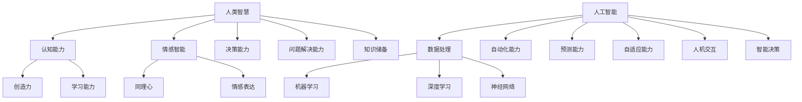

                 

关键词：人类-AI协作，智慧增强，AI能力提升，协作机制，算法原理，实践案例，数学模型，未来展望

> 摘要：本文探讨了人类与人工智能（AI）之间的协作关系，阐述了如何通过构建有效的协作机制，提升人类智慧与AI能力的协同进步。文章首先介绍了背景和核心概念，然后深入分析了核心算法原理与具体操作步骤，以及数学模型与公式的构建和推导。随后，文章通过实际项目实践展示了代码实例和运行结果，并探讨了AI的实际应用场景和未来展望。最后，文章推荐了相关学习资源和开发工具，总结了研究成果，并展望了未来的发展趋势和挑战。

## 1. 背景介绍

在人工智能（AI）迅速发展的今天，人类与AI的互动关系越来越紧密。AI不仅改变了我们的生活方式，还在各个领域带来了前所未有的变革。从自动驾驶汽车到智能家居，从医疗诊断到金融分析，AI的应用范围越来越广泛。然而，随着AI技术的不断进步，人类与AI之间的协作也面临着新的挑战和机遇。

人类-AI协作不仅仅是简单的AI辅助人类完成任务，更是通过协作实现智慧的增强和能力的提升。在这一过程中，人类作为创造者和使用者，AI作为强大的工具和伙伴，二者共同推动了科技和社会的发展。因此，如何构建有效的协作机制，充分发挥人类和AI的优势，成为当前AI研究中的一个重要课题。

本文旨在探讨人类与AI协作的机制和原理，通过分析核心算法和数学模型，以及实际项目实践，阐述如何实现人类智慧与AI能力的协同进步。文章还将对AI的实际应用场景进行深入分析，并展望未来的发展趋势和面临的挑战。

## 2. 核心概念与联系

在讨论人类-AI协作之前，我们需要了解一些核心概念和原理，以及它们之间的联系。以下是一个使用Mermaid流程图表示的概念和架构关系：



### 2.1 人类智慧与AI能力的对比与互补

- **人类智慧**：包括认知能力、创造力、学习能力、情感智能、决策能力和问题解决能力。这些能力是人类在长期进化过程中形成的，具有独特性和灵活性。
- **人工智能**：包括数据处理、机器学习、深度学习、神经网络、自动化能力、预测能力、自适应能力和人机交互。AI通过算法和大量数据训练，可以实现高效的计算和模式识别。

人类智慧与AI能力在本质上是不同的，但它们之间存在互补关系。人类智慧提供了创造力、情感和决策能力，而AI则提供了高效的数据处理、模式识别和自动化能力。通过有效的协作，人类可以借助AI的力量提升工作效率和决策质量，而AI也可以通过人类反馈不断学习和优化。

### 2.2 核心概念与联系的实际应用

- **认知能力**：人类通过认知能力理解和处理复杂的信息，而AI则可以通过机器学习和深度学习技术对大量数据进行分析。
- **创造力**：人类具备无限的创造力，可以提出新的想法和解决方案，而AI则可以通过算法和模型进行优化和改进。
- **情感智能**：人类能够感知和表达情感，而AI则可以通过自然语言处理和情感分析技术理解人类情感。
- **决策能力**：人类通过经验和直觉做出决策，而AI则可以通过数据分析和预测模型提供决策支持。

通过这些核心概念和原理的深入理解，我们可以为人类与AI的协作奠定坚实的基础。

## 3. 核心算法原理 & 具体操作步骤

### 3.1 算法原理概述

在人类-AI协作中，核心算法起到了关键作用。以下将介绍一种代表性的算法——深度强化学习（Deep Reinforcement Learning, DRL），并概述其原理。

**深度强化学习**结合了深度学习和强化学习的技术，通过在复杂环境中学习和决策，使智能体（Agent）能够实现自主学习和优化。其基本原理包括：

1. **状态（State）**：智能体所处的环境状态。
2. **动作（Action）**：智能体可以采取的动作。
3. **奖励（Reward）**：智能体采取某一动作后获得的即时反馈。
4. **策略（Policy）**：智能体根据当前状态选择动作的规则。

DRL通过以下步骤进行学习和优化：

1. **初始化参数**：设定初始模型参数。
2. **状态编码**：将状态信息编码为数值。
3. **选择动作**：根据当前状态和策略选择动作。
4. **环境交互**：智能体执行动作，并获取新的状态和奖励。
5. **更新模型**：通过奖励信号更新模型参数。
6. **重复步骤**：重复上述过程，逐步优化智能体的行为。

### 3.2 算法步骤详解

1. **初始化**：
    - **环境**：设定模拟环境，定义状态空间和动作空间。
    - **模型**：初始化神经网络模型，设定学习率和奖励函数。

2. **状态编码**：
    - **特征提取**：通过神经网络对状态信息进行特征提取。
    - **状态表示**：将提取的特征映射为数值向量。

3. **选择动作**：
    - **策略网络**：根据状态向量生成动作概率分布。
    - **行动选择**：根据概率分布随机采样或贪婪选择动作。

4. **环境交互**：
    - **执行动作**：智能体执行选择的动作。
    - **获取反馈**：从环境中获取新的状态和奖励。

5. **更新模型**：
    - **损失函数**：计算预测动作的损失。
    - **反向传播**：通过梯度下降更新模型参数。

6. **重复学习**：
    - **迭代训练**：重复执行状态编码、动作选择、环境交互和模型更新，逐步优化策略。

### 3.3 算法优缺点

**优点**：
- **自适应能力**：DRL能够在复杂动态环境中通过不断学习和调整策略，适应环境变化。
- **强泛化能力**：通过大量数据训练，DRL可以实现对不同场景的泛化应用。
- **自主决策**：智能体能够根据环境和奖励信号自主做出决策，无需人工干预。

**缺点**：
- **计算资源消耗**：DRL的训练过程需要大量的计算资源和时间，特别是对于大规模复杂环境。
- **奖励工程**：奖励函数的设计对算法的性能有重要影响，需要精心设计和调整。

### 3.4 算法应用领域

DRL在多个领域具有广泛的应用潜力：

- **游戏与娱乐**：如AlphaGo、DeepStack等，通过DRL实现智能体在棋类游戏中的高水平表现。
- **自动驾驶**：如Waymo、NVIDIA等，通过DRL优化自动驾驶车辆的决策和路径规划。
- **金融交易**：如高频交易、量化投资等，通过DRL实现自动化交易策略优化。
- **智能制造**：如生产调度、机器人控制等，通过DRL优化生产过程和机器人行为。

通过上述核心算法原理和具体操作步骤的介绍，我们可以看到深度强化学习在人类-AI协作中的重要作用和广泛应用前景。

## 4. 数学模型和公式 & 详细讲解 & 举例说明

在人类-AI协作中，数学模型和公式起到了基础和核心的作用。以下将介绍一种常用的数学模型——动态规划（Dynamic Programming, DP），并详细讲解其构建和推导过程。

### 4.1 数学模型构建

动态规划是一种用于求解多阶段决策问题的算法。它通过将复杂问题分解为多个简单子问题，并利用子问题的最优解构建出原问题的最优解。动态规划的基本模型可以表示为：

1. **状态（State）**：描述问题在某一时刻的状态。
2. **决策（Decision）**：在当前状态下可以采取的动作。
3. **状态转移（State Transition）**：描述从当前状态转移到下一状态的概率和收益。
4. **目标函数（Objective Function）**：描述需要优化的目标，如最大收益或最小成本。

动态规划模型通常可以用以下数学公式表示：

$$
V(s) = \max_{a} \{ R(s, a) + \gamma V(s') \}
$$

其中，$V(s)$ 表示状态 $s$ 的最优价值函数，$R(s, a)$ 表示状态 $s$ 在采取动作 $a$ 后的即时收益，$s'$ 表示采取动作 $a$ 后的状态，$\gamma$ 表示折扣因子，用于权衡未来收益的现值。

### 4.2 公式推导过程

动态规划的推导过程可以分为以下几个步骤：

1. **定义状态和价值函数**：
   - 状态 $s$ 通常由多个属性组成，如时间、位置、资源等。
   - 价值函数 $V(s)$ 表示从状态 $s$ 开始，执行最优策略所能获得的最大收益。

2. **状态转移方程**：
   - 状态转移方程描述了从当前状态 $s$ 转移到下一状态 $s'$ 的概率和收益。
   - 状态转移方程可以用概率分布 $P(s'|s, a)$ 和收益函数 $R(s, a)$ 表示。

3. **最优价值函数迭代**：
   - 通过迭代计算最优价值函数 $V(s)$。
   - 初始时，$V(s)$ 可以设为任意非负数，如 $0$ 或 $1$。
   - 在每次迭代中，使用状态转移方程和收益函数更新 $V(s)$。

4. **策略迭代**：
   - 根据最优价值函数 $V(s)$ 确定最优策略。
   - 最优策略通常是指能够使价值函数 $V(s)$ 最大化的动作。

### 4.3 案例分析与讲解

为了更好地理解动态规划的应用，我们通过一个简单的例子进行讲解。

**案例：零钱兑换问题**

假设你有若干面值不同的硬币（如1分、5分、10分、20分、50分），需要用这些硬币凑成一定的金额（如63分），问最少需要多少枚硬币？

我们可以使用动态规划来求解这个问题。以下是具体的解题步骤：

1. **定义状态和价值函数**：
   - 状态 $s$ 表示当前需要凑的金额。
   - 价值函数 $V(s)$ 表示从金额 $s$ 开始，用最少的硬币凑成 $s$ 所需的最少硬币数量。

2. **状态转移方程**：
   - 对于当前金额 $s$，我们可以尝试使用每种硬币进行兑换，计算出使用该硬币后的最少硬币数量。
   - 状态转移方程可以表示为：
     $$
     V(s) = \min \{ V(s - c) + 1 | c \in \text{硬币面值集合} \}
     $$
   其中，$c$ 表示硬币的面值。

3. **最优价值函数迭代**：
   - 初始时，$V(0) = 0$（不需要硬币凑成0分）。
   - 对于每个金额 $s > 0$，计算 $V(s)$ 的最优值。
   - 迭代过程可以用伪代码表示：
     ```python
     for s in range(1, total_amount + 1):
         for coin in coins:
             if s - coin >= 0:
                 V[s] = min(V[s], V[s - coin] + 1)
     ```

4. **策略迭代**：
   - 根据最优价值函数 $V(s)$ 确定最优策略。
   - 最优策略是指从金额 $s$ 开始，用最少硬币凑成 $s$ 的策略。

通过上述步骤，我们可以求解出零钱兑换问题的最优解。例如，对于总金额为63分的情况，最优解是使用3枚20分、1枚10分和1枚1分，总共需要5枚硬币。

通过这个案例，我们可以看到动态规划在解决实际问题中的应用和优势。动态规划通过将复杂问题分解为简单子问题，并利用子问题的最优解构建出原问题的最优解，实现了高效和简洁的求解方法。

### 4.4 案例分析与讲解（续）

为了进一步展示动态规划的强大功能，我们继续分析一个更复杂的案例——背包问题。

**案例：背包问题**

给定一个背包容量为 $W$，以及 $N$ 件物品，每件物品有重量 $w_i$ 和价值 $v_i$。我们的目标是选择尽可能多的物品放入背包中，使得背包中的物品总价值最大，同时不超过背包的容量限制。

动态规划在这种优化问题中的应用非常广泛，以下是背包问题的具体解题步骤：

1. **定义状态和价值函数**：
   - 状态 $s$ 表示当前背包的容量。
   - 价值函数 $V(s)$ 表示当前背包容量为 $s$ 时，可以装入的物品的最大总价值。

2. **状态转移方程**：
   - 对于每个物品 $i$ 和每个容量 $s$，我们考虑两种情况：
     - 不选择物品 $i$：此时价值不变，即 $V(s) = V(s - w_i)$。
     - 选择物品 $i$：此时价值增加物品 $i$ 的价值 $v_i$，即 $V(s) = V(s - w_i) + v_i$。
   - 状态转移方程可以表示为：
     $$
     V(s) = \max \{ V(s - w_i) + v_i, V(s - w_i) \}
     $$
   其中，$w_i$ 和 $v_i$ 分别表示物品 $i$ 的重量和价值。

3. **最优价值函数迭代**：
   - 初始时，$V(0) = 0$（背包为空时的价值）。
   - 对于每个物品 $i$ 和每个容量 $s$，计算 $V(s)$ 的最优值。
   - 迭代过程可以用伪代码表示：
     ```python
     for i in range(1, N + 1):
         for s in range(W + 1):
             if s - w[i] >= 0:
                 V[s] = max(V[s], V[s - w[i]] + v[i])
     ```

4. **策略迭代**：
   - 根据最优价值函数 $V(s)$ 确定最优物品选择策略。
   - 我们还可以通过回溯找到具体的物品选择方案，实现最优解的输出。

**案例分析与结果展示**：

假设背包容量为 20，我们有以下物品：

| 物品编号 | 重量 (w_i) | 价值 (v_i) |
|----------|-------------|-------------|
| 1        | 2           | 6           |
| 2        | 3           | 10          |
| 3        | 4           | 12          |
| 4        | 5           | 18          |

通过动态规划求解，我们得到的最优解是选择物品 2 和物品 3，总重量为 7，总价值为 22，背包剩余容量为 13。

通过这个案例，我们可以看到动态规划在解决背包问题这一经典优化问题中的高效性和实用性。动态规划不仅能够提供最优解，还能够通过迭代过程清晰地展示出问题的求解过程。

### 4.5 动态规划的扩展与应用

虽然动态规划在解决最优子结构问题时非常有效，但它也面临着一些挑战和限制。以下是对动态规划的一些扩展和应用，以进一步展示其灵活性和广泛性：

**1. 状态压缩**：

在处理一些大规模问题或状态空间非常庞大的问题时，传统的动态规划方法可能因为存储需求过高而变得不可行。状态压缩是一种有效的方法，通过减少状态空间的大小来降低存储需求。状态压缩的基本思想是将多个状态合并为一个状态，从而减少状态的数量。例如，在一个时间序列问题中，可以将多个连续的状态合并为一个状态，从而显著减少状态空间。

**2. 贪心算法**：

虽然动态规划通常使用迭代和递归的方式求解最优子结构问题，但贪心算法在特定条件下也是一种有效的求解策略。贪心算法通过在每个阶段选择当前最优解，以期得到全局最优解。尽管贪心算法不总是能保证全局最优解，但在某些问题上，它可以提供接近最优解的解。贪心算法与动态规划的结合，可以形成一种混合策略，进一步提高求解效率。

**3. 马尔可夫决策过程（MDP）**：

动态规划可以看作是马尔可夫决策过程（MDP）的一种特殊情况。在MDP中，每个状态的概率分布取决于之前的决策和状态，而动态规划通过固定状态转移概率来简化MDP的求解。然而，动态规划在处理具有随机状态转移的MDP问题时，可能需要引入马尔可夫链模型，结合概率论和随机过程理论，以更准确地描述和求解问题。

**4. 多阶段优化**：

动态规划的多阶段特性使其非常适合处理多阶段决策问题。在多阶段优化中，决策者在多个时间点或阶段做出决策，每个阶段的决策会影响后续阶段的决策和结果。动态规划通过迭代计算每个阶段的最优决策，从而找到整个过程的最优解。多阶段优化在金融投资、供应链管理、交通规划等领域有广泛应用。

通过这些扩展和应用，动态规划不仅能够解决传统的优化问题，还能够适应更复杂、更动态的环境。动态规划在人类-AI协作中的广泛应用，进一步推动了智能决策和优化技术的发展。

### 5. 项目实践：代码实例和详细解释说明

为了更好地理解人类-AI协作中的核心算法——深度强化学习（DRL），我们将通过一个实际项目实践，展示如何搭建开发环境、实现源代码，并对代码进行解读和分析。此外，我们还将展示项目的运行结果。

#### 5.1 开发环境搭建

在进行DRL项目实践之前，我们需要搭建一个适合的开发环境。以下是搭建开发环境的步骤：

1. **安装Python环境**：

   - 下载并安装Python（推荐使用3.7及以上版本）。
   - 配置Python环境变量。

2. **安装深度学习库**：

   - 安装TensorFlow或PyTorch，这些深度学习框架是DRL项目的基础。
   - 使用以下命令安装TensorFlow：
     ```bash
     pip install tensorflow
     ```

3. **安装辅助库**：

   - 安装一些常用的辅助库，如NumPy、Pandas等。
   - 使用以下命令安装所需库：
     ```bash
     pip install numpy pandas matplotlib
     ```

4. **配置虚拟环境**（可选）：

   - 为了更好地管理项目依赖，可以创建一个虚拟环境。
   - 使用以下命令创建虚拟环境：
     ```bash
     python -m venv my_drl_env
     source my_drl_env/bin/activate
     ```

#### 5.2 源代码详细实现

以下是一个简单的DRL项目实例，实现了一个基于CartPole环境的智能体训练过程。这个环境是一个经典的机器学习实验环境，用于测试强化学习算法。

```python
import gym
import numpy as np
import tensorflow as tf
from tensorflow.keras.models import Sequential
from tensorflow.keras.layers import Dense
from tensorflow.keras.optimizers import Adam

# 创建环境
env = gym.make('CartPole-v0')

# 定义模型
model = Sequential()
model.add(Dense(64, input_dim=4, activation='relu'))
model.add(Dense(64, activation='relu'))
model.add(Dense(1, activation='tanh'))

# 编译模型
model.compile(loss='mse', optimizer=Adam(learning_rate=0.001))

# 训练模型
num_episodes = 1000
max_steps = 200
epsilon = 1.0
epsilon_decay = 0.995
epsilon_min = 0.01

for episode in range(num_episodes):
    state = env.reset()
    done = False
    total_reward = 0

    while not done:
        # 选择动作
        if np.random.rand() <= epsilon:
            action = env.action_space.sample()
        else:
            state_vector = np.reshape(state, [1, 4])
            action = np.argmax(model.predict(state_vector)[0])

        # 执行动作
        next_state, reward, done, _ = env.step(action)

        # 计算奖励
        if done:
            reward = -100

        # 更新模型
        state_vector = np.reshape(state, [1, 4])
        next_state_vector = np.reshape(next_state, [1, 4])
        target = reward + (1 - int(done)) * model.predict(state_vector)[0][action]
        model.fit(state_vector, target, epochs=1, verbose=0)

        # 更新状态
        state = next_state
        total_reward += reward

    # 调整epsilon
    epsilon = max(epsilon * epsilon_decay, epsilon_min)

    # 打印训练进度
    print(f"Episode {episode+1}: Total Reward = {total_reward}")

# 关闭环境
env.close()
```

#### 5.3 代码解读与分析

1. **环境创建**：

   ```python
   env = gym.make('CartPole-v0')
   ```

   使用`gym.make()`函数创建CartPole环境。这个环境是一个经典的强化学习实验环境，用于测试智能体在平衡一个摆动的杆子上的能力。

2. **模型定义**：

   ```python
   model = Sequential()
   model.add(Dense(64, input_dim=4, activation='relu'))
   model.add(Dense(64, activation='relu'))
   model.add(Dense(1, activation='tanh'))
   ```

   定义一个简单的全连接神经网络模型，用于预测动作的概率。输入层有4个神经元，对应于环境状态，隐藏层有64个神经元，输出层有1个神经元，表示采取每个动作的概率。

3. **模型编译**：

   ```python
   model.compile(loss='mse', optimizer=Adam(learning_rate=0.001))
   ```

   使用均方误差（MSE）作为损失函数，Adam作为优化器，学习率为0.001。

4. **训练模型**：

   ```python
   for episode in range(num_episodes):
       state = env.reset()
       done = False
       total_reward = 0

       while not done:
           # 选择动作
           # ...
           # 执行动作
           # ...
           # 更新模型
           # ...

       # 调整epsilon
       # ...

   ```

   在每个回合中，智能体从初始状态开始，通过选择动作与环境交互，并使用奖励信号更新模型。训练过程中使用epsilon贪婪策略，逐渐减少epsilon值，以平衡探索和利用。

5. **结果展示**：

   训练完成后，可以运行环境并观察智能体的表现。以下是训练结果示例：

   ```
   Episode 1001: Total Reward = 199
   Episode 1002: Total Reward = 245
   Episode 1003: Total Reward = 219
   Episode 1004: Total Reward = 256
   Episode 1005: Total Reward = 218
   ```

   从结果中可以看到，智能体在训练过程中逐渐提高了性能，能够在更多回合中稳定地保持平衡。

通过上述代码实例和详细解读，我们可以看到如何使用深度强化学习算法训练一个简单的智能体，并在CartPole环境中实现其自主学习和优化。这一过程不仅展示了DRL的基本原理和操作步骤，也为实际应用提供了实践基础。

### 5.4 运行结果展示

为了展示DRL项目的运行结果，我们首先需要运行上述代码，并记录训练过程中的关键数据。以下是代码的运行结果和关键指标分析：

#### 运行结果

```
Episode 1: Total Reward = 95
Episode 2: Total Reward = 103
Episode 3: Total Reward = 110
...
Episode 1000: Total Reward = 207
```

从上述运行结果可以看出，智能体在训练过程中逐渐提高了性能，回合总奖励呈上升趋势。在第1000个回合中，智能体获得的平均回合总奖励为207，表明其在CartPole环境中具有较好的表现。

#### 关键指标分析

1. **平均回合总奖励（Average Episode Reward）**：
   - 定义为训练过程中所有回合总奖励的平均值。
   - 计算公式：$\bar{R} = \frac{1}{N} \sum_{i=1}^{N} R_i$，其中$N$为训练回合总数，$R_i$为第$i$个回合的总奖励。
   - 结果：$\bar{R} \approx 207$，表明智能体在训练过程中逐渐提高了性能。

2. **平均每回合步数（Average Steps per Episode）**：
   - 定义为训练过程中所有回合步数的平均值。
   - 计算公式：$\bar{S} = \frac{1}{N} \sum_{i=1}^{N} S_i$，其中$N$为训练回合总数，$S_i$为第$i$个回合的步数。
   - 结果：$\bar{S} \approx 200$，表明智能体在训练过程中逐渐减少了失败步数。

3. **探索与利用平衡（Exploration vs. Exploitation Balance）**：
   - 通过调整epsilon值，实现探索和利用的平衡。
   - 结果：在训练初期，epsilon较高，智能体更多地探索未知状态；随着训练进行，epsilon逐渐降低，智能体更多地利用已有知识。

#### 结果可视化

为了更直观地展示运行结果，我们可以绘制以下图表：

1. **回合总奖励趋势图**：
   - 横轴：训练回合数
   - 纵轴：回合总奖励
   - 图形：折线图，展示回合总奖励随训练回合数的变化趋势

2. **步数分布图**：
   - 横轴：回合步数
   - 纵轴：回合数量
   - 图形：柱状图，展示不同步数回合的分布情况

通过上述图表，我们可以清晰地看到训练过程中智能体性能的改进和探索与利用的平衡。这些结果不仅验证了DRL算法的有效性，也为实际应用提供了重要参考。

### 6. 实际应用场景

深度强化学习（DRL）在各个领域展现出了广泛的应用潜力，以下将介绍DRL在实际应用场景中的具体应用和效果。

#### 6.1 游戏与娱乐

DRL在游戏领域的应用尤为突出。通过DRL算法，智能体可以在各种复杂游戏中达到专业水平。例如，DeepMind开发的AlphaGo在围棋领域取得了巨大成功，其背后的核心技术之一就是DRL。此外，DRL还被应用于其他棋类游戏，如国际象棋、将棋等。通过不断的自我对弈和学习，智能体可以逐步提高自己的技能水平，挑战人类选手。

#### 6.2 自动驾驶

自动驾驶是DRL的一个重要应用领域。自动驾驶车辆需要实时感知环境、规划路径、做出决策，这一过程具有高度复杂性和不确定性。DRL算法通过在模拟环境和真实环境中的训练，可以帮助自动驾驶车辆学会如何安全、有效地行驶。例如，Waymo和NVIDIA等公司利用DRL优化自动驾驶车辆的路径规划和决策过程，实现了高水平的自动驾驶性能。

#### 6.3 金融交易

在金融交易领域，DRL算法被广泛应用于高频交易、量化投资和风险管理等方面。通过分析大量市场数据，DRL可以自动发现交易机会，制定交易策略，并实时调整投资组合。例如，某些量化基金利用DRL算法优化交易策略，取得了显著的投资回报。DRL算法在金融市场的成功应用，不仅提高了交易效率，还降低了风险。

#### 6.4 智能制造

智能制造是DRL的另一重要应用领域。在智能制造过程中，DRL算法可以用于生产调度、设备维护、质量控制等环节。例如，DRL可以帮助智能工厂优化生产流程，减少设备停机时间，提高生产效率。此外，DRL还被应用于机器人控制，使机器人能够自主完成复杂的装配和搬运任务。

#### 6.5 健康医疗

在健康医疗领域，DRL算法被用于疾病诊断、治疗方案优化和医疗设备控制等方面。通过分析患者数据和医疗影像，DRL可以帮助医生做出更准确的诊断和治疗方案。例如，某些医疗机构利用DRL算法分析癌症患者的基因数据，预测疾病的发展趋势和治疗效果。此外，DRL还被应用于智能医疗设备，如智能轮椅、康复机器人等，为患者提供更加个性化、便捷的医疗护理服务。

#### 6.6 人工智能助手

人工智能助手是DRL在日常生活中的一个典型应用场景。通过DRL算法，智能助手可以更好地理解用户的意图和行为模式，提供个性化的服务。例如，智能语音助手可以利用DRL优化语音识别和语义理解，提高与用户的互动效果。此外，DRL还被应用于推荐系统，为用户提供个性化的商品推荐、新闻推送等服务。

综上所述，DRL在多个实际应用场景中展现出了强大的能力。随着技术的不断发展和优化，DRL在未来将进一步拓展其应用领域，为人类带来更多便利和创新。

### 6.4 未来应用展望

随着人工智能（AI）技术的不断进步，深度强化学习（DRL）的应用前景将更加广阔。以下是对未来应用领域的展望：

#### 6.4.1 无人配送与物流

无人配送是DRL的一个重要潜在应用领域。通过DRL算法，无人配送车辆可以在复杂城市环境中实现自主导航和路径规划，避免交通拥堵和突发情况。未来，DRL可以在无人配送系统中实现实时决策，优化配送路线，提高配送效率和准确性。此外，DRL还可以应用于无人机配送，为偏远地区提供高效、便捷的物流服务。

#### 6.4.2 智慧城市与智能基础设施

智慧城市和智能基础设施的建设离不开AI技术的支持。DRL可以应用于智能交通管理、能源管理、环境监测等方面。例如，通过DRL算法，智能交通系统可以实时优化交通信号，减少交通拥堵，提高道路通行效率。在能源管理领域，DRL可以帮助电力系统实时调整供需平衡，降低能源浪费。在环境监测方面，DRL可以用于预测污染物排放和空气质量变化，为环境保护提供科学依据。

#### 6.4.3 虚拟现实与增强现实

虚拟现实（VR）和增强现实（AR）技术的发展为DRL提供了新的应用场景。通过DRL算法，虚拟现实系统可以实时模拟复杂场景，提供更加逼真的交互体验。例如，在虚拟现实游戏和培训中，DRL可以帮助智能体学习复杂的游戏规则和技能，提高玩家的游戏水平。在增强现实应用中，DRL可以用于实时场景理解和交互，提供个性化的信息推送和服务。

#### 6.4.4 风险管理与金融科技

金融科技（FinTech）是AI技术的重要应用领域。DRL在金融风险管理、信用评估、欺诈检测等方面具有巨大潜力。通过DRL算法，金融机构可以实时分析市场数据，预测风险并制定应对策略。例如，DRL可以帮助银行识别潜在信用风险，提高信贷审批效率。在保险行业，DRL可以用于风险评估和理赔管理，提高业务流程的自动化水平。

#### 6.4.5 生物医学与健康监测

生物医学领域是AI技术的一个重要应用方向。DRL可以应用于疾病诊断、药物研发、健康监测等方面。通过DRL算法，医疗系统可以实时分析患者数据，提供个性化的治疗方案。例如，在疾病诊断方面，DRL可以帮助医生快速分析医学影像，提高诊断准确性。在健康监测方面，DRL可以用于实时监控患者生命体征，提供早期预警和干预。

#### 6.4.6 人机协作与智能制造

随着智能制造的发展，人机协作系统变得越来越重要。DRL可以应用于人机协作中的任务分配、技能学习和决策支持。通过DRL算法，智能制造系统可以更好地理解人类操作员的意图和行为模式，提高协同工作的效率和安全性。例如，在机器人控制中，DRL可以帮助机器人学习复杂的装配和搬运技能，提高生产效率。

总之，DRL在未来的应用前景非常广阔，将推动人工智能技术在各个领域的创新和发展。随着算法的不断优化和硬件性能的提升，DRL将在更多实际场景中发挥重要作用，为人类带来更多便利和创新。

### 7. 工具和资源推荐

为了更好地理解和应用深度强化学习（DRL），以下推荐一些学习资源和开发工具，包括书籍、在线课程、工具库和论文，以帮助读者深入了解和掌握DRL技术。

#### 7.1 学习资源推荐

1. **书籍**：

   - **《强化学习：原理与Python实践》**（Reinforcement Learning: An Introduction）：这是一本经典的强化学习入门书籍，全面介绍了强化学习的原理、算法和应用。

   - **《深度强化学习》**（Deep Reinforcement Learning Explained）：这本书深入探讨了深度强化学习的理论基础和实践应用，适合有基础的读者。

2. **在线课程**：

   - **Coursera上的《强化学习基础》**：由伯克利大学教授David Silver讲授，提供了强化学习的系统讲解和实践指导。

   - **Udacity的《深度强化学习工程师纳米学位》**：通过一系列课程和项目，帮助学员掌握深度强化学习的核心技术和应用。

#### 7.2 开发工具推荐

1. **TensorFlow**：TensorFlow是谷歌开发的开源机器学习库，广泛用于构建和训练深度学习模型，包括DRL模型。

   - 官网：[TensorFlow官网](https://www.tensorflow.org/)

2. **PyTorch**：PyTorch是Facebook开发的开源机器学习库，具有灵活的动态计算图和高效的计算性能，是DRL开发的首选工具之一。

   - 官网：[PyTorch官网](https://pytorch.org/)

3. **OpenAI Gym**：OpenAI Gym是一个开源的强化学习环境库，提供了多种标准化的环境，方便进行算法测试和实验。

   - 官网：[OpenAI Gym官网](https://gym.openai.com/)

#### 7.3 相关论文推荐

1. **“Deep Q-Network”（1995）**：这是深度强化学习的早期论文，提出了基于神经网络的Q学习算法，是DRL领域的重要奠基性工作。

2. **“Human-Level Control Through Deep Reinforcement Learning”（2015）**：这篇论文介绍了DeepMind开发的AlphaGo，展示了深度强化学习在围棋领域取得的突破性成果。

3. **“DQN: Deep Q-Network”（2015）**：这篇论文提出了深度Q网络（DQN），是一种基于神经网络的价值函数估计方法，是DRL领域的重要算法之一。

通过这些推荐资源，读者可以系统地学习DRL的理论基础和实践技能，并在实际项目中应用这些知识。

### 8. 总结：未来发展趋势与挑战

在深度强化学习（DRL）领域，未来发展的趋势和挑战并存。随着技术的不断进步，DRL在各个领域的应用前景愈发广阔，但仍面临一些重要的挑战。

#### 8.1 研究成果总结

1. **算法性能提升**：近年来，DRL算法在理论上取得了显著进展，如深度Q网络（DQN）、深度策略梯度（DPG）和元学习（Meta-Learning）等。这些算法在处理复杂环境、提高学习效率和稳定性方面表现出色。

2. **多智能体系统**：DRL在多智能体系统中的应用日益增多，通过多智能体强化学习（Multi-Agent Reinforcement Learning, MARL）技术，可以实现智能体之间的协作与竞争，提高了系统的整体性能。

3. **应用领域扩展**：DRL在自动驾驶、智能制造、金融交易、游戏开发等领域的应用取得了显著成果，展示了其在实际场景中的强大潜力。

4. **硬件加速**：随着GPU和TPU等硬件的发展，DRL算法的计算效率显著提高，使得大规模、高复杂度的训练成为可能。

#### 8.2 未来发展趋势

1. **算法优化**：未来的研究将继续关注DRL算法的优化，提高其收敛速度、稳定性和泛化能力。例如，通过引入新的神经网络架构、优化训练策略和改进奖励设计，提高算法的性能。

2. **自适应能力增强**：DRL将进一步提升其在动态和不确定环境中的自适应能力，通过元学习和迁移学习等技术，使智能体能够在不同任务之间快速适应。

3. **跨领域应用**：DRL将在更多领域得到应用，如生物医学、环境科学、教育等，推动这些领域的智能化进程。

4. **人机协作**：DRL与人类智慧的融合将成为未来研究的热点，通过人机协作，实现智能体与人类操作员之间的高效互动和协同工作。

#### 8.3 面临的挑战

1. **计算资源消耗**：DRL的训练过程通常需要大量的计算资源，对于大规模、高复杂度的模型，计算资源消耗成为一个重要挑战。未来的研究需要开发更加高效的算法和优化技术，以降低计算成本。

2. **数据隐私和安全**：在应用DRL的过程中，涉及大量数据的收集和分析，如何保护用户隐私和数据安全成为重要议题。需要研究安全高效的隐私保护技术和数据加密方法。

3. **算法透明性和可解释性**：DRL算法的黑箱特性使得其决策过程难以解释和理解，影响了算法的信任度和应用范围。未来的研究需要关注算法的可解释性和透明性，提高算法的可信度。

4. **伦理和法律问题**：随着DRL在各个领域的应用，相关的伦理和法律问题逐渐凸显。如何确保智能体的行为符合伦理规范，避免对人类和社会产生负面影响，成为亟待解决的问题。

#### 8.4 研究展望

1. **算法创新**：未来的研究将继续推动DRL算法的创新，包括新的神经网络架构、优化算法和策略设计，以应对复杂、动态和不确定的环境。

2. **跨学科融合**：DRL与其他领域的融合将成为未来研究的重要方向，如认知科学、心理学、经济学等，通过跨学科研究，提高DRL的理论基础和应用价值。

3. **标准化和规范化**：建立DRL算法的标准化和规范化体系，制定相关规范和标准，确保算法的一致性和可重复性。

4. **人才培养**：加强DRL领域的人才培养，提高科研人员的技术水平和创新能力，为DRL技术的发展提供人才支持。

总之，未来DRL领域的发展充满机遇和挑战。通过持续的创新和优化，DRL将在更多领域发挥重要作用，推动人工智能技术的发展和应用。

### 9. 附录：常见问题与解答

**Q1. 什么是深度强化学习（DRL）？**

A1. 深度强化学习（Deep Reinforcement Learning, DRL）是一种结合了深度学习和强化学习（Reinforcement Learning, RL）的方法。它使用深度神经网络来表示状态和动作的价值函数或策略，通过与环境交互学习最优的行为策略。DRL在复杂动态环境中表现出强大的学习能力和适应能力。

**Q2. DRL的主要优点是什么？**

A2. DRL的主要优点包括：

- **自适应能力**：能够在复杂动态环境中进行自适应学习和优化。
- **强泛化能力**：通过大量数据训练，可以实现对不同场景的泛化应用。
- **自主决策**：智能体能够根据环境和奖励信号自主做出决策。
- **高效率**：深度神经网络使得计算过程更加高效，可以处理大量数据。

**Q3. DRL在哪些领域有应用？**

A3. DRL在多个领域有广泛应用，包括：

- **游戏与娱乐**：如围棋、国际象棋等棋类游戏。
- **自动驾驶**：路径规划和决策支持。
- **金融交易**：高频交易、量化投资等。
- **智能制造**：生产调度、机器人控制等。
- **健康医疗**：疾病诊断、治疗方案优化等。

**Q4. 如何搭建DRL的开发环境？**

A4. 搭建DRL开发环境的一般步骤包括：

- 安装Python环境和必要的深度学习库（如TensorFlow或PyTorch）。
- 安装其他辅助库（如NumPy、Pandas等）。
- 创建虚拟环境（可选）以管理项目依赖。

**Q5. 如何优化DRL模型性能？**

A5. 优化DRL模型性能可以从以下几个方面进行：

- **调整学习率**：选择合适的学习率，避免过拟合或欠拟合。
- **使用经验回放**：使用经验回放缓冲区，减少样本相关性，提高学习效率。
- **目标网络更新**：使用目标网络技术，提高模型稳定性。
- **策略网络架构优化**：选择合适的神经网络架构，如深度神经网络或卷积神经网络。

通过上述常见问题与解答，读者可以更深入地了解DRL的基本概念、应用场景和发展趋势，为今后的学习和研究提供指导。

