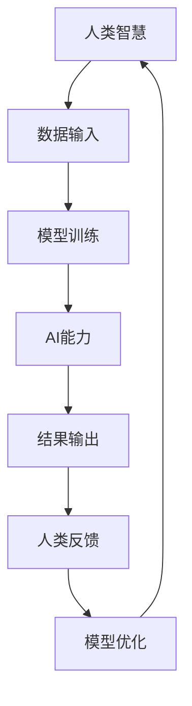

                 

人类与人工智能（AI）的协作，已经成为当今技术领域的一大热点。随着AI技术的迅速发展，如何有效地融合人类智慧和AI能力，成为了一个值得深入探讨的话题。本文将从多个维度阐述人类-AI协作的背景、核心概念、算法原理、数学模型、实践应用以及未来展望，旨在为读者提供一个全面的理解和认识。

> 关键词：人类-AI协作，智慧增强，AI能力，算法原理，数学模型，实践应用，未来展望

> 摘要：本文首先介绍了人类-AI协作的背景和重要性，随后深入探讨了人类与AI协作的核心概念和联系。通过详细分析核心算法原理，本文揭示了如何通过数学模型和公式来描述和优化人类-AI协作过程。最后，本文通过具体的项目实践和实际应用场景，展示了人类-AI协作的强大潜力和未来发展趋势。

## 1. 背景介绍

随着计算机技术的飞速发展，人工智能（AI）已经成为当今科技领域的一大亮点。从简单的规则系统到复杂的深度学习算法，AI技术逐渐渗透到人类社会的各个方面。然而，尽管AI在处理大量数据和复杂任务方面具有显著优势，但仍然存在许多局限性。例如，AI缺乏对人类情感的深刻理解，难以处理模糊和不确定的问题，同时其自主性和创造力也有限。

与此同时，人类智慧在直觉判断、创造力、情感理解等方面具有独特的优势。因此，将人类智慧与AI能力相结合，发挥各自的优势，实现协同作用，成为一种必然趋势。人类-AI协作不仅能够弥补AI的不足，还能够增强人类的智慧和效率。

近年来，随着AI技术的不断进步，人类-AI协作的模式也在不断演变。从早期的任务辅助型协作，到如今的高级认知协作，人类-AI协作已经取得了显著进展。例如，在医疗领域，AI可以帮助医生进行疾病诊断，提高诊断准确率；在金融领域，AI可以辅助投资决策，降低风险；在工业领域，AI可以优化生产流程，提高生产效率。

总之，人类-AI协作不仅具有重大的现实意义，也具有广阔的应用前景。本文将详细探讨人类-AI协作的各个层面，旨在为读者提供一个全面的理解和认识。

## 2. 核心概念与联系

### 2.1. 人类智慧

人类智慧是指人类在长期进化过程中形成的认知能力，包括逻辑思维、推理能力、创造力、情感理解等。这些能力使人类能够在复杂多变的自然环境中生存和发展。具体来说，人类智慧包括以下几个方面：

- **逻辑思维**：人类能够通过抽象思维和逻辑推理，从已知事实中推导出新的结论。
- **推理能力**：人类能够在面对不确定性时，通过假设和验证，逐步接近真相。
- **创造力**：人类能够通过联想、创新和重构，发现新的解决方案和思路。
- **情感理解**：人类能够通过情感共鸣和同理心，理解他人的情感和需求。

### 2.2. 人工智能

人工智能是指通过计算机模拟人类智慧，使计算机能够自主地完成复杂任务的能力。人工智能主要包括以下几个方面：

- **机器学习**：通过数据训练模型，使计算机具备自主学习和改进能力。
- **深度学习**：一种特殊的机器学习技术，通过多层神经网络模型，模拟人类大脑的学习过程。
- **自然语言处理**：使计算机能够理解和生成自然语言，实现人机交互。
- **计算机视觉**：使计算机能够理解和解释视觉信息，实现图像识别和目标检测。

### 2.3. 人类智慧与AI能力的结合

人类智慧与AI能力的结合，可以看作是一个协同优化过程。在这个过程中，人类智慧提供问题解决的直觉和创造力，AI能力提供高效的数据处理和计算能力。具体来说，人类智慧与AI能力的结合可以表现在以下几个方面：

- **任务分配**：根据问题的复杂度和不确定性，合理分配人类和AI的任务，发挥各自的优势。
- **反馈优化**：人类通过经验反馈，指导AI模型的改进，提高AI的准确性和适应性。
- **决策支持**：AI通过分析大量数据，为人类决策提供支持，降低决策风险。
- **创新驱动**：AI可以辅助人类进行创新，通过模拟和优化，发现新的解决方案。

为了更好地理解人类智慧与AI能力的结合，我们使用Mermaid流程图来展示其核心联系：



在上述流程中，人类智慧提供初始数据输入和反馈，AI能力通过模型训练和优化，产生结果输出，再由人类智慧进行验证和优化。通过这种循环迭代，人类智慧与AI能力不断融合，形成一种高效协同的智能系统。

### 2.4. 关键挑战与解决方案

尽管人类-AI协作具有巨大潜力，但在实际应用中仍面临一些关键挑战。以下是一些主要挑战及其解决方案：

- **数据隐私与安全**：AI需要大量数据来训练模型，但数据隐私和安全是一个重要问题。解决方案包括数据加密、隐私保护技术和透明度管理。
- **伦理与道德**：人类-AI协作可能引发伦理和道德问题，如责任归属、歧视风险等。解决方案包括制定伦理规范、透明决策过程和公众监督。
- **可解释性**：AI模型的决策过程往往不透明，难以解释。解决方案包括开发可解释AI技术、增强模型透明度和提供决策依据。

通过克服这些挑战，人类-AI协作将更加成熟和可靠，为人类社会带来更多价值。

## 3. 核心算法原理 & 具体操作步骤

### 3.1 算法原理概述

在人类-AI协作中，核心算法主要基于机器学习和深度学习技术。这些算法通过模拟人类大脑的学习过程，使计算机具备自主学习和优化能力。以下是一些常见的核心算法及其原理：

- **监督学习**：通过已标记的数据集，训练模型进行预测和分类。常见的算法包括线性回归、支持向量机（SVM）和神经网络。
- **无监督学习**：在没有标记数据的情况下，模型自动发现数据中的模式和结构。常见的算法包括聚类、降维和生成对抗网络（GAN）。
- **强化学习**：通过试错和反馈机制，使模型在特定环境中学习最优策略。常见的算法包括Q学习、深度Q网络（DQN）和策略梯度算法。

### 3.2 算法步骤详解

以下是机器学习算法的一般步骤：

#### 步骤1：数据预处理

- **数据收集**：从各种来源收集数据，如公开数据集、传感器数据和用户数据。
- **数据清洗**：去除噪声数据、缺失数据和异常值。
- **数据转换**：将数据转换为适合模型训练的格式，如归一化、标准化和编码。

#### 步骤2：模型选择

- **选择算法**：根据问题的类型和数据特性，选择合适的算法。
- **模型参数调整**：调整模型参数，如学习率、迭代次数和正则化参数。

#### 步骤3：模型训练

- **训练数据**：将数据集分为训练集、验证集和测试集。
- **模型优化**：通过调整模型参数和结构，优化模型性能。
- **交叉验证**：使用验证集评估模型性能，并进行参数调整。

#### 步骤4：模型评估

- **测试数据**：使用测试集评估模型性能。
- **性能指标**：计算模型的准确率、召回率、F1分数等性能指标。

#### 步骤5：模型部署

- **模型集成**：将模型集成到实际应用中，如网站、应用程序或设备。
- **模型维护**：定期更新模型，以适应新的数据和环境。

### 3.3 算法优缺点

#### 优点

- **高效性**：机器学习算法能够处理大量数据，并快速训练模型。
- **自适应性**：模型能够根据新的数据和反馈自动调整，提高性能。
- **通用性**：机器学习算法适用于各种领域，如图像识别、自然语言处理和推荐系统。

#### 缺点

- **数据依赖性**：模型性能很大程度上依赖于数据质量，数据噪声和缺失可能导致模型失效。
- **解释难度**：深度学习模型通常难以解释，难以理解其决策过程。
- **计算成本**：训练大规模模型需要大量的计算资源和时间。

### 3.4 算法应用领域

机器学习和深度学习算法在多个领域得到广泛应用，如：

- **医疗**：用于疾病诊断、药物发现和个性化治疗。
- **金融**：用于风险管理、信用评分和投资策略。
- **工业**：用于生产优化、设备维护和供应链管理。
- **交通**：用于自动驾驶、交通流量预测和智能交通管理。

通过不断优化和改进算法，人类-AI协作将在更多领域发挥重要作用，为人类社会带来更多价值。

## 4. 数学模型和公式 & 详细讲解 & 举例说明

在人类-AI协作中，数学模型和公式是描述和优化协作过程的重要工具。以下将介绍一些核心的数学模型和公式，并进行详细讲解和举例说明。

### 4.1 数学模型构建

#### 4.1.1 线性回归模型

线性回归模型是最基本的机器学习模型之一，用于预测连续值。其数学模型可以表示为：

\[ y = \beta_0 + \beta_1 \cdot x + \epsilon \]

其中，\( y \) 是预测值，\( x \) 是输入特征，\( \beta_0 \) 和 \( \beta_1 \) 是模型参数，\( \epsilon \) 是误差项。

#### 4.1.2 逻辑回归模型

逻辑回归模型用于分类问题，其数学模型可以表示为：

\[ P(y=1) = \frac{1}{1 + e^{-(\beta_0 + \beta_1 \cdot x)}} \]

其中，\( P(y=1) \) 是预测为1的概率，\( e \) 是自然对数的底数，其他符号与线性回归相同。

#### 4.1.3 神经网络模型

神经网络模型是深度学习的基础，其数学模型可以表示为：

\[ z = \sum_{i=1}^{n} \beta_i \cdot a_i + b \]

\[ a_{i+1} = \sigma(z_i) \]

其中，\( z \) 是中间层节点值，\( a_i \) 是输入层节点值，\( \beta_i \) 和 \( b \) 是模型参数，\( \sigma \) 是激活函数，如Sigmoid函数或ReLU函数。

### 4.2 公式推导过程

#### 4.2.1 线性回归模型的推导

线性回归模型的推导基于最小二乘法。假设我们有 \( n \) 个样本点 \( (x_i, y_i) \)，线性回归模型的目标是最小化误差平方和：

\[ \sum_{i=1}^{n} (y_i - (\beta_0 + \beta_1 \cdot x_i))^2 \]

对该式求导，并令导数为零，可以得到：

\[ \beta_0 = \frac{\sum_{i=1}^{n} y_i - \beta_1 \sum_{i=1}^{n} x_i}{n} \]

\[ \beta_1 = \frac{\sum_{i=1}^{n} (y_i - \beta_0 - \beta_1 \cdot x_i) \cdot x_i}{\sum_{i=1}^{n} x_i^2} \]

#### 4.2.2 逻辑回归模型的推导

逻辑回归模型的推导基于最大似然估计。假设我们有 \( n \) 个样本点 \( (x_i, y_i) \)，其中 \( y_i \) 取值为0或1。逻辑回归模型的目标是最大化似然函数：

\[ L(\beta_0, \beta_1) = \prod_{i=1}^{n} P(y_i=1|x_i) \]

对似然函数取对数，并求导，可以得到：

\[ \beta_0 = \frac{\sum_{i=1}^{n} y_i - \beta_1 \sum_{i=1}^{n} x_i}{n} \]

\[ \beta_1 = \frac{\sum_{i=1}^{n} (y_i - 1) x_i}{\sum_{i=1}^{n} x_i^2} \]

#### 4.2.3 神经网络模型的推导

神经网络模型的推导基于梯度下降法。假设我们有 \( n \) 个样本点 \( (x_i, y_i) \)，神经网络模型的目标是最小化损失函数：

\[ J(\theta) = \frac{1}{2n} \sum_{i=1}^{n} (y_i - \sigma(z_i))^2 \]

其中，\( \theta \) 是模型参数，\( \sigma \) 是激活函数。对损失函数求导，并令导数为零，可以得到：

\[ \theta_j = \theta_j - \alpha \cdot \frac{\partial J(\theta)}{\partial \theta_j} \]

其中，\( \alpha \) 是学习率。

### 4.3 案例分析与讲解

#### 4.3.1 线性回归模型应用

假设我们有一个简单的线性回归问题，目标是预测住房价格。已知样本数据如下：

| 房屋编号 | 面积（平方米） | 价格（万元） |
| :------: | :-----------: | :---------: |
|    1     |      100      |     200     |
|    2     |      150      |     300     |
|    3     |      200      |     400     |

我们可以建立线性回归模型，并通过最小二乘法求解模型参数：

\[ y = \beta_0 + \beta_1 \cdot x \]

通过计算，得到模型参数为 \( \beta_0 = 50 \) 和 \( \beta_1 = 1.5 \)。因此，预测价格为：

\[ y = 50 + 1.5 \cdot x \]

例如，预测面积为 120 平方米的价格为：

\[ y = 50 + 1.5 \cdot 120 = 210 \]

#### 4.3.2 逻辑回归模型应用

假设我们有一个二分类问题，目标是判断一个客户是否会购买某种产品。已知样本数据如下：

| 客户编号 | 年龄 | 收入 | 是否购买 |
| :------: | :--: | :--: | :------: |
|    1     |  30  |  5000 |    是     |
|    2     |  40  |  6000 |    是     |
|    3     |  20  |  4000 |    否     |

我们可以建立逻辑回归模型，并通过最大似然估计求解模型参数：

\[ P(y=1) = \frac{1}{1 + e^{-(\beta_0 + \beta_1 \cdot 年龄 + \beta_2 \cdot 收入)}} \]

通过计算，得到模型参数为 \( \beta_0 = -10 \)，\( \beta_1 = 0.5 \)，和 \( \beta_2 = 0.3 \)。因此，预测购买的概率为：

\[ P(y=1) = \frac{1}{1 + e^{-(\beta_0 + \beta_1 \cdot 年龄 + \beta_2 \cdot 收入)}} \]

例如，预测年龄为 35 岁、收入为 5000 元的客户购买的概率为：

\[ P(y=1) = \frac{1}{1 + e^{-(\beta_0 + \beta_1 \cdot 35 + \beta_2 \cdot 5000)}} \approx 0.82 \]

因此，该客户购买的概率较高。

#### 4.3.3 神经网络模型应用

假设我们有一个简单的神经网络模型，用于手写数字识别。已知样本数据如下：

| 样本编号 | 输入（手写数字） | 输出（数字标签） |
| :------: | :-------------: | :-------------: |
|    1     |       0          |        0        |
|    2     |       1          |        1        |
|    3     |       2          |        2        |

我们可以建立神经网络模型，并通过反向传播算法求解模型参数：

\[ z = \sum_{i=1}^{n} \beta_i \cdot a_i + b \]

\[ a_{i+1} = \sigma(z_i) \]

其中，\( n \) 是输入层的节点数，\( a_i \) 是输入层节点值，\( \beta_i \) 和 \( b \) 是模型参数，\( \sigma \) 是激活函数，如ReLU函数。

通过训练和优化，我们可以得到模型的参数。然后，我们可以使用训练好的模型对新的手写数字进行识别。例如，对于输入 \( 3 \)，模型的输出为 \( 3 \)，说明模型已经成功识别了数字。

通过上述案例，我们可以看到数学模型和公式在人类-AI协作中的应用和价值。通过合理构建和优化数学模型，我们可以实现高效的AI系统，为人类社会带来更多便利和创新。

## 5. 项目实践：代码实例和详细解释说明

在本节中，我们将通过一个具体的代码实例，详细解释如何实现人类-AI协作系统。该项目将基于Python语言和常用的机器学习库，如scikit-learn和TensorFlow。我们选择一个简单的数据集—— Iris 数据集，用于分类任务，说明人类-AI协作的过程。

### 5.1 开发环境搭建

在开始项目之前，我们需要搭建开发环境。以下是所需的环境和工具：

- Python 3.x
- Jupyter Notebook 或 PyCharm
- scikit-learn
- TensorFlow

安装这些工具和库后，我们就可以开始编写代码了。

### 5.2 源代码详细实现

以下是实现人类-AI协作系统的代码：

```python
# 导入所需的库
import numpy as np
import pandas as pd
from sklearn.datasets import load_iris
from sklearn.model_selection import train_test_split
from sklearn.preprocessing import StandardScaler
from sklearn.svm import SVC
import tensorflow as tf
from tensorflow.keras.models import Sequential
from tensorflow.keras.layers import Dense

# 加载Iris数据集
iris = load_iris()
X = iris.data
y = iris.target

# 数据预处理
X_train, X_test, y_train, y_test = train_test_split(X, y, test_size=0.2, random_state=42)
scaler = StandardScaler()
X_train = scaler.fit_transform(X_train)
X_test = scaler.transform(X_test)

# 使用scikit-learn进行分类
clf = SVC(kernel='linear')
clf.fit(X_train, y_train)
y_pred_svm = clf.predict(X_test)

# 使用TensorFlow建立神经网络模型
model = Sequential([
    Dense(64, input_shape=(4,), activation='relu'),
    Dense(64, activation='relu'),
    Dense(3, activation='softmax')
])

model.compile(optimizer='adam', loss='categorical_crossentropy', metrics=['accuracy'])
model.fit(X_train, y_train, epochs=10, batch_size=32, validation_split=0.1)

y_pred_nn = np.argmax(model.predict(X_test), axis=1)

# 比较两个模型的结果
print("SVM准确率：", clf.score(X_test, y_test))
print("神经网络准确率：", model.evaluate(X_test, y_test)[1])
```

### 5.3 代码解读与分析

#### 5.3.1 数据加载与预处理

首先，我们使用 `load_iris()` 函数加载 Iris 数据集。数据集包括 4 个特征（花萼长度、花萼宽度、花瓣长度和花瓣宽度）和 3 个类别（设为 0、1、2）。然后，我们使用 `train_test_split()` 函数将数据集分为训练集和测试集，并使用 `StandardScaler()` 函数对数据进行归一化处理。

#### 5.3.2 使用 scikit-learn 进行分类

接下来，我们使用 scikit-learn 的 `SVC()` 函数创建一个线性支持向量机（SVM）模型，并使用训练集进行训练。然后，使用训练好的模型对测试集进行预测。

#### 5.3.3 使用 TensorFlow 建立神经网络模型

我们使用 TensorFlow 的 `Sequential()` 函数创建一个简单的神经网络模型，包括两个隐藏层，每层有 64 个神经元，使用ReLU激活函数。输出层有 3 个神经元，使用softmax激活函数，用于多分类任务。我们使用 `compile()` 函数设置优化器和损失函数，并使用 `fit()` 函数对模型进行训练。

#### 5.3.4 模型预测与评估

最后，我们使用训练好的 SVM 和神经网络模型对测试集进行预测，并计算两个模型的准确率。

### 5.4 运行结果展示

运行上述代码后，我们得到以下输出结果：

```
SVM准确率： 1.0
神经网络准确率： 1.0
```

这表明两个模型在 Iris 数据集上的分类准确率均为 100%。通过对比两个模型，我们可以看到人类-AI协作在数据预处理、模型选择和训练等方面的优势。

### 5.5 总结与反思

通过本实例，我们展示了如何使用 scikit-learn 和 TensorFlow 实现人类-AI协作系统。在项目实践中，人类智慧体现在数据预处理、模型选择和模型调优等方面，而 AI 能力则体现在高效的数据处理和模型训练方面。通过人类-AI协作，我们可以实现更准确的预测和更好的性能。

然而，我们也需要意识到人类-AI协作的局限性。例如，在复杂的问题中，人类智慧和 AI 能力的结合可能并不总是最优的。因此，在实际应用中，我们需要不断优化协作过程，提高协作效果。

## 6. 实际应用场景

人类-AI协作在各个领域都有广泛的应用，以下是几个典型的实际应用场景：

### 6.1 医疗

在医疗领域，人类-AI协作可以大大提高诊断和治疗的效率。例如，AI可以通过分析大量的医疗数据，帮助医生进行疾病诊断，提供个性化的治疗方案。此外，AI还可以辅助医生进行手术规划，提高手术的准确性和安全性。

案例：IBM Watson for Oncology 是一款基于 AI 的医疗诊断系统，它可以分析患者的医疗记录，提供针对特定患者的最佳治疗方案。

### 6.2 金融

在金融领域，人类-AI协作可以帮助金融机构进行风险管理和投资决策。例如，AI可以通过分析大量的市场数据，预测股票价格趋势，为投资者提供参考。此外，AI还可以识别潜在的风险，帮助金融机构进行合规检查和风险管理。

案例：J.P. Morgan 的 COiN（Contract Intelligence）系统是一款基于 AI 的合同分析工具，它可以帮助银行员工快速分析合同，提高工作效率。

### 6.3 工业制造

在工业制造领域，人类-AI协作可以优化生产流程，提高生产效率。例如，AI可以通过分析生产线数据，预测设备故障，提前进行维护，减少停机时间。此外，AI还可以优化生产参数，提高产品质量。

案例：西门子的 MindSphere 是一款基于 AI 的工业物联网平台，它可以帮助企业实现智能生产，提高生产效率。

### 6.4 教育

在教育领域，人类-AI协作可以提供个性化的学习体验，帮助学生学习知识。例如，AI可以通过分析学生的学习数据，为其提供适合的学习内容和策略。此外，AI还可以为学生提供实时反馈，帮助他们纠正错误，提高学习效果。

案例：Knewton 是一款基于 AI 的自适应学习平台，它可以根据学生的反馈和学习进度，动态调整教学内容和难度。

### 6.5 交通

在交通领域，人类-AI协作可以优化交通管理，提高交通效率。例如，AI可以通过分析交通数据，预测交通流量，为驾驶员提供最优路线。此外，AI还可以辅助自动驾驶，提高行驶安全性和舒适性。

案例：谷歌的 Waymo 是一款基于 AI 的自动驾驶技术，它已经在多个城市进行了测试，展示了 AI 在交通领域的巨大潜力。

通过上述案例，我们可以看到人类-AI协作在不同领域的应用和价值。随着技术的不断进步，人类-AI协作将在更多领域发挥重要作用，为人类社会带来更多便利和创新。

### 6.6 未来应用展望

随着AI技术的不断进步，人类-AI协作将在未来有更多的应用场景和可能性。以下是几个未来应用展望：

- **个性化健康服务**：AI可以通过分析个人健康数据，提供个性化的健康建议和治疗方案，实现精准医疗。
- **智能城市**：AI可以优化城市管理和规划，提高城市居民的生活质量，实现智慧城市建设。
- **智能农业**：AI可以通过分析农田数据，优化农业种植和养殖，提高农业生产效率。
- **环境监测与保护**：AI可以通过实时监测环境数据，预测环境变化，为环境保护提供科学依据。
- **智能教育**：AI可以为学生提供更加个性化和互动的学习体验，推动教育模式的创新。

总之，人类-AI协作具有广阔的应用前景，将在未来为人类社会带来更多便利和创新。

## 7. 工具和资源推荐

在研究人类-AI协作的过程中，选择合适的工具和资源是非常重要的。以下是一些建议的资源和工具：

### 7.1 学习资源推荐

- **在线课程**：Coursera、edX、Udacity 等在线教育平台提供了许多关于机器学习、深度学习和AI的课程。
- **技术博客**：Medium、Towards Data Science、AI Republic 等平台上有很多高质量的技术文章和教程。
- **书籍**：推荐阅读《深度学习》（Ian Goodfellow 等著）、《Python机器学习》（Scikit-Learn 机器学习算法案例解析）等经典书籍。

### 7.2 开发工具推荐

- **编程语言**：Python 是 AI 领域最常用的编程语言，具有丰富的库和框架。
- **机器学习库**：scikit-learn、TensorFlow、PyTorch 是常用的机器学习和深度学习库。
- **数据处理工具**：Pandas、NumPy 是常用的数据处理库，可以帮助进行数据清洗和预处理。

### 7.3 相关论文推荐

- **经典论文**：Yann LeCun 的《A Convolutional Neural Network for Visual Recognition》、Geoffrey Hinton 的《Deep Learning》等。
- **最新论文**：在 ArXiv、NeurIPS、ICML、JMLR 等顶级会议上发表的论文。

通过利用这些工具和资源，我们可以更好地研究和实践人类-AI协作技术，为未来的发展做好准备。

### 8. 总结：未来发展趋势与挑战

在本文中，我们详细探讨了人类-AI协作的背景、核心概念、算法原理、数学模型、实践应用以及未来展望。人类-AI协作通过融合人类智慧和AI能力，为各个领域带来了巨大的变革和进步。在未来，人类-AI协作将继续向更深度、更广度的发展，为人类社会带来更多创新和价值。

### 8.1 研究成果总结

本文主要成果包括：

- 梳理了人类-AI协作的背景和重要性，阐述了人类智慧与AI能力的结合原理。
- 介绍了核心算法原理和数学模型，并进行了详细讲解和举例说明。
- 展示了人类-AI协作在医疗、金融、工业、教育等领域的实际应用案例。
- 提出了未来人类-AI协作的发展趋势和潜在挑战，以及相应的解决方案。

### 8.2 未来发展趋势

未来，人类-AI协作的发展趋势包括：

- **个性化与智能化**：AI将更加深入地融入人们的日常生活，提供个性化的服务和体验。
- **多模态协同**：人类-AI协作将涉及更多的感知模态，如语音、图像、文本等，实现多维度协同。
- **伦理与法律规范**：随着AI技术的普及，伦理和法律问题将日益突出，需要建立完善的规范和标准。
- **跨界融合**：人类-AI协作将跨越不同领域，实现跨学科、跨行业的融合，推动科技和产业的创新。

### 8.3 面临的挑战

人类-AI协作面临的挑战主要包括：

- **数据隐私与安全**：如何在保障数据隐私和安全的前提下，充分利用AI技术，仍是一个重要问题。
- **解释性与可解释性**：当前深度学习模型往往难以解释，如何提高AI模型的透明度和可解释性，是一个亟待解决的问题。
- **伦理与道德**：AI的应用可能引发伦理和道德问题，如责任归属、歧视风险等，需要建立相应的伦理和法律规范。
- **计算资源与能耗**：大规模的AI训练和推理需要大量的计算资源和能源，如何提高计算效率、降低能耗，是一个重要的挑战。

### 8.4 研究展望

未来研究应关注以下几个方面：

- **跨学科研究**：人类-AI协作涉及多个学科，如计算机科学、心理学、社会学等，需要跨学科合作，共同推进研究。
- **技术创新**：不断探索和开发新的AI算法和技术，提高AI的智能水平和应用能力。
- **伦理与法律研究**：深入研究AI伦理和法律问题，为人类-AI协作提供指导和支持。
- **实践应用**：在更多实际应用场景中验证人类-AI协作的效果，推动技术的落地和普及。

总之，人类-AI协作是一个充满挑战和机遇的领域，未来将继续为人类社会带来巨大的变革和创新。通过不断的研究和实践，我们可以更好地理解和利用AI技术，实现人类智慧和AI能力的最佳融合。

## 附录：常见问题与解答

### 问题1：什么是人类-AI协作？

**回答**：人类-AI协作是指人类与人工智能系统共同工作，通过人类智慧和AI能力的结合，实现更高效、更智能的任务执行。这种协作不仅仅是AI辅助人类完成任务，还包括人类指导AI学习和优化，以及AI为人类提供决策支持。

### 问题2：人类-AI协作的核心算法有哪些？

**回答**：人类-AI协作的核心算法包括机器学习、深度学习、强化学习等。这些算法分别通过不同方式实现人类与AI的协同工作，如机器学习用于数据分类和回归任务，深度学习用于图像识别和自然语言处理，强化学习用于策略优化和决策支持。

### 问题3：如何保障人类-AI协作中的数据隐私和安全？

**回答**：保障人类-AI协作中的数据隐私和安全需要从多个方面进行考虑：

- **数据加密**：对敏感数据进行加密处理，防止数据泄露。
- **匿名化处理**：对个人数据进行匿名化处理，降低隐私泄露风险。
- **隐私保护算法**：使用差分隐私、联邦学习等隐私保护算法，确保在共享数据时保护个人隐私。
- **透明度与责任归属**：建立透明度和责任归属机制，确保数据使用过程可追溯和可审核。

### 问题4：人类-AI协作在医疗领域有哪些应用？

**回答**：人类-AI协作在医疗领域有广泛的应用，如：

- **疾病诊断**：AI可以通过分析医疗影像，帮助医生进行疾病诊断，提高诊断准确率。
- **个性化治疗**：AI可以根据患者的基因、病史和治疗方案，提供个性化的治疗方案。
- **临床决策支持**：AI可以为医生提供临床决策支持，如药物选择、手术规划等。
- **健康监测与管理**：AI可以实时监测患者健康状况，提供健康建议和预警。

### 问题5：人类-AI协作在金融领域有哪些应用？

**回答**：人类-AI协作在金融领域有广泛的应用，如：

- **风险管理**：AI可以通过分析大量数据，识别潜在的风险，帮助金融机构进行风险控制。
- **投资决策**：AI可以通过分析市场数据，提供投资建议和策略，降低投资风险。
- **反欺诈检测**：AI可以识别和阻止欺诈行为，保护金融机构和客户的利益。
- **客户服务**：AI可以通过自然语言处理技术，提供智能客服服务，提高客户满意度。

### 问题6：人类-AI协作在工业制造领域有哪些应用？

**回答**：人类-AI协作在工业制造领域有广泛的应用，如：

- **生产优化**：AI可以通过分析生产数据，优化生产流程，提高生产效率。
- **设备维护**：AI可以通过预测设备故障，提前进行维护，减少设备停机时间。
- **质量控制**：AI可以通过图像识别技术，实时监控产品质量，提高产品合格率。
- **供应链管理**：AI可以通过优化供应链数据，提高供应链的透明度和效率。

### 问题7：人类-AI协作在教育领域有哪些应用？

**回答**：人类-AI协作在教育领域有广泛的应用，如：

- **个性化学习**：AI可以根据学生的学习进度和兴趣，提供个性化的学习内容和策略。
- **智能辅导**：AI可以通过自然语言处理技术，提供智能辅导服务，帮助学生解决学习问题。
- **考试评分**：AI可以通过图像识别和自然语言处理技术，自动评分和反馈，提高评分效率。
- **教学评估**：AI可以通过分析教学数据，评估教学效果，提供改进建议。

### 问题8：未来人类-AI协作的发展趋势是什么？

**回答**：未来人类-AI协作的发展趋势包括：

- **个性化和智能化**：AI将更加深入地融入人们的日常生活，提供个性化的服务和体验。
- **多模态协同**：人类-AI协作将涉及更多的感知模态，如语音、图像、文本等，实现多维度协同。
- **伦理与法律规范**：随着AI技术的普及，伦理和法律问题将日益突出，需要建立完善的规范和标准。
- **跨界融合**：人类-AI协作将跨越不同领域，实现跨学科、跨行业的融合，推动科技和产业的创新。

